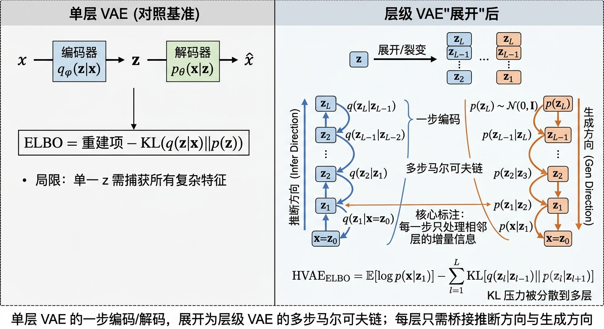

# 10.1 从 VAE 到层级 VAE

> **核心观点**：单层 VAE 的编码器必须"一步"把数据压成潜变量，表达力被卡死。层级 VAE 把潜变量扩成多层 $z_1,\ldots,z_L$，把编码/解码拆成一条马尔可夫链上的小步变换，表达力大增。它的训练目标——层级 ELBO——是单层 ELBO 的自然推广：每多一层，就多一个 KL 散度项（KL divergence，衡量两个分布差异的量，越大越不像）。

---

## 单层 VAE 的痛：一步跨太大

回忆第9章的 VAE（variational autoencoder，变分自编码器）。数据 $x$（比如一张图）经过编码器（encoder，把数据压成潜变量的网络）映射到一个潜变量（latent variable，数据背后看不见的随机变量）$z$，再经解码器（decoder，从潜变量重建数据的网络）还原：

$$\mathbf{x} \xrightarrow{\text{编码器 } q_\phi(\mathbf{z}|\mathbf{x})} \mathbf{z} \xrightarrow{\text{解码器 } p_\theta(\mathbf{x}|\mathbf{z})} \hat{\mathbf{x}}$$

它的训练目标是 ELBO（evidence lower bound，证据下界，对数似然的一个可计算的下界），分两项：

$$\text{ELBO}(\mathbf{x}) = \underbrace{\mathbb{E}_{q_\phi(\mathbf{z}|\mathbf{x})}[\log p_\theta(\mathbf{x}|\mathbf{z})]}_{\text{重建项（让解码器还原数据）}} - \underbrace{D_{\text{KL}}(q_\phi(\mathbf{z}|\mathbf{x}) \| p(\mathbf{z}))}_{\text{KL 项（让编码器靠近先验）}}$$

这个结构很优雅，但有个绕不开的表达瓶颈。下面三点其实是同一个毛病的三种说法。

**痛点 1：单步编码的信息瓶颈。** 编码器要把一张复杂图的全部信息，压缩进一个潜变量 $z$。当数据分布复杂（比如自然图像）时，真实后验 $p(z|x)$ 往往是多模态的——同一张图可能有好几种合理的编码方式。可 VAE 的编码器通常是个单高斯 $q_\phi(z|x)=\mathcal{N}(\mu_\phi(x),\sigma_\phi^2(x)I)$，一个高斯怎么也描不出"多峰"的形状。

**痛点 2：KL 正则的两难。** KL 项逼着编码分布靠近标准高斯先验 $p(z)=\mathcal{N}(0,I)$。卡紧了，潜空间（latent space，潜变量取值构成的空间）规矩、好采样，但信息被丢光——重建出来糊成一团；放松了，潜空间乱七八糟——从先验里随便采个点，解码出来可能是块无意义色块。这就是 VAE 著名的"KL 塌陷 / 后验塌陷"（posterior collapse，潜变量失去信息、退化成先验）。

**痛点 3：生成质量的天花板。** 单步解码器 $p_\theta(x|z)$ 要拿一个"简单"的潜变量，直接生成"复杂"的数据。对高清图来说这跨距太大——解码器得同时处理纹理、结构、语义好几层特征，顾此失彼。

**一条路引出来**：把"一步到位"拆成"多步"。如果编码器不必一步吞下所有信息，而是一层一层地抽特征，每一步只处理一个"微小变化"，瓶颈就散了。这就是层级 VAE（hierarchical VAE，多层潜变量的 VAE）的动机。

---

## 层级潜变量：把一条大跨距拆成许多小跨距

层级 VAE 的核心改动，是把单层潜变量 $z$ 扩成 $L$ 层：$z_1,z_2,\ldots,z_L$，排成一条层级链：

$$\mathbf{z}_L \to \mathbf{z}_{L-1} \to \cdots \to \mathbf{z}_1 \to \mathbf{x}$$

### 生成过程（自顶向下）：从噪声里"长"出数据

生成（generation，从潜变量造数据）从最高层 $z_L$ 出发，一层层往下造：

$$p(\mathbf{z}_L) \to p(\mathbf{z}_{L-1}|\mathbf{z}_L) \to \cdots \to p(\mathbf{z}_1|\mathbf{z}_2) \to p(\mathbf{x}|\mathbf{z}_1)$$

最高层的先验 $p(z_L)$ 通常取标准高斯 $\mathcal{N}(0,I)$。每一层的条件分布 $p(z_l|z_{l+1})$（给定上一层、本层长什么样的概率）由神经网络参数化。

### 推断过程（自底向上）：从数据里"提炼"特征

推断（inference，从数据反推潜变量）从数据出发，一层层往上抽：

$$q(\mathbf{z}_1|\mathbf{x}) \to q(\mathbf{z}_2|\mathbf{z}_1) \to \cdots \to q(\mathbf{z}_L|\mathbf{z}_{L-1})$$

推断分布 $q(z_l|z_{l-1})$ 也由神经网络参数化，约定 $z_0\equiv x$（把原始数据当作第 0 层）。

### 直觉：每层负责一个抽象级别

拿图像举例，不同层管不同层次的特征：

- **底层 $z_1$**：边缘、纹理这类低级特征；
- **中层 $z_2,z_3$**：形状、结构这类中级特征；
- **顶层 $z_L$**：类别、语义这类高级特征。

关键在：每层只需桥接相邻两层之间的"增量信息"，而不是一步从数据跨到先验。每一层只修正一小点信念——这正是我们开头说的"信念更新分散到长链上"。

*图 10.1：单层 VAE 把"数据→潜变量→数据"压成一步（左）；层级 VAE 把这个潜变量"展开"为多层马尔可夫链（右），推断链自底向上编码、生成链自顶向下去码，每一层只桥接相邻层的增量信息，KL 压力被分散到多层。*

---

## 马尔可夫推断链：为什么"只信邻居"

层级 VAE 的关键假设是**马尔可夫性**（Markov property，某一步只依赖紧邻的上一步、不回头看更早历史的特性）。

### 推断链的拆解

联合推断分布被拆成链式乘积：

$$q(\mathbf{z}_{1:L}|\mathbf{x}) = \prod_{l=1}^{L} q(\mathbf{z}_l|\mathbf{z}_{l-1})$$

其中 $z_0\equiv x$。意思是：要推断第 $l$ 层的 $z_l$，只用第 $l-1$ 层的信息就够了，不必翻回更底层。

### 生成链的拆解

联合生成分布也同理：

$$p(\mathbf{z}_{1:L}, \mathbf{x}) = p(\mathbf{z}_L) \prod_{l=L-1}^{1} p(\mathbf{z}_l|\mathbf{z}_{l+1}) \cdot p(\mathbf{x}|\mathbf{z}_1)$$

生成第 $l$ 层，只需知道第 $l+1$ 层。

### 马尔可夫性带来的两个甜头

1. **算得快**：每一层的推断和生成都是局部操作，不用处理全局依赖。每一步都是低维映射，层级结构才能高效训练。
2. **训得稳**：非马尔可夫模型里梯度要穿透多层，容易消失或爆炸；马尔可夫链的局部结构让每层能相对独立地优化。

### 和非马尔可夫层级模型的区别

一般层级模型允许"跳跃连接"（比如让第 $l$ 层也直接看数据 $x$ 和所有低层），表达力更强，但代价是：计算图更复杂、无法并行、而且——**和扩散模型的对应会断掉**。

**关键洞察**：正是马尔可夫性，让层级 VAE 和扩散模型产生了深刻对应。当层数趋于无穷，这条马尔可夫链就变成马尔可夫过程（Markov process，连续时间的马尔可夫链），也就是扩散过程。这一点我们留到 10.4 收尾时揭晓。

---

## 层级 ELBO 推导：从单层到多层的"自然加项"

目标还是最大化 ELBO，只是现在联合潜变量更复杂了。我们从单层出发，一步步推广。

### 从单层到层级

回忆单层 ELBO 是怎么来的（第8章）：

$$\log p(\mathbf{x}) = \text{ELBO}(\mathbf{x}) + D_{\text{KL}}(q_\phi(\mathbf{z}|\mathbf{x}) \| p(\mathbf{z}|\mathbf{x}))$$

等号右边第二项就是"变分间隙"（variational gap，近似分布和真实后验的差距，≥0）。把单潜变量 $z$ 换成联合潜变量 $z_{1:L}$，同样推导给出：

$$\log p(\mathbf{x}) = \underbrace{\mathbb{E}_{q(\mathbf{z}_{1:L}|\mathbf{x})}\left[\log \frac{p(\mathbf{x}, \mathbf{z}_{1:L})}{q(\mathbf{z}_{1:L}|\mathbf{x})}\right]}_{\text{层级 ELBO}} + \underbrace{D_{\text{KL}}(q(\mathbf{z}_{1:L}|\mathbf{x}) \| p(\mathbf{z}_{1:L}|\mathbf{x}))}_{\text{变分间隙} \geq 0}$$

### 用马尔可夫性拆开

把联合生成分布和联合推断分布按马尔可夫结构展开：

$$p(\mathbf{x}, \mathbf{z}_{1:L}) = p(\mathbf{z}_L) \prod_{l=1}^{L-1} p(\mathbf{z}_l|\mathbf{z}_{l+1}) \cdot p(\mathbf{x}|\mathbf{z}_1)$$

$$q(\mathbf{z}_{1:L}|\mathbf{x}) = \prod_{l=1}^{L} q(\mathbf{z}_l|\mathbf{z}_{l-1})$$

代入 ELBO 定义，把 $p$ 和 $q$ 配对后，得到（约定 $z_0\equiv x$，$p(z_L|z_{L+1})\equiv p(z_L)$）：

$$\boxed{\text{ELBO}(\mathbf{x}) = \mathbb{E}_{q(\mathbf{z}_{1:L}|\mathbf{x})}[\log p(\mathbf{x}|\mathbf{z}_1)] - \sum_{l=1}^{L} \mathbb{E}_{q(\mathbf{z}_{l-1}, \mathbf{z}_{l+1}|\mathbf{x})}\left[D_{\text{KL}}\left(q(\mathbf{z}_l|\mathbf{z}_{l-1}) \| p(\mathbf{z}_l|\mathbf{z}_{l+1})\right)\right]}$$

> 看进公式之前先抓直觉：左边第一项是"重建项"（还是让解码器还原数据）；右边那一长串求和，是**每一层一个 KL 项**。推断链从底往上、生成链从顶往下，每一层的 KL 项都在逼这两条链"对齐"。单层 ELBO 只是这里 $L=1$ 的特例。完整的代数细节见附录 10A。

### 直觉对照表

| 项 | 单层 VAE | 层级 VAE |
|---|---|---|
| 重建项 | $\mathbb{E}_q[\log p(\mathbf{x}\|\mathbf{z})]$ | $\mathbb{E}_q[\log p(\mathbf{x}\|\mathbf{z}_1)]$ |
| KL 项 | $D_{\text{KL}}(q(\mathbf{z}\|\mathbf{x}) \| p(\mathbf{z}))$ | $\sum_{l=1}^{L} D_{\text{KL}}(q(\mathbf{z}_l\|\mathbf{z}_{l-1}) \| p(\mathbf{z}_l\|\mathbf{z}_{l+1}))$ |

**一句话**：层级 ELBO = 单层 ELBO 的"分层版"——每多一层，就多一个"让本层推断分布对齐本层生成分布"的 KL 约束。

### 关键观察：每层 KL 互相独立

这串求和有个好性质——**每一层的 KL 项是独立的**。所以：

- 训练时可以逐层优化，不必同时动所有层；
- 每层对总 ELBO 的贡献可单独评估；
- 某层 KL 已经很小（推断与生成对齐了），可以冻结它，专攻别的层。

这个性质在扩散模型里至关重要：当层数到几百、几千时，"逐层可优化"是训练能跑起来的前提。

---

## 一个小例子：两层高斯，先猜再揭

为了不让你觉得公式悬空，我们用一个最简的具体设定体会一下。假设每一层都是高斯（这是后面接扩散的伏笔）：

- 数据 $x$（标量，先想成一维）先验是标准高斯 $p(z_2)=\mathcal{N}(0,1)$；
- 生成链：$z_1|z_2\sim\mathcal{N}(z_2,1)$，$x|z_1\sim\mathcal{N}(z_1,1)$（每步加单位方差噪声）；
- 推断链：$q(z_1|x)=\mathcal{N}(x,1)$，$q(z_2|z_1)=\mathcal{N}(z_1,1)$。

**请你先猜**：在这种"推断和生成几乎对称"的两层结构里，第一层（离数据近的 $z_1$）和第二层（更抽象的 $z_2$）的 KL 项，哪个更大？

（直觉可能是"两层差不多大"。）

**揭晓**：因为推断第一层直接吃原始数据 $x$、要编码最多细节，而第二层吃的是已经"压缩过"的 $z_1$，所以通常 **KL₁ > KL₂**——靠近数据的那一层，扛了最多的信息量。这正是实验 10.1-1 会在数字上验证的结论（见下一节），也呼应了"每层只修正一小点信念、但越靠数据那层修正得越多"的叙事。

---

## 实验 10.1-1：层级 VAE 实现与 ELBO 验证

实验 `10.1-1.py` 在 MNIST 上手写数字上对比**层级 VAE 与单层 VAE**，验证层级 ELBO 的逐层 KL 分解，看看马尔可夫推断链到底怎么编码信息。

### 实验场景

- **单层 VAE**：编码器把 $x$ 直接映射到 $z$，解码器一步重建。ELBO = 重建项 − 单个 KL 项：
  $$\text{ELBO} = \mathbb{E}_q[\log p(\mathbf{x}|\mathbf{z})] - D_{\text{KL}}(q(\mathbf{z}|\mathbf{x}) \| p(\mathbf{z}))$$
- **层级 VAE（$L=2$）**：引入两层 $z_1,z_2$，形成推断链 $x\to z_1\to z_2$、生成链 $z_2\to z_1\to x$。层级 ELBO 拆成：
  $$\text{ELBO} = \mathbb{E}_q[\log p(\mathbf{x}|\mathbf{z}_1)] - D_{\text{KL}}(q(\mathbf{z}_1|\mathbf{x}) \| p(\mathbf{z}_1)) - D_{\text{KL}}(q(\mathbf{z}_2|\mathbf{z}_1) \| p(\mathbf{z}_2))$$

### 实验目的

1. 验证马尔可夫推断链怎么实现（编码器分两步抽特征，每步只处理"增量信息"）；
2. 验证层级 ELBO 的逐层 KL 分解：ELBO = 重建项 − KL₁ − KL₂；
3. 验证"第一层编码更多"：预期 KL₁ > KL₂；
4. 对比层级 VAE 与单层 VAE，看层级结构如何缓解信息瓶颈与 KL 两难。

### 实验输入

| 参数 | 设置 |
|------|------|
| 数据集 | MNIST，训练 60000、测试 10000 |
| 层级 VAE 架构 | $L=2$ 层，$d_1=20$ 维，$d_2=10$ 维 |
| 单层 VAE 架构 | $L=1$ 层，$d_z=20$ 维 |
| 训练轮数 | 20 epochs；批大小 128；学习率 1e-3 |
| 潜变量分布 | 高斯 $q(z_l|z_{l-1})=\mathcal{N}(\mu_l,\sigma_l^2 I)$ |
| 先验分布 | 标准高斯 $p(z_L)=\mathcal{N}(0,I)$ |

### 预期结果

- 层级 ELBO 成功拆成 重建项 + KL₁ + KL₂；
- KL₁ > KL₂，验证"第一层编码更多"；
- 层级 VAE 的 KL 总量可能小于单层（KL 压力被分散）；
- 层级 VAE 重建损失可能略高（信息过了两层瓶颈）。

### 实验结果

运行 `10.1-1.py` 生成两张图。

#### 步骤1：训练曲线对比

| 模型 | 最终损失 | 训练轮数 |
|------|----------|----------|
| 层级 VAE（$L=2$） | 170.95 | 20 epochs |
| 单层 VAE（$L=1$） | 104.10 | 20 epochs |

层级 VAE 损失值更高，是因为信息过了两层瓶颈、且 ELBO 含两个 KL 项。但这不表示它更差——它的优势在生成质量和先验建模灵活性，不在单纯重建损失。

#### 步骤2：重建与采样对比

- **信息瓶颈**：单层一步压全部信息到 $z$；层级分两步（$\to z_1\to z_2$），每层只处理增量；
- **KL 两难**：单层面临"强 KL→糊、弱 KL→采样无意义"；层级提供更灵活先验；
- **生成天花板**：单步解码跨距大；层级逐级恢复，跨距小。

#### 步骤3：层级 ELBO 逐项验证

| 项 | 数值 | 说明 |
|---|------|------|
| 重建项 | $-E[\log p(\mathbf{x}\|\mathbf{z}_1)] = 164.28$ | 解码器重建损失 |
| KL₁ | $D_{\text{KL}}(q(\mathbf{z}_1\|\mathbf{x}) \| p(\mathbf{z}_1)) = 3.92$ | 第一层匹配度 |
| KL₂ | $D_{\text{KL}}(q(\mathbf{z}_2\|\mathbf{z}_1) \| p(\mathbf{z}_2)) = 3.64$ | 第二层匹配度 |
| **总 ELBO** | $-\text{ELBO} = 171.84$ | 训练目标 |

**关键验证**：KL₁/KL₂ = 1.08，证实第一层（靠近数据）编码更多——它直接从 $x$ 推断、抓细节；第二层从 $z_1$ 推断、更抽象。

| 模型 | 重建项 | KL 总量 | ELBO |
|------|--------|--------|------|
| 层级 VAE（$L=2$） | 164.28 | 7.56 | -171.84 |
| 单层 VAE（$L=1$） | 78.24 | 25.55 | -103.79 |

观察：层级 VAE 的 KL 总量（7.56）远小于单层（25.55）。原因可能是 KL 压力被分散到两层、且总维度不同；本实验未控总维度做消融，但和"层级缓解 KL 两难"的直觉一致。

#### 核心知识点总结

1. **马尔可夫推断链**：两层编码器各自输出 $(\mu,\log\sigma^2)$，重参数化（reparameterization，把随机采样改写成"确定性变换 + 固定噪声"的技巧，见第9章）每层独立。
2. **层级 ELBO 逐层 KL**：ELBO = 重建项 − KL₁ − KL₂；KL₁ > KL₂。
3. **层级 VAE 优势**：缓解信息瓶颈、缓解 KL 两难、提升生成质量。
4. **预告**：当 $L\to\infty$，马尔可夫链变成扩散过程——层级 VAE 是扩散的离散前身（10.4 收尾）。

---

层级 VAE 给了我们更灵活的生成框架。但还有一个问题没回答：每一步的转移分布 $q(z_l|z_{l-1})$ 和 $p(z_l|z_{l+1})$ 该怎么选？当这些转移取成**特定的高斯**时，一个惊人的对应浮现了——编码器的每一步就是"加噪"，解码器的每一步就是"去噪"。下节见分晓。

**来源**：Tutorial on Diffusion Models for Imaging and Vision Sec 1-2; Kingma & Welling (2014); Rezende et al. (2014); Sønderby et al. (2016) LVAE
