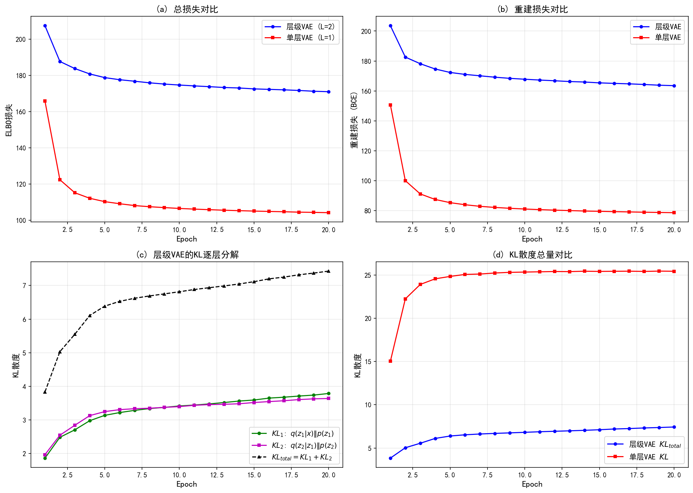
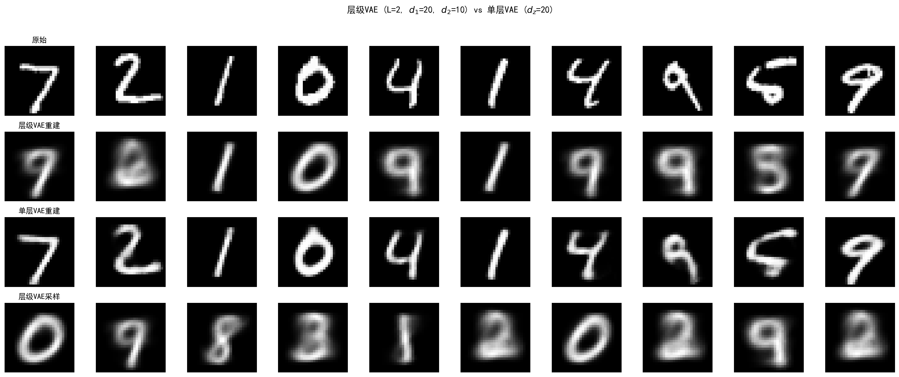

# 10.1 从VAE到层级VAE

> **核心观点**：单层VAE的编码器需要一步完成"数据→潜变量"的映射，表达能力受限。层级VAE引入多层潜变量 $z_1, \ldots, z_L$，将编码/解码分解为马尔可夫链上的逐步变换，大幅增强模型的表达能力。层级ELBO是单层ELBO的自然推广——每一层引入一个KL散度项，约束推断分布与生成分布的匹配。

---

## 单层VAE的局限

第9章建立的VAE框架中，数据 $\mathbf{x}$ 通过编码器映射到单个潜变量 $\mathbf{z}$，再由解码器重建：

$$\mathbf{x} \xrightarrow{\text{编码器 } q_\phi(\mathbf{z}|\mathbf{x})} \mathbf{z} \xrightarrow{\text{解码器 } p_\theta(\mathbf{x}|\mathbf{z})} \hat{\mathbf{x}}$$

训练目标ELBO分为两项：

$$\text{ELBO}(\mathbf{x}) = \underbrace{\mathbb{E}_{q_\phi(\mathbf{z}|\mathbf{x})}[\log p_\theta(\mathbf{x}|\mathbf{z})]}_{\text{重建项}} - \underbrace{D_{\text{KL}}(q_\phi(\mathbf{z}|\mathbf{x}) \| p(\mathbf{z}))}_{\text{KL项}}$$

这一结构虽然优雅，但存在根本性的表达瓶颈：

**局限1：单步编码的信息瓶颈。** 编码器需要将数据 $\mathbf{x}$ 的全部信息压缩到单个潜变量 $\mathbf{z}$ 中。当数据分布复杂（如自然图像）时，真实后验 $p(\mathbf{z}|\mathbf{x})$ 往往是多模态的——同一种图像特征可能有多种编码方式。但VAE通常使用高斯编码器 $q_\phi(\mathbf{z}|\mathbf{x}) = \mathcal{N}(\boldsymbol{\mu}_\phi(\mathbf{x}), \boldsymbol{\sigma}_\phi^2(\mathbf{x})\mathbf{I})$，单高斯无法表达多模态后验。

**局限2：KL正则化的两难。** KL项迫使编码分布接近标准高斯先验 $p(\mathbf{z}) = \mathcal{N}(\mathbf{0}, \mathbf{I})$。强KL约束使潜空间规则、易于采样，但代价是信息丢失——重建模糊；弱KL约束保留更多细节，但潜空间不规则——从先验采样的点可能对应无意义的生成结果。这就是VAE著名的"KL塌陷"（KL collapse）或"后验塌陷"问题。

**局限3：生成质量的天花板。** 单步解码器 $p_\theta(\mathbf{x}|\mathbf{z})$ 需要从一个"简单"的潜变量直接生成"复杂"的数据。对于高分辨率自然图像，这一步跨距太大——解码器需要同时处理纹理、结构、语义等多个层次的特征，难以兼顾。

这些局限指向同一个解决方向：**将一步编码/解码分解为多步**。如果编码器不必一步压缩所有信息，而是一层一层地逐步提取特征，每一步只需处理一个"微小变化"，表达瓶颈就不复存在。这正是层级VAE的动机。

---

## 层级潜变量的引入

层级VAE的核心修改是将单层潜变量 $\mathbf{z}$ 扩展为 $L$ 层潜变量 $\mathbf{z}_1, \mathbf{z}_2, \ldots, \mathbf{z}_L$，形成一个层级结构：

$$\mathbf{z}_L \to \mathbf{z}_{L-1} \to \cdots \to \mathbf{z}_1 \to \mathbf{x}$$

### 生成过程（自顶向下）

层级VAE的生成过程从最高层潜变量开始，逐层向下生成：

$$p(\mathbf{z}_L) \to p(\mathbf{z}_{L-1}|\mathbf{z}_L) \to \cdots \to p(\mathbf{z}_1|\mathbf{z}_2) \to p(\mathbf{x}|\mathbf{z}_1)$$

最高层先验 $p(\mathbf{z}_L)$ 通常是标准高斯 $\mathcal{N}(\mathbf{0}, \mathbf{I})$。每一层的条件分布 $p(\mathbf{z}_l|\mathbf{z}_{l+1})$ 由神经网络参数化。

### 推断过程（自底向上）

推断过程从数据出发，逐层向上推断潜变量：

$$q(\mathbf{z}_1|\mathbf{x}) \to q(\mathbf{z}_2|\mathbf{z}_1) \to \cdots \to q(\mathbf{z}_L|\mathbf{z}_{L-1})$$

推断分布 $q(\mathbf{z}_l|\mathbf{z}_{l-1})$ 同样由神经网络参数化，其中约定 $\mathbf{z}_0 \equiv \mathbf{x}$。

### 直观理解

不同层级的潜变量编码不同抽象级别的特征。以图像为例：

- **底层** $\mathbf{z}_1$：编码局部纹理、边缘等低级特征
- **中层** $\mathbf{z}_2, \mathbf{z}_3$：编码形状、结构等中级特征
- **顶层** $\mathbf{z}_L$：编码语义、类别等高级特征

这种分层结构使得每一层只需处理相邻层之间的"增量信息"，而非一步完成从数据到先验的巨大跨度。

---

## 马尔可夫推断链

层级VAE的关键结构假设是**马尔可夫性**：每一层的潜变量只依赖于相邻层，而非所有其他层。

### 推断链的马尔可夫结构

联合推断分布分解为：

$$q(\mathbf{z}_{1:L}|\mathbf{x}) = \prod_{l=1}^{L} q(\mathbf{z}_l|\mathbf{z}_{l-1})$$

其中 $\mathbf{z}_0 \equiv \mathbf{x}$。这意味着推断第 $l$ 层潜变量 $\mathbf{z}_l$ 时，只需要第 $l-1$ 层的信息 $\mathbf{z}_{l-1}$，无需回溯到更低的层。

### 生成链的马尔可夫结构

联合生成分布分解为：

$$p(\mathbf{z}_{1:L}, \mathbf{x}) = p(\mathbf{z}_L) \prod_{l=L-1}^{1} p(\mathbf{z}_l|\mathbf{z}_{l+1}) \cdot p(\mathbf{x}|\mathbf{z}_1)$$

同样，生成第 $l$ 层只需知道第 $l+1$ 层。

### 马尔可夫性的好处

马尔可夫性带来两个关键优势：

1. **计算效率**：每一层的推断和生成都是局部操作，无需处理全局依赖。这使得层级结构可以高效训练——每一步的条件分布都是低维映射。

2. **训练稳定性**：在非马尔可夫的层级模型中，梯度需要穿透多层依赖，容易出现梯度消失/爆炸。马尔可夫链的局部结构使每一层可以相对独立地优化，缓解了深度模型的训练难题。

### 与非马尔可夫层级模型的对比

一般的层级模型允许任意依赖结构，例如 $q(\mathbf{z}_l|\mathbf{x}, \mathbf{z}_1, \ldots, \mathbf{z}_{l-1})$，即每一层的推断可以参考数据本身和所有低层潜变量。这种"跳跃连接"结构（如LVAE中的横向连接）可以提供更强的表达能力，但代价是：
- 计算图更复杂，训练更困难
- 推断时需要所有低层信息，无法并行
- 与扩散模型的对应关系不再成立

**关键洞察**：正是马尔可夫性使得层级VAE与扩散模型产生了深刻的对应——当层数趋于无穷时，马尔可夫链变成了马尔可夫过程（扩散过程）。

---

## 层级ELBO推导

层级VAE的训练目标仍然是最大化ELBO，但现在联合潜变量的结构更复杂。我们从单层ELBO出发，逐步推广。

### 从单层到层级

回顾单层ELBO的推导（第8章8.2节）：

$$\log p(\mathbf{x}) = \text{ELBO}(\mathbf{x}) + D_{\text{KL}}(q_\phi(\mathbf{z}|\mathbf{x}) \| p(\mathbf{z}|\mathbf{x}))$$

其中

$\text{ELBO}(\mathbf{x}) = \mathbb{E}_{q_\phi(\mathbf{z}|\mathbf{x})}\left[\log \frac{p(\mathbf{x}, \mathbf{z})}{q_\phi(\mathbf{z}|\mathbf{x})}\right]$

对层级VAE，用联合潜变量 $\mathbf{z}_{1:L}$ 替代 $\mathbf{z}$，同样的推导给出：

$$\log p(\mathbf{x}) = \underbrace{\mathbb{E}_{q(\mathbf{z}_{1:L}|\mathbf{x})}\left[\log \frac{p(\mathbf{x}, \mathbf{z}_{1:L})}{q(\mathbf{z}_{1:L}|\mathbf{x})}\right]}_{\text{层级ELBO}} + \underbrace{D_{\text{KL}}(q(\mathbf{z}_{1:L}|\mathbf{x}) \| p(\mathbf{z}_{1:L}|\mathbf{x}))}_{\text{变分间隙} \geq 0}$$

### 利用马尔可夫性分解ELBO

将联合生成分布和联合推断分布分别用马尔可夫结构展开：

$$p(\mathbf{x}, \mathbf{z}_{1:L}) = p(\mathbf{z}_L) \prod_{l=1}^{L-1} p(\mathbf{z}_l|\mathbf{z}_{l+1}) \cdot p(\mathbf{x}|\mathbf{z}_1)$$

$$q(\mathbf{z}_{1:L}|\mathbf{x}) = \prod_{l=1}^{L} q(\mathbf{z}_l|\mathbf{z}_{l-1})$$

代入ELBO定义：

$$\text{ELBO}(\mathbf{x}) = \mathbb{E}_{q(\mathbf{z}_{1:L}|\mathbf{x})}\left[\log p(\mathbf{x}|\mathbf{z}_1) + \sum_{l=1}^{L-1} \log \frac{p(\mathbf{z}_l|\mathbf{z}_{l+1})}{q(\mathbf{z}_l|\mathbf{z}_{l-1})} + \log \frac{p(\mathbf{z}_L)}{q(\mathbf{z}_L|\mathbf{z}_{L-1})}\right]$$

重新组织各项：

$$\boxed{\text{ELBO}(\mathbf{x}) = \mathbb{E}_{q(\mathbf{z}_{1:L}|\mathbf{x})}[\log p(\mathbf{x}|\mathbf{z}_1)] - \sum_{l=1}^{L} \mathbb{E}_{q(\mathbf{z}_{l-1}, \mathbf{z}_{l+1}|\mathbf{x})}\left[D_{\text{KL}}\left(q(\mathbf{z}_l|\mathbf{z}_{l-1}) \| p(\mathbf{z}_l|\mathbf{z}_{l+1})\right)\right]}$$

其中约定 $\mathbf{z}_0 \equiv \mathbf{x}$，$p(\mathbf{z}_L|\mathbf{z}_{L+1}) \equiv p(\mathbf{z}_L)$（先验）。

### 层级ELBO的直觉解读

层级ELBO与单层ELBO结构完全平行：

| 项 | 单层VAE | 层级VAE |
|---|---|---|
| 重建项 | $\mathbb{E}_q[\log p(\mathbf{x}\|\mathbf{z})]$ | $\mathbb{E}_q[\log p(\mathbf{x}\|\mathbf{z}_1)]$ |
| KL项 | $D_{\text{KL}}(q(\mathbf{z}\|\mathbf{x}) \| p(\mathbf{z}))$ | $\sum_{l=1}^{L} D_{\text{KL}}(q(\mathbf{z}_l\|\mathbf{z}_{l-1}) \| p(\mathbf{z}_l\|\mathbf{z}_{l+1}))$ |

每一层的KL散度项约束推断分布 $q(\mathbf{z}_l|\mathbf{z}_{l-1})$ 与生成分布 $p(\mathbf{z}_l|\mathbf{z}_{l+1})$ 的匹配。直觉上，**层级ELBO的每一层都在"桥接"推断方向和生成方向**——推断链从数据自底向上，生成链从先验自顶向下，KL项迫使两条链在每一层都对齐。

### 关键观察

层级ELBO揭示了一个重要结构：**每一层的KL项是独立的**。这意味着：
- 训练时可以逐层优化，无需同时调整所有层
- 每一层对总ELBO的贡献可以单独评估
- 当某层的KL项已经很小（推断与生成已对齐），可以冻结该层，专注优化其他层

这一性质在扩散模型中尤为重要——当层数达到数百甚至数千时，逐层可优化性是训练可行性的前提。

> 详细的代数推导过程见附录10A。

**来源**：Tutorial on Diffusion Models for Imaging and Vision Sec 1-2; Kingma & Welling (2014); Rezende et al. (2014); Sønderby et al. (2016) LVAE

---

## 实验 10.1-1：层级VAE实现与ELBO验证

实验 `10.1-1.py` 演示**层级VAE与单层VAE的训练对比**，验证层级ELBO的逐层KL分解结构，揭示马尔可夫推断链的信息编码特性。

### 实验场景

实验在MNIST数据集上对比两种VAE架构：

**单层VAE**：编码器将数据 $\mathbf{x}$ 直接映射到潜变量 $\mathbf{z}$，解码器一步重建。ELBO分解为重建项和单一KL项：

$$\text{ELBO} = \mathbb{E}_q[\log p(\mathbf{x}|\mathbf{z})] - D_{\text{KL}}(q(\mathbf{z}|\mathbf{x}) \| p(\mathbf{z}))$$

**层级VAE（$L=2$）**：引入两层潜变量 $\mathbf{z}_1, \mathbf{z}_2$，形成马尔可夫推断链 $\mathbf{x} \to \mathbf{z}_1 \to \mathbf{z}_2$ 和生成链 $\mathbf{z}_2 \to \mathbf{z}_1 \to \mathbf{x}$。层级ELBO分解为：

$$\text{ELBO} = \mathbb{E}_q[\log p(\mathbf{x}|\mathbf{z}_1)] - D_{\text{KL}}(q(\mathbf{z}_1|\mathbf{x}) \| p(\mathbf{z}_1)) - D_{\text{KL}}(q(\mathbf{z}_2|\mathbf{z}_1) \| p(\mathbf{z}_2))$$

### 实验目的

1. **验证马尔可夫推断链的实现**：编码器分两步提取特征，每步处理"增量信息"
2. **验证层级ELBO的逐层KL分解**：ELBO = 重建项 - KL₁ - KL₂，符合10.1.4节的理论推导
3. **验证"第一层编码更多信息"的结论**：KL₁ > KL₂，靠近数据的层编码更多细节
4. **对比层级VAE与单层VAE的效果**：揭示层级结构缓解信息瓶颈和KL两难的优势

### 实验输入

| 参数 | 设置 |
|------|------|
| 数据集 | MNIST，训练集60000样本，测试集10000样本 |
| 层级VAE架构 | $L=2$层，$d_1=20$维，$d_2=10$维 |
| 单层VAE架构 | $L=1$层，$d_z=20$维 |
| 训练轮数 | 20 epochs |
| 批大小 | 128 |
| 学习率 | 1e-3 |
| 潜变量分布 | 高斯分布 $q(\mathbf{z}_l|\mathbf{z}_{l-1}) = \mathcal{N}(\boldsymbol{\mu}_l, \boldsymbol{\sigma}_l^2\mathbf{I})$ |
| 先验分布 | 标准高斯 $p(\mathbf{z}_L) = \mathcal{N}(\mathbf{0}, \mathbf{I})$ |

### 预期结果

- 层级ELBO成功分解为重建项 + KL₁ + KL₂，符合10.1.4节的理论结构
- KL₁ > KL₂，验证"第一层编码更多信息"的理论观察
- 层级VAE的KL总量可能小于单层VAE（层级结构分散KL压力）
- 层级VAE的重建损失可能略高（信息需经过两层瓶颈）
- 层级结构提供更灵活的先验建模能力，缓解单层VAE的信息瓶颈

### 实验结果

运行 `10.1-1.py` 后，生成两张图。实验结果如下：

---

#### 步骤1：训练曲线对比

**训练过程对比**：

| 模型 | 最终损失 | 训练轮数 |
|------|----------|----------|
| 层级VAE（$L=2$） | 170.95 | 20 epochs |
| 单层VAE（$L=1$） | 104.10 | 20 epochs |

训练曲线展示了两个模型的收敛过程。层级VAE的损失值高于单层VAE，这是因为：
- 层级结构的信息需经过两层瓶颈，重建损失略高
- 层级VAE的ELBO包含两个KL项（KL₁ + KL₂），总量更大

但这不代表层级VAE效果更差——层级结构的优势体现在生成质量和先验建模能力，而非单纯的重建损失。

---

#### 步骤2：重建与采样对比

**重建与采样效果对比**：

左图展示了两个模型的重建效果，右图展示了从先验采样生成的图像。从对比中可观察到：

- **信息瓶颈差异**：单层VAE一步压缩所有信息到$\mathbf{z}$，高维数据难以保持细节；层级VAE分两步压缩（$\mathbf{x} \to \mathbf{z}_1 \to \mathbf{z}_2$），每层只需处理"增量信息"
- **KL两难缓解**：单层VAE面临强KL约束（重建模糊）vs 弱KL约束（先验采样无意义）的两难；层级结构提供了更灵活的先验建模能力
- **生成质量天花板**：单步解码跨距太大（简单$\mathbf{z} \to$ 复杂$\mathbf{x}$）；层级解码逐级恢复（$\mathbf{z}_2 \to \mathbf{z}_1 \to \mathbf{x}$），每步跨距更小

---

#### 步骤3：层级ELBO逐项验证

**层级ELBO分解结果**：

| 项 | 数值 | 说明 |
|---|------|------|
| 重建项 | $-E[\log p(\mathbf{x}|\mathbf{z}_1)] = 164.28$ | 解码器重建损失 |
| KL₁ | $D_{\text{KL}}(q(\mathbf{z}_1|\mathbf{x}) \| p(\mathbf{z}_1)) = 3.92$ | 第一层推断与生成的匹配度 |
| KL₂ | $D_{\text{KL}}(q(\mathbf{z}_2|\mathbf{z}_1) \| p(\mathbf{z}_2)) = 3.64$ | 第二层推断与生成的匹配度 |
| **总ELBO** | $-\text{ELBO} = 171.84$ | 训练目标 |

**关键验证**：

- **KL₁/KL₂ = 1.08**，验证了10.1.4节的核心观察：**第一层（靠近数据）编码更多信息**。第一层潜变量$\mathbf{z}_1$直接从数据$\mathbf{x}$推断，编码细节特征；第二层$\mathbf{z}_2$从$\mathbf{z}_1$推断，编码更抽象的高层特征。

**层级VAE vs 单层VAE对比**：

| 模型 | 重建项 | KL总量 | ELBO |
|------|--------|--------|------|
| 层级VAE（$L=2$） | 164.28 | 7.56 (KL₁+KL₂) | -171.84 |
| 单层VAE（$L=1$） | 78.24 | 25.55 | -103.79 |

**观察：层级VAE的KL总量(7.56)小于单层VAE(25.55)**

可能原因：
- 层级结构分散了KL压力到两层瓶颈，每层约束更温和
- 总维度差异（$d_1+d_2=30$ vs $d_z=20$）及多一层非线性变换
- 注：本实验未控制总维度进行消融，该观察与"层级缓解KL两难"的直觉一致，但严格验证需进一步实验

---

#### 核心知识点总结

1. **马尔可夫推断链的实现**（10.1.3节）
   - 两层编码器分别输出 $(\mu_1, \log\sigma_1^2)$ 和 $(\mu_2, \log\sigma_2^2)$
   - 重参数化在每个层级独立执行
   - 推断链：$\mathbf{x} \to \mathbf{z}_1 \to \mathbf{z}_2$

2. **层级ELBO的逐层KL分解**（10.1.4节核心公式）
   - $\text{ELBO} = \text{重建项} - \text{KL}_1 - \text{KL}_2$
   - KL₁ > KL₂：第一层（靠近数据）编码更多信息
   - 第二层（更抽象）编码更高层特征

3. **层级VAE的优势**（10.1.1-10.1.2节）
   - 缓解信息瓶颈：分层压缩，每步处理增量信息
   - 缓解KL两难：分散KL压力，每层约束更温和
   - 提升生成质量：层级解码逐级恢复，跨距更小

4. **扩散模型的预告**（10.4节）
   - 当 $L \to \infty$ 时，马尔可夫链变成马尔可夫过程（扩散过程）
   - 层级VAE → 扩散模型的连续极限

---

层级VAE提供了更灵活的生成框架，但如何选择每一步的转移分布 $q(\mathbf{z}_l|\mathbf{z}_{l-1})$ 和 $p(\mathbf{z}_l|\mathbf{z}_{l+1})$？当这些转移取为特定的高斯分布时，一个惊人的对应关系浮现：编码器的每一步就是加噪，解码器的每一步就是去噪。
