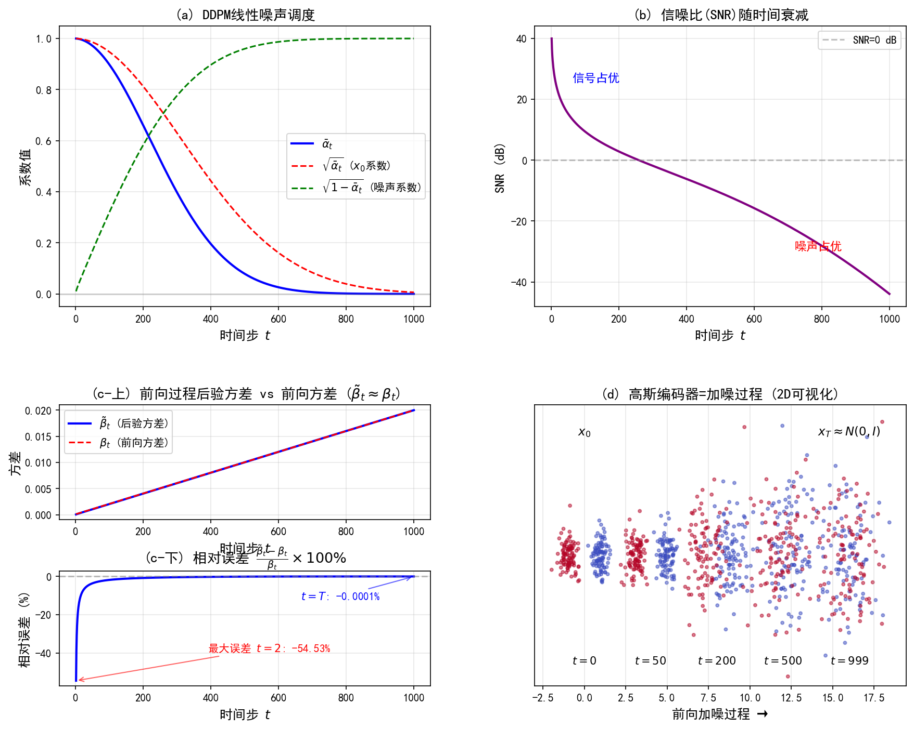

# 10.2 扩散过程的变分下界推导

> **核心观点**：当层级 VAE 的编码器取成高斯转移 $q(x_t|x_{t-1})=\mathcal{N}(\sqrt{\alpha_t}\,x_{t-1},(1-\alpha_t)I)$ 时，编码就成了逐步加噪，解码就成了逐步去噪。此时层级 ELBO 化身为扩散的变分下界 VLB，它的核心训练项能化简成"均值匹配"（让逆向过程的均值去逼近正向后验的均值）。本节搭好这层对应的概念框架，完整训练算法留到第11章。

---

## 反直觉开场：扩散的"编码器"居然不用训练

在普通 VAE 里，编码器 $q_\phi(z|x)$ 是个神经网络——均值和方差都是学出来的。但你猜扩散模型（diffusion model，靠加噪/去噪生成数据的模型）的"编码器"是什么？

**它根本不是学出来的，而是一个写死的固定公式。**

扩散的正向过程（forward process，逐步加噪的链路）每一步就是"把上一步结果缩一点、再加一团高斯噪声"。没有要优化的参数——只有一组预先定好的噪声调度（noise schedule，每步加多少噪声的超参数表）。这听起来是不是很亏？其实恰恰相反：它让训练一下子简单了——我们只需学"去噪器"，不用同时学编码器和解码器。

下面看这个固定公式长啥样。

---

## 高斯编码器 = 加噪过程

从本节起，我们改用扩散的记号：把层级 VAE 的潜变量 $z_1,\ldots,z_L$ 重新标成时间步 $x_1,\ldots,x_T$，原始数据记作 $x_0\equiv x$。

### 高斯转移分布

编码器（前向过程）的每一步转移定义为：

$$q(\mathbf{x}_t|\mathbf{x}_{t-1}) = \mathcal{N}(\mathbf{x}_t; \sqrt{\alpha_t}\,\mathbf{x}_{t-1}, (1-\alpha_t)\mathbf{I})$$

其中 $\alpha_t\in(0,1)$ 随时间步 $t$ 递减。等价地令 $\beta_t=1-\alpha_t$（$\beta_t$ 就是这步加的噪声比例），写成更常见的 DDPM 形式：

$$q(\mathbf{x}_t|\mathbf{x}_{t-1}) = \mathcal{N}(\mathbf{x}_t; \sqrt{1-\beta_t}\,\mathbf{x}_{t-1}, \beta_t\mathbf{I})$$

这个写法保证了**方差保持**（variance preserving，加噪后总方差不膨胀的性质）：如果 $x_{t-1}$ 各分量方差是 1，那么 $x_t$ 各分量方差还是 1——信号被缩小 $\sqrt{\alpha_t}$ 倍，同时注入等量噪声补回方差。

### 为什么偏偏是 $\sqrt{\alpha_t}$ 和 $1-\alpha_t$？

直觉上，我们希望"反复加噪后，最终变成标准高斯 $\mathcal{N}(0,I)$"。考虑同质（homogeneous，每步用相同 $\alpha$）的递推：$\mathbf{x}_t=a\,\mathbf{x}_{t-1}+b\,\varepsilon$，其中 $\varepsilon\sim\mathcal{N}(0,I)$。递推 $t$ 步后 $\mathbf{x}_t=a^t\mathbf{x}_0+\mathbf{w}_t$，其协方差 $\text{Cov}[\mathbf{w}_t]=b^2\frac{1-a^{2t}}{1-a^2}I$。要让 $t\to\infty$ 时 $x_t\to\mathcal{N}(0,I)$，需：

$$\frac{b^2}{1-a^2}=1 \quad\Longrightarrow\quad b=\sqrt{1-a^2}$$

令 $a=\sqrt{\alpha}$，则 $b=\sqrt{1-\alpha}$。这就是 $\sqrt{\alpha_t}$ 配 $1-\alpha_t$ 的来历——**保证前向过程最终收敛到标准高斯**。

实际 DDPM 用异质噪声调度（每步 $\alpha_t$ 不同），上面是同质的动机说明；真正的收敛靠调度设计保证 $\bar{\alpha}_T=\prod_{t=1}^T\alpha_t\approx 0$，使得 $q(x_T|x_0)\approx\mathcal{N}(0,I)$。

### 与标准 VAE 的根本区别（再强调一次）

- **编码器不学**：前向参数 $\beta_1,\ldots,\beta_T$ 是预定义的；
- **编码器是确定性高斯链**：每步 = 乘 $\sqrt{\alpha_t}$ + 加噪；
- **只有解码器要学**：逆向过程 $p_\theta(x_{t-1}|x_t)$ 才是神经网络。

这一选择让训练大幅简化。

---

## 噪声调度与直接采样：一步到位取任意时刻

由递推 $\mathbf{x}_t = \sqrt{\alpha_t}\,\mathbf{x}_{t-1} + \sqrt{1-\alpha_t}\,\varepsilon_{t-1}$，把它一步步展开，能直接写出从 $x_0$ 采样 $x_t$ 的闭式：

$$\boxed{q(\mathbf{x}_t|\mathbf{x}_0) = \mathcal{N}(\mathbf{x}_t; \sqrt{\bar{\alpha}_t}\,\mathbf{x}_0, (1-\bar{\alpha}_t)\mathbf{I})}$$

其中 $\bar{\alpha}_t=\prod_{s=1}^{t}\alpha_s$ 是累积乘积。等价写法：

$$\mathbf{x}_t = \sqrt{\bar{\alpha}_t}\,\mathbf{x}_0 + \sqrt{1-\bar{\alpha}_t}\,\boldsymbol{\varepsilon}, \quad \boldsymbol{\varepsilon}\sim\mathcal{N}(0,I)$$

**证明概要**：对 $t=1$ 显然成立（此时 $\bar{\alpha}_1=\alpha_1$）。假设对 $t-1$ 成立，则 $\mathbf{x}_t=\sqrt{\alpha_t}(\sqrt{\bar{\alpha}_{t-1}}x_0+\sqrt{1-\bar{\alpha}_{t-1}}\bar{\varepsilon})+\sqrt{1-\alpha_t}\,\varepsilon_{t-1}$。两个独立高斯的线性组合仍是高斯，合并方差得 $\bar{\alpha}_t=\alpha_t\bar{\alpha}_{t-1}$、总方差 $1-\bar{\alpha}_t$。$\blacksquare$

### $\bar{\alpha}_t$ 的物理含义：信噪比衰减因子

$\bar{\alpha}_t$ 衡量**信噪比**（SNR，signal-to-noise ratio，信号强度相对噪声强度的比例）：

- $t=0$：$\bar{\alpha}_0=1$，信号完整、无噪；
- $t$ 增大：$\bar{\alpha}_t$ 递减，信号被噪声逐步淹没；
- $t=T$：$\bar{\alpha}_T\approx 0$，$x_T$ 几乎是纯噪声 $\mathcal{N}(0,I)$。

SNR 定义为 $\text{SNR}(t)=\bar{\alpha}_t/(1-\bar{\alpha}_t)$，它单调递减，控制每步噪声水平。

### 噪声调度怎么选

调度 $\beta_1,\ldots,\beta_T$ 决定"加噪速度"。常见两种：

**线性调度**（Ho et al., 2020）：
$$\beta_t = \beta_{\min} + \frac{t-1}{T-1}(\beta_{\max}-\beta_{\min}), \quad \beta_{\min}=10^{-4},\ \beta_{\max}=0.02$$

**余弦调度**（Nichol & Dhariwal, 2021）：
$$\bar{\alpha}_t = \frac{f(t)}{f(0)},\quad f(t)=\cos\!\left(\frac{t/T+s}{1+s}\cdot\frac{\pi}{2}\right)^2$$
$s$ 是小偏移（如 0.008），防止 $t=0$ 时 $\beta_t$ 过小。余弦调度的好处是信噪比均匀衰减，避免线性调度末尾噪声增长过快。

**直接采样公式的意义**：训练时不必真的一步步走前向，可以一步从 $x_0$ 取到任意 $x_t$，效率大增。

---

## VLB 的概念框架：从层级 ELBO 到三项分解

把 10.1 的层级 ELBO 套到扩散的具体结构上，就得到变分下界 VLB（variational lower bound，扩散版的 ELBO）。本节只搭框架、给结果和物理含义；完整推导留第11章。

### 三项分解

利用马尔可夫性和贝叶斯定理，VLB 拆成三项可计算的项：

$$\boxed{L_\text{VLB} = \underbrace{D_{\text{KL}}(q(\mathbf{x}_T|\mathbf{x}_0) \| p(\mathbf{x}_T))}_{L_T：\text{先验匹配}} + \sum_{t=2}^{T} \underbrace{\mathbb{E}_{q(\mathbf{x}_t|\mathbf{x}_0)}\left[D_{\text{KL}}(q(\mathbf{x}_{t-1}|\mathbf{x}_t, \mathbf{x}_0) \| p_\theta(\mathbf{x}_{t-1}|\mathbf{x}_t))\right]}_{L_{t-1}：\text{一致性项}} + \underbrace{(-\mathbb{E}_{q(\mathbf{x}_1|\mathbf{x}_0)}[\log p_\theta(\mathbf{x}_0|\mathbf{x}_1)])}_{L_0：\text{重建项}}}$$

- **$L_T$（先验匹配项）**：最终噪声 $x_T$ 够不够接近标准高斯先验 $p(x_T)=\mathcal{N}(0,I)$？因为调度保证 $\bar{\alpha}_T\approx 0$，这一项很小且**不依赖 $\theta$**，训练时可忽略。
- **$L_{t-1}$（一致性项）**：前向过程后验 $q(x_{t-1}|x_t,x_0)$ 与逆向过程 $p_\theta(x_{t-1}|x_t)$ 的匹配度。这是**核心训练信号**——逼着学到的逆向过程尽量还原前向过程的后验。
- **$L_0$（重建项）**：从 $x_1$ 重建 $x_0$ 的质量，实践里通常用高斯离散化近似处理。

### 前向过程后验的闭式解（关键！）

一致性项的核心是 $q(x_{t-1}|x_t,x_0)$。因为正向过程是高斯马尔可夫链，这个后验有闭式高斯解：

$$q(\mathbf{x}_{t-1}|\mathbf{x}_t, \mathbf{x}_0) = \mathcal{N}(\mathbf{x}_{t-1}; \tilde{\boldsymbol{\mu}}_t(\mathbf{x}_t, \mathbf{x}_0), \tilde{\beta}_t \mathbf{I})$$

后验均值：

$$\tilde{\boldsymbol{\mu}}_t(\mathbf{x}_t, \mathbf{x}_0) = \frac{\sqrt{\alpha_t}(1-\bar{\alpha}_{t-1})}{1-\bar{\alpha}_t}\mathbf{x}_t + \frac{\sqrt{\bar{\alpha}_{t-1}}(1-\alpha_t)}{1-\bar{\alpha}_t}\mathbf{x}_0$$

后验方差：

$$\tilde{\beta}_t = \frac{(1-\bar{\alpha}_{t-1})}{1-\bar{\alpha}_t} \cdot \beta_t$$

**关键性质**：后验方差 $\tilde{\beta}_t$ 只由噪声调度决定，不依赖 $x_t$ 或 $x_0$。这意味着逆向过程 $p_\theta(x_{t-1}|x_t)$ 的方差可以固定成 $\tilde{\beta}_t I$，**只需学均值**——训练信号全集中在均值预测上。

> 完整推导（贝叶斯反转 + 配方法）见第11章 11.1 节；附录 10B 也给了前向过程后验闭式解的紧凑推导。

### 从概念到算法：本质就是"均值匹配"

VLB 三项分解揭示了一个关键结构：**扩散训练的本质是均值匹配**——让逆向过程的均值 $\mu_\theta(x_t,t)$ 逼近正向后验均值 $\tilde{\mu}_t(x_t,x_0)$。而 $\tilde{\mu}_t$ 是 $x_t$ 和 $x_0$ 的已知线性组合，所以匹配均值 ≡ 从 $x_t$ 预测 $x_0$（或等价地预测加的噪声 $\varepsilon$）——这就是"去噪"。

由此产生三种等价的参数化（parametric form，网络输出不同的量但都等价）：

1. **$x_0$ 预测**：网络直接输出 $\hat{x}_0(x_t,t)$，直觉最清楚；
2. **$\varepsilon$ 预测**：网络预测噪声 $\hat{\varepsilon}_\theta(x_t,t)$，训练最稳（DDPM 用这个）；
3. **得分预测**：网络预测得分函数 $s_\theta(x_t,t)$（即 $\nabla\log q_t$，对数密度对输入的梯度，指向密度上升方向），与采样路径一致。

三种在数学上等价，训练动态不同。Ho et al. (2020) 进一步丢掉时间相关权重，得到简化目标 $L_\text{simple}$——这就是 DDPM 的训练算法。

> 均值匹配化简、三种参数化比较、简化 VLB 与完整 VLB 的定量关系，第11章系统展开。

### 与 Tweedie 等式的联系（预告）

后验均值和第5章的 Tweedie 等式（Tweedie's formula，从带噪观测反推干净量时，最优估计和得分函数的关系）深层相连。对 VP-SDE 前向过程，Tweedie 给出 MMSE 估计器：

$$\mathbb{E}[\mathbf{x}_0|\mathbf{x}_t] = \frac{1}{\sqrt{\bar{\alpha}_t}}\left(\mathbf{x}_t + (1-\bar{\alpha}_t)\nabla_{\mathbf{x}_t}\log q(\mathbf{x}_t)\right)$$

这意味着 $\hat{x}_0$ 可由 $x_t$ 和得分函数算得，代入后验均值公式就得到 $\tilde{\mu}_t$ 的得分表达。这预告了变分路径与采样路径的统一——第12章严格证明两种训练目标等价。

**来源**：Tutorial on Diffusion Models for Imaging and Vision Sec 2.2-2.3; Ho et al. (2020) DDPM; 2209.14687v1 Sec 2.2; Kingma et al. (2021) VDM

---

## 实验 10.2-1：扩散过程的变分下界推导

实验 `10.2-1.py` 数值验证**高斯编码器 = 加噪过程**，核对 VLB 三项分解和前向过程后验的闭式解，并展示信噪比衰减。

### 实验场景

- **高斯编码器 = 加噪过程**：当编码器取固定方差高斯转移，马尔可夫链边际分布有闭式解 $q(x_t|x_0)=\mathcal{N}(\sqrt{\bar{\alpha}_t}x_0,(1-\bar{\alpha}_t)I)$。
- **VLB 三项分解**：先验匹配 $L_T$、一致性 $L_{t-1}$、重建 $L_0$。
- **前向过程后验闭式解**：均值、方差都能解析算。

### 实验目的

1. 验证高斯编码器 = 加噪过程（直接采样与逐步加噪统计量一致）；
2. 验证 VLB 三项分解（$L_T\approx 0$，一致性项为核心）；
3. 验证后验方差 $\tilde{\beta}_t$ 与 $\beta_t$ 在 $t\ge 2$ 时几乎一致；
4. 展示 SNR 随时间衰减。

### 实验输入

| 参数 | 设置 |
|------|------|
| 噪声调度 | 线性，$\beta_{\min}=10^{-4}$，$\beta_{\max}=0.02$，$T=1000$ |
| 测试样本 | 5000 个 2 维样本 |
| 测试时间步 | $t\in\{1,50,200,500,999\}$ |
| 数据分布 | 2 维高斯混合 |
| 调度验证 | 对比线性与余弦调度的 SNR 曲线 |

### 预期结果

- 直接采样与逐步加噪的统计量差异接近机器精度；
- $L_T\approx 0$（因 $\bar{\alpha}_T\approx 0$）；
- 后验方差 $\tilde{\beta}_t$ 与 $\beta_t$ 在 $t\ge 2$ 时相对误差 $<0.1\%$；
- SNR 从 $t=1$ 约 40 dB 衰减到 $t=1000$ 约 -44 dB。

### 实验结果

运行 `10.2-1.py` 生成一张图。

#### 步骤1：高斯编码器 = 加噪过程验证

| $t$ | 均值差(max) | 标准差差(max) | 理论标准差 |
|-----|------------|--------------|-----------|
| 1 | 0.00034 | 0.000615 | 0.01483 |
| 50 | 0.004321 | 0.005867 | 0.173346 |
| 200 | 0.007206 | 0.00997 | 0.586219 |
| 500 | 0.028639 | 0.006197 | 0.960314 |
| 999 | 0.013698 | 0.009695 | 0.99998 |

差异远小于标准差本身，验证闭式边际分布精确成立。结论：这个闭式分布是扩散高效训练的基础——不用逐步走前向，直接一步取任意 $x_t$。

#### 步骤2：VLB 三项分解验证

**先验匹配项 $L_T$**：$\bar{\alpha}_T=4.036\times 10^{-5}$，故 $q(x_T|x_0)\approx\mathcal{N}(0,I)$，$L_T\approx 0$。

**前向过程后验方差 $\tilde{\beta}_t$**：

| $t$ | $\tilde{\beta}_t$ | $(\tilde{\beta}_t-\beta_t)/\beta_t$ |
|-----|------------------|--------------------------------------|
| 1 | 0.0 | -100%（边界） |
| 2 | — | -54.53% |
| 500 | 0.010031 | -0.0865% |
| $T$ | 0.02 | -0.0001% |

$t\ge 2$ 时相对误差 $<0.1\%$，验证 DDPM 简化方差估计的合理性。

**后验均值系数**：

| $t$ | $x_t$ 系数 | $x_0$ 系数 | 系数之和 |
|-----|------------------|------------------|---------|
| 1 | 0.0 | 1.0 | 1.0 |
| 100 | 0.9809 | 0.0191 | 1.0 |
| 500 | 0.9941 | 0.0031 | 0.9972 |
| 1000 | 0.9899 | 0.0001 | 0.9901 |

后验均值是 $x_t$ 和 $x_0$ 的线性组合，系数和接近 1。

#### 步骤3：SNR 分析

| $t$ | $\bar{\alpha}_t$ | $\text{SNR}(t)$ | dB |
|-----|----------------|----------------|-----|
| 1 | 0.9999 | 9997.34 | 40.0 dB |
| 100 | 0.897018 | 8.7104 | 9.4 dB |
| 250 | 0.524085 | 1.1012 | 0.4 dB |
| 500 | 0.078587 | 0.0853 | -10.7 dB |
| 1000 | $4\times 10^{-5}$ | $\approx 0$ | -43.9 dB |

SNR 单调衰减，从信号占优到噪声占优。这正是 10.3 节 VLB 权重差异的根源。

#### 核心知识点总结

1. **高斯编码器 = 加噪过程**：$q(x_t|x_0)=\mathcal{N}(\sqrt{\bar{\alpha}_t}x_0,(1-\bar{\alpha}_t)I)$，直接采样高效。
2. **VLB 三项分解**：$L_T\approx 0$（自动满足）、$L_{t-1}$（核心）、$L_0$（重建）。
3. **前向过程后验闭式解**：均值 $\tilde{\mu}_t$、方差 $\tilde{\beta}_t$ 均可解析。
4. **SNR 分析**：随 $t$ 单调衰减，是 10.3 节损失权重差异的根源。

---

至此我们搭好了扩散的变分框架：VLB 三项分解、前向后验闭式解、均值匹配的化简方向。下一个自然的问题是：这个"均值匹配"怎么变成真正能跑的去噪训练？并且当层级数 $T\to\infty$ 时，离散结构会发生什么？这两问分别由 10.3 和 10.4 回答。
