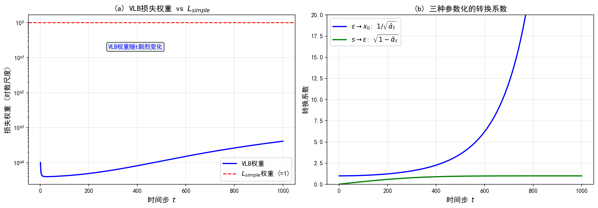

# 10.3 从 VLB 到去噪训练：概念与预告

> **核心观点**：VLB 的核心训练项 $L_{t-1}$ 能化简成"均值匹配"——让逆向过程的均值逼近正向后验的均值。而正向后验均值是 $x_0$ 和 $x_t$ 的已知线性组合，所以匹配均值 ≡ 从带噪图预测干净图（去噪）。由此产生三种等价参数化（$x_0$ 预测、$\varepsilon$ 预测、得分预测）和简化目标 $L_\text{simple}$。本节只讲概念和直觉，完整算法留第11章。

---

## 为什么"去噪"和"变分推断"会是一回事？

你也许觉得奇怪：上一节还在讲变分下界、KL 散度这些"贝叶斯硬核"，这一节怎么突然变成"训练一个去噪网络"了？

**因为去噪，本来就是变分推断在扩散结构下的化身。** 下面我们一步步看清这个"本来如此"。

---

## 均值匹配与去噪的等价性

10.2 节把 VLB 拆成三项，核心训练项是 $L_{t-1}$：正向后验 $q(x_{t-1}|x_t,x_0)$ 与逆向过程 $p_\theta(x_{t-1}|x_t)$ 之间的 KL 散度。由于两者都是高斯、且方差固定，两个同方差高斯的 KL 散度会奇迹般地**只取决于均值之差**：

$$L_{t-1} \propto \mathbb{E}_{q(\mathbf{x}_t|\mathbf{x}_0)}\left[\|\tilde{\boldsymbol{\mu}}_t(\mathbf{x}_t, \mathbf{x}_0) - \boldsymbol{\mu}_\theta(\mathbf{x}_t, t)\|^2\right]$$

先解释这里每个量的身份：$\tilde{\mu}_t(x_t,x_0)$ 是前向过程给出的"理想逆推"——给定当前带噪图和干净原图，这一步最该走到的中间状态；$\mu_\theta(x_t,t)$ 是我们的逆向网络在只看到 $x_t$ 时猜测的中间状态。KL 只取决于这两者均值之差的平方，意味着训练不必关心方差的精细匹配，把全部火力都对准"两种逆推方式的分歧"。

回顾正向后验均值 $\tilde{\mu}_t$ 的结构：

$$\tilde{\boldsymbol{\mu}}_t(\mathbf{x}_t, \mathbf{x}_0) = \frac{\sqrt{\alpha_t}(1-\bar{\alpha}_{t-1})}{1-\bar{\alpha}_t}\mathbf{x}_t + \frac{\sqrt{\bar{\alpha}_{t-1}}(1-\alpha_t)}{1-\bar{\alpha}_t}\mathbf{x}_0$$

它是 $x_t$ 和 $x_0$ 的**已知线性组合**，系数由噪声调度决定。于是匹配 $\tilde{\mu}_t$ 就等价于从 $x_t$ 预测 $x_0$——**去噪**。

一句话点破：**学习逆向过程 = 学习"已知干净图 $x_0$ 时，最优的这一步去噪"**。训练时 $x_0$ 是现成的（来自训练数据），所以 $\tilde{\mu}_t$ 可以直接当监督信号。从更深层次看，这意味着我们并不需要手写"如何逆推"，只需要向数据要答案：让网络去模仿"假如我知道干净图，这一步会走哪里"。

---

## 三种参数化与简化目标

匹配 $\tilde{\mu}_t$ 有三种等价的"网络该输出什么"的选择，对应三种预测视角：

| 参数化 | 网络输出 | 训练信号 | 优势 |
|---|---|---|---|
| $x_0$ 预测 | $\hat{\mathbf{x}}_0(\mathbf{x}_t, t)$ | $\|\hat{\mathbf{x}}_0 - \mathbf{x}_0\|^2$ | 直觉清晰 |
| $\varepsilon$ 预测 | $\hat{\boldsymbol{\varepsilon}}_\theta(\mathbf{x}_t, t)$ | $\|\hat{\boldsymbol{\varepsilon}}_\theta - \boldsymbol{\varepsilon}\|^2$ | 训练最稳定 |
| 得分预测 | $\mathbf{s}_\theta(\mathbf{x}_t, t)$ | $\|\mathbf{s}_\theta - \nabla\log p_t\|^2$ | 与采样路径一致 |

三者**数学上完全等价**——它们预测的都是同一个均值 $\tilde{\mu}_t$ 的不同表示，只是训练动态差别很大：

- **$x_0$ 预测**：网络直接吐"去噪后的图"，直觉最清楚，和第5章 PnP（plug-and-play，即插即用，把去噪器当通用先验的框架）里的去噪器角色一致。但不同时间步的监督信号尺度差很多，训练不稳。
- **$\varepsilon$ 预测**：网络预测"加进去的那团噪声"，监督信号（标准高斯噪声）在所有时间步尺度一致，训练最稳。**这是 DDPM 的默认选择**。
- **得分预测**：网络预测得分函数（score function，$\nabla\log p_t$，对数密度对输入的梯度，指向数据密集方向），和第6章得分匹配直接对接。借 Tweedie 等式，得分预测和 $\varepsilon$ 预测有线性关系 $\hat{\varepsilon}_\theta=-\sqrt{1-\bar{\alpha}_t}\,s_\theta$。

完整 VLB 的训练目标带时间相关权重 $w_t$。Ho et al. (2020) 发现**干脆丢掉权重**、用简化目标效果更好：

$$L_\text{simple}(\theta) = \mathbb{E}_{t, \mathbf{x}_0, \boldsymbol{\varepsilon}}\left[\|\boldsymbol{\varepsilon} - \hat{\boldsymbol{\varepsilon}}_\theta(\sqrt{\bar{\alpha}_t}\mathbf{x}_0 + \sqrt{1-\bar{\alpha}_t}\boldsymbol{\varepsilon}, t)\|^2\right]$$

简化目标让网络把容量集中在更难的"高噪声去噪步"上，生成质量优于完整 VLB，但在似然优化上不如完整 VLB。这一取舍说明：训练目标的选择不是越接近理论越好，还要考虑梯度尺度与任务侧重。

> 均值匹配化简的详细推导、三种参数化的损失公式、$L_\text{simple}$ 与 $L_\text{VLB}$ 的定量比较、学方差策略，第11章系统展开。

---

## 变分视角与得分视角的初步对应

$\varepsilon$ 预测下的 VLB，和第6章的**去噪得分匹配**（DSM，denoising score matching，通过给数据加噪、再让网络预测噪声来学得分的方法）有惊人的结构对应。

### 两种视角平行

| 变分视角 | 得分视角 |
|---|---|
| VLB 一致性项 $L_{t-1}$ | DSM 损失 |
| 预测噪声 $\hat{\varepsilon}_\theta$ | 学习得分 $s_\theta$ |
| 匹配前向后验均值 | 匹配加噪分布的得分函数 |
| 逆向采样 $p_\theta(x_{t-1}\|x_t)$ | Langevin / 扩散采样 |

### 预告第12章的等价性

借 Tweedie 等式（第5章 5.3 节），噪声预测和得分预测之间有线关系：

$$\hat{\boldsymbol{\varepsilon}}_\theta(\mathbf{x}_t, t) = -\sqrt{1-\bar{\alpha}_t}\,\mathbf{s}_\theta(\mathbf{x}_t, t)$$

这意味着 $\varepsilon$ 预测和得分预测是同一信息的不同编码。进一步可证：

$$\text{DSM 损失} \equiv \text{VLB（去掉不可优化的项）}$$

这是第12章的核心结论——**Score ≡ ELBO**，两条路径殊途同归。第11章 11.5 节将从结构上详细对比两种训练目标的相似性，为等价性证明提供直觉铺垫。在本章框架里这已初露端倪：VLB 的均值匹配本质在做去噪，DSM 也在做去噪，只是出发点不同（一个从变分推断、一个从得分估计）。

**来源**：Tutorial on Diffusion Models for Imaging and Vision Sec 2.4-2.5; Ho et al. (2020) DDPM; 2406.08929v2 Sec 5; 2209.14687v1 Sec 2.2

---

## 实验 10.3-1：从变分下界到去噪目标

实验 `10.3-1.py` 验证**三种参数化的等价性**，分析 VLB 权重曲线与简化目标的有效性，揭示 $\varepsilon$ 预测的数值稳定性优势。

### 实验场景

- **三种参数化等价**：完美预测下，$x_0$-、$\varepsilon$-、score-prediction 给出相同后验均值 $\tilde{\mu}_t$。
- **VLB 权重分析**：均值匹配项有权重 $w_t=\frac{\beta_t}{2\alpha_t(1-\bar{\alpha}_t)}$，呈 U 形；$L_\text{simple}$ 对所有时间步赋等权 1。
- **$\varepsilon$ 预测优势**：目标数值范围稳定，所有时间步误差尺度一致。

### 实验目的

1. 验证三种参数化等价（完美预测下后验均值误差近机器精度）；
2. 验证 VLB 权重 U 形曲线（$t\approx 300$ 谷值）；
3. 展示 $L_\text{simple}$ 简化效果（等权）；
4. 验证 $\varepsilon$ 预测数值稳定。

### 实验输入

| 参数 | 设置 |
|------|------|
| 噪声调度 | 线性，$\beta_{\min}=10^{-4}$，$\beta_{\max}=0.02$，$T=1000$ |
| 测试样本 | 2 维高斯样本 |
| 测试时间步 | $t\in\{10,100,500,900\}$ |
| 权重验证步 | $t\in\{1,10,50,100,300,500,700,900,999\}$ |

### 预期结果

- 三参数化后验均值误差 $<10^{-5}$；
- VLB 权重 U 形：$t=1$ 约 0.5，$t\approx 300$ 谷值约 0.005，$t=999$ 回升约 0.01；
- $L_\text{simple}$ 对所有 $t$ 赋权 1；
- $\varepsilon$ 预测误差范围恒为 1.0，而 $x_0$ 预测随 $t$ 增大急剧放大。

### 实验结果

运行 `10.3-1.py` 生成一张图。

#### 步骤1：三种参数化的等价性验证

| $t$ | 真实 $\tilde{\mu}_t$ | $x_0$-pred 误差 | $\varepsilon$-pred 误差 | score 误差 |
|-----|---------------------|---------------|----------------------|----------|
| 10 | 0.41838881 | 0.0 | $1.4782\times 10^{-5}$ | $1.4782\times 10^{-5}$ |
| 100 | 1.01430619 | 0.0 | $2.384\times 10^{-7}$ | $2.384\times 10^{-7}$ |
| 500 | 2.20202971 | 0.0 | $2.384\times 10^{-7}$ | $2.384\times 10^{-7}$ |
| 900 | 2.19355273 | 0.0 | $2.384\times 10^{-7}$ | $2.384\times 10^{-7}$ |

误差近机器精度，验证等价性。转换关系：
- $x_0\leftrightarrow\varepsilon$：$x_0=(x_t-\sqrt{1-\bar{\alpha}_t}\cdot\varepsilon)/\sqrt{\bar{\alpha}_t}$
- $\varepsilon\leftrightarrow\text{score}$：$s=-\varepsilon/\sqrt{1-\bar{\alpha}_t}$
- $\text{score}\leftrightarrow x_0$：$x_0=(x_t+(1-\bar{\alpha}_t)\cdot s)/\sqrt{\bar{\alpha}_t}$

#### 步骤2：VLB 权重分析

| $t$ | $\bar{\alpha}_t$ | VLB 权重 | $L_\text{simple}$ 权重 | 相对 $t=1$ |
|-----|----------------|---------|---------------------|----------|
| 1 | 0.9999 | 0.499967 | 1.0 | 1.0 |
| 10 | 0.998105 | 0.073716 | 1.0 | 0.1474 |
| 100 | 0.897018 | 0.010081 | 1.0 | 0.0202 |
| 300 | 0.39642 | 0.005047 | 1.0 | 0.0101（谷值） |
| 500 | 0.078587 | 0.005503 | 1.0 | 0.011 |
| 999 | $4.1\times 10^{-5}$ | 0.010194 | 1.0 | 0.0204 |

权重 U 形：$t=1$ 到 $t\approx 300$ 急降约 100 倍，之后缓慢回升。$L_\text{simple}$ 对所有 $t$ 赋等权 1，是 Ho et al. 2020 的关键简化。

#### 步骤3：$\varepsilon$-prediction 的优势

| $t$ | $\|x_0-\hat{x}_0\|$ 范围 | $\|\varepsilon-\hat{\varepsilon}\|$ 范围 |
|-----|-------------------------|----------------------------------------|
| 10 | 1.0009 | 1.0 |
| 100 | 1.0558 | 1.0 |
| 500 | 3.5672 | 1.0 |
| 900 | 60.2797 | 1.0 |

$\varepsilon$ 预测误差范围恒为 1.0，而 $x_0$ 预测随 $t$ 增大急剧放大（$t=900$ 时约 60 倍）。DDPM 选 $\varepsilon$ 预测的理由：目标简单、输出有界、训练稳、一步到位。

#### 核心知识点总结

1. **三种参数化等价**：完美预测下给出相同后验均值；转换关系如上。
2. **VLB 权重 U 形**：$w_t=\beta_t/(2\alpha_t(1-\bar{\alpha}_t))$（用 $\sigma_t^2=\beta_t$ 归一化），$L_\text{simple}$ 等权。
3. **$\varepsilon$ 预测优势**：目标简单、数值稳定，DDPM 默认。

---

从变分下界出发，我们看清了扩散训练的概念框架：均值匹配、三种参数化、简化目标，以及和得分视角的初步对应。但这一切还在离散时间步 $T$ 的框架下。当 $T$ 趋近无穷，离散层级会发生什么？下一节揭晓。