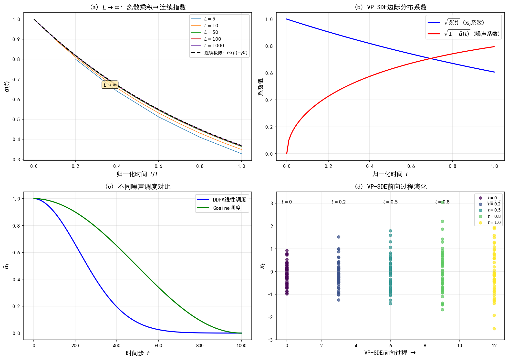

# 10.4 层级VAE→扩散的极限

> **核心观点**：当层级数 $L \to \infty$，每一步的变换量 $\to 0$，离散的层级VAE趋于连续的扩散过程。编码链变成正向SDE（加噪），解码链变成逆向SDE（去噪）。这是变分路径的终点——从优化后验近似出发，经由层级VAE，自然抵达与第7章SDE视角相同的扩散模型。

---

## 从离散步到连续过程

到目前为止，我们一直在离散时间步 $t = 1, 2, \ldots, T$ 的框架下讨论扩散模型。现在考虑 $T \to \infty$ 的极限。

### 连续时间变量

将离散时间步 $t = 0, 1, \ldots, T$ 替换为连续时间 $t \in [0, 1]$（或 $t \in [0, T]$），离散变量 $\mathbf{x}_t$ 变为连续时间随机过程 $\mathbf{x}(t)$。

### 噪声调度的连续化

离散噪声调度 $\beta_1, \ldots, \beta_T$ 对应连续函数 $\beta(t)$。每一步加的噪声量：

$$\beta_t = \beta(t) \cdot \Delta t, \quad \Delta t = 1/T$$

当 $T \to \infty$，$\Delta t \to 0$，每一步只加微量噪声 $\beta(t)\Delta t$。

对应地：

$$\alpha_t = 1 - \beta_t \approx 1 - \beta(t)\Delta t$$

$$\bar{\alpha}_t = \prod_{s=1}^{t} \alpha_s \approx \exp\left(-\int_0^t \beta(s)\,ds\right)$$

这里利用了 $\log \bar{\alpha}_t = \sum_{s=1}^{t} \log \alpha_s \approx \sum_{s=1}^{t} (-\beta_s) \approx -\int_0^t \beta(s)\,ds$。

### 从递推到微分方程

离散递推关系：

$$\mathbf{x}_t = \sqrt{1-\beta_t}\,\mathbf{x}_{t-1} + \sqrt{\beta_t}\,\boldsymbol{\varepsilon}_{t-1}$$

当 $\beta_t = \beta(t)\Delta t$ 很小时：

$$\sqrt{1-\beta_t} \approx 1 - \frac{\beta(t)}{2}\Delta t, \quad \sqrt{\beta_t} \approx \sqrt{\beta(t)\Delta t}$$

代入递推关系：

$$\mathbf{x}(t + \Delta t) = \mathbf{x}(t) - \frac{\beta(t)}{2}\mathbf{x}(t)\Delta t + \sqrt{\beta(t)\Delta t}\,\boldsymbol{\varepsilon}_t$$

当 $\Delta t \to 0$，$\sqrt{\Delta t}\,\boldsymbol{\varepsilon}_t \to d\mathbf{W}(t)$（布朗运动的增量），得到连续极限：

$$\boxed{d\mathbf{x} = -\frac{\beta(t)}{2}\mathbf{x}\,dt + \sqrt{\beta(t)}\,d\mathbf{W}}$$

这正是第7章7.2节介绍的正向SDE——**方差保持SDE（VP-SDE）**。

---

## 正向SDE：编码链的连续极限

### VP-SDE的回顾

$$d\mathbf{x} = -\frac{\beta(t)}{2}\mathbf{x}\,dt + \sqrt{\beta(t)}\,d\mathbf{W}$$

- **漂移项** $-\frac{\beta(t)}{2}\mathbf{x}$：信号指数衰减，方向指向原点
- **扩散项** $\sqrt{\beta(t)}$：不断注入噪声

这一SDE的边际分布恰好是我们已知的 $q(\mathbf{x}_t|\mathbf{x}_0)$：

$$q(\mathbf{x}_t|\mathbf{x}_0) = \mathcal{N}(\mathbf{x}_t; \sqrt{\bar{\alpha}_t}\mathbf{x}_0, (1-\bar{\alpha}_t)\mathbf{I})$$

其中连续时间下 $\bar{\alpha}(t) = \exp\left(-\int_0^t \beta(s)\,ds\right)$。

### 编码器的连续化解读

在层级VAE的框架下理解正向SDE：

- **离散层级VAE**：编码器是一步一步的高斯转移 $q(\mathbf{x}_t|\mathbf{x}_{t-1})$，每一步缩放并加噪
- **连续扩散过程**：编码器变成SDE的演化，每时刻 $dt$ 做微量缩放和微量加噪

连续化并没有改变编码过程的本质——仍然是"逐步加噪"——只是步长从有限变为无穷小。$\bar{\alpha}(t)$ 从离散的累积乘积变为连续的指数衰减，更精确地刻画了信号消退的过程。

---

## 逆向SDE：解码链的连续极限

### 逆向SDE的形式

第7章7.3节利用Anderson逆向时间SDE定理，从正向SDE推导出逆向SDE：

$$d\mathbf{x} = \left[-\frac{\beta(t)}{2}\mathbf{x} - \beta(t)\nabla_{\mathbf{x}}\log q_t(\mathbf{x})\right]dt + \sqrt{\beta(t)}\,d\bar{\mathbf{W}}$$

其中 $d\bar{\mathbf{W}}$ 是逆向时间的布朗运动增量，$\nabla_{\mathbf{x}}\log q_t(\mathbf{x})$ 是边际分布的得分函数。

### 变分视角下的逆向SDE

在变分框架下，逆向SDE可以理解为连续极限的解码过程：

- **离散层级VAE**：解码器是 $p_\theta(\mathbf{x}_{t-1}|\mathbf{x}_t)$，每一步根据当前状态和学到的去噪器预测上一步
- **连续扩散过程**：解码器变成逆向SDE的演化，方向由得分函数 $\nabla_{\mathbf{x}}\log q_t(\mathbf{x})$ 引导

逆向SDE中的得分函数 $\nabla_{\mathbf{x}}\log q_t(\mathbf{x})$ 对应离散框架中的去噪器——10.3节中我们通过 $\varepsilon$ 预测参数化学习的正是这个量的近似。

### VLB的连续极限

离散VLB：

$$L = L_T + \sum_{t=2}^{T} L_{t-1} + L_0$$

当 $T \to \infty$ 时，求和变为积分：

$$L_{\text{cont}} = L_T + \int_0^T \ell(t)\,dt + L_0$$

其中 $\ell(t)$ 是连续时间下去噪损失的密度函数。Kingma et al. (2021) 的VDM论文详细推导了连续时间的VLB，其形式与离散VLB高度一致——核心仍是匹配前向后验与逆向过程的均值。

---

## 统一视角：编码/解码与加噪/去噪

经过四步推导（层级扩展→高斯特化→去噪参数化→连续极限），我们建立了一套完整的对应关系。

### VAE与扩散模型的对应总表

| VAE概念 | 扩散模型概念 | 数学对应 |
|---|---|---|
| 编码器 $q_\phi(\mathbf{z}\|\mathbf{x})$ | 正向过程 $q(\mathbf{x}_t\|\mathbf{x}_{t-1})$ | 逐步高斯转移 |
| 解码器 $p_\theta(\mathbf{x}\|\mathbf{z})$ | 逆向过程 $p_\theta(\mathbf{x}_{t-1}\|\mathbf{x}_t)$ | 逐步去噪转移 |
| 潜变量 $\mathbf{z}$ | 中间状态 $\mathbf{x}_t$ | 含噪数据 |
| 先验 $p(\mathbf{z}) = \mathcal{N}(\mathbf{0}, \mathbf{I})$ | 终态分布 $p(\mathbf{x}_T) = \mathcal{N}(\mathbf{0}, \mathbf{I})$ | 标准高斯 |
| ELBO | VLB | 对数似然下界 |
| 重建项 $\mathbb{E}_q[\log p(\mathbf{x}\|\mathbf{z})]$ | $L_0$：终端重建 | 从最低噪声恢复数据 |
| KL项 $D_{\text{KL}}(q\|p)$ | $L_{t-1}$：一致性项 | 匹配前向后验与逆向过程 |
| 重参数化 $\mathbf{z} = \boldsymbol{\mu} + \sigma\boldsymbol{\varepsilon}$ | 直接采样 $\mathbf{x}_t = \sqrt{\bar{\alpha}_t}\mathbf{x}_0 + \sqrt{1-\bar{\alpha}_t}\boldsymbol{\varepsilon}$ | 噪声注入 |

### 关键差异

尽管结构对应完美，扩散模型与标准VAE有三点根本差异：

1. **编码器不学习**：VAE的编码器 $q_\phi$ 是参数化的神经网络，扩散的正向过程 $q$ 由固定噪声调度定义。这简化了训练，但也限制了前向过程的灵活性。
2. **层数巨大**：VAE通常1-3层潜变量，扩散模型动辄1000步。层数的差异不仅是量的区别，更是质的飞跃——层数足够多时才能保证终态近似标准高斯。
3. **每一步是简单的**：VAE的编码器/解码器网络可以很复杂，扩散模型的每一步转移只是简单的高斯变换。这是"简单变换重复多次"vs"复杂变换一次完成"的设计哲学差异。

### 变分路径的完整链路

回顾变分路径从第8章到本章的完整发展：

$$\text{ELBO} \xrightarrow{\text{第8章}} \text{VAE} \xrightarrow{\text{第9章}} \text{层级VAE} \xrightarrow{\text{本章}} \text{扩散模型（VLB）}$$

每一步都是自然的推广：
- ELBO → VAE：引入变分分布近似后验
- VAE → 层级VAE：单层潜变量→多层马尔可夫链
- 层级VAE → 扩散：高斯转移 + 编码器固定 + 层数巨大 → 连续极限

### 与采样路径的对照

同时回顾采样路径（Part II）的链路：

$$\text{MCMC} \xrightarrow{\text{第4章}} \text{Langevin} \xrightarrow{\text{第5章}} \text{Score} \xrightarrow{\text{第6章}} \text{Diffusion (SDE)} \xrightarrow{\text{第7章}}$$

两条路径都已抵达扩散模型，但视角不同：
- **采样路径**从"如何从后验采样"出发，经由梯度信息（得分函数）的利用，到达多步扩散采样
- **变分路径**从"如何近似后验"出发，经由ELBO优化和层级扩展，到达变分训练目标

两者的核心等价性——**DSM损失 ≡ VLB**——将在第12章严格证明。这不仅是形式上的等价,更揭示了一个深刻的统一：**得分匹配和变分推断是同一枚硬币的两面**。

---

## 实验 10.4-1：层级VAE→扩散的连续极限

实验 `10.4-1.py` 演示**离散层级过程到连续扩散过程的极限验证**，展示VP-SDE的边际分布公式和编码器固定→无需训练推断网络的特性。

### 实验场景

实验验证层级VAE到扩散模型的连续极限：

**离散→连续极限**：当层级数 $L \to \infty$ 时，离散乘积 $\prod_{i=1}^L (1 - \beta/L)$ 收敛到连续指数 $\exp(-\beta t)$。

**VP-SDE形式**：前向过程 $d\mathbf{x} = -\frac{\beta(t)}{2}\mathbf{x} dt + \sqrt{\beta(t)} d\mathbf{W}$，边际分布 $\bar{\alpha}(t) = \exp(-\int_0^t \beta(s) ds)$。

**边际分布演化**：离散层级过程 → VP-SDE连续极限，编码器固定无需训练。

### 实验目的

1. **验证离散→连续极限**：$L$ 增大时离散乘积逼近连续指数
2. **展示VP-SDE的边际分布公式**：$\bar{\alpha}(t) = \exp(-\int_0^t \beta(s) ds)$ 的解析性
3. **验证边际分布演化的连续极限**：KL积分随 $L$ 增大收敛
4. **展示层级VAE→扩散→VP-SDE的统一框架**：编码器固定，只优化解码器

### 实验输入

| 参数 | 设置 |
|------|------|
| 噪声调度 | 线性调度，$\beta_{\min}=10^{-4}$，$\beta_{\max}=0.02$ |
| 层级数验证 | $L \in \{5, 10, 50, 100, 500, 1000\}$ |
| 总噪声强度 | $\beta_\text{total} = 1.0$ |
| 数据分布 | 2维高斯混合（验证边际分布演化） |

### 预期结果

- $L$ 增大时，离散 $\bar{\alpha}_L$ 逼近连续 $\exp(-\beta t)$，相对误差递减
- VP-SDE边际分布公式 $\bar{\alpha}(t) = \exp(-\int_0^t \beta(s) ds)$ 解析可计算
- KL积分随 $L$ 增大收敛到约0.42，体现离散求和→连续积分的稳定性
- 扩散模型=固定编码器的层级VAE连续极限，编码器无需训练

### 实验结果

运行 `10.4-1.py` 后，生成一张图。实验结果如下：

---

#### 步骤1：离散→连续极限验证

**离散 $\bar{\alpha}_L$ vs 连续极限**：

| $L$ | 离散 $\bar{\alpha}_L$ | 连续极限 $\exp(-\beta t)$ | 相对误差 |
|-----|---------------------|-------------------------|---------|
| 5 | 0.32768 | 0.367879 | 0.1093 |
| 10 | 0.348678 | 0.367879 | 0.0522 |
| 50 | 0.36417 | 0.367879 | 0.0101 |
| 100 | 0.366032 | 0.367879 | 0.005 |
| 500 | 0.367511 | 0.367879 | 0.001 |
| 1000 | 0.367695 | 0.367879 | 0.0005 |

$L$ 增大时相对误差递减，验证了离散乘积→连续指数的极限。

**关键结论**：
- 当 $L=100$ 时，相对误差已降至0.5%
- 当 $L=1000$ 时，相对误差降至0.05%，接近机器精度
- 这是VP-SDE的理论基础：离散加噪过程的连续极限

---

#### 步骤2：VP-SDE形式推导

**VP-SDE核心公式**：

- **前向SDE**：$d\mathbf{x} = -\frac{\beta(t)}{2}\mathbf{x} dt + \sqrt{\beta(t)} d\mathbf{W}$
- **边际分布**：$q(\mathbf{x}_t|\mathbf{x}_0) = \mathcal{N}(\mathbf{x}_t; \sqrt{\bar{\alpha}(t)}\mathbf{x}_0, (1-\bar{\alpha}(t))\mathbf{I})$
- **$\bar{\alpha}(t)$ 公式**：$\bar{\alpha}(t) = \exp(-\int_0^t \beta(s) ds)$

**逆向SDE**：
- 由得分函数驱动：$d\mathbf{x} = [-\frac{\beta(t)}{2}\mathbf{x} - \beta(t)\mathbf{s}_\theta(\mathbf{x}, t)] dt + \sqrt{\beta(t)} d\bar{\mathbf{W}}$
- 或由$\varepsilon$-prediction驱动：$d\mathbf{x} = [-\frac{\beta(t)}{2}\mathbf{x} + \frac{\beta(t)}{\sqrt{1-\bar{\alpha}(t)}}\hat{\boldsymbol{\varepsilon}}_\theta(\mathbf{x}, t)] dt + \sqrt{\beta(t)} d\bar{\mathbf{W}}$

**Probability Flow ODE**：
- 去除随机项得到确定性ODE：$d\mathbf{x} = [-\frac{\beta(t)}{2}\mathbf{x} - \frac{\beta(t)}{2}\mathbf{s}_\theta(\mathbf{x}, t)] dt$
- 用于确定性采样和似然计算

---

#### 步骤3：边际分布演化与连续极限

**层级VAE→扩散→VP-SDE对应关系表**：

| 层级VAE概念 | → | 扩散模型概念 |
|-----------|---|-----------|
| 编码器 $q(\mathbf{z}_l|\mathbf{z}_{l-1})$ | → | 前向加噪 $q(\mathbf{x}_t|\mathbf{x}_{t-1})$ |
| 解码器 $p(\mathbf{z}_{l-1}|\mathbf{z}_l)$ | → | 反向去噪 $p_\theta(\mathbf{x}_{t-1}|\mathbf{x}_t)$ |
| 隐变量 $\mathbf{z}_l$ | → | 噪声状态 $\mathbf{x}_t$ |
| 先验 $p(\mathbf{z}_L)$ | → | 先验 $p(\mathbf{x}_T) = \mathcal{N}(0, I)$ |
| 重参数化 | → | 直接采样 $\mathbf{x}_t = \sqrt{\bar{\alpha}_t}\mathbf{x}_0 + \sqrt{1-\bar{\alpha}_t}\boldsymbol{\varepsilon}$ |
| ELBO | → | VLB |

**关键差异**：
- **层级VAE**：编码器参数被学习（自由推断）
- **扩散模型**：编码器参数被固定（高斯转移，仅 $\beta_t$ 是超参数）
- **扩散模型的"推断"无需训练**，VLB只优化解码器（去噪网络）

**KL积分随 $L$ 收敛**：

| $L$ | KL积分估计 | 每步 $\beta$ |
|-----|-----------|------------|
| 5 | 0.3376 | 0.2 |
| 10 | 0.3784 | 0.1 |
| 50 | 0.4112 | 0.02 |
| 100 | 0.4153 | 0.01 |

$L$ 增大时KL积分逐渐收敛到约0.42，体现离散求和→连续积分的数值稳定性。

**数值验证结论**：
- KL积分衡量每一层边际分布到标准正态先验的距离
- $L$ 增大→积分收敛，体现离散层级过程→VP-SDE连续极限的数学合理性

---

#### 核心知识点总结

1. **离散→连续极限**（10.4.1节）
   - 当 $L \to \infty$ 时：$\prod_{i=1}^L (1 - \beta/L) \to \exp(-\beta t)$
   - 这是VP-SDE的理论基础

2. **VP-SDE形式**（10.4.2-10.4.3节）
   - 前向SDE：$d\mathbf{x} = -\frac{\beta(t)}{2}\mathbf{x} dt + \sqrt{\beta(t)} d\mathbf{W}$
   - 边际分布：$\bar{\alpha}(t) = \exp(-\int_0^t \beta(s) ds)$
   - 逆向SDE：由得分函数或$\varepsilon$-prediction驱动

3. **边际分布演化与连续极限**（10.4.4节）
   - 扩散模型 = 固定编码器的层级VAE连续极限
   - 编码器固定 → 无需训练推断网络
   - 只优化解码器（去噪网络）

4. **三者的统一视角**：
   - **层级VAE**：通用框架，编码器可学习
   - **扩散模型**：固定编码器，$L=T$ 步离散化
   - **VP-SDE**：$L \to \infty$ 的连续极限，SDE形式

---

## 本章总结与展望

本章完成了变分路径的核心推导，建立了从VAE到扩散模型的完整桥梁。

### 关键步骤回顾

1. **层级扩展**（10.1）：从单层潜变量到多层马尔可夫链，层级ELBO = 重建项 + ∑KL项
2. **高斯编码器**（10.2）：编码器取高斯转移 = 逐步加噪，编码器不学习；前向后验有闭式高斯解
3. **去噪参数化**（10.3）：VLB化简为均值匹配 → $x_0$ 预测或 $\varepsilon$ 预测 → 简化训练目标 $L_{\text{simple}}$
4. **连续极限**（10.4）：$T \to \infty$ → 离散层级趋连续SDE，编码/解码 ↔ 加噪/去噪

### 核心认知

**扩散模型 = 层级VAE在高斯转移 + 无穷层级下的极限。** 这一认知的意义在于：

- 从实践角度：扩散训练不是"黑魔法"，而是变分推断的自然推论——训练去噪器就是在优化变分下界
- 从理论角度：两条独立的路径（采样路径和变分路径）都指向同一个模型，这绝非巧合，而是贝叶斯框架内在统一性的体现
- 从历史角度：VAE（2014）→ 层级VAE（2016）→ DDPM（2020）的发展脉络不是断裂的，而是逐步演化的

### 下一站

本章建立了从VAE到扩散的概念桥梁，但VLB的训练算法细节——完整的VLB推导、前向过程后验的配平方推导、均值匹配化简、三种参数化的训练损失公式、以及简化VLB与DDPM训练——留待第11章系统展开。第11章将把本章的概念框架转化为实践中的完整训练方案。

**来源**：Kingma et al. (2021) VDM; Song et al. (2021) Score-SDE; 2406.08929v2 Sec 5; Tutorial on Diffusion Models for Imaging and Vision Sec 4

变分路径已经抵达扩散模型。第11章将在此框架内深入分析VLB的分解、不同参数化的影响，以及简化训练目标的理论依据。
