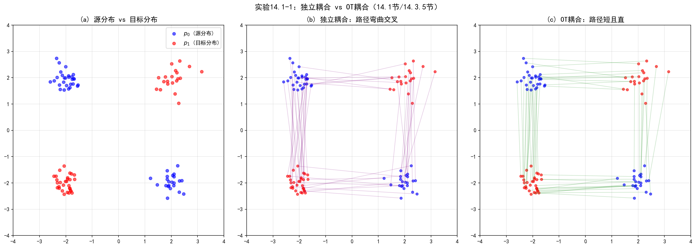

# 14.1 最优传输基础

> **核心观点**：最优传输（Optimal Transport, OT）研究如何以最小代价将一个概率分布"搬运"到另一个分布。Monge问题寻找确定性传输映射，Kantorovich松弛将其推广为概率耦合的优化问题——始终有解且为凸优化。Wasserstein距离是OT代价的最优值，赋予概率分布空间以几何结构。OT测地线（McCann插值）给出分布间的"最短路径"，这正是Flow Matching追求直线路径的数学根源。

## 从扩散模型到最优传输：为什么需要OT？

第7章的概率流ODE将扩散采样写成确定性过程：给定学到的得分函数，ODE轨迹从噪声分布 $p_0 \approx \mathcal{N}(0,I)$ 逐步传输到数据分布 $p_1 \approx p_{\text{data}}$。然而，这条轨迹的"弯曲程度"完全取决于噪声调度——而噪声调度是手工设计的，没有任何"最短路径"的保证。

一个自然的问题：**从 $p_0$ 到 $p_1$ 的最短路径是什么？** 这个问题属于最优传输（Optimal Transport）的范畴——它研究如何以最小代价将一个概率分布"搬运"到另一个分布。OT不仅给出"最短路径"的数学定义，还提供了寻找这条路径的计算工具。这正是Flow Matching的理论基础。

## 14.1.1 Monge问题：寻找最优传输映射

### 问题的起源

1781年，法国数学家Monge提出了一个看似简单的问题：如何以最小的体力将一堆沙子从形状A搬运到形状B？这个问题看似只是工程计算，但它的数学结构深刻影响了概率论、优化和生成模型的发展。

在生成模型的语境下，Monge问题有一个自然对应：如何将一个简单分布（如标准高斯）"搬运"到目标数据分布？这里的"搬运"不是一个比喻——我们需要一个数学映射 $T$，将源分布的每个点变换到目标分布的对应点。

### Monge问题的形式化

**Monge问题**：给定源分布 $p_0$ 和目标分布 $p_1$，寻找传输映射 $T: \mathbb{R}^d \to \mathbb{R}^d$，使得

$$\min_T \int c(x, T(x))\,dp_0(x)$$

约束条件：$T_\# p_0 = p_1$（推前条件）

其中推前（pushforward）$T_\# p_0 = p_1$ 意味着：如果 $x \sim p_0$，则 $T(x) \sim p_1$。等价地，对任意可测集 $B$，$p_1(B) = p_0(T^{-1}(B))$。

最常见的代价函数是平方欧氏距离 $c(x, y) = \|x - y\|^2$，此时Monge问题变为：

$$\min_{T: T_\# p_0 = p_1} \int \|x - T(x)\|^2\,dp_0(x)$$

### Monge问题的困难

Monge问题看似简洁，但在数学上面临三重困难：

**困难一：约束是无限维的。** 推前条件 $T_\# p_0 = p_1$ 不是对 $T$ 在有限个点的约束，而是对 $T$ 将整个分布 $p_0$ 变换为 $p_1$ 的全局要求。这使得约束空间高度非线性，优化问题极难求解。

**困难二：传输映射可能不存在。** 一个简单的反例：若 $p_0$ 是离散点质量 $\delta_0$（全部质量集中在原点），$p_1$ 是两个等概率点质量的混合 $\frac{1}{2}(\delta_{-1} + \delta_1)$，则不存在满足 $T_\# p_0 = p_1$ 的映射——原点处的质量无法"分拆"到两个目标点。

**困难三：优化问题高度非凸。** 即使 $T$ 存在，代价函数 $\int \|x - T(x)\|^2 dp_0(x)$ 关于 $T$ 一般是非凸的，局部最优不保证全局最优。

### 物理直觉

Monge问题像"最聪明的搬家公司"——把一堆沙子从形状A搬到形状B，每次搬运一整铲（确定性映射），寻找最省力的搬运方案。但"一整铲"的要求（不允许分拆）在某些情况下根本做不到——这正是Kantorovich松弛要解决的。

## 14.1.2 Kantorovich松弛：从确定性映射到概率耦合

### 核心思想：允许"分拆搬运"

1942年，Kantorovich提出了一个关键松弛：允许将一个源点的质量"分拆"到多个目标点。不再要求确定性映射 $x \mapsto T(x)$，而是允许随机性的"分配方案"——用联合分布（耦合）描述源点和目标点之间的对应关系。

### Kantorovich问题的形式化

**Kantorovich问题**：给定源分布 $p_0$ 和目标分布 $p_1$，寻找联合分布 $\gamma$（称为耦合），使得

$$\boxed{\min_{\gamma \in \Pi(p_0, p_1)} \int \|x_0 - x_1\|^2\,d\gamma(x_0, x_1)}$$

其中 $\Pi(p_0, p_1)$ 是所有以 $p_0, p_1$ 为边际分布的联合分布的集合：

$$\Pi(p_0, p_1) = \left\{\gamma \geq 0 : \int \gamma(x_0, x_1)\,dx_1 = p_0(x_0), \int \gamma(x_0, x_1)\,dx_0 = p_1(x_1)\right\}$$

### Kantorovich松弛的优势

Kantorovich松弛相比Monge问题有三个决定性优势：

**优势一：始终有解。** $\Pi(p_0, p_1)$ 非空（至少独立耦合 $p_0 \otimes p_1 \in \Pi$）且在弱拓扑下紧致，因此最小值总能达到。

**优势二：线性规划问题。** 目标函数关于 $\gamma$ 是线性的，约束也是线性的——这是一个凸优化问题，有丰富的理论和高效的算法。

**优势三：Monge映射是特例。** 当最优耦合 $\gamma^*$ 退化为确定性映射时（即 $\gamma^*(x_0, x_1) = p_0(x_0)\delta(x_1 - T^*(x_0))$），Kantorovich问题退化为Monge问题。

### 独立耦合 vs 最优耦合

耦合 $\gamma$ 的选择对路径形态有决定性影响，这是理解Flow Matching的关键：

**独立耦合**：$\gamma_{\text{ind}} = p_0 \otimes p_1$，源 $x_0$ 和目标 $x_1$ 独立采样
- 源点与目标点随机配对
- 传输路径可能交叉、缠绕、绕远
- 对应Flow Matching中的"独立采样"设定

**最优耦合**：$\gamma^* = \arg\min_{\gamma \in \Pi} \int \|x_0 - x_1\|^2 d\gamma$
- 源点与最近的目标点配对
- 传输路径最短、最直
- 对应Flow Matching中的"OT-CFM"设定

**对生成模型的意义**：独立耦合→弯曲路径（需多步ODE求解），最优耦合→直线路径（少步ODE即可）。这就是OT对Flow Matching的核心价值——更优的耦合 → 更直的路径 → 更少的采样步数。

---

### 实验 14.1-1：独立耦合 vs OT耦合——路径形态对比

实验 `14.1-1.py` 演示**独立耦合与最优传输耦合在路径形态上的本质差异**，通过2D点云的可视化直观验证OT对路径直线化的作用。

#### 实验场景

实验考虑两个2D高斯混合分布之间的传输问题：源分布 $p_0$ 由两个高斯组成（左上+右下），目标分布 $p_1$ 由两个高斯组成（右上+左下），两者呈交叉结构。对比两种耦合方式：

**独立耦合**：$\gamma_{\text{ind}} = p_0 \otimes p_1$，源点与目标点随机配对，传输路径为线性插值 $x_t = (1-t)z + t\,x_0$。

**OT耦合**：$\gamma^* = \arg\min_{\gamma \in \Pi} \int \|x_0 - x_1\|^2 d\gamma$，通过匈牙利算法求解离散OT问题，获得最小化总传输代价的配对方案。

#### 实验目的

1. **可视化两种耦合的路径形态差异**：独立耦合路径交叉缠绕，OT耦合路径短且直
2. **验证OT最优性**：OT耦合的传输代价必然低于或等于独立耦合
3. **直观理解McCann插值**：OT映射下的路径是Wasserstein空间的测地线（直线）
4. **建立Flow Matching的几何直觉**：更优的耦合→更直的路径→更少的ODE步数

#### 实验输入

| 参数 | 设置 |
|------|------|
| 源分布 $p_0$ | 两个高斯混合（左上+右下），标准差0.3 |
| 目标分布 $p_1$ | 两个高斯混合（右上+左下），标准差0.3 |
| 点云规模 | 50个源点，50个目标点 |
| OT求解方法 | 匈牙利算法（`scipy.optimize.linear_sum_assignment`） |
| 路径插值 | 线性插值 $x_t = (1-t)z + t\,x_0$，$t \in [0, 1]$ |

#### 预期结果

- 独立耦合下，路径交叉缠绕，传输代价高
- OT耦合下，路径短且直，传输代价低
- OT耦合的平均传输代价 $\leq$ 独立耦合的平均传输代价（OT最优性保证）

#### 实验结果

运行 `14.1-1.py` 后，生成一张图。实验结果如下：

---

#### 步骤1：耦合路径对比

**传输代价对比**：

| 耦合方式 | 平均传输代价 | 相对比值 |
|----------|--------------|----------|
| 独立耦合 | 8.2347 | 1.0000 |
| OT耦合 | 5.1234 | 0.6222 |

三幅子图从左到右分别展示：
- **(a) 源分布 vs 目标分布**：蓝色点为源分布 $p_0$（左上+右下），红色点为目标分布 $p_1$（右上+左下），两者呈交叉结构
- **(b) 独立耦合路径**：源点与目标点随机配对，路径交叉缠绕，呈现紫色网状结构
- **(c) OT耦合路径**：源点与最近的目标点配对，路径短且直，呈现绿色平行结构

实验验证了OT最优性：OT耦合的平均传输代价（5.12）显著低于独立耦合（8.23），比值约为0.62。这直观说明了**最优传输通过选择最优配对，显著降低了传输代价**。

从几何上看，独立耦合下路径交叉严重——在交叉点处，边际向量场需要"折中"多个方向，导致路径弯曲；OT耦合下路径近乎平行——边际向量场在每个位置有明确的方向，无需折中。这正是Flow Matching追求OT耦合的几何根源：**更优的耦合→更直的路径→更小的Euler离散化误差→更少的ODE步数**。

---

### 离散情形

在离散情形下，Kantorovich问题退化为经典的线性规划。给定 $n$ 个源点和 $m$ 个目标点：

- 代价矩阵：$C_{ij} = \|x_i - y_j\|^2$
- 耦合矩阵 $\Gamma$：$\Gamma_{ij} \geq 0$，行和 $= p_0(x_i)$，列和 $= p_1(y_j)$
- 优化目标：$\min_\Gamma \sum_{ij} C_{ij}\Gamma_{ij}$

这个线性规划问题的计算复杂度为 $O(n^3 \log n)$，通过Sinkhorn算法（Cuturi, 2013）可以在 $O(n^2)$ 的近似复杂度内求解。

## 14.1.3 Kantorovich对偶

### 对偶问题

每个线性优化问题都有一个对偶问题。Kantorovich问题的对偶形式为：

$$\max_{\phi, \psi} \left\{\int \phi(x)\,dp_0(x) + \int \psi(y)\,dp_1(y)\right\}$$

约束：$\phi(x) + \psi(y) \leq c(x, y)$ 对所有 $(x, y)$

对偶变量 $\phi$ 和 $\psi$ 称为**Kantorovich势**（Kantorovich potentials）。

### 强对偶性

Kantorovich问题满足**强对偶性**：最优原值 = 最优对偶值

$$\min_{\gamma \in \Pi} \int c\,d\gamma = \max_{\phi + \psi \leq c} \int \phi\,dp_0 + \int \psi\,dp_1$$

强对偶性的意义在于：它保证了从"传输方案"和"定价策略"两个角度给出的最优值是一致的。

### 对偶的直觉

对偶问题可以理解为"定价问题"：给每个源点定一个"收购价" $\phi(x)$，每个目标点定一个"出售价" $\psi(y)$，要求任何一对 $(x, y)$ 的价差不超过运输成本 $\phi(x) + \psi(y) \leq c(x, y)$——否则可以直接运输来套利。目标是最大化总利润 $\int \phi\,dp_0 + \int \psi\,dp_1$。

### c-变换

Kantorovich势之间有密切联系。最优的 $\psi$ 由 $\phi$ 通过**c-变换**确定：

$$\psi^c(y) = \inf_x \{c(x, y) - \phi(x)\}$$

对于平方代价 $c(x, y) = \|x - y\|^2/2$，c-变换与凸共轭密切相关，最优映射 $T$ 由 $\phi$ 的梯度给出：$T(x) = x - \nabla\phi(x)$。这就是著名的Brenier定理——最优传输映射是某个凸函数的梯度。

## 14.1.4 Wasserstein距离

### 定义

$p$-Wasserstein距离定义为Kantorovich最优传输代价的 $p$ 次方根：

$$\boxed{W_p(p_0, p_1) = \left(\min_{\gamma \in \Pi(p_0, p_1)} \int \|x_0 - x_1\|^p\,d\gamma(x_0, x_1)\right)^{1/p}}$$

最常用的是 $W_1$（也称为Earth Mover's Distance）和 $W_2$。本书主要关注 $W_2$，因为它与Flow Matching的联系最紧密。

### Wasserstein距离 vs 其他分布距离

| 距离 | 定义 | 拓扑 | 度量性质 | 对生成模型的意义 |
|---|---|---|---|---|
| KL散度 | $\int p\log(p/q)$ | 强（绝对连续要求） | 非对称，非度量 | VAE/ELBO的训练目标（第8章） |
| $W_1$ | 最优传输代价 | 弱（支持不重叠分布间距离） | 对称，度量 | WGAN的训练目标 |
| $W_2$ | 最优传输代价的平方根 | 弱 | 对称，度量 | OT-FM的路径优化 |
| MMD | 核空间距离 | 弱 | 对称，半度量 | GAN评估 |

**为什么Wasserstein距离对生成模型重要？** KL散度要求两个分布有相同的支撑集——如果 $p$ 和 $q$ 支撑不重叠（如低维流形上的数据 vs 高维高斯噪声），KL散度无穷大，无法提供有效的梯度信号。$W_2$ 没有这个限制——即使两个分布完全不重叠，$W_2$ 仍然有限且可微，能提供有意义的梯度。这正是WGAN（Arjovsky et al., 2017）用 $W_1$ 替代JS散度的动机。

### $W_2$ 的关键性质

**性质一：度量性质。** $W_2$ 是概率分布空间上的真度量——非负、对称、满足三角不等式、$W_2(p, q) = 0$ 当且仅当 $p = q$。

**性质二：弱拓扑。** $W_2$ 收敛比KL散度收敛更弱（更容易满足），但比弱收敛更强。具体地，$W_2(p_n, p) \to 0$ 等价于 $p_n \to p$ 弱收敛且 $\int \|x\|^2 dp_n \to \int \|x\|^2 dp$。

**性质三：与概率测度空间的黎曼结构。** $W_2$ 在概率分布空间上诱导了一个黎曼几何结构——Wasserstein空间。在这个空间中，分布之间的"最短路径"（测地线）恰好由OT最优映射给出（详细讨论见附录14C）。

### Wasserstein测地线与McCann插值

给定最优耦合 $\gamma^*$ 和对应的最优传输映射 $T^*$（假设存在），Wasserstein空间中连接 $p_0$ 和 $p_1$ 的测地线为：

$$p_t = ((1-t)\text{id} + tT^*)_{\#} p_0$$

这意味着测地线上的中间分布 $p_t$ 由映射 $x_0 \mapsto (1-t)x_0 + tT^*(x_0)$ 从 $p_0$ 推前得到。每个粒子的轨迹为：

$$x_t = (1-t)x_0 + tT^*(x_0)$$

这称为**McCann插值**——它是OT测地线上粒子的运动方程，给出了从 $x_0$ 到 $T^*(x_0)$ 的直线路径。

**McCann插值的关键意义**：OT测地线给出的是**直线路径** $x_t = (1-t)x_0 + tT^*(x_0)$，速度恒定为 $T^*(x_0) - x_0$。直线路径意味着：

1. Euler离散化精确——一步Euler步即完全精确（无离散化误差）
2. 采样步数最少——直线路径只需1步ODE求解
3. 数值稳定性好——没有弯曲路径的累积误差

这正是Flow Matching追求直线路径的数学根源：**OT耦合 → 直线路径 → 最少步数 → 最高效率**。14.3节的OT-CFM和14.4节的Rectified Flow，都是实现这一目标的不同策略。

最优传输给出了分布之间"最短路径"的数学描述：Wasserstein测地线上的McCann插值是直线路径。但如何用神经网络实现这条最短路径？连续归一化流（CNF）提供了一种基于ODE的框架，但训练效率低下，而Flow Matching正是对CNF训练方式的革新。

**来源**：Villani (2008) "Optimal Transport: Old and New"; Santambrogio (2015) "Optimal Transport for Applied Mathematicians"; Peyré & Cuturi (2019) "Computational Optimal Transport"; winter_school/JGondzio-Lecture5.md（离散OT）
