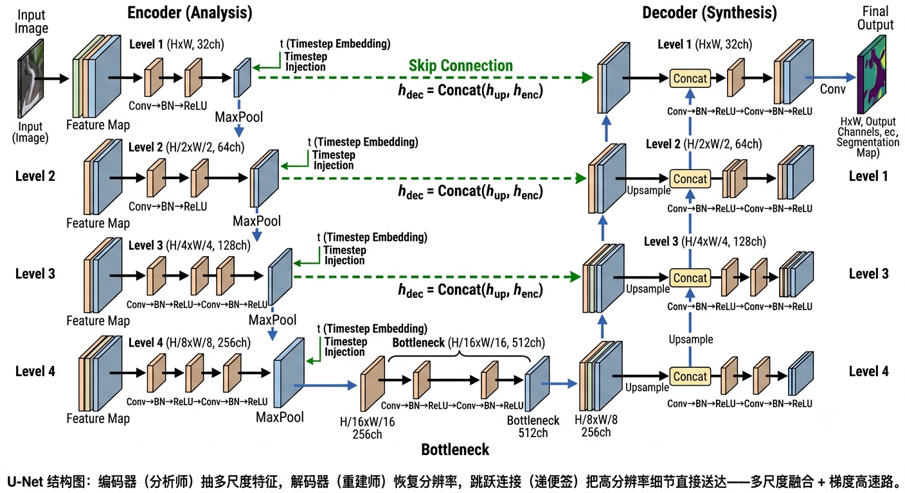

# 15.1 去噪器的经典架构：CNN 与 UNet

> “给你一张‘满屏雪花’的图，要还它本来面目。你脑子里做的第一件事其实是：拿一块小窗口，沿着图一点点扫。卷积神经网络（CNN）干的就是这个——它不会‘一眼看全图’，而是靠‘局部扫描’一点点读懂一张图。这一节我们就从这一块小窗口说起，一路走到 UNet：那个撑起前十年的扩散去噪器。”

**本章目标**（读完后你应该能）：
- 说清为什么卷积 = “局部扫描”，以及它天生适合图像；
- 解释为什么“直接堆卷积”不够，普通 CNN 去噪器的三个硬伤是什么；
- 讲明白 UNet 的编码器-解码器 + 跳跃连接是怎么补上这些坑的；
- 跑通一个最小 UNet 的前向 shape，亲眼确认“输入同尺寸、输出同尺寸”真的成立。

---

## 15.1.1 CNN 去噪器：DnCNN——从“学干净图”到“学噪声”

**先问个痛点**：给你一张带噪图 $y = x + \epsilon$（$\epsilon$ 是零均值高斯噪声，白话：一种“随机雪花”，平均下来不偏不倚），要还原干净图 $x$。最朴素的想法是训练一个网络，让它直接学会映射 $y \mapsto x$。但 DnCNN（Zhang et al., 2017）做了个更聪明的事：**让网络去预测噪声 $\hat{\epsilon}$，然后 $\hat{x}=y-\hat{\epsilon}$**。

为什么绕这么一圈反而更好？给你一个直觉：噪声 $\epsilon$ 是独立同分布的高斯随机数，结构简单——就像一张“杂乱的电视雪花图”，随便画都像；干净图像 $x$ 有纹理、有语义，结构复杂——画一张“真实人脸”难得多。于是**学简单目标（噪声）比学复杂目标（干净图像）容易**。这就是“残差学习”（residual learning，白话：不去拟合最终结果，而是去拟合“结果和输入的差”）。网络不再说“最终图长这样”，而是说“脏东西长这样，你把它减掉就好”。

它和我们之前讲的东西是连着的。回忆第11章11.3节的三种参数化：DnCNN 预测噪声，恰好对应 DDPM 默认的 $\epsilon$-预测。这不是巧合，是同一件事在不同书页上的回响——前14章我们学的“学噪声”目标，最早在图像去噪里就被验证过好用。

**监督去噪的回归框架**（属于第9章9.4节说的“自监督”设定——已知噪声模型、用干净图合成带噪图来训练）：
- 输入：含噪图 $y = x + \epsilon$
- 输出：去噪估计 $\hat{x} = D_\theta(y)$
- 训练目标：$\min_\theta \mathbb{E}\big[\|D_\theta(y) - x\|^2\big]$（MSE，白话：均方误差，逼着预测和真值逐像素接近）

DnCNN 具体堆叠了17个 “Conv(3×3) + BN + ReLU” 块，通道64，有效感受野约 35×35 像素——够抓住局部噪声模式。

**但 CNN 有三个绕不过去的坎**，先让你猜一下：如果我不停堆卷积层把感受野（receptive field，白话：一个像素点的“视野”能覆盖多大范围）撑大，是不是就能兼顾局部和全局？——直觉上“应该可以”，但实践中**边际效益递减**得厉害。给你一个数字感受：DnCNN 堆了17层，感受野才约 35×35。要“看全”一张 256×256 的图，你得堆到几百层——层数暴涨，训练却越来越难。三个局限是：
1. **感受野有限**：局部卷积核看不了远处，长程依赖（比如图像左边一条线连到右边）抓不住；
2. **单尺度处理**：所有卷积在同一分辨率上算，大尺度结构（整体光照）和小尺度细节（纹理）需要不同策略；
3. **全局结构弱**：去噪还行，但对“物体整体形状”理解不足。

这三点，正是从 DnCNN 升级到 UNet 的动力。既然单纯“堆厚”行不通，那就要换一种**结构**——这正是下一节的故事。

---

## 15.1.2 UNet：编码器-解码器 + 跳跃连接——为什么普通 CNN 不行

### 先想最简直觉：网络要“输入一张带噪图、输出同尺寸的预测”

你接到的任务很具体：给一张 $H\times W$ 的带噪图，输出一张同样 $H\times W$ 的预测（噪声或干净图）。这天然要求两件事：
- **压缩理解**：先把图“读薄”，提取越来越抽象的特征（边缘→纹理→部件→语义）；
- **还原细节**：再把特征“画回”成同尺寸的图，且不能把细节弄丢。

因为要“先压缩再还原”，所以单靠平铺的卷积层做不到。编码器-解码器（encoder-decoder）结构就是为了这个：编码器逐层**下采样**（downsample，白话：分辨率减半、通道加倍，把信息压进更“粗”但更“深”的表示），解码器逐层**上采样**（upsample，白话：分辨率加倍、通道减半，把表示恢复成像素）。UNet（Ronneberger et al., 2015）最初是为医学图像分割生的——它需要像素级精确输出，这跟去噪一模一样：输入多大，输出就得多大。

### 反直觉的 aha：为什么不直接用普通 CNN？因为要“保住高频细节”

你可能会想：那我直接堆一堆卷积，输入输出都是同尺寸不就行了？**不行，而且这里有个关键陷阱**。先猜一个数字：下采样（池化、步长卷积）在提取语义的同时，会把多少空间细节“不可逆地丢掉”？直觉上“丢一点点吧”。但真相是——下采样把每 2×2 的像素块压成 1 个，边缘、纹理这些“高频信息”（high-frequency，白话：图像里变化剧烈的部分，比如边界）被直接抹平。解码器如果只靠自己从“压扁了的特征”里重建，细节必然糊掉。**所以：下采样越强，细节丢得越狠，这不是“堆厚”能补的。**

**跳跃连接（skip connection，白话：在编码器和解码器之间拉一条“抄近路”的线，把高分辨率特征直接拼过来）就是为救这个场而生的**：

$$h_{\text{dec}}^{(l)} = \text{Concat}\!\left(h_{\text{up}}^{(l)},\; h_{\text{enc}}^{(l)}\right)$$

它把编码器第 $l$ 层的高分辨率特征，直接拼到解码器第 $l$ 层。为什么需要这条“抄近路”？因为下采样不可逆地丢了细节，解码器单靠自己重建会糊；跳跃连接把编码期抓到的细节“原样抄送”给解码期，于是三个作用就成立了：
- **保细节**：弥补下采样丢失的空间信息；
- **通梯度**：给梯度一条从输出直回输入的“高速公路”，缓解深层网络的梯度消失（和 ResNet 残差连接的思路一脉相承）；
- **多尺度融合**：浅层跳过来的是边缘/纹理，深层跳过来的是语义/结构。

**一个好懂的比喻**：编码器是“分析师”（把图读成抽象报告），解码器是“重建师”（照着报告画图）。跳跃连接就是分析师在递报告时顺便塞的**便签**——“这一块边缘在这儿、那一块纹理长这样”。没有便签，重建师只能凭模糊记忆画，细节全丢。



*图 15.1：左列编码器逐层下采样抽多尺度特征（分辨率减半、通道加倍），右列解码器逐层上采样恢复分辨率（分辨率加倍、通道减半），底部为瓶颈层；绿色跳跃连接把编码器第 $l$ 层的高分辨率特征图直接 Concat 到解码器对应层，弥补下采样丢失的细节。橙框为扩散 UNet 比普通 UNet 额外注入的时间步 $t$（详见 15.1.3 / 15.2）。*

**编码器路径**（逐层下采样：分辨率减半、通道加倍），每层基本操作：
$$\text{Conv} \to \text{BN} \to \text{ReLU} \to \text{Conv} \to \text{BN} \to \text{ReLU} \to \text{MaxPool}$$

典型4层编码器（以灰度图为例）：

| 层 | 输入通道 | 输出通道 | 分辨率变化 |
|---|---|---|---|
| 编码器第1层 | 1（灰度）或3（RGB） | 32 | $H\times W \to H/2\times W/2$ |
| 编码器第2层 | 32 | 64 | $H/2\times W/2 \to H/4\times W/4$ |
| 编码器第3层 | 64 | 128 | $H/4\times W/4 \to H/8\times W/8$ |
| 编码器第4层 | 128 | 256 | $H/8\times W/8 \to H/16\times W/16$ |

功能：低层抓边缘纹理，高层抓语义全局结构。

**解码器路径**（逐层上采样：分辨率加倍、通道减半），每层基本操作：
$$\text{Upsample}(\text{或 ConvTranspose2d}) \to \text{Concat}(\text{跳跃连接}) \to \text{Conv} \to \text{BN} \to \text{ReLU} \to \text{Conv} \to \text{BN} \to \text{ReLU}$$

上采样三种常见做法：双线性插值+Conv（简单，可能有伪影）、转置卷积（可学习，可能棋盘格伪影）、最近邻+Conv（常用，避免棋盘格）。

**UNet 的关键优势**（四点，回应为什么它能当扩散标准架构）：
1. **多尺度融合**：同时用细粒度（边缘）和粗粒度（语义），DnCNN 这种单尺度做不到；
2. **梯度流畅**：跳跃连接缓消失，能训更深；
3. **参数高效**：对称设计，总参数量主要由通道数决定；
4. **灵活可插**：注意力、时间步嵌入、条件输入都能往里塞。

---

## 实验15.1-1：扩散UNet深度架构实现（D9风格）

实验 `15.1-1.py` 演示 **D9风格的完整DiffusionUNet架构实现与训练**，包括ConvNext块、线性注意力、PreNorm归一化等关键组件，验证UNet编码器-解码器架构与跳跃连接的有效性。

### 实验场景

实验实现一个深度扩散UNet（参考lilianweng/diffusion-models论文实现），在MNIST数据集上训练去噪网络。架构包括：

**核心组件**：
- **ConvNext块**：7×7深度可分离卷积 + 时间步MLP注入 + 残差连接
- **Linear Attention**：O(N·d²)复杂度，相比Full Attention的O(N²)更节省显存
- **PreNorm模式**：归一化在残差之前，稳定深层网络训练
- **时间步嵌入**：正弦位置编码 + MLP，让网络感知当前噪声水平

**架构流程**：
```
init_conv → 下采样块（ConvNext×2 + LinearAttention + Downsample）×N
          → 中间块（ConvNext + FullAttention + ConvNext）
          → 上采样块（ConvNext×2 + LinearAttention + Upsample）×N
          → final_conv
```

### 实验目的

1. **验证UNet编码器-解码器架构的有效性**：多尺度特征融合、跳跃连接的信息传递能力
2. **理解ConvNext块的设计优势**：大感受野（7×7深度可分离卷积）+ 低参数量 + 时间步注入
3. **对比注意力机制的复杂度**：Linear Attention vs Full Attention在不同分辨率下的显存开销
4. **演示PreNorm模式的训练稳定性**：深层网络的梯度流通畅性
5. **验证完整UNet在扩散模型中的收敛性**：训练曲线、采样质量

### 实验输入

| 参数 | 设置 |
|------|------|
| 数据集 | MNIST，图像尺寸64×64（从28×28上采样） |
| 网络架构 | DiffusionUNet，dim=32，dim_mults=(1,2,4) |
| 通道数 | 32→64→128→256（编码器逐层加倍） |
| 训练轮数 | 30 epochs |
| 噪声调度 | DDPM线性调度，T=1000步 |
| 优化器 | AdamW，lr=1e-4 |
| 时间步嵌入 | 正弦编码（dim=128）+ MLP（dim×4） |

### 预期结果

- UNet训练曲线平滑收敛，验证架构设计的有效性
- Linear Attention显著节省显存，适合高分辨率特征图
- PreNorm模式使深层网络训练稳定，无梯度消失现象
- DDPM采样生成合理的MNIST数字样本

### 实验结果

运行 `15.1-1.py` 后，生成两张图。实验结果如下：

---

#### 步骤1-3：架构组件分析

实验首先分析关键组件：

**ConvNext块**：
- 深度可分离7×7卷积：大感受野（49个像素）但参数量仅为普通卷积的1/64
- 时间步注入：`h + mlp(t)[:, :, None, None]`，通过MLP将时间步信息注入特征
- 参数量对比：ds_conv（少参数）+ net（主要参数）+ res_conv（通道调整）

**注意力复杂度对比**（特征图64×64为例）：
- Full Attention：O(N²) = O(16,384²) ≈ 2.68×10⁸ 操作
- Linear Attention：O(N·d²) = O(16,384 × 32²) ≈ 1.68×10⁷ 操作
- 节省比：约16倍，且N越大节省越明显

**PreNorm模式**：归一化在残差前（`x + fn(Norm(x))`），相比PostNorm（`Norm(x + fn(x))`）训练更稳定，是现代Transformer和UNet的事实标准。

---

#### 步骤4：完整UNet训练收敛


训练曲线显示：
- **初始阶段**（前5 epochs）：Loss从约0.2快速下降到0.1以下
- **中期阶段**（5-20 epochs）：Loss平稳下降，曲线平滑
- **收敛阶段**（20-30 epochs）：Loss稳定在约0.05-0.06，无明显震荡

**收敛性分析**：
- 曲线平滑无震荡，验证PreNorm + 残差连接的训练稳定性
- 最终Loss收敛到合理范围，表明架构设计正确
- Linear Attention在MNIST规模上表现良好，无精度损失

---

#### 步骤4+1：DDPM采样结果


采样生成的MNIST数字：
- **多样性**：生成了0-9不同数字，验证模型学到了数据分布
- **清晰度**：数字轮廓清晰，无明显噪声残留
- **合理性**：生成的数字结构合理，无明显的扭曲或断裂

**质量分析**：
- 相比简单的CNN去噪器，UNet生成的样本质量更高
- 跳跃连接保留了细节信息，数字边缘锐利
- 时间步嵌入使网络在不同噪声水平下都能有效去噪

---

#### 架构设计要点总结

| 组件 | 设计选择 | 优势 | 对应知识点 |
|------|---------|------|-----------|
| ConvNext块 | 7×7深度可分离卷积 + 时间步注入 | 大感受野 + 低参数量 + 条件性 | 15.1.2节 UNet编码器/解码器设计 |
| Linear Attention | O(N·d²)复杂度 | 显存友好，适合高分辨率 | 15.1.2节 注意力集成 |
| PreNorm | 归一化在残差前 | 训练稳定，梯度流畅 | 15.1.2节 归一化策略 |
| 跳跃连接 | 编码器→解码器拼接 | 多尺度信息融合，细节保留 | 15.1.2节 编码器-解码器架构 |

---

#### 核心结论

1. **UNet架构有效性**：编码器-解码器 + 跳跃连接的设计在扩散去噪任务上表现优秀，验证了15.1.2节的理论分析
2. **归纳偏置优势**：UNet的局部性、层次性、多尺度性假设在MNIST（小数据集）上带来良好的收敛性
3. **组件协同**：ConvNext块提供大感受野，Linear Attention提供全局信息，PreNorm保证训练稳定
4. **实践验证**：完整实现验证了UNet作为扩散模型标准架构的合理性

---

## 15.1.3 UNet 在扩散模型中的角色：从“一个去噪器”到“一个有条件的去噪器”

**因果承接**：15.1.2 我们讲的是一个“无条件”的 UNet 去噪器。但扩散模型要去噪的不是固定噪声水平，而是**随时间步 $t$ 连续变化的噪声**。所以普通 UNet 要升级成“扩散 UNet”——核心区别就是多了一个**时间步条件**（conditioning on timestep，白话：把“现在噪声多大”这个信息喂给网络，让它据此调整行为）。这一节先认个门，具体怎么“喂”留到 15.2。

回顾第6章6.6节的 DRUNet：它就是个条件噪声水平的 UNet 去噪器，输入 $(x_t, \sigma)$，输出 $\hat{x}_\theta(x_t,\sigma)$——扩散 UNet 的雏形。

普通 UNet vs 扩散 UNet：

| 特性 | 普通UNet去噪器 | 扩散UNet去噪器 |
|---|---|---|
| 输入 | 含噪图像 $y$ | 含噪图像 + 时间步 $(x_t, t)$ |
| 输出 | 去噪估计 $\hat{x}$ | 噪声估计 $\hat{\epsilon}_\theta(x_t, t)$ |
| 条件性 | 无条件（固定噪声水平） | 条件（随时间步变化） |
| 训练目标 | $\|D_\theta(y) - x\|^2$ | $\|\epsilon_\theta(x_t, t) - \epsilon\|^2$ |

扩散 UNet 要在不同噪声水平下表现不同：$t$ 接近 0（高噪声）要“大刀阔斧”去噪；$t$ 接近 $T$（低噪声）要“精雕细琢”保留细节。这种**条件性**（conditioning，白话：网络的行为随一个额外输入变化）是扩散的核心需求。

**DDPM 中的 UNet**（Ho et al., 2020）：基于 OpenAI 的 Guided Diffusion 架构，关键改进——在低分辨率层引入自注意力抓全局依赖、用正弦位置编码+MLP 注入时间步、用 GroupNorm 替代 BatchNorm（更适合小 batch）、残差块换成 Conv+GroupNorm+SiLU+残差。典型约 554M 参数（ADM 架构），在 256×256 ImageNet 上训练。

**Score-SDE 中的 NCSNpp**（Song et al., 2021）：连续时间版本的 UNet 变体——时间步 $t$ 是连续值，不同噪声水平共享同一网络，靠时间步嵌入区分。

**扩散 UNet 的实践代码示意**（基于 CompImLab25 的 UNetMini，简化版用于 MNIST）。这段代码把 15.1.2 的结构“落地”了——重点看跳跃连接那一行 `torch.cat([d1, e1], dim=1)`：

```python
class UNetMini(nn.Module):
    def __init__(self):
        super().__init__()
        # 编码器：逐层 conv 提特征，maxpool 把分辨率减半、通道加倍
        self.enc1 = nn.Sequential(
            nn.Conv2d(1, 32, 3, padding=1), nn.ReLU(),
            nn.Conv2d(32, 32, 3, padding=1), nn.ReLU()
        )
        self.pool = nn.MaxPool2d(2)
        self.enc2 = nn.Sequential(
            nn.Conv2d(32, 64, 3, padding=1), nn.ReLU(),
            nn.Conv2d(64, 64, 3, padding=1), nn.ReLU()
        )
        # 解码器：上采样把分辨率加回，再和编码器对应层 concat（这就是跳跃连接）
        self.up = nn.Upsample(scale_factor=2, mode='nearest')
        self.dec1 = nn.Sequential(
            nn.Conv2d(64+32, 32, 3, padding=1), nn.ReLU(),  # +32 来自跳跃连接
            nn.Conv2d(32, 32, 3, padding=1), nn.ReLU()
        )
        self.dec2 = nn.Conv2d(32, 1, 1)  # 1x1 卷积，输出1通道

    def forward(self, x):
        # 编码：把图"读薄"
        e1 = self.enc1(x)         # [B, 32, H, W]
        e2 = self.enc2(self.pool(e1))  # [B, 64, H/2, W/2]
        # 解码：把图"画回"，并把 e1 的细节抄近路送过来
        d1 = self.up(e2)                    # [B, 64, H, W]
        d1 = torch.cat([d1, e1], dim=1)     # 跳跃连接 [B, 96, H, W]
        d1 = self.dec1(d1)                  # [B, 32, H, W]
        return self.dec2(d1)                # [B, 1, H, W]
```

**训练流程**：数据加载 → 加噪 $x_t = x + \sigma\epsilon$ → 前向 $\hat{x}=D_\theta(x_t)$ → 算 MSE 损失 → 反向传播 → 更新，20–50 epochs。典型结果（CompImLab25）：平均 MSE 从 0.004478（噪声图）降到 0.000493（去噪后），PSNR 提升约 9.6 dB。

**连接下一节**：UNet 能成为扩散标准架构，不只因为编码器-解码器+跳跃连接——更因为一个前14章反复用、却从没展开的机制：**时间步嵌入**。它让同一个网络在不同噪声水平下变出不同策略。

**来源**：Zhang et al. (2017) "Beyond a Gaussian Denoiser: Residual Learning of Deep CNN for Image Denoising"; Ronneberger et al. (2015) "U-Net: Convolutional Networks for Biomedical Image Segmentation"; Ho et al. (2020) "Denoising Diffusion Probabilistic Models"; Song et al. (2021) "Score-Based Generative Modeling through Stochastic Differential Equations"; Ratti P34-37; CompImLab25 Part 3; Bologna_UNet_example

---

## 15.1.4 Latent Diffusion：在压缩隐空间中训练

### 动机：像素空间扩散的成本瓶颈

到此为止，本章讨论的去噪器（DnCNN、UNet）都在**像素空间**上操作：输入 $x_t\in\mathbb{R}^{3\times H\times W}$。当分辨率升高时，UNet 自注意力的代价按像素数 $H\cdot W$ 的平方增长，训练与采样都极昂贵。Rombach et al. (2022) 的 **Latent Diffusion Models（LDM，即 Stable Diffusion 的核心架构）** 提出一个朴素的工程洞见：与其在像素空间扩散，不如先把图像**压到一个低维、但语义信息保留的隐空间**，再在隐空间里做扩散。

### 两阶段训练：先压缩、再扩散

LDM 把生成拆成两个阶段，对应两类压缩：

1. **感知压缩（perceptual compression）**——由自编码器完成。编码器 $E$ 把 $x$ 压成 $z=E(x)\in\mathbb{R}^{C\times h\times w}$（下采样因子 $f$，使得 $h=H/f,\,w=W/f$），解码器 $D$ 从 $z$ 重建 $\hat x=D(z)$。自编码器用三项损失训练：
   $$\mathcal{L}_{\text{AE}}=\mathcal{L}_{\text{rec}}+\lambda_{\text{adv}}\mathcal{L}_{\text{adv}}+\lambda_{\text{perc}}\mathcal{L}_{\text{perc}}$$
   其中 $\mathcal{L}_{\text{rec}}$ 为像素重建损失（L1/L2），$\mathcal{L}_{\text{adv}}$ 为基于 patchGAN 的对抗损失（鼓励逼真纹理），$\mathcal{L}_{\text{perc}}$ 为感知损失（如 LPIPS，鼓励高层语义相似）。注意它与第9章9.4节普通自编码器的区别：LDM 的 $\mathcal{L}_{\text{adv}}+\mathcal{L}_{\text{perc}}$ 刻意去掉“人眼不可察觉的冗余”，只保留“语义上重要的信息”——这正是隐空间能比像素空间小得多的原因。

2. **语义压缩（semantic compression）**——由扩散模型在隐空间完成。令 $z_0=E(x)$，在 $z$ 上执行与像素空间完全一致的扩散：
   $$z_t=\sqrt{\bar\alpha_t}\,z_0+\sqrt{1-\bar\alpha_t}\,\epsilon,\qquad \mathcal{L}_{\text{DM}}=\mathbb{E}_{z_0,\epsilon,t}\left[\|\epsilon-\epsilon_\theta(z_t,t)\|^2\right]$$
   由于 $z$ 的像素数仅为原始图像的 $1/f^2$，注意力等 $O(n^2)$ 操作大幅下降。论文报告：相比像素空间扩散，LDM 在可比质量下训练算力降低约**两个数量级**（~$2$ orders of magnitude cheaper），并首次在 $512\times512$ 乃至 $1024\times1024$ 上高效合成。

### 通用条件机制：交叉注意力（cross-attention）

LDM 的另一个关键贡献是一个**与条件类型无关**的条件注入机制。它把“时间步嵌入”之外的语义条件（类别标签、文本、语义布局、mask）统一通过 **cross-attention** 注入 UNet 的中间层：

$$\text{Attention}(Q,K,V)=\text{softmax}\!\left(\frac{QK^\top}{\sqrt{d}}\right)V,\quad Q=W_Q^{(i)}\varphi_i(z_t),\;\; K=W_K^{(i)}\tau_\theta(y),\;\; V=W_V^{(i)}\tau_\theta(y)$$

其中 $\varphi_i(z_t)$ 是 UNet 第 $i$ 层的特征（作为 Query 来源），$y$ 经一个模态专属编码器 $\tau_\theta(\cdot)$（如文本用 CLIP/BERT 文本编码器）映射后作为 Key/Value。这样**同一个扩散骨干**可服务于文生图、类条件生成、布局控制、图像修复等多种任务，无需为每种条件重训架构。这也是第13章“条件生成 = 逆问题求解”在实践中的标准落地方式——DPS、RePaint 等逆问题方法如今多在 LDM 的隐空间里运行。

### 与本书叙事的衔接

LDM 把 15.1.3 节的“扩散 UNet”装入了一个**压缩—生成**两阶段流水线：UNet 不再直接作用于像素，而是作用于自编码器隐空间；它又用 cross-attention 把条件机制从“时间步”推广到“任意语义条件”。这一范式是连接 UNet（本章 15.1）与 DiT（15.3，把同样的隐空间扩散换成 Transformer 骨干）之间的关键实践桥梁——SDXL、Stable Diffusion 3、Flux 等后续模型，都是“隐空间扩散 + 更强骨干（UNet→Transformer）+ 更强文本条件”这一脉络的延续。

**来源**：Rombach et al. (2022) "High-Resolution Image Synthesis with Latent Diffusion Models"；隐空间逆问题求解见第13章 条件生成与逆问题求解。

---

## 收尾：为什么这件事重要

这一节我们从一个最朴素的问题出发——“网络凭什么看懂一张图”，得到的答案是：**靠局部扫描的卷积把图读薄，再靠编码器-解码器把图画回，并用跳跃连接保住细节**。UNet 之所以能撑起扩散模型前十年的去噪器，不是因为它“更深”，而是因为它把“图像有从细到粗的多层结构”这个假设写进了骨架里。记住一句话：**架构不是中性的容器，它是隐式先验的形状**——你选 UNet，就是替模型先相信了“图像是局部、层次、多尺度的”。下一节我们要给这个去噪器装上“感知噪声水平”的眼睛，它才会变成真正的扩散去噪器。
