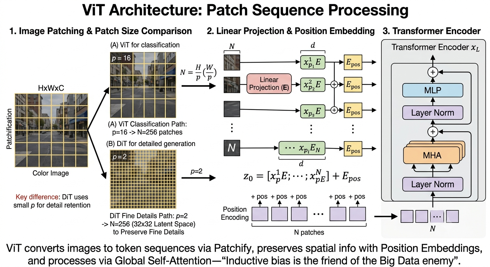
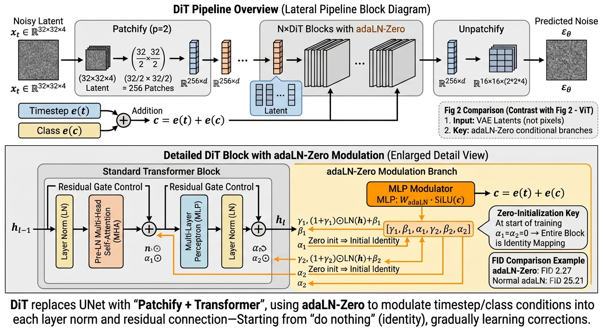

# 15.3 从 ViT 到 DiT：Transformer 接管扩散模型

> “CNN 的视野永远被框在卷积核里，看不了远处。如果让图像里每个像素都能直接‘看’全图，去噪会不会更聪明？Transformer 的回答是‘会’——但它不靠局部卷积，而靠‘谁和谁相关’来聚合信息。最反直觉的一步是：它把一张图切成小方块，当成一句‘词’来读。”

**本章目标**（读完后你应该能）：
- 说清自注意力为什么“单层即全局”，以及它和 CNN 局部卷积的本质区别；
- 解释 ViT 怎么把图像切块当“词”喂给 Transformer，以及为什么“归纳偏置是小数据的朋友、大数据的敌人”；
- 讲明白 DiT 如何用 Transformer 换掉 UNet，并靠 adaLN-Zero 注入时间步；
- 跑通一个最小 DiT 的前向 shape，确认“切块 → 处理 → 拼回”也满足输入同尺寸、输出同尺寸。

---

## 15.3.1 Transformer 基础：自注意力——让每个位置“看全图”

**因果承接**：15.2 末尾我们说，UNet 的 CNN 有局部感受野的硬伤——无论堆多深，每个像素的视野都被卷积核框住。Transformer 的解法干脆利落：用**自注意力**（self-attention，白话：序列里每个元素都去和所有其他元素“对一对眼神”，按相关性聚合信息），一步到位看到全局。

**核心运算**：输入是序列 $X\in\mathbb{R}^{n\times d}$（$n$ 个 token，每个 $d$ 维）。自注意力用经典的“查询-键-值”（Query-Key-Value）机制：

$$\text{Attention}(Q, K, V) = \text{softmax}\left(\frac{QK^T}{\sqrt{d_k}}\right)V$$

其中 $Q=XW_Q,\ K=XW_K,\ V=XW_V$，$W_Q,W_K,W_V\in\mathbb{R}^{d\times d_k}$。

**为什么需要这个公式？** 因为我们要让每个位置“按相关性”去聚合全图信息，而不是像卷积那样只看邻居。做法是给每个 token 发三顶“帽子”：
- **查询 $Q$**：“我在找什么？”——每个 token 发出一个查询向量；
- **键 $K$**：“我有什么？”——每个 token 提供一个键向量；
- **值 $V$**：“我的内容是什么？”——每个 token 携带一个值向量；
- $QK^T$ 算的是每对 token 的“相关性分数”，softmax 归一化后得到注意力权重，再对 $V$ 加权求和。

**那个 $\sqrt{d_k}$ 是干嘛的？** 当 $d_k$ 大时，点积的方差也大，softmax 容易饱和（梯度趋零）。除以 $\sqrt{d_k}$ 把方差稳住约在 1，梯度才传得动。

**多头注意力（Multi-Head Attention, MHA）**：并行跑 $h$ 个注意力头，各看不同子空间，再拼起来投影：
$$\text{MHA}(X) = \text{Concat}(\text{head}_1,\ldots,\text{head}_h)\,W_O,\quad \text{head}_i=\text{Attention}(XW_Q^i,XW_K^i,XW_V^i)$$
- 为什么多头？不同头关注不同关系——一个看局部邻域，一个看全局结构，一个看颜色。像人眼同时盯形状、颜色、运动。头数通常 6–16，$d_k=d/h$。

**Transformer Block**（Pre-LN 变体，现代默认）：
```
输入 h
  ├──→ LayerNorm → MHA → ──→ + ──→ h'   （残差：把 MHA 的输出加回原输入）
  ├──→ LayerNorm → MLP → ──→ + ──→ h''  （残差：把 MLP 的输出加回）
```
即 $h' = h + \text{MHA}(\text{LN}(h))$，$h'' = h' + \text{MLP}(\text{LN}(h'))$。MLP 是两层全连接：$\text{MLP}(x)=W_2\cdot\text{GELU}(W_1 x+b_1)+b_2$，隐层维度常取 $4d$。（完整细节见附录15A。）

**CNN vs Transformer 一句话对比**：

| 维度 | CNN | Transformer |
|---|---|---|
| 连接 | 局部（卷积核） | 全局（自注意力） |
| 权重 | 固定（与输入无关） | 动态（依赖输入的注意力） |
| 归纳偏置 | 平移等变性、局部性 | 几乎无（数据驱动） |
| 感受野 | 需堆层扩大 | 单层即全局 |
| 复杂度 | $O(n\cdot k^2)$ | $O(n^2)$ |

**关键洞察**：CNN 的局部性、平移等变性是手工设计的归纳偏置——小数据有效，但可能限制大数据上发现更优模式。Transformer 丢掉这些偏置，用更大数据需求换更大表达自由。

---

## 15.3.2 Vision Transformer：把图像切成“词”

**反直觉起点**：Transformer 本来是处理“天然成序列”的文本的。图像不是序列——那怎么办？ViT（Dosovitskiy et al., 2021）的办法很直接：**把图像切成小块（patch），每块当成一个“词”**。这一步叫 Patchify（白话：像拼图一样把图分成若干小方块，每块拉平成一个向量）。

流程：
1. 把 $H\times W\times C$ 图像切成 $N=(H/p)(W/p)$ 个 $p\times p\times C$ 的 patch；
2. 每个 patch 经线性投影变成 $d$ 维 token；
3. 加上可学习的位置编码（保留空间信息）；
4. 送进标准 Transformer 编码器。

**Patchify 详解**：图像重排为 patch 序列 $x_p\in\mathbb{R}^{N\times(p^2 C)}$，$N=HW/p^2$，再线性投影加位置编码：
$$z_0 = [x_p^1 E;\; x_p^2 E;\; \ldots;\; x_p^N E] + E_{\text{pos}}$$
- $E\in\mathbb{R}^{(p^2 C)\times d}$：可学习的 patch 嵌入矩阵；
- $E_{\text{pos}}\in\mathbb{R}^{N\times d}$：位置编码。

**patch 大小 $p$ 怎么选？**（先猜：是不是越大越好？——不，越大 token 越少、信息越粗）

| patch大小 $p$ | token数 $N$（256×256） | 信息保留 | 计算量 |
|---|---|---|---|
| 2 | 16384 | 最高（每 token 仅4像素） | 极大 |
| 4 | 4096 | 高 | 大 |
| 8 | 1024 | 中等 | 中等 |
| 16 | 256 | 低（每 token 含256像素） | 小 |

ViT 分类用 $p=16$（重全局、轻细节）；**DiT 扩散用 $p=2$**（要保精细空间细节）。



*图 15.2：图像被切成 $N=(H/p)(W/p)$ 个 $p\times p\times C$ patch，经线性投影 $E$ 映射为 $d$ 维 token 并加位置编码 $E_{pos}$，再送入标准 Transformer 编码器。关键差异：ViT 分类用 $p=16\to N=256$，而 DiT 扩散用 $p=2\to N=256$（作用于 32×32 潜空间）以保留精细细节。*

**ViT 的缩放规律**（一个“猜然后揭”的洞见）：你可能会以为 Transformer 凭全局注意力一定碾压 CNN——**其实不然**。先猜：在 CIFAR 这种小数据集上，ViT 应该比 CNN 强吧？真实结果是：
- 数据量小时：ViT 不如 CNN。缺乏归纳偏置，小数据喂不饱；
- 数据量大时：ViT 反超 CNN。归纳偏置不再是瓶颈，全局注意力的优势显现。
- 核心洞察：**归纳偏置是“小数据的朋友，大数据的敌人”**。这直接影响了扩散架构选择——在 LAION-5B 这种规模上，Transformer 潜力远超 CNN。

**从 ViT 到图像恢复：Restormer**（ViT→DiT 的桥梁）：标准 ViT 的 $O(n^2)$ 自注意力在高分辨率图上贵到离谱（256×256 图约 $4\times10^9$ 次运算），且 $p=16$ 太粗。Restormer（Zamir et al., 2022）改用跨头注意力（在通道维算注意力，复杂度降到 $O(d^2)$）、保留 UNet 式多尺度、用与分辨率无关的位置编码，证明了 Transformer 在像素级恢复上可行，也启示了“低分辨率层用全局注意力、高分辨率层用卷积”的混合思路。

---

## 15.3.3 DiT：用 Transformer 替换 UNet

**核心问题（DiT, Peebles & Xie 2023 提得很大胆）**：UNet 的 CNN 架构是不是不可替代？Transformer 能不能在扩散去噪上和 UNet 打平甚至打赢？

**整体架构**：“Patchify → N × DiT Block → Unpatchify”（Unpatchify 即 Patchify 的逆操作，把 token 拼回图像）：

```
含噪潜在表示 x_t ∈ R^{32×32×4}
      │
      ▼ Patchify (p=2)
Token 序列 ∈ R^{256×d}
      │
      ▼ N × DiT Block (含 adaLN-Zero)
      │
      ▼ Unpatchify
预测噪声 ε_θ ∈ R^{32×32×4}
```

**Patchify**：和 ViT 一样切 patch。DiT 在**潜空间**（latent space，白话：VAE 编码后的低维表示，如 32×32×4，而非原始像素）里操作。它测了 $p\in\{2,4,8\}$：$p=2$ token 最多（$N=256$）、细节最细、FID 最好；$p=8$ 便宜但 FID 差。DiT-XL/2 用 $p=2$。

**DiT Block**：在标准 Transformer Block 上加时间步条件（adaLN-Zero）。标准版是 $h'=h+\text{MHA}(\text{LN}(h))$、$h''=h'+\text{MLP}(\text{LN}(h'))$；DiT Block 把 adaLN-Zero 调制插进去：

$$\gamma_1,\beta_1,\alpha_1,\gamma_2,\beta_2,\alpha_2 = \text{MLP}_{\text{adaLN}}(\text{SiLU}(e(t)+e(c)))$$
$$h' = h + \alpha_1 \odot \text{MHA}\big((1+\gamma_1)\odot\text{LN}(h)+\beta_1\big)$$
$$h'' = h' + \alpha_2 \odot \text{MLP}\big((1+\gamma_2)\odot\text{LN}(h')+\beta_2\big)$$

其中 $e(t)$ 是时间步嵌入，$e(c)$ 是类别标签嵌入（如 ImageNet 1000 类）。

**为什么需要把 adaLN-Zero 嵌进 Block？** 因为 DiT 要像 UNet 一样“随 $t$ 变策略”，而 15.2.3 已经证明 adaLN-Zero 是注入条件最强最稳的方式。于是：
**adaLN-Zero 的完整实现（六参数从条件来）**：
1. 条件合并：$c = e(t) + e(c)$（相加而非拼接，得统一条件向量）；
2. 预测六参数：$[\gamma_1,\beta_1,\alpha_1,\gamma_2,\beta_2,\alpha_2] = W_{\text{adaLN}}\cdot\text{SiLU}(c)$，$W_{\text{adaLN}}\in\mathbb{R}^{6d\times d}$，**关键：零初始化**；
3. 在 Block 里应用（MHA 前调制、MHA 后残差门控 $\alpha_1$、MLP 前调制、MLP 后残差门控 $\alpha_2$）。

**Zero 初始化的效果**：训练初期 $\alpha_1=\alpha_2=0$，于是 $h''=h'=h$——整个 Block 是恒等映射。随着训练，$\alpha$ 渐长，Block 逐步学会“在恒等映射上加多少修正”。这比随机初始化稳：网络从“什么都不做”起步，只学“该做多少”，而非从乱调里搜索方向。



*图 15.3（上）：整体流水线为“含噪潜在 $x_t\in\mathbb{R}^{32\times32\times4}$ → Patchify($p=2$) → Token 序列 $256\times d$ → $N\times$ DiT Block(含 adaLN-Zero) → Unpatchify → 预测噪声 $\varepsilon_\theta$”。（下）：DiT Block 放大——主路径为标准 Pre-LN Transformer 残差块；橙色条件支路将 $c=e(t)+e(c)$ 经 SiLU 与零初始化的 $W_{adaLN}$ 投影为 6 个调制参数 $[\gamma_1,\beta_1,\alpha_1,\gamma_2,\beta_2,\alpha_2]$，分别作用于两处 LayerNorm 的缩放/平移 $(1+\gamma)\odot\mathrm{LN}(h)+\beta$ 与两处残差门控 $\alpha\odot$。Zero 初始化使训练初期 $\alpha_1=\alpha_2=0$，整个 Block 退化为恒等映射。*

**DiT 的缩放配置**（固定 $p=2$，靠深度/宽度缩放）：

| 模型 | 层数 $N$ | 隐藏维度 $d$ | 头数 $h$ | 参数量 | Gflops ($p=2$) |
|---|---|---|---|---|---|
| DiT-S/2 | 12 | 384 | 6 | 33M | 1.4 |
| DiT-B/2 | 12 | 768 | 12 | 130M | 5.6 |
| DiT-L/2 | 24 | 1024 | 16 | 458M | 19.7 |
| DiT-XL/2 | 28 | 1152 | 16 | 675M | 29.1 |

**DiT 的缩放规律（本章最该记住的实用结论）**：Gflops 越大、FID 越低，近似幂律 $\text{FID}\propto(\text{Gflops})^{-\alpha}$。adaLN-Zero 的重要性吓人：同一 DiT-XL/2，用 adaLN-Zero 达 FID=2.27，用普通 adaLN 是 25.21。**意义**：你可以先在 DiT-S 上验证设计，再放心放大到 DiT-XL——小规模实验能预测大规模表现，大幅降低试错成本。

---

## 动手感受一下：最小 DiT 的前向 shape（可运行）

> 下面这段**可运行**代码（依赖 `torch`）不训练，只演示 DiT 的“切块 → 处理 → 拼回”信息流，确认输入同尺寸、输出同尺寸。存成 `mini_dit.py` 后 `python mini_dit.py` 即可。

```python
# ============================================================
# 最小 DiT 前向 shape 演示（玩具输入，不训练，只跑 shape）
# 依赖: torch。运行: python mini_dit.py
# 目标: 亲眼确认 Patchify -> Block -> Unpatchify 输入同尺寸、输出同尺寸
# ============================================================
import torch
import torch.nn as nn

def show(name, x):
    if isinstance(x, torch.Tensor):
        print(f"{name:28s} -> shape {tuple(x.shape)}")
    else:
        print(f"{name:28s} -> {x}")

class MiniDiT(nn.Module):
    def __init__(self, in_ch=4, patch=2, dim=32):
        super().__init__()
        self.patch = patch; self.dim = dim
        # Patchify: 每个 p×p×in_ch 的块展平成 (p^2 * in_ch) 维, 再投影到 dim 维 token
        self.proj = nn.Linear(patch * patch * in_ch, dim)
        # 这里用单个 Linear 代替 N 个 DiT Block —— 仅演示 shape 流, 不演示注意力
        self.block = nn.Linear(dim, dim)
        # Unpatchify: 把 dim 维 token 投影回 p×p×in_ch, 再 reshape 回图像
        self.deproj = nn.Linear(dim, patch * patch * in_ch)

    def forward(self, x):
        show("输入 x (潜空间)", x)
        B, C, H, W = x.shape
        p = self.patch
        # 切成 (H/p, W/p) 个 patch, 每块 p×p×C
        patches = x.unfold(2, p, p).unfold(3, p, p)   # [B,C,H/p,p,W/p,p]
        patches = patches.permute(0, 2, 4, 1, 3, 5).reshape(B, -1, p*p*C)
        show("Patchify 后的 token 序列", patches)
        tok = self.proj(patches);  show("投影到 dim 维 token", tok)
        tok = self.block(tok);     show("经过 (占位) DiT Block", tok)
        tok = self.deproj(tok);    show("投影回 patch 维度", tok)
        # Unpatchify: reshape 回 [B,C,H/p,p,W/p,p] 再拼回 [B,C,H,W]
        tok = tok.reshape(B, H//p, W//p, C, p, p).permute(0, 3, 1, 4, 2, 5)
        out = tok.reshape(B, C, H, W)
        show("Unpatchify 输出 (尺寸同输入)", out)
        return out

print("="*60)
print("【MiniDiT 前向 shape】输入 1x4x32x32 (潜空间), 输出应同尺寸")
print("="*60)
dit = MiniDiT(in_ch=4, patch=2, dim=32)
dit(torch.randn(1, 4, 32, 32))   # 跑一遍, 看打印
```

跑完你会看到：32×32 的图被切成 256 个 2×2 的 token，处理完再拼回 32×32——和 UNet 路线不同，但同样满足“输入同尺寸、输出同尺寸”。

---

## 收尾：为什么这件事重要

这一节最反直觉的一跃是：**把图像切块当“词”，Transformer 就能像读句子一样读图**。DiT 用这条思路把 UNet 的 CNN 骨干整个换掉，再用 15.2 的 adaLN-Zero 把时间步喂进每个 Block。它的哲学和 UNet 正好相反——UNet 把“图像是局部、多尺度的”写进架构，DiT 几乎不作假设、让数据自己教。下一节我们就把这两种哲学摊开比一比：到底什么时候该选谁。

**连接下一节**：DiT 在 ImageNet 上证明了 Transformer 能替掉 UNet。但落到你的具体任务，该选谁？这两种架构的设计哲学本质区别在哪？

**来源**：Dosovitskiy et al. (2021) "An Image Is Worth 16x16 Words: Transformers for Image Recognition at Scale"; Peebles & Xie (2023) "Scalable Diffusion Models with Transformers"; Zamir et al. (2022) "Restormer: Efficient Transformer for High-Resolution Image Restoration"; Vaswani et al. (2017) "Attention Is All You Need"; Ratti P38 (ViT概念)
