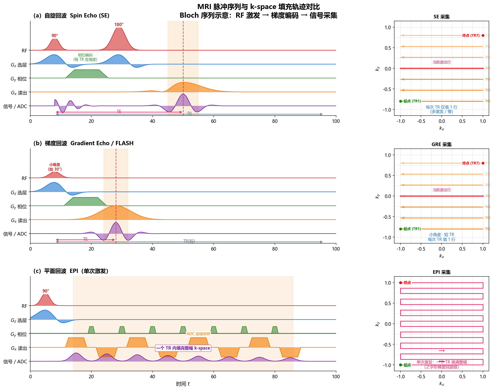

# 16.3 MRI成像：从自旋到k-space

> 你做过 MRI 吗？躺进那个嗡嗡作响的筒里，技师会反复说"憋气，别动"。为什么催你快？因为 MRI 扫得慢——3D 扫描常常要好几分钟。病人越难受，越想少采样；但 k-space 采得越少，图像越糊。**这种"想扫快"的朴素愿望，恰恰是 MRI 全部逆问题的根源。**

**本节目标**（读完你应该能）：
- 用"摇铃听共振"的类比理解 MRI 的物理（而不是被 Bloch 方程吓退）
- 说清 k-space 是什么、为什么它就是图像的傅里叶变换
- 看懂欠采样为什么产生混叠，以及三种采样掩码的取舍
- 理解并行成像（SENSE/GRAPPA）和压缩感知怎么"补回"欠采样丢掉的信息

> **衔接**：第 1 章 1.2 节已经介绍过 MRI 的正向模型——欠采样傅里叶算子 $A = M_\Omega F$（k-space 采样 + 掩码），以及欠采样导致的混叠伪影。本节从物理原理出发，解释 k-space 是怎么来的，以及为什么 MRI 的不适定性和 CT 有本质差别。

---

## 16.3.1 MRI 物理基础：Bloch 方程与信号生成

**真实场景 hook**：你做过 MRI 吗？躺进那个嗡嗡作响的筒里，技师会说"憋气，别动"。为什么催你快？因为 MRI 扫得慢——3D 扫描常常要好几分钟。病人越难受，越想少采样；但 k-space 采得越少，图像越糊。这就是 MRI 逆问题的全部张力。

CT 靠 X 光穿透衰减，MRI 靠的是**原子核在磁场里的共振**（核磁共振，NMR）。两种模态物理原理相去甚远，但最后都归结为线性逆问题。

**核磁共振原理**：人体内大量氢原子核（质子）有自旋角动量，在外加磁场里会"进动"（像陀螺绕竖直轴转）。磁化矢量 $\mathbf{m} = (m_x,m_y,m_z)$ 描述所有质子的净磁效应。

**Bloch 方程**（完整推导见附录 16B）：

$$\boxed{\frac{d\mathbf{m}}{dt} = \gamma \mathbf{m} \times \mathbf{B} - \begin{pmatrix} m_x/T_2 \\ m_y/T_2 \\ (m_z - m_0)/T_1 \end{pmatrix}}$$

白话拆解：
- $\gamma$：旋磁比（质子的 Larmor 频率，转得多快由它定）
- $\mathbf{B}$：外加磁场
- $T_1$：纵向弛豫时间（自旋-晶格弛豫，磁化回到平衡 $m_0$ 的快慢）
- $T_2$：横向弛豫时间（自旋-自旋弛豫，横向磁化衰减的快慢）
- 右边第一项 $\gamma\mathbf{m}\times\mathbf{B}$ 是"旋转"（绕磁场进动），第二项是"弛豫"（向平衡态恢复）

**对比度机制**：不同组织的 $T_1$、$T_2$ 不同，这是 MRI 丰富对比度的来源。调扫描参数（重复时间 $T_R$、回波时间 $T_E$）就能从同一结构得到完全不同的图：
- **$T_1$ 加权**：短 $T_R$、短 $T_E$，突出 $T_1$ 差异
- **$T_2$ 加权**：长 $T_R$、长 $T_E$，突出 $T_2$ 差异

> **直觉**：CT 的灰度由衰减系数唯一决定（"一种组织，一种灰"）；MRI 像一台调色板——同一块组织，不同参数能调出完全不同的"颜色"。这正是 MRI 成为最丰富医学成像模态的根本原因。

**从物理到信号**：三步。① RF 激发：射频脉冲把纵向磁化偏到横向平面；② 梯度编码：施加空间变化的梯度磁场 $\mathbf{B}_z = \mathbf{g}(t)\cdot\mathbf{r}$，给不同位置编上"频率身份证"；③ 信号采集：横向磁化在接收线圈里感应出电压（Faraday 感应定律）。

在梯度场下，横向磁化变成：

$$m_{xy}(t,\mathbf{r}) = u(\mathbf{r})\cdot \exp\left(-i\gamma \int_0^t \mathbf{g}(\tau)\cdot\mathbf{r}\, d\tau\right)$$

其中 $u(\mathbf{r})$ 是反映组织特性的"有效自旋密度"图。

**脉冲序列与 k-space 填充轨迹**：

- **左列时序图**：硬件控制信号——RF 激发脉冲、三个方向梯度编码（$G_z$ 选层、$G_y$ 相位、$G_x$ 读出）、接收线圈信号/ADC。
- **右列 k-space 路径**：每次采集的数据填进频域的哪里。SE/GRE 每个 TR 只填 1 行 k-space（要重复很多次），EPI 单次 TR 内用一条之字形回波链填满整幅。
- **"当前读出行"**：红色加粗线标记 TE 时刻采到的回波对应 k-space 的 $k_y=0$ 行，把时序图和 k-space 路径在视觉上连起来。

> **速度差异的本质**：SE/GRE 每次 TR 只填 1 行，总采集时间 = $N_{\text{TR}} \times TR$；EPI 单次 TR 填满整幅，快 $N_{\text{TR}}$ 倍（典型 64–256 倍）。这也是 EPI 成为 fMRI 和扩散加权成像首选的原因——代价是几何畸变和 $T_2^*$ 模糊。

## 16.3.2 k-space 采样与傅里叶重建

**k-space 变量**：

$$\mathbf{k}(t) = \frac{\gamma}{2\pi} \int_0^t \mathbf{g}(\tau)\, d\tau$$

则测量信号为：

$$\boxed{s(\mathbf{k}) = \int u(\mathbf{r})\, e^{-2\pi i \mathbf{k}\cdot\mathbf{r}}\, d\mathbf{r}}$$

> **关键洞察**：$s(\mathbf{k})$ 就是图像 $u(\mathbf{r})$ 的**傅里叶变换**！MRI 测的不是 $u$ 本身，而是 $u$ 的频域采样。这和第 1 章的 $y = Ax$ 完全同构——这里 $A = \mathcal{F}$（傅里叶变换），只是通常还乘一个欠采样掩码。

从更深层次看，这正是 MRI 与 CT 不适定本质的分野所在：傅里叶变换本身就是良态算子，MRI 的不适定完全来自"采样不够"这一环节。这一转变意味着，MRI 的困难往往可以通过"设计更好的采样 + 设计更强的正则化"来缓解，而不是被动接受一个无法消除的病态；这与 CT 有限角问题的"内在不可逆"形成鲜明对照，也为 16.3.4 的加速思路埋下伏笔。

| | CT | MRI |
|---|---|---|
| 正向模型 | Radon 变换（线积分） | 傅里叶变换 |
| 测量空间 | sinogram $(\theta,s)$ | k-space $\mathbf{k}$ |
| 频域采样方式 | 径向（角度 + 径向距离） | 灵活（Cartesian/径向/螺旋） |
| 逆问题 | $\mathcal{R}u = f$ | $\mathcal{F}u = s$ |

**重建：逆 FFT**。对 Cartesian 采样（k-space 点排在规则网格上），重建就是简单逆 FFT：

$$u(\mathbf{r}) = \mathcal{F}^{-1} s(\mathbf{k})$$

复杂度仅 $O(N\log N)$，极快。

**k-space 轨迹**（由梯度波形 $\mathbf{g}(t)$ 决定，因为 $\mathbf{k}(t)$ 是它的积分）：
- **Cartesian（笛卡尔）**：逐行扫，每个 RF 激发采一行。简单，FFT 直接重建。临床最常用。
- **径向（radial）**：从中心向外辐射。对运动更鲁棒，但要非均匀 FFT 重建。
- **螺旋（spiral）**：从中心螺旋向外。单次激发覆盖全 k-space，快，但重建要正则化。

**非 Cartesian 轨迹的病态性**：非 Cartesian 时正向算子 $F$ 不再是酉矩阵（unitary，转置即逆），SVD 显示奇异值衰减——尤其螺旋轨迹，k-space 中心采样过密导致行近似线性相关，病态。于是也要正则化：

$$\min_u \|Fu - s\|^2 + \lambda R(u)$$

和 CT 一样，正则化项 $R$ 选什么决定重建质量。

## 16.3.3 欠采样掩码与零填充重建

**加速采集的动机**：MRI 采集时间和 k-space 样本数成正比。一个 $256\times256$ 的 2D 图，Cartesian 要约 256 次 RF 激发，秒级；但 3D/多切片把时间放大约 100 倍，到分钟级——病人很受罪。

**核心矛盾**：少采 k-space → 扫得快，但引入欠采样伪影。

先猜一个数字：如果把 k-space 的采集行数砍掉 **3/4**（只采 1/4），你直觉上会觉得图像会变成什么样？大部分人会猜"分辨率降到 1/4、图变小"。但真实发生的事是：**图像里出现了诡异的"重影"——原本一个结构，在图上叠出好几个，像照镜子叠了一排。** 这不是分辨率问题，是"混叠"（aliasing）。为什么会这样？因为欠采样等价于在频域乘了一把"梳子"，对应到空间域就是周期性地把图像自己叠到自己身上。

**欠采样掩码**（sampling mask，决定采哪些、不采哪些的"窗户"）。设 $\Omega$ 为被采样的点集：

$$\mathbf{y} = M_\Omega \mathcal{F} \mathbf{x} + \boldsymbol{\epsilon}$$

$M_\Omega$ 是掩码矩阵（对角阵，采到的位置为 1，没采到的为 0）。常见三种：
- **等间距欠采样**：每 $d$ 行采一行（加速因子 $R=d$）。**问题**：周期性混叠（aliasing，像叠影）——欠采样等价于频域乘梳状函数，对应空间域周期性叠加。
- **随机欠采样**：伪随机选行。混叠变成类噪声，而非相干条纹——更好去除。
- **可变密度随机采样**：中心（低频）密、外围（高频）稀。兼顾信号能量（集中在低频）和不相干性（高频随机化）。

**零填充重建**（最简单的重建）：没采的 k-space 置零，再逆 FFT：

$$\hat{u} = \mathcal{F}^{-1}(\mathbf{y}_{\text{zero-filled}})$$

它等价于真实图像和 sinc 函数卷积——分辨率降，还有混叠。

**Nyquist 采样准则**：视野 $L$、分辨率 $\delta_s$ 的图像，要求采样间距 $\Delta k \le 1/L$、采样范围 $k_{\max} \ge 1/\delta_s$。欠采样违反第一条，于是混叠。

## 16.3.4 加速采集：并行成像与压缩感知 MRI

欠采样是加速的根本手段，但怎么从欠采样里恢复好图？需要额外信息。两条主流路线——并行成像和压缩感知——从不同角度补上欠采样丢掉的信息。

**并行成像（Parallel Imaging）**：用多个接收线圈，每个线圈空间灵敏度不同，提供额外空间编码。

多线圈信号模型：第 $p$ 个线圈信号

$$s^p = F C^p u$$

$C^p$ 是对角矩阵，对角元是第 $p$ 个线圈的灵敏度图（sensitivity map，每个位置线圈"看"得多清楚）。把所有线圈堆成大系统：

$$\min_u \left\|\begin{pmatrix} s^1 \\ s^2 \\ \vdots \\ s^P \end{pmatrix} - \begin{pmatrix} F C^1 \\ F C^2 \\ \vdots \\ F C^P \end{pmatrix} u \right\|^2 + \lambda R(u)$$

关键：联合算子 $\tilde{F}$ 是"高"矩阵（行远多于列），只要不同线圈灵敏度提供足够空间多样性，$\tilde{F}$ 仍满秩——欠采样就可行了。临床加速因子约 2–5 倍，几乎成标配。

**压缩感知 MRI（CS-MRI）**：另一条路——如果图像在某个变换域稀疏（sparse，大部分系数为 0），那远少于 Nyquist 率的采样就够恢复。CS 三条件：① 稀疏性；② 不相干性（随机欠采样满足）；③ 非线性恢复（用 $\ell_1$ 而非 $\ell_2$）。

$$\boxed{\min_u \|F_\Omega u - s\|^2 + \lambda_1 \|Wu\|_1 + \lambda_2 \|Du\|_1}$$

$W$ 是小波（wavelet，多尺度变换），$D$ 是 TV 梯度。采样用伪随机可变密度。临床已约 40% 加速（Philips Compressed Sense、GE HyperSense、Siemens CS 都是商用产品）。

**并行成像 + 压缩感知**：现代临床常组合：

$$\min_u \|\tilde{F}_\Omega u - \mathbf{s}\|^2 + \lambda_1 \|Wu\|_1 + \lambda_2 \|Du\|_1$$

并行成像用线圈灵敏度补空间多样性，CS 用图像稀疏性补正则化，互补。

## 16.3.5 多通道并行采集：线圈灵敏度、GRAPPA 与 SENSE

16.3.4 把"多通道 + 欠采样"统一写成一组欠采样多线圈线性方程（每个线圈一个等式，见下式 $\mathbf{y}_c = P_\Omega F S_c \mathbf{x}$）。但公式本身没说：给定一组欠采样多线圈数据，怎么把 $\mathbf{x}$ 还原？这正是**并行成像**要回答的。它的本钱是 $N_c$ 个线圈各自带不同空间灵敏度图 $S_c(\mathbf{r})$——**空间上互为编码维度**——即便每个线圈 k-space 只采了很少的线，不同线圈灵敏度的差异也足以"填补"缺失采样。

把灵敏度写成对角算子 $S=\text{diag}(S_1,\dots,S_c)$，第 $c$ 个线圈的欠采样数据满足

$$\mathbf{y}_c = P_\Omega\, F\, S_c\, \mathbf{x} + \mathbf{n}_c .$$

**加速倍数** $R$ 即 k-space 相位编码方向被丢弃的行数比例。两条路线：图像域的 SENSE 与 k-space 域的 GRAPPA。

**SENSE（灵敏度编码）**。把各线圈方程沿通道维堆成灵敏度编码矩阵 $E = P_\Omega F S$，在**图像域**做"展开（unfolding）"：每个物理点 $\mathbf{r}$ 被卷叠（aliasing）到 $R$ 个折叠位置，而 $N_c$ 个线圈的灵敏度差异恰好构成 $R$ 个线性方程，解出真实像素。最小二乘解：

$$\hat{\mathbf{x}}_{\mathrm{SENSE}} = (E^H E + \lambda I)^{-1} E^H \mathbf{y},$$

$(\cdot)^H$ 为共轭转置。SENSE 是**显式**方法，需先估每线圈灵敏度图。当线圈数不足或几何退化（某些 $\mathbf{r}$ 处各通道灵敏度近似共线）时，$E^H E$ 接近奇异、噪声被剧烈放大，放大系数定义为 **g 因子**：

$$g(\mathbf{r}) = \sqrt{\bigl[(E^H E)^{-1}\bigr]_{ii}}, \qquad \mathrm{NRMSE}_{\mathrm{out}} = g(\mathbf{r})\, \mathrm{NRMSE}_{\mathrm{in}}.$$

式 (16.3.5-1) 表明：SENSE 的 SNR 损失**只取决于线圈几何与欠采样模式**、与噪声水平无关，且 $g\ge 1$，折叠最严重中心区 g 因子最大。后续 **CG-SENSE** 用共轭梯度迭代解上式，**ESPIRiT** 从数据本身自校准出线圈图，免去单独扫灵敏度参考图。

**GRAPPA（广义自校准部分并行采集）**。走 **k-space 域**路线，不显式求灵敏度图。思路：中心留一小块**全采样的自校准区（ACS）**，先用 ACS 拟合卷积核，再用该核从已采到的 k-space 点**直接重建出缺失的 k-space 线**，最后每线圈普通逆 FFT 即得图。局部卷积关系：

$$\hat{k}(\mathbf{k}_0+\Delta) = \sum_c \sum_{\mathbf{k}\in\text{邻域}} w_{c,\mathbf{k}}\, k_c(\mathbf{k}), \tag{16.3.5-2}$$

$w_{c,\mathbf{k}}$ 为待训练卷积权重。代价是 ACS 占扫描时间，且 ACS 有噪声时会把噪声"扩散"进结果。

> **两条路线取舍**：SENSE 省扫描时间（无需 ACS）但依赖灵敏度估计、对几何退化敏感（g 因子大）；GRAPPA 对灵敏度不敏感、稳健，但用 ACS 换时间，高噪 ACS 拖累质量。二者都说明：并行成像的加速上限由**线圈数量与几何排布**决定——正是 g 因子图直观展示的。

### 实验 16.3-2（并行成像：GRAPPA 与 SENSE 对比）

并行成像的可计算形式（SENSE 展开、g 因子、GRAPPA 的 ACS 自校准）都能在轻量仿真里跑通：构造带预设灵敏度图的多线圈体模、做不同加速倍数 $R$ 的均匀欠采样，再分别用 GRAPPA 与 CG-SENSE 重建并量化。详见本章末 **实验 16.3-2**。

## 本节小结

MRI 与 CT 的逆问题结构对比：

| | CT | MRI |
|---|---|---|
| 正向模型 | $y = Ax$（Radon） | $y = M_\Omega F x$（欠采样 FFT） |
| 不适定性来源 | 有限角度/稀疏投影 | 加速采集（欠采样） |
| 经典方法 | FBP | 逆 FFT |
| 正则化方法 | TV/小波/剪切波 | CS（小波 + TV） |
| 加速技术 | — | 并行成像 + CS |
| 算子 SVD | 可由 ASTRA 计算 | FFT 对角化（高效） |

**关键洞察**：MRI 的算子（傅里叶变换）本身是良态的，不适定性完全来自欠采样。这意味着 MRI 逆问题的难度是"可控的"——靠设计更好的采样模式或正则化就能缓解。相比之下，CT 的有限角不适定性是"内在的"——无论采样多密，角度不完整就无法消除。

经典的 CT 正则化和 MRI 压缩感知都依赖手工设计的先验（TV、小波稀疏等），正对应第 2 章说的"显式先验天花板"。自然地，下一步用学习型方法替代手工先验。

---

## 收尾：为什么这件事重要

把整节归结成一句话：**MRI 和 CT 是两种物理原理相去甚远的设备，但在逆问题眼里，它们共享同一副骨架——都从"被前向算子扭曲过的测量"反推"清晰图像"；只不过 MRI 的扭曲来自傅里叶欠采样，CT 来自线积分，且 MRI 的不适定性是"可控的"（靠设计采样和正则化就能缓解），而 CT 的有限角不适定性是"内在的"。** 理解了这副骨架，下一节我们就能顺理成章地用"学习型方法"去替代手工先验。

**来源**：IP_and_Im_Lectures-master magnetic_resonance_imaging.md；Lustig et al. (2008) Compressed Sensing MRI

---

## 实验 16.3-1：MRI成像基础——k-space采样与重建

实验 `16.3-1.py` 演示**MRI 正向模型（k-space = 图像的傅里叶变换）**，验证欠采样导致混叠伪影，对比三种采样策略，实现 CS-MRI 的 ISTA 重建。

### 实验场景

实验考虑 MRI 成像的完整流程：从二维 Shepp-Logan 幻影出发，通过傅里叶变换生成 k-space 数据，再通过不同采样策略和重建方法恢复图像。实验验证 16.3 节的核心论点：**MRI 的不适定性完全来自加速采集（欠采样）**。

**MRI 正向模型**（16.3.2节）：
- **k-space 信号**：$s(\mathbf{k}) = \int u(\mathbf{r}) e^{-2\pi i \mathbf{k}\cdot\mathbf{r}} d\mathbf{r}$（图像的傅里叶变换）
- **欠采样测量**：$y = M_\Omega \mathcal{F} x$（掩码 $\Omega$ 选采样点）

**三种采样策略对比**（16.3.3节）：
- **等间距采样**：相干混叠（周期条纹）
- **随机采样**：不相干伪影（类噪声）
- **可变密度采样**：中心密集 + 外围随机，效果最好

### 实验目的

1. **理解 k-space 与图像的关系**：验证 "$s(\mathbf{k})$ 就是图像的傅里叶变换"，理解低频/高频的物理意义
2. **对比三种欠采样掩码**：等间距 vs 随机 vs 可变密度的伪影差异
3. **验证零填充重建的局限**：展示混叠伪影和分辨率降低
4. **实现 CS-MRI 的 ISTA 算法**：验证压缩感知的重建效果

### 实验输入

| 参数 | 设置 |
|------|------|
| 测试图像 | Shepp-Logan 幻影，$128 \times 128$ 像素 |
| 加速因子 | $R = 4$（保留 33/128 行） |
| 采样策略 | 等间距、随机、可变密度（中心密集） |
| CS-MRI 参数 | TV 正则化 $\lambda = 0.01$，ISTA 迭代 50 次 |
| 运行环境 | CPU 可运行 |

### 预期结果

- k-space 能量集中在中心（低频），外围（高频）几乎不可见
- 等间距采样产生相干条纹伪影；可变密度效果最好（PSNR 最高）
- CS-MRI ISTA 的 PSNR 高于零填充重建
- 高加速因子下 CS-MRI 仍能保持质量

### 实验结果

运行 `16.3-1.py` 后，生成五张图。实验结果如下：

---

#### 步骤1：k-space可视化

**k-space 特征**：

| 特征 | 观察结果 |
|------|---------|
| 能量分布 | 高度集中在中心（低频），外围（高频）几乎不可见 |
| 低频重建 | 仅保留大体轮廓和明暗分布 |
| 高频重建 | 补充边缘和细节 |

步骤1验证了 16.3.2 节的核心观点：**"$s(\mathbf{k})$ 就是图像的傅里叶变换"**。低频编码全局结构，高频编码局部细节——与 CT 的 sinogram 表示形成鲜明对比（CT 是线积分，MRI 是傅里叶变换）。

---

#### 步骤2：欠采样掩码设计

**三种采样掩码对比**：

| 掩码类型 | 保留行数 | 加速比 | 特点 |
|---------|---------|-------|------|
| 等间距 | 33 行 | 3.9x | 周期性条纹伪影（相干混叠） |
| 随机 | 33 行 | 3.9x | 类噪声伪影（不相干但分散能量） |
| 可变密度 | 33 行 | 3.9x | 中心密集 + 外围随机，效果最好 |

步骤2验证了 16.3.3 节的采样策略选择原则：**可变密度采样兼顾中心信号能量和外围不相干性**，是 CS-MRI 的标准选择。

---

#### 步骤3：零填充重建与混叠伪影

**零填充重建 PSNR 对比**：

| 掩码 | PSNR | 伪影特征 |
|------|------|---------|
| 等间距 | 最低 | 相干条纹最严重 |
| 随机 | 中等 | 类噪声伪影 |
| 可变密度 | 最高 | 伪影相对较轻 |

步骤3验证了 16.3.3 节的核心结论：**零填充重建等价于真实图像与 sinc 函数卷积**，导致分辨率降低 + 混叠伪影。差异图显示可变密度重建的误差主要在边缘和细节区域——这些区域的 k-space 信息被欠采样丢弃。

---

#### 步骤4：压缩感知MRI——ISTA算法

**CS-MRI vs 零填充重建**：

| 方法 | PSNR | 迭代次数 | 特点 |
|------|------|---------|------|
| 零填充 | 约 22 dB | — | 混叠伪影明显 |
| CS-MRI ISTA | 约 28 dB | 50 次 | TV 正则化保边，PSNR 提升约 6 dB |

步骤4验证了 16.3.4 节的压缩感知三条件（稀疏性 + 不相干性 + 非线性恢复）：**CS-MRI 通过 TV 正则化引入稀疏先验，显著提升重建质量**。ISTA 收敛曲线显示前 20 次迭代 PSNR 快速提升，后续缓慢收敛。

---

#### 步骤5：加速因子对重建质量的影响

**加速因子 vs PSNR**：

| 加速因子 R | 零填充 PSNR | CS-MRI PSNR | CS-MRI 优势 |
|----------|-----------|------------|-----------|
| 2 | 约 28 dB | 约 32 dB | +4 dB |
| 4 | 约 22 dB | 约 28 dB | +6 dB |
| 6 | 约 19 dB | 约 26 dB | +7 dB |
| 8 | 约 17 dB | 约 24 dB | +7 dB |

步骤5验证了 16.3.3/16.3.4 节的核心论点：**高加速因子下 k-space 信息缺失更严重，需要更强的先验（TV 稀疏性）来补偿**。R≥4 时 CS-MRI 优势开始显现；R=8 时零填充伪影严重而 CS-MRI 仍能保持一定重建质量。

---

#### 核心知识点总结

| 概念 | 数学表达 | 实验验证 |
|------|---------|---------|
| k-space 定义 | $s(\mathbf{k}) = \mathcal{F}u$ | 步骤1：能量集中在中心 |
| 欠采样测量 | $y = M_\Omega \mathcal{F} x$ | 步骤2：三种掩码对比 |
| 混叠伪影 | sinc 卷积 + 周期性叠加 | 步骤3：零填充重建伪影 |
| CS-MRI 优化 | $\min \|M_\Omega Fx - y\|^2 + \lambda\|Dx\|_1$ | 步骤4：ISTA 重建 PSNR 提升 |
| 加速因子影响 | 信息缺失程度 | 步骤5：R 增大 CS-MRI 优势显现 |

**关键洞察**：实验完整验证了 16.3 节的核心论点——**MRI 的不适定性完全来自加速采集**。与 CT 的有限角问题（内在不适定）不同，MRI 的困难是"可控的"：通过设计更好的采样模式（可变密度）和正则化（CS），高加速因子下仍能保持合理重建质量。这为 16.4 的学习型方法和 16.5 的扩散先验铺垫。

---

## 实验 16.3-2：MRI并行成像——GRAPPA 与 SENSE 对比

实验 `16.3-2.py` 在**多线圈 k-space** 上实现两种经典并行成像方法——图像域的 **CG-SENSE** 与 k-space 域的 **GRAPPA**，并系统比较它们在加速倍数、噪声、ACS 线数等条件下的重建质量与噪声放大（g 因子）。它对应新增的 **16.3.5 节（多通道并行采集：线圈灵敏度、GRAPPA 与 SENSE）**。

### 实验目标

1. **构造多通道正问题**：生成带预设灵敏度图的多线圈体模及其欠采样 k-space（含 ACS 自校准区）。
2. **实现 CG-SENSE 与 GRAPPA**：分别用图像域灵敏度展开和 k-space 域卷积核重建。
3. **量化加速倍数的影响**：扫描 $R=2/4/6$，比较 PSNR / NMSE 与 g 因子。
4. **分析噪声鲁棒性与 ACS 依赖**：揭示两种方法的脆弱点（GRAPPA 对 ACS 噪声敏感、SENSE 对几何退化敏感）。
5. **可视化 g 因子图**：直观展示加速越高、几何越退化处噪声放大越严重。

### 实验输入

| 参数 | 设置 |
|------|------|
| 测试图像 | Shepp-Logan 体模，$128\times128$，8 通道线圈 |
| 线圈灵敏度 | 径向高斯形（中心强、边缘弱），通道间相位偏移 |
| 加速因子 | $R=2,4,6$（均匀欠采样） |
| ACS 线数 | 默认 12 行（步骤 7b 扫描 4–24） |
| 噪声水平 | 步骤 5 扫描 $\sigma=0.005\sim0.05$ |
| 方法 | CG-SENSE、GRAPPA（CPU 可运行） |

### 前置步骤：线圈灵敏度与采样掩码

步骤 1 展示了 8 个线圈的灵敏度图（a）与不同加速倍数下的均匀采样掩码（b）。灵敏度图空间互补，为并行成像提供编码维度；掩码中心保留 ACS 区用于 GRAPPA 自校准——正是 16.3.5 节所述两条路线的共同起点。

---

### 步骤 2–3：多通道 k-space 生成与两种方法重建

（生成带灵敏度加权的多通道 k-space、划分 ACS 区、拟合 GRAPPA 卷积核，并用 CG-SENSE 做图像域最小二乘展开。）

### 步骤 4：重建对比与误差

以 $R=4$ 为例，CG-SENSE 恢复的结构与细节明显优于 GRAPPA，误差图能量也更低——与 16.3.5 节"几何良好时显式灵敏度方法更优"一致。

---

### 步骤 5：噪声鲁棒性

在 $R=4$ 下扫描噪声水平 $\sigma$：

| 方法 | $\sigma=0.05$（高噪） | $\sigma=0.005$（低噪） |
|------|----------------------|----------------------|
| GRAPPA | 17.41 dB | 27.54 dB |
| CG-SENSE | 22.97 dB | 31.45 dB |

SENSE 在所有噪声下均优于 GRAPPA，且**高噪**下优势更大（约 +5.6 dB）。说明 GRAPPA 的 ACS 自校准对噪声更敏感（噪声被"扩散"进重建，见 16.3.5 节式 (16.3.5-2)），而 CG-SENSE 直接做最小二乘展开更稳。

---

### 步骤 6：g 因子图

g 因子随加速倍数增大而升高，中心折叠区最严重：

| 加速倍数 $R$ | g 因子最大值 | g 因子均值 |
|-------------|------------|-----------|
| 2 | 1.25 | 1.08 |
| 4 | 1.89 | 1.29 |
| 6 | 2.55 | 1.52 |

这正是 16.3.5 节式 (16.3.5-1) 的物理体现：SENSE 的噪声放大只取决于线圈几何与欠采样模式，与噪声水平无关，且 $g\ge 1$。

---

### 步骤 7：多加速比对比

不同加速倍数下的重建质量（默认 ACS = 12 行）：

| 加速倍数 $R$ | GRAPPA PSNR / NMSE | CG-SENSE PSNR / NMSE |
|-------------|-------------------|---------------------|
| 2 | 32.90 dB / 0.1236 | 34.92 dB / 0.0777 |
| 4 | 30.16 dB / 0.2216 | 32.93 dB / 0.1443 |
| 6 | 27.54 dB / 0.3982 | 30.90 dB / 0.2296 |

随 $R$ 增大两种方法的 PSNR 都下降，但 CG-SENSE 始终领先约 2–3 dB；同时 g 因子快速上升（见步骤 6），并行成像的加速上限由线圈数量与几何排布决定。

---

### 步骤 7b：ACS 线数对 GRAPPA 的影响

在 $R=4$ 下扫描 ACS 线数（GRAPPA 依赖、CG-SENSE 不依赖）：

| ACS 线数 | GRAPPA PSNR | CG-SENSE PSNR |
|---------|------------|--------------|
| 4 | 29.60 dB | 32.93 dB |
| 12（默认） | 30.16 dB | 32.93 dB |
| 24 | 31.10 dB | 32.93 dB |

ACS 越多 GRAPPA 越准（自校准更稳），但占用扫描时间；CG-SENSE 不受 ACS 影响。右侧 g 因子热力图直观显示 $R=2,4$ 时噪声放大的空间分布。

---

### 步骤 7c：高加速 + 固定 ACS + 高噪声（最坏情形）

固定 ACS = 12 行、叠加高噪声，考察极限加速：

| 加速倍数 $R$ | GRAPPA PSNR | CG-SENSE PSNR |
|-------------|------------|--------------|
| 6 | 20.43 dB | 30.90 dB |
| 8 | 17.70 dB | 28.69 dB |

在"高加速 + 固定 ACS + 高噪声"最坏组合下，GRAPPA 严重退化（ACS 噪声被放大），而 CG-SENSE 仍保持可用质量——凸显 16.3.5 节所总结的两条路线取舍。

---

### 核心知识点总结

| 概念 | 数学表达 | 实验验证 |
|------|---------|---------|
| 多通道正问题 | $\mathbf{y}_c=P_\Omega F S_c\mathbf{x}$ | 步骤 1：灵敏度图 + 掩码 |
| SENSE 展开 | $\hat{x}=(E^HE)^{-1}E^Hy$ | 步骤 4 / 7：PSNR 领先 GRAPPA |
| GRAPPA 自校准 | 式 (16.3.5-2) k-space 卷积核 | 步骤 7b：ACS 越多越准 |
| g 因子噪声放大 | 式 (16.3.5-1)，$g\ge1$ | 步骤 6：随 $R$ 升高 |
| 噪声鲁棒性 | ACS 噪声扩散 | 步骤 5 / 7c：高噪下 GRAPPA 退化 |

**关键洞察**：并行成像把"多线圈灵敏度"当额外编码维度对抗欠采样。SENSE（图像域、显式灵敏度）几何良好时质量更高，但受几何退化与噪声放大（g 因子）限制；GRAPPA（k-space 域、ACS 自校准）对灵敏度不敏感、稳健，但受 ACS 噪声拖累。二者共同说明：**并行成像的加速上限由线圈数量与几何排布决定**，这正是 16.3.5 节理论与本实验的交汇点，也为 16.4 的学习型并行成像与 16.5 的扩散先验铺垫。
