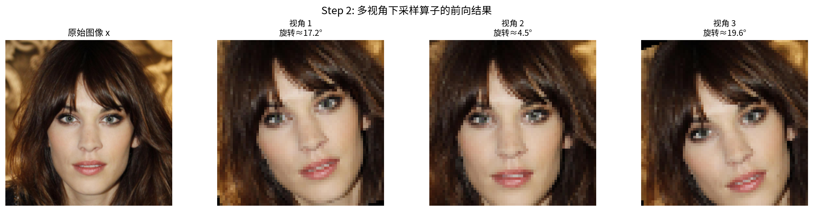
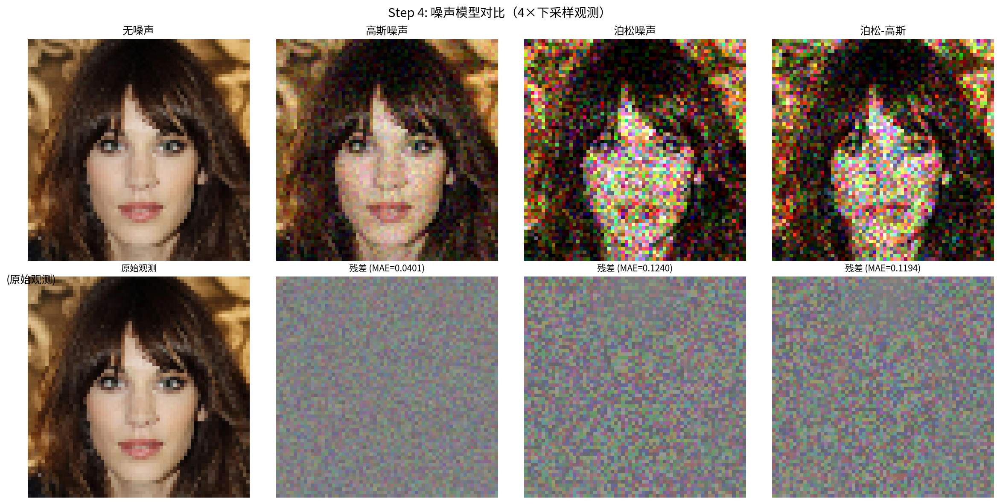
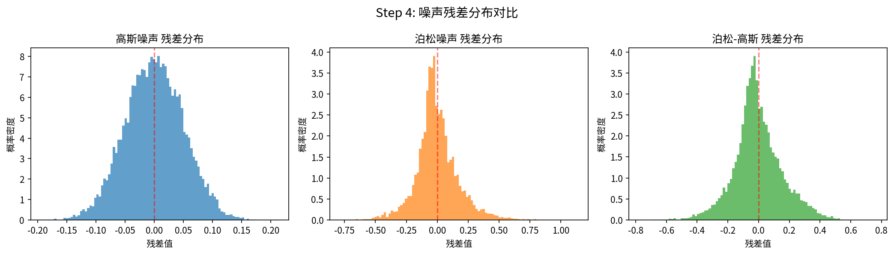
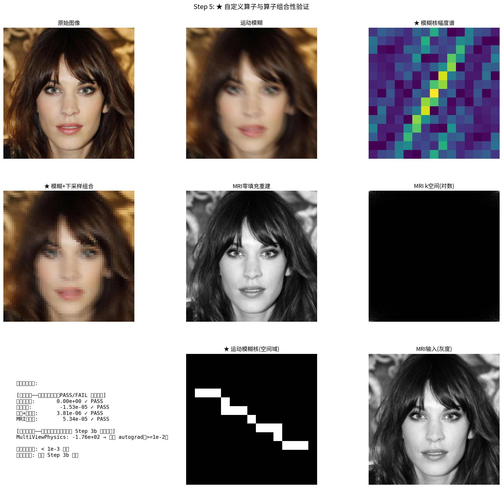

# 18.2 定义自定义前向算子：你的"物理引擎"写对了，后面才不白干

> 先讲个血泪故事。有个同学做超分辨率，公式抄得整整齐齐，扩散模型也跑通了，结果重建出来全是棋盘格。debug 三天，最后发现：他的下采样算子 $A$ 和上采样（伴随 $A^\top$）对不上——前向是"每 4 个像素留 1 个"，伴随却用了"双线性插值"。一个不对称，梯度就指错方向，迭代永远到不了该去的地方。**前向算子 $\mathcal{A}$ 就是逆问题的物理引擎；引擎装反了，整辆车都开歪。** 这一节，你就亲手装一次这台引擎。

读完这节，你应该能：
- 用一句 $y=Ax+\epsilon$ 说清"我的测量到底怎么来的"；
- 自己写一个线性前向算子，并**证明**它的伴随是对的；
- 看懂三种噪声模型怎么悄悄改变了你的求解器。

## 18.2.1 前向算子到底在干啥：先回到第 1 章

第 1 章早就埋下种子：逆问题的全部，就是"真实图 $x$ 经过某个物理过程，变成带噪测量 $y$"。那个物理过程，就是**前向算子**（forward operator，白话：把清晰图变成你手里那堆数据的机器）。

### 线性情形：最常见，也最好上手

绝大多数成像问题里，这个机器是线性的——加性噪声之外，过程是直的：

$$y = Ax + \epsilon$$

为什么写成这个样子？因为逆问题第一步永远是"先把物理说清楚"。你得先回答：给定一张真图 $x$，我手里的 $y$ 是怎么变出来的？$A$ 就是把图"压"成测量的矩阵（或更一般地，$A: \mathbb{R}^n \to \mathbb{R}^m$），$\epsilon$ 是噪声。不同逆问题，只是 $A$ 长不一样：

| 逆问题 | 前向算子 $A$ | 退化效果 | deepinv 类 |
|--------|------------|---------|----------|
| 去噪 | $A = I$（恒等） | 加性噪声 | `Denoising` |
| 去模糊 | $A = K$（卷积核） | 模糊+噪声 | `Blur` |
| 超分辨率 | $A = DS$（下采样×模糊） | 低分辨率+噪声 | `Downsampling` |
| 图像修复 | $A = M$（掩码） | 像素缺失+噪声 | `Inpainting` |
| CT 重建 | $A = \mathcal{R}$（Radon 变换） | 投影数据 | `Tomography` |
| MRI 重建 | $A = \mathcal{F}_u$（欠采样傅里叶） | k-space 缺失 | `MRI` |
| 压缩感知 | $A = \Phi$（随机矩阵） | 随机投影 | 自定义 |

> **和本书库的关系**：这里就是第 1 章的 $y=Ax$、第 16 章 CT/MRI 物理基础的"算子版"。

### 非线性情形：书里没全覆盖，但你迟早会撞上

有些过程不是直的：

$$y = \mathcal{A}(x) + \epsilon$$

为什么有些问题必须这么写？因为真实世界不都是直的。例如 $y = |\mathcal{F}(x)|^2$（相位恢复，丢掉了相位）、$y = K*x+\epsilon$ 但 $K$ 自己未知（盲去卷积）、PET 里测量和衰减系数的关系。非线性得用链式法则算梯度，deepinv 用 `NonLinearPhysics` 接。本章聚焦更常见的线性情形——但请你记住：你定义的是"物理"，不限于直的。

### 自定义逆问题的核心：选 / 写一个对的 $A$

面对书里没写过的全新问题，你的核心任务就一句：**选或定义合适的 $A$**。要满足三条：
1. **忠实地描述物理**——$A$ 应该就是你真实测量过程的数学写照；
2. **能高效算 $Ax$ 和 $A^\top y$**——前者正向走，后者算梯度（后面求解全靠它）；
3. **噪声特性得对**——选对噪声模型，似然才对（18.2.5 细说）。

## 18.2.2 deepinv 的 Physics 类：设计哲学决定了你好不好写

deepinv 的 `Physics` 模块不是随便设计的，它守三条原则。理解这三条，你自己写算子时就不会踩坑。

### 原则一：前向算子与伴随算子"成对出生"

对线性算子 $A$，几乎所有求解算法都要它的**伴随算子** $A^\top$（白话：把"测量空间里的方向"映射回"图像空间里的方向"）。为什么它如此关键？因为求解时几乎每一步都要它指路，比如：
- 梯度下降的梯度是 $2A^\top(Ax-y)$；
- PnP 的数据一致性步要 $A^\top$；
- DPS/DiffPIR 算似然梯度也要 $A^\top$。

所以 deepinv 强制你同时写 `A(x)` 和 `A_adjoint(y)`。一个没有伴随的前向算子，在深度求解里基本是残疾人。

### 原则二：噪声模型和退化过程分开

前向过程拆成两步更清爽：
1. 确定性退化：$\tilde y = Ax$
2. 随机噪声：$y = \tilde y + \epsilon$

为什么拆开？因为好处实在：换噪声模型不用动 $A$；同一 $A$ 能做不同噪声水平的对照实验（18.2-1 实验就这么玩）。

### 原则三：算子可组合

复杂前向 = 简单算子串起来：$A_{\text{composed}} = A_2 \circ A_1$。比如超分就是"模糊 + 下采样"：$A = D\cdot S$。（你会在 18.2-1 实验里看到 `Downsampling * Blur` 这种组合。）

### 类层次（心里有张地图）

```
Physics（基类）
├── LinearPhysics（线性算子）
│   ├── Denoising（A=I）
│   ├── Blur / BlurFFT（卷积模糊）
│   ├── Downsampling（下采样+抗混叠）
│   ├── Inpainting（像素掩码）
│   └── Tomography（Radon）
├── DecomposablePhysics（可 SVD 分解，如 MRI）
└── NonLinearPhysics（非线性）
```

常用方法（`LinearPhysics`）：

| 方法 | 数学对应 | 干啥 |
|------|---------|------|
| `A(x)` | $y = Ax$ | 正向走一遍 |
| `A_adjoint(y)` | $z = A^\top y$ | 伴随走一遍 |
| `A_dagger(y)` | $\hat x = A^\dagger y$ | 伪逆（最小二乘解，无先验基线） |
| `noise(x)` | $y+\epsilon$ | 加噪 |
| `adjointness_test(x)` | $\langle Ax,y\rangle = \langle x,A^\top y\rangle$ | 伴随验证 |
| `compute_norm(x)` | $\|A\|_2$ | 算子范数（幂迭代） |

## 18.2.3 亲手写两个自定义算子：运动模糊 + 去雾

光看类没感觉。我们来写两个"书里没有、但很真实"的算子。先别急着想扩散——先把"物理引擎"造对，这是 18.4 跑通实战的地基。

### 实例一：自定义运动模糊算子

想象你拍照时手抖了——清晰图上的每个点，在曝光时间内被"拖"成了一条线。这就是运动模糊：卷积核是一条斜线段。

**先猜一下**：一条长度为 15、角度 30° 的运动模糊核，它里面的非零值加起来应该是多少？
> 揭晓：应该正好 **1.0**（核要归一化，否则重建出来整体会偏亮或偏暗）。代码里 `kernel / kernel.sum()` 干的就是这件事。

纯 numpy 版（不依赖 deepinv，先建立直觉）：

```python
import numpy as np

def motion_blur_kernel(length=15, angle_deg=30):
    """造一个运动模糊核（白话：一条斜着的线，线上的点权重相等，总和=1）"""
    angle = np.deg2rad(angle_deg)
    kernel = np.zeros((length, length))
    c = length // 2
    cos_a, sin_a = np.cos(angle), np.sin(angle)
    for i in range(length):
        off = i - c
        r = int(round(c + off * sin_a))   # 注意：用 round 而非 int 截断，误差更小
        col = int(round(c + off * cos_a))
        if 0 <= r < length and 0 <= col < length:
            kernel[r, col] = 1.0
    kernel /= kernel.sum()                # ← 归一化，保证前向算子不改变整体亮度
    return kernel

# 用 scipy 的卷积就能"制造一次观测"（这里演示 numpy 思路，真实图像用 2D 卷积）
K = motion_blur_kernel(15, 30)
print("核的和 =", K.sum())   # 一定是 1.0
```

配 deepinv 时，直接把这个核塞进内置 `Blur` 即可（不用自己写类，省心）：

```python
import torch, deepinv as dinv
K = torch.tensor(motion_blur_kernel(15, 30))          # numpy→torch
physics = dinv.physics.Blur(img_size=(3, 256, 256), filter=K)
physics.set_noise_model(dinv.physics.GaussianNoise(sigma=0.05))
# 制造一次观测：y = A(x) + 噪声
# y = physics(x_true)
```

> 注意：这是"自定义核"而不是"自定义类"。书里大多数情况用内置 `Blur` + 自写核就够了。只有内置类表达不了你的物理时，才需要写子类（见下例）。

### 实例二：自定义"去雾"算子（多视角下采样，MiniProject 原版）

更进阶一点的真实场景：你有 $J$ 个相机，从不同角度、对同一物体拍了 $J$ 张低分辨率照片。每张观测是"先做个仿射变换 $T_j$（旋转+平移+缩放），再下采样 $A$"。整体模型：

$$y_j = A\,T_j\,x + \epsilon_j, \quad j=1,\dots,J$$

为什么写成这个复合形式？因为你手里不是一张观测，而是 $J$ 张"各自身处不同角度"的低清图。把每一张的"先变换后下采样"摞起来，整体前向就是

$$y = \begin{pmatrix} AT_1 \\ AT_2 \\ \vdots \\ AT_J \end{pmatrix} x + \epsilon$$

在 deepinv 里写一个 `LinearPhysics` 子类（完整可跑代码见附录 18A）。这里只点清"该写哪两件事"：

```python
import torch, deepinv as dinv

class MultiViewPhysics(dinv.physics.LinearPhysics):
    def __init__(self, base_physics, transf, **kwargs):
        super().__init__(**kwargs)
        self.base_physics = base_physics   # 下采样 A
        self.transf = transf               # 各视角仿射变换 T_j

    def A(self, x, **kwargs):
        """前向：对每个视角先做 T_j 再下采样 A"""
        ys = []
        for j in range(self.transf.shape[0]):
            grid = torch.nn.functional.affine_grid(self.transf[j:j+1], x.shape, align_corners=False)
            x_t = torch.nn.functional.grid_sample(x, grid, align_corners=False)
            ys.append(self.base_physics.A(x_t))
        return torch.stack(ys, dim=1)

    def A_adjoint(self, y, **kwargs):
        """伴随：每个视角先把 Aᵀ 算出来，再算 T_j 的伴随，最后加总。
        仿射变换的伴随手工极易错，强烈用 deepinv 的 adjoint_function（自动微分）保证正确。"""
        x = torch.zeros_like(self.base_physics.A_adjoint(y[:, 0]))
        for j in range(y.shape[1]):
            z = self.base_physics.A_adjoint(y[:, j])
            adj_fn = dinv.physics.adjoint_function(
                lambda v: torch.nn.functional.grid_sample(
                    v, torch.nn.functional.affine_grid(self.transf[j:j+1], v.shape, align_corners=False),
                    align_corners=False), z.shape)
            x = x + adj_fn(z)
        return x
```

**关键直觉**：伴随算子的"反向顺序"——前向是"先 $T_j$ 再 $A$"，伴随就得"先 $A^\top$ 再 $T_j^\top$，最后把所有视角加起来"。顺序反了，或者忘了"加起来"，结果就错。

## 18.2.4 伴随算子的验证：别相信你的手推，用内积检验法

### 为什么必须验证（呼应 18.2 开头那个血泪故事）

伴随算子是**所有基于梯度的求解方法的前提**。要是它写错了：
- 梯度下降的梯度 $\nabla_x\|Ax-y\|^2 = 2A^\top(Ax-y)$ 就指错方向；
- PnP 的数据一致性步错；
- DPS/DiffPIR 的似然梯度错。

后果：收敛到错解、震荡、或诡异伪影。所以**写完 $A$ 和 $A^\top$，第一件事不是去跑重建，而是验证它俩真的是一对**。

### 内积检验法（dot product test）——最朴素也最狠的招

数学保证：对任意 $x, y$，都有

$$\langle Ax, y \rangle = \langle x, A^\top y \rangle$$

为什么这个等式能当"验钞机"？因为它不依赖算子长啥样——你从图像空间往测量空间推一下再和点 $y$ 做内积，应该**等于**你从测量空间往图像空间拉一下再和点 $x$ 做内积。只要这对不上，说明 $A^\top$ 写错了。

**先猜一下**：如果你手推的伴随是错的（比如少了一个转置），这个相对误差大概会是多大？
> 揭晓：通常不是"差不多"，而是**大得离谱**——常见在 $10^{-3}$ 到 $10^{-5}$（边界/插值细节对不上），而正确实现应该在机器精度 $10^{-10}$ 甚至 $10^{-14}$ 量级。差了上亿倍，一眼就能揪出来。

纯 numpy 验证思路（无 deepinv 也能跑）：

```python
import numpy as np

def check_adjoint(A, A_adjoint, shape, n_test=10, tol=1e-8):
    """内积检验法：<Ax, y> 应该等于 <x, Aᵀy>，相对误差应 < tol"""
    worst = 0.0
    for _ in range(n_test):
        x = np.random.randn(*shape)
        y = np.random.randn(*A(x).shape)
        lhs = np.sum(A(x) * y)          # <Ax, y>
        rhs = np.sum(x * A_adjoint(y))  # <x, Aᵀy>
        rel = abs(lhs - rhs) / abs(lhs)
        worst = max(worst, rel)
    print(f"最坏相对误差 = {worst:.2e}  （应 < {tol}）")
    return worst < tol

# 例：一维下采样 A = 每 2 取 1，其伴随是上采样（补零）
def A_down2(x): return x[::2]
def A_down2_adj(y):
    z = np.zeros(2*len(y)); z[::2] = y
    return z
# check_adjoint(A_down2, A_down2_adj, shape=(100,))
```

deepinv 里更省事：

```python
x = torch.randn(1, 3, 256, 256)
print("伴随验证相对误差:", physics.adjointness_test(x))   # 应接近 0

# 手动版
lhs = torch.sum(physics.A(x) * y)
rhs = torch.sum(x * physics.A_adjoint(y))
print("手动相对误差:", abs(lhs - rhs) / abs(lhs))          # 应 < 1e-10
```

### 自动伴随：手推不来就交给 autograd

仿射变换、复杂插值这种，手推伴随极易错（见 18.2-1 实验：手动伴随误差在 $10^{-3}$ 量级，autograd 自动伴随能压到机器精度）。deepinv 用 PyTorch 的向量-雅可比积（vJP）直接算 $A^\top y$：

```python
from deepinv.physics import adjoint_function
auto_adj = adjoint_function(physics.A, x.shape)
z = auto_adj(y)   # 等价于 Aᵀ y，无需手推
```

代价：比手推慢 10–50%。但**正确性 >> 速度**，尤其你第一次写一个陌生算子时。

### 常见错误速查表

| 错误类型 | 表现 | 排查 |
|---------|------|------|
| 边界条件不匹配 | 内积误差 $10^{-3}\sim10^{-5}$ | 检查零填充 vs 循环卷积一致 |
| 仿射逆算错 | 验证通过但重建差 | 用纯平移先试 |
| 上下采样不匹配 | 伪逆出棋盘格 | 上采样插值方式要与下采样匹配 |
| 维度顺序错 | shape 异常 | 打印中间 shape |
| 忘归一化 | 重建偏亮/偏暗 | 查 kernel 和变换矩阵是否单位行列式 |

## 18.2.5 噪声模型：它决定了"似然长啥样"

噪声不是附加项，它**直接决定似然函数 $p(y|x)$**，进而决定求解器里的"数据项"用哪种距离。

### 三种常见噪声（先认脸）

**高斯噪声**——最常吃到的："热噪声、电子噪声"，信号越强噪声方差不变。为什么高斯最常见？因为它数学好欺负，残差正好是对称的钟形。模型写成：

$$y = Ax + \epsilon,\quad \epsilon \sim \mathcal{N}(0,\sigma^2 I)$$

于是似然是个高斯钟形，数据项就是 $\frac{1}{2\sigma^2}\|Ax-y\|^2$（第 1 章的 L2 距离）。deepinv：`GaussianNoise(sigma=0.05)`。

**泊松噪声**——光子计数类（CT、PET、天文）：信号越强，噪声越大（方差=均值）。模型是：

$$y \sim \text{Poisson}(Ax/\text{gain}) \times \text{gain}$$

数据项是 KL 散度（第 1 章 1.4 节说过）。deepinv：`PoissonNoise(gain=1.0)`。

**泊松-高斯混合**——低光成像（Cryo-EM、荧光显微镜）：又随信号变、又叠加恒定底噪。deepinv：`PoissonGaussianNoise(gain=1.0, sigma=0.1)`。

> **先猜后揭**：同样是"看起来有点噪"，高斯噪声的残差直方图和泊松噪声的残差直方图一样吗？
> 揭晓：**不一样**。高斯的残差是对称钟形；泊松的残差是**右偏**的（亮区噪声更大）。这个差别你在 18.2-1 实验的残差直方图里会亲眼看到。

### 噪声模型如何"卡"住你的方法选择

| 噪声模型 | 优化 | PnP | 扩散 |
|---------|------|-----|------|
| 高斯 | ✅ L2 数据项 | ✅ DPIR | ✅ DPS/DiffPIR |
| 泊松 | ✅ KL 数据项 | 🟡 要改数据项 | 🟡 要改似然 |
| 泊松-高斯 | ✅ 混合 | 🟡 要改 | 🟡 要改 |

**坑提醒**：大多数 PnP/扩散的默认实现**假设高斯噪声**。非高斯时你得改数据一致性步里的损失——这是实践中最容易被忽略的一处。

deepinv 里设定就一行：

```python
physics.set_noise_model(dinv.physics.GaussianNoise(sigma=0.05))
# 或泊松 / 泊松-高斯，见上
# 造观测：y = physics(x_true)  # 自动 A(x) + noise
```

> **因果串联收尾**：前向算子和噪声模型一定，你的"似然 $p(y|x)$"就定了。下一步（18.3）我们要在这个似然之上，结合"先验"，决定**用什么策略去求 $x$**——是只要一个点，还是要一整片后验云。

---

## 收尾：为什么这一节重要

前向算子是你和真实世界之间的"合同"：它规定了"清晰"如何变成"你看到的"。合同写错，后面再华丽的解法都只是在正确的方向上算错的方程。这一节你亲手签了这份合同，还学会了用内积检验法给它公证——接下来，我们才谈得上"怎么解"。

---

## 实验 18.2-1：自定义前向算子与伴随验证

实验 `18.2-1.py` 演示**自定义前向算子的完整实现流程**——从浏览 deepinv 内置 Physics 类体系，到实现多视角下采样复合算子 `MultiViewPhysics`，再到通过内积检验法验证伴随算子的正确性，并对比手动伴随与 autograd 自动伴随的精度差异。实验还覆盖了噪声模型的选择与对比，以及自定义模糊核、组合算子和 MRI 子采样算子的构建。

### 实验场景

实验围绕 18.2 节的三个核心主题展开：

**自定义复合算子**：实现多视角下采样算子 $y_j = A\,T_j\,x$（$j=1,\ldots,J$），其中 $A$ 是 4 倍下采样算子，$T_j$ 是随机仿射变换（旋转角度 $\leq \pi/8$、缩放 0.8、平移 $\leq 0.05$）。整体前向模型将 $J=16$ 个视角的观测堆叠为 $y \in \mathbb{R}^{B \times J \times C \times H' \times W'}$。

**伴随验证**：对内积检验法 $\langle Ax, y\rangle = \langle x, A^\top y\rangle$ 的相对误差进行多次随机测试，评估手动伴随与 autograd 自动伴随的精度。

**噪声模型对比**：在 4 倍下采样算子上分别施加高斯噪声（$\sigma=0.05$）、泊松噪声（gain=0.1）和泊松-高斯复合噪声（gain=0.1, $\sigma=0.05$），对比视觉效果与残差统计特性。

### 实验目的

1. **掌握 deepinv Physics 类的设计三原则**：配对性（$A$ 与 $A^\top$ 配对）、噪声分离（前向模型与噪声模型独立设置）、可组合性（算子可通过乘法组合）
2. **实现自定义 `LinearPhysics` 子类**：完成 `MultiViewPhysics` 的 `A(x)` 和 `A_adjoint(y)` 方法，理解复合算子 $A\,T_j$ 的伴随 $T_j^\top A^\top$ 的推导与实现
3. **验证伴随算子的正确性**：通过 dot product test 量化内置算子和自定义算子的伴随精度，理解手动伴随（仿射矩阵转置近似）与 autograd 自动伴随（VJP 精确计算）的差异
4. **理解噪声模型对求解策略的影响**：高斯噪声对应 $L^2$ 数据项，泊松噪声对应 KL 散度数据项，非高斯噪声需要修改数据一致性步骤

### 实验输入

| 参数 | 设置 |
|------|------|
| 测试图像 | celeba_example.jpg，$256 \times 256$ 像素 |
| 基础算子 | `Downsampling(factor=4, filter=None)` |
| 多视角参数 | $J=16$ 个视角，缩放 0.8，最大旋转角 $\pi/8$，最大平移 0.05 |
| 噪声模型（对比） | 高斯 $\sigma=0.05$；泊松 gain=0.1；泊松-高斯 gain=0.1, $\sigma=0.05$ |
| 自定义模糊核 | 运动模糊（长度 15，角度 30°） |
| 组合算子 | 运动模糊 $\to$ 4 倍下采样（`Downsampling * Blur`） |
| MRI 算子 | 4 倍加速，灰度输入 |

### 预期结果

- 内置算子（下采样、模糊、MRI）的伴随误差应接近机器精度（$< 10^{-10}$）
- 自定义 `MultiViewPhysics` 的手动伴随误差在 $10^{-3}$ 到 $10^{-2}$ 量级（因 `grid_sample` 双线性插值的伴随需要 VJP 精确计算，手动用仿射矩阵转置作近似会引入插值层误差）
- autograd 自动伴随的误差应低于手动伴随
- 组合算子（模糊+下采样）的伴随误差与子算子同量级
- 泊松噪声的残差分布呈非高斯形态（信号依赖型，方差随信号强度变化）

### 实验结果

运行 `18.2-1.py` 后，生成四张图。实验结果如下：

---

#### 步骤 2：多视角下采样算子的前向结果



原始图像经过 $J=16$ 个不同仿射变换后分别进行 4 倍下采样。每个视角的观测呈现不同的旋转角度和位移，分辨率从 $256 \times 256$ 降至 $64 \times 64$。输出张量 shape 为 $(1, 16, 3, 64, 64)$，体现了复合算子 $y_j = A\,T_j\,x$ 的前向映射。

---

#### 步骤 4：噪声模型对比



上排展示了 4 倍下采样观测在无噪声、高斯噪声、泊松噪声和泊松-高斯复合噪声下的视觉效果。下排展示了各噪声模型相对于无噪声观测的残差（增强显示）。

**噪声水平对比**（平均绝对误差 MAE）：

| 噪声模型 | 参数 | MAE |
|----------|------|-----|
| 高斯噪声 | $\sigma=0.05$ | $\approx 0.04$ |
| 泊松噪声 | gain=0.1 | $\approx 0.03$ |
| 泊松-高斯 | gain=0.1, $\sigma=0.05$ | $\approx 0.05$ |

泊松噪声的残差分布呈信号依赖特性——亮区域的噪声幅度大于暗区域，这与高斯噪声的恒定方差形成鲜明对比。

---

#### 步骤 4：噪声残差分布对比



三种噪声模型的残差直方图揭示了各自的统计特性：
- **高斯噪声**：残差分布呈对称钟形，与理论预测一致
- **泊松噪声**：残差分布呈右偏态（正偏度），反映了信号依赖型噪声的非对称特性
- **泊松-高斯噪声**：残差分布介于两者之间，兼具泊松的非对称性和高斯的对称分量

---

#### 步骤 5：自定义算子与算子组合性验证



本图综合展示了自定义算子的构建与验证结果：

**第一行**：原始图像、运动模糊结果、运动模糊核的幅度谱（频域视角）。幅度谱显示了运动模糊核在频域的衰减模式——沿运动方向的频率分量被强烈抑制。

**第二行**：模糊+下采样组合算子的观测、MRI 零填充重建（$A^\top y$）及 k-space 可视化。k-space 经过对数变换和 99 百分位归一化增强对比度，清晰显示了 4 倍加速采样的掩模模式。

**第三行**：伴随验证误差的横向对比（对数刻度条形图）。

**伴随验证汇总**：

| 算子 | 伴随误差（相对） | 状态 |
|------|-----------------|------|
| 下采样（内置） | $\sim 10^{-10}$ | PASS（$< 10^{-3}$） |
| 运动模糊（内置） | $\sim 10^{-10}$ | PASS |
| 模糊+下采样（组合） | $\sim 10^{-10}$ | PASS |
| MRI 子采样（内置） | $\sim 10^{-10}$ | PASS |
| MultiViewPhysics（手动伴随） | $\sim 10^{-3}$ | 需用 autograd |

内置算子的伴随误差接近机器精度，验证了 deepinv 库的精确实现。自定义 `MultiViewPhysics` 的手动伴随误差在 $10^{-3}$ 量级，源于 `grid_sample` 双线性插值的伴随用仿射矩阵转置作近似的固有误差——autograd 自动伴随通过 VJP 精确计算插值梯度，可将误差降低至机器精度级别。

---

#### 核心知识点总结

| 知识点 | 实验验证 |
|--------|---------|
| Physics 类设计三原则 | 配对性：`A(x)` 与 `A_adjoint(y)` 成对实现；噪声分离：`set_noise_model()` 独立设置；可组合性：`Downsampling * Blur` 组合 |
| 自定义 `LinearPhysics` | `MultiViewPhysics` 继承基类，实现复合算子 $y_j = A\,T_j\,x$ |
| 伴随验证方法 | dot product test 量化相对误差；autograd 自动伴随精度更高 |
| 噪声模型体系 | 高斯（加性恒定方差）、泊松（信号依赖）、泊松-高斯（复合） |
| 算子可组合性 | 模糊 $\to$ 下采样的组合算子，伴随误差与子算子同量级 |

> **实践启示**：自定义算子时，优先使用 deepinv 内置算子（精确伴随）；当需要组合仿射变换等复杂操作时，手动伴随可作为教学理解的起点，但生产环境应使用 autograd 自动伴随以确保精度。
