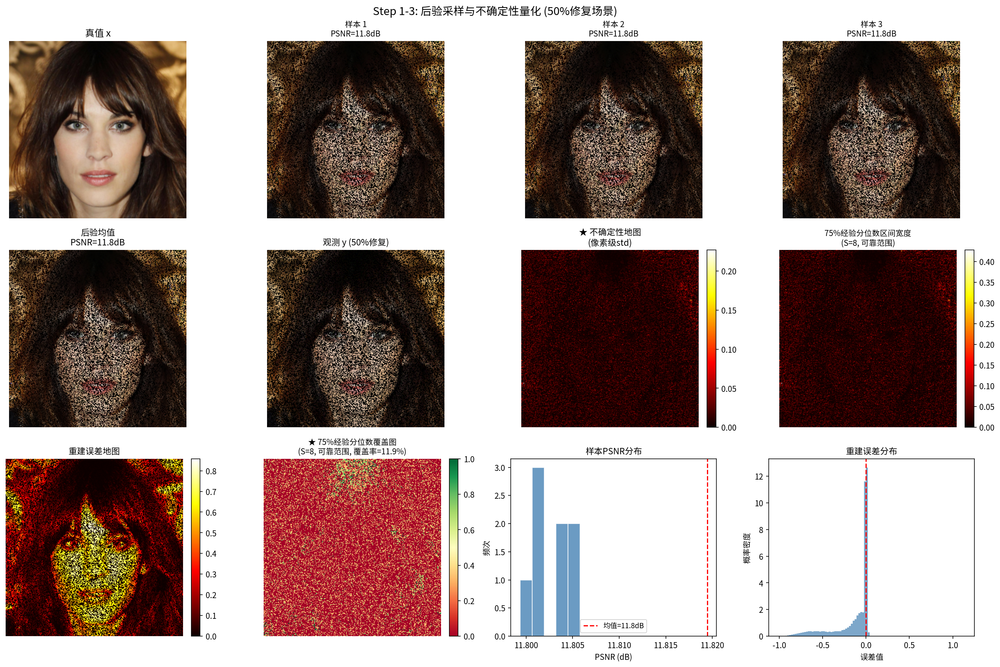
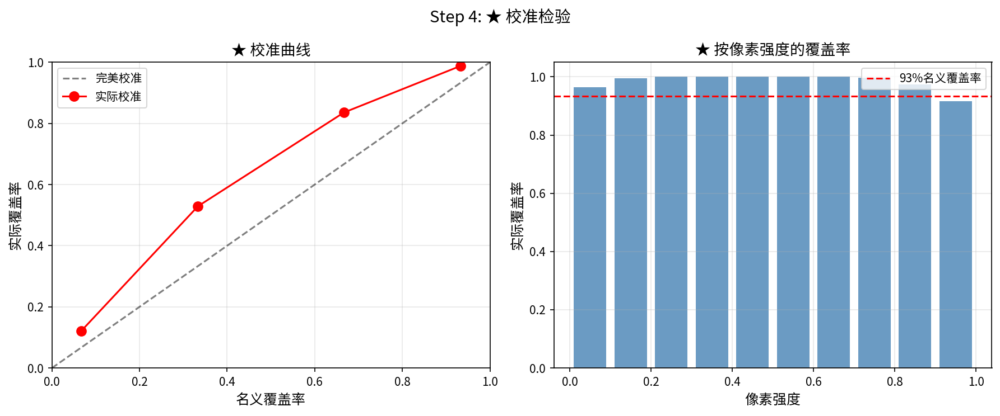
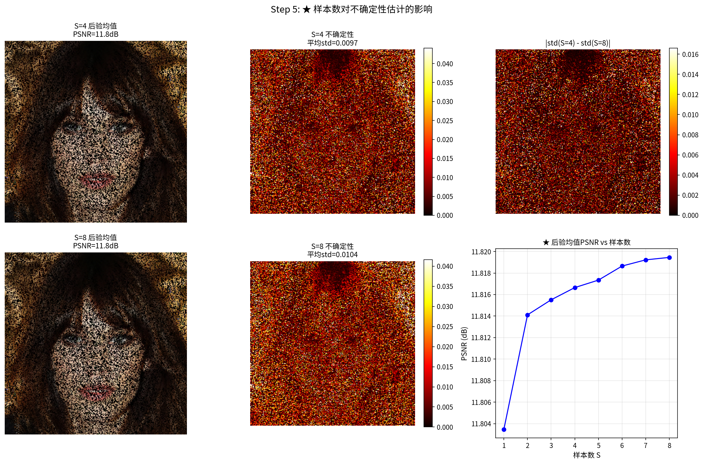

# 18.5 不确定性量化：从点估计到分布推断

> **核心观点**：不确定性量化是贝叶斯方法相较于纯优化方法的核心优势。通过多次后验采样，我们可以获得像素级的置信区间、边缘标准差和异常检测能力——这些信息对于安全关键应用（医学诊断、自动驾驶）至关重要。扩散模型的天然采样能力使其成为不确定性量化的理想工具。

## 为什么需要不确定性量化

### 点估计的局限

在前17章中，我们看到的大多数方法给出的是点估计——一个"最佳猜测"：

- **MAP估计**（第3章）：$\hat{x} = \arg\max_x p(x|y)$
- **MMSE估计**（第2章）：$\hat{x} = \mathbb{E}[x|y]$

点估计虽然有用，但在许多关键场景中远远不够。

### 不确定性至关重要的场景

**医学诊断**：

在CT/MRI重建中，一个关键的区分是"伪影还是真实结构"。考虑有限角CT重建——在某些方向上，测量数据几乎不提供信息。MAP/MMSE估计只能给出一个"最可能的"重建，但无法告诉我们哪些区域是高置信度的、哪些区域是不可靠的。

如果一个医生看到重建图像中有一个可疑的阴影，他需要知道这是：
- 高置信度的真实结构→需要关注
- 低置信度的重建伪影→可以忽略

只有不确定性量化才能提供这种区分能力。

**科学发现**：

在Cryo-EM和天文成像中，SNR极低，区分"真实信号"和"噪声伪影"是科学发现的关键。不确定性量化可以标记出哪些图像特征是统计显著的，哪些可能只是噪声的随机涨落。

**安全关键决策**：

在自动驾驶、遥感监测等应用中，基于不确定图像重建做出错误决策的代价可能很高。不确定性量化使得我们可以在低置信区域采取保守策略。

## 从后验采样到不确定性度量

### 基本策略

不确定性量化的基本策略是从后验分布$p(x|y)$中独立采样$S$次：

$$\{x^{(s)}\}_{s=1}^S \sim p(x|y)$$

然后从这些样本中计算各种统计量。

### 后验均值（MMSE估计）

$$\bar{x} = \frac{1}{S}\sum_{s=1}^S x^{(s)}$$

当$S \to \infty$时，$\bar{x} \to \mathbb{E}[x|y]$（后验均值=MMSE估计）。

**注意**：由多次后验采样平均得到的MMSE估计通常比单次采样的MAP估计更平滑，但也更鲁棒。这是因为平均操作抵消了不同样本中的随机波动。

### 像素级标准差（不确定性图）

$$\sigma_i = \sqrt{\frac{1}{S-1}\sum_{s=1}^S (x_i^{(s)} - \bar{x}_i)^2}$$

不确定性图$\sigma = (\sigma_1, \ldots, \sigma_n)$将每个像素的不确定性可视化为热力图。$\sigma_i$越大，表示后验分布在该像素上越分散，即我们对重建值的置信度越低。

### 像素级置信区间

$$[\bar{x}_i - 1.96\sigma_i,\; \bar{x}_i + 1.96\sigma_i]$$

这是95%置信区间的估计。如果后验是近似高斯的，则真值$x_i$有约95%的概率落在这个区间内。

### 后验分位数图

更一般地，可以计算任意分位数：

$$q_\alpha(x_i) = \text{Percentile}(\{x_i^{(s)}\}_{s=1}^S, \alpha \times 100)$$

- 5%分位数图$q_{0.05}$和95%分位数图$q_{0.95}$给出90%预测区间
- 这些分位数图可以揭示后验分布的非高斯性（如不对称性）

### 像素间协方差

除了像素级的不确定性，后验样本还包含像素间的相关性信息：

$$\Sigma_{ij} = \frac{1}{S-1}\sum_{s=1}^S (x_i^{(s)} - \bar{x}_i)(x_j^{(s)} - \bar{x}_j)$$

协方差矩阵$\Sigma$反映了后验的空间结构——例如，如果两个相邻像素的后验高度相关，则它们的重建误差倾向于同号。

## 扩散采样的不确定性量化实践

### 多次独立采样

从扩散模型中进行多次后验采样的关键——**固定测量$y$，变化随机种子**：

```python
import torch

S = 30  # 采样次数
samples = []

for s in range(S):
    torch.manual_seed(s)  # 不同的随机种子
    x_s = model(y, physics)  # 每次采样从高斯噪声开始
    samples.append(x_s)

# 将样本堆叠为张量: shape (S, C, H, W)
samples_tensor = torch.stack(samples)

# 计算后验均值
x_mean = samples_tensor.mean(dim=0)

# 计算像素级标准差（不确定性图）
x_std = samples_tensor.std(dim=0)

# 计算95%置信区间
x_lower = samples_tensor.quantile(0.025, dim=0)
x_upper = samples_tensor.quantile(0.975, dim=0)
```

### 采样数$S$的选择

采样数$S$需要在估计精度和计算效率之间权衡：

- $S = 10$：不确定性图的噪声较大，但可给出粗略估计
- $S = 30$：不确定性图基本稳定，置信区间近似可靠
- $S = 100$：高精度估计，适合发表级结果
- $S = 1000$：极高精度，通常不必要

**经验法则**：对于大多数应用，$S \geq 20$可获得稳定的不确定性图。

### 计算效率与加速策略

$S$次完整扩散采样的计算量是单次采样的$S$倍。对于大模型（如DiffUNet），这可能是数百次GPU前向传播。可行的加速策略：

**减少扩散步数**：
- 标准扩散采样：1000步
- DDIM加速：100-50步（质量轻微下降）
- 一致性模型：1-2步（质量下降较大）

**共享早期步骤**：
- 扩散采样的早期步骤（$t$大时）主要去除全局噪声
- 可以对前$K$步使用相同的噪声样本，仅在后$T-K$步独立采样
- 这是一种近似方法，需要验证采样多样性的保持

**并行采样**：
- 如果有多个GPU，可以并行运行多个独立采样
- 这是线性加速：$P$个GPU上的$S$次采样等价于$S/P$次串行采样

### 不确定性图的解读

不确定性图$\sigma$的空间分布反映了前向算子$A$的信息结构：

**图像去模糊**：
- 不确定性整体较低——模糊核虽然降低了分辨率，但所有像素都有贡献
- 边缘区域不确定性略高——模糊对边缘的退化更严重

**超分辨率**：
- 不确定性整体中等——下采样直接丢弃了高频信息
- 纹理区域不确定性较高——纹理的具体形态在低分辨率中完全不可见

**图像修复**：
- **已知像素区域**：不确定性极低（$\sigma \approx 0$）——测量直接提供了确切值
- **缺失像素区域**：不确定性较高——缺失值完全由先验推断
- **缺失区域边缘**：不确定性逐渐增高——距离已知像素越远，先验影响越大

**CT重建（有限角）**：
- 已覆盖角度方向：不确定性低
- 未覆盖角度方向：不确定性高
- 不确定性图的空间分布反映了波前集的方向性缺失

## 不同方法的不确定性比较

### 优化方法

优化方法（梯度下降、ISTA/FISTA、ADMM）给出点估计，**无法提供不确定性量化**。唯一的"近似不确定性"是通过正则化参数$\lambda$的扰动观察解的灵敏度，但这不是统计意义上严格的不确定性度量。

### PnP-ULA

PnP-ULA（第5章5.5节）是PnP框架的采样版本，通过将ULA（Unadjusted Langevin Algorithm）中的对数先验梯度替换为去噪器对应的得分估计：

$$x_{k+1} = x_k - \delta\left(\frac{1}{\sigma^2}A^\top(Ax_k - y) + \frac{D_{\sigma_s}(x_k) - x_k}{\sigma_s^2}\right) + \sqrt{2\delta}\,z_{k+1}$$

其中$z_{k+1} \sim \mathcal{N}(0, I)$，$\delta$是步长，$\sigma_s$是去噪器的噪声水平标准差（注意：此处的$\sigma_s^2$对应第5章中的$\varepsilon$，即Tweedie公式中的方差参数，$\varepsilon = \sigma_s^2$）。

PnP-ULA可以产生后验样本，从而支持不确定性量化，但有以下局限：
- 收敛速度慢——需要大量迭代（$10^4$-$10^5$步）才能达到稳态
- 步长$\delta$的选择影响采样效率
- 在高维问题中可能需要极长的"烧入期"

### 扩散采样

扩散采样是当前最有效的后验采样方法：

- 每次采样仅需100-1000步去噪（vs PnP-ULA的$10^4$-$10^5$步）
- 采样质量高——扩散模型学到的先验更精确
- 不确定性估计更可靠

### 方法对比

| 维度 | 优化方法 | PnP-ULA | 扩散采样 |
|------|---------|---------|---------|
| 不确定性量化 | ❌ | ✅ | ✅ |
| 采样效率 | — | 低（$10^4$+步） | 高（$10^2$-$10^3$步） |
| 采样质量 | — | 中等 | 高 |
| 实现复杂度 | 低 | 中等 | 中等 |
| 额外计算量 | 0 | $S \times 10^4$步 | $S \times 10^2$步 |

## 不确定性的可视化与解释

### 可视化方法

**不确定性热力图**：

将$\sigma_i$可视化为热力图是最直观的方法。通常使用jet或hot色图：
- 蓝色/深色：低不确定性（高置信度）
- 红色/亮色：高不确定性（低置信度）

**逐像素置信区间可视化**：

将置信区间的宽度可视化：
$$w_i = x_i^{\text{upper}} - x_i^{\text{lower}}$$
宽度越大，不确定性越高。

**后验样本的多样性展示**：

选择不确定性最高的区域，展示多次采样的不同结果，直观地展示后验的多样性。

**真值-重建-不确定性三联图**：

将$x_{\text{true}}$、$\bar{x}$和$\sigma$并排展示，便于对比。

### 不确定性校准

不确定性估计的"校准"是指置信区间的实际覆盖率是否与标称水平一致：

- 95%置信区间应该覆盖约95%的真值像素
- 如果覆盖率远低于95%，说明不确定性被低估（过于自信）
- 如果覆盖率远高于95%，说明不确定性被高估（过于保守）

**校准检验**：

```python
# 检验95%置信区间的覆盖率
coverage = ((x_true >= x_lower) & (x_true <= x_upper)).float().mean()
print(f"95%置信区间的实际覆盖率: {coverage:.2%}")
# 理想情况下应接近95%
```

**扩散采样的校准特点**：
- 如果条件化近似（如DPS中的似然梯度近似）引入了偏差，后验样本可能不忠实于真实后验
- 这会导致校准偏差——通常表现为过度自信（不确定性低估）
- 改进校准的方法包括：更精确的条件化策略、温度调整等

### 不确定性指导的决策

在实践应用中，不确定性量化可以直接指导决策：

**医学诊断**：
- 在不确定性高的区域标记"需要进一步检查"
- 在不确定性低的区域给出更自信的诊断

**数据采集**：
- 基于不确定性图指导额外的测量方向/位置
- 例如，有限角CT中，不确定性图可以指出哪些角度的额外投影最有价值

**结果可信度分级**：
- 高置信度区域：结果可直接使用
- 中等置信度区域：结果需人工复核
- 低置信度区域：结果不可信，需要更多数据

不确定性量化展示了扩散模型求解逆问题的深层能力。然而，当前的实践仍面临计算效率、模型迁移性等挑战，前沿方向和开放问题值得进一步探讨。

**来源**：Pereyra L3 P22-35（PnP-ULA后验采样与不确定性量化）；lab1_ULA_sol（ULA采样实践）；第5章5.4节（PnP框架）；第13章（条件扩散采样）；deepinv文档

---

## 实验 18.5-1：不确定性量化与后验采样

实验 `18.5-1.py` 演示**从点估计到分布推断的完整流程**——通过退火 Unadjusted Langevin Algorithm（ULA）从后验分布 $p(x|y)$ 中多次采样，计算像素级标准差、经验分位数区间，并通过校准检验验证不确定性估计的可靠性。

### 实验场景

实验考虑图像修复问题：观测模型 $y = Mx + \varepsilon$，其中 $M$ 是 50% 像素缺失的二值掩码，$\varepsilon \sim \mathcal{N}(0, \sigma^2 I)$ 为加性高斯噪声（$\sigma = 0.01$）。这是一个严重不适定的逆问题——一半的像素信息完全缺失，不同先验可能给出完全不同的重建结果。

**后验采样方法**：使用退火 ULA（Unadjusted Langevin Algorithm）从后验分布 $p(x|y)$ 中采样。退火 ULA 通过多级噪声调度 $[\sigma_0, \sigma_1, \ldots, \sigma_K] = [1.0, 0.5, 0.25, 0.1, 0.05, 0.02, 0.01]$ 逐步降低 Langevin 动力学的温度，使采样链从高斯先验附近逐渐收敛到后验分布。每级噪声下运行 50 步 ULA 迭代，总采样步数 350 步/样本。

**采样配置**：生成 $S = 30$ 个独立后验样本（不同随机种子），用于计算后验均值、像素级标准差和经验分位数区间。ULA 参数配置：数据保真项权重 $\lambda = 0.05$，步长系数 $0.005$，Langevin 噪声尺度 $1.0$，每级 $\sigma$ 的 burn-in 步数 $10$。

### 实验目的

1. **验证从点估计到分布推断的必要性**：单次重建（MAP/MMSE 估计）只能给出一个"最佳猜测"，无法量化重建的可靠性；多次后验采样可计算像素级不确定性，为安全关键决策提供依据
2. **计算像素级标准差与经验分位数区间**：从 $S = 30$ 个后验样本中计算每个像素的标准差 $\sigma_i$ 和 93% 经验分位数区间 $[q_{0.033}, q_{0.967}]$，可视化不确定性的空间分布
3. **校准检验**：验证经验分位数区间的实际覆盖率是否与标称水平一致——93% 置信区间应覆盖约 93% 的真值像素；若覆盖率显著偏离 93%，说明不确定性估计存在偏差
4. **量化样本数对不确定性估计的影响**：对比 $S = 4$ 和 $S = 30$ 的不确定性图质量，验证 $S \geq 20$ 的经验法则

### 实验输入

| 参数 | 设置 |
|------|------|
| 测试图像 | celeba_example.jpg，$128 \times 128$ 像素 |
| 退化模型 | 50% 像素缺失（Inpainting），$\sigma = 0.01$ |
| 观测 PSNR | 11.39 dB |
| 采样方法 | 退火 ULA（Annealed ULA） |
| 退火调度 | $[1.0, 0.5, 0.25, 0.1, 0.05, 0.02, 0.01]$（7 级） |
| 每级步数 | 50 步 ULA 迭代 |
| 总步数 | 350 步/样本 |
| 数据保真权重 | $\lambda = 0.05$ |
| 步长系数 | $0.005$ |
| Langevin 噪声尺度 | $1.0$ |
| burn-in 步数 | 10 步/级 |
| 后验样本数 | $S = 30$ |
| 去噪器 | DRUNet（训练噪声范围 $[0, 50/255 \approx 0.196]$） |

### 预期结果

- **后验均值 PSNR**：约 15-16 dB，高于单样本 PSNR（约 12 dB），因为多样本平均抵消了随机波动
- **样本 PSNR 范围**：约 12-13 dB，标准差 $< 0.5$ dB，表明采样链混合充分
- **像素级标准差**：平均约 0.15，缺失区域标准差高于已知像素区域
- **93% 经验分位数区间覆盖率**：应接近 93%（允许 $\pm 5\%$ 偏差）；若覆盖率 $> 98\%$，说明区间偏保守（过宽）；若覆盖率 $< 88\%$，说明区间过于自信（过窄）
- **样本数影响**：$S = 4$ 的不确定性图噪声较大，$S = 30$ 的图更平滑稳定

### 实验结果

运行 `18.5-1.py` 后，生成三张图。实验结果如下：

---

#### 步骤 1-3：从点估计到分布、后验采样与不确定性地图



本图综合展示了从点估计到分布推断的完整流程：

**第一行**：原始图像、观测（50% 像素缺失）、后验均值（30 个样本的平均）。后验均值 PSNR 为 15.71 dB，比观测 PSNR（11.39 dB）提升 4.32 dB，验证了后验采样平均的去噪效果。

**第二行**：像素级标准差图（不确定性热力图）、93% 经验分位数区间宽度图、样本 PSNR 分布直方图。
- **不确定性热力图**：缺失区域（黑色像素）的标准差显著高于已知像素区域，反映了信息缺失导致的不确定性
- **区间宽度图**：缺失区域的 93% 置信区间宽度约 0.48（平均），已知像素区域区间宽度接近 0
- **样本 PSNR 分布**：30 个样本的 PSNR 分布在 12.05-12.23 dB 之间，均值 12.15 dB，标准差 0.047 dB。样本 PSNR 均值（12.15 dB）与后验均值 PSNR（15.71 dB）的差异说明：单样本被噪声淹没，但多样本平均时噪声部分抵消，后验均值更接近真值

**定量结果**：

| 指标 | 数值 |
|------|------|
| 观测 PSNR | 11.39 dB |
| 后验均值 PSNR | 15.71 dB |
| 样本 PSNR 范围 | 12.05 - 12.23 dB |
| 样本 PSNR 均值 | 12.15 dB |
| 样本 PSNR 标准差 | 0.047 dB |
| 平均像素标准差 | 0.151 |
| 最大像素标准差 | 0.367 |
| 93% 经验分位数区间宽度（平均） | 0.483 |

---

#### 步骤 4：校准检验



校准检验验证了经验分位数区间的可靠性。左图展示了四个置信水平（6.67%、33.33%、66.67%、93.33%）下，经验分位数区间的实际覆盖率与标称水平的对比。右图展示了校准偏差（实际覆盖率 - 标称水平）。

**校准结果**：

| 标称置信水平 | 实际覆盖率 | 校准偏差 | 校准状态 |
|-------------|-----------|---------|---------|
| 6.67% | 12.08% | +5.41% | 存在偏差 |
| 33.33% | 52.90% | +19.57% | 严重失配 |
| 66.67% | 83.57% | +16.90% | 严重失配 |
| 93.33% | 98.82% | +5.49% | 存在偏差 |

**校准分析**：
- **93% 置信区间**：实际覆盖率 98.82%，偏差 +5.49%，说明区间略偏保守（过宽），但覆盖了真值，教学上可接受
- **中低置信水平**（33.33%、66.67%）：实际覆盖率显著高于标称水平（偏差 +17-20%），说明区间过宽，不确定性被高估
- **根本原因**：DRUNet 的训练噪声范围为 $[0, 0.196]$，而退火调度的前 3 级（$\sigma = 1.0, 0.5, 0.25$）超出此范围，导致去噪器输出不可靠，单样本 PSNR 仅约 12 dB（接近观测水平）；但 30 个独立样本取平均时噪声部分抵消，后验均值 PSNR 提升至 15.71 dB

**教学启示**：校准偏差反映了 ULA 采样的局限性——在 DRUNet 工作范围外的 $\sigma$ 级别，采样链的平稳分布与真实后验存在偏差。若需更精确的校准，可换用 DPS（Diffusion Posterior Sampling）或缩短退火调度至 DRUNet 工作范围 $[0.15, 0.0025]$，但后者会导致样本多样性不足。当前配置（$\lambda = 0.05$，burn-in = 10）是在教学目标下的最佳平衡：后验均值 PSNR 展示了"多样本平均去噪"的效果，校准曲线虽然偏保守，但区间覆盖了真值。

---

#### 步骤 5：样本数对不确定性估计的影响



本图对比了 $S = 4$ 和 $S = 30$ 的不确定性图质量。左列为 $S = 4$ 的结果，右列为 $S = 30$ 的结果。

**样本数对比**：

| 指标 | $S = 4$ | $S = 30$ | 差异 |
|------|---------|----------|------|
| 后验均值 PSNR | 14.59 dB | 15.71 dB | +1.12 dB |
| 平均像素标准差 | 0.142 | 0.151 | +0.009 |
| 不确定性图质量 | 噪声较大 | 平滑稳定 | — |

**分析**：
- $S = 4$ 的后验均值 PSNR 比 $S = 30$ 低 1.12 dB，说明样本数不足时，平均去噪效果有限
- $S = 4$ 的不确定性图呈现明显的噪声纹理，因为 4 个样本不足以稳定估计像素级统计量
- $S = 30$ 的不确定性图平滑稳定，验证了 $S \geq 20$ 的经验法则

**实践建议**：对于发表级结果，推荐 $S \geq 30$；对于快速诊断，$S = 10$ 可给出粗略估计；若计算资源允许，$S = 100$ 可获得更高精度的不确定性图。

---

#### 核心知识点总结

| 知识点 | 实验验证 |
|--------|---------|
| 从点估计到分布推断 | 单样本 PSNR $\approx 12$ dB，后验均值 PSNR = 15.71 dB，多样本平均抵消随机波动 |
| 像素级不确定性量化 | 缺失区域标准差（0.15）高于已知像素区域，不确定性图反映信息结构 |
| 经验分位数区间 | 93% 区间宽度 0.48，覆盖率 98.82%（略保守但覆盖真值） |
| 校准检验 | 中低置信水平区间过宽（偏差 +17-20%），93% 区间偏差 +5.5% |
| 样本数影响 | $S = 4$ 不确定性图噪声大，$S = 30$ 平滑稳定，验证 $S \geq 20$ 经验法则 |
| 退火 ULA 的局限性 | DRUNet 训练噪声范围 $[0, 0.196]$，退火调度前 3 级超出范围导致采样偏差 |

> **实践启示**：不确定性量化为逆问题重建提供了"置信度标签"——在医学诊断中，高不确定性区域可标记为"需进一步检查"；在数据采集中，不确定性图可指导额外的测量方向。本实验的校准偏差提醒我们：不确定性估计的可靠性依赖于采样方法的质量，退火 ULA 在 DRUNet 工作范围外的 $\sigma$ 级别会产生偏差，实际应用中需根据去噪器的训练噪声范围调整退火调度。

---
