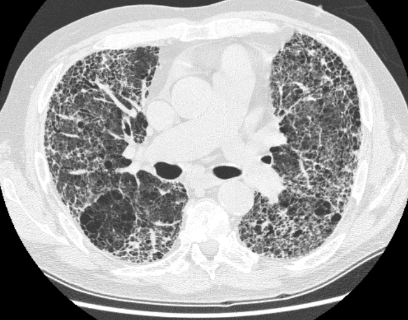
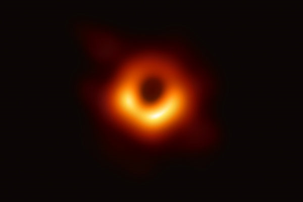
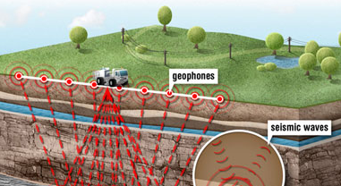
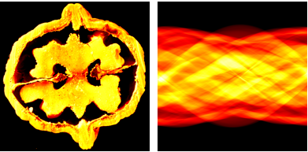
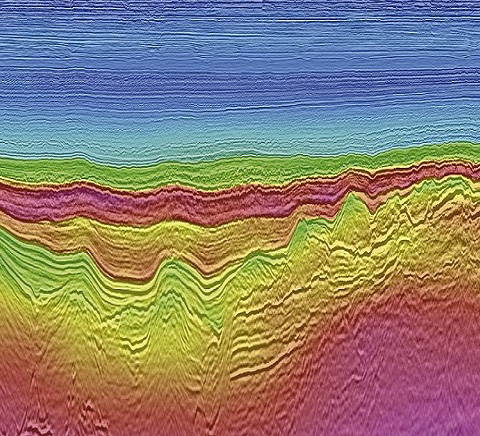

# 1.1 什么是逆问题？从观察到因果的推理

## 从日常经验到"由果推因"

当我们看到地上的影子，会在脑海中还原出投射影子的物体形状；当听到走廊里的脚步声，会判断来人是谁；当面对一幅残缺的拼图，会根据碎片轮廓推断缺失部分的全貌。这些日常行为背后，共享着同一种认知模式——**从可观测的效果推断不可直接观测的原因**。

科学和工程中充满了这样的场景：

- **医学影像**：医生无法直接观察人体内部，但可以通过X射线投影重建器官截面（图1.1）；
- **天文学**：天文学家无法抵达黑洞，却能用射电望远镜阵列的稀疏观测数据合成人类首张黑洞照片（图1.2）；
- **地球物理**：地质学家无法钻入地壳深处，却能通过地震波记录推断地下结构（图1.3）。

<table style="width: 100%; border-collapse: collapse;">
<tr>
<td style="width: 33%; text-align: center; padding: 5px; vertical-align: top;">

 <strong>图1.1</strong> CT扫描仪与肺部截面
</td>
<td style="width: 33%; text-align: center; padding: 5px; vertical-align: top;">

 <strong>图1.2</strong> M87黑洞影像
</td>
<td style="width: 33%; text-align: center; padding: 5px; vertical-align: top;">

 <strong>图1.3</strong> 地震勘探示意图
</td>
</tr>
</table>

<strong>图1.1-1.3</strong> 逆问题的典型应用：(左)CT医学成像，通过X射线投影重建人体内部结构；(中)天文学成像，从稀疏观测数据重建黑洞影像；(右)地球物理勘探，从地震波记录推断地下结构。

这些任务的共同特征是：我们手头只有间接的、不完整的观测数据，却要据此还原隐藏在背后的"真相"。

这正是**逆问题**（inverse problem）的核心——**从效果反推原因**。

## 正问题与逆问题

为了更清晰地理解"逆"的含义，我们先明确它的对立面——**正问题**（forward problem）。

正问题是从原因出发预测结果：已知物理系统的参数和物理定律，计算系统会产生什么样的观测。逆问题则反过来：已知观测结果，推断产生这个结果的未知参数。

用数学语言表达，假设未知量 $x$ 表示我们关心的物理参数（如人体组织的密度分布），$A$ 表示描述物理过程的数学模型（如X射线穿过人体的衰减过程），$y$ 表示可获得的观测数据（如探测器接收到的投影值），那么正问题与逆问题可以简洁地表述为：

$$y = Ax$$

- **正问题**：已知 $x$ 和 $A$，求 $y$——"给定原因，预测效果"
- **逆问题**：已知 $y$ 和 $A$，求 $x$——"观测效果，推断原因"

两者的对比如下：

| | 正问题 | 逆问题 |
|---|---|---|
| 方向 | 原因 → 效果 | 效果 → 原因 |
| 数学表述 | 已知 $x$，计算 $y = Ax$ | 已知 $y$，求解 $x$ 使得 $y = Ax$ |
| 性质 | 通常适定（well-posed）：解存在、唯一、稳定 | 通常不适定（ill-posed）：可能不存在唯一解，且对噪声极度敏感 |
| 典型例子 | 已知器官密度，计算X射线投影 | 已知X射线投影，重建器官密度图像 |
| 难度 | 一般可直接计算 | 需要正则化等额外手段 |

在图像与视觉领域，逆问题无处不在：**去模糊**（从模糊图像恢复清晰图像）、**超分辨率**（从低分辨率图像重建高分辨率细节）、**CT重建**（从投影数据恢复截面图像）、**图像修复**（填充图像中的缺失区域）等，本质上都是从退化或残缺的观测中恢复原始的场景信息。

以CT重建为例，图1.4直观展示了正问题与逆问题的关系：正问题是将物体的截面图像沿各角度进行线积分（Radon变换），得到被称为"正弦图"（sinogram）的投影数据；逆问题则是从正弦图出发，重建出原始截面。可以清楚地看到，正弦图本身并不直观——无法直接从投影数据"读出"物体形状，必须求解逆问题才能获得可理解的图像。

 <strong>图1.4</strong> 核桃的二维截面（左）及其对应的正弦图（右）。正弦图是CT扫描仪的直接输出——各角度的线积分投影数据。正弦图本身无法直观解读，必须通过逆问题求解才能重建出可理解的截面图像。

> **逆问题的分类。** 按正向模型是否线性，逆问题分为**线性逆问题**（$y = Ax$）和**非线性逆问题**（$y = \mathcal{A}(x)$）。按Hadamard准则是否满足，又分为**适定逆问题**和**不适定逆问题**。本书聚焦**线性不适定逆问题**——这是最基础也最普遍的情形，且贝叶斯框架的数学推导在此情形下最为清晰。非线性逆问题（如相位恢复、盲去卷积）的贝叶斯处理思路相同，但推导更复杂，第13章和第18章将有初步讨论。

## 逆问题的本质困难：计算视角

如果正问题只是简单地"乘以 $A$"，逆问题似乎只需要"除以 $A$"——也就是求逆运算 $x = A^{-1}y$。为什么逆问题会如此困难？

答案在于：**正问题与逆问题之间的不对称性，不仅是方向的反转，更是信息量的坍缩。**

### 信息损失与误差放大

正问题 $y = Ax$ 在多数情况下是一个"压缩"过程——算子 $A$ 将高维的未知量 $x$ 映射到低维的观测 $y$，在这个过程中，$x$ 的某些信息被 $A$ 抹去了。当我们试图反推时，被抹去的信息无法凭空恢复，这是逆问题困难的根本来源。

即便 $A$ 是可逆的（信息没有完全丢失），逆过程仍然可能严重放大误差——正问题中"好算"的算子 $A$，其逆问题可能"难算"到不可用。1.3节将引入**条件数** $\kappa(A)$ 来定量刻画这种放大效应。

### 从连续到计算：三个鸿沟

从计算的角度审视，逆问题的困难还可以归结为三道鸿沟：

1. **从连续到离散**：真实的物理过程发生在连续空间中，但计算机只能在有限维度上工作。离散化是计算逆问题的必经之路，而离散化的方式和精度直接影响重建质量。

2. **从精确到含噪**：理想的数学模型假设 $y = Ax$，但实际观测总是 $y = Ax + \text{噪声}$。噪声看似微小，却会被逆运算放大为灾难性的误差——1.4节将系统建模噪声，1.5节将展示如何同时应对噪声与不适定性。

3. **从无限到有限**：我们只有有限个观测值，却可能需要重建无穷维的未知量。信息不足是本质性的，任何计算方法都必须依赖额外的先验知识来"补全"缺失的信息。

图1.5展示了地震成像的逆问题求解结果：从地表接收到的反射波场记录（有限、含噪的离散数据）出发，计算重建出地下不同深度的地层结构。这一结果无法从原始观测数据中直接读取，必须借助正则化和优化算法才能获得稳定且有意义的重建。

 <strong>图1.5</strong> 典型的地震成像结果，展示了地下不同深度的地层结构。这些图像并非直接观测所得，而是从地震波场记录出发，通过求解逆问题并引入适当的正则化策略计算得到的。

正如赫尔辛基大学计算逆问题研究组所概括的：**计算逆问题的核心任务，是将逆问题的严格数学理论扩展为可实际执行的算法——在有限、含噪的离散观测下，稳定地重建未知量。** 这不仅需要数学分析的工具（刻画适定性与收敛性），还需要数值线性代数、优化算法和统计推断的支撑。
