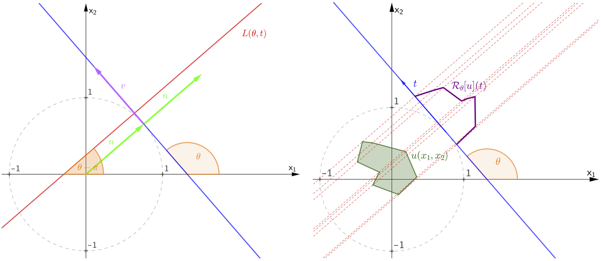
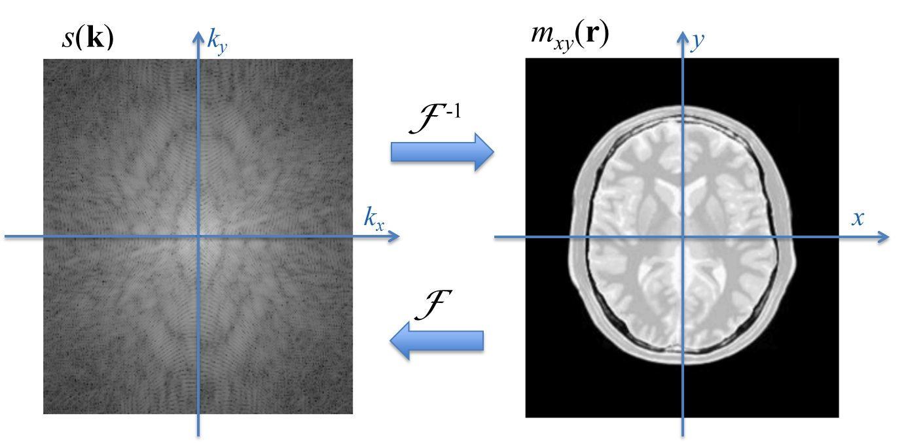

# 1.2 正向模型：线性算子 $y = Ax$

## 破案之前，先得懂"犯罪现场怎么形成的"

1.1 节我们拉起了逆问题的大框架：给定观测 $y$，推断未知量 $x$。但你想想，侦探破案前，总得先理解犯罪现场是怎么形成的——不然连"指纹该在哪"都不知道，怎么反推凶手？

**正向模型**（forward model）就是逆问题的"犯罪现场形成机制"。它描述了从原始信号 $x$ 到观测数据 $y$ 的映射关系。不理解它，就根本没法理解逆问题为什么难，更别说设计求解策略。

---

## 正向模型：从"因"到"果"的地图

因为现实里的成像系统（相机、CT、MRI）大多可以近似成线性的，所以在本书里，我们主要盯住线性正向模型：

$$y = Ax$$

其中 $x \in \mathbb{R}^n$ 是未知的原始图像（按列排成一个向量），$A \in \mathbb{R}^{m \times n}$ 是正向算子（描述成像过程的数学模型），$y \in \mathbb{R}^m$ 是能拿到的观测。

> **为什么从正向模型开始？** 因为正向模型定义了逆问题的"游戏规则"——$A$ 决定了哪些信息被保留、哪些被丢掉、哪些被混淆。1.1 节那句话再重复一遍：**只有理解了观测如何生成，才能讨论如何反推。** 下两节（1.3、1.4）讲的两层困难，根子都在这个 $A$ 上。

下面我们挨个看五种最常见的正向模型，它们物理场景天差地别，却都逃不出 $y = Ax$ 这个框。

---

## 卷积模糊：散焦与运动模糊

### 物理上发生了什么？

相机对焦没对准，或者物体在曝光时动了，出来的图就糊了。糊的本质是：图像里每个像素的值，不再只反映它自己位置的亮度，而是周围一片像素亮度的加权平均。数学上，这个过程叫**卷积（convolution）**。

**因为**我们要把"加权平均"这件事写明白，所以先用连续函数描述它。把图像看作连续函数 $u : \Omega \to \mathbb{R}$（$\Omega$ 是图像区域），模糊可以写成：

$$f(x) = \int_\Omega k(x - y)\, u(y)\, \mathrm{d}y$$

这里 $k$ 叫**点扩散函数（Point Spread Function, PSF）**，它描述一个理想点光源经过成像系统后，怎么"摊开"成一片光斑。直观理解：$k(x-y)$ 衡量了位置 $y$ 处的光源，对位置 $x$ 处观测值的贡献大小。

- **散焦模糊**：PSF 通常是个均匀圆盘或高斯函数，因为光通过圆形孔径衍射后呈圆形散开。
- **运动模糊**：PSF 沿运动方向被拉成一条线段，因为曝光期间像在连续移动。

**既然**数字图像是离散像素而非连续函数，大自然的事情到了计算机里就得离散化。设 $x \in \mathbb{R}^n$ 是原始图像（向量化），模糊过程可写成：

$$y = h * x$$

其中 $*$ 是二维离散卷积，$h$ 是离散化后的 PSF 核。

**关键来了**：卷积是个线性运算，所以总可以写成矩阵-向量乘法 $y = Ax$。这里的矩阵 $A$ 是由 PSF $h$ 构造的**循环卷积矩阵**（也叫 Toeplitz 矩阵，周期边界下变成循环矩阵）。

一维为例，若 PSF 为 $h = [h_{-1}, h_0, h_1]$，卷积矩阵长这样：

$$A = \begin{bmatrix} h_0 & h_{-1} & 0 & \cdots & h_1 \\ h_1 & h_0 & h_{-1} & \cdots & 0 \\ 0 & h_1 & h_0 & \cdots & 0 \\ \vdots & & & \ddots & \vdots \\ h_{-1} & 0 & \cdots & h_1 & h_0 \end{bmatrix}$$

**于是**一个极其重要的性质浮现了：在离散傅里叶变换（DFT）基下，循环卷积矩阵是对角矩阵。也就是说，卷积在频域变成了逐元素乘法：

$$\mathcal{F}(h * x) = \mathcal{F}(h) \odot \mathcal{F}(x)$$

其中 $\mathcal{F}$ 表示 DFT，$\odot$ 是逐元素乘。这个性质（卷积定理）不仅给正向模型提供了快速算法（用 FFT 把 $O(n^2)$ 降到 $O(n\log n)$），也为后面解逆问题埋下关键伏笔——在频域里，卷积的逆运算（反卷积）就等价于逐元素除法。

> **逆问题**：从模糊图 $y$ 和已知 PSF $h$ 恢复清晰图 $x$，叫**图像去模糊（deblurring）**。如果 PSF $h$ 自己也未知，那就叫**盲去卷积（blind deconvolution）**，难上加难。

---

## 下采样：从高分辨到低分辨

### 物理上发生了什么？

数码相机的传感器像素数是有限的。当成像系统的分辨率低于场景本身的细节时，高分辨率信息被"压"到低分辨率网格上，这就是**下采样（downsampling）**。遥感、医学低分辨扫描里也常见。

**因为**传感器只采样了一部分位置，所以最简单的下采样是**抽取（decimation）**：$A$ 是一个选择矩阵，每行在对应位置取 1、其余取 0，直接丢掉部分像素。比如 2 倍下采样：

$$y[i,j] = x[2i, 2j]$$

**更合理一点**的模型是**平均下采样（average pooling）**：$A$ 的每行对应一个输出像素位置，把附近几个输入像素取平均：

$$y[i,j] = \frac{1}{4}\big(x[2i,2j] + x[2i{+}1,2j] + x[2i,2j{+}1] + x[2i{+}1,2j{+}1]\big)$$

这等价于先做局部平均（低通滤波）再抽取。

**于是**一个要命的事实出现了：无论哪种，下采样算子 $A$ 都是行数少于列数的矩阵（$m < n$），说明 $A$ 不可逆——从 $n$ 维压到 $m$ 维的过程中，$n - m$ 个自由度的信息被永久丢了。

> **逆问题**：从低分辨图 $y$ 恢复高分辨图 $x$，叫**超分辨率重建（super-resolution）**。由于 $A$ 不可逆，信息已经永久丢失，逆问题有无穷多解——这就是不适定性的典型表现。

---

## 掩码与缺失：图像修复

### 物理上发生了什么？

有时图像的一部分像素彻底丢了——被遮挡、损坏、或没被采集到。比如照片划痕、老照片局部褪色、医学影像里被金属伪影挡住的区域。

**因为**只丢了一部分像素，这种情况的正向模型极简单：$A$ 是个**二值掩码矩阵** $M \in \{0,1\}^{m \times n}$，每行在保留像素位置取 1、缺失位置取 0。观测 $y$ 就是原始图像 $x$ 里被掩码保留的那些像素：

$$y = Mx$$

或者更直觉地：$y = x \odot m$，其中 $m$ 是和图像同尺寸的二值掩码（1=保留，0=缺失），$\odot$ 是逐元素乘。

> **逆问题**：从部分像素恢复完整图像，叫**图像修复（inpainting）**。虽然缺失像素不多，但怎么"合理地"填进去，需要关于图像内容的先验知识——这正是贝叶斯框架里先验的活儿（第2章展开）。

---

## 实验 1.2-1：正向模型可视化与反卷积

实验`1.2-1.py`直观展示上面三种正向模型（模糊、下采样、掩码）的效果，并重点演示**反卷积中的噪声放大现象**——这是理解逆问题不适定性的经典案例。

### 实验场景

用 `skimage.data.astronaut()` 作原始图像 $x$，分别施加三种退化：

1. **高斯模糊**：PSF 为标准差 $\sigma = 5$ 的高斯核，频域实现 $y = \mathcal{F}^{-1}(H \cdot \mathcal{F}(x))$
2. **平均下采样**：$4\times$ 块平均，$m < n$，$A$ 不可逆
3. **随机掩码**：保留 50% 像素，$y = Mx$

### 实验目的

- **直观理解正向模型**：观察不同算子 $A$ 对图像的退化效果
- **理解频域特性**：通过 PSF 频谱 $|H(k)|$ 观察高频衰减
- **理解不适定性**：对比无噪声/含噪声反卷积，理解 $1/H(k)$ 的噪声放大机制

### 实验输入

| 输入 | 说明 |
|------|------|
| 原始图像 $x$ | astronaut 图像，灰度化，$512 \times 512$ |
| 高斯 PSF $h$ | $\sigma = 5$，频域中心 |
| 下采样因子 | $4\times$ 平均池化 |
| 掩码保留率 | $50\%$ 随机保留 |
| 噪声水平 | $\sigma_n = 0.01$（加性高斯白噪声） |

### 预期结果

实验生成 $2 \times 4$ 子图布局，预期效果如下：

**第一行（正向退化）**：
- 原始图像：清晰的 astronaut 标准测试图像
- 模糊图像：细节平滑，边缘扩散，高频信息被 PSF 抑制
- 下采样图像：分辨率降至 $128 \times 128$（图中按真实尺寸居中显示，明显小于其它 $512 \times 512$ 子图），空间信息不可逆丢失
- 掩码图像：50% 像素随机丢失，呈现黑白噪声状分布

**第二行（频域分析与反卷积）**：
- 无噪声反卷积：$X = Y/H$，理论上完美恢复原始图像
- 含噪声反卷积：高频噪声被 $1/H$ 极度放大，图像充满噪声伪影
- PSF 频谱：中心亮（低频保留），边缘暗（高频趋零）
- 掩码图案：白色=保留像素，黑色=丢失像素

### 实际效果

运行 `1.2-1.py` 后，生成 $2 \times 4$ 子图布局。第一行展示正向退化：原始图像清晰可辨，模糊图像整体柔和且高频纹理消失，下采样图像尺寸明显缩小，掩码图像呈现"打孔"效果。第二行展示频域分析与反卷积：无噪声反卷积几乎完美恢复原始图像；含噪声反卷积结果充满颗粒状伪影，直观展示"噪声放大"；PSF 频谱呈中心对称的高斯状衰减；掩码图案为随机二值矩阵，黑白各占约 50%。

---

## Radon 变换：CT 成像的核心正向模型

### 物理背景：X 射线怎么"看见"人体内部

CT（Computed Tomography，计算机断层扫描）是逆问题最经典的应用之一。原理是：X 射线穿过人体时，不同组织衰减系数不同——骨头衰减小强（图像里显白），软组织衰减弱（灰），空气几乎不衰减（黑）。

### Beer-Lambert 定律

要理解 CT 的正向模型，得从 X 射线的衰减物理说起。

一束强度为 $I_0$ 的单色 X 射线，穿过厚度为 $s$、衰减系数为 $\mu$ 的均匀物质后，出射强度 $I_1$ 满足：

$$I_1 = I_0 \, e^{-\mu s}$$

这就是 **Beer-Lambert 定律**：衰减是指数性的，取决于衰减系数和路径长度。

**于是**对于非均匀物质（衰减系数 $\mu$ 随位置变化，这正是 CT 要重建的未知量！），定律推广为：

$$I_1 = I_0 \exp\!\Big(-\int_\ell \mu(x)\, \mathrm{d}x\Big)$$

其中积分沿 X 射线路径 $\ell$ 进行。两边取对数，得到线性关系：

$$-\ln\frac{I_1}{I_0} = \int_\ell \mu(x)\, \mathrm{d}x$$

这个等式的意义极关键：**取对数后，测量值和未知量之间是线性关系**——对数测量值等于衰减系数沿射线路径的线积分。这正是线性正向模型 $y = Ax$ 的物理来源。

### Radon 变换

把 Beer-Lambert 定律推广到所有可能的射线路径，就得到 **Radon 变换**——CT 成像的数学核心。

二维情形下，设 $u(x_1, x_2)$ 是待重建截面的衰减系数分布。一条射线用角度 $\theta \in [0, \pi)$ 和偏移 $t \in [-1, 1]$ 参数化：

$$\ell(\theta, t) = \{x \in \mathbb{R}^2 \mid x_1 \cos\theta + x_2 \sin\theta = t\}$$

Radon 变换定义为 $u$ 沿每条射线的线积分：

$$\mathcal{R}u(\theta, t) = \int_{\ell(\theta,t)} u(x)\, \mathrm{d}x = \int_{-\infty}^{\infty} u(t\cos\theta - s\sin\theta,\; t\sin\theta + s\cos\theta)\, \mathrm{d}s$$

$\mathcal{R}u(\theta, t)$ 作为 $(\theta, t)$ 的函数，叫**正弦图（sinogram）**——因为图像里一个点 $(a, b)$ 的 Radon 变换是

$$t = a\cos\theta + b\sin\theta = \sqrt{a^2+b^2}\,\sin(\theta+\phi), \quad \text{其中 } \phi = \operatorname{atan2}(a, b)$$

固定 $(a,b)$ 时，这无非是 $\theta$ 的一条正弦（余弦）曲线；所有点的正弦曲线叠起来，就形成了正弦图。

这揭示了 Radon 变换最核心、也最反直觉的**对偶关系**：
- 图像空间里的"一个点"，到了正弦图里**不是**一个点，而是一条正弦曲线（就是上面那条）。
- 反过来，正弦图里的"一个点" $(\theta, t)$，对应图像空间里**一条直线**——即射线 $\ell(\theta, t)$ 本身（因为正弦图的一个采样点，记录的正好是沿这条射线对图像的线积分）。

记住这个对偶，后面讲 CT 重建时"怎么从一条条直线/曲线反推回一个个点"，就不再是黑魔法了。

**图1.7** Radon 变换几何示意。左：角度 $\theta$ 和偏移 $t$ 的定义，射线 $\ell(\theta,t)$ 垂直于探测器方向。右：函数 $u(x_1,x_2)$ 在角度 $\theta$ 处的投影 $R_\theta u(t)$——沿每条射线对 $u$ 做线积分。

### 离散化：从连续变换到矩阵模型

计算机里 Radon 变换必须离散化。把待重建区域分成 $N \times N$ 个像素，未知量 $x \in \mathbb{R}^{N^2}$ 是所有像素的衰减系数。CT 从 $K$ 个角度采集，每个角度 $D$ 个探测器单元，共 $m = K \times D$ 个测量值。

离散化的关键：矩阵 $A$ 的每一行对应一条射线，每一列对应一个像素，元素 $A_{ij}$ 表示第 $i$ 条射线穿过第 $j$ 个像素的路径长度（或等效权重）：

$$y_i = \sum_{j=1}^{N^2} A_{ij}\, x_j$$

例如，图像分辨率 $12 \times 12$ 像素，从 $11$ 个角度扫描，每个角度 $21$ 个探测器单元，那么测量矩阵 $A$ 是 $231 \times 144$ 的——行数 $231 = 11 \times 21$ 是总测量数，列数 $144 = 12 \times 12$ 是待重建像素总数。离散化把连续的 Radon 变换转化成了线性方程组 $y = Ax$。图1.8 是一个核桃 CT 示例：

**图1.8** 核桃截面及其对应正弦图。**左图**是核桃二维截面图像 $x$（想重建的目标）；**右图**是对应正弦图 $y$，横轴投影角度 $\theta$（0° 到 180°），纵轴探测器位置 $t$，每像素灰度表示对应射线穿过物体后的线积分（X 射线衰减程度）。

从图1.8 可以清楚看到：正弦图没法直观解读——看着像一堆扭曲条纹，人眼直接看不出核桃形状。但解逆问题（滤波反投影或迭代重建）就能从正弦图恢复清晰截面。这正是 Radon 正向模型 $y = Ax$ 的核心含义：
- $A$ 编码扫描几何（射线怎么穿过像素）
- $x$ 是未知截面图像（左图）
- $y$ 是实测正弦图数据（右图）

> **逆问题**：从正弦图 $y$ 和已知扫描几何 $A$ 恢复截面图像 $x$，叫 **CT 重建**。这是图像逆问题里研究最深、应用最广的领域之一。
>
> CT 重建的经典算法是**滤波反投影（Filtered Back Projection, FBP）**——先对正弦图做频域滤波，再反投影回图像空间。投影角度充足时，FBP 能较好地近似 $x = A^{-1}y$。但实际中受扫描时间、辐射剂量限制，角度往往不足，得用更先进的迭代或深度学习重建，第16章细讲。

## 实验 1.2-2：Radon 变换与 FBP 重建

实验`1.2-2.py`完整演示 CT 的**正向与逆向流程**：从截面图像到正弦图（正向 Radon 变换），再从正弦图回到重建图像（逆向 FBP 算法）。通过这闭环，直观理解 $y = Ax$ 以及逆问题求解的挑战。

### 实验场景

用 Shepp-Logan 幻影（医学成像标准测试图像）作待成像截面，模拟完整 CT 扫描与重建：
1. **正向过程**：从 90 个角度采集投影，生成正弦图
2. **逆向过程**：用滤波反投影（FBP）重建截面
3. **质量评估**：误差热力图可视化重建误差空间分布，并用 RMSE 和 PSNR 量化整体质量

### 实验目的

1. **理解 Radon 正向过程**：从截面到正弦图，掌握正弦图物理含义
2. **验证 FBP 有效性**：角度充足时 FBP 能较好恢复原图
3. **建立"正向模型 + 逆问题求解"完整认知**：$A$ 是 Radon 变换，$x$ 是截面，$y$ 是正弦图，重建即求 $x = A^{-1}y$
4. **认识重建误差来源**：离散化、有限角度、滤波器截断导致的偏差

### 实验输入

| 参数 | 数值 |
|------|------|
| 测试图像 | Shepp-Logan 幻影，$128 \times 128$ 像素，值域 [0, 1] |
| 投影角度数 | 90 个均匀分布在 $[0°, 180°)$ |
| 探测器单元数 | 128（由 `radon` 函数在 `circle=True` 下按图像尺寸 128 自动确定） |
| 正弦图尺寸 | $128 \times 90$（行=探测器位置，列=投影角度） |
| 重建方法 | 滤波反投影（FBP），Ramp (Ram-Lak) 滤波器 |
| 输出尺寸 | $128 \times 128$（与原始一致） |

### 预期结果

实验生成 $2 \times 3$ 子图布局：

**第一行（正向过程）**：
- **左图**：原始截面图像 x，Shepp-Logan 幻影
- **中图**：正弦图 y，横轴投影角度 θ，纵轴探测器位置 t
- **右图**：单角度投影示例（θ=90°）

**第二行（逆向过程 + 稀疏角度对比）**：
- **左图**：FBP 重建结果，应较好恢复原图
- **中图**：误差热力图 $|x - x_\text{FBP}|$（采用 `hot` 配色：暗/黑=误差小，红黄=误差大）
- **右图**：稀疏角度正弦图（仅 30 个投影角度），对比第一行的充足角度正弦图，直观展示"角度不足 → 正向信息缺失"

重建质量（RMSE、PSNR、投影角度数）不占用子图，而是直接在终端打印并存为 `results_summary.json`（见下方实验结果说明）。

### 实验结果

#### 1. 正弦图的物理含义

实验中 90 个角度的投影形成 128×90 的正弦图：
- **128 行**：探测器上的 128 个位置（射线偏移量 $t$）
- **90 列**：90 个投影角度（$\theta$ 从 0° 到 180°）
- **像素值**：每条射线穿过物体后的线积分（X 射线衰减总和）

正弦图像扭曲条纹，人眼无法直接看出 Phantom 形状。这正是要解逆问题的原因——**正向容易，逆向困难**。

#### 2. FBP 重建的质量

FBP 重建 **RMSE=0.0554**，**PSNR=25.13 dB**，质量良好。误差热力图显示误差集中在：
- **图像边缘**：Phantom 边界梯度大，离散化误差更明显
- **高对比度区域**：不同椭圆交界处高频丰富，Ramp 滤波器截断导致轻微伪影
- **中心区域**：误差较小，低频信息更易恢复

说明：**当投影角度充足（如本实验 90 个角度），FBP 能较好近似 $x = A^{-1}y$**。但重建并非完美——离散化、有限角度、滤波器设计共同导致。

#### 3. 稀疏角度 → 正向信息缺失

第二行右图用**仅 30 个投影角度**重算正弦图，与第一行 90 角度的充足采样并列对比：
- 角度稀疏时，正弦图在 $\theta$ 方向采样点变少、条纹变粗，相邻射线之间出现大片未被采样的"空隙"；
- 这些空隙意味着 Radon 变换算子 $A$ 在该角度集合下抹去了更多 $x$ 的信息，**正向信息不可逆丢失**——这正是 1.3 节"不适定性"的一个具体来源（角度不足 → 解不唯一/对噪声敏感）。

把这张图单独抽出，也提醒我们：CT 重建的难，往往不在"有没有逆"，而在"正向采样本身就不完整"。

---

## 傅里叶采样：MRI 的正向模型

### 物理背景

磁共振成像（MRI）和 CT 物理原理完全不同。MRI 不靠电离辐射，而是用磁场和射频脉冲激发人体内氢质子的磁共振信号。信号采集在**频率空间**（k-space）进行，测量值是图像的傅里叶系数采样。

**于是** MRI 的观测其实是图像的"频率成分采样"。设 $u(x)$ 为质子密度分布（待重建图像），MRI 正向模型是傅里叶变换的有限采样：

$$\hat{u}(\xi) = \frac{1}{(2\pi)^{d/2}} \int_{\mathbb{R}^d} u(x)\, e^{i\xi \cdot x}\, \mathrm{d}x$$

实际采集的测量值：

$$y_i = \hat{u}(\xi_i), \quad i = 1, 2, \ldots, m$$

即傅里叶频谱在 $m$ 个频率点 $\xi_1, \ldots, \xi_m$ 处的采样。

若频谱被完全采样（$m$ 足够大且均匀），逆傅里叶变换能精确恢复 $u$。但 MRI 扫描时间和采样点数成正比——**采得越少，扫得越快，但丢得越多**。所以 MRI 逆问题的核心挑战是：怎么从欠采样的 k-space 恢复高质量图像。

这个正向模型可写成 $y = A x$，其中 $A = M \mathcal{F}$：先傅里叶变换 $\mathcal{F}$，再用掩码 $M$ 选取采样点。这种"傅里叶变换 + 掩码"结构在压缩感知 MRI 里尤其重要（第16章展开）。

**图1.9** MRI 正向模型。左：k-space（傅里叶空间）采样数据；右：对应图像空间。k-space 经逆傅里叶变换得图像，但 k-space 欠采样时直接逆变换会产生严重伪影——这就需要解逆问题来恢复。

> **逆问题**：从欠采样 k-space 恢复图像，叫 **MRI 重建**。压缩感知和深度学习方法第16章讨论。

---

## 正向模型的统一视角

回顾本节五类正向模型，它们物理场景天差地别，却共享同一个数学框架 $y = Ax$：

| 逆问题 | 正向算子 $A$ | 物理含义 | 信息损失机制 |
|--------|------------|---------|------------|
| 图像去模糊 | 循环卷积矩阵（由 PSF $h$ 构造） | 散焦/运动模糊 | 高频信息被 PSF "抹平" |
| 超分辨率 | 下采样矩阵（$m < n$） | 低分辨率成像 | 空间分辨率降低，像素信息丢失 |
| 图像修复 | 二值掩码矩阵 $M$ | 部分像素缺失 | 被遮挡区域像素完全丢失 |
| CT 重建 | Radon 变换矩阵 | X 射线投影 | 三维→二维投影的降维 |
| MRI 重建 | $M\mathcal{F}$（傅里叶+掩码） | k-space 采样 | 频域采样不足 |

尽管 $A$ 形式各异，它们有两个共同特征：

1. **信息损失**：$A$ 把高维 $x$ 映射到低维或退化的 $y$，某些信息被不可逆地抹去。这是逆问题不适定性的物理根源。
2. **线性结构**：$y = Ax$ 是线性的，意味着无噪声时问题可归结为线性方程组求解（尽管通常不能直接解）。

从计算角度，不同算子的矩阵结构决定了快速算法的可用性，也预示了不适定性的具体形式：

| 正向模型 | 矩阵结构 | 快速算法 | 不适定性来源 |
|---------|---------|---------|------------|
| 卷积模糊 | 循环矩阵（DFT 对角化） | FFT $O(n\log n)$ | 高频分量被 PSF 抑制 |
| 下采样 | 行选取矩阵 | 直接计算 $O(mn)$ | 空间信息直接丢失 |
| 图像修复 | 二值掩码矩阵 | 直接计算 $O(mn)$ | 被遮挡像素完全丢失 |
| Radon 变换 | 稀疏结构 | FBP / FFT | 角度不足时欠定 |
| MRI 采样 | $M\mathcal{F}$（部分傅里叶） | FFT + 掩码 | 频域采样不足 |

理解正向模型的结构，是理解逆问题困难的第一步。

## 一个统一的含噪设定

前面的模型我们写成无噪形式 $y = Ax$。但在实际成像与**扩散模型逆问题求解**中，更一般的设定是含噪的：

$$y = A(x) + \sigma_y\, z,\qquad z \sim \mathcal{N}(0, I)$$

其中 $\sigma_y$ 是观测噪声水平，正向算子 $A$ 也可以是**非线性**的。

> **从正向到逆向**：正向模型 $y = Ax$（含噪时 $y = A(x)+\sigma_y z$）告诉我们"世界怎么生成观测"，逆问题要回答"从观测能否还原世界"。下一节（1.3）就会看到，即便正向模型完全已知，逆过程也常常不可行——$A$ 的信息损失让直接求逆 $x = A^{-1}y$ 在数学上不可靠，这就是**不适定性（ill-posedness）**的来源。
