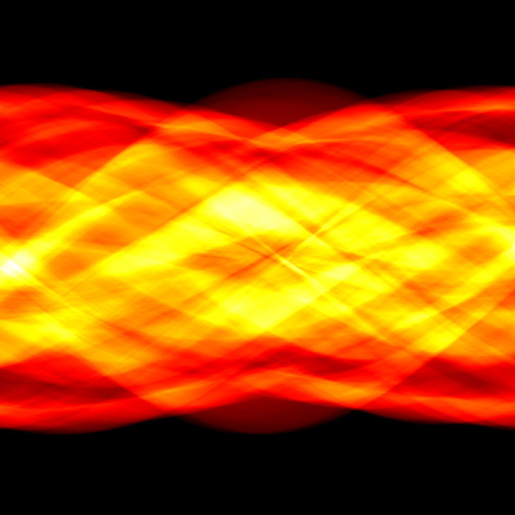

# 1.2 正向模型：线性算子 $y = Ax$

## 从"观测如何生成"到"如何反推"

1.1节中我们建立了逆问题的基本框架：给定观测 $y$，推断未知量 $x$。但要讨论"如何反推"，必须先理解"观测是如何生成的"——正如一个侦探在破案之前，必须先理解犯罪现场是如何形成的。

这个"从因到果"的过程，就是**正向模型**（forward model）。它描述了从原始信号 $x$ 到观测数据 $y$ 之间的映射关系。在本书中，我们将主要关注线性正向模型：

$$y = Ax$$

其中 $x \in \mathbb{R}^n$ 是未知的原始图像（按列向量排列），$A \in \mathbb{R}^{m \times n}$ 是正向算子（描述成像过程的数学模型），$y \in \mathbb{R}^m$ 是可获得的观测数据。正向算子 $A$ 的不同物理含义，对应了不同类型的图像逆问题。

> **为什么从正向模型开始？** 因为正向模型定义了逆问题的"游戏规则"——$A$ 决定了哪些信息被保留、哪些信息被丢失、哪些信息被混淆。不理解 $A$，就无法理解为什么逆问题困难，更无法设计求解策略。正如1.1节所言：**只有理解了"观测如何生成"，才能讨论"如何反推"。**

---

## 卷积模糊：散焦与运动模糊

### 物理背景

当相机对焦不准、或者物体在曝光期间发生运动时，成像结果就会出现模糊。这种模糊的本质是：图像中每个像素的值不再只反映该位置本身的亮度，而是周围像素亮度的加权平均。数学上，这个过程可以用**卷积**（convolution）来描述。

### 连续模型

将图像表示为连续函数 $u : \Omega \to \mathbb{R}$（$\Omega$ 为图像域），模糊过程可表示为：

$$f(x) = \int_\Omega k(x - y)\, u(y)\, \mathrm{d}y$$

其中 $k$ 称为**点扩散函数**（Point Spread Function, PSF），它描述了一个点光源经过成像系统后如何"扩散"为一片光斑。直观地理解：$k(x-y)$ 度量了位置 $y$ 处的光源对位置 $x$ 处的观测值的贡献大小。

- **散焦模糊**：PSF 通常是一个均匀圆盘或高斯函数，因为光通过圆形孔径衍射后呈圆形扩散。
- **运动模糊**：PSF 沿运动方向拉伸为一条线段，因为曝光期间物体的像沿运动方向连续移动。

### 离散模型

在数字图像中，图像由离散像素构成。设 $x \in \mathbb{R}^n$ 为原始图像（按列向量化），模糊过程可以写为：

$$y = h * x$$

其中 $*$ 表示二维离散卷积，$h$ 是离散化的 PSF 核。

关键之处在于：**卷积是一种线性运算**，因此总可以写为矩阵-向量乘法的形式 $y = Ax$。这里的矩阵 $A$ 是由 PSF $h$ 构造的**循环卷积矩阵**（也叫 Toeplitz 矩阵，在周期边界条件下变为循环矩阵）。

以一维为例，若 PSF 为 $h = [h_{-1}, h_0, h_1]$，则卷积矩阵为：

$$A = \begin{bmatrix} h_0 & h_{-1} & 0 & \cdots & h_1 \\ h_1 & h_0 & h_{-1} & \cdots & 0 \\ 0 & h_1 & h_0 & \cdots & 0 \\ \vdots & & & \ddots & \vdots \\ h_{-1} & 0 & \cdots & h_1 & h_0 \end{bmatrix}$$

### DFT 对角化

卷积矩阵有一个极为重要的性质：**在离散傅里叶变换（DFT）基下，循环卷积矩阵是对角矩阵**。这意味着卷积运算在频域变成了逐元素的乘法：

$$\mathcal{F}(h * x) = \mathcal{F}(h) \odot \mathcal{F}(x)$$

其中 $\mathcal{F}$ 表示 DFT，$\odot$ 表示逐元素乘法。这一性质（卷积定理）不仅给出了正向模型的快速计算方法（用 FFT 将 $O(n^2)$ 降为 $O(n\log n)$），也为后续的逆问题求解提供了关键工具——在频域中，卷积的逆运算（反卷积）等价于逐元素除法。

> **逆问题**：从模糊图像 $y$ 和已知 PSF $h$ 恢复清晰图像 $x$，称为**图像去模糊**（deblurring）。如果 PSF $h$ 也未知，则称为**盲去卷积**（blind deconvolution），难度更高。

---

## 下采样：从高分辨到低分辨

### 物理背景

数字相机的传感器像素数量是有限的。当成像系统的分辨率低于场景本身的细节时，高分辨率的场景信息被"压缩"到低分辨率的像素网格上，这就是**下采样**（downsampling）。同样的现象也出现在遥感成像、医学成像的低分辨扫描等场景中。

### 数学模型

下采样的正向模型可以表述为：从 $n$ 个像素的原始图像 $x$ 中，只保留 $m$ 个像素（$m < n$），得到低分辨率观测 $y$。

最简单的下采样是**抽取**（decimation）：$A$ 是一个选择矩阵，每一行在对应位置取1、其余位置取0，直接丢弃部分像素。例如，2倍下采样：

$$y[i,j] = x[2i, 2j]$$

更合理的模型是**平均下采样**（average pooling）：$A$ 的每一行对应输出像素位置，将附近若干输入像素取平均：

$$y[i,j] = \frac{1}{4}\big(x[2i,2j] + x[2i{+}1,2j] + x[2i,2j{+}1] + x[2i{+}1,2j{+}1]\big)$$

这相当于先对图像做局部平均（低通滤波），再进行抽取。

无论哪种方式，下采样算子 $A$ 都是一个行数少于列数的矩阵（$m < n$），这意味着 $A$ 不可逆——从 $n$ 维压缩到 $m$ 维的过程中，$n - m$ 个自由度的信息被不可逆地丢失了。

> **逆问题**：从低分辨率图像 $y$ 恢复高分辨率图像 $x$，称为**超分辨率重建**（super-resolution）。由于 $A$ 不可逆，信息已经永久丢失，逆问题有无穷多个解——这就是不适定性的典型表现。

---

## 掩码与缺失：图像修复

### 物理背景

有时，图像中的部分像素完全丢失——被遮挡、损坏或未被采集。例如：照片上的划痕、老旧照片的局部褪色、医学影像中部分区域被金属伪影遮挡等。

### 数学模型

这种情形的正向模型极为简单：$A$ 是一个**二值掩码矩阵** $M \in \{0,1\}^{m \times n}$，每一行在保留的像素位置取1，在缺失的像素位置取0。观测值 $y$ 就是原始图像 $x$ 中被掩码保留的那些像素值：

$$y = Mx$$

或者更直觉地理解：$y = x \odot m$，其中 $m$ 是与图像同尺寸的二值掩码（1=保留，0=缺失），$\odot$ 是逐元素乘法。

> **逆问题**：从部分像素恢复完整图像，称为**图像修复**（inpainting）。虽然缺失像素不多，但如何"合理地"填充缺失区域，需要关于图像内容的先验知识——这正是贝叶斯框架中先验的任务（第2章展开）。

---

## Radon 变换：CT 成像的核心正向模型

### 物理背景：X 射线如何"看见"人体内部

CT（Computed Tomography，计算机断层扫描）是逆问题最经典的应用之一。其物理原理是：X 射线穿过人体时，不同组织的衰减系数不同——骨骼衰减强（在图像中显示为白色），软组织衰减弱（灰色），空气几乎不衰减（黑色）。

### Beer-Lambert 定律

要理解 CT 的正向模型，必须从 X 射线的衰减物理说起。

当一束强度为 $I_0$ 的单色 X 射线穿过厚度为 $s$ 的均匀物质（衰减系数为 $\mu$）时，出射强度 $I_1$ 满足：

$$I_1 = I_0 \, e^{-\mu s}$$

这就是 **Beer-Lambert 定律**的简单形式：衰减是指数性的，衰减量取决于物质的衰减系数和路径长度。

对于非均匀物质，衰减系数 $\mu$ 随位置变化（这正是 CT 要重建的未知量！），Beer-Lambert 定律推广为：

$$I_1 = I_0 \exp\!\Big(-\int_\ell \mu(x)\, \mathrm{d}x\Big)$$

其中积分沿 X 射线路径 $\ell$ 进行。对两边取对数，得到线性关系：

$$-\ln\frac{I_1}{I_0} = \int_\ell \mu(x)\, \mathrm{d}x$$

这个等式的意义至关重要：**取对数后，测量值与未知量之间是线性关系**——对数测量值等于衰减系数沿射线路径的线积分。这正是线性正向模型 $y = Ax$ 的物理来源。

### Radon 变换

将 Beer-Lambert 定律推广到所有可能的射线路径，就得到了 **Radon 变换**——CT 成像的数学核心。

在二维情形下，设 $u(x_1, x_2)$ 表示待重建截面的衰减系数分布。一条射线可以用角度 $\theta \in [0, \pi)$ 和偏移 $t \in [-1, 1]$ 来参数化（图1.7）：

$$\ell(\theta, t) = \{x \in \mathbb{R}^2 \mid x_1 \cos\theta + x_2 \sin\theta = t\}$$

Radon 变换定义为 $u$ 沿每条射线的线积分：

$$\mathcal{R}u(\theta, t) = \int_{\ell(\theta,t)} u(x)\, \mathrm{d}x = \int_{-\infty}^{\infty} u(t\cos\theta - s\sin\theta,\; t\sin\theta + s\cos\theta)\, \mathrm{d}s$$

$\mathcal{R}u(\theta, t)$ 作为 $(\theta, t)$ 的函数，称为**正弦图**（sinogram）——这是因为图像中一个点 $(a, b)$ 的 Radon 变换是 $t = a\cos\theta + b\sin\theta$，即一条正弦曲线，所有点的正弦曲线叠加就形成了正弦图。

### 离散化：从连续变换到矩阵模型

在计算机中，Radon 变换必须离散化。将待重建区域划分为 $N \times N$ 个像素，未知量 $x \in \mathbb{R}^{N^2}$ 是所有像素的衰减系数。同时，CT 扫描仪从 $K$ 个角度采集数据，每个角度有 $D$ 个探测器单元，共 $m = K \times D$ 个测量值。

离散化的关键在于：矩阵 $A$ 的每一行对应一条射线，每一列对应一个像素，矩阵元素 $A_{ij}$ 表示第 $i$ 条射线穿过第 $j$ 个像素的路径长度（或等效权重）：

$$y_i = \sum_{j=1}^{N^2} A_{ij}\, x_j$$

例如，在 Siltanen 的 12×12 像素、11 角度、每角度 21 条射线的教学示例中，$A$ 是一个 $231 \times 144$ 的矩阵——行数 $231 = 11 \times 21$（测量数），列数 $144 = 12 \times 12$（未知数）。

> **逆问题**：从正弦图 $y$ 和已知扫描几何 $A$ 恢复截面图像 $x$，称为 **CT 重建**。这是图像逆问题中研究最深入、应用最广泛的领域之一，第16章将专门讨论。

---

## 傅里叶采样：MRI 的正向模型

### 物理背景

磁共振成像（MRI）与 CT 使用完全不同的物理原理。MRI 不依赖电离辐射，而是利用磁场和射频脉冲激发人体内氢质子的磁共振信号。信号采集在**频率空间**（k-space）中进行，测量值是图像的傅里叶系数的采样。

### 数学模型

设 $u(x)$ 为质子密度分布（待重建图像），MRI 的正向模型是傅里叶变换的有限采样：

$$\hat{u}(\xi) = \frac{1}{(2\pi)^{d/2}} \int_{\mathbb{R}^d} u(x)\, e^{i\xi \cdot x}\, \mathrm{d}x$$

实际采集的测量值是：

$$y_i = \hat{u}(\xi_i), \quad i = 1, 2, \ldots, m$$

即傅里叶频谱在 $m$ 个频率点 $\xi_1, \ldots, \xi_m$ 处的采样。

若频谱被完全采样（$m$ 足够大且均匀分布），则可通过逆傅里叶变换精确恢复 $u$。但 MRI 的扫描时间与采样点数成正比——**采样越少，扫描越快，但信息丢失越多**。因此，MRI 逆问题的核心挑战是：如何从欠采样的 k-space 数据中恢复高质量图像。

这个正向模型可以写为 $y = A x$，其中 $A = M \mathcal{F}$：先做傅里叶变换 $\mathcal{F}$，再用掩码 $M$ 选取采样点。这类"傅里叶变换 + 掩码"的算子结构在压缩感知 MRI 中尤为重要（第16章展开）。

> **逆问题**：从欠采样的 k-space 数据恢复图像，称为 **MRI 重建**。压缩感知和深度学习方法在第16章讨论。

---

## 正向模型的统一视角

回顾本节介绍的四类正向模型，它们虽然来自截然不同的物理场景，但共享同一个数学框架 $y = Ax$：

| 逆问题 | 正向算子 $A$ | 物理含义 | 信息损失机制 |
|--------|------------|---------|------------|
| 图像去模糊 | 循环卷积矩阵（由 PSF $h$ 构造） | 散焦/运动模糊 | 高频信息被 PSF "抹平" |
| 超分辨率 | 下采样矩阵（$m < n$） | 低分辨率成像 | 空间分辨率降低，像素信息丢失 |
| 图像修复 | 二值掩码矩阵 $M$ | 部分像素缺失 | 被遮挡区域的像素完全丢失 |
| CT 重建 | Radon 变换矩阵 | X 射线投影 | 三维→二维投影的降维 |
| MRI 重建 | $M\mathcal{F}$（傅里叶+掩码） | k-space 采样 | 频域采样不足 |

尽管 $A$ 的具体形式各异，但它们都有两个共同特征：

1. **信息损失**：$A$ 将高维的 $x$ 映射到低维或退化的 $y$，某些信息被 $A$ 不可逆地抹去。这是逆问题不适定性的物理根源。
2. **线性结构**：$y = Ax$ 是线性关系，这意味着逆问题的数学结构是清晰的——至少在无噪声的情形下，问题可以归结为线性方程组的求解（尽管通常不可直接求解）。

> **从正向到逆向**：正向模型 $y = Ax$ 告诉我们"世界如何生成观测"，而逆问题则要回答"从观测能否还原世界"。下一节（1.3）将看到，即使正向模型完全已知，逆过程也常常不可行——$A$ 的信息损失使得直接求逆 $x = A^{-1}y$ 在数学上不可靠，这就是**不适定性**（ill-posedness）的来源。
