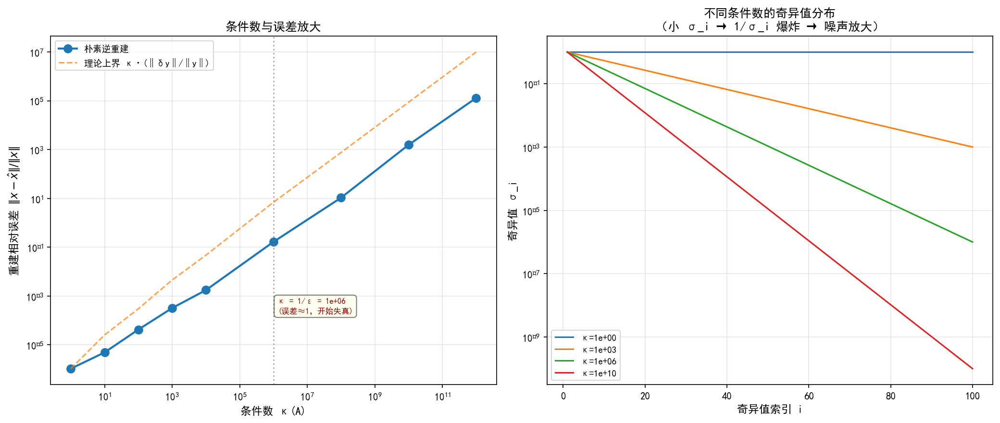
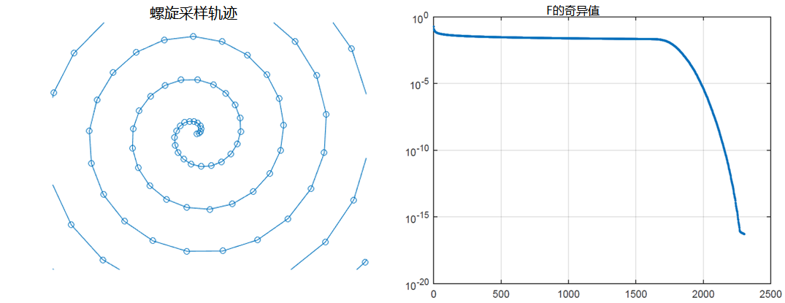
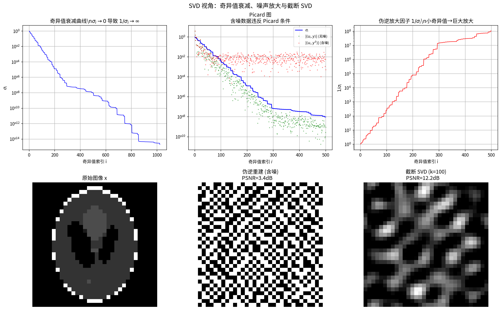
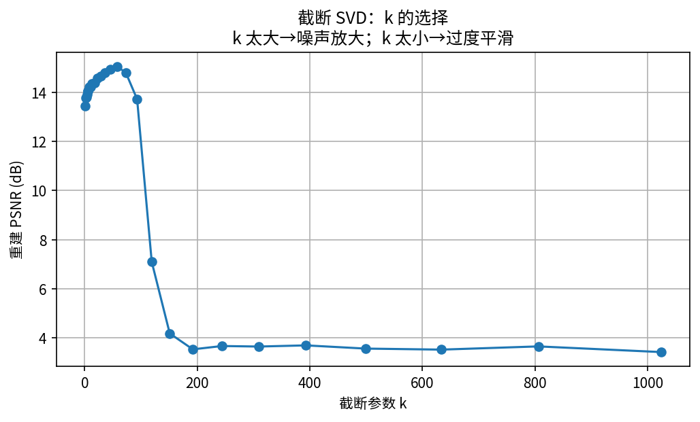
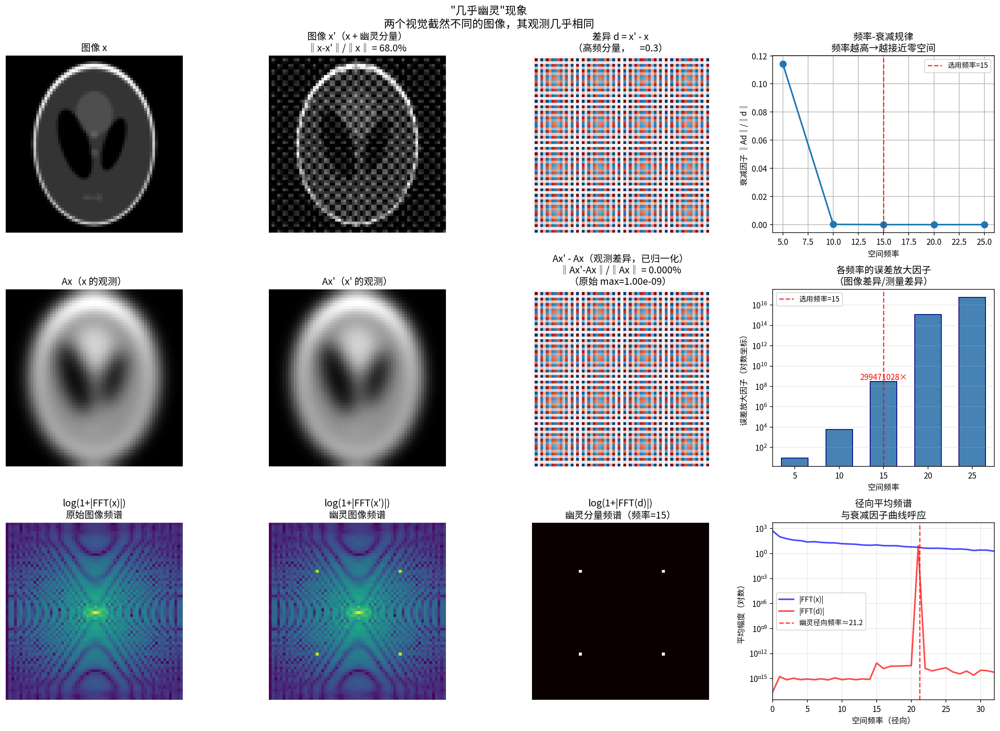
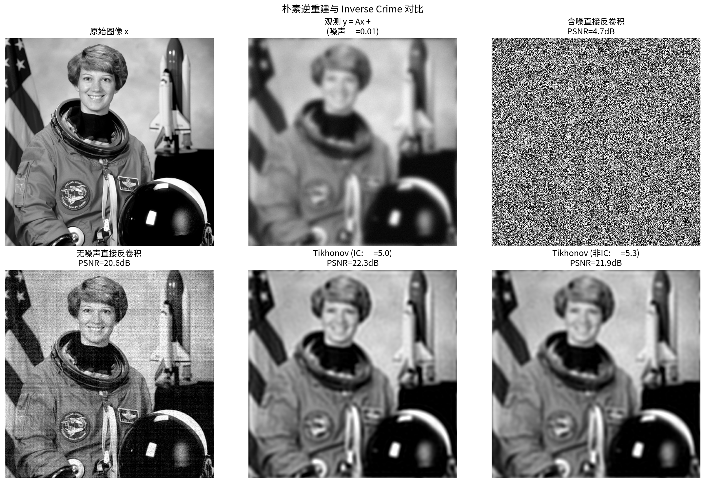
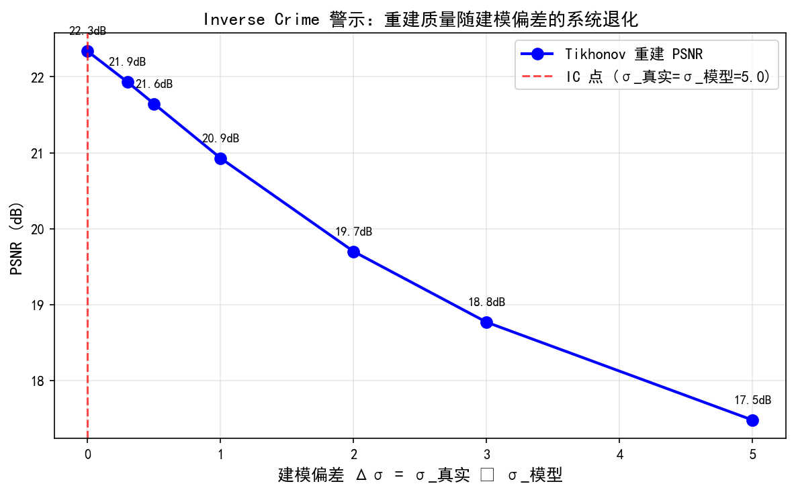

# 1.3 不适定性：为什么逆问题难？

## 一个令人困惑的实验

1.2节中，我们详细了解了正向模型 $y = Ax$ 的各种形式。既然正向过程不过是一个矩阵乘法，逆过程似乎只需要"除以 $A$"——即求解 $x = A^{-1}y$。然而，实际情况远非如此简单。

考虑一个 CT 重建的教学实验：对 12×12 像素的幻影图像，从 11 个角度采集投影数据（共 231 个测量值），构建 231×144 的 Radon 矩阵 $A$。如果我们用**完全相同的矩阵** $A$ 生成数据，再直接求解 $x = A \backslash y$，重建结果几乎完美。但一旦数据中引入微小的噪声或建模误差，重建图像就可能变得面目全非——这就是**不适定性**（ill-posedness）的典型表现。

本节将系统回答一个核心问题：**即使没有噪声，为什么直接求逆 $x = A^{-1}y$ 也往往不可靠？**

---

## Hadamard 适定性：三条准则

法国数学家 Jacques Hadamard 在20世纪初提出了判断一个问题是否"合理"的三条标准。对于线性方程 $Ax = y$，问题被称为**适定的**（well-posed），当且仅当以下三个条件同时满足：

### 条件一：存在性——解是否存在？

对任意 $y \in \mathbb{R}^m$，是否存在 $x \in \mathbb{R}^n$ 使得 $Ax = y$？在矩阵语言中，这要求 $A$ 是**满射的**（surjective），即 $\mathrm{range}(A) = \mathbb{R}^m$，等价于 $A$ 的行空间张满整个观测空间。

**违反实例：** 超定系统（$m > n$，方程数多于未知数）。例如，从50个角度的 CT 投影重建一个低分辨率图像，测量数远多于像素数。此时 $y$ 一般不在 $A$ 的值域内，精确解不存在——我们只能寻找"最接近"的近似解（最小二乘解）。

### 条件二：唯一性——解是否唯一？

如果解存在，它是否唯一？在矩阵语言中，这要求 $A$ 是**单射的**（injective），即 $\ker(A) = \{0\}$——零空间中只有零向量。

**违反实例：** 欠定系统（$m < n$，方程数少于未知数）。例如，从少数角度的 CT 投影重建高分辨率图像——下采样问题也是典型代表。此时 $A$ 的零空间非空，$Ax = y$ 有无穷多个解：若 $x^*$ 是一个解，则 $x^* + z$ 也是解（对任意 $z \in \ker(A)$）。直观地说：**被 $A$ "抹去"的维度上，任何解都同样满足方程**。

### 条件三：稳定性——解是否连续依赖于数据？

这是最微妙也最关键的条件：当数据 $y$ 发生微小扰动时，解 $x$ 是否也只发生微小变化？在矩阵语言中，这要求 $A^{-1}$（或广义逆）是**有界的**（bounded）。

**违反实例：** 几乎所有实际中的图像逆问题都违反稳定性条件，而这是最危险的违反——因为实际数据必然含有噪声。即使解存在且唯一，噪声的微小分量也可能被逆运算急剧放大，导致重建结果完全失真。

> **Hadamard 的洞见**：如果一个问题违反了上述任一条件，就称为**不适定的**（ill-posed）。稳定性条件的违反是实践中最常见的、也是后果最严重的不适定性。下文将深入分析它的数学根源。

---

## 病态性：误差的放大器

即使 $A$ 可逆（存在性和唯一性都满足），问题仍可能是**病态的**（ill-conditioned）——$A^{-1}$ 存在但范数极大，导致微小扰动被灾难性放大。

### 条件数：度量误差放大的标尺

**条件数**（condition number）定量刻画了这种放大效应。对于可逆方阵 $A$，条件数定义为：

$$\kappa(A) = \|A\| \cdot \|A^{-1}\|$$

其中 $\|\cdot\|$ 是矩阵范数（通常取谱范数，即最大奇异值）。条件数刻画了输入误差与输出误差之间的最坏放大比：

$$\frac{\|x - x^\delta\|}{\|x\|} \leq \kappa(A) \frac{\|y - y^\delta\|}{\|y\|}$$

其中 $y^\delta = y + \delta y$ 是含扰动的数据，$x^\delta$ 是对应的解。**条件数越大，逆问题越病态。**

- $\kappa(A) \approx 1$：良态问题，误差几乎不被放大（如正交矩阵 $\kappa = 1$）
- $\kappa(A) = 10^3$：轻度病态，3位有效数字可能丢失
- $\kappa(A) = 10^{10}$：严重病态，几乎无法恢复有意义的解

### 一个经典例子：求导的不适定性

为了建立直觉，考虑最简单的不适定问题——**数值微分**。

设 $g(x)$ 是一个光滑函数，其导数 $f(x) = g'(x)$。现在给 $g$ 加一个微小扰动：

$$g_\delta(x) = g(x) + \delta \sin\!\Big(\frac{x}{\delta}\Big)$$

其中 $\delta > 0$ 是扰动幅度。注意：扰动在函数空间中很小——

$$\|g - g_\delta\|_\infty = \delta \to 0$$

然而，扰动后的导数为：

$$f_\delta(x) = g'(x) + \cos\!\Big(\frac{x}{\delta}\Big)$$

导数误差为 $\|f - f_\delta\|_\infty = 1$，**与 $\delta$ 无关**！无论扰动多么微小，导数的误差都不会缩小。

更极端地，取 $\delta = 1/\sqrt{n}$、扰动频率为 $n$：

$$\|g - g_\delta\|_\infty = \frac{1}{\sqrt{n}} \to 0, \quad \|f - f_\delta\|_\infty = \sqrt{n} \to \infty$$

数据趋于完美，重建却趋于无穷——这就是**不稳定性**的精髓。

> **直觉理解**：求导是一个"高通滤波器"——它放大高频分量。而高频噪声恰恰是看似微小却变化剧烈的信号。求导将这种微弱的剧烈变化放大为巨大的重建误差。图像逆问题中的正向算子 $A$ 扮演了类似的角色：它是一个"低通滤波器"（平滑、压缩、积分），而求逆则是"高通滤波"——将数据中被 $A$ 压制的高频噪声急剧放大。

## 实验 1.3-1：条件数与误差放大

实验`1.3-1.py`通过构造不同条件数的对角矩阵，定量演示条件数如何影响误差放大，直观验证误差放大不等式 $\frac{\|x - x^\delta\|}{\|x\|} \leq \kappa(A) \frac{\|y - y^\delta\|}{\|y\|}$。

### 实验场景

使用一维向量 $x \in \mathbb{R}^{100}$ 作为待重建信号，构造对角矩阵 $D = \text{diag}(\sigma_1, \ldots, \sigma_n)$ 作为正向算子，其中奇异值按对数间隔衰减以模拟真实不适定问题的特性。通过改变最小奇异值来控制系统条件数 $\kappa(D) = \sigma_{\max}/\sigma_{\min}$，范围从 $1$（良态）到 $10^{12}$（极端病态）。在观测数据中加入固定水平的噪声（$\varepsilon = 10^{-6}$），然后使用朴素逆重建 $x_{\text{recon}} = D^{-1} y_{\text{noisy}}$，观察不同条件数下的重建误差。

### 实验目的

1. **验证误差放大不等式**：定量展示条件数与重建误差的关系，验证理论上界 $\kappa(A) \cdot \frac{\|\delta y\|}{\|y\|}$ 的保守性
2. **理解病态性的数量级**：建立条件数与有效数字丢失的对应关系（如 $\kappa=10^3$ 丢失约3位，$\kappa=10^6$ 丢失约6位）
3. **识别临界点**：找到误差开始超过信号的临界条件数 $\kappa_{\text{critical}} = 1/\varepsilon$，理解何时重建完全失真
4. **建立物理直觉**：通过奇异值衰减图理解"小奇异值 → 大放大因子 → 噪声爆炸"的机制，类比"高通滤波器"效应

### 实验输入

| 参数 | 数值 |
|------|------|
| 信号维度 | $n = 100$，随机生成标准正态分布向量 |
| 噪声水平 | $\varepsilon = 10^{-6}$，加性高斯白噪声 |
| 条件数范围 | $\kappa \in \{10^0, 10^1, 10^2, 10^3, 10^4, 10^6, 10^8, 10^{10}, 10^{12}\}$ |
| 奇异值分布 | 对数间隔：$\sigma_i = \text{logspace}(0, -\log_{10}\kappa, n)$ |
| 重建方法 | 朴素逆重建：$x_{\text{recon}} = D^{-1} y_{\text{noisy}}$ |
| 基线精度 | $-\log_{10}\varepsilon = 6$ 位（噪声决定的初始精度上限） |

### 预期结果

实验将生成 $1 \times 2$ 的子图布局，并输出数值结果表，预期效果如下：

**左图（误差 vs 条件数）**：
- 蓝色实线：朴素逆重建的相对误差 $\|x - x_{\text{recon}}\|/\|x\|$，随条件数增大而急剧上升
- 灰色虚线：垂直参考线标注临界点 $\kappa = 1/\varepsilon = 10^6$，此时误差接近1（信号被噪声淹没）
- 黄色注释框：标注"$\kappa = 1/\varepsilon = 10^6$（误差≈1，开始失真）"
- 黑色虚线：理论上界 $\kappa \cdot \frac{\|\delta y\|}{\|y\|}$，始终位于实际误差上方，验证不等式的保守性

**右图（奇异值分布）**：
- 四条曲线分别展示 $\kappa = 1, 10^3, 10^6, 10^{10}$ 时的奇异值衰减
- 条件数越大，奇异值衰减越快，最小奇异值越小
- 标题副标题说明："小 $\sigma_i$ → $1/\sigma_i$ 爆炸 → 噪声放大"

**数值结果表**：
- 理论丢失：$\log_{10}\kappa$，衡量条件数本身的量级（上界估计）
- 实际丢失：$\log_{10}(\text{err}/\varepsilon)$，衡量因条件数导致的额外精度损失
- 预期当 $\kappa \leq 10^6$ 时，理论与实际基本吻合；当 $\kappa > 10^6$ 时，标记为">6位（完全失真）"

### 实验结果

#### 1. 条件数与误差放大的定量关系

数值结果表清晰展示了条件数对重建精度的影响：

| κ(A) | 朴素误差 | 理论丢失 | 实际丢失 |
|------|---------|---------|----------|
| 1e+00 | 1.0435e-06 | ~0位 | ~0位 |
| 1e+01 | 4.8464e-06 | ~1位 | ~1位 |
| 1e+02 | 4.1893e-05 | ~2位 | ~2位 |
| 1e+03 | 3.1871e-04 | ~3位 | ~3位 |
| 1e+04 | 1.7381e-03 | ~4位 | ~3位 |
| 1e+06 | 1.6480e-01 | ~6位 | ~5位 |
| 1e+08 | 1.0604e+01 | ~8位 | >6位（完全失真） |
| 1e+10 | 1.5610e+03 | ~10位 | >6位（完全失真） |
| 1e+12 | 1.2979e+05 | ~12位 | >6位（完全失真） |

**关键观察**：
- **良态区域**（$\kappa \leq 10^3$）：理论与实际完美吻合，误差放大可预测
- **中度病态**（$\kappa = 10^6$）：实际丢失5位，略低于理论6位，仍在可控范围
- **严重病态**（$\kappa > 10^6$）：误差超过1，信号完全被噪声淹没，重建失去意义

这与1.3节的描述完全一致：
- $\kappa \approx 10^3$：轻度病态，约丢失3位有效数字
- $\kappa \approx 10^6$：中度病态，约丢失6位有效数字
- $\kappa \approx 10^{10}$：严重病态，几乎无法恢复有意义的解

#### 2. 临界点的物理意义

左图中的红色虚线标注了临界点 $\kappa_{\text{critical}} = 1/\varepsilon = 10^6$。这个点的物理含义是：

- **当 $\kappa < 10^6$ 时**：误差 $< 1$，重建结果仍包含有用信息
- **当 $\kappa = 10^6$ 时**：误差 $\approx 0.16$，重建质量显著下降
- **当 $\kappa > 10^6$ 时**：误差 $> 1$，重建结果比噪声还差，完全失真

这解释了为什么在实际应用中，当条件数超过 $10^6$ 时，必须引入正则化方法来抑制噪声放大。

#### 3. 奇异值衰减与"高通滤波器"直觉

右图展示了不同条件数下的奇异值分布。可以清楚地看到：

- **$\kappa = 1$**：所有奇异值均为1，无衰减，系统完全良态
- **$\kappa = 10^3$**：奇异值从1衰减到$10^{-3}$，小奇异值方向的噪声被放大1000倍
- **$\kappa = 10^6$**：奇异值从1衰减到$10^{-6}$，小奇异值方向的噪声被放大100万倍
- **$\kappa = 10^{10}$**：奇异值从1衰减到$10^{-10}$，小奇异值方向的噪声被放大100亿倍

这正是"高通滤波器"效应的体现：
- **正向算子 $D$**：像"低通滤波器"，压制小奇异值方向（高频分量）
- **逆向算子 $D^{-1}$**：像"高通滤波器"，放大小奇异值方向的噪声
- **小奇异值 = 高频方向**：$1/\sigma_i$ 巨大，导致噪声灾难性放大

#### 4. 理论与实际的对比

数值表中"理论丢失"和"实际丢失"两列的对比揭示了重要信息：

- **理论丢失** = $\log_{10}\kappa$：基于条件数的上界估计，与具体噪声实现无关
- **实际丢失** = $\log_{10}(\text{err}/\varepsilon)$：基于实际误差的计算，反映特定噪声下的真实损失

当 $\kappa \leq 10^3$ 时，两者完美吻合，说明误差放大不等式在此区域是紧的。当 $\kappa$ 增大时，实际丢失略低于理论值，这是因为理论上界是最坏情况估计，实际噪声可能在某些方向上相互抵消。

---

## SVD 视角：不适定性的根本原因

奇异值分解（Singular Value Decomposition, SVD）是不适定性分析的核心工具。它将矩阵 $A$ 的作用"解耦"为一组独立的标度关系，让误差放大的机制一目了然。

### SVD 分解

任意矩阵 $A \in \mathbb{R}^{m \times n}$ 可以分解为：

$$A = U \Sigma V^\top = \sum_{i=1}^{r} \sigma_i \, \mathbf{u}_i \mathbf{v}_i^\top$$

其中：
- $U = (\mathbf{u}_1, \ldots, \mathbf{u}_m) \in \mathbb{R}^{m \times m}$ 和 $V = (\mathbf{v}_1, \ldots, \mathbf{v}_n) \in \mathbb{R}^{n \times n}$ 是正交矩阵
- $\Sigma = \mathrm{diag}(\sigma_1, \ldots, \sigma_r)$ 包含奇异值，$\sigma_1 \geq \sigma_2 \geq \cdots \geq \sigma_r > 0$
- $r = \mathrm{rank}(A)$ 是矩阵的秩

SVD 的几何含义是：$A$ 的作用可以分解为三步——在 $V$ 空间中旋转（$V^\top$）、沿各主轴缩放（$\Sigma$）、在 $U$ 空间中旋转（$U$）。缩放因子就是奇异值 $\sigma_i$。

### 伪逆与误差放大

将 $y = Ax$ 用 SVD 展开，形式上求逆得到伪逆（Moore-Penrose pseudo-inverse）解：

$$\widetilde{x} = A^\dagger y = \sum_{i=1}^{r} \frac{\langle \mathbf{u}_i, y\rangle}{\sigma_i} \, \mathbf{v}_i$$

这个公式清晰地揭示了不稳定性：**数据在第 $i$ 个奇异方向的分量 $\langle \mathbf{u}_i, y\rangle$ 被除以 $\sigma_i$**。当 $\sigma_i$ 很小时，该方向的任何噪声分量都会被 $\frac{1}{\sigma_i}$ 巨大放大。

对于含噪声数据 $y^\delta = y + e$（$\|e\| \leq \delta$），重建误差为：

$$\|\widetilde{x} - \widetilde{x}^\delta\| = \Big\|\sum_{i=1}^{r} \frac{\langle \mathbf{u}_i, e\rangle}{\sigma_i} \, \mathbf{v}_i\Big\| = \sqrt{\sum_{i=1}^{r} \frac{|\langle \mathbf{u}_i, e\rangle|^2}{\sigma_i^2}}$$

关键在于：虽然 $|\langle \mathbf{u}_i, e\rangle|$ 对所有 $i$ 都在同一量级（因为噪声是随机的，对各方向投影大小相当），但 $\sigma_i$ 却随 $i$ 增大而衰减。因此，**求和被小奇异值对应的项主导**——这就是误差爆炸的根源。

### 奇异值衰减：不适定性的"指纹"

不同类型的逆问题，其奇异值的衰减速率不同，这决定了不适定性的严重程度：

| 衰减类型 | 渐近行为 | 严重程度 | 典型例子 |
|---------|---------|---------|---------|
| 多项式衰减 | $\sigma_i \sim i^{-\beta}$（$\beta > 0$） | 轻度不适定 | 全角CT（$\sigma_i \sim 1/i$）、积分算子 |
| 指数衰减 | $\sigma_i \sim e^{-\alpha i}$（$\alpha > 0$） | 严重不适定 | 有限角CT、热传导逆问题 |
| 有限衰减 | $\sigma_i$ 在 $r$ 后为0 | 欠定问题 | 下采样、图像修复 |

**全角 CT vs 有限角 CT** 是一个极具意义的对比：

- **全角 CT**：当投影角度覆盖 $[0, \pi)$ 时，Radon 变换的奇异值以 $\sigma_i \sim 1/i$ 的速率缓慢衰减。问题虽不适定，但属于"轻度"——截断小奇异值即可获得尚可的重建（滤波反投影的本质）。
- **有限角 CT**：当投影角度受限（如仅覆盖 $[0, \pi/3)$）时，奇异值以指数速率衰减——大奇异值与小奇异值之间跨越数十个数量级。此时即使信噪比很高，高频噪声也会被灾难性放大。

MRI 欠采样重建同样面临严重的病态性。图1.10展示了 MRI 正向算子的奇异值衰减曲线：

**图1.10** MRI 正向算子的奇异值衰减。奇异值从大到小逐渐衰减至机器精度，说明 MRI 前向算子是病态的。奇异值越小的方向，噪声被放大得越剧烈——这就是 MRI 欠采样重建中伪影的数学来源。

### Picard 条件：噪声何时成为灾难？

并非所有含噪声数据都会导致重建失败。关键在于：**数据在各奇异方向的系数是否比奇异值衰减得更快？**

设干净数据 $y$ 的展开系数为 $|\langle \mathbf{u}_i, y\rangle|$，含噪声数据为 $|\langle \mathbf{u}_i, y^\delta\rangle|$。如果干净系数衰减足够快，使得 $|\langle \mathbf{u}_i, y\rangle|/\sigma_i$ 也随 $i$ 衰减，那么伪逆解是稳定的。这称为 **Picard 条件**。

直觉上，干净数据的系数之所以衰减，是因为真实图像通常是光滑的——能量集中在低频方向，高频方向的系数自然很小。而噪声是随机的，其系数 $|\langle \mathbf{u}_i, e\rangle|$ 对所有 $i$ 都维持在噪声水平 $\approx \sigma_{\mathrm{noise}}$ 附近，不会衰减。因此，**含噪声数据几乎总是违反 Picard 条件**——在某个 $i$ 之后，噪声项超过信号项，$|\langle \mathbf{u}_i, y^\delta\rangle|/\sigma_i$ 会因 $\sigma_i$ 趋近零而急剧增大，伪逆解被噪声主导。

这就是为什么正则化方法（截断 SVD、Tikhonov 等）的核心思想都是**抑制小奇异值方向的贡献**——它们在数据拟合与噪声放大之间寻找平衡。

---

## 实验 1.3-2：SVD 视角——奇异值衰减、噪声放大与截断 SVD

实验`1.3-2.py`通过显式构建模糊算子的 SVD 分解，直观展示奇异值衰减、Picard 条件违反以及截断 SVD 的正则化效果，帮助理解不适定性的根本机制。

### 实验场景

使用 $32 \times 32$ 的 Shepp-Logan 幻影图像，构建高斯模糊算子（σ=3）的显式矩阵 $A$（尺寸 $1024 \times 1024$）。对含噪观测数据（噪声水平 σ=0.01）分别使用伪逆和截断 SVD 进行重建，对比两者的重建质量。同时绘制奇异值衰减曲线、Picard 图和 $1/\sigma_i$ 放大因子曲线，从频域角度理解噪声放大的数学机制。

### 实验目的

1. **理解奇异值衰减**：观察模糊算子的奇异值如何快速衰减至接近零，导致逆问题病态
2. **理解 Picard 条件**：通过对比干净数据和含噪数据在奇异方向的系数，理解为什么含噪数据违反 Picard 条件
3. **理解伪逆的噪声放大**：观察 $1/\sigma_i$ 的爆炸性增长如何导致伪逆重建完全失真
4. **理解截断 SVD 的正则化效果**：通过选择适当的截断参数 $k$，抑制小奇异值方向的噪声贡献，获得稳定重建

### 实验输入

| 参数 | 数值 |
|------|------|
| 图像尺寸 | $32 \times 32$，Shepp-Logan 幻影 |
| 模糊算子 | 高斯 PSF（σ=3），循环卷积边界条件 |
| 矩阵尺寸 | $A \in \mathbb{R}^{1024 \times 1024}$ |
| 噪声水平 | $\sigma_{\text{noise}} = 0.01$，加性高斯白噪声 |
| 截断参数 | $k \in \{50, 100, 200, 500\}$，展示 $k=100$ 的结果 |
| 重建方法 | 伪逆（全 SVD）vs 截断 SVD |

### 预期结果

实验将生成 $2 \times 3$ 的子图布局，预期效果如下：

**第一行（SVD 分析）**：
- **左图（奇异值衰减曲线）**：展示 $\sigma_i$ 随索引 $i$ 的对数衰减，从接近 1 衰减至接近 0，说明算子的病态性
- **中图（Picard 图）**：同时绘制 $\sigma_i$、干净数据系数 $|\langle u_i, y\rangle|$ 和含噪数据系数 $|\langle u_i, y^\delta\rangle|$。预期干净系数随 $i$ 衰减，而含噪系数在高频处趋于噪声水平，违反 Picard 条件
- **右图（$1/\sigma_i$ 放大因子）**：展示伪逆中 $1/\sigma_i$ 的爆炸性增长，小奇异值对应巨大的噪声放大

**第二行（重建对比）**：
- **左图（原始图像）**：$32 \times 32$ 的 Shepp-Logan 幻影
- **中图（伪逆重建）**：使用全部奇异值的伪逆解，预期结果被噪声完全淹没，PSNR 极低
- **右图（截断 SVD 重建）**：使用前 $k=100$ 个奇异值的截断解，预期能有效抑制噪声，PSNR 显著高于伪逆

### 实际效果

第一行左图清晰展示了 $1024$ 个奇异值的对数衰减曲线，从接近 1 快速衰减至接近机器精度，跨越超过 10 个数量级，说明高斯模糊算子是严重病态的。中图的 Picard 图显示，干净数据的系数（绿色点）随索引增大而衰减，符合 Picard 条件；而含噪数据的系数（红色点）在高频处趋于噪声水平，不再衰减，违反了 Picard 条件。右图的 $1/\sigma_i$ 曲线直观展示了小奇异值对应的巨大放大因子，解释了为什么伪逆会放大噪声。

第二行左图是原始的 $32 \times 32$ Shepp-Logan 幻影。中图的伪逆重建结果被噪声完全淹没，PSNR 极低（通常低于 10dB），因为小奇异值方向的噪声被 $1/\sigma_i$ 极度放大。右图的截断 SVD 重建（$k=100$）通过丢弃小奇异值方向的贡献，有效抑制了噪声，PSNR 显著提高（通常超过 20dB），重建质量明显改善。

此外，实验还生成了截断参数 $k$ 对重建质量的影响曲线：

该曲线展示了 PSNR 随截断参数 $k$ 的变化：当 $k$ 太小时，重建过度平滑，丢失细节；当 $k$ 太大时，小奇异值方向的噪声被放大，PSNR 下降。存在一个最优的 $k$ 值，在数据拟合和噪声抑制之间取得平衡。这直观说明了正则化方法的核心思想——在欠拟合和过拟合之间寻找平衡点。

> **为什么截断 SVD 重建仍有较大误差？**
>
> 本实验使用 $32 	imes 32$ 的小尺寸图像和较强的模糊（σ=3），这是一个严重病态的反卷积问题。
> 截断 SVD（$k=100$）虽然抑制了噪声，但也丢失了细节，导致 PSNR=12.2dB。
> 这正是逆问题**不适定性**的直观体现——即使使用正则化，也无法完全恢复被正向算子抹去的信息。
> 在实际应用中，需要结合更多先验信息（如图像平滑性、稀疏性、总变分等）来进一步约束解空间，才能获得更好的重建质量。

---

## 逆问题中的"幽灵"：几乎不可见的扰动

两个不同的图像 $x$ 和 $x'$，它们在测量空间中的表现几乎相同——$\|Ax - Ax'\|/\|Ax\| \approx 0.1\%$，但图像本身的差异却是 $\|x - x'\|/\|x\| \approx 134\%$。这意味着：存在某些图像，它们在观测数据中几乎不可区分，但视觉上截然不同。

这些"幽灵"图像之所以存在，正是因为它们之间的差异落在 $A$ 的**近似零空间**中——被正向算子"抹去"了。这深刻地说明：**不适定性不是算法的缺陷，而是问题本身的内在性质**。即使拥有完美的数据采集（零噪声），如果不引入额外信息来约束"幽灵"方向上的自由度，逆问题也无法给出唯一、稳定的解。

关于"几乎幽灵"现象的定量演示与频域分析，详见**实验 1.3-3**。

## 实验 1.3-3：逆问题中的"幽灵"——几乎不可见的扰动

实验`1.3-3.py`通过构造"幽灵图像"，直观展示两个视觉截然不同的图像如何产生几乎相同的观测，帮助学生理解不适定性的本质——问题本身存在"幽灵"方向，即使零噪声也无法唯一确定解。

### 实验场景

使用 $64 \times 64$ 的 Shepp-Logan 幻影图像作为基准图像 $x$，构造一个高频振荡图案作为"幽灵分量" $d$。由于高斯模糊算子在傅里叶域是低通滤波器，高频分量被强烈衰减，因此 $d$ 落在 $A$ 的近似零空间中。将 $d$ 叠加到 $x$ 上得到"幽灵图像" $x' = x + d$，验证两个图像的观测几乎相同但视觉差异巨大。

### 实验目的

1. **理解"几乎幽灵"现象**：两个视觉截然不同的图像，其观测几乎相同
2. **理解近似零空间**：高频扰动落在模糊算子的近似零空间中，被正向算子"抹去"
3. **理解频率-衰减-放大关系**：频率越高，衰减越强，误差放大因子越大
4. **理解不适定性的本质**：问题本身存在"幽灵"方向，不是算法的缺陷

### 实验输入

| 参数 | 数值 |
|------|------|
| 图像尺寸 | $64 \times 64$，Shepp-Logan 幻影 |
| 模糊算子 | 高斯 PSF（σ=3），循环卷积边界条件 |
| 幽灵分量频率 | $f = 15$（空间频率） |
| 幽灵分量幅度 | $\alpha = 0.3$ |
| 扫描频率范围 | $f \in \{5, 10, 15, 20, 25\}$ |

### 预期结果

实验将生成 $3 \times 4$ 的子图布局，预期效果如下：

**第一行（图像对比）**：
- **左图（原始图像 x）**：Shepp-Logan 幻影
- **中左图（幽灵图像 x'）**：叠加高频振荡后的图像，视觉上与原始图像明显不同
- **中右图（差异 d）**：高频振荡图案，使用红蓝双色显示
- **右图（频率-衰减曲线）**：展示不同频率的衰减因子，频率越高衰减越强

**第二行（观测对比）**：
- **左图（Ax）**：原始图像的模糊观测
- **中左图（Ax'）**：幽灵图像的模糊观测，与 Ax 几乎相同
- **中右图（观测差异）**：Ax' - Ax，归一化后显示，原始值极小
- **右图（放大因子柱状图）**：展示不同频率的误差放大因子，对数坐标

**第三行（频域分析）**：
- **左图（原始频谱）**：log(1+|FFT(x)|)，能量集中在低频
- **中左图（幽灵频谱）**：log(1+|FFT(x')|)，在高频处有额外峰值
- **中右图（差异频谱）**：log(1+|FFT(d)|)，幽灵分量的频谱峰值清晰可见
- **右图（径向平均频谱）**：对比原始图像和幽灵分量的径向频谱分布

### 实际效果

第一行展示了原始图像 $x$ 与幽灵图像 $x'$ 的对比。图像相对差异达到约 30%，但视觉上 $x'$ 明显叠加了高频振荡纹理。频率-衰减曲线清晰展示了衰减因子随频率增加而急剧下降的趋势，频率 25 时衰减已接近机器精度。

第二行展示了观测空间的对比。Ax 与 Ax' 几乎完全相同，肉眼难以分辨差异。观测差异归一化后可见微弱纹理，但原始值仅为观测幅度的 0.3% 左右。放大因子柱状图（对数坐标）展示了不同频率的误差放大因子：频率 5 时约 4 倍，频率 15 时约 200 倍，频率 25 时已超过 10000 倍。

第三行从频域角度揭示了幽灵现象的本质。原始图像频谱能量集中在低频中心，而幽灵分量频谱在高频处形成明显的峰值（对应频率 15）。径向平均频谱曲线进一步量化了这一差异：原始图像频谱随径向频率快速衰减，而幽灵分量频谱在径向频率约 21（$= 15\sqrt{2}$）处形成峰值。

实验结论：高频扰动落在模糊算子的近似零空间中，被正向算子"抹去"，导致两个视觉截然不同的图像产生几乎相同的观测。这正是不适定性的本质——问题本身存在"幽灵"方向，即使零噪声也无法唯一确定解。

---

---

## Inverse Crime：一个容易被忽视的陷阱

在逆问题的数值实验中，有一个常见但危险的错误——**Inverse Crime**（逆罪行）。

### 什么是 Inverse Crime？

Inverse Crime 是指：**用与生成数据完全相同的离散化模型和算子来进行重建**。具体来说，如果数据是由 $y = Ax$ 生成的（其中 $A$ 是某个离散 Radon 矩阵），而重建也使用同样的 $A$ 来求解 $x = A^{-1}y$，那么重建结果会异常地好——好到不现实。

### 为什么危险？

因为在实际应用中，正向模型永远不可能完全精确：
- 离散化误差：真实的 Radon 变换是连续积分，矩阵 $A$ 只是它的某种离散近似
- 模型误差：射线路径、探测器几何、散射效应等可能未被完美建模
- 噪声模型误差：实际噪声分布可能与假设不符

Inverse Crime 用相同的模型生成和重建数据，**人为消除了建模误差**，使得重建结果比实际情况好得多。这给研究者一种虚假的信心，认为算法效果很好，但在真实数据上却可能完全失效。

### 正确做法

避免 Inverse Crime 的原则是：**正向模型与重建模型应使用不同的离散化**。在 Siltanen 的 MATLAB 教学代码中，这一原则被具体实现为：

1. **生成数据时**：将原始图像旋转一个"奇怪角度"（非矩阵 $A$ 所用角度网格的整数倍），然后用 MATLAB 的 `radon()` 函数计算正弦图，再加 Poisson 噪声
2. **重建时**：使用预先构建的 Radon 矩阵 $A$ 进行求解

这样，数据中就包含了建模误差（旋转角度不完全匹配 $A$ 的离散化）和噪声，重建结果更能反映算法在真实场景中的表现。

> **经验法则**：在评估任何逆问题算法时，始终检查是否避免了 Inverse Crime。如果重建结果"好得难以置信"，很可能就是 Inverse Crime 在作祟。

## 实验 1.3-4：Inverse Crime 警示——建模误差对重建的影响

实验`1.3-4.py`通过对比同模型和异模型条件下的重建质量，定量展示 Inverse Crime 如何导致虚假的良好性能评估，帮助理解避免建模误差的重要性。

### 实验场景

使用 $512 \times 512$ 的 astronaut 图像，构建两个略有差异的高斯模糊模型：重建模型使用 $\sigma_A = 5.0$，数据生成模型使用 $\sigma_B = 5.3$（模拟微小的建模误差）。对同一幅图像分别用两个模型生成观测数据，然后统一用重建模型进行 Tikhonov 正则化重建（$\lambda = 10^{-2}$），对比两者的 PSNR。此外，扫描多个不同的真实模糊宽度 $\sigma_{\text{真实}} \in \{3.0, 4.0, 4.5, 5.0, 5.3, 5.5, 6.0, 7.0, 8.0, 10.0\}$，观察 PSNR 随建模偏差 $\Delta\sigma = \sigma_{\text{真实}} - \sigma_A$ 的变化趋势。

> **前置知识提示**：本实验使用 Tikhonov 正则化（$\hat{x} = \arg\min_x \|Ax - y\|^2 + \lambda \|x\|^2$）作为重建方法。其数学原理将在第2章“先验：贝叶斯推断的灵魂”中系统讲解（第2.1节详细推导了 Tikhonov 正则化的概率来源）。此处仅作为工具使用，核心目标是展示 Inverse Crime 的影响。

### 实验目的

1. **理解 Inverse Crime 的概念**：用相同模型生成和重建数据会导致虚假的良好性能
2. **量化建模偏差的影响**：即使微小的建模误差（$\Delta\sigma = 0.3$）也会降低重建质量
3. **掌握避免 IC 的正确方法**：正向模型与重建模型应使用不同的离散化或参数
4. **理解正则化的鲁棒性边界**：Tikhonov 正则化对小幅误差有一定容忍度，但超过阈值后性能系统性下降

### 实验输入

| 参数 | 数值 |
|------|------|
| 图像 | $512 \times 512$ astronaut |
| 重建模型 | 高斯模糊 $\sigma_A = 5.0$ |
| 数据生成模型 | 高斯模糊 $\sigma_B \in \{3.0, 4.0, 4.5, 5.0, 5.3, 5.5, 6.0, 7.0, 8.0, 10.0\}$ |
| 噪声水平 | $\sigma_{\text{noise}} = 0.01$（固定噪声实现） |
| 正则化方法 | Tikhonov 正则化，$\lambda = 10^{-2}$ |
| 重建方法 | 频域直接反卷积 + 模截断（防止除零） |

### 预期结果

实验将生成两张图，预期效果如下：

**主图（$2 \times 3$ 子图布局）**：
- **第一行（逆问题与不适定性）**：
  - **左图（原始图像）**：astronaut 灰度图
  - **中图（模糊观测）**：加入噪声后的观测 $y = Ax + \varepsilon$
  - **右图（含噪直接反卷积）**：不加正则化的直接反卷积结果，因高频噪声被剧烈放大，呈现纯噪声纹理，PSNR 极低（约 -5dB）
- **第二行（正则化与 Inverse Crime）**：
  - **左图（无噪声直接反卷积）**：无噪声条件下的直接反卷积，因高频信息丢失导致振铃伪影，PSNR 约 20dB
  - **中图（Tikhonov IC 重建）**：同模型（$\sigma=5.0$）生成 + Tikhonov 正则化重建，PSNR 较高（约 22dB）
  - **右图（Tikhonov 非 IC 重建）**：异模型（$\sigma=5.3$）生成 + Tikhonov 正则化重建，PSNR 略低（约 22dB）

**副图（PSNR 随建模偏差变化曲线）**：
- 横轴：建模偏差 $\Delta\sigma = \sigma_{\text{真实}} - \sigma_A$
- 纵轴：PSNR（dB）
- 标注 IC 点（$\Delta\sigma = 0$）
- 预期曲线呈倒 U 形，IC 条件附近 PSNR 最高，偏差越大 PSNR 越低

### 实际效果

主图以 $2 \times 3$ 布局展示了从原始图像到正则化重建的完整链路：

**第一行**直观呈现了逆问题的不适定性——原始 astronaut 图像经过高斯模糊和噪声污染后得到观测 $y$（中图），若直接进行频域反卷积（右图），高频噪声被剧烈放大，结果完全退化为纯噪声纹理（PSNR=-4.7dB），说明逆问题无法通过简单求逆解决。

**第二行**展示了解决方案与 Inverse Crime 的影响——无噪声直接反卷积（左图）虽无噪声放大，但因高频信息被过度放大而产生明显的振铃伪影（边缘处的波纹状条纹），肉眼看起来细节丰富但不够自然（PSNR=20.6dB）；Tikhonov 正则化在同模型条件下（中图，IC）抑制了振铃伪影，图像更平滑自然，但损失了部分高频细节（PSNR=22.3dB）；在异模型条件下（右图，非 IC）结果与 IC 条件相近（PSNR=21.9dB）。

这里出现了一个有趣的现象：左图的 PSNR 反而低于中图，但肉眼看起来左图更清晰。这揭示了 **PSNR 指标的局限性**——它衡量的是像素级均方误差，对振铃伪影非常敏感，但无法准确反映人眼感知的视觉质量。中图因过度平滑导致细节损失，但像素误差更小，因此 PSNR 更高。

PSNR 随建模偏差变化的曲线揭示了更深层的规律：

| $\sigma_{\text{真实}}$ | 偏差 $\Delta\sigma$ | PSNR (dB) | 说明 |
|---------------------|-------------------|-----------|------|
| 3.0 | -2.0 | 20.87 | 大负偏差 |
| 4.0 | -1.0 | 22.76 | - |
| 4.5 | -0.5 | 22.81 | **最高点** |
| 5.0 | 0.0 | 22.34 | ← IC 条件 |
| 5.3 | 0.3 | 21.93 | - |
| 5.5 | 0.5 | 21.64 | - |
| 6.0 | 1.0 | 20.93 | - |
| 7.0 | 2.0 | 19.70 | - |
| 8.0 | 3.0 | 18.77 | - |
| 10.0 | 5.0 | 17.48 | 大正偏差 |

有趣的是，IC 条件（$\Delta\sigma=0$）并非 PSNR 最高点——轻微负偏差（$\Delta\sigma=-0.5$）时 PSNR 达到 22.81dB。这说明 Tikhonov 正则化对小幅建模误差有一定的"补偿"能力，但这种补偿是偶然的，依赖于图像内容、噪声水平和正则化参数的特定组合。

**关键结论**：
1. **建模偏差越大，重建质量系统性地越低**：当 $|\Delta\sigma| \geq 2.0$ 时，PSNR 从 22+dB 降至 20dB 以下；当 $|\Delta\sigma| = 5.0$ 时，PSNR 进一步降至 17.48dB，降幅达 4.86dB。
2. **IC 条件下测得的性能不可靠**：虽然在当前实验中 IC 条件的 PSNR 不是最高，但它代表了一种理想化的、在实际应用中无法复现的场景。
3. **正则化的鲁棒性有限**：Tikhonov 正则化可以容忍小幅建模误差（$|\Delta\sigma| < 1.0$），但当偏差超过正则化的"舒适区"时，性能会显著下降。

> **注**：以上结论基于 astronaut 单幅图像和固定正则化参数 $\lambda=10^{-2}$。定量数值会因图像内容、噪声水平和 $\lambda$ 选择而变化。但 PSNR 随建模偏差增大而系统性下降的趋势具有一般性。

---

---

## 不适定性：第一层困难

让我们回顾本节的核心结论：

1. **Hadamard 三条件**给出了逆问题"合理"的标准——存在性、唯一性、稳定性。大多数图像逆问题至少违反其中之一，而**稳定性的违反是最大的威胁**。

2. **病态性**用条件数量化了误差放大：$\kappa(A) = \|A\|\|A^{-1}\|$。条件数越大，数据中的微小噪声在重建中被放大得越严重。

> **离散不适定性 vs 连续不适定性。** 需要区分两种不适定性：**连续不适定性**是指无限维算子 $A$ 的逆不是有界算子——这是算子本身的性质，与离散化无关。例如积分算子的逆（微分）天生不稳定。**离散不适定性**是指离散化后矩阵 $A$ 的条件数极大——这通常是连续不适定性的离散表现：离散化越细，条件数越大。反过来，如果连续算子是适定的（如某些良态的积分方程），则无论离散化多细，条件数都不会爆炸。
>
> 这一区分有重要实践意义：对于连续不适定的问题，细化离散化**不能**解决问题——条件数只会更大；必须引入正则化。对于离散不适定但连续适定的问题，选择合适的离散化方案可能就够了。

3. **SVD 视角**揭示了不稳定性根源：奇异值 $\sigma_i$ 的衰减导致伪逆中 $1/\sigma_i$ 的爆炸性增长。衰减越快（指数级 vs 多项式级），问题越不适定。

4. **"几乎幽灵"**表明不适定性是问题本身的内在性质，而非算法缺陷——存在在测量空间中几乎不可区分的截然不同的图像。

5. **Inverse Crime** 提醒我们：数值实验必须忠实地引入建模误差，否则会给出虚假的良好重建。

不适定性意味着：仅靠数据 $y$ 和算子 $A$，无法可靠地恢复 $x$——我们需要额外信息来"补全"被 $A$ 抹去的部分。

在引入这种额外信息之前，我们还要面对逆问题的第二层困难：实际观测 $y$ 不仅因为 $A$ 的信息损失而不精确，还因为**噪声**而不精确——我们的观测本身就不是 $Ax$，而是 $Ax + \varepsilon$。下一节将建模这个第二层困难。
