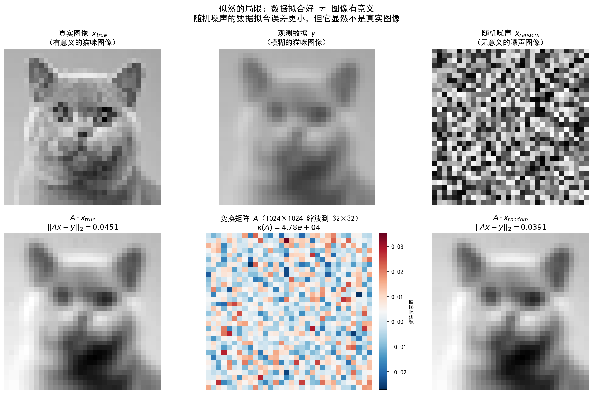

# 1.4 噪声建模与似然函数

## 从"直接求逆不行"到"观测还不精确"

1.3 节揭示了逆问题的第一层困难——不适定性：即使观测数据 $y$ 精确满足 $y = Ax$，直接求逆也可能不可靠。但现实比这还糟。我们拿到的从来不是干净利落的 $y = Ax$，而是

$$y = Ax + \varepsilon$$

其中 $\varepsilon$ 是**噪声**——由探测器电子涨落、光子计数随机性、传输错误等物理过程引入的随机扰动。

**为什么这一层困难雪上加霜？** 因为 1.3 节我们看到，伪逆 $A^\dagger$ 会把噪声分量 $\langle \mathbf{u}_i, \varepsilon\rangle$ 除以小奇异值 $\sigma_i$ 急剧放大；现在，噪声为这些小奇异值方向提供了真实的非零分量，放大效应从"潜在威胁"变成"必然灾难"。

本节核心任务：**怎么用概率论的语言精确描述噪声？** 这会引出似然函数——连接噪声模型与数据拟合项的数学纽带，也是 1.5 节贝叶斯框架的第一根支柱。

---

## 统一推导框架

不同成像系统噪声机制不同，但推导似然的流程是统一的：

```
噪声物理机制 → 噪声分布 p(ε) → 似然函数 p(y|x) → 负对数似然 -ln p(y|x) → 数据项 D(y, Ax)
```

逻辑是：
1. **噪声物理机制**决定 $\varepsilon$ 服从什么分布
2. 由 $y = Ax + \varepsilon$，得 $\varepsilon = y - Ax$ 的分布，直接给出**似然函数** $p(y|x)$——已知 $x$ 时观测到 $y$ 的概率
3. 取负对数，乘积变求和、指数消失，得到简洁**数据项** $D(y, Ax)$

关键洞察：**数据项的形式不是人为选的，而是由物理噪声机制唯一决定的。** 选 L2、L1 还是 KL 散度，不是因为哪个"更好"，而取决于噪声是高斯、Laplace（脉冲）还是 Poisson 的。

---

## 高斯噪声 → L² 数据项

### 物理来源：为什么几乎都用高斯？

这里先回答一个你可能一直想问的问题：**为什么图像处理里高斯噪声满天飞？** 答案藏在**中心极限定理（Central Limit Theorem, CLT）**里。

中心极限定理说：大量相互独立的随机小扰动叠加在一起，其总和的分布会趋近高斯分布——不管单个扰动原本是什么分布。探测器里的电子热噪声、散粒噪声，本质都是海量独立微观事件（电子跃迁、光子到达）的叠加。所以按 CLT，它们的总和天然接近高斯。这就是"为什么几乎都用高斯"的根本原因：**高斯不是拍脑袋选的，而是大量独立小扰动叠加的数学必然。**

### 噪声模型

设 $\varepsilon \sim \mathcal{N}(0, \sigma^2 I)$，即各像素独立同分布零均值高斯噪声：

$$p(\varepsilon_i) = \frac{1}{\sqrt{2\pi}\sigma} \exp\!\Big(-\frac{\varepsilon_i^2}{2\sigma^2}\Big)$$

### 似然函数推导

**因为**我们要从噪声分布得到"已知 $x$ 时看到 $y$"的概率，所以由 $y = Ax + \varepsilon$，给定 $x$ 时 $y \sim \mathcal{N}(Ax, \sigma^2 I)$，似然：

$$p(y|x) = \prod_{i=1}^{m} \frac{1}{\sqrt{2\pi}\sigma} \exp\!\Big(-\frac{(y_i - (Ax)_i)^2}{2\sigma^2}\Big) = \frac{1}{(2\pi\sigma^2)^{m/2}} \exp\!\Big(-\frac{\|y - Ax\|_2^2}{2\sigma^2}\Big)$$

### 负对数似然 → 数据项

取负对数（忽略与 $x$ 无关的常数）：

$$-\ln p(y|x) = \frac{1}{2\sigma^2} \|y - Ax\|_2^2 + \text{const}$$

**高斯噪声 → L² 数据项（最小二乘）**。几何含义是最小化观测与预测间的欧氏距离。

### 特点与局限

- **优点**：数学性质好（凸、可微），有闭式解（正规方程）
- **局限**：假设各像素噪声独立且同方差。当存在离群值（outlier）时，L² 对大残差过于敏感——一个异常大偏差被平方放大，主导整个目标函数

---

## Poisson 噪声 → KL 散度数据项

### 物理来源

Poisson 噪声源于**光子的离散性**：光子到探测器是随机计数过程，每像素记录的光子数服从 Poisson 分布。这是**信号依赖的噪声**——噪声方差等于信号均值。

典型场景：低剂量 CT（光子少，Poisson 噪声显著）、天文成像（天体光子极少）、荧光显微镜（弱荧光计数统计）。

### 噪声模型

设第 $i$ 像素真实光子数为 $(Ax)_i$，观测 $y_i$ 服从 Poisson：

$$y_i | x \sim \mathrm{Poisson}\big((Ax)_i\big)$$

PMF：

$$p(y_i | (Ax)_i) = \frac{(Ax)_i^{y_i}}{y_i!} e^{-(Ax)_i}$$

关键特性：**均值 = 方差**。$(Ax)_i$ 大时信噪比 $\mathrm{SNR} = \sqrt{(Ax)_i}$ 高；$(Ax)_i$ 小时信噪比急剧下降。低剂量 CT 图像劣化，不是噪声绝对量变大了，而是信噪比恶化了。

### 似然函数推导

**因为**各像素独立，所以似然：

$$p(y|x) = \prod_{i=1}^{m} \frac{(Ax)_i^{y_i}}{y_i!} e^{-(Ax)_i}$$

### 负对数似然 → 数据项

取负对数：

$$-\ln p(y|x) = \sum_{i=1}^{m} \Big[(Ax)_i - y_i \ln(Ax)_i + \ln(y_i!)\Big]$$

忽略与 $x$ 无关项，得 **KL 散度数据项**：

$$D_{\mathrm{KL}}(y, Ax) = \sum_{i=1}^{m} \Big[(Ax)_i - y_i \ln(Ax)_i\Big]$$

名称来自信息论：KL 散度度量两分布间"距离"。这里 $y$ 和 $Ax$ 可视为两（未归一化）分布，数据项即其 KL 散度。

### 为何不能用 L²？

能否把 Poisson 近似成高斯、直接上 L²？近似条件：当 $(Ax)_i$ 足够大，$\mathrm{Poisson}((Ax)_i) \approx \mathcal{N}((Ax)_i, (Ax)_i)$，L² 变加权最小二乘 $\sum_i (y_i - (Ax)_i)^2 / (Ax)_i$。但低计数区（$(Ax)_i$ 近零）失效：Poisson 高度偏斜不再近似高斯，且分母趋零数值不稳。因此**低剂量成像必须用 KL 散度**。

---

## 脉冲噪声 → L¹ 数据项

### 物理来源

脉冲噪声（impulse noise），也叫椒盐噪声（salt-and-pepper），源于：
- **传输错误**：个别像素被错替换为最大值（盐）或最小值（胡椒）
- **探测器故障**：个别单元失效，输出饱和或零
- **恶劣光照**：长曝光偶发强干扰

与高斯不同，脉冲噪声**只影响少数像素**，但受影响像素偏差极大。

### 噪声模型

以概率 $p$ 像素被随机替换为极值，否则不变。更一般地，用 **Laplace 分布**建模含脉冲噪声的残差：

$$\varepsilon_i \sim \mathrm{Laplace}(0, b)$$

PMF/PDF：

$$p(\varepsilon_i) = \frac{1}{2b} \exp\!\Big(-\frac{|\varepsilon_i|}{b}\Big)$$

与高斯关键区别：Laplace 尾部更"厚"——大偏差出现概率远高于高斯，正是脉冲噪声"偶尔巨大偏差"的特征。

### 似然函数推导

**因为**由 $y = Ax + \varepsilon$ 且 $\varepsilon \sim \mathrm{Laplace}(0, bI)$，所以：

$$p(y|x) = \prod_{i=1}^{m} \frac{1}{2b} \exp\!\Big(-\frac{|y_i - (Ax)_i|}{b}\Big) = \frac{1}{(2b)^m} \exp\!\Big(-\frac{\|y - Ax\|_1}{b}\Big)$$

### 负对数似然 → 数据项

$$-\ln p(y|x) = \frac{1}{b} \|y - Ax\|_1 + \text{const}$$

**脉冲/Laplace 噪声 → L¹ 数据项**。

### L¹ vs L²：鲁棒性直觉

为何 L¹ 对离群值更鲁棒？看去噪问题（$A = I$）：
- **L² 目标**：$\min_x \|y - x\|_2^2 = \sum_i (y_i - x_i)^2$。单个大残差被平方放大，迫使 $x_k$ 向 $y_k$ 靠拢——离群值"绑架"了解。
- **L¹ 目标**：$\min_x \|y - x\|_1 = \sum_i |y_i - x_i|$。大残差只线性增长，不主导总误差——算法可"忽略"少数离群值。

所以**脉冲噪声场景必须用 L¹**：L² 会让少数被污染像素主导重建，L¹ 对它们不敏感。

---

## 三种噪声→三种数据项：统一视角

汇总三种噪声模型推导：

**1. 高斯噪声**
- 分布：$\varepsilon \sim \mathcal{N}(0, \sigma^2 I)$
- 似然：$p(y|x) \propto \exp\big(-\frac{\|y-Ax\|_2^2}{2\sigma^2}\big)$
- 数据项：$\frac{1}{2\sigma^2}\|y-Ax\|_2^2$
- 场景：电子学噪声、读出噪声

**2. Poisson 噪声**
- 分布：$y_i \sim \mathrm{Poisson}((Ax)_i)$
- 似然：$p(y|x) \propto \prod (Ax)_i^{y_i} e^{-(Ax)_i}$
- 数据项：$\sum\big[(Ax)_i - y_i\ln(Ax)_i\big]$（KL 散度）
- 场景：低剂量CT、天文成像

**3. 脉冲噪声**
- 分布：$\varepsilon \sim \mathrm{Laplace}(0, bI)$
- 似然：$p(y|x) \propto \exp\big(-\frac{\|y-Ax\|_1}{b}\big)$
- 数据项：$\frac{1}{b}\|y-Ax\|_1$
- 场景：传输错误、探测器故障

三种数据项来自三种物理噪声机制，流程完全统一。**数据项选择不是任意的，由成像系统物理特性决定。** 用错数据项（如 Poisson 用 L²），重建质量会显著下降——不是算法不好，是噪声模型不对。

### 一个深层统一：指数族

三种噪声都属于**指数族（exponential family）**，统一写：

$$p(\varepsilon_i) \propto \exp\big(-\phi(\varepsilon_i)\big)$$

$\phi$ 为某凸函数：
- 高斯：$\phi(t) = t^2 / (2\sigma^2)$（二次）
- Laplace：$\phi(t) = |t|/b$（绝对值）
- Poisson：$\phi(t) = t - y\ln t$（KL 型）

统一性意味着：无论噪声如何，负对数似然总归是某凸函数 $\phi$ 作用于残差 $y - Ax$——**数据项本质是对残差的某种"惩罚"，惩罚形状由噪声统计决定**。

---

## 实验 1.4-1：三种噪声模型的直观对比

实验`1.4-1.py`在同一幅 Shepp-Logan 幻影上分别加三种典型噪声（高斯、Poisson、脉冲），直观对比视觉特征、统计特性和信号依赖性。

### 实验场景

用 $256 \times 256$ Shepp-Logan 幻影（含脑脊液/灰质/白质/颅骨等不同亮度区），分别施加三种噪声并调参使 PSNR 大致相当：
- **高斯噪声**（$\sigma = 0.1$）：信号无关，各像素 iid
- **Poisson 噪声**（增益 $= 0.01$）：信号依赖，方差 $\propto$ 信号强度
- **脉冲噪声**（椒盐，$p = 0.05$）：仅影响少数像素但偏差极大

对每种噪声算 PSNR 和 SSIM，绘含噪图、残差图和直方图，并通过分桶统计验证 Poisson 信号依赖（$\sigma \propto \sqrt{\text{signal}}$）和高斯信号无关性。

> **前置提示**：PSNR 和 SSIM 在附录 1A 详述。此处仅作工具，核心是对比三种噪声视觉与统计差异。

### 实验输入

| 参数 | 数值 |
|------|------|
| 图像 | $256 \times 256$ Shepp-Logan 幻影，归一化至 $[0, 1]$ |
| 高斯噪声 | $\sigma = 0.1$，加性白噪声 |
| Poisson 噪声 | gain = 0.01，采样后 ×gain |
| 脉冲噪声 | 椒盐，$p = 0.05$ |
| 分桶数 | 20 |
| 重建方法 | 无重建——直接对比含噪图像统计特性 |

### 实际效果


三种噪声视觉差异鲜明：
- **高斯**均匀覆盖全图，PSNR 21.71 dB，但 SSIM 较低（0.1856）——SSIM 对结构保真敏感，高斯虽"均匀"却破坏了亮度、对比度、结构三维度信息
- **Poisson** PSNR（29.98 dB）和 SSIM（0.7741）最高。这不意味 Poisson"更弱"，而是它对暗区几乎无影响（保留大量零附近像素），而 SSIM 对低亮度失真不敏感
- **脉冲** PSNR（16.56 dB）最低，SSIM（0.3497）居中。5% 椒盐像素比例不大但偏差极大，导致整体均方误差大

残差图对应三种数据项：高斯残差各处置均匀（L² 均匀惩罚）、Poisson 亮区波动更大（KL 加权惩罚）、脉冲残差稀疏位置有极大值（L¹ 稀疏大偏差容忍）。


左图验证 Poisson 标准差随信号强度增大：$\sigma \propto \sqrt{x}$，与理论 $\sigma = \sqrt{x \cdot 0.01}$ 吻合。右图对比高斯：实测 $\sigma$ 各亮度段基本恒为 0.1，体现信号无关性。这对应本节核心结论：**噪声类型不同，统计特性截然不同，正因如此不同物理噪声对应不同数据项。**

---

## 似然的局限与先验的必要性

1.3 节结论：不适定性意味着仅靠数据 $y$ 和算子 $A$ 无法可靠恢复 $x$，需额外信息。1.4 节给出数据信息的精确表达——似然函数 $p(y|x)$。

但似然只告诉我们"数据说什么"，解决不了不适定性——它无法区分那些与数据同样兼容但视觉无意义的解。我们需要另一条信息约束被 $A$ 抹去的自由度，这就是**先验** $p(x)$，编码对图像的先验知识（平滑性、稀疏性、非负性等）。

## 实验 1.4-2：似然的局限——数据拟合好 ≠ 图像有意义

实验`1.4-2.py`通过一个极端案例展示似然根本局限：**似然只衡量数据拟合程度，无法区分"有意义的图像"和"无意义的噪声"**。

### 实验场景

考虑病态模糊问题：给 $32 \times 32$ 猫咪灰度图 $x_{\text{true}}$，经病态模糊算子 $A$（条件数极大）得模糊观测 $y$。问：在似然意义下，哪个 $x$ 最"合理"？

直觉：当然是真实图！但似然可能出人意料——一个完全随机噪声图 $x_{\text{random}}$ 在数据拟合意义上可能比真实图"更好"。

### 实验输入

| 参数 | 数值 |
|------|------|
| 图像 | $32 \times 32$ 猫咪灰度图，归一化至 $[0, 1]$ |
| 变换矩阵 $A$ | $1024 \times 1024$ 模糊矩阵，SVD 算条件数 |
| 观测 $y$ | $y = Ax_{\text{true}} + \varepsilon$，微小噪声 |
| 对比图像 | 随机噪声图 $x_{\text{random}}$ |

### 实际效果



运行结果（具体数值因随机噪声而异）：

```
A 形状: (1024, 1024)
最大奇异值 σ_max: 1.1386e+00
最小奇异值 σ_min: 2.3805e-05
条件数 κ(A) = 4.7833e+04   (轻度病态)

数据拟合误差 ||Ax - y||_2:
  真实图像 x_true:   0.0451
  随机噪声 x_random: 0.0391
  比值: 1.15 倍
⚠️ 随机噪声的数据拟合误差更小！
```

这意味着在似然意义下，随机噪声比真实猫咪图"更合理"——但显然随机噪声不是有意义的图像。

**为什么会这样？** 源于**不适定性**：模糊算子 $A$ 病态（条件数较大），损失部分高频信息。真实图经 $A$ 高频细节被抹去；随机噪声经 $A$ 同样"模糊化"。由于 $A$ 的信息损失，$Ax_{\text{true}}$ 和 $Ax_{\text{random}}$ 都只是模糊灰度斑块，差异很小。随机噪声"运气好"，其模糊结果与观测 $y$ 误差更小。这正体现 1.3 节"病态性导致不稳定性"：$A$ 的病态使多个不同 $x$ 产生相似 $Ax$，仅靠似然无法选出"正确"的 $x$。

**解决方案：引入先验**——先验编码"什么样的图像更合理"：真实图像通常平滑、稀疏、非负；随机噪声违反这些，先验赋极低概率。

将似然与先验结合，同时考虑数据拟合和图像合理性，便得贝叶斯核心等式 $p(x|y) \propto p(y|x) \cdot p(x)$——下一节正式建立此框架，揭示"后验能量 = 数据项 + 正则项"，及贝叶斯如何同时应对噪声与不适定性。
