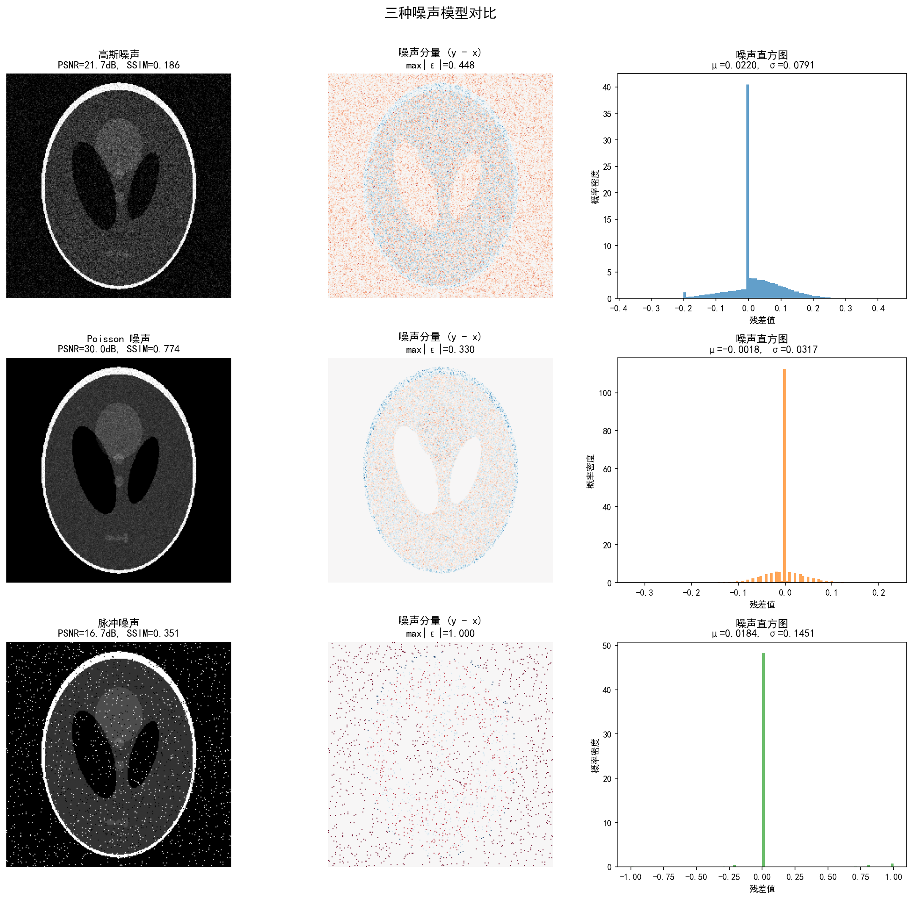
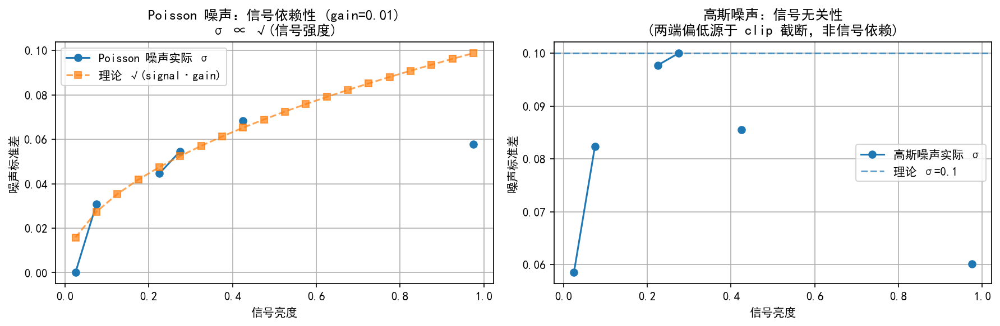

# 1.4 噪声建模与似然函数

## 从"直接求逆不行"到"观测还不精确"

1.3节揭示了逆问题的第一层困难——不适定性：即使观测数据 $y$ 完全精确地满足 $y = Ax$，直接求逆也可能不可靠。然而，现实中的观测从来都不精确。我们实际获得的不是 $y = Ax$，而是

$$y = Ax + \varepsilon$$

其中 $\varepsilon$ 是**噪声**——由探测器电子涨落、光子计数随机性、传输错误等物理过程引入的随机扰动。

噪声与不适定性的叠加使得逆问题雪上加霜：1.3节中我们已看到，伪逆 $A^\dagger$ 会将噪声分量 $\langle \mathbf{u}_i, \varepsilon\rangle$ 除以小奇异值 $\sigma_i$ 而急剧放大；现在，噪声为这些小奇异值方向提供了真实的非零分量，使得放大效应从"潜在威胁"变为"必然灾难"。

本节的核心任务是：**如何用概率论的语言精确描述噪声？** 这将引出似然函数——连接噪声模型与数据拟合项的数学纽带，也是贝叶斯框架（1.5节）的第一根支柱。

---

## 统一推导框架

不同成像系统的噪声机制不同，但推导似然函数的流程是统一的：

```
噪声物理机制 → 噪声分布 p(ε) → 似然函数 p(y|x) → 负对数似然 -ln p(y|x) → 数据项 D(y, Ax)
```

这个链条的逻辑是：
1. **噪声物理机制**决定了 $\varepsilon$ 服从什么概率分布
2. 由 $y = Ax + \varepsilon$ 的关系，$\varepsilon = y - Ax$ 的分布直接给出**似然函数** $p(y|x)$——在已知 $x$ 的条件下，观测到 $y$ 的概率
3. 取负对数后，概率的乘积变为求和，指数消失，得到简洁的**数据项** $D(y, Ax)$

关键洞察：**数据项的形式不是人为选择的，而是由物理噪声机制唯一决定的。** 选择 L2、L1 还是 KL 散度数据项，不是因为哪个"更好"，而是依赖于噪声是高斯的、Laplace（脉冲）的还是 Poisson 的。

---

## 高斯噪声 → L² 数据项

### 物理来源

高斯噪声是最常见的噪声模型，其物理来源包括：
- **电子学噪声**：探测器电路中的热噪声和散粒噪声，由大量独立随机事件的叠加产生（中心极限定理）
- **读出噪声**：CCD/CMOS 传感器的模数转换误差
- **热涨落**：红外成像中的暗电流噪声

### 噪声模型

设 $\varepsilon \sim \mathcal{N}(0, \sigma^2 I)$，即各像素独立同分布的零均值高斯噪声：

$$p(\varepsilon_i) = \frac{1}{\sqrt{2\pi}\sigma} \exp\!\Big(-\frac{\varepsilon_i^2}{2\sigma^2}\Big)$$

### 似然函数推导

由 $y = Ax + \varepsilon$，在 $x$ 给定的条件下，$y$ 的分布为 $y|x \sim \mathcal{N}(Ax, \sigma^2 I)$，因此似然函数为：

$$p(y|x) = \prod_{i=1}^{m} \frac{1}{\sqrt{2\pi}\sigma} \exp\!\Big(-\frac{(y_i - (Ax)_i)^2}{2\sigma^2}\Big) = \frac{1}{(2\pi\sigma^2)^{m/2}} \exp\!\Big(-\frac{\|y - Ax\|_2^2}{2\sigma^2}\Big)$$

### 负对数似然 → 数据项

取负对数（忽略与 $x$ 无关的常数）：

$$-\ln p(y|x) = \frac{1}{2\sigma^2} \|y - Ax\|_2^2 + \text{const}$$

**高斯噪声 → L² 数据项（最小二乘）**。这是最常用的数据项，几何含义是最小化观测与预测之间的欧氏距离。

### 特点与局限

- **优点**：数学性质良好（凸、可微），有闭式解（正规方程）
- **局限**：假设各像素噪声独立且方差相同（同方差性）。当存在离群值（outlier）时，L² 项对大残差过于敏感——一个异常大的偏差会被平方放大，主导整个目标函数

---

## Poisson 噪声 → KL 散度数据项

### 物理来源

Poisson 噪声源于**光子的离散性**：光子到达探测器是一个随机计数过程，每个像素记录的光子数服从 Poisson 分布。这是**信号依赖的噪声**——噪声方差等于信号均值。

典型场景：
- **低剂量 CT**：减少辐射剂量意味着更少的光子，Poisson 噪声更显著
- **天文成像**：遥远天体发出的光子数极少
- **荧光显微镜**：弱荧光信号的计数统计

### 噪声模型

设第 $i$ 个像素的真实光子数为 $(Ax)_i$，则观测值 $y_i$ 服从 Poisson 分布：

$$y_i | x \sim \mathrm{Poisson}\big((Ax)_i\big)$$

Poisson 分布的概率质量函数为：

$$p(y_i | (Ax)_i) = \frac{(Ax)_i^{y_i}}{y_i!} e^{-(Ax)_i}$$

Poisson 噪声的关键特性：**均值 = 方差**。当 $(Ax)_i$ 较大时，信噪比 $\mathrm{SNR} = (Ax)_i / \sqrt{(Ax)_i} = \sqrt{(Ax)_i}$ 较高；当 $(Ax)_i$ 较小时，信噪比急剧下降。这就是为什么低剂量 CT 的图像质量严重劣化——不是噪声的绝对量变大了，而是信噪比恶化了。

### 似然函数推导

假设各像素独立，似然函数为：

$$p(y|x) = \prod_{i=1}^{m} \frac{(Ax)_i^{y_i}}{y_i!} e^{-(Ax)_i}$$

### 负对数似然 → 数据项

取负对数：

$$-\ln p(y|x) = \sum_{i=1}^{m} \Big[(Ax)_i - y_i \ln(Ax)_i + \ln(y_i!)\Big]$$

忽略与 $x$ 无关的项 $\ln(y_i!)$，得到 **KL 散度数据项**：

$$D_{\mathrm{KL}}(y, Ax) = \sum_{i=1}^{m} \Big[(Ax)_i - y_i \ln(Ax)_i\Big]$$

这个名称来自信息论：KL 散度度量两个概率分布之间的"距离"。这里 $y$ 和 $Ax$ 可以视为两个（未归一化的）分布，数据项就是它们之间的 KL 散度。

### 为何不能用 L²？

一个自然的疑问：能否将 Poisson 噪声近似为高斯噪声，直接用 L² 数据项？

近似条件：当 $(Ax)_i$ 足够大时，$\mathrm{Poisson}((Ax)_i) \approx \mathcal{N}((Ax)_i, (Ax)_i)$。此时，L² 项变为加权最小二乘 $\sum_i (y_i - (Ax)_i)^2 / (Ax)_i$，权重为 $1/(Ax)_i$——对亮区降权、对暗区加权。

但这个近似在低计数区域（$(Ax)_i$ 接近零）失效：Poisson 分布高度偏斜，不再近似高斯；且 $(Ax)_i$ 趋零时分母也趋零，数值不稳定。因此，**低剂量成像场景必须使用 KL 散度数据项**。

---

## 脉冲噪声 → L¹ 数据项

### 物理来源

脉冲噪声（impulse noise），也称为椒盐噪声（salt-and-pepper noise），源于：
- **传输错误**：数据传输中个别像素值被错误地替换为最大值（盐）或最小值（胡椒）
- **探测器故障**：个别传感器单元失效，输出饱和或零值
- **恶劣光照**：长时间曝光中偶发的强干扰

与高斯噪声不同，脉冲噪声**只影响少部分像素**，但受影响的像素偏差极大。

### 噪声模型

脉冲噪声的数学描述：以概率 $p$，像素值被随机替换为最大值或最小值；以概率 $1-p$，像素值保持不变。更一般地，可以用 **Laplace 分布**来建模含脉冲噪声的残差：

$$\varepsilon_i \sim \mathrm{Laplace}(0, b)$$

Laplace 分布的概率密度为：

$$p(\varepsilon_i) = \frac{1}{2b} \exp\!\Big(-\frac{|\varepsilon_i|}{b}\Big)$$

与高斯分布的关键区别：Laplace 分布的尾部更"厚"——大偏差出现的概率远高于高斯分布，这正是脉冲噪声"偶尔出现巨大偏差"的特征。

### 似然函数推导

由 $y = Ax + \varepsilon$，$\varepsilon \sim \mathrm{Laplace}(0, bI)$：

$$p(y|x) = \prod_{i=1}^{m} \frac{1}{2b} \exp\!\Big(-\frac{|y_i - (Ax)_i|}{b}\Big) = \frac{1}{(2b)^m} \exp\!\Big(-\frac{\|y - Ax\|_1}{b}\Big)$$

### 负对数似然 → 数据项

$$-\ln p(y|x) = \frac{1}{b} \|y - Ax\|_1 + \text{const}$$

**脉冲/Laplace 噪声 → L¹ 数据项**。

### L¹ vs L²：鲁棒性的直觉

为什么 L¹ 对离群值更鲁棒？考虑一个简单的去噪问题（$A = I$）：

- **L² 目标**：$\min_x \|y - x\|_2^2 = \sum_i (y_i - x_i)^2$。单个大残差 $(y_k - x_k)^2$ 被平方放大，迫使 $x_k$ 向 $y_k$ 靠拢以减小总误差——离群值"绑架"了解。
- **L¹ 目标**：$\min_x \|y - x\|_1 = \sum_i |y_i - x_i|$。大残差 $|y_k - x_k|$ 只线性增长，不会主导总误差——算法可以"忽略"少数离群值。

这就是为什么**脉冲噪声场景必须使用 L¹ 数据项**：L² 会让少数被噪声污染的像素主导重建结果，而 L¹ 则对它们不敏感。

---

## 三种噪声→三种数据项：统一视角

将三种噪声模型的推导结果汇总：

**1. 高斯噪声**
- 噪声分布：$\varepsilon \sim \mathcal{N}(0, \sigma^2 I)$
- 似然函数：$p(y|x) \propto \exp\big(-\frac{\|y-Ax\|_2^2}{2\sigma^2}\big)$
- 数据项：$\frac{1}{2\sigma^2}\|y-Ax\|_2^2$
- 典型场景：电子学噪声、读出噪声

**2. Poisson噪声**
- 噪声分布：$y_i \sim \mathrm{Poisson}((Ax)_i)$
- 似然函数：$p(y|x) \propto \prod (Ax)_i^{y_i} e^{-(Ax)_i}$
- 数据项：$\sum\big[(Ax)_i - y_i\ln(Ax)_i\big]$（KL散度）
- 典型场景：低剂量CT、天文成像

**3. 脉冲噪声**
- 噪声分布：$\varepsilon \sim \mathrm{Laplace}(0, bI)$
- 似然函数：$p(y|x) \propto \exp\big(-\frac{\|y-Ax\|_1}{b}\big)$
- 数据项：$\frac{1}{b}\|y-Ax\|_1$
- 典型场景：传输错误、探测器故障

三种数据项来自三种物理噪声机制，推导流程完全统一。**数据项的选择不是任意的，而是由成像系统的物理特性决定的。** 如果错误地使用 L² 数据项处理 Poisson 噪声或脉冲噪声，重建质量会显著下降——不是因为算法不好，而是因为噪声模型不对。

### 一个深层统一：指数族

三种噪声模型都属于**指数族**（exponential family），可以统一表示为：

$$p(\varepsilon_i) \propto \exp\big(-\phi(\varepsilon_i)\big)$$

其中 $\phi$ 是某个凸函数：
- 高斯噪声：$\phi(t) = t^2 / (2\sigma^2)$（二次函数）
- Laplace 噪声：$\phi(t) = |t|/b$（绝对值函数）
- Poisson 噪声：$\phi(t) = t - y\ln t$（KL 散度型）

这种统一性意味着：无论噪声模型如何，负对数似然总是某个凸函数 $\phi$ 作用于残差 $y - Ax$——**数据项的本质是对残差的某种"惩罚"**，惩罚的形状由噪声的统计特性决定。

---

## 实验 1.4-1：三种噪声模型的直观对比

实验`1.4-1.py`通过在同一幅 Shepp-Logan 幻影图像上分别添加三种典型的噪声（高斯、Poisson、脉冲），直观对比不同噪声模型的视觉特征、统计特性和信号依赖性，帮助建立"噪声类型决定数据项形式"的直觉。

### 实验场景

使用 $256 \times 256$ 的 Shepp-Logan 幻影图像（含脑脊液/灰质/白质/颅骨等不同亮度区域），分别施加三种噪声并调节参数使 PSNR 大致相当，以便公平对比：

- **高斯噪声**（$\sigma = 0.1$）：信号无关，各像素独立同分布
- **Poisson 噪声**（增益 $= 0.01$）：信号依赖，方差 $\propto$ 信号强度
- **脉冲噪声**（椒盐噪声，$p = 0.05$）：仅影响少数像素但偏差极大

对每种噪声分别计算含噪图像的 PSNR 和 SSIM，绘制含噪图像、噪声残差图和噪声直方图。此外，通过分桶统计验证 Poisson 噪声的信号依赖性（$\sigma \propto \sqrt{\text{signal}}$）和高斯噪声的信号无关性。

> **前置知识提示**：本实验使用的图像质量度量 PSNR 和 SSIM 在附录 1A"图像质量度量"中有详细介绍。此处仅作为工具使用，核心目标是直观对比三种噪声的视觉与统计差异。

### 实验目的

1. **直观感受三种噪声的视觉差异**：高斯噪声均匀覆盖整幅图像；Poisson 噪声在亮区更剧烈、暗区更安静；脉冲噪声只在特定像素产生极端偏差
2. **理解噪声直方图与理论分布的关系**：直方图形状应与理论概率密度函数吻合，验证噪声建模的准确性
3. **理解 Poisson 噪声的信号依赖机制**：通过分桶统计验证 $\sigma_{\text{Poisson}} \propto \sqrt{x}$ 的关系，与高斯噪声的 $\sigma_{\text{Gaussian}} = \text{const}$ 形成鲜明对比
4. **建立"噪声类型 $\to$ 数据项"的桥梁**：为后续高斯$\to$L²、Poisson$\to$KL、脉冲$\to$L¹的推导提供直观基础

### 实验输入

| 参数 | 数值 |
|------|------|
| 图像 | $256 \times 256$ Shepp-Logan 幻影，归一化至 $[0, 1]$ |
| 高斯噪声 | $\sigma = 0.1$，加性白噪声 |
| Poisson 噪声 | $\text{gain} = 0.01$，采样后 $\times \text{gain}$ |
| 脉冲噪声 | 椒盐噪声，$p = 0.05$ |
| 分桶数 | $n_{\text{bins}} = 20$，用于验证信号依赖性 |
| 重建方法 | 无重建——直接对比含噪图像本身的统计特性 |

### 预期结果

实验将生成两张图，预期效果如下：

**图 1（三种噪声对比）—— $3 \times 3$ 布局**：

第一列（含噪图像）：
- 高斯噪声行：整幅图像均匀叠加颗粒感，各区域噪声强度相同
- Poisson 噪声行：亮区噪声明显更剧烈，暗区相对干净——直观体现信号依赖性
- 脉冲噪声行：少数像素被完全替换为纯白或纯黑，大多数像素保持原样

第二列（噪声残差 $y - x$）：
- 高斯噪声行：残差在全图均匀分布，无明显信号相关模式
- Poisson 噪声行：残差在亮区波动更大（标准差更大），暗区波动小
- 脉冲噪声行：残差仅在少数位置出现 $\pm 1$ 量级的尖峰，其余位置为零

第三列（噪声直方图）：
- 高斯噪声行：对称钟形曲线，近似理论正态分布 $N(0, \sigma^2)$
- Poisson 噪声行：右偏分布，在亮区信号依赖的方差差异导致略偏离纯 Poisson 形状
- 脉冲噪声行：直方图在零附近有尖锐主峰（未受影响像素），两侧各有一个小峰（受椒盐污染的像素）

**图 2（信号依赖性验证）—— $1 \times 2$ 布局**：

- 左图（Poisson）：实测 $\sigma$ 随信号强度增加而增大，与理论曲线 $\sigma = \sqrt{x \cdot \text{gain}}$ 基本吻合
- 右图（高斯）：实测 $\sigma$ 在各亮度段基本保持在 $\sigma = 0.1$ 附近，两端因 clip 操作略有偏低

### 实验结果

运行 `1.4-1.py` 后，生成两张图，展示了三种噪声的对比并验证了信号的依赖性特征。



#### 1. 三种噪声的视觉差异

三种噪声的视觉差异鲜明：
- **高斯噪声**均匀覆盖全图，PSNR 适中（21.71 dB），但 SSIM 较低（0.1856）。这是因为 SSIM 对结构保真度敏感，而高斯噪声虽然"均匀"，却破坏了亮度、对比度和结构三个维度的信息
- **Poisson 噪声**的 PSNR（29.98 dB）和 SSIM（0.7741）最高。这不意味着 Poisson 噪声"更弱"，而是因为它对暗区几乎无影响（保留了大量零附近的原始像素），而 SSIM 对低亮度区域的失真不敏感。高亮区结构也确实比高斯噪声保持得更好
- **脉冲噪声**的 PSNR（16.56 dB）最低，SSIM（0.3497）居中。5% 的椒盐像素虽然比例不大，但每个被污染的像素偏差极大，导致整体均方误差很大。SSIM 略高于高斯噪声，因为未受污染的像素完全保留了原始结构

三行噪声残差图也展示了关键区别：高斯噪声的残差在各处振幅均匀；Poisson 噪声的残差在亮区明显更大；脉冲噪声的残差在稀疏位置有极大值。这些残差图直接对应了三种噪声模型的数据项形式——L²（均匀惩罚）、KL（加权惩罚）、L¹（稀疏大偏差容忍）。

#### 2. 噪声直方图的细节

此外，噪声直方图验证了各噪声的统计特性，但也揭示了一些值得注意的细节：

- **高斯噪声**的直方图基本对称，但零附近有极高尖峰。这是因为 clip 操作将部分负残差截断到零（当 $x + \varepsilon < 0$ 时，残差从负值变为 $-x$），导致零处像素堆积。若不 clip，直方图将更接近理论正态分布。
- **Poisson 噪声**的直方图在零处有极高尖峰——这是因为 Shepp-Logan 幻影有近 60% 的像素位于暗区（亮度接近 0），而 Poisson(0) = 0 的概率为 1，导致这些像素的残差几乎全为零。右侧的长拖尾则来自亮区的信号依赖噪声。这是 Poisson 噪声信号依赖特性的直观体现。
- **脉冲噪声**的直方图在零处有极高尖峰（95% 未受影响像素），两侧小峰因比例太小（各约 1%）在线性刻度下几乎不可见。这是椒盐噪声的本质特征：绝大多数像素完好无损，仅有极少数像素被极端污染。

#### 3. 信号依赖性验证



左图验证了 Poisson 噪声的标准差随信号强度线性增长：$\sigma \propto \sqrt{x}$，这是信号依赖噪声的标志性特征。实测曲线与理论曲线 $\sigma = \sqrt{x \cdot 0.01}$ 吻合良好。高亮区（$x > 0.8$）的偏离源于 clip 截断——当 $x$ 接近 1 时，$\lambda = x/\text{gain} = 100$，大量样本被截断在 1 处。

右图对比了高斯噪声的标准差：实测 $\sigma$ 在各亮度段基本恒定为 0.1，体现了高斯噪声的信号无关性。两端小幅偏低同样源于 clip 截断——当 $x$ 接近边界时，$x + \varepsilon$ 被截断在 $[0, 1]$ 内，实际标准差下降。

这一结果对应了 1.4 节的核心结论：**噪声类型不同，其统计特性截然不同**，这正是为什么不同物理噪声对应不同形式的数据项。

---

## 似然的局限与先验的必要性

1.3节得出结论：不适定性意味着仅靠数据 $y$ 和算子 $A$ 无法可靠地恢复 $x$，我们需要额外信息。1.4节则给出了数据信息的精确数学表达——似然函数 $p(y|x)$。

但似然函数只告诉我们"数据说什么"，不能解决不适定性——它无法区分那些与数据同样兼容但视觉上毫无意义的解。我们需要另一条信息来约束被 $A$ 抹去的自由度，这就是**先验** $p(x)$，它编码了我们对图像的先验知识（平滑性、稀疏性、非负性等）。

将似然与先验结合，便得到贝叶斯框架的核心等式 $p(x|y) \propto p(y|x) \cdot p(x)$——下一节将正式建立这一框架，揭示"后验能量 = 数据项 + 正则项"的深刻对应，以及贝叶斯框架如何同时应对噪声与不适定性两个困难。
