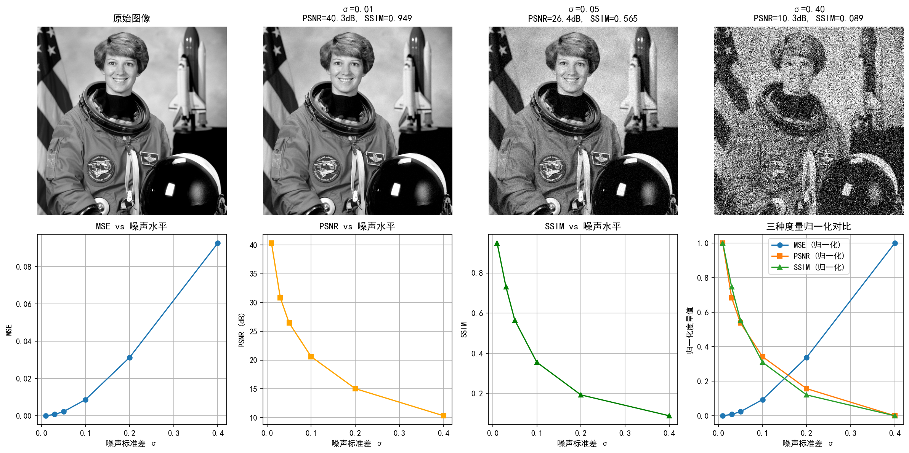

# 实验 1.1 数字图像读取、显示与质量评估

**对应章节**：附录 1A 图像质量度量
**核心知识点**：MSE、PSNR、SSIM 的定义与计算；不同度量对噪声的响应差异；度量的选择原则

---

## 一、实验目的

附录 1A 集中定义了 MSE、PSNR、SSIM 三种图像质量度量，指出它们各自的优缺点与适用场景。本实验的目标是：

1. **定量验证**三种度量随噪声水平变化的趋势，建立对数值范围的直观感受
2. **对比观察**三种度量在相同噪声序列下的响应差异——尤其是 PSNR 的"对数压缩"效应与 SSIM 的"结构敏感性"
3. **直观理解**附录 1A 的核心论点：**没有万能的度量**，度量的选择应与噪声模型和应用目标匹配

---

## 二、实验输入

- **原始图像**：`skimage.data.astronaut()` 的灰度版本（512×512，值域 [0, 1]）
- **噪声类型**：加性高斯白噪声 $\varepsilon \sim \mathcal{N}(0, \sigma^2 I)$
- **噪声水平**：$\sigma \in \{0.01, 0.03, 0.05, 0.10, 0.20, 0.40\}$，从几乎不可见到严重退化

对应 1.4 节的高斯噪声模型：含噪观测为 $y = x + \varepsilon$，此时似然函数为 $p(y|x) \propto \exp(-\|y-x\|_2^2 / 2\sigma^2)$，负对数似然即 L² 数据项。

---

## 三、预期结果

基于附录 1A 的理论分析，预期如下：

| 噪声标准差 $\sigma$ | MSE 趋势 | PSNR 趋势 | SSIM 趋势 |
|---|---|---|---|
| 0.01（极轻微） | ≈ $\sigma^2$ = 0.0001 | ≈ 40 dB | ≈ 0.95（结构基本完整） |
| 0.10（中等） | ≈ 0.01 | ≈ 20 dB | ≈ 0.3–0.5（结构受损明显） |
| 0.40（严重） | ≈ 0.16 | ≈ 8 dB | < 0.1（结构几乎完全丧失） |

具体预期：
- **MSE** 与 $\sigma^2$ 近似成正比（高斯噪声下 $\mathbb{E}[\text{MSE}] = \sigma^2$），单调递增
- **PSNR** 与 $\log_{10}(\sigma^2)$ 近似线性递减（因为 PSNR = $10\log_{10}(1/\text{MSE})$）
- **SSIM** 在低噪声时接近 1，噪声增大后快速下降，下降速率快于 PSNR 的恶化速度——这是因为 SSIM 衡量的是结构信息，而结构信息对噪声更敏感

---

## 四、实际运行结果

### 4.1 数值结果

程序输出如下：

| $\sigma$ | MSE | PSNR (dB) | SSIM |
|---|---|---|---|
| 0.01 | 0.000093 | 40.31 | 0.9486 |
| 0.03 | 0.000828 | 30.82 | 0.7303 |
| 0.05 | 0.002269 | 26.44 | 0.5645 |
| 0.10 | 0.008731 | 20.59 | 0.3552 |
| 0.20 | 0.031332 | 15.04 | 0.1926 |
| 0.40 | 0.092552 | 10.34 | 0.0890 |

### 4.2 可视化结果



图中：
- **第一行**：原始图像（左），以及 $\sigma=0.01$、$\sigma=0.05$、$\sigma=0.40$ 三种噪声水平下的含噪图像
- **第二行**：MSE、PSNR、SSIM 随噪声水平的变化曲线，以及三种度量的归一化对比

---

## 五、结果分析与补充说明

### 5.1 MSE 与噪声方差的关系

实验数据中 MSE 近似等于 $\sigma^2$，这与理论一致。对高斯噪声 $\varepsilon \sim \mathcal{N}(0, \sigma^2 I)$，有：

$$\mathbb{E}[\text{MSE}] = \mathbb{E}\left[\frac{1}{n}\|y - x\|_2^2\right] = \frac{1}{n}\mathbb{E}[\|\varepsilon\|_2^2] = \sigma^2$$

实际值（如 $\sigma=0.10$ 时 MSE=0.008731）与理论值（0.01）的差异来自随机种子的有限采样波动和像素值裁剪（`np.clip(y, 0, 1)` 将负值截断，使实际 MSE 略低于理论值）。

> **与正文联系**：MSE 本质上就是 L² 范数的平方除以像素数。1.4 节指出高斯噪声的负对数似然为 $\frac{1}{2\sigma^2}\|y-Ax\|_2^2$，其中 $\|y-Ax\|_2^2 / n$ 正是 MSE。因此，**最小化 MSE 等价于最大化高斯噪声下的似然函数**。

### 5.2 PSNR 的对数压缩效应

PSNR 从 40.31 dB（$\sigma=0.01$）下降到 10.34 dB（$\sigma=0.40$），跨越 30 dB。注意到：

- $\sigma$ 增大 40 倍（0.01→0.40），PSNR 下降约 30 dB
- 这符合 PSNR 的定义：$\text{PSNR} = 10\log_{10}(1/\text{MSE}) \approx -10\log_{10}(\sigma^2) = -20\log_{10}(\sigma)$

对数尺度使得 PSNR 对极端噪声水平的区分不如 MSE 直观，但在工程实践中，dB 单位更方便讨论——附录 1A 给出的经验阈值"PSNR > 30 dB 可接受"在实验中得到印证：$\sigma=0.03$ 时 PSNR=30.82 dB，视觉上可接受；$\sigma=0.10$ 时 PSNR=20.59 dB，已明显不可接受。

> **与正文联系**：附录 1A 指出 PSNR > 40 dB 意味着重建质量很高。实验中 $\sigma=0.01$ 时 PSNR=40.31 dB，此时 SSIM=0.9486，视觉上与原始图像几乎不可区分——二者一致。PSNR < 20 dB 则意味着重建质量极差，对应实验中 $\sigma \geq 0.10$ 的情况。

### 5.3 SSIM 的结构敏感性：比 PSNR 更快反映视觉退化

这是本实验最重要的观察。归一化对比曲线清楚地显示：

- 在 $\sigma$ 从 0.01 增加到 0.05 的过程中，**SSIM 从 0.95 急剧下降到 0.56**（下降 42%），而 **PSNR 仅从 40 dB 降到 26 dB**（在归一化尺度上下降约 64%）
- SSIM 的下降更"陡峭"——它在低噪声区间就已经快速响应，而 PSNR 的对数尺度使它在低噪声区间的变化被压缩

这与附录 1A 的论述完全一致：SSIM 考虑亮度、对比度和结构三方面信息，而噪声首先破坏的是**结构信息**（高频细节被掩盖），因此 SSIM 对轻度噪声就已有明显反应。MSE/PSNR 只衡量逐像素误差，不区分"噪声均匀分布"还是"结构被破坏"。

> **与正文联系**：附录 1A 指出"相同的 MSE 值可能对应视觉质量截然不同的图像"。虽然本实验只使用了高斯噪声（MSE 与视觉退化基本单调对应），但 SSIM 的更快下降已经暗示了这一点：当不同的退化方式产生相同 MSE 时，SSIM 能更好地反映视觉差异。实验 1.9 将专门对比三种噪声在相同 PSNR 下的视觉差异，届时这一点将更加明显。

### 5.4 三种度量的选择原则

结合实验数据和附录 1A 的理论，总结如下：

| 度量 | 本实验表现 | 适用场景 | 局限 |
|---|---|---|---|
| MSE | 与 $\sigma^2$ 精确对应，数学性质好 | 高斯噪声下的优化目标；理论分析 | 不反映视觉感知质量 |
| PSNR | 对数尺度便于工程讨论 | 算法比较的标准报告指标 | 继承 MSE 的所有局限 |
| SSIM | 更早反映视觉退化 | 评估重建的视觉质量 | 计算成本更高；对某些失真仍不完美 |

附录 1A 的核心建议"**不要只看一个数字**"在实验中得到验证：对于 $\sigma=0.05$，PSNR=26.44 dB 看起来"尚可"，但 SSIM=0.5645 已经表明结构信息严重受损。单一度量容易产生误判，同时报告 PSNR 和 SSIM 才能获得更全面的评估。

> **与正文联系**：附录 1A 还指出"度量的选择应与噪声模型一致"——MSE/PSNR 本质上是 L² 度量，适合高斯噪声场景（对应 1.4 节的 L² 数据项）。对于 Poisson 噪声，更合适的度量是 KL 散度；对于脉冲噪声，L¹ 度量更合理。这一原则将在实验 1.3（噪声建模）和实验 1.9（三种噪声对比）中进一步验证。

---

## 六、源代码

```python
import numpy as np
import matplotlib.pyplot as plt
from skimage.data import astronaut, shepp_logan_phantom
from skimage.color import rgb2gray
from skimage.transform import resize
from skimage.metrics import (
    mean_squared_error,
    peak_signal_noise_ratio,
    structural_similarity,
)
from skimage.util import random_noise
np.random.seed(42)
# ====== 解决中文乱码的核心代码（必须加在画图之前） ======
plt.rcParams['font.sans-serif'] = ['SimHei']  # 强制使用黑体 显示中文
plt.rcParams['axes.unicode_minus'] = False    # 解决坐标轴负号显示问题
# ========================================================


# ---- 1. 加载并预处理图像 ----
x_color = astronaut()
x = rgb2gray(x_color)  # 转为灰度，值域 [0, 1]

# ---- 2. 添加不同水平的高斯噪声 ----
noise_levels = [0.01, 0.03, 0.05, 0.10, 0.20, 0.40]
noisy_images = []
for sigma in noise_levels:
    y = x + sigma * np.random.randn(*x.shape)
    y = np.clip(y, 0, 1)
    noisy_images.append(y)

# ---- 3. 计算三种质量度量 ----
mse_vals, psnr_vals, ssim_vals = [], [], []
for y in noisy_images:
    mse_vals.append(mean_squared_error(x, y))
    psnr_vals.append(peak_signal_noise_ratio(x, y))
    ssim_vals.append(structural_similarity(x, y, data_range=1.0))

# ---- 4. 可视化 ----
fig, axes = plt.subplots(2, 4, figsize=(16, 8))

# 第一行：原始图像 + 3 个噪声示例
axes[0, 0].imshow(x, cmap='gray', vmin=0, vmax=1)
axes[0, 0].set_title('原始图像')
axes[0, 0].axis('off')

for i, idx in enumerate([0, 2, 5]):
    axes[0, i + 1].imshow(noisy_images[idx], cmap='gray', vmin=0, vmax=1)
    axes[0, i + 1].set_title(f'σ={noise_levels[idx]:.2f}\nPSNR={psnr_vals[idx]:.1f}dB, SSIM={ssim_vals[idx]:.3f}')
    axes[0, i + 1].axis('off')

# 第二行：度量随噪声水平的变化曲线

axes[1, 0].plot(noise_levels, mse_vals, 'o-')
axes[1, 0].set_xlabel('噪声标准差 σ')
axes[1, 0].set_ylabel('MSE')
axes[1, 0].set_title('MSE vs 噪声水平')
axes[1, 0].grid(True)

axes[1, 1].plot(noise_levels, psnr_vals, 's-', color='orange')
axes[1, 1].set_xlabel('噪声标准差 σ')
axes[1, 1].set_ylabel('PSNR (dB)')
axes[1, 1].set_title('PSNR vs 噪声水平')
axes[1, 1].grid(True)

axes[1, 2].plot(noise_levels, ssim_vals, '^-', color='green')
axes[1, 2].set_xlabel('噪声标准差 σ')
axes[1, 2].set_ylabel('SSIM')
axes[1, 2].set_title('SSIM vs 噪声水平')
axes[1, 2].grid(True)

# 对比三种度量的归一化趋势
mse_norm = (np.array(mse_vals) - min(mse_vals)) / (max(mse_vals) - min(mse_vals) + 1e-10)
psnr_norm = (np.array(psnr_vals) - min(psnr_vals)) / (max(psnr_vals) - min(psnr_vals) + 1e-10)
ssim_norm = (np.array(ssim_vals) - min(ssim_vals)) / (max(ssim_vals) - min(ssim_vals) + 1e-10)
axes[1, 3].plot(noise_levels, mse_norm, 'o-', label='MSE (归一化)')
axes[1, 3].plot(noise_levels, psnr_norm, 's-', label='PSNR (归一化)')
axes[1, 3].plot(noise_levels, ssim_norm, '^-', label='SSIM (归一化)')
axes[1, 3].set_xlabel('噪声标准差 σ')
axes[1, 3].set_ylabel('归一化度量值')
axes[1, 3].set_title('三种度量归一化对比')
axes[1, 3].legend()
axes[1, 3].grid(True)

plt.tight_layout()
plt.savefig('实验1_1_质量评估.png', dpi=150, bbox_inches='tight')
plt.show()

# ---- 5. 打印数值结果 ----
print(f"{'σ':>6s}  {'MSE':>10s}  {'PSNR(dB)':>10s}  {'SSIM':>8s}")
print("-" * 42)
for i, sigma in enumerate(noise_levels):
    print(f"{sigma:6.2f}  {mse_vals[i]:10.6f}  {psnr_vals[i]:10.2f}  {ssim_vals[i]:8.4f}")
```
