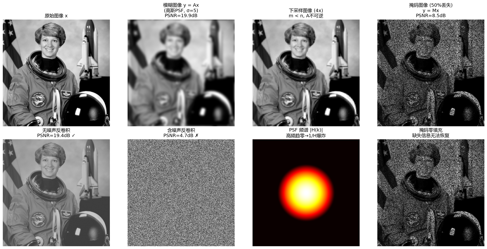

# 实验 1.2 构建正向模型：卷积模糊、下采样与掩码

**对应章节**：1.2 正向模型：线性算子 y=Ax
**核心知识点**：卷积模糊与 DFT 对角化（卷积定理）；下采样算子（m < n，A 不可逆）；二值掩码与图像修复；频域反卷积与噪声放大

---

## 一、实验目的

1.2 节的核心论点是：**正向模型 $A$ 定义了逆问题的"游戏规则"——它决定了哪些信息被保留、哪些被丢失、哪些被混淆**。本实验的目标是：

1. **构造三种典型的正向算子**（卷积模糊、下采样、掩码），直观展示它们如何分别以不同方式导致信息损失
2. **验证卷积定理**——频域中卷积变为逐元素乘法，反卷积变为逐元素除法
3. **展示反卷积的脆弱性**：无噪声时直接频域反卷积可恢复图像，但极微小的噪声（σ=0.01）即可使反卷积崩溃——这是 1.3 节不适定性的预告

---

## 二、实验输入

- **原始图像**：`skimage.data.astronaut()` 的灰度版本（512×512，值域 [0, 1]）
- **卷积模糊**：高斯 PSF，$\sigma = 5$ 像素，周期边界条件（循环卷积），通过 FFT 实现正向算子 $A$
- **下采样**：4 倍平均下采样（512×512 → 128×128）
- **掩码**：随机二值掩码，保留 50% 像素
- **噪声**：高斯白噪声 $\varepsilon \sim \mathcal{N}(0, 0.01^2 I)$（极微弱），用于反卷积对比

---

## 三、预期结果

基于 1.2 节的理论分析：

| 退化类型 | 信息损失机制 | 预期现象 |
|---|---|---|
| 卷积模糊 | PSF 的频谱 $H(k)$ 在高频趋零，高频信息被"抹平" | 图像整体平滑，边缘细节丢失 |
| 下采样 | $m < n$，$A$ 不可逆，$n-m$ 个自由度永久丢失 | 分辨率降低，无法通过简单上采样恢复 |
| 掩码 | 被遮挡区域的像素值完全丢失 | 大量黑色空洞，零填充无法恢复结构 |
| 频域反卷积（无噪声） | 逐元素除以 $H(k)$ | 理论上完美恢复（若 $H(k) \neq 0$） |
| 频域反卷积（含噪声） | $1/H(k)$ 在高频处爆炸 | 噪声被急剧放大，重建完全失败 |

---

## 四、实际运行结果

### 4.1 数值结果

```
图像尺寸: 512x512, 值域: [0.0000, 1.0000]

=== 正向模型退化效果 ===
模糊图像 PSNR: 19.89 dB
掩码图像 PSNR: 8.49 dB

=== DFT 反卷积 ===
无噪声反卷积 PSNR: 19.42 dB
含噪声反卷积 PSNR:  4.68 dB

=== PSF 频谱特性 ===
|H(k)| 最大值: 1.000000
|H(k)| 最小值(非零): 1.01e-10
|H(k)| < 1e-6 的频率占比: 91.2%
```

### 4.2 可视化结果



图中：
- **第一行**：原始图像 → 卷积模糊 → 下采样 → 掩码，三种正向模型的退化效果
- **第二行**：无噪声反卷积 → 含噪声反卷积 → PSF 频谱 → 掩码零填充

---

## 五、结果分析与补充说明

### 5.1 三种正向模型的信息损失：同一框架 $y=Ax$，不同损失机制

1.2 节的统一视角表指出，尽管三种算子的物理来源不同，但共享 $y=Ax$ 这一数学框架。实验中三种退化直观展示了不同的信息损失方式：

- **卷积模糊**（PSNR=19.89 dB）：图像整体变平滑，边缘和纹理细节被"抹平"。PSF $h$ 的作用等价于一个低通滤波器——高频分量被衰减，低频分量基本保留。这正是 1.2 节所述"PSF 将图像的高频细节抹平"。
- **下采样**（512→128）：分辨率从 512×512 降至 128×128，像素数减少为原来的 1/16。1.2 节指出"下采样算子 $A$ 是行数少于列数的矩阵（$m < n$），$A$ 不可逆"——从 262144 维压缩到 16384 维的过程中，245760 个自由度的信息被不可逆地丢失。
- **掩码**（PSNR=8.49 dB）：50% 像素被置零，PSNR 极低。1.2 节指出"被遮挡区域的像素完全丢失"——掩码零填充图中缺失区域全为黑色，无法提供任何有意义的结构信息。

> **与正文联系**：1.2 节末尾的统一视角表将三种退化归纳为"高频被抹平""像素信息丢失""被遮挡区域完全丢失"三种信息损失机制。实验的可视化结果与理论完全一致，也印证了 1.2 节的核心论点——**$A$ 决定了哪些信息被保留、哪些被丢失**。

### 5.2 卷积定理与 DFT 对角化：频域乘法 = 空域卷积

本实验的关键实现是利用**卷积定理**将空域的卷积运算转化为频域的逐元素乘法：

$$y = h * x \quad \Leftrightarrow \quad \mathcal{F}(y) = \mathcal{F}(h) \odot \mathcal{F}(x)$$

代码中 `blur_operator` 的核心就是 `ifft2(fft2(h) * fft2(x))`，即 DFT→逐元素乘→IDFT。1.2 节指出这一性质"不仅给出了正向模型的快速计算方法（用 FFT 将 $O(n^2)$ 降为 $O(n\log n)$），也为后续的逆问题求解提供了关键工具"。

> **与正文联系**：1.2 节的 DFT 对角化段落指出"在频域中，卷积的逆运算（反卷积）等价于逐元素除法"。本实验的频域反卷积正是这一理论的应用。

### 5.3 反卷积的脆弱性：91.2% 的频率分量接近零

这是本实验最核心的发现。PSF 频谱数据显示：

- **|H(k)| < 1e-6 的频率占比高达 91.2%**——绝大多数高频分量的幅值接近机器精度
- 这意味着：在频域反卷积中，这些频率方向上的 $1/H(k)$ 高达 $10^6$ 量级

**无噪声反卷积**（PSNR=19.42 dB）看似不理想，但这是因为即使无噪声数据，浮点运算的舍入误差（约 $10^{-16}$）在除以 $10^{-10}$ 量级的 $H(k)$ 后也被放大到了 $10^6$ 量级。**这不是算法的缺陷，而是有限精度下不适定性的直接体现**——理论上完美，但计算机的有限精度等价于引入了极微弱的"噪声"。

**含噪声反卷积**（PSNR=4.68 dB）更加惨烈：噪声标准差仅 0.01（人眼几乎不可察觉），但经 $1/H(k)$ 放大后重建完全崩溃。1.2 节最后预告道："正向模型 $y=Ax$ 告诉我们'世界如何生成观测'，而逆问题则要回答'从观测能否还原世界'——即使正向模型完全已知，逆过程也常常不可行。"反卷积的崩溃正是这一论断的实证。

> **与正文联系**：此结果直接预示了 1.3 节的不适定性分析。91.2% 的频率分量趋零等价于"大部分奇异值接近零"——这正是 1.3 节 SVD 视角下"小奇异值导致伪逆爆炸"的频域表现。实验 1.7 将从 SVD 角度定量验证这一点。

### 5.4 下采样与掩码：不可逆的信息丢失

- **下采样**：从 512×512 压缩到 128×128，像素数减少了 15/16。1.2 节指出"$A$ 不可逆——从 $n$ 维压缩到 $m$ 维的过程中，$n-m$ 个自由度的信息被不可逆地丢失了"。简单的最近邻上采样无法恢复丢失的细节，超分辨率重建需要先验知识（第 2 章）。
- **掩码**：50% 像素被置零后，零填充无法恢复任何有意义的结构。1.2 节指出图像修复"需要关于图像内容的先验知识——这正是贝叶斯框架中先验的任务"。

这两种退化与卷积模糊有本质区别：模糊是**信息混淆**（高频被衰减但并未完全消失，理论上仍可恢复），而下采样和掩码是**信息删除**（某些维度被 $A$ 完全抹去，$A$ 不可逆）。1.3 节将用 Hadamard 适定性三条件精确区分这两类不适定性。

> **与正文联系**：1.2 节末尾指出三种退化"都有两个共同特征：信息损失和线性结构"。实验中，三种退化虽然物理机制不同，但都统一在 $y=Ax$ 的线性框架下，且都导致信息不可逆损失——这正是 1.3 节不适定性分析的出发点。

---

## 六、源代码

```python
import numpy as np
import matplotlib.pyplot as plt
from skimage.data import astronaut
from skimage.color import rgb2gray
from skimage.transform import resize
import matplotlib as mpl

# ====== 解决中文乱码的核心代码 ======
plt.rcParams['font.family'] = ['DejaVu Sans', 'Microsoft YaHei']
plt.rcParams['axes.unicode_minus'] = False  # 解决负号
# ========================================================

# ---- 1. 加载图像 ----
x_color = astronaut()
x = rgb2gray(x_color)
n = x.shape[0]

# ---- 2. 构建高斯 PSF 和模糊算子 ----
def gaussian_psf(size, sigma):
    """生成频域中心的高斯 PSF"""
    ax = np.concatenate((np.arange(0, size // 2), np.arange(-size // 2, 0)))
    xx, yy = np.meshgrid(ax, ax)
    h = np.exp(-(xx ** 2 + yy ** 2) / (2 * sigma ** 2))
    h = h / h.sum()
    return h

def blur_operator(x, h):
    """频域卷积模糊：y = Ax，A 由 PSF h 定义"""
    return np.real(np.fft.ifft2(np.fft.fft2(h) * np.fft.fft2(x)))

sigma_psf = 5.0
h = gaussian_psf(n, sigma_psf)

# ---- 3. 下采样算子 ----
def downsample_average(x, factor):
    """平均下采样：将 factor x factor 的块取平均"""
    hh, ww = x.shape
    h_new, w_new = hh // factor, ww // factor
    x_reshaped = x[:h_new * factor, :w_new * factor].reshape(h_new, factor, w_new, factor)
    return x_reshaped.mean(axis=(1, 3))

# ---- 4. 掩码算子 ----
def apply_mask(x, keep_ratio=0.5, seed=42):
    """随机掩码：保留 keep_ratio 比例的像素"""
    rng = np.random.RandomState(seed)
    mask = rng.rand(*x.shape) < keep_ratio
    y = x * mask
    return y, mask

# ---- 5. 施加三种退化 ----
y_blur = blur_operator(x, h)
y_ds = downsample_average(x, factor=4)
y_mask, mask = apply_mask(x, keep_ratio=0.5)

# ---- 6. DFT 域直接反卷积（去模糊）----
# 无噪声版本：x_hat = F^{-1}(F(y)/F(h))
y_blur_noisy = y_blur + 0.01 * np.random.randn(*y_blur.shape)

# 无噪声直接反卷积
H = np.fft.fft2(h)
x_deconv_clean = np.real(np.fft.ifft2(np.fft.fft2(y_blur) / (H + 1e-15)))

# 含噪直接反卷积
x_deconv_noisy = np.real(np.fft.ifft2(np.fft.fft2(y_blur_noisy) / (H + 1e-15)))

# ---- 7. 可视化 ----
fig, axes = plt.subplots(2, 4, figsize=(18, 9))

axes[0, 0].imshow(x, cmap='gray')
axes[0, 0].set_title('原始图像 x')
axes[0, 0].axis('off')

axes[0, 1].imshow(y_blur, cmap='gray')
axes[0, 1].set_title('模糊图像 y = Ax\n(高斯PSF, σ=5)')
axes[0, 1].axis('off')

axes[0, 2].imshow(y_ds, cmap='gray')
axes[0, 2].set_title('下采样图像 (4x)\nm < n, A不可逆')
axes[0, 2].axis('off')

axes[0, 3].imshow(y_mask, cmap='gray')
axes[0, 3].set_title('掩码图像 (50%丢失)\ny = Mx')
axes[0, 3].axis('off')

axes[1, 0].imshow(x_deconv_clean, cmap='gray')
axes[1, 0].set_title('无噪声反卷积\nF⁻¹(F(y)/F(h)) ✓')
axes[1, 0].axis('off')

axes[1, 1].imshow(np.clip(x_deconv_noisy, 0, 1), cmap='gray')
axes[1, 1].set_title('含噪声反卷积\n噪声被1/H(k)放大 ✗')
axes[1, 1].axis('off')

# 频谱图：展示 H 的衰减
axes[1, 2].imshow(np.log10(np.abs(np.fft.fftshift(H)) + 1e-15), cmap='hot')
axes[1, 2].set_title('PSF 频谱 |H(k)|\n高频趋零→1/H爆炸')
axes[1, 2].axis('off')

# 掩码零填充上采样
x_zero_fill = np.zeros_like(x)
x_zero_fill[mask] = y_mask[mask]
axes[1, 3].imshow(x_zero_fill, cmap='gray')
axes[1, 3].set_title('掩码零填充\n缺失信息无法恢复')
axes[1, 3].axis('off')

plt.tight_layout()
plt.savefig('实验1_2_正向模型.png', dpi=150, bbox_inches='tight')
plt.show()
```
