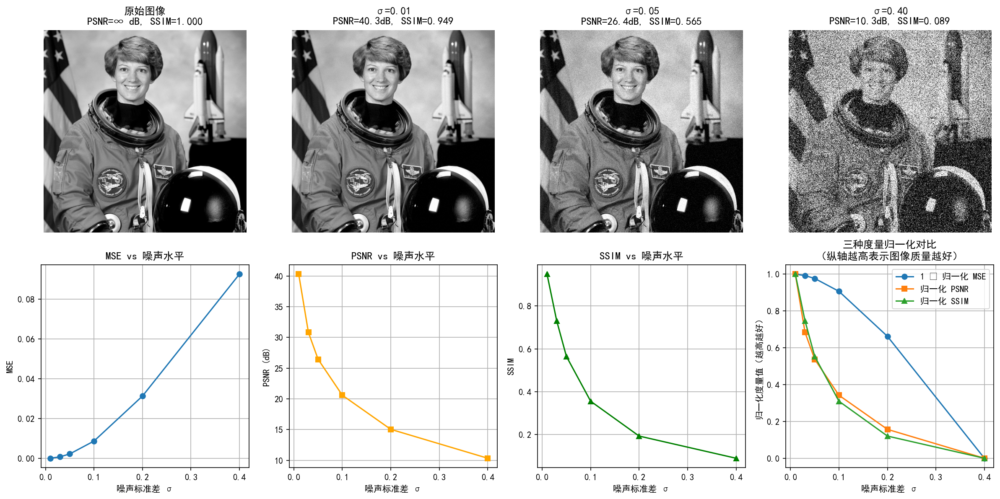

# 附录 1A 图像质量度量

> **定位**：本附录为后续章节提供评价工具箱，不参与第1章的主线叙事。MSE、PSNR、SSIM 等度量将在全书的实验和算法评估中反复使用，此处集中定义以供查阅。

---

## 为什么需要图像质量度量？

求解逆问题的目标是重建出尽可能接近真实图像 $\mathbf{x}$ 的估计 $\hat{\mathbf{x}}$。但"接近"意味着什么？我们需要定量的度量来回答这个问题。

图像质量度量的选择直接影响我们对算法性能的评判。一个好的度量应该与人眼感知一致——但这一要求比看起来困难得多。

所有本附录讨论的度量都是**有参考的**（supervised），即需要真实图像 $\mathbf{x}$ 作为参照。无参考度量（如 NIQE、BRISQUE）超出了本书的范围。

---

## MSE：均方误差

### 定义

设真实图像为 $\mathbf{x} \in \mathbb{R}^{n_1 \times n_2}$，重建图像为 $\hat{\mathbf{x}} \in \mathbb{R}^{n_1 \times n_2}$，**均方误差**（Mean Squared Error）定义为：

$$\text{MSE}(\hat{\mathbf{x}}, \mathbf{x}) = \frac{1}{n_1 n_2} \sum_{i=1}^{n_1} \sum_{j=1}^{n_2} |\hat{x}_{ij} - x_{ij}|^2$$

等价地，将图像向量化后可以写成：

$$\text{MSE}(\hat{\mathbf{x}}, \mathbf{x}) = \frac{1}{n} \|\hat{\mathbf{x}} - \mathbf{x}\|_2^2$$

其中 $n = n_1 n_2$ 是像素总数。

### 特点

- **范围**：$[0, \text{MAX}^2]$，其中 MAX 是像素值的最大值（如 8 位图像中 MAX = 255）
- **理想值**：0（完全一致）
- **方向**：越小越好

### 局限

MSE 对每个像素一视同仁——逐像素计算平方误差后取平均。这意味着：

1. **感知不一致**：相同的 MSE 值可能对应视觉质量截然不同的图像。例如，全局轻微的亮度偏移和局部强烈的结构扭曲可能产生相同的 MSE，但后者在视觉上远比前者难以接受。
2. **对空间结构不敏感**：MSE 不考虑像素之间的空间关系——打乱像素顺序不改变 MSE，但图像已面目全非。
3. **对离群值敏感**：由于平方运算，少数偏差极大的像素会不成比例地拉高 MSE。

尽管如此，MSE 仍然是图像质量度量的基石——它数学性质良好（凸、可微），是优化算法中最常用的损失函数，也在贝叶斯框架中与高斯噪声似然函数直接对应（1.4节）。

---

## PSNR：峰值信噪比

### 定义

**峰值信噪比**（Peak Signal-to-Noise Ratio）定义为：

$$\text{PSNR}(\hat{\mathbf{x}}, \mathbf{x}) = 10 \cdot \log_{10} \frac{\text{MAX}^2}{\text{MSE}(\hat{\mathbf{x}}, \mathbf{x})}$$

其中 MAX 是像素值的最大可能值（如 8 位图像中 MAX = 255，归一化图像中 MAX = 1）。

### 特点

- **范围**：$(-\infty, +\infty)$，单位为分贝（dB）
- **理想值**：$+\infty$（即 MSE = 0）
- **方向**：越大越好
- **经验判断**：PSNR > 30 dB 通常意味着视觉质量可接受；PSNR > 40 dB 则重建质量很高

### 与 SNR 的关系

**信噪比**（Signal-to-Noise Ratio）定义为：

$$\text{SNR}(\hat{\mathbf{x}}, \mathbf{x}) = 10 \cdot \log_{10} \frac{\|\mathbf{x}\|_2^2}{\|\hat{\mathbf{x}} - \mathbf{x}\|_2^2}$$

PSNR 与 SNR 的区别在于：SNR 的分子是信号能量 $\|\mathbf{x}\|_2^2$，PSNR 的分子是峰值 $\text{MAX}^2$。这意味着 PSNR 不依赖于具体图像的内容，只取决于像素值的动态范围——这使得不同图像之间的 PSNR 具有可比性，而 SNR 则不具备。

### 局限

PSNR 本质上只是 MSE 的对数换底，因此继承了 MSE 的所有局限——它仍然是逐像素度量，不考虑空间结构和人眼感知。

---

## SSIM：结构相似性指数

### 动机

MSE 和 PSNR 的根本问题在于：它们只衡量像素值之间的数值差异，而忽略了图像的**结构信息**——亮度、对比度、纹理等对视觉感知至关重要的特征。Wang 等人（2004）提出的**结构相似性指数**（Structural Similarity Index）试图弥补这一缺陷。

### 定义

SSIM 从三个维度比较两幅图像：

1. **亮度**（luminance）：比较均值 $\mu_{\hat{\mathbf{x}}}$ 与 $\mu_{\mathbf{x}}$
2. **对比度**（contrast）：比较标准差 $\sigma_{\hat{\mathbf{x}}}$ 与 $\sigma_{\mathbf{x}}$
3. **结构**（structure）：比较归一化后的协方差 $\sigma_{\hat{\mathbf{x}}\mathbf{x}}$

对于图像中的局部窗口（典型大小 $11 \times 11$），SSIM 定义为：

$$\text{SSIM}(\hat{\mathbf{x}}, \mathbf{x}) = \frac{(2\mu_{\hat{\mathbf{x}}}\mu_{\mathbf{x}} + C_1)(2\sigma_{\hat{\mathbf{x}}\mathbf{x}} + C_2)}{(\mu_{\hat{\mathbf{x}}}^2 + \mu_{\mathbf{x}}^2 + C_1)(\sigma_{\hat{\mathbf{x}}}^2 + \sigma_{\mathbf{x}}^2 + C_2)}$$

其中：
- $\mu_{\hat{\mathbf{x}}}$、$\mu_{\mathbf{x}}$ 是局部均值
- $\sigma_{\hat{\mathbf{x}}}^2$、$\sigma_{\mathbf{x}}^2$ 是局部方差
- $\sigma_{\hat{\mathbf{x}}\mathbf{x}}$ 是局部协方差
- $C_1 = (K_1 \cdot \text{MAX})^2$、$C_2 = (K_2 \cdot \text{MAX})^2$ 是稳定常数（防止分母为零），通常取 $K_1 = 0.01$、$K_2 = 0.03$

整幅图像的 SSIM 是所有局部窗口 SSIM 的均值（Mean SSIM, MSSIM）。

### 特点

- **范围**：$[0, 1]$（对于非负图像）
- **理想值**：1（完全一致）
- **方向**：越大越好
- **经验判断**：SSIM > 0.9 通常意味着视觉质量很高

### 优势

SSIM 比 MSE/PSNR 更符合人眼感知，原因在于：

1. **分离亮度与结构**：SSIM 独立评估亮度和结构信息，而非将它们混淆在单一数值中
2. **局部计算**：在局部窗口上计算后再取平均，自然引入了对空间结构的考量
3. **对几何变换更鲁棒**：适度的对比度变化不会导致 SSIM 崩溃，而 MSE 会

### 局限

- **仍非完美**：SSIM 对某些视觉失真（如模糊、压缩伪影）的敏感度仍与人眼判断有差距
- **计算成本更高**：局部窗口的逐像素滑动计算比 MSE/PSNR 的全局计算更耗时
- **参数敏感**：窗口大小和 $C_1, C_2$ 的选择会影响结果

---

## 实验 1A-1：三种质量度量的对比——噪声如何侵蚀图像

理论定义之后，一个自然的问题是：**这些度量在实际图像上如何表现？它们对噪声的敏感度是否一致？** 实验 `1.a-1.py` 通过在 astronaut 图像上添加不同水平的高斯噪声，直观对比 MSE、PSNR 和 SSIM 的变化规律。

### 实验场景

使用 $512 \times 512$ 的 astronaut 灰度图像作为参考图像 $\mathbf{x}$，对其添加 6 种不同强度的高斯噪声（$\sigma \in \{0.01, 0.03, 0.05, 0.10, 0.20, 0.40\}$），得到含噪图像 $y_\sigma$。对每个含噪图像计算 MSE、PSNR 和 SSIM，观察三种度量随噪声水平的退化趋势。

### 实验目的

1. **直观理解三种度量的数值范围**：从"近乎无损"（$\sigma=0.01$）到"完全失真"（$\sigma=0.40$），观察度量值如何反映图像质量
2. **对比度量的灵敏度差异**：PSNR 与 SSIM 随噪声增大呈现出不同的衰减模式——PSNR 是平滑的对数衰减，SSIM 在低噪声区迅速下降
3. **量化评估"可接受"阈值**：验证教材中给出的经验判断——PSNR > 30 dB、SSIM > 0.9 对应怎样的视觉质量
4. **理解归一化对比的意义**：将三个量纲不同的度量映射到同一尺度，揭示它们随噪声退化的相对速度差异

### 实验结果

**第一行**展示了原始图像与三个典型噪声水平下的视觉效果：

- **原始图像**：MSE = 0，PSNR 趋于无穷大，SSIM = 1.000，代表"完美"的参考标准
- **$\sigma = 0.01$（PSNR = 40.31 dB, SSIM = 0.9486）**：肉眼几乎不可察觉的噪声，PSNR > 40 dB、SSIM > 0.9——属于"高质量"范围
- **$\sigma = 0.05$（PSNR = 26.44 dB, SSIM = 0.5645）**：噪声肉眼清晰可见，图像细节开始模糊。PSNR 已低于 30 dB 的"可接受"线，SSIM 已降至 0.56
- **$\sigma = 0.40$（PSNR = 10.34 dB, SSIM = 0.0890）**：图像几乎被噪声完全淹没，仅能辨认出大致轮廓。SSIM 趋近于 0，标志着结构信息的彻底丧失

**第二行**展示了三种度量随噪声水平的定量变化：

| 噪声 $\sigma$ | MSE | PSNR (dB) | SSIM |
|:-------------:|:---:|:---------:|:----:|
| 0.01 | 0.000093 | 40.31 | 0.9486 |
| 0.03 | 0.000828 | 30.82 | 0.7303 |
| 0.05 | 0.002269 | 26.44 | 0.5645 |
| 0.10 | 0.008731 | 20.59 | 0.3552 |
| 0.20 | 0.031332 | 15.04 | 0.1926 |
| 0.40 | 0.092552 | 10.34 | 0.0890 |

### 关键观察

1. **PSNR 与 SSIM 的灵敏度差异**：当 $\sigma$ 从 0.01 增至 0.03（微弱的噪声增幅），PSNR 从 40.31 dB 降至 30.82 dB（降幅约 9.5 dB），而 SSIM 从 0.9486 降至 0.7303（降幅约 23%）。SSIM 的相对变化更为剧烈，说明它对低噪声水平的结构破坏更加敏感——这与 SSIM 的设计目标一致：它关注的是对视觉感知重要的结构信息，而非逐像素的数值差异。

2. **经验阈值的验证**：$\sigma = 0.01$ 时 PSNR > 40 dB、SSIM > 0.9，视觉上几乎无噪声——这与"PSNR > 40 dB 质量较高"和"SSIM > 0.9 视觉质量很高"的经验判断吻合。$\sigma = 0.03$ 时 PSNR ≈ 30.8 dB 处于可接受边缘，肉眼可感知轻微噪声。$\sigma = 0.05$ 时 PSNR 已低于 30 dB、SSIM 低于 0.6，噪声明显。

3. **PSNR 的对数特性**：MSE 从 0.000093 增长到 0.092552（约 1000 倍），PSNR 仅从 40.31 dB 下降到 10.34 dB（约 4 倍）。这种对数压缩使得 PSNR 在整个噪声范围内保持在一个相对紧凑的数值区间内，便于跨图像比较——但也带来了"高 PSNR 未必对应高视觉质量"的风险。

4. **SSIM 在极端噪声下的行为**：当 $\sigma = 0.40$ 时 SSIM = 0.0890，趋近于 0 但不为负。这体现了 SSIM 定义中稳定常数 $C_1, C_2$ 的作用——即使在信号与噪声几乎无关的最坏情况下，SSIM 仍保持非负下界。

5. **归一化对比的启示**：第二行最右侧子图将三种度量归一化到 $[0, 1]$ 区间（语义统一为"越高越好"），三条曲线的下降斜率并不相同。**SSIM 在低噪声区下降最快**（结构信息对噪声更加敏感），而 PSNR 的衰减相对平缓。选择哪种度量作为算法评估的指标，应取决于对"质量"的定义——是像素级精度（PSNR）还是结构保真度（SSIM）。

---

## 度量对比与选择原则

### 度量汇总

| 度量 | 范围 | 理想值 | 方向 | 典型阈值 | 计算成本 |
|------|------|--------|------|---------|---------|
| MSE | $[0, \text{MAX}^2]$ | 0 | 越小越好 | $< 100$（8位图像） | 低 |
| PSNR | $(-\infty, +\infty)$ dB | $+\infty$ | 越大越好 | $> 30$ dB | 低 |
| SSIM | $[0, 1]$ | 1 | 越大越好 | $> 0.9$ | 中 |

### 选择原则

没有万能的度量——度量的选择应与噪声模型和应用目标匹配：

1. **与噪声模型一致**：MSE/PSNR 本质上是 L² 度量，适合高斯噪声场景（对应 L² 似然函数）。对于 Poisson 噪声，更合适的度量是 KL 散度；对于脉冲噪声，L¹ 度量更为合理。度量的选择应与似然函数的形式保持一致——这是1.4节"数据项由噪声机制决定"这一原则的自然延伸。

2. **与应用目标一致**：如果关注边缘的保真度（如医学影像中的病灶边界），几何度量可能比像素级度量更有意义。如果关注整体视觉质量，SSIM 通常优于 MSE/PSNR。

3. **不要只看一个数字**：单一度量无法全面反映重建质量。实践中，建议同时报告 PSNR 和 SSIM，并辅以视觉检查。定量度量是算法比较的必要工具，但不是充分工具。

4. **注意度量的有参考性质**：所有上述度量都需要真实图像作为参照。在无真实图像可用的实际应用中，这些度量只能用于仿真实验中的算法评估，不能直接用于实际数据的在线评价。

