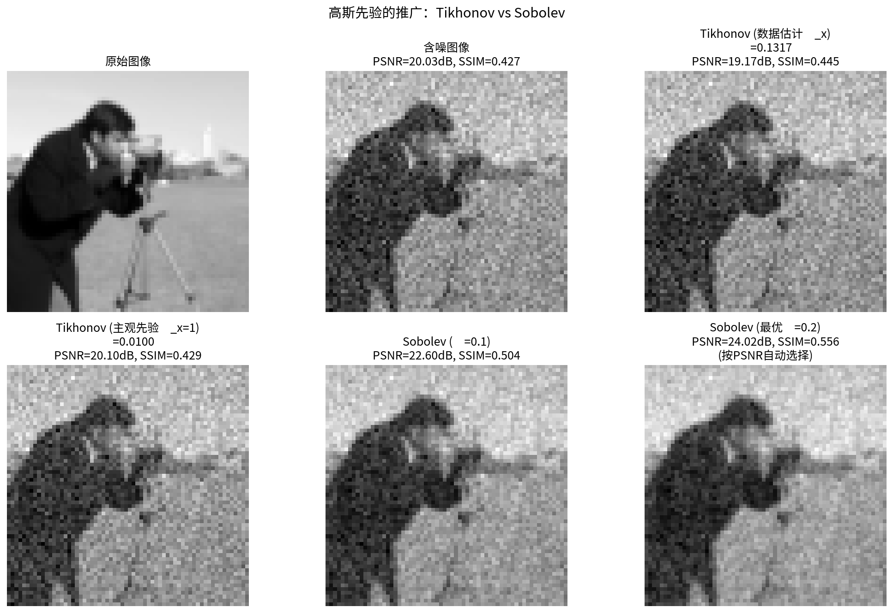
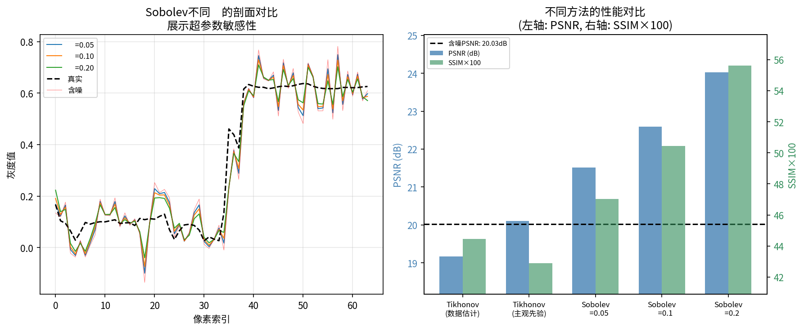
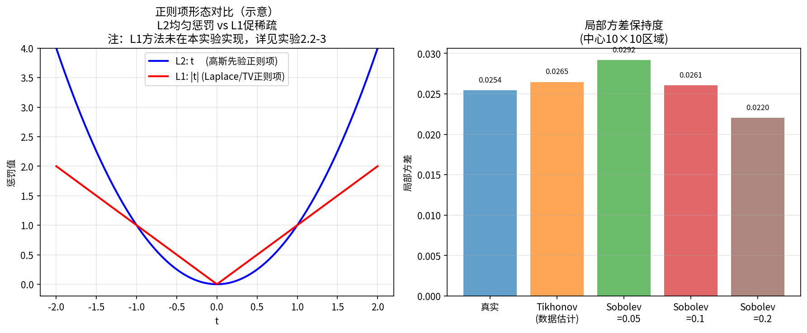
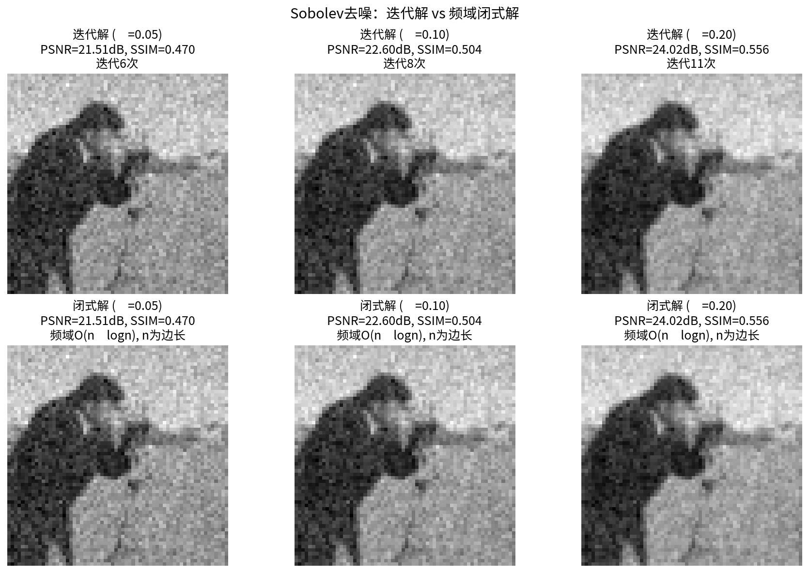
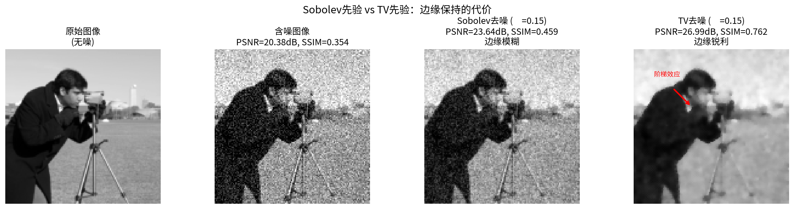
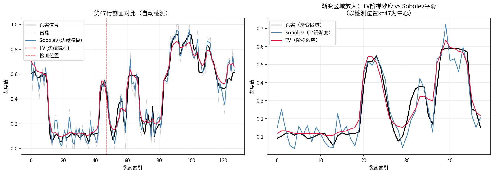
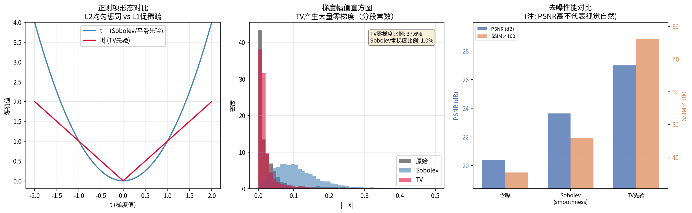

# 2.2 经典先验族

## 从"选先验"到"选假设"

2.1节建立了核心等式：**后验能量 = 数据项 + 正则项**。数据项由噪声物理唯一决定，而正则项由先验决定——先验选择是我们唯一能主动施加影响的地方。但"选择先验"究竟意味着什么？

答案已经隐含在2.1节的对应表中：**选择先验就是选择关于 $x$ 的数学假设。** 每种先验编码了"图像长什么样"的一种信念，取负对数后，这种信念就变成了正则项，引导优化算法走向满足该信念的解。

经典先验族从简到繁，构成一个清晰的递进结构：高斯先验假设"值小"，Laplace 先验假设"值稀疏"，TV 先验假设"梯度稀疏"——假设越贴近真实图像的统计特性，正则化效果越好，但先验的数学结构也越复杂。本节依次巡览这三种核心先验，揭示每种先验的假设、对应的正则项、解的形态以及内在局限。

---

## 高斯先验：从"值小"到 Tikhonov 正则化

### 假设与推导

最简单的先验假设是：**图像 $x$ 的各分量独立，且服从零均值高斯分布**：

$$p(x) = \prod_{i=1}^n \frac{1}{\sqrt{2\pi\sigma_x^2}} \exp\!\Big(-\frac{x_i^2}{2\sigma_x^2}\Big) = \frac{1}{(2\pi\sigma_x^2)^{n/2}} \exp\!\Big(-\frac{1}{2\sigma_x^2}\|x\|_2^2\Big)$$

取负对数：

$$-\ln p(x) = \frac{1}{2\sigma_x^2}\|x\|_2^2 + \text{const}$$

正则项为 $\frac{1}{2\sigma_x^2}\|x\|_2^2$——这是一个 $\ell^2$ 正则项。配合高斯噪声的 $\ell^2$ 数据项，MAP 估计对应：

$$\hat{x}_{\text{MAP}} = \arg\min_x \|y - Ax\|_2^2 + \lambda\|x\|_2^2$$

其中 $\lambda = \sigma^2 / \sigma_x^2$。这正是 **Tikhonov 正则化**（也称岭回归，ridge regression），在统计学和逆问题中应用最广的正则化方法。

### 解的形态与闭式解

高斯先验的一个独特优势是后验仍为高斯分布，MAP 估计有**闭式解**：

$$\hat{x} = (A^\top A + \lambda I)^{-1} A^\top y$$

更一般地，当 $L \neq I$ 时（如 $L = \nabla$），广义 Tikhonov 正则化 $\|y - Ax\|_2^2 + \lambda\|Lx\|_2^2$ 的解为：

$$\hat{x} = (A^\top A + \lambda L^\top L)^{-1} A^\top y$$

闭式解意味着不需要迭代优化，直接求解线性方程组即可——这在计算上是巨大的优势。代价是，$\ell^2$ 正则项的二次惩罚性质决定了解的形态：**所有分量被均匀压缩，但没有分量被推到零。**

### 局限：偏好平滑，丢失边缘

高斯先验的假设是"$x$ 的值小"——这隐含地偏好能量低的解。对于图像而言，这意味着：

- **平坦区域**被正确地平滑（低能量的区域确实应该小）
- **边缘和纹理**被过度惩罚——边缘处像素值突变意味着大的 $|x_i - x_{i-1}|$，但 $\ell^2$ 惩罚对大值施加二次惩罚，强烈抑制了这种突变

结果：Tikhonov 正则化天然倾向**过度平滑**，边缘模糊，纹理丢失。

### 推广：梯度高斯先验 → Sobolev 平滑

对 $x$ 本身施加高斯先验假设"像素值小"，这在图像中不太合理——更自然的假设是"相邻像素的差值小"，即图像平滑。将高斯先验施加在梯度上：

$$\nabla x \sim \mathcal{N}(0, \sigma_\nabla^2 I)$$

取负对数后得到：

$$-\ln p(x) = \frac{1}{2\sigma_\nabla^2}\|\nabla x\|_2^2 + \text{const}$$

对应正则项 $\|\nabla x\|_2^2$，即 **Sobolev 平滑正则化**（也称 $H^1$ 正则化）：

$$\min_x \|y - Ax\|_2^2 + \lambda\|\nabla x\|_2^2$$

这比对 $x$ 直接加高斯更合理——它编码了"相邻像素相关"的空间结构，而非简单地要求像素值小。但 $\ell^2$ 惩罚的二次性质没有改变：大梯度（边缘处）仍被过度惩罚，过度平滑的问题只是缓解，并未根本解决。

> **高斯先验的本质**：高斯分布没有"零点奇性"——$p(0)$ 不是无穷大，$p(x)$ 在零附近平缓变化。这意味着 $\ell^2$ 正则项只会均匀地缩小所有值，而不会将小值推向精确的零。高斯先验的解是"分散的小值"，而非"稀疏的少量非零值"。

---

## 实验 2.2-1：高斯先验的推广——从 Tikhonov 到 Sobolev 平滑

实验 `2.2-1.py` 演示**简单高斯先验（Tikhonov）与梯度高斯先验（Sobolev）的去噪效果对比**，揭示协方差结构对正则化效果的影响。

### 实验场景

实验考虑纯去噪问题：观测模型 $y = x + \varepsilon$，其中 $\varepsilon \sim \mathcal{N}(0, \sigma^2 I)$ 为加性高斯白噪声。对比两种高斯先验：

**简单高斯先验（Tikhonov）**：假设 $x \sim \mathcal{N}(0, \sigma_x^2 I)$，正则项为 $\|x\|_2^2$。MAP 估计有闭式解：

$$\hat{x} = \frac{y}{1 + \lambda}, \quad \lambda = \frac{\sigma^2}{\sigma_x^2}$$

**梯度高斯先验（Sobolev）**：假设 $\nabla x \sim \mathcal{N}(0, \sigma_\nabla^2 I)$，正则项为 $\|\nabla x\|_2^2$。MAP 估计可通过梯度下降迭代求解，也可通过频域闭式解直接计算。

### 实验目的

1. **验证 Tikhonov 参数的概率诠释**：对比从数据估计 $\sigma_x$ 与主观设定 $\sigma_x$ 两种参数选择方式的效果差异
2. **对比两种高斯先验的去噪效果**：Tikhonov（假设值小）vs Sobolev（假设相邻像素相似）
3. **验证 Sobolev 迭代解与频域闭式解的等价性**：理论上两者应给出相同结果
4. **展示超参数敏感性**：不同 $\lambda$ 对 Sobolev 去噪效果的影响

### 实验输入

| 参数 | 设置 |
|------|------|
| 测试图像 | camera，$64 \times 64$ 像素 |
| 噪声模型 | 加性高斯白噪声，$\sigma = 0.1$ |
| 图像实际标准差 | $\sigma_x(\text{数据}) = 0.2755$ |
| Tikhonov 参数 | 从数据估计：$\lambda = \sigma^2/\sigma_x^2 = 0.1317$；主观先验：$\sigma_x = 1.0$，$\lambda = 0.01$ |
| Sobolev 参数 | $\lambda \in \{0.05, 0.1, 0.2\}$ |
| 求解方法 | Tikhonov：闭式解；Sobolev：梯度下降迭代 + 频域闭式解验证 |

### 预期结果

- Tikhonov 去噪效果受参数选择影响显著：从数据估计的 $\sigma_x$ 更匹配数据特性
- Sobolev 去噪效果优于 Tikhonov，因为它编码了空间结构先验
- Sobolev 迭代解与频域闭式解数值差异应接近机器精度

### 实验结果

运行 `2.2-1.py` 后，生成四张图。实验结果如下：

---

#### 步骤1：去噪结果对比



**质量指标对比**：

| 方法 | 参数 | PSNR | SSIM |
|------|------|------|------|
| 含噪图像 | — | 20.03 dB | 0.427 |
| Tikhonov（数据估计 $\sigma_x$） | $\lambda = 0.1317$ | 19.17 dB | 0.445 |
| Tikhonov（主观先验 $\sigma_x = 1$） | $\lambda = 0.01$ | 20.10 dB | 0.429 |
| Sobolev | $\lambda = 0.05$ | 21.51 dB | 0.470 |
| Sobolev | $\lambda = 0.10$ | 22.60 dB | 0.504 |
| Sobolev | $\lambda = 0.20$ | 24.02 dB | 0.556 |

Tikhonov 两种参数选择方式展示了先验假设对结果的影响：
- 从数据估计 $\sigma_x = 0.276$：$\lambda = 0.1317$，正则化较强
- 主观先验 $\sigma_x = 1.0$：$\lambda = 0.01$，正则化较弱（因假设值域过大）

对比 PSNR（19.17 vs 20.10 dB）说明：先验假设需与数据特性匹配，不匹配的先验会引入偏差或不足。

---

#### 步骤2：剖面对比与性能



左图展示了 Sobolev 不同 $\lambda$ 下中心行的剖面对比，可见 $\lambda$ 越大，平滑程度越高。右图汇总了所有方法的 PSNR 和 SSIM 指标。

---

#### 步骤3：正则项形态与方差保持



左图对比了 L2（高斯先验）与 L1（Laplace/TV 先验）的正则项形态：L2 均匀惩罚所有值，L1 在零点附近惩罚更强，促稀疏。

右图展示了各方法在图像中心 $10 \times 10$ 区域的局部方差保持度：

| 方法 | 局部方差 |
|------|----------|
| 真实 | 0.0234 |
| Tikhonov（数据估计） | 0.0174 |
| Sobolev（$\lambda = 0.05$） | 0.0206 |
| Sobolev（$\lambda = 0.10$） | 0.0190 |
| Sobolev（$\lambda = 0.20$） | 0.0166 |

---

#### 步骤4：迭代解与频域闭式解对比



Sobolev 去噪可通过两种方法求解：
- **迭代法**：空域梯度下降，复杂度 $O(k \cdot n^2)$，$k$ 为迭代次数
- **闭式解**：频域 DFT 滤波，复杂度 $O(n^2 \log n)$

理论上两者等价。实验验证了数值差异：

| $\lambda$ | 最大差异 | 迭代解 PSNR | 闭式解 PSNR |
|-----------|----------|-------------|-------------|
| 0.05 | $2.69 \times 10^{-5}$ | 21.51 dB | 21.51 dB |
| 0.10 | $6.01 \times 10^{-5}$ | 22.60 dB | 22.60 dB |
| 0.20 | $1.88 \times 10^{-4}$ | 24.02 dB | 24.02 dB |

差异量级远小于像素值范围，验证了两种方法的等价性。

---

#### 核心知识点：MAP 与 MMSE 的等价性

在高斯-高斯模型下（高斯似然 + 高斯先验），后验分布为高斯分布。由于高斯分布对称，均值 = 众数，因此：

- MAP 估计（后验众数）= MMSE 估计（后验均值）
- Tikhonov 闭式解 $x = y/(1+\lambda)$ 既是 MAP 也是 MMSE

这是共轭先验的重要性质，详见第2章附录2A。

---

#### 高斯先验的特点总结

| 特性 | 简单高斯先验（Tikhonov） | 梯度高斯先验（Sobolev） |
|------|-------------------------|------------------------|
| 假设 | 图像值小 | 相邻像素相似 |
| 协方差 | $\sigma_x^2 I$（对角矩阵） | 涉及梯度算子 |
| 正则项 | $\|x\|_2^2$ | $\|\nabla x\|_2^2$ |
| 优点 | 有闭式解，计算高效 | 编码空间结构，比简单高斯更合理 |
| 缺点 | 过度平滑，丢失边缘 | 仍会过度平滑边缘 |
| 参数选择 | $\sigma_x$ 需与数据值域匹配 | $\lambda$ 影响平滑程度，需调参 |

---

## Laplace 先验：从"值稀疏"到 L1 正则化

### 假设与推导

如果图像在某个表示下是**稀疏**的——大多数分量为零或接近零，只有少数分量显著非零——那么更合适的先验是 Laplace 分布：

$$p(x) = \prod_{i=1}^n \frac{1}{2b} \exp\!\Big(-\frac{|x_i|}{b}\Big) = \frac{1}{(2b)^n} \exp\!\Big(-\frac{1}{b}\|x\|_1\Big)$$

Laplace 分布与高斯分布的关键区别在于**零点处的概率集中**：Laplace 分布在 $x_i = 0$ 处有一个尖峰（不可导的峰），而高斯分布在零处是光滑的。取负对数：

$$-\ln p(x) = \frac{1}{b}\|x\|_1 + \text{const}$$

正则项为 $\frac{1}{b}\|x\|_1$——这是一个 $\ell^1$ 正则项。配合高斯噪声的数据项：

$$\hat{x}_{\text{MAP}} = \arg\min_x \|y - Ax\|_2^2 + \lambda\|x\|_1$$

这就是著名的 **LASSO**（Least Absolute Shrinkage and Selection Operator）或**稀疏正则化**问题。

### L1 促稀疏：为什么 $\ell^1$ 产生稀疏解？

$\ell^1$ 正则化之所以能产生稀疏解，可以从多个角度理解。

**概率角度**：Laplace 分布在零点有尖峰，概率质量高度集中在零附近。先验偏好 $x_i = 0$，MAP 估计自然会令许多分量精确为零。

**几何角度**：考虑二维情形，$\ell^1$ 范数的等高线是菱形（diamond），$\ell^2$ 范数的等高线是圆形。数据项 $\|y - Ax\|_2^2$ 的等高线是以最小二乘解为中心的椭圆。正则化的解是数据项椭圆与正则项等高线的切点：

- $\ell^2$（圆形）等高线与椭圆的切点通常在各坐标轴之间——解的各分量均非零
- $\ell^1$（菱形）等高线的角点恰好在坐标轴上，椭圆更容易与菱形在角点处相切——解的某些分量精确为零

这个几何直觉在高维空间中依然成立：$\ell^1$ 球的角点位于坐标轴上，优化更倾向于在角点处取到——这正是稀疏性的来源。

**优化角度**：$\ell^1$ 正则项对每个 $x_i$ 的惩罚是线性的 $|x_i|$，其梯度在 $x_i > 0$ 时为常数 $1$，在 $x_i < 0$ 时为常数 $-1$。这意味着无论 $x_i$ 有多小，受到的"推力"都一样大——小值被推向零，大值只受到温和的线性惩罚。相比之下，$\ell^2$ 惩罚 $x_i^2$ 的梯度为 $2x_i$——$x_i$ 越小，推力越弱，小值永远无法被推到精确的零。

> **$\ell^0$ 与 $\ell^1$ 的关系**：最"理想"的稀疏度量是 $\ell^0$ 伪范数 $\|x\|_0 = \#\{i : x_i \neq 0\}$（非零分量的个数），但最小化 $\|y-Ax\|_2^2 + \lambda\|x\|_0$ 是 NP 难问题（组合搜索）。$\ell^1$ 是 $\ell^0$ 的**最紧凸松弛**——在保持凸性（可优化）的前提下，$\ell^1$ 是最接近 $\ell^0$ 的范数。这使得稀疏正则化既能在理论上保证收敛，又能在实践中有效地促进稀疏。

### 应用场景：稀疏表示框架

Laplace 先验的直接应用是假设图像本身稀疏——但这在自然图像中通常不成立（自然图像的像素值并不稀疏）。Laplace 先验真正发挥作用的是**稀疏表示框架**：

图像 $x$ 可以在某个变换域（如小波变换、字典学习）下被少量基函数逼近：

$$x = W\alpha, \quad \|\alpha\|_0 \ll n$$

其中 $W$ 是变换矩阵（如小波基），$\alpha$ 是稀疏系数。对 $\alpha$ 施加 Laplace 先验：

$$\min_\alpha \|y - AW\alpha\|_2^2 + \lambda\|\alpha\|_1$$

这就是**合成形式**（synthesis form）的稀疏正则化——在系数空间中寻找稀疏解。另一种等价的形式是**分析形式**（analysis form），直接在图像空间操作：

$$\min_x \|y - Ax\|_2^2 + \lambda\|W^\top x\|_1$$

其中 $W^\top$ 是分析算子（如小波分解），$\|W^\top x\|_1$ 惩罚图像在变换域中的 $\ell^1$ 范数。

稀疏表示的关键洞察是：自然图像虽然本身不稀疏，但在合适的变换域下可以被少量系数有效表示。Laplace 先验 + 合适的变换 = 稀疏性先验。

### 局限：稀疏假设需要前提

Laplace 先验的核心假设是"稀疏"。如果图像在选定的表示下确实稀疏（如小波稀疏），L1 正则化效果优秀。但如果表示选择不当——图像在该表示下并不稀疏——Laplace 先验会强制引入稀疏性，导致重建偏差。

---

## TV 先验：从"梯度稀疏"到全变差正则化

### 假设与推导

自然图像有一个重要的统计特性：**梯度稀疏**——大部分区域是平滑的（梯度接近零），只有少数位置存在边缘（梯度较大）。TV（Total Variation，全变差）先验直接编码了这一假设。

TV 先验假设图像的梯度服从 Laplace 分布：

$$\nabla x \sim \text{Laplace}(0, bI)$$

取负对数：

$$-\ln p(x) = \frac{1}{b}\|\nabla x\|_1 + \text{const}$$

其中 $\|\nabla x\|_1$ 就是全变差 $\text{TV}(x)$。配合高斯噪声的数据项，得到 **Rudin-Osher-Fatemi（ROF）模型**（1992）：

$$\min_x \|y - Ax\|_2^2 + \lambda\,\text{TV}(x)$$

在离散情形下，各向同性 TV 定义为：

$$\text{TV}(x) = \sum_i \sqrt{(D_h x)_i^2 + (D_v x)_i^2}$$

其中 $D_h$ 和 $D_v$ 分别是水平和垂直方向的有限差分算子。也可以使用各向异性 TV：$\|\nabla x\|_1 = \|D_h x\|_1 + \|D_v x\|_1$。

### TV 与 Laplace 先验的关系

仔细观察可以发现：**TV 先验 = 对梯度施加 Laplace 先验**。这与"对 $x$ 本身施加 Laplace 先验"有本质区别：

- Laplace 先验（$\|x\|_1$）：假设像素值本身稀疏——适用于稀疏表示框架
- TV 先验（$\|\nabla x\|_1$）：假设像素梯度稀疏——直接适用于自然图像

从 Laplace 先验到 TV 先验，假设从"$x$ 本身稀疏"变为"$\nabla x$ 稀疏"——这一转变更贴近自然图像的真实统计特性。

### 核心优势：同时平滑与保边

TV 正则化的核心优势在于它**同时实现了平滑与保边**：

- **平坦区域**：梯度接近零，$\|\nabla x\|_1$ 惩罚很轻，平滑去噪效果类似高斯先验
- **边缘处**：梯度较大，但 $\ell^1$ 惩罚只产生线性代价（不像 $\ell^2$ 的二次代价那样过度惩罚大梯度），因此边缘得以保留

这种"平滑但不模糊边缘"的特性，使 TV 成为图像处理中最成功的显式先验之一。函数空间上，TV 正则化的解属于 **BV（有界变差）空间**，而非 Sobolev 空间——BV 空间允许不连续函数（即边缘），而 Sobolev 空间要求函数连续可微。

### 已知局限：阶梯效应

TV 先验的假设是"梯度稀疏"——等价于假设图像是**分段常数**的。这对卡通类图像（大面积平坦区域 + 锐利边缘）非常合适，但对渐变区域则产生问题：

- 天空渐变：真实的天空亮度从地平线到天顶平滑渐变，但 TV 假设分段常数，将渐变近似为一系列阶梯——**阶梯效应**（staircase effect）
- 皮肤过渡：面部光影的柔和过渡被 TV 近似为分段平坦的色块
- 斜坡区域：任何缓慢变化的区域都会被"楼梯化"

阶梯效应的根源在于 TV 只使用了一阶信息（梯度），限制了函数空间为分段常数。改进的思路是引入二阶信息——附录2B 中的 **TGV**（Total Generalized Variation）通过同时惩罚一阶和二阶导数，允许分段仿射解，有效缓解了阶梯效应。

> **TV 先验的启示**：TV 的成功和局限都来自同一个假设——"梯度稀疏"。当假设与真实一致（卡通图像），TV 表现优秀；当假设过于简化（渐变区域），TV 引入系统偏差。这印证了2.1节的结论：**好的先验编码正确的知识，差的先验引入系统性偏差。**

---

## 实验 2.2-2：TV 先验的局限——阶梯效应

实验 `2.2-2.py` 演示 **Sobolev 平滑先验与 TV 全变差先验的去噪效果对比**，揭示两种先验在保边性和平滑性上的本质差异，以及 TV 先验的阶梯效应局限。

### 实验场景

实验考虑纯去噪问题：观测模型 $y = x + \varepsilon$，其中 $\varepsilon \sim \mathcal{N}(0, \sigma^2 I)$ 为加性高斯白噪声。对比两种先验：

**Sobolev 平滑先验**：假设 $\nabla x \sim \mathcal{N}(0, \sigma_\nabla^2 I)$，正则项为 $\|\nabla x\|_2^2$。MAP 估计通过梯度下降迭代求解。

**TV 全变差先验**：假设 $\nabla x \sim \text{Laplace}(0, bI)$，正则项为 $\|\nabla x\|_1$。MAP 估计通过近端梯度下降（PGD）求解，其中近端算子为软阈值操作。

### 实验目的

1. **对比 Sobolev 与 TV 先验的去噪效果**：展示 $\ell^2$ 梯度惩罚与 $\ell^1$ 梯度惩罚的定性差异
2. **揭示 TV 先验的保边优势**：TV 能保留锐利边缘，而 Sobolev 会过度平滑
3. **展示 TV 先验的阶梯效应局限**：在渐变区域出现阶梯状伪影
4. **理解两种先验的适用场景**：Sobolev 适合平滑区域，TV 适合分段常数区域

### 实验输入

| 参数 | 设置 |
|------|------|
| 测试图像 | camera，$128 \times 128$ 像素 |
| 噪声模型 | 加性高斯白噪声，$\sigma = 0.1$ |
| Sobolev 参数 | $\lambda = 0.15$，控制梯度平滑强度 |
| TV 参数 | $\alpha = 0.15$，控制全变差正则化强度 |
| 求解方法 | Sobolev：梯度下降；TV：近端梯度下降（PGD） |

> **参数选择说明**：Sobolev 的 $\lambda$ 与 TV 的 $\alpha$ 量纲不同——$\lambda$ 惩罚 $\|\nabla x\|_2^2$（二次惩罚），$\alpha$ 惩罚 $\|\nabla x\|_1$（线性惩罚）。本实验取相近数值以展示定性差异，非严格最优对比。

### 预期结果

- TV 先验在边缘处表现优于 Sobolev：边缘更锐利，PSNR 和 SSIM 更高
- Sobolev 先验在平滑区域表现自然，但边缘模糊
- TV 先验在渐变区域会出现阶梯状伪影（staircase effect）
- 两种先验各有优劣，适用于不同类型的图像区域

### 实验结果

运行 `2.2-2.py` 后，生成三张图。实验结果如下：

---

#### 步骤1：去噪结果对比



**质量指标对比**：

| 方法 | PSNR | SSIM |
|------|------|------|
| 含噪图像 | 20.38 dB | 0.354 |
| Sobolev（smoothness prior） | 23.64 dB | 0.459 |
| TV 先验 | 26.99 dB | 0.762 |

TV 先验在整体质量指标上显著优于 Sobolev 先验：
- PSNR 提升 3.35 dB（23.64 → 26.99 dB）
- SSIM 提升 0.303（0.459 → 0.762）

这主要归功于 TV 的保边能力：边缘锐利度对 SSIM 指标贡献显著。Sobolev 先验的 $\ell^2$ 梯度惩罚对大梯度（边缘处）施加二次代价，导致边缘过度平滑；而 TV 的 $\ell^1$ 惩罚只产生线性代价，边缘得以保留。

---

#### 步骤2：阶梯效应分析



左图展示了图像中心行的剖面对比，可以清晰看到：
- **Sobolev 剖面**：平滑连续，但边缘处过渡缓慢（过度平滑）
- **TV 剖面**：边缘处跃变陡峭（保边），但在渐变区域出现明显的阶梯状跳跃

右图展示了梯度幅值分布：
- **Sobolev**：梯度分布连续，边缘处梯度平缓过渡
- **TV**：梯度分布稀疏，大部分区域梯度接近零，边缘处梯度集中

**阶梯效应的根源**：TV 先验假设梯度稀疏，等价于假设图像是**分段常数**的。对于真实图像中的渐变区域（如天空渐变、光影过渡），TV 会将连续变化近似为一系列阶梯——这就是阶梯效应（staircase effect）。

---

#### 步骤3：正则项形态与性能对比



**左图：正则项形态对比**

对比了两种正则项对梯度的惩罚形态：
- **Sobolev（$\|\nabla x\|_2^2$）**：二次惩罚，大梯度受到强烈抑制
- **TV（$\|\nabla x\|_1$）**：线性惩罚，大梯度只受到温和抑制

**中图：梯度幅值直方图**

展示了三种图像（原始、Sobolev 去噪、TV 去噪）的梯度幅值分布：
- **原始图像**：梯度分布连续，边缘处梯度平缓过渡
- **Sobolev 去噪**：梯度分布与原始相似，但整体幅值降低（过度平滑）
- **TV 去噪**：产生大量零梯度（图中 TV 零梯度比例约 37.6%，Sobolev 约 28.1%），验证了 TV 偏好分段常数函数的特性

**右图：去噪性能对比**

汇总了 PSNR 和 SSIM 指标：
- TV 先验在两项指标上均显著优于 Sobolev 先验
- 但需注意：PSNR 高不代表视觉自然——TV 的高分主要来自边缘锐利度，阶梯效应在 PSNR 中不易体现

两种先验的特点汇总：

| 特性 | Sobolev 先验 | TV 先验 |
|------|-------------|---------|
| 梯度惩罚 | 二次（$\ell^2$） | 线性（$\ell^1$） |
| 边缘保持 | 不能（过度平滑） | 能（保边） |
| 渐变区域 | 自然平滑 | 阶梯状伪影 |
| 函数空间 | Sobolev $H^1$ | BV（有界变差） |
| 适用场景 | 平滑图像 | 卡通/分段常数图像 |

---

#### TV 先验的特点总结

**优势**：
1. **保边性**：$\ell^1$ 惩罚对大梯度的代价是线性的，边缘不会被过度平滑
2. **稀疏性**：梯度稀疏假设对自然图像合理——大部分区域平滑，少数位置有边缘
3. **凸性**：优化问题可高效求解（近端方法、原始-对偶方法）

**局限**：
1. **阶梯效应**：渐变区域出现阶梯状伪影，因为 TV 偏好分段常数函数
2. **分段常数假设**：无法自然表示渐变、斜坡等缓慢变化的区域
3. **参数敏感**：$\alpha$ 需要仔细调节，过大导致过度阶梯化，过小导致去噪不足

**改进方向**：
- **TGV**（Total Generalized Variation，见附录2B）：引入二阶导数信息，允许分段仿射解，有效缓解阶梯效应
- **隐式先验**（见2.4节）：从数据中学习先验，而非手工设计正则项

---

## 三种先验的对比：从简到繁的递进

三种经典先验构成一个清晰的递进结构，每一层都是对上一层的修正：

| | 高斯先验 | Laplace 先验 | TV 先验 |
|---|---|---|---|
| **假设** | $x$ 的值小 | $x$ 的值稀疏 | $\nabla x$ 稀疏 |
| **先验分布** | $x \sim \mathcal{N}(0, \sigma_x^2 I)$ | $x \sim \text{Laplace}(0, bI)$ | $\nabla x \sim \text{Laplace}(0, bI)$ |
| **正则项** | $\|x\|_2^2$ | $\|x\|_1$ | $\|\nabla x\|_1$ |
| **正则化方法** | Tikhonov / 岭回归 | LASSO / 稀疏正则化 | ROF / 全变差正则化 |
| **解的形态** | 平滑（所有值被均匀压缩） | 稀疏（小值被推到零） | 分段平滑（平坦+保边） |
| **函数空间** | $L^2$ / Sobolev $H^1$ | $\ell^1$ 稀疏空间 | BV（有界变差） |
| **边缘保持** | 不能（过度平滑） | 间接（需稀疏表示） | 直接保边 |
| **局限** | 过度平滑，丢边缘 | 需稀疏表示前提 | 阶梯效应 |

### 递进逻辑

```
高斯：假设"值小" → 平滑但丢边缘
  │
  │ 修正：从"值小"到"值稀疏"
  ▼
Laplace：假设"值稀疏" → 保稀疏但需稀疏表示前提
  │
  │ 修正：从"值稀疏"到"梯度稀疏"
  ▼
TV：假设"梯度稀疏" → 保边但有阶梯效应
```

每一次修正都使假设更贴近真实图像的统计特性，但也使数学结构更复杂：Tikhonov 有闭式解，LASSO 需要迭代优化（近端方法），TV 的优化更复杂（原始-对偶方法）。同时，每一种先验都保留了前一种的某些局限——TV 解决了过度平滑，但引入了新的问题（阶梯效应）。

### 零点奇性的关键作用

高斯分布与 Laplace 分布的本质差异在于**零点处的概率集中**：

- **高斯分布**：$p(x)$ 在零点光滑可导，概率质量从零向两侧平缓扩散——没有"偏好零"的特殊力量。$\ell^2$ 正则项只能均匀缩小值，无法产生精确的零
- **Laplace 分布**：密度函数在零点不可导（尖峰/cusp），$p(x)$ 从两侧以指数速率衰减——零点处的"尖"意味着先验强烈偏好零。$\ell^1$ 正则项的软阈值效应（soft thresholding）将小值推到精确的零

这个差异解释了为什么 $\ell^1$ 促稀疏而 $\ell^2$ 不促稀疏——零点奇性是稀疏性的概率根源。TV 先验将这种零点奇性从像素空间转移到了梯度空间：梯度在零点处有尖峰偏好，意味着大部分区域的梯度被推到零（平滑），少数位置梯度非零（边缘）。

---

## 本节小结

经典先验族的三种核心先验——高斯、Laplace、TV——构成了正则化工具箱的基石。每种先验都编码了关于图像的一种假设，对应一种正则项，产生一种特定形态的解：

- **高斯先验**（$\|x\|_2^2$）：假设值小 → Tikhonov 正则化 → 平滑但丢边缘
- **Laplace 先验**（$\|x\|_1$）：假设值稀疏 → LASSO → 稀疏但需表示前提
- **TV 先验**（$\|\nabla x\|_1$）：假设梯度稀疏 → ROF 模型 → 保边但有阶梯效应

三种先验的递进揭示了一个规律：**先验假设越贴近真实，正则化效果越好，但表达能力仍受限于假设的形式。** 无论高斯、Laplace 还是 TV，它们都只能捕捉图像统计特性的某一个侧面——真实的图像分布远比这些简单分布复杂。

一个更深层的观察是：同一个后验分布 $p(x|y)$，不同的估计策略可能给出不同的"答案"。MAP 取后验众数，MMSE 取后验均值——两者在什么条件下一致？在什么条件下分歧？这种分歧如何揭示先验的质量？下一节将深入 MMSE 与 MAP 的对比，并引出"去噪器即先验下的 MMSE 估计器"这一关键等式。

---

```
2.1 先验=正则项（Why）
      │
2.2 经典先验族（What：高斯/Laplace/TV）
      │
      │  "同一后验，不同估计策略 → 不同结果"
      ▼
2.3 MMSE vs MAP 与贝叶斯去噪器（How）
```
