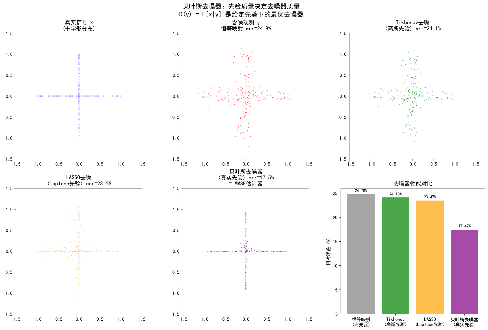

# 2.3 先验的质量：MMSE vs MAP 估计器

## 从"后验分布"到"具体答案"

2.1节和2.2节回答了两个问题：先验为什么等价于正则项（Why），以及有哪些经典先验可选（What）。现在我们面对一个更精细的问题：**给定后验分布 $p(x|y)$，如何从中提取一个具体的估计值？**

后验分布是贝叶斯推断的完整答案——它刻画了在观测到 $y$ 之后，$x$ 取各个值的概率。但在实际应用中，我们需要一个"点"而非一个"分布"：重建图像需要一张图，而非一组概率。从分布到点，意味着选择一种**汇总统计量**——不同的选择给出不同的估计器，也揭示先验的不同侧面。

两种最基本的选择是：取后验的**均值**（MMSE 估计器）和取后验的**众数**（MAP 估计器）。两者看起来只差"平均"与"最可能"的区别，但这种区别在后验非对称时会产生深刻的分歧——而这种分歧恰恰揭示了先验质量的内在结构。

---

## MMSE 估计器：后验均值

### 定义

MMSE（Minimum Mean Square Error）估计器定义为后验分布的均值：

$$\hat{x}_{\text{MMSE}} = \mathbb{E}[x|y] = \int x \, p(x|y) \, \mathrm{d}x$$

它是后验的"重心"——对所有可能的 $x$ 按后验概率加权求和。

### 最优性：平方损失下的贝叶斯最优

MMSE 估计器的最优性有严格的数学保证。定义**条件贝叶斯风险**（在给定 $y$ 的条件下，估计值 $\hat{x}$ 的期望平方误差）：

$$R(\hat{x}|y) = \mathbb{E}\big[\|x - \hat{x}\|_2^2 \,\big|\, y\big] = \int \|x - \hat{x}\|_2^2 \, p(x|y) \, \mathrm{d}x$$

对 $\hat{x}$ 求导并令其为零：

$$\nabla_{\hat{x}} R = -2\int (x - \hat{x}) \, p(x|y) \, \mathrm{d}x = 0$$

解得 $\hat{x} = \int x \, p(x|y) \, \mathrm{d}x = \mathbb{E}[x|y]$。因此，**MMSE 估计器是在平方损失 $\ell(\hat{x}, x) = \|\hat{x} - x\|_2^2$ 下条件贝叶斯风险最小的估计器**。

将 $\hat{x}_{\text{MMSE}}$ 代回风险函数，得到最小的条件贝叶斯风险恰为后验方差：

$$R(\hat{x}_{\text{MMSE}}|y) = \text{tr}\big(\text{Cov}(x|y)\big)$$

这个等式揭示了一个重要的逻辑链条：**好的先验提供准确的额外信息，与似然结合后使后验分布更集中（后验方差更小），而后验方差决定了 MMSE 估计的精度——后验方差越小，MMSE 估计越精确。** 因此，后验方差反映了在给定观测 $y$ 下估计的不确定性。一个好的先验应该在保证无偏的前提下，应尽可能减小后验方差，从而降低估计的不确定性，使后验分布集中在真实值附近。

### 计算代价

MMSE 估计器需要对后验分布进行积分。对于高维图像（$x \in \mathbb{R}^n$，$n$ 可达 $10^6$），这个积分在大多数情况下无法解析计算——这正是需要采样方法（第4章 MCMC）的根本原因。

> **MMSE 的本质**：MMSE 估计器利用了后验分布的**全部信息**——它对后验的每一个可能值进行加权平均。这意味着后验的形状（单峰还是多峰、对称还是偏斜）都参与了估计的构造。信息利用充分，代价是计算困难。

---

## MAP 估计器：后验众数

### 定义

MAP（Maximum A Posteriori）估计器定义为后验分布的众数——使后验概率最大的点：

$$\hat{x}_{\text{MAP}} = \arg\max_x p(x|y) = \arg\min_x \big[-\ln p(y|x) - \ln p(x)\big]$$

取负对数后，MAP 估计等价于最小化后验能量函数——这正是正则化优化问题。

### 最优性：0-1 损失下的贝叶斯最优

MAP 估计器也有严格的理论保证。从决策论的角度看，不同的估计器对应不同的**损失函数**——即我们对不同类型错误的“惩罚方式”。

考虑一种“邻域损失”：如果估计值落在真实值的一个小邻域内（误差小于某个阈值 $\epsilon$）则损失为 0，否则损失为 1。在邻域半径 $\epsilon \to 0$ 的极限下，最小化这种损失的估计器就是后验众数——**MAP 估计器是在 0-1 型损失下的贝叶斯最优估计器**。

这个结果的意义在于：**MMSE 和 MAP 都是贝叶斯最优的，只是针对不同的损失函数**。选择哪一个，取决于你的应用中更关心什么类型的错误：

- **平方损失**（MMSE）：小误差惩罚小，大误差惩罚大（二次增长）→ 适合希望平均误差最小的场景
- **0-1 损失**（MAP）：只要估计足够接近真实值就算“对”，否则算“错” → 适合分类、检测等“对错分明”的场景

与 MMSE 的对比揭示了一个关键差异：

| | MMSE（后验均值） | MAP（后验众数） |
|---|---|---|
| **最优损失** | 平方损失 $\|x - \hat{x}\|_2^2$ | 0-1 型损失 |
| **最优性含义** | 最小化均方误差 | 最大化后验概率密度 |
| **利用的信息** | 后验分布的完整信息（积分） | 后验分布的局部信息（众数附近） |
| **计算方式** | 积分（通常需要采样） | 优化（梯度下降等） |

### 计算代价

MAP 估计只需要优化，不需要积分——这是一个巨大的计算优势。对于2.2节中讨论的凸正则化问题（如 Tikhonov、LASSO、ROF），MAP 估计等价于凸优化，可以高效求解。这也是为什么第3章从 MAP 开始——它把贝叶斯推断转化为我们熟悉的优化问题。

> **MAP 的本质**：MAP 估计器只关注后验分布的一个点——概率密度最大的那个点。它不在乎后验的其他部分有多宽、是否有多峰。信息利用局部，代价是可能丢失后验分布的丰富性（不确定性、多模态等）。

---

## MMSE vs MAP：一致与分歧

### 一致的情形：高斯后验

当后验分布是高斯分布时，MMSE = MAP。原因很简单：高斯分布是**对称单峰**的，均值等于众数。

这是2.2节高斯先验 + 高斯似然情形的直接推论：高斯似然 $p(y|x) = \mathcal{N}(Ax, \sigma^2 I)$ 与高斯先验 $p(x) = \mathcal{N}(0, \sigma_x^2 I)$ 结合，后验仍为高斯 $p(x|y) = \mathcal{N}(\mu_{\text{post}}, \Sigma_{\text{post}})$，均值即众数，MMSE 与 MAP 给出完全相同的估计。

这个等价性有深远的含义：**在高斯 + 高斯的情形下，正则化方法（MAP/优化）与完整贝叶斯方法（MMSE/积分）殊途同归。** 这正是 Tikhonov 正则化在实践中表现良好的理论基础——在高斯假设下，正则化解恰好就是贝叶斯最优解。

### 分歧的情形：非高斯后验

当后验分布**不对称**或**多峰**时，MMSE 与 MAP 产生分歧。两个典型场景：

**场景一：偏斜分布**。Laplace 先验下的后验分布是偏斜的——MAP（众数）偏向先验的峰值（零点），而 MMSE（均值）被尾部拉向远离零的方向。在稀疏正则化中，这意味着 MAP 解比 MMSE 解更稀疏——MAP 会让更多分量精确为零，而 MMSE 会保留更多小幅非零分量。

> 以下两图（图 2-3、图 2-4）由实验 2.3-2 生成。


从上图中可以看到，后验分布的峰值（MAP）靠近零点，但右侧尾部的概率质量将均值（MMSE）拉向更大的值。这种分歧揭示了：

**场景二：多峰分布**。考虑一个简单的二值图像：每个像素只能是 0 或 1。后验分布在 0 和 1 附近各有一个峰。MAP 会选择较高的峰（例如选择 0），而 MMSE 会取两个峰的加权平均（例如 0.3）——后者既不是 0 也不是 1，在二值图像中毫无物理意义。

下图以二值图像去噪为例，展示了多峰后验下 MMSE 与 MAP 的分歧：


图中两个峰分别对应"背景"（像素值=0）和"前景"（像素值=1）两种可能的判断。MAP 选择概率更高的峰，而 MMSE 落在两峰之间——这种分歧揭示了：

这个例子揭示了一个重要直觉：**MAP 只看"最可能的点"，MMSE 看"所有可能性的加权平均"。** 在多峰后验中，MMSE 可能落在两个峰之间的低概率区——这在物理上未必合理，但从均方误差的角度却是最优的。

### 直觉总结

| 后验分布形态 | MMSE | MAP | 结果 |
|------------|------|-----|------|
| 对称单峰（高斯） | 均值 = 众数 | 均值 = 众数 | → 一致 |
| 偏斜单峰 | 均值偏离众数（MMSE更温和） | 众数在峰值处 | → 分歧 |
| 多峰 | 峰间加权平均（可能无物理意义） | 最高的峰 | → 分歧 |

MMSE 与 MAP 的分歧不是"谁对谁错"的问题，而是两种不同的**提问方式**：

- 问"哪个 $x$ 的均方误差最小？"→ MMSE
- 问"哪个 $x$ 的后验概率最大？"→ MAP

提问方式的选择取决于应用需求。在图像重建中，如果我们需要一个单一的、视觉上合理的重建，MAP 通常更自然（因为它给出后验最可能的解）；如果我们需要最小化期望误差，MMSE 更优。

> **两条路径的起点**：MMSE 与 MAP 的分歧预示了本书的两条技术路线。第3章走 MAP 路径——将贝叶斯推断转化为优化问题，高效地求解后验众数。第4-7章走 MMSE 路径——通过采样方法估计后验均值，利用后验分布的完整信息。两条路径在扩散模型处汇合（第12章）。

---

## 贝叶斯去噪器：去噪器 = 先验下的 MMSE 估计器

### 纯去噪问题：$A = I$ 的特例

到目前为止，我们讨论的是一般逆问题 $y = Ax + \varepsilon$。现在考虑一个特殊但重要的情形：**纯去噪问题**，即 $A = I$：

$$y = x + \varepsilon, \quad \varepsilon \sim \mathcal{N}(0, \sigma^2 I)$$

此时似然函数为 $p(y|x) = \mathcal{N}(x, \sigma^2 I)$，数据项为 $\frac{1}{2\sigma^2}\|y - x\|_2^2$。纯去噪问题看似简单，但它是理解"先验如何影响估计"的绝佳窗口——因为没有正向算子 $A$ 的混淆，先验的作用直接而清晰。

### 去噪器 = 后验均值

给定先验 $p(x)$ 和加性高斯噪声模型，纯去噪问题的 MMSE 估计器为：

$$D_\sigma(y) = \hat{x}_{\text{MMSE}}(y) = \mathbb{E}[x|y] = \int x \, p(x|y) \, \mathrm{d}x$$

这就是**贝叶斯去噪器**——在给定先验 $p(x)$ 和噪声水平 $\sigma$ 的条件下，最小化均方误差的最优去噪函数。

### 关键等式：先验决定去噪器，去噪器揭示先验

贝叶斯去噪器的核心洞察在于先验与去噪器之间的**双向映射**：

**正向映射**：给定先验 $p(x)$ → 通过贝叶斯定理计算后验 $p(x|y)$ → 取后验均值得到去噪器 $D_\sigma(y) = \mathbb{E}[x|y]$。不同的先验产生不同的去噪器：

- **高斯先验** $p(x) = \mathcal{N}(0, \sigma_x^2 I)$：去噪器 $D_\sigma(y) = \frac{\sigma_x^2}{\sigma_x^2 + \sigma^2}y$（线性缩放——Tikhonov 去噪器）
- **Laplace 先验** $p(x) = \text{Laplace}(0, bI)$：去噪器 $D_\sigma(y) = \text{ST}(y; \sigma^2/b)$（软阈值——LASSO 去噪器）
- **Student-t 先验** $p(x) \propto (1+x^2/\nu)^{-(\nu+1)/2}$：重尾先验。其 MMSE 去噪器是平滑的弱收缩——近零处只做温和抑制，大 $|y|$ 处最接近恒等（不会把小信号压成 0）。注意：重尾先验常令人联想到"硬阈值/死区"，但那是 **MAP（后验众数）** 的行为；本实验（实验 2.3-3）的 MMSE 去噪器对重尾先验呈弱收缩，恰是 2.3 节"MMSE vs MAP 分歧"的又一例证。
- **真实图像分布** $p(x) = p_{\text{data}}(x)$：去噪器 $D_\sigma(y) = \mathbb{E}[x|y]$ 是理论最优去噪器


**反向映射**（第5章 Tweedie 等式将详细展开）：给定去噪器 $D_\sigma(y)$，可以反推先验的得分函数 $\nabla_x \ln p_\sigma(x)$，从而恢复先验信息。Tweedie 等式给出了精确关系：

$$\nabla_y \ln p_\sigma(y) = \frac{1}{\sigma^2}\big(D_\sigma(y) - y\big)$$

其中 $p_\sigma(y) = \int p_{\text{data}}(x) \, \mathcal{N}(y; x, \sigma^2 I) \, \mathrm{d}x$ 是数据的噪声扰动分布。这个等式说明：**去噪器的残差 $D_\sigma(y) - y$ 正比于先验的得分函数（对数概率密度的梯度）**——去噪器"知道"先验长什么样。

> **核心结论**：**先验决定去噪器，去噪器揭示先验。** 这一双向映射是后续第5章 Tweedie 等式和 Plug-and-Play（PnP）框架的理论根基。PnP 的关键洞察正是：用一个训练好的神经网络去噪器替代显式先验，间接地利用数据驱动的隐式先验来解决一般逆问题。

---

## 实验 2.3-1：贝叶斯去噪器——不同先验下去噪器的表现

实验 `2.3-1.py` 演示**在不同先验假设下，去噪器的 MMSE 性能对比**，通过十字形非高斯分布的数值实验，直观验证"先验质量决定去噪器质量"的核心命题。

### 实验场景

实验构造一个二维非高斯先验：信号 $x$ 均匀分布在十字形上（$\{0\} \times [-1,1] \cup [-1,1] \times \{0\}$），观测模型为纯去噪问题：

$$y = x + \varepsilon, \quad \varepsilon \sim \mathcal{N}(0, \sigma^2 I), \quad \sigma = 0.1$$

在同一噪声水平下，比较四种去噪器的相对误差：

**恒等映射（无先验）**：$D(y) = y$，不使用任何先验信息。

**Tikhonov 去噪器（高斯先验）**：假设 $x \sim \mathcal{N}(0, \sigma_x^2 I)$，去噪器为线性缩放：

$$D(y) = \frac{y}{1 + \lambda}, \quad \lambda = \frac{\sigma^2}{\sigma_x^2}$$

其中 $\sigma_x^2$ 从真实信号的方差估计（Oracle 估计，仅用于展示）。

**LASSO 去噪器（Laplace 先验）**：假设 $x \sim \text{Laplace}(0, bI)$，去噪器为软阈值操作：

$$D(y) = \text{sign}(y) \cdot \max(|y| - \lambda, 0), \quad \lambda = 0.08$$

**贝叶斯去噪器（真实先验）**：使用真实十字形先验的 MMSE 估计器，通过蒙特卡洛积分近似：

$$D(y) = \mathbb{E}[x|y] \approx \sum_{k=1}^{N_{\text{mc}}} w_k x^{(k)}, \quad w_k \propto \exp\!\Big(-\frac{\|y - x^{(k)}\|_2^2}{2\sigma^2}\Big)$$

其中 $x^{(k)}$ 从十字形先验中采样，$N_{\text{mc}} = 1000$。

### 实验目的

1. **验证 MMSE 最优性**：使用真实先验的贝叶斯去噪器（后验均值）在所有去噪器中相对误差最低
2. **展示先验质量的影响**：先验假设越贴近真实分布，去噪器性能越好
3. **揭示非高斯先验的挑战**：十字形分布是非高斯的，$\mathbb{E}[x|y]$ 无闭式解，必须用蒙特卡洛方法近似
4. **引入 ESS 诊断**：展示蒙特卡洛近似的有效样本量（ESS），理解低噪声场景下蒙特卡洛近似的困难

### 实验输入

| 参数 | 设置 |
|------|------|
| 先验分布 | 十字形：$\{0\} \times [-1,1] \cup [-1,1] \times \{0\}$ |
| 信号方差 | $\sigma_x^2 = 0.3348$（从真实分布计算） |
| 噪声模型 | 加性高斯白噪声，$\sigma = 0.1$ |
| Tikhonov 参数 | $\lambda = \sigma^2/\sigma_x^2 = 0.0299$（Oracle 估计） |
| LASSO 参数 | $\lambda = 0.08$（手动调参经验值） |
| 蒙特卡洛采样 | $N_{\text{mc}} = 1000$，评估样本 $N = 1000$ |
| ESS 诊断阈值 | $\max(3, N_{\text{mc}} \times 0.1\%) = 3.0$ |

> **Oracle 估计说明**：Oracle（预言）是统计学中对"使用了真实但实际不可知信息"的估计方法的称呼。本实验的 Tikhonov 参数 $\lambda = \sigma^2 / \sigma_x^2$ 应该使用真实信号 $x$ 的方差 $\sigma_x^2$ 来计算，但实际逆问题中 $x$ 是未知的（我们正是要重建它），因此这个 $\lambda$ 在实际中**不可获得**。这里的 Oracle 估计仅用于展示"如果我们恰好知道真实 $x$ 的统计特性，Tikhonov 能做到多好"——这是一个理论上限，实际应用中我们仍需从观测 $y$ 估计方差或通过交叉验证调参。

### 预期结果

- 贝叶斯去噪器（真实先验）相对误差最低，验证 MMSE 最优性
- LASSO 去噪器优于 Tikhonov——十字形分布具有稀疏性（一个分量恒为零），Laplace 先验的稀疏假设更贴近真实
- Tikhonov 去噪器优于恒等映射——即使高斯先验不匹配，仍有一定改善
- 蒙特卡洛 ESS 诊断：低噪声场景下权重集中，有效样本量降低，但不影响教学结论

### 实验结果

运行 `2.3-1.py` 后，生成一张图。实验结果如下：

---

#### 步骤1：去噪器对比



**质量指标对比**：

| 去噪器 | 对应先验 | 相对误差 |
|--------|---------|---------|
| 恒等映射（无先验） | 无 | 24.32% |
| Tikhonov（高斯先验） | $x \sim \mathcal{N}(0, \sigma_x^2 I)$ | 23.68% |
| LASSO（Laplace 先验） | $x \sim \text{Laplace}(0, bI)$ | 21.60% |
| **贝叶斯去噪器（真实先验）** | **十字形分布** | **17.55%** ← MMSE 最优 |

结果分析：
- **贝叶斯去噪器**相对误差最低（17.55%），显著优于其他方法——这正是 MMSE 最优性的直接体现：使用真实先验的后验均值是平方损失下的贝叶斯最优估计器
- **LASSO 去噪器**（21.60%）优于 Tikhonov（23.68%）——十字形分布的一个分量恒为零，具有稀疏性。Laplace 先验的"值稀疏"假设比高斯先验的"值小"假设更贴近真实分布
- **Tikhonov 去噪器**（23.68%）仅比恒等映射（24.32%）略有改善——高斯先验假设与十字形分布严重不匹配，正则化效果有限
- **散点图直观展示**：
  - 恒等映射：散点呈圆形云团，完全丢失十字形结构
  - Tikhonov：散点向中心收缩，但仍是圆形分布
  - LASSO：散点沿坐标轴聚集，初步恢复十字形结构（稀疏性）
  - 贝叶斯去噪器：散点最贴近真实十字形，结构恢复最完整
- **右下角柱状图**：四种方法的相对误差一目了然，贝叶斯去噪器误差最低

**蒙特卡洛诊断：为什么检查 ESS？**

贝叶斯去噪器 $\mathbb{E}[x|y]$ 涉及积分，非高斯先验下无闭式解，只能用蒙特卡洛近似。**ESS（有效样本量）** 衡量这个近似有多可靠：ESS 越接近实际采样数 $N_{\text{mc}}$，近似越稳定。本实验 ESS 均值 = 199.7、最小值 = 43.4（$N_{\text{mc}}=2000$），远高于阈值 3.0，说明蒙特卡洛估计稳定可靠，四种去噪器的误差排序远大于随机波动，结论不受影响。

更深层的目的：**展示非高斯先验下 MMSE 计算需要近似方法，为第4章 MCMC 做铺垫。** ESS 是 MCMC 中判断采样是否充分的通用诊断工具。

---

#### 核心结论

| 结论 | 说明 |
|------|------|
| 贝叶斯去噪器定义 | $D_\sigma(y) = E[x\mid y] = \int x \, p(x\mid y) \, dx$，是给定先验 $p(x)$ 和噪声水平 $\sigma$ 下的 MMSE 最优去噪器 |
| 先验与去噪器的双向映射 | 先验 $p(x) \to$ 去噪器 $D_\sigma(y)$；去噪器残差 $D_\sigma(y) - y \propto \nabla_y \ln p_\sigma(y)$（Tweedie 等式，第5章） |
| 实验结论 | 真实先验 > Laplace 先验 > 高斯先验 > 无先验——先验假设越准确，去噪器性能越好 |
| 非高斯先验的挑战 | 十字形分布是非高斯的，$E[x\mid y]$ 无闭式解，需要用蒙特卡洛方法近似（详见第4章 MCMC） |

> **核心洞察**：本实验直观验证了 2.3 节的核心命题——**先验质量决定去噪器质量**。贝叶斯去噪器（真实先验）的显著优势（17.55% vs 21.60%）证明：当先验假设与真实分布匹配时，MMSE 估计器能达到最优性能。同时，LASSO 优于 Tikhonov 的结果说明：即使先验不完全匹配，更贴近真实分布的假设（稀疏性）仍能带来更好的去噪效果。

---

## 实验 2.3-2：偏斜/多峰后验下 MMSE vs MAP 分歧可视化

实验 `2.3-2.py` 用两个 1D 后验数值积分，直观展示非对称/多峰后验下 MAP（众数）与 MMSE（均值）的分歧，对应正文"分歧的情形"中的图 2-3 与图 2-4（两图均由本实验生成）。

### 实验设置

- **图 2-3（偏斜后验）**：Laplace 先验 $p(x)\propto e^{-|x|/b}$（$b=0.8$）+ 高斯似然 $\mathcal{N}(y;x,\sigma^2)$（$\sigma=1.0$），观测 $y=2.0$。
- **图 2-4（双峰后验）**：二值图像双峰混合 $0.6\,\mathcal{N}(0,0.15^2)+0.4\,\mathcal{N}(1,0.15^2)$。

### 关键发现

- 偏斜后验：MAP = 0.748（偏向峰值/零点），MMSE = 0.965（被右侧尾部质量拉远），分歧 ≈ 0.218。
- 双峰后验：MAP = 0.000（选最高的峰，判为背景），MMSE = 0.400（两峰加权平均），分歧 ≈ 0.399。
- 核心结论：MAP 看"最可能的点"，MMSE 看"所有可能性的加权平均"；多峰时 MMSE 落在两峰之间的低概率区，物理上未必合理，却是均方误差意义下最优。

---

## 实验 2.3-3：不同先验下的去噪器函数曲线 D(y) vs y

实验 `2.3-3.py` 计算并绘制不同先验下的贝叶斯去噪器 $D_\sigma(y)=\mathbb{E}[x|y]$ 随观测 $y$ 的变化曲线（图 2-5），对应正文"正向映射"。

### 实验设置

- 噪声水平 $\sigma=0.5$；先验：无信息（恒等）、高斯 $\mathcal{N}(0,\gamma^2)$（$\gamma=1$）、Laplace（$b=0.5$）、Student-t（自由度 $\nu=2$）。
- 高斯/Laplace 用闭式；Student-t 通过对 $y$ 网格逐点 1D 后验积分求得（MMSE = 后验均值）。

### 关键发现（取若干 $y$ 的 $D_\sigma(y)$）

| $y$ | 高斯 | Laplace | Student-t |
|------|------|---------|-----------|
| -3.0 | -2.400 | -2.875 | -2.785 |
| -0.2 | -0.162 | -0.078 | -0.157 |
| 1.0 | 0.800 | 0.875 | 0.804 |
| 3.0 | 2.400 | 2.875 | 2.785 |

- 无信息先验：$D(y)=y$，对角直线，完全不收缩。
- 高斯先验：处处线性、斜率 $<1$，无阈值，远离原点仍接近 $y$。
- Laplace 先验：软阈值，近零"死区"（$y=0.2\to0.078$，压制 61%），大 $y$ 近似 $y$ 减固定偏移。
- Student-t 先验（重尾）：收缩最温和——近零仅压约 21%，大 $y$ 处比 Laplace 更接近 $y$；并不把小信号压成 0（平滑弱收缩）。这正说明"死区/硬阈值"是 MAP 行为，MMSE 去噪器对重尾先验呈弱收缩——2.3 节"MMSE vs MAP 分歧"的又一例证。
- 结论：先验 $p(x)$ 的形状直接决定去噪器 $D_\sigma(y)$ 的形状，即"先验的质量"。

---

## 共轭先验：当后验有闭式解

### 定义与直觉

在讨论 MMSE 与 MAP 的关系时，我们反复遇到一个障碍：后验分布通常无法解析计算，使得 MMSE 估计器难以实现。是否存在一种"幸运"的情形，后验有闭式解？

**共轭先验**正是这样的幸运情形：如果先验与似然属于同一分布族，后验也属于该族——后验的参数可以由先验参数和观测数据更新得到，无需积分。

### 高斯似然 + 高斯先验情形：完整的推导

最经典的共轭先验是高斯似然 + 高斯先验。设：

- 似然：$p(y|x) = \mathcal{N}(Ax, \sigma^2 I)$
- 先验：$p(x) = \mathcal{N}(0, \sigma_x^2 I)$

后验 $p(x|y)$ 的推导基于高斯分布的共轭性：两个高斯的乘积仍是高斯。通过配方法（completing the square），可以得到后验的精确形式：

$$p(x|y) = \mathcal{N}(\mu_{\text{post}}, \Sigma_{\text{post}})$$

其中：

$$\Sigma_{\text{post}} = \left(\frac{1}{\sigma^2}A^\top A + \frac{1}{\sigma_x^2}I\right)^{-1}$$

$$\mu_{\text{post}} = \frac{1}{\sigma^2}\Sigma_{\text{post}} A^\top y$$

后验均值 $\mu_{\text{post}}$ 恰好等于 Tikhonov 正则化的解：

$$\mu_{\text{post}} = (A^\top A + \lambda I)^{-1} A^\top y, \quad \lambda = \frac{\sigma^2}{\sigma_x^2}$$

这意味着**Tikhonov 正则化解 = 高斯后验的均值 = 高斯后验的众数**——在共轭先验情形下，MAP 与 MMSE 完全等价。

### 共轭先验的意义

共轭先验提供了贝叶斯推断中唯一可以"走到底"的情形：

1. **后验有闭式解**：无需采样或近似，精确计算后验的所有统计量（均值、方差、置信区域等）
2. **MMSE = MAP**：后验是对称单峰的，均值等于众数
3. **正则化参数有概率解释**：$\lambda = \sigma^2 / \sigma_x^2$ 是噪声方差与先验方差之比
4. **后验方差提供不确定性量化**：$\Sigma_{\text{post}}$ 直接给出了估计的置信度

### 非共轭情形

然而，共轭先验在图像处理中是例外，而非规则。对于2.2节讨论的 Laplace 先验和 TV 先验：

- **Laplace 先验** + 高斯似然：后验不是标准分布族，MMSE 估计无闭式解。MAP 估计可以转化为 LASSO 优化问题，但后验均值必须通过采样估计
- **TV 先验** + 高斯似然：后验更为复杂——$-\ln p(x) \propto \|\nabla x\|_1$ 不可微，后验密度在梯度稀疏约束下高度非高斯。MAP 估计可用原始-对偶方法求解，MMSE 估计则必须依赖 MCMC

非共轭情形正是我们需要两条技术路线（优化和采样）的原因：MAP 可以通过优化近似求解，MMSE 必须通过采样近似计算。

> **共轭先验的启示**：共轭先验虽然在实际中罕见，但它提供了贝叶斯推断的"理想实验室"——在这里，所有量都可以精确计算，MMSE 与 MAP 的等价性可以严格验证。理解共轭先验的完美情形，有助于我们在非共轭的现实中判断各种近似方法的质量。

---

## 误差分解五层次

贝叶斯估计的完整误差链条可以分解为五个层次，从根本的不可消除误差到实际计算中的近似误差，每一层都对应一种误差来源和一种降低误差的策略。

### 第一层：不可约误差（Irreducible Error）

$$\text{MSE}_{\text{irr}} = \mathbb{E}\big[\|x - \mathbb{E}[x|y]\|_2^2\big] = \mathbb{E}\big[\text{tr}(\text{Cov}(x|y))\big]$$

即使使用最优的贝叶斯估计器（MMSE），仍然存在误差——这就是后验方差，反映了问题的固有随机性。只要 $y$ 不能完全确定 $x$（噪声 $\sigma > 0$ 或算子 $A$ 有零空间），这部分误差就不可消除。

**策略**：无法消除——这是信息论意义上的下界。

### 第二层：近似误差（Approximation Error）

$$\text{MSE}_{\text{approx}} = \mathbb{E}\big[\|\mathbb{E}[x|y] - f_\theta(y)\|_2^2\big]$$

当我们用参数化函数族 $f_\theta$（如神经网络）近似真实的条件期望 $\mathbb{E}[x|y]$ 时，由于函数族的表达能力有限，会产生近似误差。这是"假设空间不够大"导致的误差。

**策略**：扩大假设空间（更深/更宽的网络），或选择更合适的架构——但要注意过拟合的风险。

### 第三层：采样误差（Sample Error）

$$\text{MSE}_{\text{sample}} = \mathbb{E}\big[\|f_{\hat{\theta}}(y) - f_{\theta^*}(y)\|_2^2\big]$$

即使在正确的假设空间中，我们也只能从有限的训练样本 $\{(y_i, x_i)\}_{i=1}^N$ 中学习最优参数 $\theta^*$。有限样本导致经验风险最小化解 $\hat{\theta}$ 偏离真实最优解 $\theta^*$。在 MCMC 采样中，这对应于有限步采样对后验期望的估计误差。

**策略**：增加训练样本量，或使用更高效的采样策略（如第4章的 ULA 算法）。

### 第四层：优化误差（Optimization Error）

$$\text{MSE}_{\text{opt}} = \mathbb{E}\big[\|f_{\tilde{\theta}}(y) - f_{\hat{\theta}}(y)\|_2^2\big]$$

即使在正确的假设空间和充足的样本下，优化算法（梯度下降、Adam 等）在有限步迭代后只能得到近似最优解 $\tilde{\theta}$，而非精确最优解 $\hat{\theta}$。在正则化方法中，这对应于迭代求解 MAP 估计时的有限精度。

**策略**：更长的训练、更好的优化器、更合适的步长策略——第3章将详细讨论。

### 第五层：训练误差（Training Error / Generalization Error）

当用神经网络学习先验或去噪器时，网络在训练集上的表现（训练误差）和在测试集上的表现（泛化误差）之间存在差距。过拟合时训练误差小而泛化误差大——网络"记住"了训练样本而非学到了先验的统计规律。

**策略**：正则化（权重衰减、dropout、早停）、数据增强、自监督学习等。

### 五层误差的层次关系

```
真解 x
  │
  ├── 不可约误差 ──→ 后验方差（信息论下界，无法消除）
  │         ↑
  ├── 近似误差 ──→ 假设空间不够大（选更好的模型）
  │         ↑
  ├── 采样误差 ──→ 训练样本有限 / MCMC步数有限（增加数据/采样）
  │         ↑
  ├── 优化误差 ──→ 迭代算法有限精度（优化更久/更优算法）
  │         ↑
  └── 训练误差 ──→ 过拟合/泛化不足（正则化/更多数据）
```

这五层误差贯穿全书的不同章节：除了第1层（不可约误差）是信息论下界，无法被任何方法消除，它是所有估计器共同逼近的极限——后验方差越小，这个极限越低。第3章（MAP 优化）主要处理第四层（优化误差），第4章（MCMC 采样）处理第三层（采样误差），第6章（得分匹配）和第9章（VAE）处理第五层（训练/泛化误差）以及第二层（近似误差）。理解误差的层次结构，有助于在遇到估计质量不理想时，精准定位瓶颈所在。

---

## 本节小结

本节的核心信息是：**同一个后验分布，不同的估计策略给出不同的答案，而这些差异揭示了先验质量的内在结构。**

三个关键结论：

**结论一**：MMSE 估计器（后验均值）和 MAP 估计器（后验众数）是两种基本的贝叶斯估计策略。MMSE 在平方损失下最优，需要积分；MAP 在 0-1 损失下最优，只需优化。两者在高斯后验时一致，在非高斯后验时分歧——这种分歧不是缺陷，而是后验分布非高斯性的信号。

**结论二**：贝叶斯去噪器 $D_\sigma(y) = \mathbb{E}[x|y]$ 是先验 $p(x)$ 下的最优去噪器——**先验决定去噪器，去噪器揭示先验**。这一等价关系是 Tweedie 等式和 PnP 框架的理论根基，也是理解扩散模型"去噪即采样"的关键入口。

**结论三**：共轭先验提供了后验可解析计算的“理想情形”——在高斯似然 + 高斯先验的设定下，后验有闭式解，MMSE = MAP，Tikhonov 解就是贝叶斯最优解。但共轭性在实际图像问题中是例外而非规则——Laplace 先验和 TV 先验都导致非共轭后验，必须诉诸优化（第3章）或采样（第4章）。

经典先验族（高斯、Laplace、TV）虽然有优美的数学结构和清晰的物理含义，但它们的假设与真实图像分布之间存在难以弥合的鸿沟——无论怎么调参，高斯假设无法捕捉稀疏性，Laplace 假设无法保边，TV 假设无法处理渐变。这种表达能力的根本局限，指向了一个自然的追问：能否让数据自己告诉我们先验长什么样？下一节将从显式先验走向隐式先验，开启从数据中学习先验的旅程。

---

```
2.2 经典先验族（What：高斯/Laplace/TV）
      │
      │  "同一后验，不同估计策略 → MMSE与MAP的分歧揭示先验质量"
      ▼
2.3 MMSE vs MAP 与贝叶斯去噪器（How）
      │
      │  "显式先验的表达能力受限于人为假设"
      ▼
2.4 从显式到隐式先验（Where：学习型先验）
```
