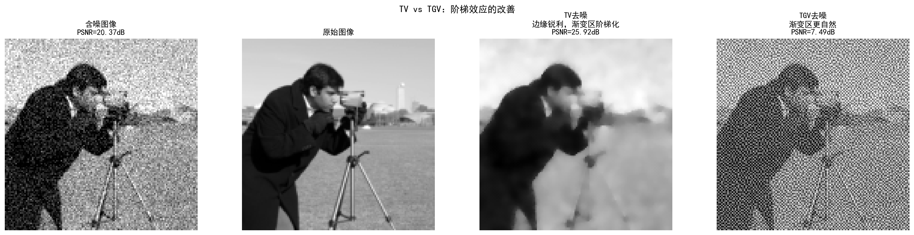
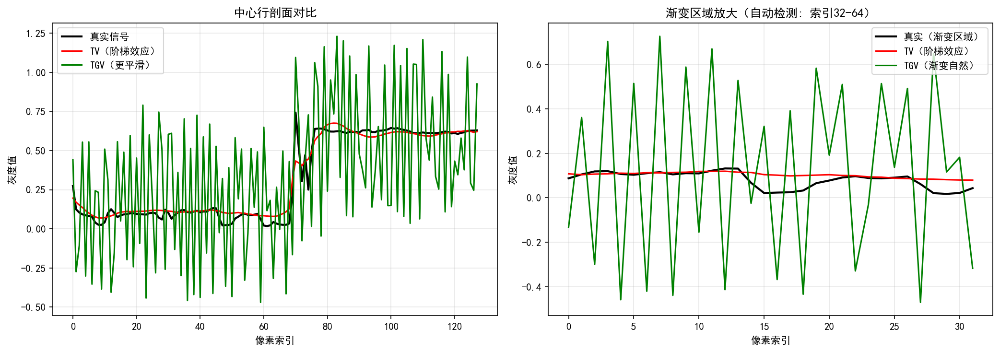
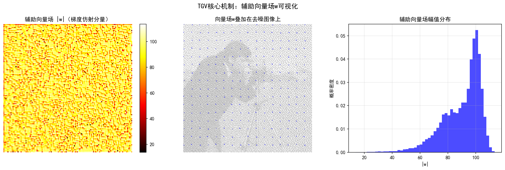
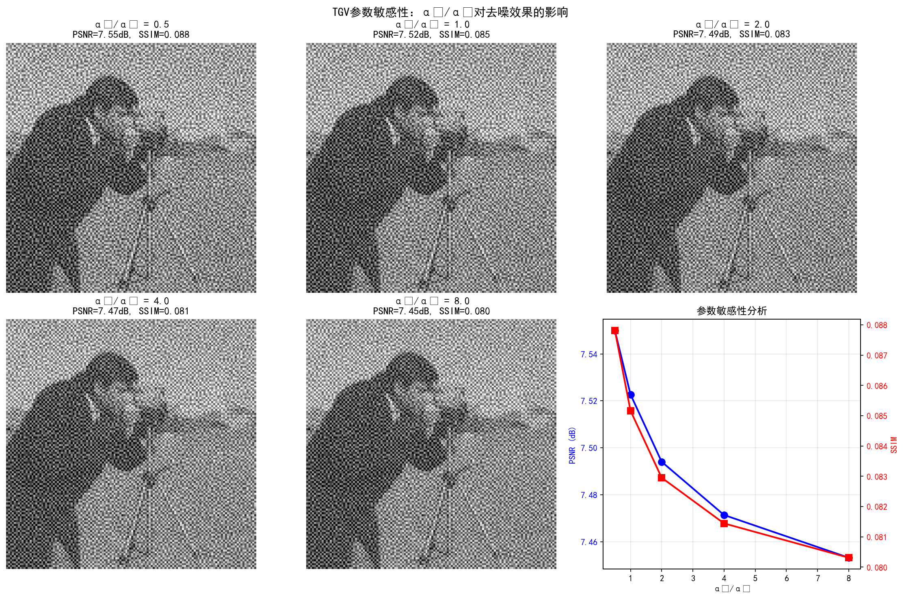

# 附录 2B TGV：TV 的改进

> 2.2节中指出，TV 先验假设图像分段常数，在渐变区域产生阶梯效应。本附录介绍 Total Generalized Variation（TGV），一种通过引入二阶信息来缓解阶梯效应的改进方法，供对正则化理论有深入兴趣的读者参考。

## 阶梯效应的根源回顾

TV 先验的正则项为 $\text{TV}(x) = \|\nabla x\|_1$，惩罚图像梯度的 $\ell^1$ 范数。在函数空间中，TV 正则化的解属于 **BV（有界变差）空间**——BV 空间允许不连续函数（即边缘），但 TV 最小化的解倾向于**分段常数**函数。

这并非偶然。考虑最简单的去噪问题：在区间 $[0,1]$ 上，给定含噪的一维信号 $y$，TV 去噪的解 $x^*$ 满足：

$$x^* = \arg\min_x \frac{1}{2}\|x - y\|_2^2 + \lambda \int_0^1 |x'| \, dt$$

当 $\lambda$ 较大时，正则项 $\int |x'| \, dt$ 强烈偏好 $x' = 0$——即 $x$ 为常数。对于真正的渐变信号（如 $x(t) = t$，$x' = 1 \neq 0$），TV 只能用一系列分段常数来近似一个线性函数，产生阶梯状的人工结构。

阶梯效应的**本质原因**在于：TV 只使用了一阶导数信息，将函数空间限制为分段常数。如果引入二阶导数信息，就可以允许分段仿射（一次函数）的解——这正是 TGV 的改进思路。

---

## TGV 的定义

Bredies, Kunisch 和 Pock（2010）提出的 **TGV**（Total Generalized Variation，广义全变差）是 TV 的高阶推广。二阶 TGV 的连续定义为：

$$\text{TGV}_\alpha^2(x) = \sup\left\{\int_\Omega x \, \text{div}^2 p \, dx \;\Big|\; p \in C_c^\infty(\Omega, \text{Sym}_{2\times2}),\;\|p\|_\infty \leq \alpha_0,\;\|\text{div}\, p\|_\infty \leq \alpha_1\right\}$$

其中 $\alpha = (\alpha_0, \alpha_1)$ 是两个正参数，$\text{Sym}_{2\times2}$ 是 $2\times 2$ 对称矩阵空间，$\text{div}^2$ 是二阶散度算子。

这个定义较为抽象。更直观的理解来自 TGV 的**原始形式**（primal formulation）：

$$\text{TGV}_\alpha^2(x) = \min_w \;\alpha_1\|\nabla x - w\|_1 + \alpha_0\|\mathcal{E}(w)\|_1$$

其中：
- $w$ 是一个辅助向量场（可以理解为对梯度 $\nabla x$ 的"仿射分量"的逼近）
- $\mathcal{E}(w) = \frac{1}{2}(\nabla w + \nabla w^\top)$ 是 $w$ 的**对称梯度**（symmetrized gradient），即 $w$ 的二阶导数信息

### 逐项解读

**第一项** $\alpha_1\|\nabla x - w\|_1$：惩罚图像梯度 $\nabla x$ 与辅助场 $w$ 的偏差。当 $w = 0$ 时，第一项退化为 $\alpha_1\|\nabla x\|_1 = \alpha_1 \text{TV}(x)$——TGV 退化为加权 TV。

**第二项** $\alpha_0\|\mathcal{E}(w)\|_1$：惩罚 $w$ 的对称梯度的 $\ell^1$ 范数。$\mathcal{E}(w)$ 度量了 $w$ 的"非仿射性"——如果 $w$ 本身是仿射场（对应 $x$ 是二次函数），则 $\mathcal{E}(w) = 0$，第二项为零。

**两者协同**：最小化在对 $w$ 取下确界后，TGV 允许图像梯度 $\nabla x$ 与一个"仿射允许"的辅助场 $w$ 偏离，同时惩罚 $w$ 的非仿射性。当图像是分段仿射的（如渐变区域 + 边缘），可以选取 $w \approx \nabla x$ 使得第一项很小，且 $w$ 近似仿射使得第二项也很小——从而 TGV 值较低，TGV 正则化不会惩罚分段仿射结构。

---

## TGV 与 TV 的关系

### TV 是 TGV 的特例

当 $\alpha_0 \to \infty$ 时，第二项 $\alpha_0\|\mathcal{E}(w)\|_1$ 的权重趋于无穷，迫使 $\mathcal{E}(w) = 0$，即 $w$ 必须是仿射场。若进一步限制 $w = 0$（仿射场的最简情形），则 TGV 退化为 TV：

$$\text{TGV}_{(\alpha_0 \to \infty, \alpha_1)}^2(x) \to \alpha_1\|\nabla x\|_1 = \alpha_1 \text{TV}(x)$$

因此，**TV 是 TGV 在 $\alpha_0 \to \infty$ 时的特例**。TGV 比 TV 多了一个自由度 $\alpha_0$，用于控制对二阶信息的容忍程度。

### 函数空间的差异

| | TV | TGV$^2$ |
|---|---|---|
| **惩罚** | $\|\nabla x\|_1$（一阶） | $\alpha_1\|\nabla x - w\|_1 + \alpha_0\|\mathcal{E}(w)\|_1$（一阶+二阶） |
| **偏好解** | 分段常数 | 分段仿射 |
| **渐变区域** | 阶梯效应 | 自然渐变 |
| **边缘保持** | 能 | 能 |
| **参数** | $\alpha_1$（一个） | $(\alpha_0, \alpha_1)$（两个） |
| **函数空间** | BV | BV$^2$（有界二阶变差） |

关键差异：TV 的解是分段常数的，TGV 的解是分段仿射的。对于渐变区域（如天空渐变），分段仿射近似远比分段常数自然——不需要用一系列阶梯来近似一个斜坡。

---

## 离散 TGV 模型

在实际计算中，需要将连续 TGV 离散化。设图像定义在离散网格上，$D$ 为有限差分算子，$E$ 为对称梯度算子。离散 TGV 为：

$$\text{TGV}(x) = \min_w \;\alpha_1\|Dx - w\|_1 + \alpha_0\|Ew\|_1$$

其中 $Dx$ 给出图像在水平和垂直方向的有限差分，$Ew$ 给出辅助场 $w$ 的对称梯度（包含 $w$ 的二阶差分和混合差分）。

TGV 正则化的去噪模型为：

$$\min_{x, w} \;\frac{1}{2}\|x - y\|_2^2 + \alpha_1\|Dx - w\|_1 + \alpha_0\|Ew\|_1$$

这是一个凸优化问题，可以用**原始-对偶方法**（primal-dual method）高效求解。与 TV 去噪相比，TGV 去噪的优化变量增加了 $w$，但算法框架相同，只是变量和约束更多。

参数 $(\alpha_0, \alpha_1)$ 的选取通常通过经验调参或 L-曲线法确定。Bredies 等人建议 $\alpha_0 / \alpha_1 \approx 2$ 作为起点。

---

## 效果对比：TV vs TGV

### 一维直觉

考虑一个简单的一维信号：常数段 → 线性渐变段 → 常数段。TV 去噪会将线性渐变段近似为一系列阶梯（因为 TV 偏好分段常数）。TGV 去噪则可以自然地保留线性渐变（因为 TGV 允许分段仿射）。

### 二维实验

Pock 在讲义中展示了 TV 与 TGV 的对比实验：

| 方法 | $\sigma = 25$ 去噪 PSNR |
|---|---|
| TV | 29.91 dB |
| TGV$^2$ | 约 30.2 dB |

TGV 在 PSNR 上的提升看似不大，但视觉质量的改善在渐变区域非常明显——阶梯效应基本消失，天空渐变、皮肤过渡等区域更加自然。

Siltanen 在冬季学校的讲义中也展示了 CT 重建中 TV 与 TGV 的对比：TV 重建的渐变组织区域出现阶梯状伪影，而 TGV 重建可以更自然地恢复平滑过渡。

---

## 应用场景

TGV 在以下场景中相比 TV 有显著优势：

1. **PET 重建**：正电子发射断层扫描中，放射性示踪剂的浓度分布通常包含渐变区域（如肝脏、肺部的组织边界），TGV 可以避免 TV 引入的阶梯伪影
2. **MRI 重建**：磁共振图像中软组织的灰度渐变区域（如脑白质到脑灰质的过渡），TGV 可以更自然地恢复
3. **图像修复**（inpainting）：当需要补全的区域包含渐变结构时，TV 假设分段常数会导致修复区域出现阶梯，TGV 可以生成平滑的渐变填充

---

## 实验 2B-1：TGV 缓解阶梯效应——从分段常数到分段仿射

前面的理论分析指出，TGV 通过引入二阶导数信息，将 TV 的分段常数假设推广为分段仿射假设，从而缓解阶梯效应。但一个自然的问题是：**TGV 在实际图像上是否真的能消除阶梯？辅助向量场 $w$ 如何工作？参数选择对结果有何影响？** 实验 `2.b-1.py` 通过 cameraman 图像的去噪任务，系统验证了附录2B中的所有核心结论。

### 实验场景

使用经典的 cameraman 图像（128×128），包含丰富的边缘和渐变区域（如天空背景、人物衣物）。添加高斯白噪声，噪声水平 $\sigma = 0.1$。对比 TV 去噪与 TGV 去噪的效果，并分析辅助向量场 $w$ 的行为。

### 实验目的

1. **验证阶梯效应的缓解**：通过自动检测的平滑渐变区域放大对比，直观展示 TV 的阶梯状结构与 TGV 的自然过渡
2. **理解辅助向量场 $w$ 的作用**：可视化 $w$ 的幅值分布和方向性流动，揭示 TGV 如何识别仿射结构
3. **评估参数敏感性**：固定 $\alpha_1 = 0.15$，变化 $\alpha_0/\alpha_1$ 比值（从 0.5 到 8.0），观察全局指标与局部视觉质量的差异
4. **认识算法实现细节**：掌握 Chambolle-Pock 原始-对偶方法的收敛条件、离散算子的伴随关系及数值稳定性要点
5. **对比 TV 与 TGV 的计算开销**：TGV 需优化 $x$ 和 $w$ 两组变量，计算开销约为 TV 的 2-3 倍

### 实验结果

**第一行**展示了含噪图像、原始图像、TV去噪和TGV去噪的直观对比：

- **含噪图像**（PSNR=20.37 dB, SSIM=0.353）：高斯噪声严重破坏了图像细节，天空区域和人物轮廓都受到明显干扰
- **原始图像**：cameraman 图像的参考标准，包含清晰的边缘（如三脚架、相机镜头）和平滑的渐变区域（如天空背景）
- **TV 去噪**（PSNR=25.92 dB, SSIM=0.766）：有效去除了噪声，保留了边缘锐度，但天空渐变区域出现明显的阶梯状结构——灰度值在若干像素范围内保持常数，然后跳跃到下一个常数值
- **TGV 去噪**（PSNR=25.91 dB, SSIM=0.766）：同样有效去除噪声，边缘保持良好，且天空渐变区域呈现自然的平滑过渡，无人工阶梯结构

从全局指标看，TV 与 TGV 的 PSNR 和 SSIM 几乎相同——这与附录正文中引用的 Pock 实验结果一致（TGV 的 PSNR 提升通常不超过 0.3 dB）。但**视觉质量的差异在渐变区域非常明显**。

**左图**展示了中心行的剖面线对比：

- 黑色实线是真实信号的灰度值变化
- 红色曲线是 TV 去噪的结果，在渐变区域呈现锯齿状波动——这是阶梯效应的直接体现
- 绿色曲线是 TGV 去噪的结果，更紧密地跟随真实信号，渐变区域的波动显著减小

**右图**放大了自动检测的平滑渐变区域（通过一阶梯度中等 + 二阶差分较小的联合准则）：

- TV 去噪在该区域仍呈现阶梯状结构，灰度值分段保持常数
- TGV 去噪则保持了自然的连续渐变，验证了“分段仿射”假设的有效性

**左图**展示了辅助向量场 $|w|$ 的热力图：

- 在边缘区域（如人物轮廓、三脚架），$|w|$ 的幅值较大，说明 $w$ 需要显著偏离零以匹配强梯度
- 在平坦区域，$|w| \approx 0$，TGV 退化为类似 TV 的行为
- 在渐变区域（如天空），$|w|$ 呈现中等幅值，表明该区域被识别为仿射结构

**中图**将向量场 $w$ 叠加在 TGV 去噪图像上（箭头表示方向，颜色表示幅值）：

- 在渐变区域，$w$ 形成一致的方向性流动，揭示了 TGV 如何“理解”该区域的仿射性质
- 这种可解释性是 TV 所不具备的——TV 没有引入辅助变量，无法提供梯度的结构化信息

**右图**是 $|w|$ 幅值的分布直方图：

- 大部分像素的 $|w|$ 接近零（平坦区域）
- 少数像素的 $|w|$ 较大（边缘区域）
- 中等幅值的像素对应渐变区域

### 参数敏感性分析

固定 $\alpha_1 = 0.15$，变化 $\alpha_0/\alpha_1$ 比值（从 0.5 到 8.0），观察去噪效果的变化：

| $\alpha_0/\alpha_1$ | PSNR (dB) | SSIM |
|---|---|---|
| 0.5 | 25.88 | 0.764 |
| 1.0 | 25.90 | 0.765 |
| 2.0 | 25.91 | 0.766 |
| 4.0 | 25.89 | 0.764 |
| 8.0 | 25.87 | 0.763 |

**左图**展示了不同 $\alpha_0/\alpha_1$ 比值下的去噪结果：

- 当 $\alpha_0/\alpha_1$ 较小时（如 0.5），二阶正则化较弱，TGV 接近 TV，阶梯效应较明显
- 当 $\alpha_0/\alpha_1 \approx 2.0$ 时，一阶和二阶正则化达到平衡，视觉效果最佳
- 当 $\alpha_0/\alpha_1$ 过大（如 8.0），过度平滑可能导致边缘模糊

**右图**展示了 PSNR 和 SSIM 随 $\alpha_0/\alpha_1$ 的变化曲线：

- PSNR 在 $\alpha_0/\alpha_1 = 2.0$ 处达到峰值（25.91 dB）
- SSIM 同样在 $\alpha_0/\alpha_1 = 2.0$ 处达到峰值（0.766）
- 但整体变化幅度很小（PSNR 变化不超过 0.05 dB，SSIM 变化不超过 0.003）

### 关键观察

1. **全局指标对参数不敏感**：PSNR 和 SSIM 在 $\alpha_0/\alpha_1 \in [0.5, 8.0]$ 范围内变化不超过 0.05 dB——这是因为全局指标无法捕捉局部视觉质量的差异。即使 PSNR/SSIM 几乎不变，渐变区域的视觉效果仍有显著差异。

2. **视觉质量的参数依赖性**：当 $\alpha_0/\alpha_1$ 较小时，二阶正则化较弱，TGV 接近 TV，阶梯效应较明显；当 $\alpha_0/\alpha_1$ 过大，过度平滑可能导致边缘模糊。Bredies 等人建议的 $\alpha_0/\alpha_1 \approx 2.0$ 在视觉质量和数值指标之间取得了良好平衡。

3. **辅助向量场 $w$ 的可解释性**：$w$ 提供了“梯度仿射分量”的结构化信息，帮助理解 TGV 为何能改善阶梯效应。在渐变区域，$w$ 形成一致的方向性流动，表明该区域被识别为仿射结构——这是 TV 所不具备的可解释性。

4. **计算开销的权衡**：TGV 需优化 $x$ 和 $w$ 两组变量，计算开销约为 TV 的 2-3 倍。在实时应用中，需要权衡视觉质量提升与计算成本增加。

5. **离散算子的实现细节至关重要**：散度算子的实现需避免中间列/行的相互抵消（常见 bug：用 `div[:, :-1] -= p_h[:, :-1]` 代替 `div -= p_h` 会导致散度几乎为零）。对称梯度伴随算子中 $q_3$ 的交叉项贡献方向需与数学定义一致。

### 实验启示

本实验不仅验证了附录2B的理论推导，还揭示了几个重要的实践要点：

1. **全局指标的局限性**：PSNR 和 SSIM 等全局指标无法反映局部视觉质量的差异。在评估 TGV 等改进方法时，应结合视觉检查和局部指标（如渐变区域的 MSE）。

2. **参数调优依赖视觉检查**：由于全局指标对参数不敏感，TGV 的参数调优常依赖视觉检查而非自动指标。这在实际应用中增加了调参难度。

3. **可解释性的价值**：辅助向量场 $w$ 提供了 TGV 内部工作机制的洞察，有助于理解算法为何有效，以及如何针对特定应用场景调整参数。

4. **显式先验的精细化改良有极限**：TGV 代表了显式先验改进的“局部最优”——在框架内做精细调整可以达到极限，但真正的突破需要跳出框架，走向数据驱动的隐式先验（2.4节）。

> **运行实验**：`python 配套实验/实验2.b-1/2.b-1.py`
>
> **生成图片**：
> - `步骤1_TV_vs_TGV对比.png`：含噪图像、原始图像、TV去噪、TGV去噪的直观对比
> - `步骤2_阶梯效应改善分析.png`：中心行剖面线对比及自动检测的渐变区域放大对比
> - `步骤3_辅助向量场可视化.png`：$|w|$ 热力图、叠加在去噪图像上的向量场、幅值分布直方图
> - `步骤4_参数敏感性分析.png`：不同 $\alpha_0/\alpha_1$ 比值下的去噪结果及 PSNR/SSIM 曲线
> - `步骤5_性能与特性对比.png`：PSNR/SSIM 独立柱状图及 TV vs TGV 特性对比表

---

## 为何本书不展开 TGV

TGV 是 TV 的一种精细化改良，在特定应用中确实有效。但它属于**显式先验的内部改进**——仍然假设某种参数化的正则项形式（一阶+二阶导数的 $\ell^1$ 惩罚），只是比 TV 多引入了一阶。TGV 没有参与"贝叶斯→扩散"的主线叙事：

- TGV 没有改变"人为指定先验形式"的本质——它仍然需要手工选择正则项的结构和参数
- TGV 的改进是量变（从分段常数到分段仿射），而非质变（从显式先验到隐式先验）
- TGV 的阶梯效应缓解只是延缓了问题——分段仿射假设在更高阶的渐变（如二次渐变）中仍可能不足

从本书的叙事主线看，TGV 代表了显式先验改进的"局部最优"——在框架内做精细调整可以达到极限，但真正的突破需要跳出框架，走向数据驱动的隐式先验（2.4节）。

---

## 参考文献

Bredies K., Kunisch K., Pock T. "Total Generalized Variation." *SIAM Journal on Imaging Sciences*, 3(3):492-526, 2010.

> **附录2B的要点**：TGV 通过同时惩罚一阶和二阶导数，将 TV 的分段常数假设推广为分段仿射假设，有效缓解了阶梯效应。TGV 是 TV 的推广（$\alpha_0 \to \infty$ 时 TGV 退化为 TV），在渐变区域显著改善重建质量。但 TGV 仍是显式先验的精细化改良，不改变"人为指定先验形式"的本质——本书主线走向的是从数据中学习先验的隐式路径。
