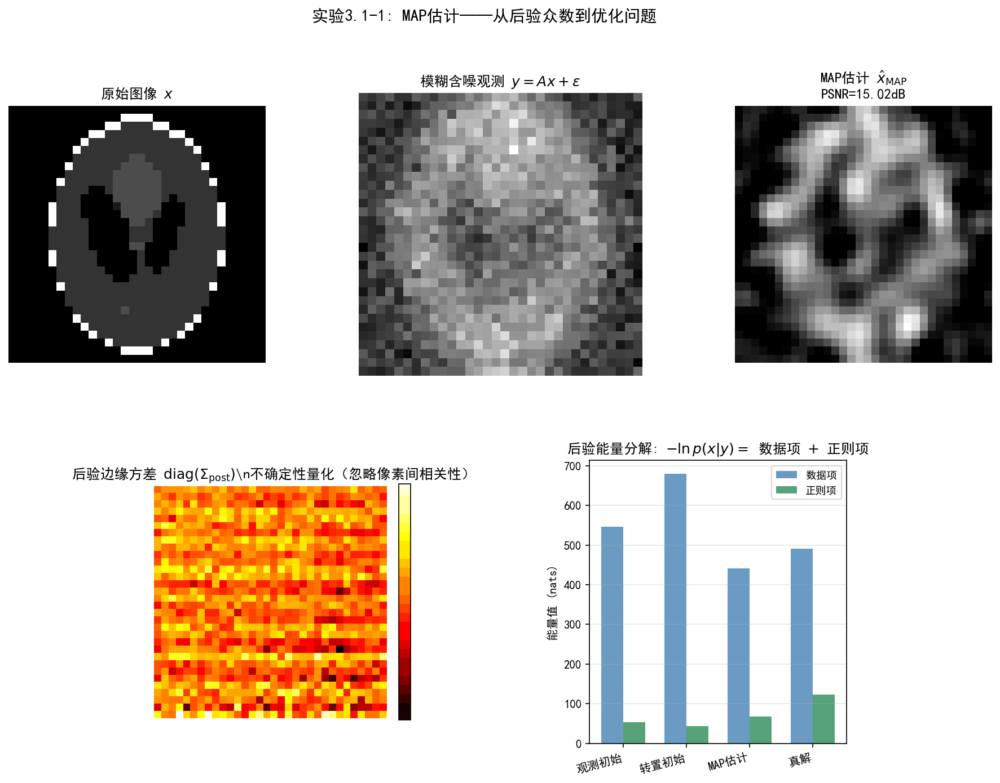

# 3.1 MAP估计：从后验众数到优化问题

> **核心观点**：MAP估计将"从后验中找最可能的 $x$"转化为一个优化问题——最小化后验能量。这是贝叶斯框架与正则化方法之间最直接的桥梁，也是全书"优化视角"的起点。

## 回顾：后验分布已定，如何提取答案？

第1章建立了贝叶斯框架：$p(x|y) \propto p(y|x) \cdot p(x)$，将数据信息（似然）与先验知识（先验）融合为统一的后验分布。第2章则系统回答了先验的选择问题——不同的先验编码关于 $x$ 的不同假设，取负对数后对应不同的正则项。

现在，后验分布的形式已经完全确定。但确定形式不等于解决问题：后验分布 $p(x|y)$ 是一个定义在高维空间 $\mathbb{R}^n$（$n$ 可达 $10^6$）上的概率密度函数，我们无法直接"看"它，更无法直接从它上面"读"出答案。必须从中**提取**有用的信息。

第2章末尾已预告了两种提取策略：

- **取后验均值**（MMSE估计器）：$\hat{x}_{\text{MMSE}} = \mathbb{E}[x|y] = \int x \, p(x|y) \, \mathrm{d}x$——利用后验的全部信息，需要积分
- **取后验众数**（MAP估计器）：$\hat{x}_{\text{MAP}} = \arg\max_x p(x|y)$——利用后验的局部信息，只需优化

本章走第二条路。原因很简单：**优化比积分容易得多**。MAP估计将贝叶斯推断转化为我们熟悉的优化问题，这是计算友好的选择，也是建立整个优化工具箱的逻辑起点。

---

## MAP的定义与概率意义

### 定义：后验众数

MAP（Maximum A Posteriori）估计器定义为使后验概率密度最大的点：

$$\hat{x}_{\text{MAP}} = \arg\max_{x} \, p(x|y)$$

直观地说，MAP估计是"给定观测 $y$ 后，最可能的 $x$"——它选择后验分布的**众数**（mode），即概率密度最高的那个点。

### 从最大化到最小化：取负对数

直接操作概率密度不便优化，取负对数后：

$$\hat{x}_{\text{MAP}} = \arg\max_{x} \, p(x|y) = \arg\min_{x} \big[-\ln p(x|y)\big]$$

由于 $-\ln(\cdot)$ 是严格单调递减函数，最大化 $p(x|y)$ 等价于最小化 $-\ln p(x|y)$。这正是1.5节和2.1节已经用过的"概率→能量"转换：概率空间中的"找最高点"变为能量空间中的"找最低点"。

将贝叶斯定理代入：

$$-\ln p(x|y) = \underbrace{-\ln p(y|x)}_{\text{数据项 } D(x)} + \underbrace{(-\ln p(x))}_{\text{正则项 } R(x)} + \underbrace{\ln p(y)}_{\text{与 } x \text{ 无关}}$$

忽略与 $x$ 无关的常数项 $\ln p(y)$，MAP估计等价于**最小化后验能量函数**：

$$\boxed{\hat{x}_{\text{MAP}} = \arg\min_{x} \big\{D(x) + R(x)\big\} = \arg\min_{x} \big\{-\ln p(y|x) - \ln p(x)\big\}}$$

这个等式是贝叶斯推断与正则化优化之间最直接的桥梁：左边是概率论语言——"最可能的 $x$ 是什么"，右边是优化语言——"最小化后验能量"。

### 在Bregman散度损失下的最优性

MAP估计器不仅在直觉上合理——"选最可能的点"——而且在贝叶斯决策理论中有严格的最优性保证。2.3节已经给出了MMSE估计器的最优性：它在平方损失 $\ell(\hat{x}, x) = \|\hat{x} - x\|_2^2$ 下是最优的。MAP估计器的最优性则需要另一种损失函数。

假设后验分布是**对数凹**（log-concave）的，即 $p(x|y) \propto \exp\{-\phi_y(x)\}$，其中 $\phi_y(x)$ 是凸函数。定义**Bregman散度**（Bregman divergence）：

$$D_{\phi}(u, x) = \phi(u) - \phi(x) - \langle \nabla\phi(x), \, u - x \rangle$$

Bregman散度度量了 $\phi$ 在 $u$ 处的值与其在 $x$ 处的一阶Taylor近似之间的差距。它是非负的（由凸性保证），但一般**不对称**：$D_\phi(u, x) \neq D_\phi(x, u)$。

**关键定理**（Pereyra, 2019）：在对数凹后验下，**MAP估计器是在Bregman散度损失下的贝叶斯最优估计器**：

$$\hat{x}_{\text{MAP}} = \arg\min_{u} \, \mathbb{E}\big[D_{\phi}(u, x) \,\big|\, y\big] = \arg\min_{u} \int D_{\phi}(u, x) \, p(x|y) \, \mathrm{d}x$$

更引人注目的是，将Bregman散度的两个参数互换，恰好得到MMSE估计器：

$$\hat{x}_{\text{MMSE}} = \arg\min_{u} \, \mathbb{E}\big[D_{\phi}(x, u) \,\big|\, y\big] = \arg\min_{u} \int D_{\phi}(x, u) \, p(x|y) \, \mathrm{d}x$$

这揭示了一个优美的对偶结构：

| 损失函数 | 最优估计器 | 利用后验信息的方式 |
|---------|---------|----------------|
| 平方损失 $\|u - x\|_2^2$ | MMSE（后验均值） | 对后验全空间积分 |
| Bregman散度 $D_\phi(u, x)$ | MAP（后验众数） | 找后验密度的最高点 |
| 反Bregman散度 $D_\phi(x, u)$ | MMSE（后验均值） | 对后验全空间积分 |

注意第三行与第一行给出的都是MMSE估计器，但它们来自不同的损失函数——平方损失是Bregman散度的特例（$\phi = \frac{1}{2}\|\cdot\|^2$ 时 $D_\phi(u,x) = \frac{1}{2}\|u-x\|^2$），而反Bregman散度则是更一般的损失族。

> **MAP与MMSE：同一后验下的两种"问法"**。MMSE问"哪个 $u$ 使期望平方误差最小？"——它需要遍历后验的所有可能性。MAP问"哪个 $u$ 使期望Bregman散度最小？"——它恰好落在后验的众数上。两者不是谁对谁错，而是对后验分布的不同利用方式。在高斯后验下，众数=均值，两种"问法"给出相同的答案；在非高斯后验下，分歧出现——这正是2.3节讨论过的MMSE与MAP分歧的决策论根源。

---

## 从概率到优化：后验能量最小化

### 推导：MAP = 数据拟合 + 正则化

将MAP估计的具体形式展开。设观测模型 $y = Ax + \varepsilon$，$\varepsilon \sim \mathcal{N}(0, \sigma^2 I)$（高斯噪声），先验 $p(x) \propto \exp(-\theta_g \, g(x))$（属于指数族的先验），则：

**第一步**：写出似然和先验

$p(y|x) \propto \exp\!\Big(-\frac{1}{2\sigma^2}\|y - Ax\|_2^2\Big), \quad p(x) \propto \exp\!\big(-\theta_g \, g(x)\big)$

**第二步**：取负对数，丢弃与 $x$ 无关的常数

$-\ln p(x|y) = \underbrace{\frac{1}{2\sigma^2}\|y - Ax\|_2^2}_{\text{数据项}} + \underbrace{\theta_g \, g(x)}_{\text{正则项}} + \text{const}$

**第三步**：乘以 $2\sigma^2$，令 $\lambda = 2\sigma^2\theta_g$

$\hat{x}_{\text{MAP}} = \arg\min_{x} \big\{\|y - Ax\|_2^2 + \lambda \, g(x)\big\}$

这正是变分正则化的标准形式：**数据拟合项 $\|y-Ax\|_2^2$ + 正则项 $\lambda g(x)$**。其中 $\lambda = 2\sigma^2\theta_g$——正则化参数由噪声参数与先验参数共同决定，这再次验证了2.1节的结论：**正则化参数不是任意常数，而是有明确概率含义的物理量**。

### 因果链：先验→正则项→优化困难→求解算法

MAP估计将贝叶斯推断转化为优化问题，但"好不好解"取决于目标函数的性质——而目标函数的性质完全由先验的选择决定。这就形成了一条清晰的因果链：

**先验的选择** → **正则项的形式** → **目标函数的优化困难** → **需要的求解算法**

不同先验在这条因果链上的走向如下：

| 先验 | 先验密度 $p(x)$ | 正则项 $R(x)$ | 目标函数性质 | 优化困难 | 求解算法 |
|---|---|---|---|---|---|
| 高斯 | $\propto \exp(-\frac{1}{2\sigma_x^2}\|x\|_2^2)$ | $\|x\|_2^2$ | 光滑凸 | 无（有闭式解） | 直接求解 / 梯度下降 |
| Laplace | $\propto \exp(-\alpha\|x\|_1)$ | $\|x\|_1$ | 凸但不可微 | 梯度不存在 | 近端方法（ISTA/FISTA） |
| TV | $\propto \exp(-\alpha\|\nabla x\|_1)$ | $\|\nabla x\|_1$ | 复合不可微 | 近端算子无闭式解 | 原始-对偶（Chambolle-Pock） |

这张表是本章后续各节的导航图：

- **3.2节**将建立优化基础——凸性、光滑性、梯度下降——为分析目标函数的"好不好解"提供工具
- **3.3节**处理最简单的情况：高斯先验→Tikhonov正则化，目标函数光滑凸，有闭式解和迭代解
- **3.4节**处理Laplace先验：$\ell_1$ 正则项不可微，梯度下降失效，引入近端算子和ISTA/FISTA算法
- **3.5节**处理TV先验：梯度算子 $\nabla$ 使近端算子无闭式解，需要原始-对偶算法

每一步，都是前一步遇到新困难后的发展——先验的选择决定了困难的类型，算法的进步回应了困难的挑战。

### 一个完整的例子：高斯先验+高斯似然=Tikhonov正则化

最经典的例子是高斯先验与高斯似然的组合——这在1.5节和2.1节已经出现过，但这里从MAP求解的视角重新审视。设：

- 似然：$p(y|x) = \mathcal{N}(Ax, \sigma^2 I)$
- 先验：$p(x) = \mathcal{N}(0, \sigma_x^2 I)$

MAP目标函数为：

$$\hat{x}_{\text{MAP}} = \arg\min_{x} \left\{\frac{1}{2\sigma^2}\|y - Ax\|_2^2 + \frac{1}{2\sigma_x^2}\|x\|_2^2\right\}$$

令 $\lambda = \sigma^2 / \sigma_x^2$，这正是**Tikhonov正则化**（岭回归）。由于高斯分布的共轭性，后验仍为高斯，MAP=MMSE，解有闭式形式：

$$\hat{x}_\lambda = (A^\top A + \lambda I)^{-1} A^\top y$$

这个简单的例子是理解更复杂方法的锚点：

1. **闭式解的存在性**依赖于高斯先验的可微性——一旦先验不可微（如Laplace），闭式解消失
2. **MAP=MMSE**依赖于后验的对称性——一旦后验偏斜（如Laplace先验），两者分歧
3. **正则化参数 $\lambda = \sigma^2 / \sigma_x^2$** 的概率含义清晰——但如何自动选取仍是实践中的难题（3.6节将讨论）

---

## 📌 实验3.1-1：MAP估计——后验能量分解

### 实验场景

在模糊逆问题场景下，验证MAP估计的核心性质。对32×32 Shepp-Logan phantom图像施加高斯模糊（$\sigma_{\text{blur}}=2.0$）和加性噪声（$\sigma=0.05$），在高斯先验（$\sigma_x=0.5$）下计算MAP闭式解。

### 实验目的

1. 验证 $-\ln p(x|y)$ 的分解结构：数据项（衡量与观测的一致性）+ 正则项（衡量与先验的一致性）
2. 对比不同初始点（观测初始、转置初始、MAP估计、真解）的后验能量，验证MAP解确实最小化后验能量
3. 验证 $\lambda = \sigma^2/\sigma_x^2$ 的概率来源，而非人为调参
4. 展示后验方差作为不确定性量化工具，为3.7节"MAP只是后验的一个点"埋下伏笔

### 实验输入

- 图像：32×32 Shepp-Logan phantom，归一化到 $[0, 1]$
- 模糊：高斯模糊核（$\sigma_{\text{blur}} = 2.0$）
- 噪声：加性高斯噪声（$\sigma = 0.05$）
- 先验标准差：$\sigma_x = 0.5$
- 正则化参数：$\lambda = \sigma^2/\sigma_x^2 = 0.01$

### 预期结果

- MAP解的后验能量最小，验证优化有效
- MAP解的PSNR优于朴素基线（观测初始、转置初始）
- 后验能量分解表清晰展示数据项与正则项的权衡
- 后验方差图展示重建不确定性的空间分布

### 实验结果

运行 `3.1-1.py` 后，生成一张图。



**参数设定**：
- 噪声标准差 $\sigma = 0.050$
- 先验标准差 $\sigma_x = 0.500$
- 正则化参数 $\lambda = \sigma^2/\sigma_x^2 = 0.0100$

**后验能量分解**（$-\ln p(x|y) = \text{数据项} + \text{正则项}$）：

| 方案 | 数据项 | 正则项 | 后验能量 | PSNR |
|------|--------|--------|----------|------|
| 观测初始 | 545.93 | 53.04 | 598.97 | 14.64 dB |
| 转置初始 | 679.18 | 43.59 | 722.78 | 14.60 dB |
| MAP估计 | 441.16 | 67.84 | **509.00** | **15.02 dB** |
| 真解 | 490.25 | 123.04 | 613.28 | N/A |

**核心验证**：
- MAP解的后验能量（509.00）< 观测初始（598.97），优化有效
- MAP解的后验能量（509.00）< 转置初始（722.78），进一步优化
- MAP解PSNR = 15.02 dB，显著优于观测初始 14.64 dB 和转置初始 14.60 dB
- $\lambda = \sigma^2/\sigma_x^2 = 0.01$ 有明确的概率意义（信噪比的倒数）

> 观测初始代表"不做任何复原处理"，是实践中最常见的朴素基线。

### 补充说明

本实验印证了3.1节的核心论点：

1. **MAP = 最大化后验 = 最小化后验能量**：MAP估计将"从后验中找最可能的x"转化为最小化 $-\ln p(x|y)$。本实验中MAP解的后验能量（509.00）显著低于两个初始点（598.97和722.78），数值验证了优化目标的有效性。

2. **后验能量分解的直观理解**：后验能量 = 数据项 + 正则项，两项分别衡量"与观测的一致性"和"与先验的一致性"。对比MAP解与真解：
   - MAP解：数据项441.16（较小，与观测更一致），正则项67.84（较小，与先验更一致）
   - 真解：数据项490.25（较大），正则项123.04（较大）
   - 真解的后验能量（613.28）反而高于MAP解——这说明MAP解不是"真解"，而是在"数据一致性"与"先验一致性"之间取得最优平衡的估计。

3. **$\lambda$ 的概率意义**：$\lambda = \sigma^2/\sigma_x^2 = 0.01$ 不是人为调参的结果，而是噪声方差与先验方差之比。这呼应了本节"正则化参数 $\lambda = \sigma^2 / \sigma_x^2$ 的概率含义清晰"——在正则化方法中需要调参的旋钮，在贝叶斯框架中有明确的物理来源。

4. **后验方差 = 不确定性量化**：闭式解不仅给出点估计 $\mu_{\text{post}}$，还给出后验协方差 $\Sigma_{\text{post}}$。后验方差图展示了重建不确定性的空间分布——模糊核中心和图像边缘处不确定性较高。这呼应了2.1节对应表中"概率框架独有"的后验方差，也为3.7节"MAP只是后验的一个点"的讨论埋下伏笔。

5. **观测初始 vs 转置初始**：观测初始代表"不做任何复原处理"，是实践中最常见的朴素基线；转置初始（$A^\top y$）代表匹配滤波输出，质量较好但仍非最优。两者PSNR相近（14.64 vs 14.60 dB），但后验能量差异显著（598.97 vs 722.78）——这说明后验能量是比PSNR更本质的评价指标。

6. **闭式解的存在性**：高斯先验+高斯似然的共轭性使后验为高斯分布，MAP=MMSE，闭式解可直接计算。这呼应了本节"在共轭高斯-高斯模型下，MAP解有闭式形式"——这是所有MAP问题中最简单的情形，也是理解更复杂方法的锚点。

> 注：本实验中后验方差展示的是边缘方差 $\text{diag}(\Sigma_{\text{post}})$，忽略了非对角元（像素间相关性）。实际后验分布中像素之间存在相关性，完整的不确定性量化需要后验协方差矩阵的全部信息。非高斯后验的不确定性量化见第4章（MCMC/ULA采样方法）。

---

## MAP的适用范围与局限

### 优势：计算友好

MAP估计的核心优势在于**将积分问题转化为优化问题**：

- **MMSE**：$\hat{x}_{\text{MMSE}} = \int x \, p(x|y) \, \mathrm{d}x$——需要在高维空间中计算积分，计算代价极高
- **MAP**：$\hat{x}_{\text{MAP}} = \arg\min_x \{D(x) + R(x)\}$——只需要优化，不需要积分

对于凸目标函数（如Tikhonov、LASSO、ROF模型），MAP估计有成熟的凸优化算法（梯度下降、近端方法、原始-对偶算法等）可以高效求解。即使目标函数非凸（如某些非凸正则化），也有随机梯度下降等启发式方法可用。这种计算上的便利性，是MAP估计在实践中被广泛采用的根本原因。

### 局限：只给出众数，丢失后验的形状信息

MAP估计的局限同样源于"优化替代积分"：**它只给出后验众数这一个点，而完全丢弃了后验分布的形状信息**。后验分布可能携带丰富的信息——而这些信息在MAP估计中被彻底忽略：

- **不确定性**：后验方差告诉我们"重建结果有多可靠"——MAP无法提供
- **多峰性**：多解逆问题（如有限角CT）中，后验可能有多个峰——MAP只给最高的那个峰，其他物理上合理的解被忽略
- **偏斜与重尾**：后验分布可能严重偏斜或具有重尾——众数远不代表"典型"样本

这些局限将在3.7节展开讨论。此处只需记住：MAP估计是一种强大的**点估计**工具，但点估计终究只是后验的一个切面——后验的完整信息需要采样或近似才能获得。

---

## 本节小结

本节的核心信息可以浓缩为一个等式和一个因果链：

**一个等式**：MAP = 后验众数 = 后验能量最小化。取负对数后，贝叶斯框架中的"最大化后验概率"与变分方法中的"最小化后验能量"是同一枚硬币的两面。MAP估计器在Bregman散度损失下具有最优性，与MMSE估计器在平方损失下的最优性形成对偶——两者是同一后验下不同的"问法"。

**一个因果链**：先验→正则项→优化困难→求解算法。MAP将贝叶斯推断转化为优化问题，但优化的难度取决于目标函数的性质，而目标函数的性质由先验决定。高斯先验给出光滑凸问题（3.3节），Laplace先验引入不可微性（3.4节），TV先验带来复合结构（3.5节）——先验的选择不仅决定解的形态（第2章结论），也决定求解的难度。

MAP估计在数学上等价于一个优化问题。优化问题的"好不好解"，取决于目标函数的性质——凸性保证解的唯一性，光滑性决定梯度信息是否可用，强制性保证解的存在性。这些正是建立优化工具箱的基础。

---

```
3.1 MAP=后验众数=优化问题
      │
      │ "优化需要什么条件？"
      ▼
3.2 优化基础：凸性、光滑性与梯度下降
```
