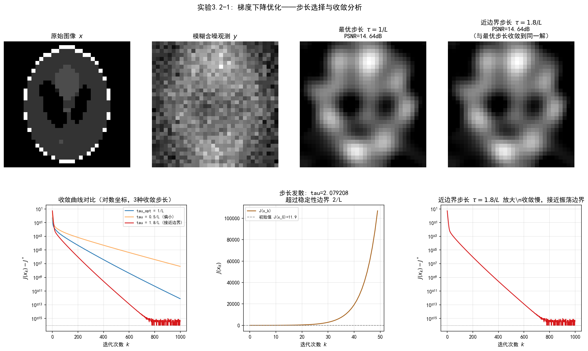

# 3.2 优化基础：凸性、光滑性与梯度下降

> **核心观点**：MAP优化问题的"好不好解"，取决于目标函数的凸性（是否有唯一解）和光滑性（梯度是否可用）。梯度下降是最基本的迭代求解框架，其收敛性由Lipschitz条件和步长选择保证。

## 从MAP到优化：我们需要什么条件？

3.1节建立了MAP估计与优化问题的等价关系：$\hat{x}_{\text{MAP}} = \arg\min_x \{D(x) + \lambda R(x)\}$。现在的问题是：这个优化问题**好不好解**？

"好不好解"取决于目标函数的三个关键性质：

1. **凸性**（convexity）：解是否唯一？局部极小是否就是全局极小？
2. **光滑性**（smoothness）：梯度信息是否可用？能否用梯度引导搜索？
3. **强制性**（coercivity）：解是否存在？极小点不会"逃到无穷远"？

本节将围绕这三个性质建立优化理论基础，然后给出最基本的迭代算法——梯度下降，并分析其收敛性。这些结果是后续各节（Tikhonov闭式解、近端方法、原始-对偶算法）的共同根基。

---

## 凸性：解的唯一性保障

### 凸函数的定义

函数 $f: \mathbb{R}^n \to \mathbb{R} \cup \{+\infty\}$ 称为**凸函数**（convex function），如果对任意 $x, y$ 和 $\alpha \in [0, 1]$：

$$f(\alpha x + (1-\alpha)y) \leq \alpha f(x) + (1-\alpha) f(y)$$

几何直觉：连接函数图像上任意两点的线段，始终位于函数图像的上方——函数的曲面是"碗形"的。

凸性之所以重要，是因为它保证了一个根本性质：**每个局部极小点都是全局极小点**。对于非凸函数，梯度下降可能陷入局部极小；对于凸函数，只要找到极小点，它就是全局最优的。

### 一阶判定条件

当 $f$ 可微时，凸性有一个等价的判定条件：

$$f \text{ 是凸的} \iff f(y) \geq f(x) + \langle \nabla f(x), \, y - x \rangle, \quad \forall x, y$$

右式的几何含义：函数在任意点的切平面，始终位于函数图像的下方。这给出了凸函数的一个重要不等式——函数值永远不低于其线性近似。

### 强凸性：唯一极小点与快速收敛

凸性保证局部极小=全局极小，但不保证极小点唯一（可能有一整个极小集）。**强凸性**（strong convexity）是更强的条件，它保证极小点唯一且收敛更快。

函数 $f$ 称为 $\mu$-强凸的（$\mu > 0$），如果对任意 $x, y$：

$$f(y) \geq f(x) + \langle \nabla f(x), \, y - x \rangle + \frac{\mu}{2}\|y - x\|^2$$

与凸性的一阶条件相比，多了一个二次项 $\frac{\mu}{2}\|y-x\|^2$。几何含义：函数不仅位于切平面上方，而且以至少 $\mu$ 的曲率向上弯曲——碗的底部不是平的，而是尖锐的。

强凸性有两个关键推论：

1. **唯一极小点**：$\mu$-强凸函数最多有一个极小点，结合强制性则恰好有一个
2. **增长条件**：若 $x^*$ 是极小点，则 $f(x) - f(x^*) \geq \frac{\mu}{2}\|x - x^*\|^2$——函数值与最优值的差距控制了到极小点的距离

凸性与强凸性的关系：

$$\text{强凸} \implies \text{严格凸} \implies \text{凸}$$

反向不成立：例如 $f(x) = e^x$ 是严格凸的，但不是强凸的（曲率可以趋于零）。

### MAP目标函数的凸性

MAP目标函数 $E(x) = D(x) + \lambda R(x)$ 的凸性取决于数据项和正则项的凸性组合：

- **数据项** $D(x) = \frac{1}{2}\|Ax - y\|_2^2$：始终是凸的（二次函数，Hessian矩阵 $A^\top A \succeq 0$）；当 $A$ 列满秩时是强凸的（$\mu = \lambda_{\min}(A^\top A) > 0$）
- **正则项** $R(x)$：取决于先验的选择

因此：

| 先验 | 正则项 | $R(x)$ 凸性 | $E(x)$ 凸性 |
|---|---|---|---|
| 高斯 | $\|x\|_2^2$ | 严格凸 | 凸（$A$ 列满秩时强凸） |
| Laplace | $\|x\|_1$ | 凸（非严格） | 凸 |
| TV | $\|\nabla x\|_1$ | 凸（非严格） | 凸 |

所有三种经典先验对应的MAP目标函数都是凸的——这是MAP估计在实践中可用的重要前提。凸优化有丰富的理论和高效的算法；而非凸优化的解则缺乏理论保证。

---

## 光滑性：梯度信息的可用性

### L-光滑的定义

函数 $f$ 称为 **$L$-光滑**的（$L$-smooth），如果其梯度是 $L$-Lipschitz连续的：

$$\|\nabla f(x) - \nabla f(y)\| \leq L\|x - y\|, \quad \forall x, y$$

$L$ 是梯度的最大变化率——$L$ 越大，梯度变化越剧烈，曲面越"崎岖"；$L$ 越小，梯度变化越平缓，曲面越"光滑"。

### 下降引理：光滑性的核心不等式

当 $f$ 是凸的且 $L$-光滑时，Lipschitz条件等价于**下降引理**（descent lemma）：

$$f(y) \leq f(x) + \langle \nabla f(x), \, y - x \rangle + \frac{L}{2}\|y - x\|^2$$

与强凸性的下界不等式对比：

| 条件 | 不等式 | 含义 |
|---|---|---|
| $L$-光滑 | $f(y) \leq f(x) + \langle \nabla f(x), y-x \rangle + \frac{L}{2}\|y-x\|^2$ | 函数被**二次函数从上方控制** |
| $\mu$-强凸 | $f(y) \geq f(x) + \langle \nabla f(x), y-x \rangle + \frac{\mu}{2}\|y-x\|^2$ | 函数被**二次函数从下方控制** |

两个条件共同给出：函数被夹在两个二次函数之间，曲率介于 $\mu$ 和 $L$ 之间。条件数 $\kappa = L/\mu$ 度量了这个"夹缝"的宽窄——$\kappa$ 越小，函数越接近二次，优化越容易。

### MAP目标函数的光滑性

对于最常见的数据项 $D(x) = \frac{1}{2}\|Ax - y\|_2^2$：

$$\nabla D(x) = A^\top(Ax - y)$$

$$\|\nabla D(x) - \nabla D(y)\| = \|A^\top A(x - y)\| \leq \|A^\top A\| \cdot \|x - y\|$$

因此 $D(x)$ 是 $L$-光滑的，$L = \lambda_{\max}(A^\top A) = \sigma_{\max}^2(A)$——Lipschitz常数等于 $A^\top A$ 的最大特征值。

正则项的光滑性取决于先验：

| 正则项 | 光滑性 | 原因 |
|---|---|---|
| $\|x\|_2^2$ | 光滑 | 二次函数，处处可微 |
| $\|x\|_1$ | **非光滑** | 在 $x_i = 0$ 处不可微 |
| $\|\nabla x\|_1$ | **非光滑** | 在 $\nabla x$ 的零点处不可微 |

$\ell_2^2$ 正则项（高斯先验）是唯一光滑的情形——目标函数处处可微，梯度下降可以直接使用。$\ell_1$ 和TV正则项（Laplace和TV先验）的目标函数含不可微项，梯度下降失效，需要近端方法（3.4节）。

---

## 梯度下降算法

### 迭代格式

梯度下降（gradient descent）是最基本的迭代优化算法。给定初始点 $x_0$，迭代格式为：

$$\boxed{x_{k+1} = x_k - \tau \nabla f(x_k)}$$

其中 $\tau > 0$ 是步长（step size），也称为学习率（learning rate）。每一步沿负梯度方向走一步——梯度指向函数增长最快的方向，负梯度则是下降最快的方向。

### 步长选择与下降保证

步长的选择至关重要。利用下降引理，可以证明：

**定理**：若 $f$ 是凸的且 $L$-光滑，步长 $\tau \in (0, 2/L)$，则梯度下降保证函数值单调下降：

$$f(x_{k+1}) \leq f(x_k)$$

**证明思路**：在下降引理中令 $y = x_{k+1} = x_k - \tau\nabla f(x_k)$，得：

$$f(x_{k+1}) \leq f(x_k) - \tau\|\nabla f(x_k)\|^2 + \frac{L\tau^2}{2}\|\nabla f(x_k)\|^2 = f(x_k) - \tau\left(1 - \frac{L\tau}{2}\right)\|\nabla f(x_k)\|^2$$

当 $\tau < 2/L$ 时，$1 - \frac{L\tau}{2} > 0$，因此 $f(x_{k+1}) \leq f(x_k)$——每一步都下降。

特别地，当 $\tau = 1/L$ 时，下降量最大：

$$f(x_{k+1}) \leq f(x_k) - \frac{1}{2L}\|\nabla f(x_k)\|^2$$

这是实践中最常用的步长选择——$\tau = 1/L$ 是梯度下降的"最优固定步长"。

---

## 📌 实验3.2-1：梯度下降步长选择与收敛分析

### 实验场景

在Tikhonov正则化（高斯先验 + 高斯似然）的模糊逆问题中，使用四种不同步长进行梯度下降，观察步长选择对收敛行为的决定性影响。具体地，对32×32 Shepp-Logan phantom图像施加较大高斯模糊（$\sigma_{\text{blur}}=3.0$，比实验3.1-1的$\sigma_{\text{blur}}=2.0$更大），使系统条件数增大——更模糊的PSF使$A$的某些小奇异值更接近零，$\mu=\lambda_{\min}(A^\top A)+\lambda$变小，条件数$\kappa=L/\mu$增大，从而让$\tau=1.8/L$在收敛曲线上呈现可见振荡，增强与最优步长的教学对比效果。添加加性高斯噪声（$\sigma=0.05$），使用Tikhonov正则项（$\lambda=0.01$）。

### 实验目的

1. 数值验证梯度下降收敛条件：$\tau < 2/L$ 保证收敛，$\tau > 2/L$ 导致发散
2. 对比四种典型步长的收敛行为：最优步长$\tau=1/L$、偏小步长$\tau=0.5/L$、近边界步长$\tau=1.8/L$、发散步长$\tau=2.1/L$
3. 展示Lipschitz常数$L$的幂迭代估计算法——将抽象的"$L$-光滑"概念落地为可计算的数值
4. 直观理解：步长不是"随便设的"，而是由目标函数的几何性质（$L$）严格决定的

### 实验输入

- 图像：32×32 Shepp-Logan phantom，归一化到 $[0, 1]$
- 模糊：高斯模糊核（$\sigma_{\text{blur}} = 3.0$，较大模糊核以增大条件数）
- 噪声：加性高斯噪声（$\sigma = 0.05$）
- 正则化参数：$\lambda = 0.01$
- 线性算子：循环卷积的FFT算子形式（$A_{\text{op}}$ + $A^\top_{\text{op}}$），避免构造$1024\times 1024$显式矩阵
- 幂迭代：50次迭代估计 $L = \|A\|^2 + \lambda$
- 四种步长：
  - $\tau = 1/L$（理论最优固定步长）
  - $\tau = 0.5/L$（偏小，保守选择）
  - $\tau = 1.8/L$（接近边界，可能出现振荡）
  - $\tau = 2.1/L$（超过边界，预期发散）
- 最大迭代：收敛方案1000次，发散方案因早停限制为50次
- 收敛判定：目标函数值距最优值$J^*$（由频域闭式解给出）在$0.1\%$以内

### 预期结果

- $\tau = 1/L$ 在收敛方案中提供最快的收敛速率
- $\tau = 0.5/L$ 保守但有效，收敛较慢
- $\tau = 1.8/L$ 仍收敛但可能在早期出现振荡（条件数增大后更明显）
- $\tau = 2.1/L$ 明显发散，目标函数值不降反升
- 幂迭代成功估计 $L \approx 1.0100$

### 实验结果

运行 `3.2-1.py` 后，生成一张包含7个子图的综合图表。



**Lipschitz常数估计**：
- 估计的 $L = 1.0100$（$\|A\|^2 \approx 1.0000 + \lambda = 0.01$）
- 理论最优步长 $\tau_{\text{opt}} = 1/L = 0.990099$
- 收敛上限 $\tau_{\max} = 2/L = 1.980198$
- 解析最优值 $J^* = 1.3163$（由频域闭式解给出，与算子形式的梯度下降优化同一目标函数）

**四种步长的收敛行为对比**：

| 步长方案 | $\tau$ 值 | 最终目标函数 $J(x_k)$ | 重建PSNR | 收敛到 $J^*$ 的0.1%内所需迭代 |
|:---|:---|:---|:---|:---|
| $\tau = 1/L$（最优） | 0.990099 | 1.3163 | 14.64 dB | **23次** |
| $\tau = 0.5/L$（偏小） | 0.495050 | 1.3163 | 14.65 dB | 47次 |
| $\tau = 1.8/L$（接近边界） | 1.782178 | 1.3163 | 14.64 dB | 18次 |
| $\tau = 2.1/L$（**发散**） | 2.079208 | **106975.0** | 12.21 dB | 50次内未达到 |

**可视化内容（7个子图）**：
- 第一行（4图）：原始图像、模糊含噪观测、最优步长重建（PSNR=14.64dB）、近边界步长重建（PSNR=14.64dB）
- 第二行（3图）：
  - 左：三种收敛步长的收敛曲线对比（对数坐标，$J(x_k)-J^*$ vs 迭代次数），清晰展示$\tau=1/L$的最优速率
  - 中：发散步长的独立展示（线性坐标），目标函数值从初始的约600飙升至10万量级，远超稳定性边界
  - 右：$\tau=1.8/L$的独立放大展示，呈现接近边界时的收敛行为特征

**核心验证**：
- $\tau = 1/L$ 以23次迭代收敛，是最优固定步长（理论预测：下降量最大）
- $\tau = 0.5/L$ 需要47次迭代（约2倍），验证"步长过小→收敛缓慢"
- $\tau = 1.8/L$ 虽在18次内"达到"收敛阈值，但其收敛曲线中出现振荡——接近边界时，下降过程不再单调平滑，而是"过冲-回拉"的锯齿形
- $\tau = 2.1/L$ 严重发散，目标函数从1.32飙升到约10万，数值验证$\tau > 2/L$的灾难性后果

> 注：三种收敛步长最终都收敛到同一目标函数值1.3163和相近的PSNR（14.64-14.65dB），验证了凸问题的全局最优性——无论从哪个步长出发，只要收敛，就到达同一个最优解。步长只影响"多久到达"，不影响"到达哪里"。

### 补充说明

本实验是3.2节"步长选择与下降保证"的核心数值验证，将抽象的Lipschitz条件和收敛定理转化为可视化的数值实验：

1. **下降引理的数值验证**：下降引理给出 $f(x_{k+1}) \leq f(x_k) - \tau(1 - L\tau/2)\|\nabla f(x_k)\|^2$。当$\tau < 2/L$时括号为正，保证下降。实验完美验证：$\tau = 1/L$（括号=$1/2$）、$\tau = 0.5/L$（括号=$0.75$）、$\tau = 1.8/L$（括号=$0.1$）均收敛；$\tau = 2.1/L$（括号=$-0.05$）发散——即使只超出边界5%，收敛性也完全丧失。

2. **$L$ 的计算——从抽象到具体**：Lipschitz常数 $L = \lambda_{\max}(\nabla^2 f) = \|A\|^2 + \lambda$。对于$n=32$的图像（$N=1024$），$A$是一个$1024\times 1024$的矩阵，无法直接求特征值。幂迭代法只需能计算 $A^\top A$ 对一个向量的作用（即 $A^\top(A v)$），而FFT算子形式恰好高效实现了这一点——无需显式构造 $A$ 也能精确估计 $L$。这是一个"算子思维"的典型应用：知道如何计算算子对一个向量的作用，就能分析算子本身的谱性质。

3. **步长的物理直觉**：梯度下降中$\tau = 1/L$相当于"刚好一步走到当前二次近似的极小点"——这可以从下降引理的最优步长推导中得到：$\min_{\tau} \{ -\tau\|\nabla f\|^2 + \frac{L\tau^2}{2}\|\nabla f\|^2 \}$ 的最优点是 $\tau = 1/L$。$\tau = 0.5/L$步子太小，浪费了可用的下降空间；$\tau = 1.8/L$步子太大，越过了二次近似的谷底，在对面山坡上"弹回来"——这在近边界步长的振荡中直观体现。

4. **条件数与教学选择**：本实验特意选用$\sigma_{\text{blur}}=3.0$而非3.1-1中的$\sigma_{\text{blur}}=2.0$——较大的模糊核使系统条件数增大，$\tau=1.8/L$的振荡行为更加显著。这是一种有意的教学设计：选择参数让现象"被看见"。

5. **三种收敛步长殊途同归**：最终目标函数值和PSNR几乎相同（1.3163，14.64-14.65dB），验证了凸优化的核心性质——只要收敛，一定到达全局最优解（唯一）。步长只影响收敛速度（收敛所需迭代数），不影响收敛目的地。这与非凸优化形成鲜明对比：在非凸问题中，不同步长可能收敛到不同的局部极小。

6. **算法实践启示**：永远不要凭感觉设置步长。使用$\tau = 1/L$需要知道$L$（通过幂迭代估计），或使用线搜索（line search）自动选择。实验同时展示了如果$L$估计不准确，取$\tau = 0.5/L$（保守）比$\tau = 1.8/L$（激进）更安全——激进选择的收敛可能不稳定。

> 本实验为后续各节的优化算法（Tikhonov闭式解→3.3节，ISTA/FISTA近端方法→3.4节，Chambolle-Pock原始对偶→3.5节）提供了步长选择的共同理论基础：**所有一阶优化方法中，步长都由Lipschitz常数决定**。

### 收敛速率

梯度下降的收敛速率取决于目标函数的凸性条件：

**凸情形**：若 $f$ 是凸的且 $L$-光滑，步长 $\tau \leq 1/L$，则：

$$f(x_k) - f^* \leq \frac{L\|x_0 - x^*\|^2}{2k}$$

其中 $f^* = f(x^*)$ 是最优值。这是 $O(1/k)$ 的**次线性收敛率**——误差与迭代次数成反比。要使误差减半，迭代次数需要加倍。

**强凸情形**：若 $f$ 还是 $\mu$-强凸的，则收敛速度显著加快：

$$\|x_k - x^*\|^2 \leq \left(1 - \frac{\mu}{L}\right)^k \|x_0 - x^*\|^2$$

这是**线性收敛率**（也称几何收敛率或指数收敛率）——误差每步乘以因子 $\rho = 1 - \mu/L$。条件数 $\kappa = L/\mu$ 越小，$\rho$ 越接近零，收敛越快。最优步长 $\tau = 2/(\mu + L)$ 给出最优收敛因子 $\rho = (\kappa - 1)/(\kappa + 1)$。

两种收敛速率的对比如下：

| 条件 | 收敛速率 | 误差减半所需迭代 | 典型场景 |
|---|---|---|---|
| 凸 + $L$-光滑 | $O(1/k)$ | 线性增长 | 一般MAP问题 |
| $\mu$-强凸 + $L$-光滑 | 线性 $(1 - \mu/L)^k$ | 对数增长 | Tikhonov（$A$ 列满秩） |

> **📌 梯度下降的物理直觉**：想象你站在山坡上，浓雾弥漫看不见远处，只能感知脚下的坡度（梯度）。梯度下降的策略是：沿最陡下降方向走一步。步长的选择就像每一步迈多远：**步长太大**，可能越过谷底，在两侧来回震荡甚至越走越高；**步长太小**，每一步微乎其微，下山的速度极慢；**最优步长 $\tau = 1/L$**，恰好在保证不越过谷底的前提下，每一步走得尽可能远。当函数的条件数 $\kappa = L/\mu$ 很大时（山谷狭长），梯度下降会在窄方向上来回震荡——这就是3.4节引入加速方法（FISTA）和3.5节引入原始-对偶方法的动机之一。

---

## 强制性：解的存在性保障

### 定义

函数 $f$ 称为**强制的**（coercive），如果：

$$\lim_{\|x\| \to +\infty} f(x) = +\infty$$

强制性意味着：当 $x$ 远离原点时，函数值趋向无穷——函数的"谷底"不会消失到无穷远处。

### 存在性定理

**定理**：若 $f$ 是正常（proper）、下半连续（l.s.c.）且强制的，则 $f$ 的极小点集非空且紧。

结合凸性：若 $f$ 还是凸的，则每个局部极小点都是全局极小点。若 $f$ 还是严格凸的，则极小点唯一。

### MAP目标函数的强制性

MAP目标函数 $E(x) = D(x) + \lambda R(x)$ 的强制性由数据项和正则项共同保证：

- **数据项** $D(x) = \frac{1}{2}\|Ax - y\|_2^2$：当 $A$ 有零空间时，$D(x)$ 在零空间方向上不增长——单独的数据项可能不强制
- **正则项** $R(x)$：$\|x\|_2^2$ 和 $\|x\|_1$ 都是强制的——$\|x\| \to \infty$ 时 $R(x) \to +\infty$
- **两者之和**：即使数据项不强制，正则项的强制性也能保证 $E(x) \to +\infty$

> **正则项的关键作用**：强制性保证了解的存在性。当数据项不足以提供强制性时（如 $A$ 有零空间），正则项"兜底"——这正是正则化的另一层含义：它不仅改善解的质量（降低方差），还保证解的存在性。没有正则项的MAP目标函数 $\min_x D(x)$ 可能没有有限解——这呼应了第1章的不适定性：仅靠数据无法确定解。

### 三层条件的总结

MAP优化问题的三层条件及其作用：

| 条件 | 作用 | 失去时的后果 | MAP中的保障 |
|---|---|---|---|
| **强制性** | 解存在 | 可能无有限解 | 正则项提供 |
| **凸性** | 局部极小=全局极小 | 可能陷入局部极小 | 三种经典先验均保证 |
| **光滑性** | 梯度可用 | 梯度下降失效 | 仅高斯先验保证 |

三层条件从存在性到唯一性到可计算性，逐层加强。MAP目标函数在前两层（强制性和凸性）通常有保障，但光滑性只在特定先验下成立——这正是3.4节和3.5节需要发展新算法的原因。

---

## 本节小结

本节建立了MAP优化的理论基础，核心信息可以浓缩为"三个条件和一个算法"：

**三个条件**：强制性保证解存在，凸性保证解唯一（局部=全局），光滑性保证梯度信息可用。MAP目标函数 $E(x) = D(x) + \lambda R(x)$ 在强制性和凸性上通常有保障（正则项起关键作用），但在光滑性上依赖于先验的选择——高斯先验给出光滑问题，Laplace和TV先验引入不可微性。

**一个算法**：梯度下降 $x_{k+1} = x_k - \tau\nabla f(x_k)$ 是最基本的迭代优化框架。步长 $\tau \leq 1/L$ 保证函数值单调下降；凸情形下收敛率为 $O(1/k)$，强凸情形下收敛率为线性。条件数 $\kappa = L/\mu$ 决定了收敛的快慢——$\kappa$ 越大，问题越"病态"，收敛越慢。

值得注意的是，"Lipschitz常数决定步长"这一原则不仅适用于梯度下降，也是后续所有一阶优化方法（ISTA/FISTA、Chambolle-Pock等）的共同基础——不同算法的步长选择都依赖于目标函数光滑部分或线性算子的Lipschitz常数。

有了优化基础，我们从最简单的MAP实例开始——高斯先验下的Tikhonov正则化，目标函数光滑凸，既有闭式解又有迭代解，是理解更复杂方法的锚点。

---

```
3.2 优化基础：凸性、光滑性、梯度下降
      │
      │ "最简实例：光滑+凸"
      ▼
3.3 Tikhonov正则化：闭式解与迭代解
```
