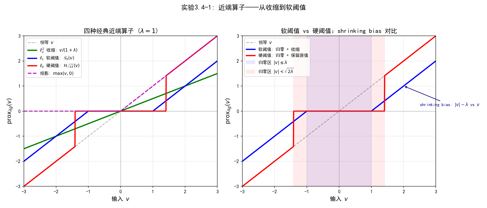

# 3.4 近端方法：不可微先验的求解策略

> **核心观点**：Laplace先验和稀疏正则化的目标函数含不可微项，梯度下降无法直接使用。近端算子是处理不可微凸函数的基本工具，ISTA/FISTA将梯度下降推广到"光滑+不可微"的复合结构。

## 从光滑到不可微：新的挑战

3.3节处理了高斯先验下的Tikhonov正则化——目标函数光滑凸，梯度下降和闭式解都可用。现在我们面对3.1节因果链中的第二个节点：Laplace先验→$\ell_1$正则项→目标函数凸但不可微。

回顾MAP目标函数的一般形式：

$$\hat{x}_{\text{MAP}} = \arg\min_x \{f(x) + g(x)\}$$

其中 $f(x) = \frac{1}{2}\|Ax - y\|_2^2$ 是光滑凸的数据项，$g(x)$ 是正则项。当先验为高斯时，$g(x) = \frac{\lambda}{2}\|x\|_2^2$ 光滑，梯度下降可用。当先验为Laplace时，$g(x) = \lambda\|x\|_1$ **不可微**——在 $x_i = 0$ 处梯度不存在，3.2节的梯度下降框架无法直接应用。

本节将发展处理不可微正则项的工具：从次梯度到近端算子，从ISTA到FISTA，从软阈值到硬阈值和重加权$\ell_1$。

---

## 不可微的挑战：为什么梯度下降不够用

### $\ell_1$范数不可微

$\ell_1$范数 $g(x) = \|x\|_1 = \sum_i |x_i|$ 在每个分量 $x_i = 0$ 处不可微。绝对值函数 $|x_i|$ 在零点处有一个"尖角"——左导数为 $-1$，右导数为 $+1$，梯度不存在。

类似地，TV范数 $\|\nabla x\|_1$ 在梯度的零点处也不可微。这意味着目标函数 $f(x) + g(x)$ 的梯度在 $\{x : \text{某些 } x_i = 0\}$ 上不存在——而稀疏解恰恰有大量分量为零，梯度下降在这些点上无法定义。

### 次梯度：梯度的推广

为了在不可微点处仍然获得优化信息，我们推广梯度的概念。向量 $p \in \mathbb{R}^n$ 称为凸函数 $g$ 在 $x$ 处的**次梯度**（subgradient），如果：

$$g(y) \geq g(x) + \langle p, \, y - x \rangle, \quad \forall y$$

与可微情形的一阶条件 $g(y) \geq g(x) + \langle \nabla g(x), y-x \rangle$ 对比，次梯度 $p$ 替代了梯度的角色——它给出函数的一个仿射下界。$x$ 处所有次梯度的集合称为**次微分**（subdifferential），记为 $\partial g(x)$。

关键区别：

- 可微点：$\partial g(x) = \{\nabla g(x)\}$，次梯度唯一，就是梯度
- 不可微点：$\partial g(x)$ 包含多个次梯度——**次梯度不唯一**

以绝对值函数 $g(x) = |x|$ 为例：

$$\partial|x| = \begin{cases} \{1\} & x > 0 \\ \{-1\} & x < 0 \\ [-1, 1] & x = 0 \end{cases}$$

在 $x = 0$ 处，次微分是整个区间 $[-1, 1]$——有无穷多个次梯度。

### 为什么次梯度不能直接用于梯度下降

次梯度下降 $x_{k+1} = x_k - \tau p_k$（$p_k \in \partial g(x_k)$）虽然可行，但有两个根本缺陷：

1. **方向不确定**：在不可微点处有多个次梯度可选，不同选择导致不同的迭代方向
2. **收敛缓慢**：次梯度下降的收敛率为 $O(1/\sqrt{k})$，远慢于梯度下降的 $O(1/k)$；对光滑+不可微的复合问题尤其低效

根本原因是次梯度下降没有利用问题的"可分"结构——目标函数 $f(x) + g(x)$ 中，$f$ 是光滑的（梯度信息可用），$g$ 是不可微但结构简单的（近端算子可算）。近端方法正是利用了这种可分结构。

---

## 近端算子：不可微函数的"梯度下降替代"

### 定义

函数 $g$ 的**近端算子**（proximal operator）定义为：

$$\text{prox}_{\lambda g}(v) = \arg\min_{x} \left\{\frac{1}{2}\|x - v\|_2^2 + \lambda g(x)\right\}$$

直觉：近端算子在 $v$ 附近寻找一个点 $x$，使 $g(x)$ 尽可能小，但又不离 $v$ 太远。第一项 $\frac{1}{2}\|x-v\|^2$ 是"忠诚项"——不要远离当前位置 $v$；第二项 $\lambda g(x)$ 是"偏好项"——靠近 $g$ 的极小值。

### 关键性质

1. **唯一性**：当 $g$ 是凸的且正常（proper）时，$\text{prox}_{\lambda g}(v)$ 对所有 $v$ 存在且唯一——目标函数 $\frac{1}{2}\|x-v\|^2 + \lambda g(x)$ 是强凸的

2. **与次梯度的关系**：

$$z = \text{prox}_{\lambda g}(v) \iff v - z \in \lambda \, \partial g(z) \iff z = (I + \lambda \, \partial g)^{-1}(v)$$

近端算子是次微分算子的**预解式**（resolvent）——它将"求次梯度的逆"转化为一个良定义的单值运算

3. **非扩张性**：

$$\|\text{prox}_{\lambda g}(x) - \text{prox}_{\lambda g}(y)\| \leq \|x - y\|$$

近端算子不会放大两点间的距离——它是Lipschitz常数为1的映射，保证了迭代稳定性

4. **广义投影**：当 $g = \iota_C$（闭凸集 $C$ 的指示函数）时，$\text{prox}_{\lambda \iota_C}(v) = \text{proj}_C(v)$——投影是近端算子的特例

---

## 经典近端算子

近端方法的可用性依赖于近端算子是否有闭式解。以下是几个经典的近端算子：

### $\ell_2^2$ 正则项：收缩算子

$$g(x) = \frac{1}{2}\|x\|_2^2 \implies \text{prox}_{\lambda g}(v) = \frac{v}{1 + \lambda}$$

每个分量被均匀地压缩向零——Tikhonov去噪器。

### $\ell_1$ 正则项：软阈值算子

$$g(x) = \|x\|_1 \implies \text{prox}_{\lambda g}(v) = \mathcal{S}_\lambda(v) = \text{sign}(v) \odot \max(|v| - \lambda, \, 0)$$

逐分量展开：

$$(\mathcal{S}_\lambda(v))_i = \begin{cases} v_i - \lambda & v_i > \lambda \\ 0 & |v_i| \leq \lambda \\ v_i + \lambda & v_i < -\lambda \end{cases}$$

**软阈值的几何理解**：

- 小于 $\lambda$ 的分量被**归零**——这些分量信号太弱，被认为是噪声
- 大于 $\lambda$ 的分量被**向零收缩** $\lambda$——保留信号但降低幅度
- 正好等于 $\lambda$ 的分量也被归零

软阈值是L1近端的核心操作：**L1近端 = 稀疏化**。阈值 $\lambda$ 越大，更多分量被归零，解越稀疏。这正是Laplace先验"偏好稀疏"在算法层面的实现。

### $\ell_0$ 伪范数：硬阈值算子

$$g(x) = \|x\|_0 \implies \text{prox}_{\lambda g}(v) = \mathcal{H}_{\sqrt{2\lambda}}(v)$$

其中硬阈值算子逐分量为：

$$(\mathcal{H}_{\sqrt{2\lambda}}(v))_i = \begin{cases} 0 & |v_i| < \sqrt{2\lambda} \\ v_i & |v_i| > \sqrt{2\lambda} \end{cases}$$

与软阈值的关键区别：硬阈值**保留非零分量的原值**（不收缩），只是将小于阈值的分量归零。这避免了L1的shrinking bias，但代价是问题变为非凸——优化不再有全局最优保证。

### 指示函数：投影算子

$$g(x) = \iota_C(x) \implies \text{prox}_{\lambda g}(v) = \text{proj}_C(v)$$

投影到闭凸集 $C$ 上。例如非负约束 $C = \{x : x \geq 0\}$ 对应逐分量取 $\max(v_i, 0)$。

四种近端算子的对比如下：

| 函数 $g(x)$ | 近端算子 $\text{prox}_{\lambda g}(v)$ | 名称 | 关键特性 |
|---|---|---|---|
| $\frac{1}{2}\|x\|_2^2$ | $\frac{v}{1+\lambda}$ | 收缩 | 均匀压缩 |
| $\|x\|_1$ | $\text{sign}(v)\max(\vert v\vert -\lambda, 0)$ | 软阈值 | 归零 + 收缩 |
| $\|x\|_0$ | $v \cdot \mathbf{1}_{\vert v\vert \geq \sqrt{2\lambda}}$ | 硬阈值 | 归零 + 保留原值 |
| $\iota_C(x)$ | $\text{proj}_C(v)$ | 投影 | 约束满足 |

> **软阈值 vs 硬阈值**：软阈值（L1）将非零值向零收缩 $\lambda$，产生**shrinking bias**——真实的大系数被系统性地低估。硬阈值（L0）保留非零值的原值，避免了偏差，但优化问题是非凸的，只能保证收敛到临界点。这是稀疏优化中一个基本的权衡：**凸性（全局最优保证）vs 无偏性（精确稀疏性）**。

---

## 📌 实验3.4-1：近端算子——从收缩到软阈值

### 实验场景

在标量输入 $v \in [-3, 3]$ 上，可视化四种经典近端算子（$\ell_2^2$ 收缩、$\ell_1$ 软阈值、$\ell_0$ 硬阈值、非负投影）的输入-输出映射关系，对比软阈值与硬阈值的几何差异（shrinking bias vs 无偏），并数值验证所有近端算子的非扩张性（non-expansiveness）。

选择标量场景的原因：近端算子的核心行为——归零、收缩、保留原值——在一维输入-输出曲线上最直观。理解这些几何行为后，再进入ISTA/FISTA的"先梯度步，再软阈值步"迭代时，学生就能直观理解每一步的操作含义。

### 实验目的

1. 可视化四种经典近端算子的输入-输出映射，直观理解每种算子的几何行为：均匀压缩、归零+收缩、归零+保留原值、约束投影
2. 对比软阈值与硬阈值的差异：软阈值对非零值收缩 $\lambda$（shrinking bias），硬阈值保留原值（无偏）
3. 验证近端算子的非扩张性：$\|\text{prox}(v_1) - \text{prox}(v_2)\| \leq \|v_1 - v_2\|$——这是ISTA/FISTA收敛性的理论基础
4. 理解归零区的差异：软阈值归零区 $|v| \leq \lambda$，硬阈值归零区 $|v| < \sqrt{2\lambda}$

### 实验输入

- 输入范围：$v \in [-3, 3]$，1000个均匀采样点
- 正则化参数：$\lambda = 1.0$
- 四种近端算子：
  - $\ell_2^2$ 收缩：$\text{prox}_{\lambda \cdot \frac{1}{2}\|x\|_2^2}(v) = v/(1+\lambda)$
  - $\ell_1$ 软阈值：$\text{prox}_{\lambda \|x\|_1}(v) = \text{sign}(v) \cdot \max(|v|-\lambda, 0)$
  - $\ell_0$ 硬阈值：$\text{prox}_{\lambda \|x\|_0}(v)$，阈值 $\tau = \sqrt{2\lambda}$
  - 非负投影：$\text{prox}_{\iota_{x \geq 0}}(v) = \max(v, 0)$
- 非扩张性验证：随机生成10000维向量对 $(v_1, v_2)$，计算 $\|\text{prox}(v_1) - \text{prox}(v_2)\| / \|v_1 - v_2\|$

### 预期结果

- 四种近端算子的输入-输出曲线呈现不同的几何行为：收缩算子均匀压缩、软阈值归零+收缩、硬阈值归零+保留原值、投影截断负值
- 软阈值与硬阈值的归零区不同：软阈值在 $|v| \leq \lambda$ 归零，硬阈值在 $|v| < \sqrt{2\lambda}$ 归零
- 软阈值对非零值有 shrinking bias（输出比输入少 $\lambda$），硬阈值无偏差
- 所有近端算子的非扩张性 ratio $\leq 1.0$，验证1-Lipschitz性质

### 实验结果

运行 `3.4-1.py` 后，生成一张包含2个子图的对比图表。



**参数设定**：
- 正则化参数 $\lambda = 1.0$
- 输入范围 $v \in [-3, 3]$

**近端算子性质验证**：

| 近端算子 | 公式 | 关键行为 |
|:---|:---|:---|
| $\ell_2^2$ 收缩 | $v/(1+\lambda) = v/2.0$ | 均匀压缩，不稀疏 |
| $\ell_1$ 软阈值 | $\text{sign}(v)\max(\|v\|-\lambda, 0)$ | 归零 + 收缩（shrinking bias） |
| $\ell_0$ 硬阈值 | $v \cdot \mathbf{1}_{\|v\| \geq \sqrt{2\lambda}}$ | 归零 + 保留原值（无偏） |
| 非负投影 | $\max(v, 0)$ | 负值归零，正值保留 |

**软阈值 vs 硬阈值**：
- 软阈值归零区：$|v| \leq \lambda = 1.0$
- 硬阈值归零区：$|v| < \tau = \sqrt{2\lambda} = 1.41$
- 关键差异：软阈值对非零值收缩 $\lambda$（有偏），硬阈值保留原值（无偏但非凸）

**非扩张性验证**（$\|\text{prox}(v_1) - \text{prox}(v_2)\| \leq \|v_1 - v_2\|$）：

| 近端算子 | ratio | 结论 |
|:---|:---|:---|
| $\ell_2^2$ 收缩 | 0.500 | ✅ 严格收缩 |
| $\ell_1$ 软阈值 | 0.392 | ✅ 严格收缩 |
| $\ell_0$ 硬阈值 | 0.760 | ✅ 非扩张 |
| 非负投影 | 0.586 | ✅ 严格收缩 |

**可视化内容（2个子图）**：
- 左图：四种经典近端算子的输入-输出曲线对比，标注恒等线 $y=v$ 作为参考
- 右图：软阈值 vs 硬阈值的细节对比，标注 shrinking bias 箭头和归零区域着色

**核心验证**：
- 四种近端算子对应四种正则项，几何行为各不相同：收缩算子均匀压缩所有分量，软阈值产生稀疏性但有偏差，硬阈值无偏但非凸，投影满足可行约束
- 软阈值的 shrinking bias 是 $\ell_1$ 正则化的固有代价——所有非零系数被系统性地低估 $\lambda$，这在后续IHT和重加权 $\ell_1$ 中会得到缓解
- 所有近端算子均满足非扩张性（ratio $\leq 1.0$），这是ISTA/FISTA收敛性的关键性质——近端算子不会放大迭代过程中的误差

> 注：$\ell_0$ 硬阈值虽然对应非凸优化问题，其近端算子仍是非扩张的（ratio=0.76）。这说明"非凸正则项的近端算子可以是良定义且非扩张的"，但IHT算法的整体收敛性仍受非凸性限制，只能保证收敛到临界点。

### 补充说明

本实验是3.4节"经典近端算子"小节的数值验证，将抽象的近端算子公式转化为可视化的输入-输出曲线：

1. **近端算子的几何直觉**：近端算子 $\text{prox}_{\lambda g}(v)$ 在 $v$ 附近寻找使 $g(x)$ 最小的点。$\ell_2^2$ 收缩将所有分量均匀拉向零（先验均值），$\ell_1$ 软阈值将小分量归零、大分量收缩，$\ell_0$ 硬阈值将小分量归零、大分量保留原值，投影将负分量归零。这四种行为分别对应"均匀压缩"、"稀疏化+偏差"、"精确稀疏"、"约束满足"。

2. **shrinking bias 的来源**：软阈值 $\mathcal{S}_\lambda(v) = \text{sign}(v)\max(|v|-\lambda, 0)$ 对 $|v| > \lambda$ 的分量输出为 $|v|-\lambda$，比输入少了恰好 $\lambda$。这是 $\ell_1$ 正则项 $\lambda\|x\|_1$ 的次梯度在 $x \neq 0$ 处为常数 $\pm\lambda$ 的直接结果。偏差大小与 $\lambda$ 成正比——正则化越强，偏差越大。

3. **非扩张性与收敛性**：近端算子的非扩张性 $\|\text{prox}(v_1) - \text{prox}(v_2)\| \leq \|v_1 - v_2\|$ 保证了迭代稳定性——每一步近端操作不会放大误差。这是ISTA收敛率 $O(1/k)$ 和FISTA收敛率 $O(1/k^2)$ 的理论基础。实验中四种算子的 ratio 均 $\leq 1.0$，其中 $\ell_2^2$ 收缩的 ratio=0.5 最小（最"稳定"），$\ell_0$ 硬阈值的 ratio=0.76 最大（但仍满足非扩张性）。

4. **软阈值 vs 硬阈值的权衡**：软阈值（$\ell_1$）是凸的，有全局最优保证，但存在 shrinking bias；硬阈值（$\ell_0$）无偏，但非凸，只有局部最优保证。这是稀疏优化中的基本权衡。后续IHT用硬阈值替代软阈值来消除偏差，重加权 $\ell_1$ 通过迭代调整权重来逼近 $\ell_0$ 的无偏性。

5. **从标量到向量**：本实验展示的是一维标量近端算子的行为。在ISTA/FISTA中，近端算子作用于向量 $x \in \mathbb{R}^n$，但由于 $\ell_1$、$\ell_0$ 等正则项是可分的（逐分量独立），向量近端算子等价于对每个分量独立应用标量近端算子。因此本实验的几何直觉可以直接推广到高维情形。

6. **与3.3节的联系**：$\ell_2^2$ 收缩算子 $v/(1+\lambda)$ 正是3.3节Tikhonov闭式解 $\hat{x} = y/(1+\lambda)$（当 $A=I$ 时）的核心操作。3.3节的闭式解可以理解为"一次近端步"——而ISTA/FISTA则是"梯度步 + 近端步"的迭代组合。

> 本实验为后续ISTA/FISTA算法的学习提供了几何直觉基础。学生理解了软阈值的归零和收缩行为后，就能直观理解ISTA的"先梯度步，再软阈值步"：梯度步沿数据项方向试探，软阈值步将小系数归零、大系数收缩——这正是Laplace先验"偏好稀疏"在算法层面的实现。

---

## ISTA：近端梯度下降

### 问题形式

考虑复合优化问题：

$$\min_x \, f(x) + g(x)$$

其中 $f$ 是 $L_f$-光滑凸函数（数据项），$g$ 是下半连续凸函数且近端算子有闭式解（正则项）。这是MAP目标函数 $E(x) = D(x) + \lambda R(x)$ 的标准形式。

### 迭代格式

**ISTA**（Iterative Shrinkage-Thresholding Algorithm）的迭代格式为：

$$\boxed{x_{k+1} = \text{prox}_{\tau g}\big(x_k - \tau \nabla f(x_k)\big)}$$

步长 $\tau \leq 1/L_f$，$L_f$ 是 $f$ 的Lipschitz常数。

**两步解读**：

1. **梯度步**：$z_k = x_k - \tau \nabla f(x_k)$——沿光滑部分走一步梯度下降，得到中间点 $z_k$
2. **近端步**：$x_{k+1} = \text{prox}_{\tau g}(z_k)$——对中间点做近端校正，处理不可微部分

两步合起来：先沿光滑方向"试探"一步，再用近端算子"校正"回来——靠近极小点，但不过分远离当前位置，同时满足稀疏性偏好。

### 应用于LASSO

对LASSO问题 $\min_x \frac{1}{2}\|Ax - y\|_2^2 + \lambda\|x\|_1$，$f(x) = \frac{1}{2}\|Ax-y\|_2^2$，$g(x) = \lambda\|x\|_1$：

$$\nabla f(x) = A^\top(Ax - y), \quad L_f = \lambda_{\max}(A^\top A)$$

$$x_{k+1} = \mathcal{S}_{\tau\lambda}\big(x_k - \tau A^\top(Ax_k - y)\big)$$

每一步：先计算残差的梯度方向，再对结果做软阈值——这正是"ISTA"中"Shrinkage-Thresholding"的由来。

### 收敛速率

- **凸情形**：$F(x_k) - F^* \leq \frac{L_f \|x_0 - x^*\|^2}{2k}$，即 $O(1/k)$——与纯梯度下降相同
- **强凸情形**：线性收敛率 $\|x_k - x^*\|^2 \leq (1 - \mu/L_f)^k \|x_0 - x^*\|^2$

近端梯度下降的收敛速率与纯梯度下降完全一致——引入不可微项并没有降低收敛速度，只要近端算子有闭式解。

---

## FISTA：Nesterov加速

### 加速的思想

ISTA的 $O(1/k)$ 收敛率意味着要使误差减半，迭代次数需要加倍。Nesterov（1983）证明，对于一阶方法，$O(1/k^2)$ 是最优速率——不可能更快。FISTA（Fast ISTA）通过引入**动量项**达到这个最优速率。

### 迭代格式

FISTA在ISTA的基础上增加了一个外推步骤：

**ISTA**：$x_{k+1} = \text{prox}_{\tau g}(x_k - \tau \nabla f(x_k))$

**FISTA**：
1. $x_{k+1} = \text{prox}_{\tau g}(y_k - \tau \nabla f(y_k))$
2. $t_{k+1} = \frac{1 + \sqrt{1 + 4t_k^2}}{2}$
3. $y_{k+1} = x_{k+1} + \frac{t_k - 1}{t_{k+1}}(x_{k+1} - x_k)$

关键区别：FISTA在梯度步中使用的不是当前点 $x_k$，而是**外推点** $y_k$——由当前点和前一步的位置线性外推得到。动量项 $\frac{t_k-1}{t_{k+1}}(x_{k+1}-x_k)$ 让迭代"利用惯性"，在正确的方向上走得更远。

### 收敛速率

$F(x_k) - F^* \leq \frac{2L_f \|x_0 - x^*\|^2}{(k+1)^2}$

这是 $O(1/k^2)$ 的收敛率——相比ISTA的 $O(1/k)$，FISTA在理论上快了一个数量级。在实践中，FISTA在迭代初期就显著领先ISTA，尤其在问题规模较大时优势明显。

### V-FISTA：强凸变体

当 $f$ 是 $\mu$-强凸时，可以用**常数动量**代替递变动量：

$$y_{k+1} = x_{k+1} + \frac{\sqrt{L_f} - \sqrt{\mu}}{\sqrt{L_f} + \sqrt{\mu}}(x_{k+1} - x_k)$$

此时收敛率为线性：$\|x_k - x^*\|^2 \leq \left(\frac{\sqrt{\kappa} - 1}{\sqrt{\kappa} + 1}\right)^{2k} \|x_0 - x^*\|^2$，其中 $\kappa = L_f/\mu$ 是条件数。这个收敛因子比ISTA的 $1 - \mu/L_f$ 更优——加速在强凸情形下同样有效。

### ISTA vs FISTA对比

| 方法 | 动量 | 收敛率（凸） | 收敛率（强凸） | 每步代价 |
|---|---|---|---|---|
| ISTA | 无 | $O(1/k)$ | 线性 $(1-\mu/L)^k$ | 1次梯度 + 1次近端 |
| FISTA | 变动量 | $O(1/k^2)$ | — | 1次梯度 + 1次近端 + 外推 |
| V-FISTA | 常数动量 | — | 线性 $(\frac{\sqrt{\kappa}-1}{\sqrt{\kappa}+1})^{2k}$ | 1次梯度 + 1次近端 + 外推 |

> "—"表示该算法不专门处理此情形：FISTA的变动量未利用强凸信息，强凸时应使用V-FISTA；V-FISTA的常数动量依赖强凸参数 $\mu$，一般凸时无法定义。

关键观察：FISTA和ISTA的每步计算代价几乎相同——多出的外推步骤只是向量加法，代价可忽略。$O(1/k^2)$ 的加速几乎"免费"获得，这就是为什么FISTA在实践中几乎总是优于ISTA。

---

## 迭代硬阈值（IHT）与重加权$\ell_1$

### IHT：$\ell_0$问题的近端方法

将近端梯度下降框架应用于 $\ell_0$ 正则化问题 $\min_x \frac{1}{2}\|Ax - y\|_2^2 + \lambda\|x\|_0$，用硬阈值替换软阈值：

$$x_{k+1} = \mathcal{H}_{\sqrt{2\tau\lambda}}\big(x_k - \tau A^\top(Ax_k - y)\big)$$

IHT（Iterative Hard Thresholding）贪婪地选择保留最大的分量，将小于阈值的分量归零。与ISTA的关键区别：**非零分量保持原值不收缩**，避免了L1的shrinking bias。

但 $\ell_0$ 问题是**非凸**的——IHT只能保证收敛到临界点（局部极小），不能保证全局最优。实践中，用FISTA的L1解作为IHT的初始点是一个常用策略——先找到L1的稀疏模式，再用L0精修系数值。

### 重加权$\ell_1$：逼近$\ell_0$

另一个缓解shrinking bias的策略是**迭代重加权$\ell_1$**（Iteratively Reweighted L1, IRL1）。核心思想：不是求解一个$\ell_1$问题，而是迭代求解一系列**加权$\ell_1$问题**：

$$x^{(k+1)} = \arg\min_x \frac{1}{2}\|Ax - y\|_2^2 + \sum_i w_i^{(k)} |x_i|$$

其中权重 $w_i^{(k)}$ 由上一次解决定：系数 $|x_i^{(k)}|$ 越大（越确定是非零的），权重 $w_i^{(k)}$ 越小（对该系数的惩罚越轻）；系数接近零的，权重接近1（维持惩罚）。

效果：重加权$\ell_1$逐步减少对大系数的压缩，逼近$\ell_0$的稀疏性——但它仍在凸框架内（每步是一个加权LASSO），有全局最优保证。

### L1的偏差问题与应对策略

L1正则化的shrinking bias是固有的：软阈值将所有非零系数向零收缩 $\lambda$，系统性地低估真实值。三种应对策略的对比：

| 策略 | 方法 | 偏差 | 凸性 | 全局最优 |
|---|---|---|---|---|
| L1（ISTA/FISTA） | 软阈值 | 有偏差 | 凸 | 保证 |
| L0（IHT） | 硬阈值 | 无偏差 | 非凸 | 不保证 |
| 重加权L1 | 迭代加权 | 缓解 | 逐步凸 | 每步保证 |

实践中，FISTA求解LASSO是默认选择——快速、稳定、有理论保证。当稀疏性要求更高或偏差不可接受时，用IHT或重加权L1作为后处理。

---

## 本节小结

本节的核心信息可以概括为"一个工具、两个算法、一个权衡"：

**一个工具——近端算子**：$\text{prox}_{\lambda g}(v) = \arg\min_x \{\frac{1}{2}\|x-v\|^2 + \lambda g(x)\}$ 是处理不可微凸函数的基本工具。它将次梯度的"多值逆"转化为单值运算，具有唯一性、非扩张性等优良性质。关键近端算子包括软阈值（L1→稀疏化）、硬阈值（L0→精确稀疏）和投影（约束→可行化）。

**两个算法——ISTA和FISTA**：ISTA（近端梯度下降）将梯度下降推广到"光滑+不可微"的复合结构——先走一步梯度，再做一次近端校正。收敛率 $O(1/k)$。FISTA通过Nesterov动量将收敛率加速到 $O(1/k^2)$——一阶方法的最优速率，且每步代价几乎不增。

**一个权衡——凸性 vs 无偏性**：L1正则化（软阈值）是凸的，有全局最优保证，但存在shrinking bias；L0正则化（硬阈值）无偏，但非凸，只有局部最优保证。重加权L1在两者之间取得了折中。

近端方法解决了L1稀疏正则化的计算，但TV正则化有额外的困难——$\text{TV}(x) = \|\nabla x\|_1$ 中梯度算子 $\nabla$ 使近端算子没有闭式解。$\text{prox}_{\lambda\|\nabla \cdot\|_1}$ 涉及一个逆问题本身，无法像软阈值那样逐分量计算。原始-对偶算法绕过了这一困难。

---

```
3.4 近端方法：ISTA/FISTA（Laplace/L1先验）
      │
      │ "TV的复合结构怎么办？"
      ▼
3.5 原始-对偶：Chambolle-Pock（TV先验）
```
