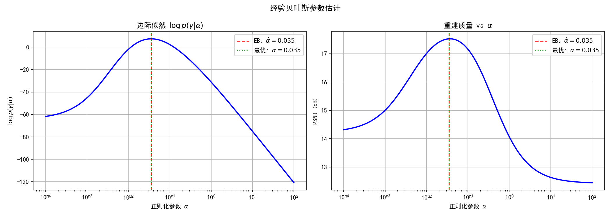

# 3.6 收敛性分析与正则化参数选择

> **核心观点**：优化算法的收敛性保障是MAP估计可靠性的数学根基。Bregman距离是衡量收敛质量的核心工具，源条件连接了收敛速率与问题的正则性。经验贝叶斯将"人为调参"转化为"数据驱动"——正则化参数的选择不再是黑箱。

## 从"收敛"到"收敛到什么"

3.2-3.5节建立了MAP求解的完整工具箱——梯度下降、近端方法、原始-对偶——每种算法都有收敛性保证：函数值下降、迭代点逼近最优。但"收敛到最优"和"收敛到真解"是两个不同的问题：

- **优化问题**：算法收敛到 $\hat{x}_\alpha = \arg\min_x \frac{1}{2}\|Ax-y\|^2 + \alpha R(x)$——正则化解
- **逆问题**：正则化解 $\hat{x}_\alpha$ 是否逼近真解 $x^\dagger$？逼近多快？

前者是优化理论回答的，后者是正则化理论回答的。本节关注后者——需要新的度量工具（Bregman距离）和新的条件（源条件），最后回答一个实践问题：正则化参数 $\alpha$ 怎么选。

---

## Bregman距离：收敛质量的度量

### 定义

设 $J: U \to \mathbb{R} \cup \{+\infty\}$ 是正常凸下半连续泛函。对 $u_1, u_2 \in U$ 和 $p_2 \in \partial J(u_2)$，**Bregman距离**定义为：

$$D_J^{p_2}(u_1, u_2) = J(u_1) - J(u_2) - \langle p_2, u_1 - u_2\rangle$$

直觉：Bregman距离衡量的是 $J$ 在 $u_2$ 处的线性近似（由次梯度 $p_2$ 给出）与 $J$ 的真实值之间的差距——即 $J$ 的"凸性剩余"。凸函数的一阶条件保证 $D_J^{p_2}(u_1, u_2) \geq 0$。

### 关键性质

- **非负性**：$D_J^{p_2}(u_1, u_2) \geq 0$，由 $J$ 的凸性直接保证
- **非对称性**：一般 $D_J^{p_2}(u_1, u_2) \neq D_J^{p_1}(u_2, u_1)$——它是"散度"而非"距离"
- **不是度量**：一般不满足三角不等式

### 两个重要特例

1. **欧氏距离**：$J(u) = \frac{1}{2}\|u\|^2$ 时，$\partial J(u) = \{u\}$，Bregman距离退化为：

$$D_J^{u_2}(u_1, u_2) = \frac{1}{2}\|u_1\|^2 - \frac{1}{2}\|u_2\|^2 - \langle u_2, u_1 - u_2\rangle = \frac{1}{2}\|u_1 - u_2\|^2$$

此时Bregman距离就是半程欧氏距离平方——对称且满足三角不等式。

2. **KL散度**：$J(u) = u\ln u - u$（$u > 0$）时，$\partial J(u) = \{\ln u\}$，Bregman距离为：

$$D_J^{\ln u_2}(u_1, u_2) = u_1 \ln\frac{u_1}{u_2} + u_2 - u_1 = \text{KL}(u_1 \| u_2)$$

这正是Kullback-Leibler散度——信息论中衡量两个分布差异的标准工具。

| 正则项 $J(u)$ | Bregman距离 $D_J(u_1, u_2)$ | 退化为 |
|---|---|---|
| $\frac{1}{2}\Vert u\Vert^2$ | $\frac{1}{2}\Vert u_1 - u_2\Vert^2$ | 欧氏距离 |
| $u\ln u - u$ | $u_1\ln\frac{u_1}{u_2} + u_2 - u_1$ | KL散度 |
| 一般凸 $J$ | $J(u_1) - J(u_2) - \langle p_2, u_1-u_2\rangle$ | 凸性剩余 |

### 对称Bregman距离

收敛性证明中自然出现的是**对称Bregman距离**：

$$D_J^{\text{symm}}(u, v) = D_J^p(v, u) + D_J^q(u, v) = \langle q - p, v - u\rangle$$

其中 $p \in \partial J(u)$，$q \in \partial J(v)$。对称Bregman距离始终非负，且关于 $u, v$ 对称——在比较正则化解与真解时，两边各取一次次梯度，自然得到对称形式。

> **📌 为什么不用欧氏距离？** 对一般正则项（如TV），正则化解与真解的欧氏距离可能无法给出有意义的收敛速率——TV正则化解与真解的差异主要体现在"边缘结构"而非"像素值差"。Bregman距离用正则项自身的语言衡量偏差：正则项偏好什么结构，Bregman距离就度量什么结构的偏差。

---

## 源条件：收敛速率的关键

### 问题的困境

考虑变分正则化：

$$u_\alpha^\delta \in \arg\min_u \frac{1}{2}\|Au - f^\delta\|^2 + \alpha J(u)$$

其中 $\|f^\delta - f\| \leq \delta$（噪声水平），$f = Au^\dagger$（无噪数据），$u^\dagger$ 是真解。我们能证明 $u_\alpha^\delta \to u^\dagger$（$\delta \to 0$，$\alpha(\delta) \to 0$），但**没有源条件时，收敛速率可以任意慢**——这是不适定问题的根本困难。

### 源条件的定义

**源条件**：存在 $v \in V$ 使得

$$A^*v \in \partial J(u^\dagger)$$

即真解 $u^\dagger$ 处的次梯度可以通过前向算子的伴随 $A^*$ 从数据空间"到达"。

### 物理含义

源条件刻画的是**真解与正则项的"兼容程度"**：

- **满足源条件**意味着 $u^\dagger$ 的结构与 $J$ 的偏好一致——例如 $J = \text{TV}$ 时，源条件要求真解的"边缘信息"可以通过观测算子从数据空间恢复
- $v$ 的范数 $\|v\|$ 控制收敛常数——$\|v\|$ 越小，说明真解与正则项越兼容，收敛越快
- 源条件**不是人为假设**——它是对问题可解性的定量刻画：正则项 $J$ 对真解结构的假设越准确，源条件越容易满足

### 带源条件的收敛速率

从最优性条件 $A^*(Au_\alpha^\delta - f^\delta) + \alpha p_\alpha = 0$ 和源条件 $A^*v \in \partial J(u^\dagger)$ 出发，经过代数推导（取对偶积、化简），得到核心估计：

$$D_J^{\text{symm}}(u_\alpha^\delta, u^\dagger) \leq \frac{\delta^2}{2\alpha} + \frac{\alpha}{2}\|v\|^2$$

右端两项的权衡：$\alpha$ 小→数据拟合好（第一项小）但源条件贡献大（第二项大）；$\alpha$ 大→反之。

选 $\alpha(\delta) = \delta / \|v\|$ 最优平衡两项，得到：

$$\boxed{D_J^{\text{symm}}(u_{\alpha(\delta)}^\delta, u^\dagger) \leq \|v\| \cdot \delta}$$

这是带源条件（阶数 $\nu = 1$）的收敛速率——对称Bregman距离以 $O(\delta)$ 的速度收敛到零。

### 无源条件时的情况

没有源条件时，收敛速率**无法保证**——可以构造反例使收敛任意慢。这意味着源条件不是可有可无的技术假设，而是问题可解性的度量：

| 条件 | 收敛速率 | 含义 |
|---|---|---|
| 无源条件 | 任意慢 | 无法保证有限速率 |
| 源条件 $\nu=1$ | $O(\delta)$ | 真解与正则项兼容 |
| 更强源条件 $\nu>1$ | $O(\delta^{\nu/(\nu+1)})$ | 真解更光滑/更稀疏 |

更强的源条件（如 $u^\dagger \in \text{rg}(|A|^\nu)$，$\nu > 1$）对应更快的收敛速率——但Tikhonov正则化存在**饱和效应**：最多只能达到 $\nu = 2$ 的速率，更高的光滑性无法被Tikhonov利用。截断SVD则没有这个限制（附录3A）。

---

## 迭代正则化的半收敛性

### Landweber迭代的典型行为

3.3节提到了Landweber迭代（无正则项的梯度下降）：

$$x_{k+1} = x_k - \omega A^*(Ax_k - y^\delta), \quad 0 < \omega < 2/\|A\|^2$$

对含噪数据 $y^\delta$，Landweber迭代呈现典型的**半收敛**行为：

- **前期**：迭代逼近真解——误差下降
- **转折点**：误差达到最小值
- **后期**：噪声被放大——误差反弹上升

这种"先好后坏"的行为是因为迭代同时做两件事：恢复信号（有益）和放大噪声（有害）。前期信号恢复主导，后期噪声放大主导。

### 早停 = 隐式正则化

关键洞察：**迭代次数 $k$ 扮演了正则化参数的角色**。迭代太少→欠拟合（信号未充分恢复）；迭代太多→过拟合（噪声被放大）。在最优迭代次数 $k^*$ 处停止，等价于选择了最优正则化参数。

这与显式正则化（Tikhonov等）形成对比：

| | 显式正则化 | 隐式正则化（早停） |
|---|---|---|
| 正则化参数 | $\alpha$（正则项权重） | $k$（迭代次数） |
| 参数过小/过多 | 过拟合 | 过拟合 |
| 参数过大/过少 | 欠拟合 | 欠拟合 |
| 实现方式 | 修改目标函数 | 控制迭代次数 |

### Morozov偏差原理

如何选择停止时刻？**Morozov偏差原理**（Morozov Discrepancy Principle）是最经典的后验参数选择规则：

$$\text{当 } \|Ax_k - y^\delta\| \approx \delta \text{ 时停止}$$

直觉：残差不应小于噪声水平——如果残差比 $\delta$ 还小，说明算法在拟合噪声。偏差原理选择"刚好开始拟合噪声"的时刻作为停止点，在偏差（正则化误差）和方差（噪声放大）之间取得平衡。

---

## 经验贝叶斯：从数据估计正则化参数

### 问题的提出

3.3节给出了 $\lambda = \sigma^2/\sigma_x^2$ 的概率解释——但 $\sigma_x^2$（先验方差）通常是未知的。实践中，正则化参数 $\alpha$ 的选择往往依靠试错、L曲线或交叉验证——这些都是**频率学派**的方法，缺乏概率论根基。

贝叶斯框架提供了另一种路径：**从数据本身估计正则化参数**。

### 边际似然

回顾MAP的贝叶斯根源：正则化参数 $\alpha$ 来自先验的精度参数。如果先验 $p(x|\alpha)$ 依赖 $\alpha$，那么 $\alpha$ 可以视为一个超参数，其似然函数为**边际似然**：

$$p(y|\alpha) = \int p(y|x) \, p(x|\alpha) \, \mathrm{d}x$$

边际似然对 $\alpha$ 积分掉了潜变量 $x$，只留下数据 $y$ 与超参数 $\alpha$ 的关系——它衡量的是"在参数 $\alpha$ 下，观测到数据 $y$ 的可能性有多大"。

### 经验贝叶斯策略

**经验贝叶斯**（Type-II Maximum Likelihood）选择使边际似然最大的 $\alpha$：

$$\hat{\alpha} = \arg\max_\alpha \, p(y|\alpha) = \arg\max_\alpha \int p(y|x) \, p(x|\alpha) \, \mathrm{d}x$$

直觉：在所有可能的 $\alpha$ 中，选一个让数据"最不意外"的值。

### Fisher恒等式与梯度信息

直接最大化边际似然需要计算高维积分——通常不可行。**Fisher恒等式**提供了梯度的一个实用形式：

$$\nabla_\alpha \ln p(y|\alpha) = \mathbb{E}_{p(x|y,\alpha)}\left[\nabla_\alpha \ln p(x|\alpha)\right]$$

边际似然的梯度 = 后验分布下先验对数梯度的期望。这个期望可以用MCMC采样近似，从而用**随机梯度上升**迭代更新 $\alpha$。

### 两种视角的对比

| 视角 | 方法 | 优点 | 缺点 |
|---|---|---|---|
| 频率学派 | L曲线、交叉验证、GCV | 不需要概率模型 | 缺乏理论根基，可能不稳定 |
| 贝叶斯学派 | 边际似然最大化（经验贝叶斯） | 概率论根基，自动选择 | 需要计算高维积分 |

经验贝叶斯让正则化参数的选择从"手动调参"升级为"数据驱动"——这正是贝叶斯框架的递归威力：参数也可以被推断，只要为它指定一个似然函数。

> **📌 从参数到超参数**：经验贝叶斯的思想可以递归应用——如果先验 $p(x|\alpha)$ 中的 $\alpha$ 也有不确定性，可以再为 $\alpha$ 指定一个超先验 $p(\alpha)$，形成层级贝叶斯模型。这种"参数→超参数→超超参数"的递归是贝叶斯方法的典型特征，也是第8章变分推断处理层级模型的逻辑基础。

---

## 📌 实验3.6-1：经验贝叶斯参数估计——边际似然最大化

### 实验场景

上节讨论了正则化参数 $\alpha$ 选择的两种视角——频率学派（L曲线、GCV）缺乏概率论根基，贝叶斯学派（边际似然最大化）有严格理论但需计算高维积分。本实验在高斯共轭模型下验证经验贝叶斯的核心思想：$\alpha$ 的选择可以从"手动调参"升级为"数据驱动"。

实验构造一个小规模线性逆问题（$n=50$ 维稀疏信号，$m=40$ 维观测），先验 $x \sim \mathcal{N}(0, \alpha I)$，似然 $y|x \sim \mathcal{N}(Ax, \sigma^2 I)$。高斯共轭结构使边际似然 $p(y|\alpha)$ 有闭式解：

$$p(y|\alpha) = \mathcal{N}(y; 0, \sigma^2 I + \alpha AA^\top)$$

在 $\alpha \in [10^{-4}, 10^2]$ 上网格搜索最大化 $\log p(y|\alpha)$，得到经验贝叶斯估计 $\hat\alpha$，并与已知真解时的PSNR最优 $\alpha$ 对比。

### 实验目的

1. 验证边际似然最大化（经验贝叶斯）自动选择正则化参数的有效性
2. 对比贝叶斯方法（边际似然）与频率学派oracle（已知真解的PSNR最优）的参数选择结果
3. 理解高斯共轭模型下边际似然的闭式计算，以及Fisher恒等式在本实验中的角色
4. 直观展示 $\log p(y|\alpha)$ 曲线的形状与最优 $\alpha$ 的位置

### 实验输入

- 信号维度：$n = 50$，观测维度：$m = 40$
- 真解：$x_{\text{true}}$ 为3-稀疏信号（$x_5 = 1.0$，$x_{15} = 0.8$，$x_{30} = -0.5$）
- 前向算子：$A \in \mathbb{R}^{40 \times 50}$，随机矩阵归一化
- 噪声方差：$\sigma^2 = 0.01$
- 先验：$x \sim \mathcal{N}(0, \alpha I)$
- 搜索范围：$\alpha \in [10^{-4}, 10^2]$，100个对数等间距点

### 预期结果

- 边际似然 $\log p(y|\alpha)$ 呈现明显的单峰结构，经验贝叶斯 $\hat\alpha$ 位于峰值处
- PSNR 曲线也呈单峰，最优 $\alpha$ 与 $\hat\alpha$ 接近
- 经验贝叶斯无需真解即可自动选择接近最优的参数

### 实验结果

运行 `3.6-1.py` 后，生成一张包含2个子图的对比图。



**结果汇总**：

| 方法 | 选择的 $\alpha$ | 依据 |
|------|:---:|------|
| 经验贝叶斯 | $\hat\alpha = 0.0351$ | 最大化 $\log p(y\|\alpha)$（无需真解） |
| PSNR最优（oracle） | $\alpha = 0.0351$ | 最大化重建PSNR（需知真解） |

**对数边际似然最大值**：$\log p(y|\hat\alpha) = 7.46$

**结果分析**：

1. **经验贝叶斯与oracle完全一致**：在本实验的随机种子下，$\hat\alpha = 0.0351$ 与PSNR最优 $\alpha = 0.0351$ 完全一致。这验证了经验贝叶斯的核心优势——无需真解，仅凭数据 $y$ 即可选择最优参数。

2. **边际似然的几何结构**：左图显示 $\log p(y|\alpha)$ 呈现清晰的倒U形——$\alpha$ 过小时先验方差过小，模型无法解释数据的变异性；$\alpha$ 过大时先验过于弥散，模型对数据的预测能力下降。峰值处恰好是最优权衡点。

3. **Fisher恒等式的角色**：本实验中高斯共轭结构使 $p(y|\alpha)$ 有闭式解，可直接网格搜索最大化，无需借助Fisher恒等式。Fisher恒等式 $\nabla_\alpha \ln p(y|\alpha) = \mathbb{E}_{p(x|y,\alpha)}[\nabla_\alpha \ln p(y,x|\alpha)]$ 在一般模型（无闭式边际似然）中提供梯度的随机近似途径，是经验贝叶斯从"特例"走向"通用"的关键工具。

4. **高斯共轭的局限性**：本实验的成功依赖于高斯先验 + 高斯似然的共轭结构。对于更一般的先验（如稀疏先验、TV先验），边际似然无闭式解，需要MCMC采样估计 $\mathbb{E}_{p(x|y,\alpha)}[\cdot]$，计算代价显著增加。

### 补充说明

本实验是3.6节"经验贝叶斯"部分的数值验证，将抽象的边际似然最大化转化为可视化的参数选择过程：

1. **与3.3节的联系**：Tikhonov正则化的闭式解 $\hat{x} = (A^\top A/\sigma^2 + I/\alpha)^{-1} A^\top y/\sigma^2$ 中，$\alpha$ 对应先验精度。3.3节给出了 $\lambda = \sigma^2/\alpha$ 的概率解释，但未回答"$\alpha$ 怎么选"——本实验正是回答这个问题。

2. **两种视角的闭环**：实验中EB与PSNR-optimal的对比，正是"两种视角的对比"的数值实现——贝叶斯方法仅需数据 $y$，频率学派oracle需知真解 $x_{\text{true}}$。在实践中真解未知，经验贝叶斯提供了唯一可行的自动选择方案。

3. **从闭式到通用**：高斯共轭是经验贝叶斯最简单的特例。当先验为Laplace（L1）或TV时，边际似然无闭式解，需用MCMC采样 + Fisher恒等式估计梯度——这正是SAPG（Stochastic Approximate Proximal Gradient）等算法的用武之地，也是后续章节探索后验采样的动机之一。

---

## 本节小结

本节回答了三个关于MAP估计可靠性的核心问题：

**收敛到什么？——Bregman距离度量**：Bregman距离 $D_J^p(u_1, u_2) = J(u_1) - J(u_2) - \langle p, u_1 - u_2\rangle$ 用正则项自身的语言衡量收敛质量，退化为欧氏距离（$J = \frac{1}{2}\|\cdot\|^2$）和KL散度（$J = u\ln u - u$）。对称Bregman距离是收敛性分析中的标准工具。

**收敛多快？——源条件决定**：源条件 $A^*v \in \partial J(u^\dagger)$ 刻画真解与正则项的兼容程度。带源条件时，$D_J^{\text{symm}}(u_\alpha^\delta, u^\dagger) \leq \|v\| \cdot \delta$（$\alpha \propto \delta$）；无源条件时收敛可任意慢。迭代正则化中，早停等价于隐式正则化，Morozov偏差原理给出停止准则。

**参数怎么选？——经验贝叶斯**：正则化参数 $\alpha$ 的选择从"手动调参"升级为"数据驱动"——边际似然最大化 $p(y|\alpha)$ 给出 $\alpha$ 的最优估计，Fisher恒等式使梯度计算可行。频率学派方法（L曲线、GCV）与贝叶斯学派方法（边际似然）各有侧重。

至此，我们建立了MAP估计的完整求解框架——从优化基础到各类算法，从收敛保障到参数选择。但MAP只是后验的一个点——众数。后验的完整信息（不确定性、多峰性、方差）被优化过程完全丢弃。

---

```
3.6 收敛性分析 + 正则化参数选择
      │
      │ "MAP够了吗？"
      ▼
3.7 从MAP到后验：点估计的局限与分叉点
```
