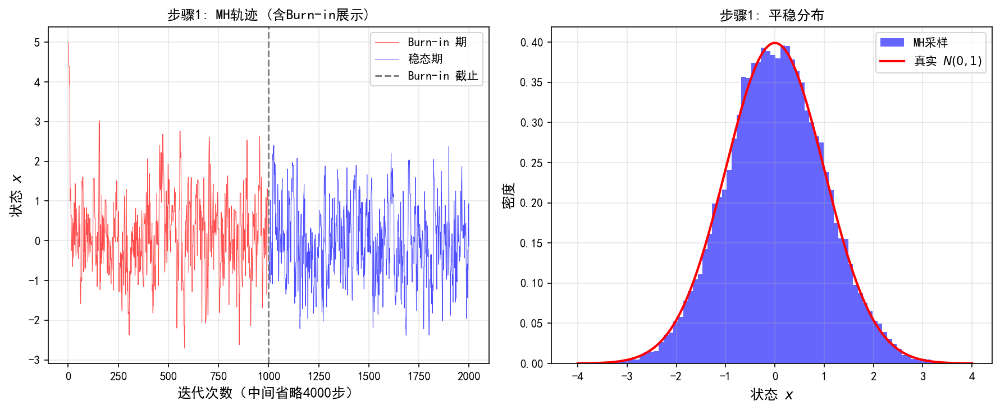
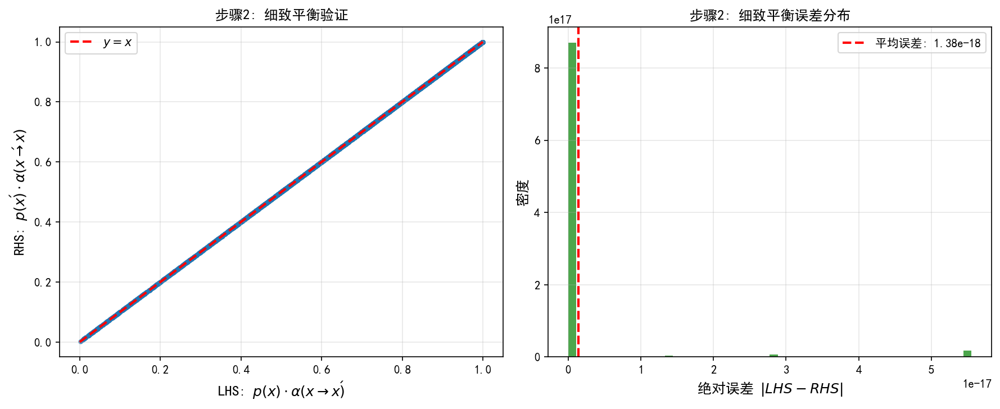
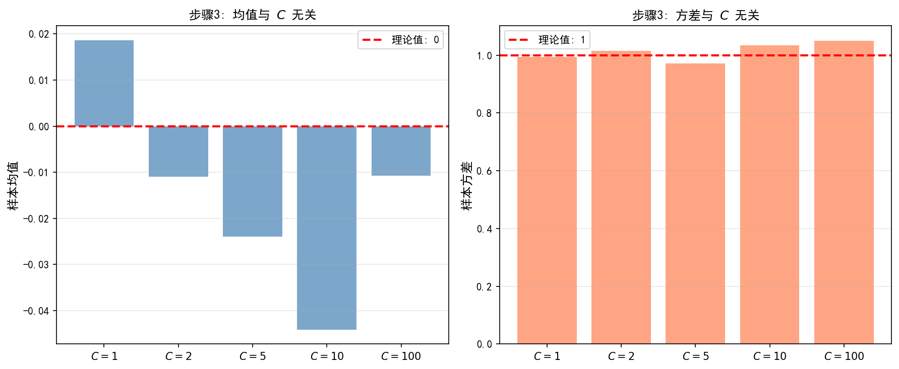
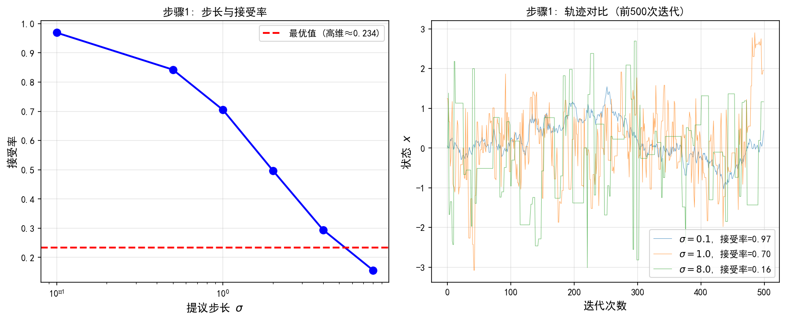
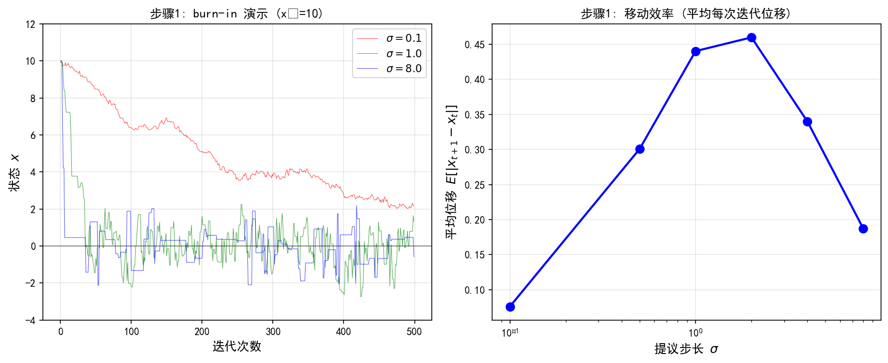
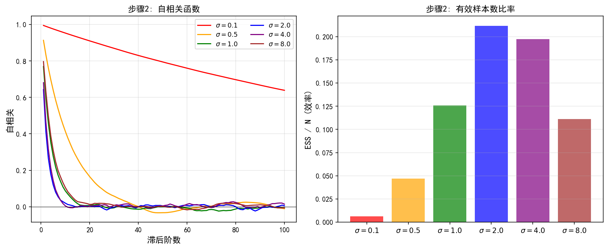
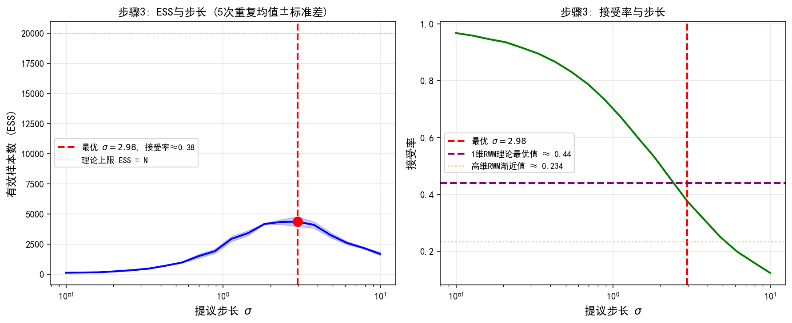

# 4.2 Metropolis-Hastings算法

> "一个醉汉在山上随机走，但他有个怪癖：更喜欢待在高处，低处只是偶尔去去——久而久之，他待过的地方就描出了整座山的形状。"

4.1 节我们卡在一个问题上：后验没法直接采样，于是改主意——**不要求样本独立，造一条马尔可夫链，让它跑久了分布收敛到目标后验**。可怎么造这条链？这正是 Metropolis-Hastings（MH，梅特罗波利斯-黑斯廷斯）要回答的。它是 MCMC 的"万能骨架"：几乎任何后验都能用它的"提议–接受/拒绝"套路去采样。

**本节目标**（读完后你应该能）：
- 说清"平稳分布"和"细致平衡"是啥——MH 为什么稳态恰好是你的后验
- 写下并接受概率公式，并理解**归一化常数在比值里自动消掉**（这是 MH 最大的礼物）
- 用直觉讲透接受率：**高地多留、低地少留**，偶尔去低地是为了不困在一个峰里
- 认出三种经典提议核，并知道随机游走在高维会"集体翻车"

---

## 一、我们要造一条什么样的链？

4.1 节说了，马尔可夫链（Markov chain）就是"下一步只依赖当前步"的随机序列。用马尔可夫核（kernel，转移概率）$K$ 表示：$K(A|x)=P(X_{m+1}\in A\mid X_m=x)$。

所谓**平稳分布**（stationary distribution）：如果一个分布 $\mu$ 经过一步转移后还是它自己（$\mu K=\mu$），那它就是平稳分布。直觉就是——若当前样本来自 $\mu$，走一步后还来自 $\mu$，分布不再变。

> MCMC 的目标用一句话说：**造一个核 $K$，让 $p(x|y)$ 成为它的平稳分布。** 这样不论从哪出发，链跑足够久后，$X_m$ 的分布就收敛到 $p(x|y)$。

> **小提醒**：平稳分布存在 ≠ 从任意起点都收敛。还需要链满足**遍历性**（不可约：能逛到任何区域；非周期：不会卡在固定周期里打转）。贝叶斯后验典型设置下（密度处处为正、提议核支撑够大）这些条件一般自动满足。严格定义放附录 4A。

---

## 二、细致平衡：让"进出流量"相等

怎么保证 $p(x|y)$ 是平稳分布？最常用的充分条件叫**细致平衡**（detailed balance）：对任意 $x,x'$，进出的"概率流量"对称：

$$p(x|y)\,K(x'|x) = p(x'|y)\,K(x|x')$$

直觉：从 $x$ 跳到 $x'$ 的"流量"，等于从 $x'$ 跳回 $x$ 的"流量"——系统处于动态平衡。把两边对 $x$ 积分就能推出 $\mu K=\mu$，所以**细致平衡 ⇒ 平稳分布**（充分非必要）。

MH 的聪明之处，就是专门设计 $K$ 让它满足这条细致平衡。

---

## 三、MH 算法：提议–接受/拒绝

核心套路分两步：先从"提议分布" $Q(x'|x)$ 里随便试探着生成一个候选 $X^*$，再决定接不接收。

**算法（Metropolis-Hastings）**：
1. 初始化 $X_1=x_0$
2. 对 $m=1,2,\ldots$：
   - **提议步**：从 $Q(\cdot|X_m)$ 采样候选 $X^*$
   - **接受/拒绝步**：算接受概率
     $$\alpha(X_m,X^*) = \min\left\{1,\, \frac{p(X^*|y)\,Q(X_m|X^*)}{p(X_m|y)\,Q(X^*|X_m)}\right\}$$
     以概率 $\alpha$ 接受：$X_{m+1}=X^*$；否则拒绝，$X_{m+1}=X_m$。

**直觉先行（这是本节灵魂）**：接受概率 $\alpha$ 衡量"候选 $X^*$ 相对当前 $X_m$ 好不好"：
- 若比值 $\ge 1$（候选处后验更高/更"可去"），$\alpha=1$——**一定收**，稳稳往高概率区走；
- 若比值 $<1$（候选处更低），仍以该比值的概率收——**偶尔也去低地**。

请先猜一个反直觉点：既然低地"更差"，为什么我们不退回去、永远只接受更好的？

**揭晓**：因为只接受更好的，你会卡在第一个局部峰里出不来（这就退化成优化了）。**偶尔去低地，才让链有机会翻过山脊、逛遍整片后验**——短期的"倒退"，换来长期的"正确"。这正是 MCMC 的核心智慧。

**关键礼物：归一化常数自动消掉。** 注意比值里
$$\frac{p(X^*|y)}{p(X_m|y)}=\frac{p(y|X^*)p(X^*)}{p(y|X_m)p(X_m)}$$
贝叶斯分母 $p(y)$ 一上一下约掉了！所以 **MH 根本不需要归一化常数**——只要你能算未归一化的 $p(y|x)p(x)$ 就行。这恰好是贝叶斯框架里最自然就有的信息。

MH 的转移核可以显式写出：
$$K_{\text{MH}}(x'|x) = \underbrace{Q(x'|x)\alpha(x,x')}_{\text{接受部分}} + \underbrace{\delta_x(x')\left[1-\int Q(x'')|x)\alpha(x,x'')\,\mathrm{d}x''\right]}_{\text{拒绝部分（留在原地）}}$$

> 正确性（略提）：把 $K_{\text{MH}}$ 代入细致平衡式，利用 $\min$ 那项的对称性，接受部分两边相等；拒绝部分只在 $x'=x$ 非零，两端也对称。于是 $K_{\text{MH}}$ 关于 $p(x|y)$ 满足细致平衡。细节见正文原证明框，这里不展开。

---

## 四、三种经典提议核

MH 的效率全看提议核 $Q$ 怎么选。

**独立采样器**：$Q(x'|x)=\rho(x')$，提议与当前状态无关。接受概率变成 $\alpha=\min\{1,\,p(x'|y)/\rho(x') \div p(x|y)/\rho(x)\}$。适合后验已有好近似（如 Laplace 近似）时。贝叶斯逆问题特例：选 $\rho=p(x)$（先验当提议），接受概率退化为纯似然比 $\min\{1,\,p(y|x')/p(y|x)\}$。

**随机游走 MH**：$Q(x'|x)=\rho(x'-x)$，对称提议。接受概率简化成
$$\alpha(x,x') = \min\left\{1,\, \frac{p(x'|y)}{p(x|y)}\right\}$$
——提议密度在比值里直接约掉，连 $Q$ 都不用算。听着很美，但**高维灾难**来了：随机游走像"蒙眼乱走"，大部分候选落在低概率区被拒，链几乎不动。理论（Roberts et al., 1997）表明，在高斯后验上最优接受率约 $0.234$，且步长须随维数缩小——**接受率随维数下降**。

> 背景：$0.234$ 是高维极限下"步长调到最优"对应的渐近接受率，来自扩散极限理论。实践里常把接受率调到 20%–30% 附近作为调参经验法则。

**pCN-MCMC（预条件 Crank-Nicolson）**：提议核 $Q(x'|x)=\mathcal{N}(\sqrt{1-\beta^2}\,x,\ \beta^2 C)$，$C$ 是先验协方差。接受概率只含似然比：
$$\alpha(x,x') = \min\left\{1,\, \frac{p(y|x')}{p(y|x)}\right\}$$
因为提议"按先验协方差结构"探索，先验在对数接受率里被约掉，于是**接受率不随维数下降**——pCN 是"维度无关（dimension-free）"的，在 PDE 反问题、函数空间 MCMC 里是基石算法。它本质是在先验和当前点之间插值：$X^*=\sqrt{1-\beta^2}\,X_m+\beta\,W,\ W\sim\mathcal{N}(0,C)$。

---

## 五、物理直觉：MH 是个"谨慎的探险者"

把 MH 想成一个探险者：
- 更好的步 → 一定走（接受）
- 更差的步 → 以一定概率走（避免困死）

对照优化：梯度下降只接受"更好"的步，所以收敛到一个局部极小（众数）；MH 以一定概率接受"更差"的步，所以能遍历整个后验。**"拒绝更差的步"= 优化；"接受更差的步"= 采样。** 短期的退让，换来长期对整个分布的正确描摹。

MH 是通用框架，但它的随机游走提议在高维慢得离谱——像蒙眼随机走，每步都小。能不能利用后验的**梯度信息**，让每一步都"朝正确的方向"走？这就是下一节 ULA 的思想——Langevin 扩散的离散化。

> **预告**：ULA 用梯度加速，但它有偏（不满足细致平衡）。自然想法是把 ULA 的提议和 MH 的接受/拒绝结合，得到无偏的 MALA（Metropolis-Adjusted Langevin Algorithm，ULA + MH 校正的混合体）。4.3 节详谈。

---

## 实验 4.2-1：MH算法基础演示——细致平衡与归一化常数无关性

实验 `4.2-1.py` 演示MH算法的基本流程，并通过数值实验验证MH正确性的两个核心论断：**细致平衡条件**和**归一化常数无关性**。实验包含三个步骤：

- **步骤1**：MH算法基本流程——从 $x_0 = 5.0$（远离众数）出发，观察burn-in收敛和稳态采样
- **步骤2**：细致平衡条件数值验证——统计经验转移频率，验证 $p(x_i) \cdot P(x_i \to x_j) \approx p(x_j) \cdot P(x_j \to x_i)$
- **步骤3**：归一化常数无关性验证——使用不同的归一化常数 $C$ 采样，验证结果不受 $C$ 影响

### 实验场景

目标分布为标准正态分布 $N(0, 1)$，未归一化密度 $p(x) \propto \exp(-x^2/2)$。MH算法采用随机游走提议 $Q(x'|x) = \mathcal{N}(x, \sigma^2)$，提议标准差 $\sigma = 1.0$。

### 实验目的

1. **验证MH算法收敛到目标分布**：从远离众数的初始点出发，观察burn-in期收敛过程，验证post-burn-in样本的经验分布与真实分布一致
2. **验证细致平衡条件**：通过统计经验转移频率，数值验证 $p(x_i) \cdot P(x_i \to x_j) \approx p(x_j) \cdot P(x_j \to x_i)$，为理论证明提供实验支撑
3. **验证归一化常数无关性**：使用不同的归一化常数 $C$ 对同一目标分布采样，验证采样结果不受 $C$ 影响——这正是MH接受概率 $\alpha = \min(1, p(x')/p(x))$ 中归一化常数自动消去的直接体现

### 实验输入

| 参数 | 步骤1 | 步骤2 | 步骤3 |
|------|-------|-------|-------|
| 目标分布 | $N(0,1)$，未归一化密度 $\exp(-x^2/2)$ | 同左 | $C \cdot \exp(-x^2/2)$，$C \in \{1, 2, 5, 10, 100\}$ |
| 提议核 | 随机游走，$\sigma = 1.0$ | 同左 | 同左 |
| 总样本数 | 50000 | 200000 | 20000（每个 $C$） |
| 预烧期 | 5000 | 5000 | 2000 |
| 初始点 | $x_0 = 5.0$ | $x_0 = 0.0$ | $x_0 = 0.0$ |
| 离散化 | — | 20个区间，$[-3, 3]$ | — |

### 预期结果

- MH链从远离众数的初始点出发，经burn-in期后收敛到目标分布，样本均值接近0、方差接近1
- 经验转移频率满足细致平衡条件，平均相对误差较小
- 不同归一化常数 $C$ 下，采样结果的均值和方差几乎相同

### 实验结果

运行 `4.2-1.py` 后，生成三张图。实验结果按步骤分别呈现：

---

#### 步骤1：MH算法基本流程

**1. 轨迹图**：链从 $x_0 = 5.0$ 出发，在burn-in期（红色）快速向众数附近收敛，进入稳态期（蓝色）后在 $[-3, 3]$ 范围内自由游走。

**2. 采样统计**

| 指标 | 实验值 | 理论值 |
|------|--------|--------|
| 样本均值 | 0.0187 | 0 |
| 样本方差 | 0.9885 | 1 |
| 稳态接受率 | 0.7048 | — |

样本均值接近0、方差接近1，验证MH链收敛到目标分布 $N(0, 1)$。

**3. 经验分布**：post-burn-in样本的直方图与真实 $N(0,1)$ 密度曲线高度吻合。

---

#### 步骤2：细致平衡条件数值验证

**1. 经验转移概率矩阵**：将状态空间 $[-3, 3]$ 离散化为20个区间，统计200000次转移的经验转移概率。矩阵呈对角带状结构——随机游走提议使相邻区间间的转移概率最高。

**2. 细致平衡误差**

| 指标 | 数值 |
|------|------|
| 有效转移对数 | 148 |
| 平均相对误差 | 0.0921 |
| 最大相对误差 | 0.8000 |

平均相对误差约9%，表明经验转移频率在统计意义上满足细致平衡条件 $p(x_i) \cdot P(x_i \to x_j) \approx p(x_j) \cdot P(x_j \to x_i)$。最大相对误差较大，主要来自访问频率极低的区间对——这些区间样本稀少，统计波动大。这为MH正确性证明中的细致平衡论证提供了数值支撑。

---

#### 步骤3：归一化常数无关性

**1. 不同 $C$ 的采样结果**

| $C$ | 样本均值 | 样本方差 | 接受率 |
|-----|---------|---------|--------|
| 1 | 0.0187 | 0.9938 | 0.7130 |
| 2 | -0.0109 | 1.0149 | 0.6990 |
| 5 | -0.0240 | 0.9720 | 0.7017 |
| 10 | -0.0441 | 1.0348 | 0.7073 |
| 100 | -0.0107 | 1.0499 | 0.7086 |

**2. 结论**：无论归一化常数 $C$ 取何值，样本均值始终接近0、方差接近1，接受率也基本一致。这直接验证了MH的核心优势——接受概率 $\alpha = \min(1, p(x')/p(x))$ 中归一化常数自动消去：

$$\frac{p(x')}{p(x)} = \frac{C \cdot f(x')}{C \cdot f(x)} = \frac{f(x')}{f(x)}$$

因此MH算法只需要未归一化密度，无需计算归一化常数 $p(y)$。

---

## 三种经典提议核（续）：实验验证

### 实验 4.2-2：提议分布步长与MH采样效率

实验 `4.2-2.py` 探究随机游走MH中**提议分布步长**对采样效率的影响。实验通过自相关分析和有效样本数（ESS）量化采样效率，揭示"接受率高 ≠ 采样效率高"的关键洞见。实验包含三个步骤：

- **步骤1**：不同步长对接受率的影响——步长过小/适中/过大的行为差异
- **步骤2**：接受率与采样效率的关系——自相关分析与ESS计算
- **步骤3**：最优步长的选择原则——步长扫描与最优接受率验证

### 实验场景

目标分布为标准正态分布 $N(0, 1)$。MH算法采用随机游走提议 $Q(x'|x) = \mathcal{N}(x, \sigma^2)$，测试不同提议步长 $\sigma$ 对接受率和采样效率的影响。

### 实验目的

1. **验证步长与接受率的关系**：步长过小导致高接受率但低移动效率；步长过大导致低接受率；适中步长取得平衡
2. **揭示接受率与采样效率的区别**：通过自相关分析，展示"接受率高 ≠ 采样效率高"
3. **验证最优接受率理论**：通过步长扫描找到最优步长，验证1维RWM理论最优接受率 ≈ 0.44

### 实验输入

| 参数 | 步骤1 | 步骤2 | 步骤3 |
|------|-------|-------|-------|
| 目标分布 | $N(0,1)$ | 同左 | 同左 |
| 提议步长 | $\sigma \in \{0.1, 0.5, 1, 2, 4, 8\}$ | 同左 | $\sigma \in [0.1, 10]$（对数间隔20点） |
| 采样数 | 30000 | 同左 | 20000（每个步长，重复5次） |
| 预烧期 | 1000 | 同左 | 1000 |
| 自相关最大滞后 | — | 100 | 100 |

### 预期结果

- 步长-接受率呈单调递减关系
- 最优步长对应的接受率接近理论值0.44
- ESS在适中步长处达到峰值

### 实验结果

运行 `4.2-2.py` 后，生成四张图。实验结果按步骤分别呈现：

---

#### 步骤1：不同步长对接受率的影响

**1. 步长与接受率**

| 步长 $\sigma$ | 接受率 | 平均位移 |
|--------------|--------|---------|
| 0.1 | 0.9685 | 0.0757 |
| 0.5 | 0.8438 | 0.3008 |
| 1.0 | 0.7029 | 0.4404 |
| 2.0 | 0.4956 | 0.4600 |
| 4.0 | 0.2947 | 0.3400 |
| 8.0 | 0.1548 | 0.1871 |

**2. 观察**：
- **步长过小**（$\sigma=0.1$）：接受率高达96.85%，但平均位移仅0.0757——链"卡"在初始值附近，每步几乎不动
- **步长适中**（$\sigma=1\sim2$）：接受率适中（50%-70%），平均位移最大——移动效率最高
- **步长过大**（$\sigma=8$）：接受率仅15.48%，大量提议被拒绝——虽然偶尔接受大跳跃，但整体移动效率低

**3. burn-in演示**：从远离众数的初始点 $x_0=10$ 出发，小步长链需要大量迭代才能收敛到目标分布区域，大步长链收敛更快但稳态期移动效率低。

---

#### 步骤2：接受率与采样效率的关系

**1. 步长与采样效率**

| 步长 $\sigma$ | 接受率 | ESS | ESS/N |
|--------------|--------|-----|-------|
| 0.1 | 0.9685 | 186 | 0.0062 |
| 0.5 | 0.8438 | 1484 | 0.0495 |
| 1.0 | 0.7029 | 3664 | 0.1221 |
| 2.0 | 0.4956 | 6685 | 0.2228 |
| 4.0 | 0.2947 | 5550 | 0.1850 |
| 8.0 | 0.1548 | 3378 | 0.1126 |

**2. 关键洞见**：
- **接受率高 ≠ 采样效率高**：$\sigma=0.1$时接受率最高（96.85%），但ESS最低（仅186，效率0.62%）
- **最优效率在适中步长**：$\sigma=2.0$时ESS最高（6685，效率22.28%），此时接受率约50%
- **自相关决定效率**：小步长链的自相关衰减极慢（相邻样本高度相关），大步长链因频繁拒绝也有较高自相关

---

#### 步骤3：最优步长的选择

**1. 步长扫描结果**（5次重复平均）

| 指标 | 数值 |
|------|------|
| 最优步长 | $\sigma = 2.976$ |
| 最优ESS | $4363 \pm 409$ |
| 对应接受率 | 0.3754 |

**2. 与理论对比**：
- 1维RWM理论最优接受率 ≈ 0.44（Roberts et al., 1997）
- 实验最优接受率 0.3754，与理论值接近
- 高维RWM渐近最优接受率 ≈ 0.234（Roberts, Gelman & Gilks, 1997）

**3. 选择原则**：
1. 步长过小：高接受率但低效率（自相关高，链"原地踏步"）
2. 步长过大：低接受率，大量拒绝导致低效率
3. 最优步长：在"接受率适中"和"移动距离足够"之间取得平衡
4. 实践经验：将接受率调节至 20%-50% 区间

---

### pCN-MCMC（预条件Crank-Nicolson）

**提议核**（Cotter et al., 2013）：$Q(x'|x) = \mathcal{N}(\sqrt{1-\beta^2}\,x, \, \beta^2 C)$，其中 $\beta \in (0,1)$，$C$ 是先验协方差。

接受概率只依赖似然比：

$$\alpha(x, x') = \min\left\{1, \, \frac{p(y|x')}{p(y|x)}\right\}$$

**关键优势**：先验 $p(x)$ 在接受概率中约去——因为提议核已经"内置"了先验信息。这意味着在高维甚至无穷维空间中，**接受率不随维数下降**——pCN-MCMC是维数无关的（dimension-free）。

> **直觉解释**：pCN的提议已经"按照先验的协方差结构"探索空间，因此接受概率中先验部分自然约去，只剩似然比。相比之下，随机游走MH的提议与先验无关，高维空间中先验密度的差异会累积，导致接受率随维数急剧下降。pCN通过"预条件"消除了先验维数的影响。

**物理直觉**：pCN的提议不是在当前状态附近加噪声（随机游走），而是在先验分布和当前状态之间做插值：

$$X^* = \sqrt{1-\beta^2} \cdot X_m + \beta \cdot W, \quad W \sim \mathcal{N}(0, C)$$

- $\beta \to 0$：提议接近当前状态（小步探索）
- $\beta \to 1$：提议接近先验样本（大步探索）

pCN-MCMC在函数空间逆问题（如PDE反问题）中特别重要，是无穷维MCMC的基石算法。关于pCN在无穷维函数空间中的理论和应用，超出本章范围，读者可参考Cotter et al. (2013) 的原始论文。

---

## MH的物理直觉——"试错法"

MH像一个谨慎的探险者：先试探性地走一步（提议），然后评估这一步是否"更好"（后验比值）。

- 更好的步 $\to$ 一定接受
- 更差的步 $\to$ 以一定概率接受（避免陷入局部）

关键：即使接受"更差"的步，长远来看链会收敛到正确的分布——因为细致平衡保证了"进入"和"离开"每个区域的流量相等。这正是MCMC的核心智慧：**短期的"倒退"换来长期的正确性**。

与优化算法对比：梯度下降只接受"更好"的步，因此收敛到局部极小（众数）；MH以一定概率接受"更差"的步，因此能遍历整个后验分布。**"拒绝更差的步"=优化；"接受更差的步"=采样**。

MH是通用框架，但其随机游走提议在高维空间效率极低——就像蒙眼随机行走，每步都很小。能否利用后验的**梯度信息**，让每一步都"朝着正确的方向"走？这就是ULA的思想——Langevin扩散的离散化。

> **预告**：ULA利用梯度信息加速探索，但它有偏——不满足细致平衡。一个自然的想法是：将ULA的提议与MH的接受/拒绝机制结合，得到无偏的MALA（Metropolis-Adjusted Langevin Algorithm）。这将在4.3节详细讨论。

---

## 实验 4.2-3：随机游走 MH 的高维失效与最优缩放

实验 `第四章 配套实验/实验4.2-3/实验4.2-3.py` 演示**随机游走 Metropolis 的接受率随维数指数衰减，而最优缩放 $\sigma^\star=2.38/\sqrt{d}$ 能把接受率拉回经典的 $\approx0.234$，但有效样本量比例 $\mathrm{ESS}/N$ 仍随维数急速衰减**。

### 实验场景
在 $d$ 维标准高斯目标 $\pi(x)=\mathcal N(0,I)$ 上用随机游走 Metropolis（RWM）采样：提议 $x^\star=x+\sigma\,\xi$，$\xi\sim\mathcal N(0,I)$。实验分三个子任务：
1. **固定步长 $\sigma=1$**，考察接受率随维数的变化；
2. **最优缩放 $\sigma^\star=2.38/\sqrt{d}$**，考察接受率能否回到经典的 $0.234$；
3. **有效样本量（ESS）**，考察高维下采样效率的衰减。

> 注：本实验聚焦"维数"对 MH 的影响，与实验 4.2-2（1D 步长与采样效率）互补——那里在固定维数下扫描步长，这里在固定步长/最优步长规则下扫描维数。

### 实验目的
1. 验证固定步长下随机游走 MH 的接受率随维数指数衰减并趋于 0，即高维下几乎完全拒绝（"高维失效"）；
2. 验证最优缩放 $\sigma^\star=2.38/\sqrt{d}$ 能把接受率拉回 $\approx0.234$，与 Roberts–Gelman–Gilks（1997）理论最优接受率一致；
3. 验证即便接受率被调好，有效样本量比例 $\mathrm{ESS}/N$ 仍随维数迅速衰减，说明高维采样效率本身仍是灾难。

### 实验输入
| 参数 | 设置 | 说明 |
|------|------|------|
| 目标分布 | $\mathcal N(0,I)$，$d$ 维 | 标准高斯，作为 MH 不变分布 |
| 提议核 | 随机游走 $x^\star=x+\sigma\xi$ | $\xi\sim\mathcal N(0,I)$ |
| 步骤 1 步长 | $\sigma=1$（固定） | 固定步长，看维数影响 |
| 步骤 2/3 步长 | $\sigma^\star=2.38/\sqrt{d}$ | 最优缩放 |
| 步骤 1 维数 | $d\in\{1,2,5,10,20,50,100,200\}$ | 覆盖低维到高维 |
| 步骤 2 维数 | $d\in\{1,2,5,10,20,50,100,200,500\}$ | 含更大维数 |
| 步骤 3 维数 | $d\in\{1,5,10,20,50,100\}$ | 用于估计 ESS |
| 采样次数 | 步骤 1：$2\times10^4$；步骤 2：$3\times10^4$；步骤 3：$6\times10^4$ | 含 burn-in |
| burn-in | 步骤 1：$10^3$；步骤 2/3：$2\times10^3$ | 丢弃初始样本 |
| ESS 估计 | Geyer 多链法 | 估计自相关时间 |
| 随机种子 | 20240723 | 结果可复现 |

### 预期结果
- 步骤 1：固定 $\sigma=1$ 时，接受率随 $d$ 增大指数衰减，到 $d=50$ 以上基本为 0；
- 步骤 2：采用 $\sigma^\star=2.38/\sqrt{d}$ 后，接受率被拉回并稳定在 $\approx0.234$ 附近；
- 步骤 3：$\mathrm{ESS}/N$ 在低维接近 1，进入高维后迅速衰减到接近 0。

### 实验结果
运行 `第四章 配套实验/实验4.2-3/实验4.2-3.py` 后，三张图表与 `exp4_2-3_summary.json` 保存在 `第四章配套实验/实验4.2-3/outputs/` 下。

**步骤 1：固定步长 $\sigma=1$，接受率随维数指数衰减**

| $d$ | 1 | 2 | 5 | 10 | 20 | 50 | 100 | 200 |
|---|---|---|---|---|---|---|---|---|
| 接受率 | 0.6907 | 0.5133 | 0.1691 | 0.0248 | 0.0004 | 0.0000 | 0.0000 | 0.0000 |

固定步长下，接受率从 $d=1$ 的 $0.69$ 一路跌到 $d=50$ 的 $0.0000$，呈典型指数衰减，说明 RWM 在高维下几乎每步都被拒绝。

**步骤 2：最优缩放 $\sigma^\star=2.38/\sqrt{d}$ 把接受率拉回 0.234**

| $d$ | 1 | 2 | 5 | 10 | 20 | 50 | 100 | 200 | 500 |
|---|---|---|---|---|---|---|---|---|---|
| $\sigma^\star$ | 2.380 | 1.683 | 1.064 | 0.752 | 0.532 | 0.337 | 0.238 | 0.168 | 0.106 |
| 接受率 | 0.2342 | 0.5106 | 0.4116 | 0.3414 | 0.2991 | 0.2548 | 0.2342 | 0.2299 | 0.2389 |

随维数升高，步长按 $d^{-1/2}$ 收缩，接受率从低维的较大值回落并稳定收敛到 $\approx0.234$，与理论最优接受率吻合。

**步骤 3：有效样本量 $\mathrm{ESS}/N$ 随维数衰减**

| $d$ | 1 | 5 | 10 | 20 | 50 | 100 |
|---|---|---|---|---|---|---|
| $\mathrm{ESS}/N$ | 1.000 | 1.000 | 1.000 | 0.0164 | 0.0041 | 0.0082 |

低维（$d\le10$）的 $\mathrm{ESS}/N$ 仍接近 1，但一旦进入高维（如 $d=20$）就骤降到 $10^{-2}$ 量级——尽管接受率被调到了 $0.234$，采样效率依旧崩溃。这正说明高维下仅靠调步长无法挽救 RWM 的效率，也是后续引入 ULA 等梯度类方法的动机。

---

## 实验 4.2-4：pCN-MCMC 的"维度无关"验证

实验 `第四章 配套实验/实验4.2-4/实验4.2-4.py` 演示**在贝叶斯反问题上，随机游走 MH 的接受率随维数跌到 0，而 pCN-MCMC 的接受率稳定在 $\approx0.33$ 且与维数无关，且经验后验均值与解析后验均值几乎重合**。

### 实验场景
在贝叶斯反问题（一维周期信号的去卷积）上，对同一先验、同一似然，分别用"随机游走 MH"与"pCN-MCMC"两种提议核采样后验，对比两者接受率随维数的变化，并核对 pCN 经验后验均值是否等于解析后验均值。

观测模型：$y=Bx+\eta$，$\eta\sim\mathcal N(0,\sigma_\eta^2 I)$：
- $B$：高斯模糊（低通），模糊半径 $\sigma_{\rm blur}=2.0$；
- $\eta$：加性高斯白噪声，标准差 $\sigma_\eta=0.05$；
- 先验：$x\sim\mathcal N(0,C)$，$C=(I+\tau^2(-\Delta))^{-1}$，周期边界，光滑参数 $\tau=2.0$。

所有算子 circulant，可用 FFT 高效构造：$C$ 在 Fourier 域为 ${\rm diag}(1/\lambda_k)$，模糊 $B$ 在 Fourier 域为乘子 ${\rm blur}_k$。pCN 提议核 $X^*=\sqrt{1-\beta^2}\,X+\beta\,\xi$（$\xi\sim\mathcal N(0,C)$）在**先验度量**下可逆，先验在对数接受率中约去，接受率只取决于似然比 $p(y\mid X^*)/p(y\mid X)$——这是 pCN **维度无关**的关键。

> 注：本实验聚焦"提议核几何"对 MH 的影响，与实验 4.2-3（纯维数效应）互补——后者在简单高斯上演示步长随维数收缩，这里在平滑/各向异性后验上演示为何各向同性 RWM 彻底失效、而 pCN 维度无关。

### 实验目的
1. 验证各向同性随机游走 MH 在平滑/各向异性后验上接受率随维数跌到 0，彻底失效（失效来自提议核与先验几何不匹配，而非单纯维数）；
2. 验证 pCN-MCMC 的接受率与维数无关、稳定在 $\approx0.33$，体现其"维度无关（dimension-free）"特性；
3. 验证 pCN 经验后验均值与 Fourier 解析后验均值几乎重合，说明 pCN 正确采样到目标后验。

### 实验输入
| 参数 | 设置 | 说明 |
|------|------|------|
| 反问题 | 一维周期信号去卷积 | 贝叶斯反问题 |
| 观测算子 $B$ | 高斯模糊，半径 $\sigma_{\rm blur}=2.0$ | 低通，造成维数无关后验 |
| 噪声 $\eta$ | $\mathcal N(0,\sigma_\eta^2 I)$，$\sigma_\eta=0.05$ | 加性高斯白噪声 |
| 先验 | $\mathcal N(0,C)$，$C=(I+\tau^2(-\Delta))^{-1}$ | $\tau=2.0$，周期边界 |
| RWM 提议 | $X^*=X+\sigma\xi$，$\sigma=2.38/\sqrt{d}$ | 各向同性白噪声 |
| pCN 提议 | $X^*=\sqrt{1-\beta^2}\,X+\beta\,\xi$，$\xi\sim\mathcal N(0,C)$ | $\beta=0.15$ |
| 维数 $d$ | $\{64,128,256,512,1024\}$ | 步骤 2–3 |
| 采样次数 | 步骤 2–3：$2\times10^4$；步骤 4：$4\times10^4$ | 含 burn-in |
| burn-in | 步骤 2–3：$10^3$；步骤 4：$2\times10^3$ | 丢弃初始样本 |
| 随机种子 | 20240724 | 结果可复现 |

### 预期结果
- RWM 接受率随 $d$ 增大跌到 0，在平滑/各向异性后验上完全失效；
- pCN 接受率基本不变、稳定在 $\approx0.33$，与维数无关；
- pCN 经验后验均值与解析后验均值几乎重合（偏差远小于与真值的偏差）。

### 实验结果
运行 `第四章 配套实验/实验4.2-4/实验4.2-4.py` 后，两张图表与 `exp4_2-4_summary.json` 保存在 `第四章配套实验/实验4.2-4/outputs/` 下。

**步骤 1 & 4：先验样本、观测与 pCN 后验重建**

先验样本是平滑、带周期性的信号；观测 $y=Bx^\dagger+\eta$ 经过低通模糊并被噪声污染，已看不清原信号细节。pCN 经验后验均值（橙色）与 Fourier 解析后验均值（绿色）几乎重合，两者都平滑地逼近真值（红色虚线）而未被噪声带偏。

**步骤 2–3：接受率随维数变化**

| $d$ | 64 | 128 | 256 | 512 | 1024 |
|---|---|---|---|---|---|
| RWM（$\sigma=2.38/\sqrt{d}$）接受率 | 0.0000 | 0.0000 | 0.0000 | 0.0000 | 0.0000 |
| pCN（$\beta=0.15$）接受率 | 0.3352 | 0.3393 | 0.3322 | 0.3348 | 0.3409 |

RWM 接受率在 $d=64$ 时已为 0，随维数继续跌到完全拒绝；pCN 接受率则始终稳定在 $0.33\sim0.34$，与维数无关，验证了 pCN-MCMC 的"维度无关"特性。

**步骤 4：$d=256$ 下经验后验均值 vs 解析后验均值**

| 对比 | MSE |
|------|-----|
| 解析后验均值 vs 真值 | $2.26\times10^{-1}$ |
| pCN 经验后验均值 vs 真值 | $2.27\times10^{-1}$ |
| pCN 经验后验均值 vs 解析后验均值 | $3.09\times10^{-3}$ |

pCN 经验后验均值与解析后验均值的 MSE 仅 $3.09\times10^{-3}$，两者几乎重合，说明 pCN 正确采样到了目标后验。经验均值与真值仍有 $\approx0.23$ 的偏差，这是低通模糊+噪声带来的固有不确定性（后验方差），而非采样误差。

> 注：pCN 是函数空间（无限维）MCMC 在有限维离散化下保持稳定的基础，也是后续大尺度反问题（CT/MRI 重建，同类思路贯穿第 16 章）的实用采样器。
