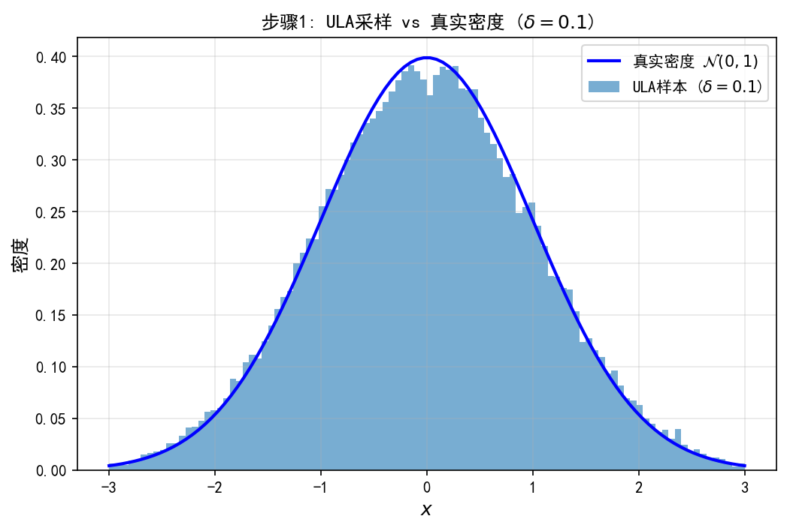
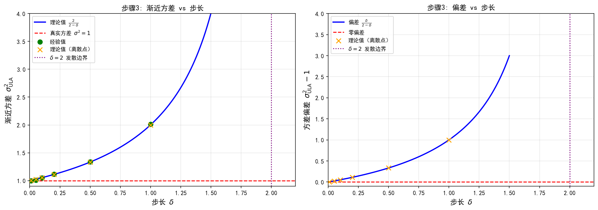
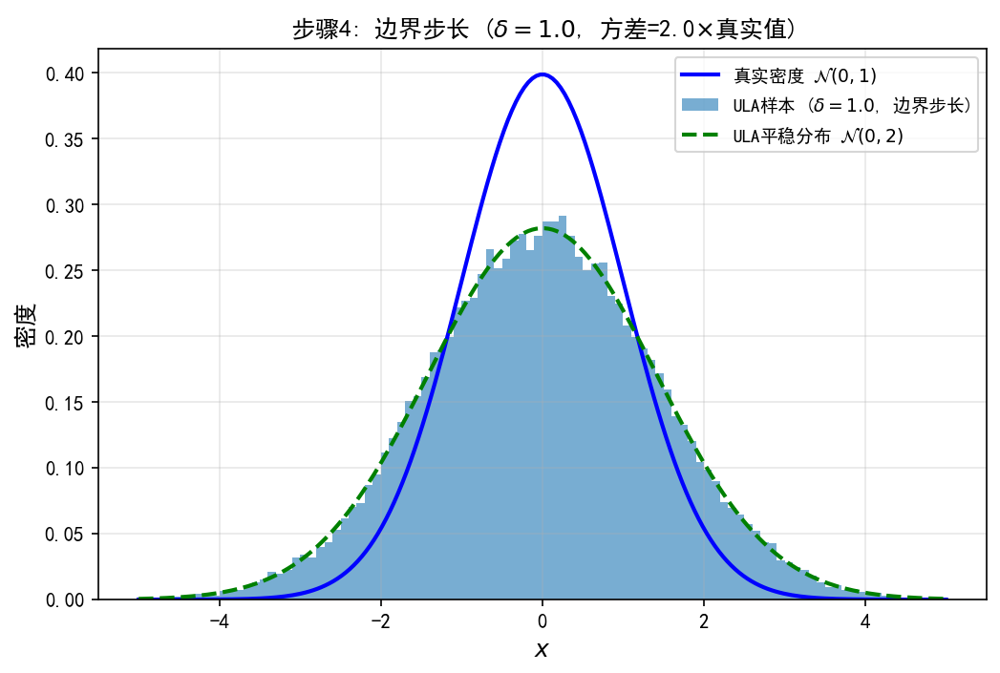
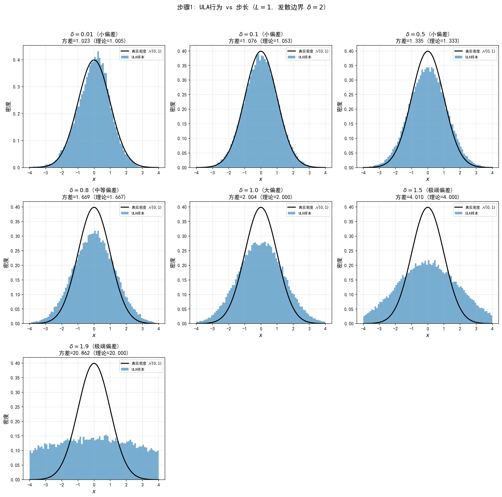
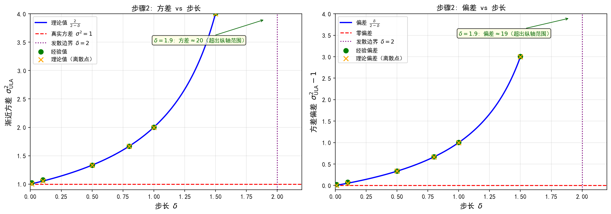

# 4.3 ULA：Langevin采样的Euler离散

> "随机游走像蒙眼乱撞；如果给醉汉一张地图——告诉他'哪边更陡、更像是目标'——他就能又快又稳地把整座山描出来。"

4.2 节我们学会了 MH 这个万能骨架，但有个刺眼的事实：**随机游走 MH 在高维几乎每步都被拒**。原因很简单——它"蒙眼"，提议方向完全随机。那能不能给算法一张"地图"，让每一步都朝高概率区走？能。这张地图就是后验的对数梯度。本节讲 ULA（Unadjusted Langevin Algorithm，无校正朗之万算法）：它沿着梯度走"有方向的步"，是 Langevin 扩散的 Euler 离散化。它**有偏但快得多**，而且——记住这句话——**它里面的后验对数梯度，就是后面第5章要贯穿全书的"得分函数"**。

**本节目标**（读完后你应该能）：
- 说清 ULA 为什么是"梯度下降 + 噪声"，并认出算式里的得分函数
- 写出 ULA 递推式，并理解它其实是连续 Langevin 方程的离散版（为第5章埋伏笔）
- 用 1D 高斯例子精确算出 ULA 的偏差（$\sigma^2_{\text{ULA}}=2/(2-\delta)$），看偏差怎么随步长长大
- 对比 MH（无偏慢）vs ULA（有偏快），并认识折中 MALA

---

## 一、从 MH 到 ULA：为什么需要梯度？

4.2 节说了，随机游走 MH 在高维的死穴是：提议方向随机，大部分候选落进低概率区被拒，链几乎挪不动。

自然的升级思路：如果能**沿着 $\nabla\log p(x|y)$ 的方向**提议，每一步都"朝高概率区"走，接受率就蹭蹭涨。$\nabla\log p(x|y)$ 是什么？它就是后验密度增长最快的方向，统计学里叫**得分函数**（score function，更准确说是 Stein's score；"得分"这词容易误会，第5章 5.2 会专门澄清）。它把"随机游走"变成"有方向的行走"——正如梯度下降把"随机搜索"变成"定向优化"。

> **埋伏笔**：这个 $\nabla\log p(x|y)$ 就是全书的"得分函数"。第5章我们会把它从离散迭代里抽出来，变成连续 Langevin SDE 的核心驱动力；第6章讲怎么从数据里学它；第7章扩散模型就是用它一步步去噪。你在 ULA 里第一次见到了它。

---

## 二、Langevin 扩散与 ULA

**Langevin 扩散**（朗之万扩散，一个带漂流的随机微分方程）定义在 $\mathbb{R}^n$ 上：

$$\mathrm{d}X_t = \nabla\log p(X_t|y) \, \mathrm{d}t + \sqrt{2} \, \mathrm{d}W_t, \quad X_0=x_0$$

其中 $W_t$ 是标准布朗运动（Brownian motion，一种处处连续却处处不可微的随机游走）。它有两个零件：

- **漂移项** $\nabla\log p(x|y)\,\mathrm{d}t$：沿得分方向走（确定性）——"把粒子推向高概率区"
- **扩散项** $\sqrt{2}\,\mathrm{d}W_t$：布朗运动（随机性）——"让粒子探索分布形状"

理论保证：在合适条件下（如强对数凹，第5章细讲），$X_t$ 的分布当 $t\to\infty$ 时收敛到 $p(x|y)$——Langevin 扩散的平稳分布就是目标后验。

**离散化 → ULA。** 连续方程一般没解析解，用最简单的 Euler-Maruyama 格式（用折线近似连续轨迹）离散一步，得到 ULA：

$$\boxed{X_{m+1} = X_m + \delta \, \nabla\log p(X_m|y) + \sqrt{2\delta} \, Z_{m+1}, \quad Z_{m+1} \sim \mathcal{N}(0, I_n)}$$

其中 $\delta>0$ 是步长。两步读懂它：
1. **先沿梯度走一步**：$X_m+\delta\nabla\log p(X_m|y)$——往得分最大的方向挪；
2. **再加高斯噪声**：$+\sqrt{2\delta}\,Z_{m+1}$——保住探索能力，别退化成纯优化。

> 所以 ULA 就是"连续 Langevin 方程"在离散时间里的翻版。第5章我们要把它**从离散变回连续**，得到真正的 Langevin SDE——本节是那个连续故事的离散起点。

---

## 三、ULA 怎么算梯度？以高斯为例

ULA 要算 $\nabla\log p(x|y)$。定义势能 $U(x)=-\log p(x|y)$，则 $\nabla\log p(x|y)=-\nabla U(x)$。由贝叶斯定理：

$$U(x) = -\log p(y|x) - \log p(x) + \text{const}$$

故 $\nabla\log p(x|y)=\nabla\log p(y|x)+\nabla\log p(x)$。

**高斯似然 + 高斯先验的具体例子**（这是全章用得最多的配置）：设 $p(y|x)=\mathcal{N}(Ax,\sigma^2 I)$，$p(x)=\mathcal{N}(0,\sigma_x^2 I)$，则

$$\nabla\log p(y|x)=-\frac{1}{\sigma^2}A^\top(Ax-y),\qquad \nabla\log p(x)=-\frac{1}{\sigma_x^2}x$$

代入得

$$\nabla\log p(x|y) = -\frac{1}{\sigma^2}A^\top(Ax-y) - \frac{1}{\sigma_x^2}x$$

于是 ULA 迭代为

$$X_{m+1} = X_m - \delta\left[\frac{1}{\sigma^2}A^\top(AX_m-y) + \frac{1}{\sigma_x^2}X_m\right] + \sqrt{2\delta}\,Z_{m+1}$$

括号里那串，正是第3章 Tikhonov 正则化的梯度！**ULA = 梯度下降 + 噪声**——优化与采样的统一视角，就在这里第一次亮出来。

---

## 四、步长与偏差：ULA 是"有偏但快"

**步长条件**：$\delta\le 1/L$，其中 $L$ 是 $\nabla\log p(x|y)$ 的 Lipschitz 常数。这和梯度下降的步长上限 $\tau\le 1/L$（3.2 节）一模一样。
- $\delta$ 太大（超过 $1/L$）：离散误差炸开，链可能发散；
- $\delta$ 太小：每步挪得少，要更多迭代才收敛。

**ULA 的偏差（本节关键）**：和 MH 不同，ULA **不满足细致平衡**——它没有接受/拒绝去校正离散误差。所以 ULA 样本的分布不是精确等于 $p(x|y)$，而是接近它的某个近似分布。偏差来源就是 Euler 离散化；$\delta$ 越小偏差越小，但收敛越慢。ULA 是**渐近有偏**的：即便 $m\to\infty$，分布也不会精确等于 $p(x|y)$（除非 $\delta\to 0$）。

**1D 高斯的精确偏差——一个让你"看见"偏差的最小例子。**

对目标 $p(x)=\mathcal{N}(0,1)$，势能 $U(x)=x^2/2$，梯度 $\nabla U(x)=x$。ULA 退化成：

$$X_{m+1} = (1-\delta)X_m + \sqrt{2\delta}\,Z_{m+1}$$

这是一个 **AR(1) 过程**（一阶自回归，就是"上一时刻乘个系数加噪声"）。自回归系数 $\phi=1-\delta$，噪声方差 $\sigma_\varepsilon^2=2\delta$。对平稳分布取方差：

$$\mathrm{Var}(X_{m+1}) = \phi^2\mathrm{Var}(X_m)+\sigma_\varepsilon^2$$

令平稳方差为 $\sigma^2_{\text{ULA}}$，解得：

$$\sigma^2_{\text{ULA}} = \frac{\sigma_\varepsilon^2}{1-\phi^2} = \frac{2\delta}{1-(1-\delta)^2} = \frac{2}{2-\delta}$$

目标真实方差是 $1$，所以偏差是：

$$\sigma^2_{\text{ULA}}-1 = \frac{2}{2-\delta}-1 = \frac{\delta}{2-\delta}$$

几个具体数字（先猜后看）：

| $\delta$ | ULA 平稳方差 $2/(2-\delta)$ | 偏差 | 直觉 |
|---|---|---|---|
| $0.01$ | $1.005$ | $0.5\%$ | 几乎无偏 |
| $0.1$ | $1.053$ | $5\%$ | 略胖 |
| $1.0$（边界） | $2.0$ | **100%** | 方差翻倍！ |
| $\ge 2$ | 公式给出负值/失效 | — | 发散 |

**揭晓反直觉点**：你大概以为"稍微大点步长没关系"。但在 $\delta=1$ 这个边界步长，ULA 的平稳分布竟是 $\mathcal{N}(0,2)$——方差正好是真值的**两倍**！步长再大过 $2$，AR(1) 系数 $|\phi|>1$，过程发散、不平稳。所以 ULA 的偏差量级是 $O(\delta)$：步长减半，偏差大约减半。

多维推广：对目标 $\mathcal{N}(\mu_q,H^{-1})$，ULA 平稳协方差 $\Sigma_\delta=(H-\frac{\delta}{2}H^2)^{-1}$；$\delta\to0$ 时回到 $H^{-1}$，有限 $\delta$ 时偏离——这就是偏差的多维版。

> Durmus & Moulines (2019) 给出非渐近界 $\|p_m-p\|_{\text{TV}}\le C_1e^{-cm\delta}+C_2\delta$：前项是随迭代指数收敛到 ULA 自身不变分布，后项是 Euler 离散引入的、和 $\delta$ 成正比的偏差——靠加迭代次数消不掉，只能靠缩小 $\delta$。

---

## 五、MH vs ULA：有偏但高效

| 特性 | Metropolis-Hastings | ULA |
|---|---|---|
| 平稳分布 | 精确为 $p(x\|y)$（无偏） | 近似为 $p(x\|y)$（有偏） |
| 细致平衡 | 满足 | 不满足 |
| 高维效率 | 低（接受率随维数衰减） | 高（利用梯度信息） |
| 每步计算 | 评价后验比值 + 采样提议 | 计算梯度 + 采样高斯 |
| 收敛机制 | 接受/拒绝保证无偏 | 梯度驱动快速靠近 |

**怎么选**：
- 维数低 / 后验简单 → MH 够用
- 维数高 / 后验光滑 → ULA 显著更优
- 需要无偏 → 用 MALA

**MALA（ULA 与 MH 的折中）** = ULA 提议 + MH 接受/拒绝步：
1. 提议：$X^* = X_m+\delta\nabla\log p(X_m|y)+\sqrt{2\delta}Z_{m+1}$（就是 ULA 步）
2. 接受/拒绝：以概率 $\alpha=\min\{1,\,p(X^*|y)Q(X_m|X^*)/(p(X_m|y)Q(X^*|X_m))\}$ 接受，其中提议核有显式密度 $Q(x'|x)=\mathcal{N}(x+\delta\nabla\log p(x|y),\,2\delta I)$，所以 $\alpha$ 真算得出来。

MALA 既有梯度方向性，又有 MH 无偏性；代价是每步多算一次比值。实践中，当 ULA 偏差可接受时（图像逆问题常如此，肉眼难辨），ULA 比 MALA 更省算、更常用。

---

## 六、ULA = 梯度下降 + 噪声（本章核心洞见）

把两者摆一起看：

- **梯度下降**（第3章）：$x_{k+1}=x_k-\tau\nabla f(x_k)$——确定性，收敛到众数
- **ULA**（本章）：$X_{m+1}=X_m+\delta\nabla\log p(X_m|y)+\sqrt{2\delta}Z_{m+1}$——随机性，收敛到分布

当 $\delta\to0$、噪声 $\sqrt{2\delta}Z\to0$，ULA 退化成梯度下降——**优化是采样的零噪声极限**。

噪声是"探索"的代价：没噪声，只有"开发"（收敛到一个点）；有噪声，才有"探索"（收敛到一片分布）。这个洞见会在第5章"扩散模型 = 高温 Langevin"里再次出现，并贯穿采样路径。**优化与采样的统一视角**：

| 优化 | 采样 | 区别 |
|---|---|---|
| 梯度下降 | ULA | 噪声项 |
| 收敛到点（众数） | 收敛到分布 | 目标不同 |
| 确定性迭代 | 随机迭代 | 性质不同 |

ULA 要求 $\nabla\log p(x|y)$ 存在且 Lipschitz 连续——可图像逆问题的后验常带不可微项（TV 范数、$\ell_1$、指示函数），梯度要求直接翻车。下一节 MYULA 用 Moreau-Yoshida 包络把尖角磨平，把 ULA 扩到不可微情形。

---

## 实验 4.3-1：1D高斯ULA采样与渐近方差验证

实验 `4.3-1.py` 在1D标准高斯目标分布上验证ULA的渐近方差公式。ULA在此情形下退化为AR(1)过程，其平稳方差可精确计算，为理解ULA偏差提供了最直观的例子。实验包含四个步骤：

- **步骤1**：ULA直方图与真实密度对比——直观展示ULA偏差
- **步骤2**：渐近方差公式数值验证——验证 $\sigma^2_{\text{ULA}} = 2/(2-\delta)$
- **步骤3**：渐近方差与偏差随步长变化——可视化偏差与步长的关系
- **步骤4**：边界步长行为——$\delta=1$ 时方差翻倍

### 实验场景

目标分布为1D标准正态分布 $N(0, 1)$，势能 $U(x) = x^2/2$，梯度 $\nabla U(x) = x$。ULA迭代退化为AR(1)过程：

$$X_{m+1} = (1-\delta) X_m + \sqrt{2\delta} \, Z_{m+1}$$

其中 $\delta$ 为步长，$Z_{m+1} \sim N(0,1)$ 为标准高斯噪声。

### 实验目的

1. **验证ULA退化为AR(1)过程**：在1D标准高斯目标下，ULA迭代具有显式形式，可精确分析
2. **验证渐近方差公式**：数值验证 $\sigma^2_{\text{ULA}} = 2/(2-\delta)$，理解偏差来源
3. **量化偏差与步长的关系**：偏差 $= \delta/(2-\delta) \approx \delta/2$（当 $\delta$ 较小时），验证"ULA偏差量级为 $O(\delta)$"的理论结论
4. **探索边界行为**：$\delta=1$ 时方差翻倍，$\delta \geq 2$ 时ULA发散

### 实验输入

| 参数 | 步骤1 | 步骤2 | 步骤3 | 步骤4 |
|------|-------|-------|-------|-------|
| 目标分布 | $N(0,1)$ | 同左 | 同左 | 同左 |
| 步长 | $\delta = 0.1$ | $\delta \in \{0.01, 0.05, 0.1, 0.2, 0.5, 1.0\}$ | $\delta \in [0.001, 1.5]$ | $\delta = 1.0$ |
| 采样数 | 50000 | 50000（每个步长） | — | 50000 |
| 预烧期 | 1000 | 1000 | — | 1000 |

### 预期结果

- ULA样本均值接近0（无偏），方差大于1（有偏）
- 经验方差与理论方差 $\sigma^2_{\text{ULA}} = 2/(2-\delta)$ 吻合
- 偏差随步长增大而增大，$\delta \to 0$ 时偏差消失

### 实验结果

运行 `4.3-1.py` 后，生成三张图。实验结果按步骤分别呈现：

---

#### 步骤1：ULA直方图与真实密度对比

ULA采样50000步（$\delta=0.1$），样本直方图与真实 $N(0,1)$ 密度对比。直观可见ULA样本分布略"宽"于真实分布——这就是ULA偏差的直观表现。

---

#### 步骤2：渐近方差公式数值验证

| 步长 $\delta$ | 经验方差 | 理论方差 | 相对误差 | 样本均值 |
|--------------|---------|---------|---------|---------|
| 0.01 | 0.9961 | 1.0050 | 0.89% | 0.0340 |
| 0.05 | 1.0072 | 1.0256 | 1.80% | 0.0205 |
| 0.10 | 1.0498 | 1.0526 | 0.27% | -0.0058 |
| 0.20 | 1.1174 | 1.1111 | 0.56% | -0.0053 |
| 0.50 | 1.3365 | 1.3333 | 0.24% | -0.0055 |
| 1.00 | 2.0117 | 2.0000 | 0.59% | -0.0044 |

**关键观察**：
- **均值无偏**：所有步长下样本均值接近0
- **方差有偏**：经验方差与理论方差 $\sigma^2_{\text{ULA}} = 2/(2-\delta)$ 高度吻合，相对误差在2%以内
- **偏差随步长增大**：$\delta=0.01$ 时方差接近1（偏差0.5%），$\delta=1.0$ 时方差为2（偏差100%）

---

#### 步骤3：渐近方差与偏差随步长变化

**左图：渐近方差 vs 步长**。理论曲线 $\sigma^2_{\text{ULA}} = 2/(2-\delta)$ 与经验值（绿色点）高度吻合。红色虚线为真实方差 $\sigma^2=1$，紫色虚线标注 $\delta=2$ 发散边界。

**右图：偏差 vs 步长**。偏差 $= \delta/(2-\delta)$ 随步长单调递增。当 $\delta$ 较小时，偏差 $\approx \delta/2$（线性近似）。

---

#### 步骤4：边界步长行为

$\delta=1.0$ 时ULA的平稳分布为 $N(0, 2)$，方差恰好是真实方差的2倍。图中绿色虚线为ULA平稳分布的理论密度，与样本直方图高度吻合。

**边界行为总结**：
- $\delta \to 0$：偏差消失，ULA渐近无偏
- $\delta = 1$：方差翻倍，ULA平稳分布为 $N(0, 2)$
- $\delta \geq 2$：$|1-\delta| \geq 1$，AR(1)过程不再平稳，ULA发散

---

### ULA的非渐近收敛界

在强对数凹条件下（即 $U(x) = -\log p(x|y)$ 是强凸且光滑的），Durmus & Moulines（2019）给出了ULA的非渐近收敛界：

$\|p_m - p\|_{\text{TV}} \leq C_1 e^{-cm\delta} + C_2 \delta$

其中 $p_m$ 是ULA迭代 $m$ 步后的样本分布，$C_1, c, C_2$ 是依赖问题参数的常数。这个界包含两个部分：

- **$C_1 e^{-cm\delta}$**：收敛项——随着迭代 $m$ 增加，ULA的样本分布指数收敛到其不变分布 $\pi_\delta$
- **$C_2 \delta$**：偏差项——ULA的不变分布 $\pi_\delta$ 与目标分布 $p(x|y)$ 之间的偏差，由Euler离散化引入，与步长 $\delta$ 成正比

这意味着：

- 对固定的 $\delta$，ULA先快速收敛到其不变分布 $\pi_\delta$（几何收敛），然后停留在 $p(x|y)$ 的一个 $O(\delta)$-邻域内
- 要达到总误差 $\epsilon$，需要选择 $\delta = O(\epsilon)$，然后迭代 $m = O(\log(1/\epsilon)/\delta) = O(\log(1/\epsilon)/\epsilon)$ 步
- 维数依赖通过常数 $C_1, C_2$ 隐式体现，具体形式与目标分布的条件数 $\kappa$ 及精度 $\epsilon$ 有关，详见 Durmus & Moulines (2019) 定理细节

---

### 实验 4.3-2：ULA步长对收敛的影响

实验 `4.3-2.py` 系统探究ULA步长 $\delta$ 对收敛行为的影响。实验在1D标准高斯目标上测试不同步长，验证ULA稳定性条件、量化偏差与步长的关系，并澄清"步长上界 $1/L$"与"发散边界 $\delta=2$"的区别。实验包含两个步骤：

- **步骤1**：不同步长下的ULA行为——从小偏差到极端偏差的完整谱系
- **步骤2**：方差与偏差随步长变化——可视化稳定性条件与偏差权衡

### 实验场景

目标分布为1D标准正态分布 $N(0, 1)$，势能 $U(x) = x^2/2$，Lipschitz常数 $L = 1$。ULA迭代退化为AR(1)过程：

$$X_{m+1} = (1-\delta) X_m + \sqrt{2\delta} \, Z_{m+1}$$

稳定性条件：$|1-\delta| < 1$，即 $0 < \delta < 2$。

### 实验目的

1. **验证ULA稳定性条件**：确认ULA在 $\delta < 2$ 时收敛，$\delta \geq 2$ 时发散
2. **量化偏差与步长的关系**：验证渐近方差公式 $\sigma^2_{\text{ULA}} = 2/(2-\delta)$，展示偏差随步长单调递增
3. **澄清两个"边界"的区别**：
   - $\delta = 1/L = 1$：连续时间Langevin的步长上界（梯度下降收敛条件），ULA在此步长下方差翻倍但仍收敛
   - $\delta = 2$：ULA的发散边界（AR(1)稳定性边界），超过此值链发散

### 实验输入

| 参数 | 步骤1 | 步骤2 |
|------|-------|-------|
| 目标分布 | $N(0,1)$，$L=1$ | 同左 |
| 步长 | $\delta \in \{0.01, 0.1, 0.5, 0.8, 1.0, 1.5, 1.9\}$ | $\delta \in [0.001, 1.5]$ |
| 采样数 | 50000（每个步长） | — |
| 预烧期 | 1000 | — |

### 预期结果

- 所有 $\delta < 2$ 的步长下ULA收敛，样本均值接近0
- 方差随步长增大而增大，与理论值 $\sigma^2_{\text{ULA}} = 2/(2-\delta)$ 吻合
- $\delta = 1/L = 1$ 时方差翻倍，$\delta$ 接近2时方差急剧膨胀

### 实验结果

运行 `4.3-2.py` 后，生成两张图。实验结果按步骤分别呈现：

---

#### 步骤1：不同步长下的ULA行为

| 步长 $\delta$ | 状态 | 经验方差 | 理论方差 | 经验均值 | 偏差程度 |
|--------------|------|---------|---------|---------|---------|
| 0.01 | 收敛 | 1.0225 | 1.0050 | -0.0099 | 小偏差（0.5%） |
| 0.10 | 收敛 | 1.0763 | 1.0526 | 0.0117 | 小偏差（5%） |
| 0.50 | 收敛 | 1.3354 | 1.3333 | 0.0064 | 中等偏差（33%） |
| 0.80 | 收敛 | 1.6685 | 1.6667 | -0.0022 | 大偏差（67%） |
| 1.00 | 收敛 | 2.0038 | 2.0000 | -0.0023 | 大偏差（100%） |
| 1.50 | 收敛 | 4.0104 | 4.0000 | -0.0031 | 极端偏差（300%） |
| 1.90 | 收敛 | 20.8619 | 20.0000 | -0.0031 | 极端偏差（1900%） |

**关键观察**：
- **均值无偏**：所有步长下样本均值接近0
- **方差有偏**：经验方差与理论方差高度吻合
- **偏差分级**：$\delta=0.01$时偏差仅0.5%，$\delta=1.0$时偏差100%（方差翻倍），$\delta=1.9$时偏差高达1900%

---

#### 步骤2：方差与偏差随步长变化

**左图：渐近方差 vs 步长**。理论曲线 $\sigma^2_{\text{ULA}} = 2/(2-\delta)$ 与经验值（绿色点）高度吻合。红色虚线为真实方差 $\sigma^2=1$，紫色虚线标注发散边界 $\delta=2$。

**右图：偏差 vs 步长**。偏差 $= \delta/(2-\delta)$ 随步长单调递增。当 $\delta$ 接近2时，偏差趋于无穷。

---

#### 两个"边界"的澄清

| 边界 | 含义 | ULA行为 |
|------|------|--------|
| $\delta = 1/L = 1$ | 连续时间Langevin的步长上界（梯度下降收敛条件） | 方差翻倍，但仍收敛 |
| $\delta = 2$ | ULA发散边界（AR(1)稳定性边界） | 链发散，$|X_m| \to \infty$ |

**实践建议**：
- 小 $\delta$：偏差小但收敛慢（需要更多迭代）
- 大 $\delta$：收敛快但偏差大
- 通常选择 $\delta \ll 1/L$ 以控制偏差
- $\delta = 1/L$ 时方差翻倍，但仍可接受

---

## MH vs ULA：有偏但高效（续表与MALA）

| 特性 | Metropolis-Hastings | ULA |
|---|---|---|
| 平稳分布 | 精确为 $p(x\|y)$（无偏） | 近似为 $p(x\|y)$（有偏） |
| 细致平衡 | 满足 | 不满足 |
| 高维效率 | 低（接受率随维数衰减） | 高（利用梯度信息） |
| 每步计算 | 评价后验比值 + 采样提议 | 计算梯度 + 采样高斯 |
| 收敛机制 | 接受/拒绝保证无偏 | 梯度驱动快速靠近 |

**实践选择**：

- **维数低/后验简单** → MH足够
- **维数高/后验光滑** → ULA显著更优
- **需要无偏采样** → MALA（见下文）

### MALA——ULA与MH的折中

**MALA**（Metropolis-Adjusted Langevin Algorithm）= ULA提议 + MH接受/拒绝步：

1. 提议：$X^* = X_m + \delta\nabla\log p(X_m|y) + \sqrt{2\delta}Z_{m+1}$（ULA步）
2. 接受/拒绝：以概率
$$\alpha = \min\left\{1, \, \frac{p(X^*|y)Q(X_m|X^*)}{p(X_m|y)Q(X^*|X_m)}\right\}$$
接受（MH步），其中提议核 $Q$ 是ULA转移密度：

$$Q(x'|x) = \mathcal{N}\!\left(x + \delta\nabla\log p(x|y),\; 2\delta I\right)$$

这一显式密度使MALA的接受概率可以实际计算，而不只是形式上的符号

MALA既有梯度的方向性（ULA提议），又有MH的无偏性（接受/拒绝校正）。代价是每步需要额外计算ULA转移密度的比值——计算量增加，但保证样本分布精确收敛到 $p(x|y)$。

实践中，当ULA偏差可接受时（图像逆问题中常如此），ULA优于MALA——计算效率更高，且偏差在视觉上往往不可察觉。

---

## ULA = 梯度下降 + 噪声（统一视角）

这是本章最重要的洞见之一：

- **梯度下降**（第3章）：$x_{k+1} = x_k - \tau\nabla f(x_k)$——确定性，收敛到众数
- **ULA**（本章）：$X_{m+1} = X_m + \delta\nabla\log p(X_m|y) + \sqrt{2\delta}Z_{m+1}$——随机性，收敛到分布

当步长 $\delta \to 0$、噪声项 $\sqrt{2\delta}Z \to 0$，ULA退化为梯度下降——优化是采样的零噪声极限。

噪声是"探索"的代价——没有噪声，只有"开发"（众数）；有噪声，才有"探索"（分布）。这一洞见将在第5章的"扩散模型=高温Langevin"中再次出现，并贯穿采样路径的后续发展。

**优化与采样的统一视角**：

| 优化 | 采样 | 区别 |
|---|---|---|
| 梯度下降 | ULA | 噪声项 |
| 收敛到点（众数） | 收敛到分布 | 目标不同 |
| 确定性迭代 | 随机迭代 | 性质不同 |

ULA要求 $\nabla\log p(x|y)$ 存在且Lipschitz连续，但图像逆问题的后验常含不可微项（TV范数、L1范数、指示函数），ULA的梯度要求被违反。MYULA通过Moreau-Yoshida包络光滑化不可微项，巧妙地将ULA扩展到不可微情形。
