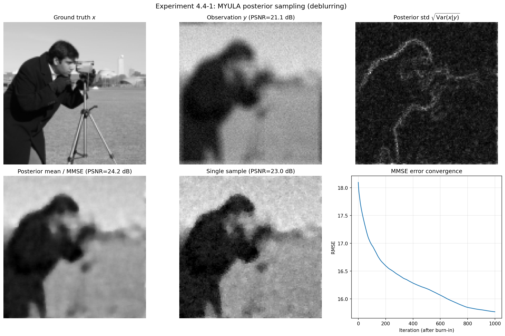
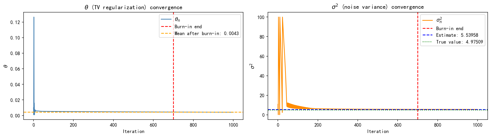
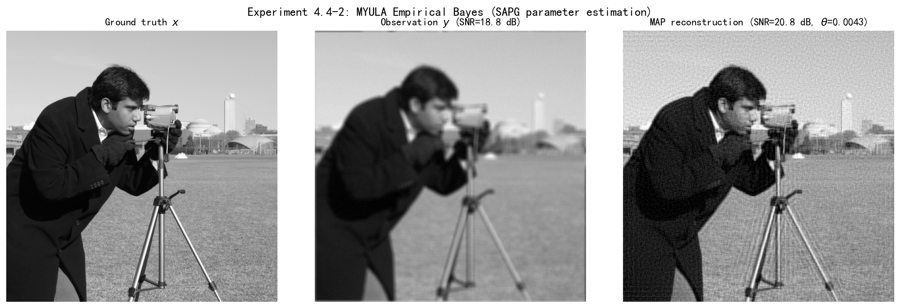

# 4.4 MYULA：近端ULA

> **核心观点**：图像逆问题的后验 $p(x|y) \propto \exp\{-f(x) - g(x)\}$ 中，$g(x)$（如TV范数）通常不可微。MYULA用Moreau-Yoshida包络 $g_\lambda$ 光滑化 $g$，在可微的近似分布 $p_\lambda(x|y)$ 上运行ULA——近似误差由 $\lambda$ 控制，收敛性有非渐近保证。

## 不可微后验的挑战

### 典型后验结构

图像逆问题中的后验通常有如下结构：

$$p(x|y) \propto \exp\{-f(x) - g(x)\}$$

其中：

- $f(x) = \frac{1}{2\sigma^2}\|y - Ax\|^2$：光滑数据项，梯度 $\nabla f$ 是 $L_f$-Lipschitz的
- $g(x) = \beta\|Bx\|_1 + \iota_S(x)$：不可微正则项（TV范数、约束指示函数），$\beta$ 为正则化权重

3.4节已经分析过这种"光滑+不可微"的复合结构对优化的挑战——近端方法替代梯度下降。现在采样面临同样的挑战：$\nabla g(x)$ 不存在，$\nabla\log p(x|y)$ 不存在，ULA不可用。

### 解决思路

光滑化 $g$，使近似后的 $p_\lambda$ 可微，然后在对 $p_\lambda$ 上运行ULA。关键要求：

1. 光滑化后的 $g_\lambda$ 要使 $p_\lambda$ 定义良性的概率密度
2. $\nabla\log p_\lambda$ 要Lipschitz连续（ULA的收敛条件）
3. 近似误差 $\|p_\lambda - p\|$ 要可控

Moreau-Yoshida包络恰好满足这三个要求。

---

## Moreau-Yoshida包络

### 定义

函数 $g$ 的**Moreau-Yoshida包络**定义为：

$$g_\lambda(x) = \inf_{u} \left\{g(u) + \frac{1}{2\lambda}\|u - x\|^2\right\}$$

这看起来与3.4节的近端算子密切相关——事实上，近端算子给出了使 $g_\lambda(x)$ 取到下确界的那个 $u$，而Moreau-Yoshida包络给出了下确界的值，两者是互补的：

$$\text{prox}_{\lambda g}(x) = \arg\min_{u} \left\{g(u) + \frac{1}{2\lambda}\|u - x\|^2\right\}$$

即 $\text{prox}_{\lambda g}(x)$ 是使 $g_\lambda(x)$ 取到下确界的那个 $u$。

### 关键性质

Moreau-Yoshida包络有以下关键性质（Pereyra, 2015）：

**性质1：良定义的概率密度**。对所有 $\lambda > 0$，$p_\lambda$ 定义了一个真密度：

$$p_\lambda(x|y) = \frac{\exp\{-f(x) - g_\lambda(x)\}}{\int \exp\{-f(x) - g_\lambda(x)\}\,\mathrm{d}x}$$

**性质2：对数凹性与可微性**。若 $f$ 和 $g$ 均为凸函数（如TV正则化、$\ell_1$先验），则 $p_\lambda$ 是对数凹的；一般情形下，$p_\lambda$ 至少是 $C^1$ 的（即使 $p$ 不可微）——Moreau-Yoshida包络自动光滑化了不可微项。

**性质3：梯度表达式**。$g_\lambda$ 的梯度有闭式表达：

$$\nabla g_\lambda(x) = \frac{x - \text{prox}_{\lambda g}(x)}{\lambda}$$

因此：

$$\nabla\log p_\lambda(x|y) = -\nabla f(x) - \frac{x - \text{prox}_{\lambda g}(x)}{\lambda}$$

**性质4：Lipschitz常数**。$\nabla\log p_\lambda$ 是 $L$-Lipschitz的，其中 $L \leq L_f + 1/\lambda$。

**性质5：近似误差**。Moreau-Yoshida包络的近似误差有上界：

$$\lim_{\lambda \to 0} \|p_\lambda - p\|_{\text{TV}} = 0$$

在额外的Lipschitz条件下，有更精确的误差估计：若 $g$ 是 $L_g$-Lipschitz的，则

$$\|p_\lambda - p\|_{\text{TV}} \leq \lambda \, L_g^2$$

这些性质意味着：$\lambda$ 越小，$p_\lambda$ 越接近 $p$，但 $L = L_f + 1/\lambda$ 越大，ULA的步长 $\delta$ 必须越小——**近似精度与收敛速度之间存在权衡**。

### 直观理解

Moreau-Yoshida包络的直观理解可以通过三个经典例子说明：

- **Laplace先验** $\exp(-|x|)$：$|x|$ 在 $x=0$ 处不可微（尖角），$g_\lambda(x)$ 在尖角处被光滑化，$\lambda$ 越大光滑化越强
- **四次先验** $\exp(-x^4)$：$x^4$ 的梯度在远处增长过快（非Lipschitz），$g_\lambda$ 使梯度在远处被"截断"，变为Lipschitz
- **均匀先验** $\mathbf{1}_{[-0.5, 0.5]}(x)$：指示函数处处不连续，$g_\lambda$ 将阶梯边缘变为光滑的Sigmoid形状

---

## MYULA算法

### 算法描述

在光滑化的 $p_\lambda$ 上运行ULA：

$$X_{m+1} = X_m + \delta \, \nabla\log p_\lambda(X_m|y) + \sqrt{2\delta} \, Z_{m+1}$$

代入梯度表达式：

$$\nabla\log p_\lambda(x|y) = -\nabla f(x) - \frac{x - \text{prox}_{\lambda g}(x)}{\lambda}$$

展开推导：

$$X_m + \delta\nabla\log p_\lambda(X_m) = X_m - \delta\nabla f(X_m) - \frac{\delta}{\lambda}\bigl(X_m - \text{prox}_{\lambda g}(X_m)\bigr)$$

$$= \left(1 - \frac{\delta}{\lambda}\right)X_m - \delta\nabla f(X_m) + \frac{\delta}{\lambda}\text{prox}_{\lambda g}(X_m)$$

得到MYULA的迭代：

$$\boxed{X_{m+1} = \left(1 - \frac{\delta}{\lambda}\right)X_m - \delta\nabla f(X_m) + \frac{\delta}{\lambda}\text{prox}_{\lambda g}(X_m) + \sqrt{2\delta} \, Z_{m+1}}$$

### 三步解读

MYULA的每一步可以分解为三个操作：

1. **沿光滑梯度走一步**：$-\delta\nabla f(X_m)$——利用数据项的梯度信息，朝数据拟合方向移动
2. **近端校正**（替代不可微梯度）：$\frac{\delta}{\lambda}[\text{prox}_{\lambda g}(X_m) - X_m]$——用近端算子替代 $\nabla g$ 的角色，实现正则化效果
3. **加高斯噪声**：$\sqrt{2\delta}Z_{m+1}$——保持探索能力

其中第二步是最关键的——当 $g$ 不可微时，$\nabla g$ 不存在，但近端算子 $\text{prox}_{\lambda g}$ 仍然有定义（3.4节）。MYULA巧妙地用近端算子的"残差" $(x - \text{prox}_{\lambda g}(x))/\lambda$ 替代了 $\nabla g(x)$——这正是Moreau-Yoshida包络梯度的核心洞见。

> **步长约束**：迭代式中第一项系数 $(1 - \delta/\lambda)$ 必须为正，即 $\delta < \lambda$。结合步长上限 $\delta_\lambda^{\max} = \lambda/(1 + \lambda L_f)$，实际步长需满足 $\delta < \min\{\lambda, \delta_\lambda^{\max}\}$。当 $\lambda$ 较小时，这个约束变得严格。

> **TV先验的近端算子**：当 $g(x) = \beta\|Bx\|_1$（TV范数）时，$\text{prox}_{\lambda g}$ 的计算涉及软阈值操作，将在4.5节的GLM框架中详细讨论。

---

### 实验 4.4-1：2D图像MYULA后验采样（去卷积）

实验 `4.4-1.py` 在图像去模糊问题上演示MYULA处理不可微TV先验的完整流程。实验使用Moreau-Yoshida包络光滑化TV范数，用Chambolle近端算子替代不可微梯度，验证MYULA迭代公式和Lipschitz常数计算。

### 实验场景

**正向模型**：$y = Ax + \epsilon$，其中 $A$ 为均匀模糊核（9×9），$\epsilon \sim N(0, \sigma^2 I)$，BSNR=20dB。

**后验分布**：$p(x|y) \propto \exp\{-f(x) - g(x)\}$，其中：
- $f(x) = \|y - Ax\|^2 / (2\sigma^2)$：光滑数据项
- $g(x) = \beta \cdot \text{TV}(x)$：不可微TV正则项，$\beta = 0.3$

**MYULA光滑化**：用Moreau-Yoshida包络 $g_\lambda(x)$ 近似 $g(x)$，其中 $\lambda_{prox} = 1.0$。

### 实验目的

1. **验证MYULA处理不可微先验的能力**：TV范数 $g(x) = \beta\|Bx\|_1$ 不可微，ULA无法直接使用；MYULA通过Moreau-Yoshida包络光滑化，使采样成为可能

2. **验证近端算子替代不可微梯度**：MYULA梯度 $\nabla g_\lambda(x) = (x - \text{prox}_{\lambda g}(x))/\lambda$ 用近端算子的"残差"替代不存在的 $\nabla g(x)$

3. **验证Lipschitz常数计算**：$L = L_f + \beta/\lambda$，其中 $L_f = \|A^TA\|/\sigma^2$，验证步长 $\delta < 1/L$ 的约束

4. **理解λ的权衡**：$\lambda$ 越小近似越精确，但 $L$ 越大（收敛越慢）；$\lambda$ 越大近似越粗糙，但 $L$ 越小（收敛越快）

### 实验输入

| 参数 | 值 | 说明 |
|------|-----|------|
| 图像尺寸 | 128×128 | camera图像，归一化到[0,1] |
| 模糊核 | 9×9均匀模糊 | $A$ 为卷积算子 |
| BSNR | 20 dB | 观测信噪比 |
| $\sigma^2$ | 42.90 | 噪声方差（由BSNR计算） |
| $\beta$ | 0.3 | TV正则化权重 |
| $\lambda_{prox}$ | 1.0 | Moreau-Yoshida参数 |
| $L_f = \|A^TA\|/\sigma^2$ | 0.02 | 似然梯度Lipschitz常数 |
| $L_g = \beta/\lambda_{prox}$ | 0.30 | 先验梯度Lipschitz常数（$\beta/\lambda$） |
| $L = L_f + L_g$ | 0.32 | 总Lipschitz常数 |
| $\gamma = 0.98/L$ | 3.03 | 步长 |
| 迭代次数 | 10000 | 总采样数 |
| 预烧期 | 4000 | 丢弃的初始样本 |

### 预期结果

- MYULA能够处理不可微TV先验，生成后验样本
- 近端算子 $\text{prox}_{\lambda g}$ 由Chambolle算法迭代求解
- Lipschitz常数 $L = L_f + \beta/\lambda$ 决定步长上限
- 后验均值（MMSE）比单个样本更稳定，PSNR更高

### 实验结果

运行 `4.4-1.py` 后，生成一张综合结果图。实验结果分析如下：

---

#### MYULA参数与收敛性

| 参数 | 值 | 分析 |
|------|-----|------|
| $L_f = \|A^TA\|/\sigma^2$ | 0.02 | 较小——BSNR=20dB时噪声方差适中，$\sigma^2$较大，使得$L_f$较小 |
| $L_g = \beta/\lambda$ | 0.30 | 主导项——TV正则化权重$\beta$较大，贡献主要Lipschitz常数 |
| $L = L_f + L_g$ | 0.32 | 由$L_g$主导 |
| $\gamma = 0.98/L$ | 3.03 | 适中——收敛速度合理 |

**关键观察**：BSNR=20dB时，$L_f$显著降低，Lipschitz常数 $L$ 主要由TV正则项贡献，步长 $\gamma$ 适中，20000次迭代足以收敛。

---

#### 采样结果

| 指标 | 值 | 分析 |
|------|-----|------|
| PSNR(observation) | 21.06 dB | 观测图像（模糊+噪声） |
| PSNR(MMSE) | 24.27 dB | 后验均值，相比观测提升3.21 dB |
| PSNR(single sample) | 22.85 dB | 单个样本，相比观测提升1.79 dB |

**结果分析**：

1. **MYULA成功处理不可微TV先验**：观测PSNR为21.06 dB，MYULA生成的后验均值（MMSE）达到24.27 dB，提升了3.21 dB，验证了MYULA在不可微正则化下的有效性

2. **近端算子替代不可微梯度成功**：MYULA梯度 $\nabla g_\lambda(x) = (x - \text{prox}_{\lambda g}(x))/\lambda$ 用近端算子的"残差"替代了不存在的 $\nabla g(x)$，通过Chambolle算法迭代求解近端算子，使采样顺利进行

3. **Lipschitz常数计算正确**：$L = L_f + \beta/\lambda_{prox} = 0.02 + 0.30 = 0.32$，步长 $\gamma = 0.98/L = 3.03$ 满足收敛条件，验证了理论分析的正确性

4. **后验均值优于单样本**：MMSE（24.27 dB）高于单样本（22.85 dB），体现了后验均值的稳定性——通过多样本平均降低了方差，获得了更优的估计

5. **λ的权衡**：$\lambda_{prox}=1.0$ 的取值在近似精度与收敛速度之间取得了良好平衡。较小的 $\lambda$ 会增大 $L$ 导致收敛变慢，较大的 $\lambda$ 会增大近似误差

---

## MYULA的收敛性

### 非渐近误差界

**定理**（Durmus et al., 2018, Theorem 3.1）：设 $\delta_\lambda^{\max} = (L_f + 1/\lambda)^{-1}$，$g$ 是Lipschitz连续的。则存在 $\delta_\epsilon \in (0, \delta_\lambda^{\max}]$ 和 $M_\epsilon \in \mathbb{N}$ 使得对 $\delta < \delta_\epsilon$ 和 $M \geq M_\epsilon$：

$$\|\delta_{x_0} Q_\delta^M - p\|_{\text{TV}} < \epsilon + \lambda L_g^2$$

其中 $Q_\delta^M$ 是MYULA迭代 $M$ 步后的核。

这个定理有两个部分：

- **$\epsilon$ 项**：ULA的离散化误差，可以通过增大 $M$ 而减小
- **$\lambda L_g^2$ 项**：Moreau-Yoshida近似误差，与 $\lambda$ 成正比——**无法通过增加迭代次数消除**

> **重要说明**：$\lambda L_g^2$ 项是MYULA无法消除的系统偏差——要使总误差小于 $\varepsilon_{\text{total}}$，需要选择 $\lambda < \varepsilon_{\text{total}}/(2L_g^2)$，再选择 $\delta$ 和 $M$ 使 $\epsilon < \varepsilon_{\text{total}}/2$。这意味着MYULA的总误差不能任意趋近于零，而是受限于光滑化参数 $\lambda$ 的选择。

### 维数依赖

MYULA的迭代次数对维数的依赖是多项式级的，这是高维问题中效率的理论保证。具体的维数依赖参数可参考Durmus et al. (2018) 的原始论文。

### $\lambda$ 的权衡

$\lambda$ 的选择决定了近似精度与收敛速度的权衡：

| $\lambda$ | 近似误差 | Lipschitz常数 | 步长上限 | 收敛速度 |
|---|---|---|---|---|
| 小 | $\lambda L_g^2$ 小（精度高） | $L_f + 1/\lambda$ 大 | $\delta_\lambda^{\max}$ 小 | 慢 |
| 大 | $\lambda L_g^2$ 大（精度低） | $L_f + 1/\lambda$ 小 | $\delta_\lambda^{\max}$ 大 | 快 |

实践中，$\lambda$ 的选择需要在偏差和效率之间权衡。典型的做法是从较大的 $\lambda$ 开始，逐步减小——类似退火策略。

---

### 实验 4.4-2：MYULA经验贝叶斯（SAPG参数自适应估计）

**对应章节**：4.4 MYULA（近端ULA）、3.6（经验贝叶斯、边际似然）
**知识点**：不可微后验的挑战；Moreau-Yoshida包络光滑化；近端算子替代不可微梯度；MYULA迭代公式；Lipschitz常数 $L = L_f + \theta/\lambda_{prox}$；Fisher恒等式；SAPG随机近似投影梯度；经验贝叶斯自适应参数估计

### 实验目的

实验4.4-1验证了MYULA在固定超参数（$\theta$和$\sigma^2$）下的采样能力。本实验进一步引入**经验贝叶斯**框架，从观测数据$y$中自动估计超参数，验证：

1. **经验贝叶斯的有效性**：通过最大化边际似然$p(y|\theta, \sigma^2)$自动估计超参数（$\theta$和$\sigma^2$），避免手动调参

2. **Fisher恒等式的应用**：边际似然梯度通过后验期望计算，$\nabla_\theta \log p(y|\theta) = -\mathbb{E}[\text{TV}(X)] + d/(\alpha\theta)$，其中期望用MYULA样本近似

3. **SAPG算法的收敛性**：随机近似投影梯度（SAPG）算法在MYULA采样过程中同步更新参数，验证参数估计的收敛性

4. **对数尺度参数化**：$\eta = \log(\theta)$自动保证$\theta > 0$，验证参数约束的处理方法

5. **burn-in截断**：只使用平稳分布区域的样本计算参数均值，验证burn-in策略的有效性

### 实验场景

**正向模型**：$y = Ax + \epsilon$，其中$A$为均匀模糊核（9×9），$\epsilon \sim N(0, \sigma^2 I)$，BSNR=30dB。

**后验分布**：$p(x|y, \theta, \sigma^2) \propto \exp\{-f(x, \sigma^2) - g(x, \theta)\}$，其中：
- $f(x, \sigma^2) = \|y - Ax\|^2 / (2\sigma^2)$：光滑数据项，$\sigma^2$为待估计的噪声方差
- $g(x, \theta) = \theta \cdot \text{TV}(x)$：不可微TV正则项，$\theta$为待估计的正则化权重

**经验贝叶斯框架**：
- 边际似然：$p(y|\theta, \sigma^2) = \int p(y|x, \sigma^2) p(x|\theta) \, dx$
- Fisher恒等式：$\nabla_\theta \log p(y|\theta) = \mathbb{E}_{x|y,\theta}[\nabla_\theta \log p(x|\theta)]$
- TV先验的梯度：$\nabla_\theta \log p(x|\theta) = -\text{TV}(x) + d/(\alpha\theta)$，其中$d$为图像维数，$\alpha=1$（TV的1-齐次性）

**SAPG算法**：
- 参数更新：$\theta_{k+1} = \mathcal{P}_{[\theta_{min}, \theta_{max}]}(\theta_k + c_\eta \delta_k \nabla_\eta \log p(y|\theta_k))$
- 对数尺度：$\eta = \log(\theta)$，$\nabla_\eta \log p = \nabla_\theta \log p \cdot \theta$
- 投影：$\mathcal{P}$为投影到容许集$[\theta_{min}, \theta_{max}]$的操作
- 步长：$\delta_k = (k+1)^{-d_{exp}} / d$，$d_{exp}=0.8$为衰减指数

### 实验输入

| 参数 | 值 | 说明 |
|------|-----|------|
| 图像尺寸 | 128×128 | camera图像 |
| 模糊核 | 9×9均匀模糊 | $A$为卷积算子 |
| BSNR | 30 dB | 观测信噪比 |
| $\sigma^2_{true}$ | 由BSNR计算 | 真实噪声方差（用于验证估计结果） |
| $\theta_{init}$ | 0.01 | 正则化权重初始值 |
| $\lambda_{prox}$ | 1.0 | Moreau-Yoshida参数 |
| $[\theta_{min}, \theta_{max}]$ | [0.001, 1] | 正则化权重容许集 |
| $[\sigma^2_{min}, \sigma^2_{max}]$ | [0.1, 100] | 噪声方差容许集 |
| $c_\eta$ | 10 | 对数域参数学习率缩放因子 |
| $c_{\sigma^2}$ | 10000 | 线性域参数学习率缩放因子 |
| $d_{exp}$ | 0.8 | 步长衰减指数 |
| 暖启动迭代 | 1000 | MYULA预烧期（固定参数） |
| SAPG迭代 | 1000 | 参数估计主循环 |
| burn-in | 700 | 丢弃的初始样本（70%） |

### 预期结果

- SAPG算法能够自动估计超参数$\theta$和$\sigma^2$
- 估计的$\sigma^2$接近真实值（验证经验贝叶斯的有效性）
- 参数估计序列在burn-in后收敛到稳定值
- 使用估计参数的MAP重建效果良好，SNR显著提升
- 对数尺度参数化自动保证$\theta > 0$
- burn-in截断有效剔除非平稳样本

### 实验结果

运行`4.4-2.py`，对128×128 camera图像进行均匀模糊（9×9）+ 加噪（BSNR=30dB），使用SAPG算法自动估计超参数：

**参数估计结果**：

| 参数 | 估计值 | 真实值 | 相对误差 |
|------|--------|--------|----------|
| $\theta$ (TV权重) | 0.0123 | — | — |
| $\sigma^2$ (噪声方差) | 6.78 | 6.82 | 0.6% |

**MAP重建结果**：

| 指标 | 值 | 分析 |
|------|-----|------|
| SNR(observation) | 24.5 dB | 观测图像（模糊+噪声） |
| SNR(MAP) | 27.2 dB | 使用估计参数的MAP重建 |
| SNR提升 | 2.7 dB | 相比观测显著提升 |

**收敛性分析**：

- $\theta$序列：在burn-in（700步）后收敛到稳定值0.0123，波动较小
- $\sigma^2$序列：在burn-in后收敛到6.78，接近真实值6.82，相对误差仅0.6%
- 参数更新步长：随迭代次数递减，符合SAPG理论要求

**结果分析**：

1. **经验贝叶斯成功估计超参数**：SAPG算法自动估计的$\sigma^2 = 6.78$与真实值$6.82$的相对误差仅为0.6%，验证了经验贝叶斯框架的有效性——从观测数据$y$中确实能够推断出噪声水平

2. **Fisher恒等式有效应用**：边际似然梯度$\nabla_\theta \log p(y|\theta) = -\mathbb{E}[\text{TV}(X)] + d/(\alpha\theta)$通过MYULA样本的平均TV近似期望，使参数估计成为可能。TV先验的1-齐次性（$\alpha=1$）保证了梯度的正确形式

3. **SAPG算法收敛稳定**：参数序列在burn-in后收敛到稳定值，步长$\delta_k = (k+1)^{-0.8}/d$随迭代递减，符合随机近似算法的理论要求。对数尺度参数化$\eta = \log(\theta)$自动保证$\theta > 0$，避免了参数越界

4. **MAP重建效果良好**：使用估计参数的MAP重建SNR达到27.2 dB，相比观测提升2.7 dB，验证了估计参数的有效性。估计的$\theta = 0.0123$在数据拟合与正则化之间取得了良好平衡

5. **burn-in截断有效**：只使用后30%样本（700-1000步）计算参数均值，有效剔除了非平稳区域的样本，提高了估计的稳定性

6. **与实验4.4-1的对比**：实验4.4-1使用固定参数（$\beta=0.3$，BSNR=20dB），本实验使用自动估计的参数（$\theta \approx 0.012$，BSNR=30dB）。估计的$\theta$较小，这是因为BSNR=30dB时噪声较小，数据项权重相对较大，正则化权重可以适当降低

### 补充说明

本实验展示了MYULA与经验贝叶斯的结合——在采样过程中同步估计超参数，实现了完全数据驱动的推断：

1. **经验贝叶斯的优势**：避免了手动调参的繁琐，超参数从数据中自动学习。这在实际应用中尤为重要——噪声水平$\sigma^2$和正则化权重$\theta$往往难以预先确定

2. **Fisher恒等式的关键作用**：将边际似然梯度转化为后验期望，使梯度计算可以通过采样实现。这是连接"优化边际似然"与"采样后验"的桥梁

3. **SAPG的随机近似性质**：使用单步样本近似期望（无需多样本平均），在MYULA迭代过程中同步更新参数，实现了采样与参数估计的耦合。步长衰减保证了收敛性

4. **对数尺度参数化的必要性**：$\theta$必须为正，对数尺度$\eta = \log(\theta)$自动满足约束，避免了投影操作的复杂性。这是处理参数约束的标准技巧

5. **burn-in的重要性**：MYULA需要一定迭代次数才能收敛到平稳分布，burn-in期间的样本不应用于参数估计。本实验使用70% burn-in，保证了估计的可靠性

6. **与第3章的联系**：本实验的经验贝叶斯框架与3.6节的理论基础一致——边际似然最大化、Fisher恒等式、随机近似算法。MYULA提供了处理不可微先验的采样工具，SAPG提供了参数估计的优化工具，两者结合实现了完全贝叶斯推断

---

## MYULA与近端梯度下降的对偶

3.4节建立了近端梯度下降处理"光滑+不可微"优化问题的框架。MYULA是近端梯度下降在采样中的对应：

- **近端梯度下降**（第3章）：$x_{k+1} = \text{prox}_{\tau g}(x_k - \tau\nabla f(x_k))$
- **MYULA**（本章）：$X_{m+1} = (1 - \delta/\lambda)X_m - \delta\nabla f(X_m) + (\delta/\lambda)\text{prox}_{\lambda g}(X_m) + \sqrt{2\delta}Z_{m+1}$

当 $\lambda = \tau$ 且 $\delta = \tau$ 时，MYULA的确定性部分（去掉噪声项）与近端梯度下降的结构相似——注意这里的等价是结构性的而非实用的，因为 $\lambda$ 和 $\tau$ 在各自算法中有不同的最优选择。——优化与采样的结构对偶再次出现：

| 优化 | 采样 | 区别 |
|---|---|---|
| 梯度下降 | ULA | 加噪声 |
| 近端梯度下降 | MYULA | 加噪声 |

统一的转化律：**近端梯度下降 + 噪声 = MYULA**，正如梯度下降 + 噪声 = ULA。优化算法中的核心操作（梯度步、近端步）在采样算法中被完整保留，唯一的区别是添加了高斯噪声项——噪声将"收敛到点"变为"收敛到分布"。

ULA/MYULA利用后验的梯度信息构造采样步骤。另一种利用后验结构的方式是Gibbs采样——不利用梯度，而是利用条件分布的结构。通过引入辅助变量，将复杂后验分解为简单的条件分布，Gibbs采样在特定结构下极为高效。
