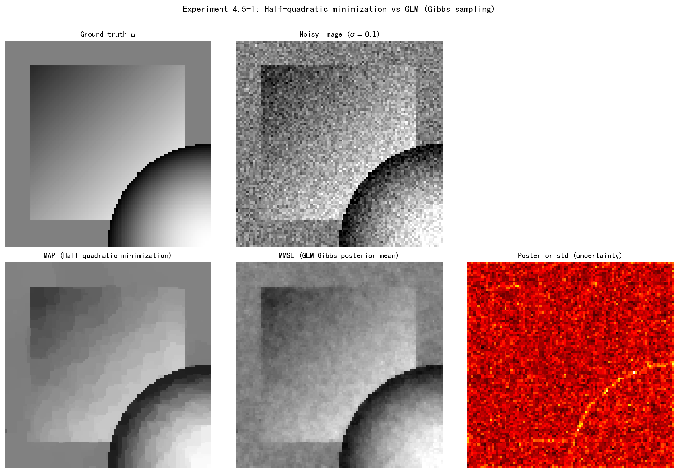

# 4.5 Gibbs采样：利用条件结构的采样

> "ULA 靠梯度找路，Gibbs 靠的是'分而治之'——把一团乱麻的联合分布，拆成几个易于抽样的条件分布，交替更新、轮流抽取。"

4.3–4.4 节我们靠**梯度**让采样"有方向"。但还存在另一条与梯度正交的路子：利用后验的**条件结构**。这就是 Gibbs 采样（吉布斯采样）——通过引入辅助变量，把复杂的联合分布拆成简单的条件分布，交替从中抽取。GLM（Gaussian Latent Machine，高斯隐变量机）框架会在 TV 先验下给出一个非常优雅的实现。更重要的是，它揭示了一个贯穿全章的对偶：**Gibbs = 带噪声的交替最小化**。

**本节目标**（读完后你应该能）：
- 说清 Gibbs 如何从联合分布"轮流抽条件"得到边缘后验
- 理解"Gibbs 是 MH 的特例（接受率恒为 1）"
- 用 TV 先验的具体例子，写出 GLM 框架下的 Gibbs 采样循环
- 认出"Gibbs = 带噪声的 Gauss-Seidel"，把优化→采样的转化律补全

---

## 一、Gibbs 的基本思想：从联合到条件

ULA/MYULA 利用梯度。Gibbs 另辟蹊径：不依赖梯度，而是依赖**条件分布结构**。

考虑联合分布 $p(x,z)$，我们想要的是它的边缘 $p(x)=\int p(x,z)\,\mathrm{d}z$。Gibbs 的做法是交替从条件分布中抽取：

$$x^{k+1} \sim p_{X|Z=z^k}, \qquad z^{k+1} \sim p_{Z|X=x^{k+1}}$$

直觉：我们无需直接从难以处理的联合分布中抽样，只要能抽"给定 $z$ 时的 $x$"和"给定 $x$ 时的 $z$"这两个条件分布即可——交替更新，链跑足够久后 $(x,z)$ 的配对就服从联合分布；再把 $z$ **边缘化**（marginalize，即对它积分消去），$x$ 的部分自然来自目标边缘 $p(x)$。

**Gibbs 其实是 MH 的特例。** 当提议核恰好取条件分布时，MH 的接受概率恒为 1：

*验证*：固定 $z=z^k$，Gibbs 只更新 $x$。把提议核取为 $Q(x'|x)=p_{X|Z=z}(x')$ 代入 MH 接受概率：
$$\alpha = \min\left\{1, \frac{p(x',z)}{p(x,z)}\cdot\frac{p_{X|Z=z}(x)}{p_{X|Z=z}(x')}\right\}$$
利用 $p(x,z)=p(x|z)\,p(z)$ 与 $p(x',z)=p(x'|z)\,p(z)$，分子分母中的 $p(z)$ 与条件密度逐项相消，比值恰为 1。$\square$

于是 Gibbs 最直接的收益浮现出来：**不用调步长、不用挑提议**——条件分布本身就是"最优提议"，每一步都必然被接受。

---

## 二、TV 先验的 Gibbs：从一个具体例子出发

### 半二次最小化（复习优化视角）

第3章 3.4 节处理不可微正则项用的是近端方法。另一种优化套路叫**半二次最小化**（half-quadratic minimization，Geman & Reynolds, 1992）：把函数 $f(x)$ 表示成关于辅助变量 $z$ 的最小值
$$f(x)=\min_z q(x,z)$$
其中 $q$ 关于 $x$ 是二次的，然后交替最小化：
$$x^{k+1}=\arg\min_x q(x,z^k),\qquad z^{k+1}=\arg\min_z q(x^{k+1},z)$$

**TV 的具体例子**：绝对值可以这样表示
$$|t| = \min_{z>0}\left\{\frac{t^2}{2z}+\frac{z}{2}\right\}$$
验证：固定 $t$ 对 $z$ 求导得 $z^*=|t|$，代回即得 $|t|$。这里的辅助变量 $z$ 有明确的现实含义——它度量局部梯度幅度 $|t|$ 的"尺度"：边缘处 $z$ 大、平坦处 $z$ 小。

### TV 先验的高斯尺度混合表示

TV 先验的 Laplace 因子 $\exp(-\lambda|t|)$ 可以写成**高斯尺度混合**（Gaussian scale mixture）：
$$\frac{\lambda}{2}\exp(-\lambda|t|) = \int_{\mathbb{R}^+} \frac{1}{\sqrt{2\pi z}} \exp\left(-\frac{t^2}{2z}\right)\cdot \frac{\lambda^2}{2}\exp\left(-\frac{\lambda^2 z}{2}\right)\mathrm{d}z$$

意思是：Laplace 分布 = 方差为 $z$ 的高斯分布与某个 Gamma 型分布（核为 $\exp(-\lambda^2 z/2)$）的混合。这与上面的半二次表示遥相呼应：在概率框架下构造联合分布 $p(t,z)\propto\exp(-t^2/(2z)-z/2)$，边缘化 $z$ 就回到 Laplace。**转化的关键**：优化里的半二次最小化在 $(t,z)$ 上交替求 $\min$，采样里的 Gibbs 在 $p(t,z)$ 上交替抽样——操作对象一模一样，区别只在于优化取众数、采样取分布（边缘化）。

### 条件分布的具体形式

引入辅助变量 $z=(z_1,\ldots,z_m)$ 后，TV 先验 $p(x)\propto\exp(-\lambda\|Kx\|_1)$ 对应的联合分布为
$$p(x,z) \propto \exp\left(-\frac{1}{2}(Kx)^\top \mathrm{diag}(z)^{-1}(Kx)\right)\cdot\prod_{j=1}^m p(z_j)$$

其中 $K$ 是有限差分算子，$(Kx)_j$ 是第 $j$ 个局部梯度分量，$z_j$ 是它的尺度变量。两个条件方向分别是：

- **$p_{Z_j|X=t}$**：给定 $(Kx)_j=t$，$z_j$ 的条件分布是**广义逆高斯分布** $\text{GIG}(\lambda^2,t^2,1/2)$——一维分布，可直接抽样。
- **$p_{X|Z}$**：多元高斯 $x\sim\mathcal{N}(0,(K^\top\mathrm{diag}(z)^{-1}K)^{-1})$——同样可抽。

> **GIG 白话**：广义逆高斯 $\text{GIG}(\psi,\chi,\nu)$ 的密度正比于 $z^{\nu-1}\exp(-\chi/(2z)-\psi z/2)$。对照条件 $p(z_j|t)$ 可认出 $\nu=1/2,\ \chi=t^2,\ \psi=\lambda^2$。它有一套成熟的采样算法（Hörmann & Leydold），主流统计软件中可直接调用。

### Gibbs 采样算法（TV 先验后验）

给定观测 $y$，后验 $p(x|y)\propto\exp(-\frac{1}{2\sigma^2}\|y-Ax\|^2-\lambda\|Kx\|_1)$：
1. 初始化 $z^0$
2. 对 $k=0,1,2,\ldots$：
   - **抽 $x$**：$x^{k+1}\sim\mathcal{N}(\mu(z^k,y),\Sigma(z^k,y))$，其中
     $$\Sigma(z,y)=\left(\frac{1}{\sigma^2}A^\top A+K^\top\mathrm{diag}(z)^{-1}K\right)^{-1},\quad \mu(z,y)=\Sigma(z,y)\cdot\frac{1}{\sigma^2}A^\top y$$
     协方差 $\Sigma$ 是"数据精度 + 当前尺度下的先验精度"之和的逆——尺度 $z_j$ 大的地方先验约束弱，$x$ 的不确定性就大；
   - **抽 $z$**：$z_j^{k+1}\sim\text{GIG}(\lambda^2,(Kx^{k+1})_j^2,1/2)$（各分量独立）——让尺度变量重新适应当前图像的局部梯度。

> 特例：只从先验采样（无观测）时，第一步退化为 $x^{k+1}\sim\mathcal{N}(0,(K^\top\mathrm{diag}(z^k)^{-1}K)^{-1})$（即令 $A=0$ 或 $\sigma\to\infty$）。

---

## 三、GLM：把 TV 例子抽象成框架

上面的 TV 例子是**专家乘积**（Product of Experts, PoE）先验 $p_X(x)\propto\prod_{j=1}^m\phi_j((Kx)_j)$ 的特例（$K$ 为线性算子，如有限差分）。GLM（Kuric et al., 2025）把 PoE 先验"提升"到联合空间：

$$p_{X,Z}(x,z) = \underbrace{\mathcal{N}(Kx\mid\tilde{\mu}(z),\tilde{\Sigma}(z))}_{p_{KX|Z=z}(Kx)}\cdot\prod_{j=1}^m p_j(z_j)$$

其中 $\tilde{\mu}(z),\tilde{\Sigma}(z)$ 是依赖尺度变量 $z$ 的均值与协方差，$p_j$ 是各分量独立的隐先验。由此诱导的条件结构：

- **$p_{X|Z}$**：多元高斯 $\mathcal{N}(x\mid\mu(z),\Sigma(z))$，可直接抽；
- **$p_{Z|X}$**：$m$ 个独立的一元分布，可逐个抽。

Gibbs 在 GLM 上交替抽 $x$ 和 $z$，**每一步都有闭式解**——这就是它的优雅之处。TV 先验只是取 $\tilde{\mu}=0,\ \tilde{\Sigma}=\mathrm{diag}(z),\ p(z_j)\propto z_j^{-1/2}e^{-\lambda^2 z_j/2}$ 的特例。

---

## 四、Gibbs = 带噪声的交替最小化（核心对偶）

看一个最干净的例子。二元高斯 $p(x_1,x_2)=\mathcal{N}(\mu,Q^{-1})$，精度矩阵 $Q=\begin{pmatrix}Q_{11}&Q_{12}\\Q_{21}&Q_{22}\end{pmatrix}$。

**Gibbs 采样**：
$$X_1^{k+1}\sim\mathcal{N}(\mu_1-Q_{11}^{-1}Q_{12}(X_2^k-\mu_2),\ Q_{11}^{-1}),\quad X_2^{k+1}\sim\mathcal{N}(\mu_2-Q_{22}^{-1}Q_{21}(X_1^{k+1}-\mu_1),\ Q_{22}^{-1})$$

**Gauss-Seidel 迭代**（交替最小化，确定性）：
$$x_1^{k+1}=\mu_1-Q_{11}^{-1}Q_{12}(x_2^k-\mu_2),\quad x_2^{k+1}=\mu_2-Q_{22}^{-1}Q_{21}(x_1^{k+1}-\mu_1)$$

对比可见：**Gibbs 的条件均值，恰是 Gauss-Seidel 的迭代值；唯一区别是 Gibbs 在均值周围叠加了方差 $Q_{ii}^{-1}$ 的高斯噪声。** 一句话——**Gibbs 就是带噪声的 Gauss-Seidel**。

**结构对偶总结**：

| 优化 | 采样 | 区别 |
|---|---|---|
| 交替最小化 | Gibbs采样 | 加噪声 |
| Gauss-Seidel | 带噪声的Gauss-Seidel | 加噪声 |
| 半二次最小化 | GLM | 加噪声 |
| 收敛到众数 | 收敛到分布 | 目标不同 |

至此，我们已经收集到三条"优化→采样"的转化：
1. 梯度下降 → ULA：加噪声
2. 近端梯度下降 → MYULA：加噪声
3. 交替最小化 → Gibbs：加噪声

统一规律一句话：**优化算法 + 噪声 = 采样算法**——噪声把"收敛到一个点"变成"收敛到一片分布"。从更深层次看，这三条转化共享同一个机制：优化算法的确定性更新给出的是后验"最可能的一点"，而按正确方式注入噪声后，同一条更新规则生成的不再是一个点，而是围绕它的整个信念分布。这条规律在 4.6 节的加速方法里还会继续生效。

---

## 实验 4.5-1：半二次最小化 vs GLM Gibbs采样——MAP与MMSE对比

实验 `4.5-1.py` 在图像去噪任务中对比**半二次最小化（MAP估计）**与**GLM Gibbs采样（MMSE估计）**，直观展示优化与采样的结构对偶关系。

### 实验场景

实验考虑TV正则化去噪问题：观测模型 $y = x + \varepsilon$，其中 $\varepsilon \sim \mathcal{N}(0, \sigma^2 I)$ 为加性高斯白噪声。后验分布为：

$$p(x|y) \propto \exp\left(-\frac{1}{2\sigma^2}\|y - x\|^2 - \lambda\|\nabla x\|_1\right)$$

对比两种求解策略：

**半二次最小化（MAP估计）**：利用TV的半二次表示 $|t| = \min_{z>0}\{t^2/(2z) + z/2\}$，交替求解：
- $z^{k+1} = |\nabla x^k|$（确定性更新）
- $x^{k+1} = \arg\min_x \left\{\lambda\|\nabla x\|^2_{z^{-1}} + \frac{1}{2\sigma^2}\|y - x\|^2\right\}$（CG求解）

**GLM Gibbs采样（MMSE估计）**：引入辅助变量 $z$，交替采样：
- $z_j^{k+1} \sim \text{GIG}(\lambda^2, |\nabla x^k|_j^2, 1/2)$（随机采样）
- $x^{k+1} \sim \mathcal{N}(\mu(z^{k+1}, y), \Sigma(z^{k+1}, y))$（条件高斯采样）

### 实验目的

1. **验证优化→采样的转化律**：对比半二次最小化与GLM Gibbs的迭代过程，揭示"Gibbs = 半二次最小化 + 噪声"的结构对偶
2. **对比MAP与MMSE的解形态**：MAP收敛到众数（分段常数），MMSE收敛到后验均值（保留更多细节）
3. **展示不确定性量化**：Gibbs采样提供后验方差估计，揭示解的不确定性分布
4. **验证TV先验的GIG采样**：辅助变量 $z$ 的GIG分布采样是GLM框架的关键步骤

### 实验输入

| 参数 | 设置 |
|------|------|
| 测试图像 | 合成图像，$100 \times 100$ 像素（包含平坦区域、线性渐变、圆形边缘） |
| 噪声模型 | 加性高斯白噪声，$\sigma = 0.1$ |
| TV正则化参数 | $\lambda = 10.0$（MAP与MMSE使用相同参数） |
| 半二次最小化迭代 | 50次 |
| Gibbs采样迭代 | 50次（含20次burn-in，有效样本30个） |

### 预期结果

根据4.5节的理论分析：

| 方法 | 理论预期 | 数学依据 |
|------|----------|----------|
| 半二次最小化（MAP） | 分段常数、边缘锐利、无不确定性信息 | 收敛到后验众数，$\arg\min_x E(x)$ |
| GLM Gibbs（MMSE） | 后验均值、边缘略平滑、提供不确定性估计 | 收敛到后验分布，$\mathbb{E}[x|y]$ |
| 后验标准差 | 边缘处不确定性高、平坦区域不确定性低 | 边缘处梯度大，GIG采样方差大 |

**核心预期**：两种方法的迭代过程结构相同，唯一区别是Gibbs在每一步添加了噪声——这正是"优化算法 + 噪声 = 采样算法"转化律的可视化验证。

### 实际效果

**结果分析**：

| 子图 | 内容 | 观察要点 |
|------|------|----------|
| 第一行左 | Ground truth $u$ | 包含平坦区域（左）、线性渐变（中）、圆形边缘（右） |
| 第一行中 | 噪声图像 $f$ | $\sigma = 0.1$，噪声明显可见 |
| 第二行左 | MAP估计 | 分段常数效果明显，边缘锐利，平坦区域平滑 |
| 第二行中 | MMSE估计 | 后验均值，边缘略平滑，保留更多过渡细节 |
| 第二行右 | 后验标准差 | 边缘处不确定性高（红色），平坦区域不确定性低（蓝色） |

**MAP vs MMSE对比**：

- **MAP（半二次最小化）**：收敛到后验众数，产生典型的TV去噪效果——分段常数、边缘锐利。这是优化视角的解，对应 $\arg\min_x E(x)$。
- **MMSE（Gibbs采样）**：收敛到后验均值，边缘处略有平滑，但保留了更多过渡区域的细节。这是采样视角的解，对应 $\mathbb{E}[x|y]$。
- **不确定性量化**：后验标准差图像清晰显示：边缘处（梯度大）不确定性高，平坦区域（梯度小）不确定性低。这揭示了TV先验在不同区域的置信度差异。

### 核心知识点：优化→采样的转化律验证

本实验直观验证了4.5节的核心结论：

| 优化步骤 | 采样步骤 | 区别 |
|----------|----------|------|
| $z^{k+1} = |\nabla x^k|$（确定性clip） | $z_j^{k+1} \sim \text{GIG}(\lambda^2, |\nabla x^k|_j^2, 1/2)$（随机采样） | 加噪声 |
| $x^{k+1}$ = CG求解精确右端 | $x^{k+1} \sim \mathcal{N}(\mu, \Sigma)$（CG求解带高斯扰动的右端） | 加噪声 |
| 收敛到众数（MAP） | 收敛到分布（MMSE + 不确定性） | 目标不同 |

**转化律**：半二次最小化的每一步，在Gibbs采样中都有对应步骤——唯一的区别是Gibbs添加了适当的噪声。噪声将"收敛到点"变为"收敛到分布"，将MAP变为MMSE。

> **教学意义**：本实验是"优化→采样转化律"的可视化验证。理解这一转化律，有助于建立优化与采样的统一视角：优化算法是采样算法的"去噪版"，采样算法是优化算法的"加噪版"。

---

Gibbs 采样利用条件分布结构，ULA 利用梯度信息——两种策略各有优势。能否进一步加速采样？正如优化中的 Nesterov 加速之于梯度下降，采样中同样存在对应的加速机制——过松弛与惯性 Langevin 算法，这是下一节的主题。
