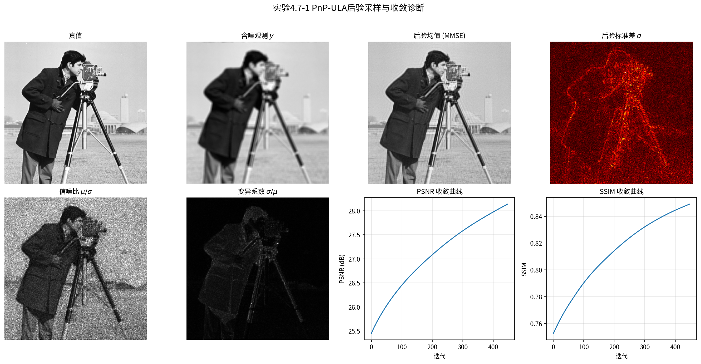
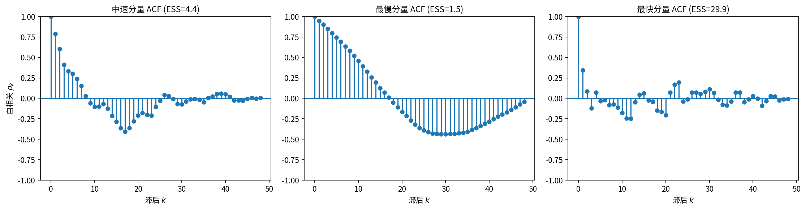

# 4.7 收敛诊断与不确定性量化

> "采样器吐出的是一条链，不是一袋独立样本。你得像质检员一样先问：链收敛了吗？再问：这些样本能告诉我什么？"

4.1–4.6 节我们建立了从后验采样的整套工具箱。但 MCMC 的输出与"独立采样"有根本不同：独立采样给你 $M$ 个独立同分布样本，可直接用于推断；MCMC 给你的是一条马尔可夫链 $X_1,X_2,\ldots,X_M$——相邻样本存在依赖，链还需要时间才能收敛到平稳分布。从"吐出一条链"到"得出可靠推断"，要回答两个问题：**(1) 链收敛了吗？(2) 收敛后怎么用？** 本节就是这最后一步。这一步的思想定位也值得点明：优化只要求交出一个解，采样则交出一整个分布——而分布是有资格被追问"你可信吗"的信念对象。收敛诊断，本质上就是在检验这份信念是否名副其实。

**本节目标**（读完后你应该能）：
- 用 burn-in、轨迹图、$\hat R$ 判断链有没有收敛
- 用自相关函数（ACF）和有效样本量（ESS）衡量"样本里有多少真信息"
- 用可信区间 / HPD 区域 / 像素级区间把样本变成决策依据
- 记住：对有偏算法（ULA/MYULA），"收敛"还要求偏差足够小

---

## 一、从采样到信息：最后一道关

4.1–4.6 建好了方法箱，但 MCMC 输出是链而不是独立样本。要得到可靠推断，先问两件事：
1. **链收敛了吗？**——它忘记初始值、到达平稳分布了吗？
2. **收敛后怎么用？**——怎么从（相关的）样本里提取后验统计量？

> **有偏算法的特别提醒**：对 ULA/MYULA 这类有偏算法，即便链已收敛，样本也不来自真实后验 $p(x|y)$，而是来自有偏的平稳分布 $\pi_\delta$。所有不确定性量化结论针对的都是这个近似分布，而非真后验，偏差量级由 4.3–4.4 节给出。所以对有偏算法，"收敛"不仅要求链到达平稳，还要求平稳分布足够贴近 $p(x|y)$（即 $\lambda,\delta$ 足够小）。

---

## 二、Burn-in 期：给链热身

马尔可夫链从 $X_1=x_0$ 出发，需要先"热身"才能到达平稳分布。热身期间的样本受初始值影响，不代表后验，应当丢弃。**Burn-in** 就是扔掉前 $B$ 个样本，只用 $X_{B+1},\ldots,X_M$。

$B$ 没有统一公式，但有实践准则：
1. **轨迹图**（trace plot）：画某个分量随迭代次数的变化，从趋势稳定处开始使用；
2. **多链对比**：从不同起点跑多条链，观察它们何时"汇合"。定量工具是 Gelman-Rubin 诊断 $\hat R=\sqrt{\hat V/W}$，其中 $\hat V$ 是链间方差与链内方差的加权估计，$W$ 是链内平均方差。$\hat R\approx1$ 表示各链已混同、可以认为收敛；$\hat R>1.1$ 通常判定为未收敛；
3. **经验法则**：$B$ 取总迭代数的 10%–50%，视链的混合快慢而定。

---

## 三、自相关函数：样本有多"黏"

MCMC 样本的自相关衡量相邻样本间的依赖程度（$h$ 是感兴趣的统计量，如某个像素的取值）：
$$\rho_k = \mathrm{Corr}\bigl(h(X_m),\, h(X_{m+k})\bigr)$$
- **理想**：$\rho_k$ 在几步内衰减到 0——样本间依赖弱，每个新样本信息量大；
- **慢衰减**：依赖强，大量样本只带来一点新信息；
- **负自相关**：$\rho_1<0$——4.6 节 ILA 在 $\beta\to1$ 时的负自相关反而有益，每个新样本的信息量超过独立样本。

自相关函数图（ACF）是评估 MCMC 质量的核心工具：理想情况下 $\rho_k$ 在几步内落到 0 附近；若在很大的 $k$ 处仍显著非零，说明混合缓慢，需要更长的链或更好的算法。ULA 的自相关通常比随机游走 MH 衰减快得多。

---

## 四、有效样本量（ESS）：M 个相关样本 ≈ 多少独立样本

ESS 把 $M$ 个相关样本折算成"等价于多少独立样本"：
$$\mathrm{ESS} = \frac{M}{1 + 2\sum_{k=1}^K \rho_k}$$
分母中的 $1+2\sum_k\rho_k$ 正是样本均值渐近方差相对于独立情形的膨胀因子；$K$ 是自相关截断滞后。实践中常用 Geyer（1992）的"初始单调序列截断"自动选取 $K$，避免主观阈值。

**含义**：
- 完全独立 → ESS = $M$
- 高度相关 → ESS 远小于 $M$（$10^6$ 个样本可能只等价于 $10^2$ 个独立样本）
- 负自相关 → ESS > $M$（每个新样本超过独立样本的信息量）——这正是 4.6 节过松弛 Gibbs/ILA 的加速机制

**ESS/M 比率**越大越好：=1 为理想；=0.1 表示每 10 个样本顶 1 个独立样本；<0.01 则效率极低，应考虑更换算法。实践准则：ESS>100 够估后验均值；ESS>1000 才可用于尾部概率和置信区间；高维问题应对每一维分别计算 ESS 并取最小值。

---

## 五、不确定性量化：把样本变成决策

链收敛了、ESS 够大了，怎么用样本量化不确定？

**后验可信区域**（credible region）$C_\alpha$ 满足 $P(x\in C_\alpha|y)=1-\alpha$。从样本估计：把样本排序取分位数，如 95% 区间为 $[q_{0.025},q_{0.975}]$。

**HPD 区域**（最高后验密度，highest posterior density）："最小"的可信区域
$$C_\alpha^{\text{HPD}}=\{x: p(x|y)\ge\gamma_\alpha\},\quad P(x\in C_\alpha^{\text{HPD}}|y)=1-\alpha$$
它收罗所有密度高于阈值 $\gamma_\alpha$ 的点——最"可信"的那些。单峰对称后验里 HPD 与等尾区间重合；多峰/偏斜时 HPD 可能不连通，更贴合后验形状。从样本估计：先对后验做核密度估计，再找阈值使恰有 $(1-\alpha)M$ 个样本的密度高于它。

> **高维限制**：图像逆问题 $x\in\mathbb{R}^n$（$n$ 达 $10^6$），百万维上做核密度估计不可能（维数诅咒）。实践退一步：对每像素分别构造一维 HPD 区间（像素级可信区间），而非联合 HPD。

**像素级可信区间**：对每个像素 $i$，用样本分位数构造 95% 区间
$$\mathrm{CrI}_{0.95}(x_i)=[q_{0.025}(x_i),\,q_{0.975}(x_i)]$$
> 术语：这是贝叶斯"可信区间"（credible interval, CrI）——"给定观测 $y$，像素值以 95% 后验概率落在此区间"。它与频率派"置信区间"（CI）根本不同：CI 是重复抽样下的频率覆盖保证，CrI 是后验概率陈述。

可视化成下界图和上界图：两图差异大的区域不确定性高（需要更多数据或更好的先验），差异小的地方重建可靠。

**假设检验**：MCMC 还能做贝叶斯假设检验（如判断图像里有没有某个结构）。零假设 $H_0$：$x_i=v_0$（如无异常：$x_i=0$）。若 $v_0\notin C_\alpha^{\text{HPD}}$，则后验概率 $P(x_i=v_0|y)<\alpha$——贝叶斯意义下有足够证据认为 $x_i\neq v_0$。这在异常检测中很有用。

---

## 实验 4.7-1：PnP-ULA后验采样与收敛诊断

> 以下实验引用图片与 `.py` 文件，按规范原样保留、不做改写。

实验 `4.7-1.py` 演示**PnP-ULA后验采样与收敛诊断**，通过256×256 cameraman图像的均匀模糊逆问题，综合展示Burn-in期、不确定性量化、自相关函数（ACF）和有效样本量（ESS）在真实高维图像问题中的表现。

### 实验场景

实验构造一个图像去模糊逆问题：对256×256 cameraman图像施加5×5均匀模糊 + 高斯噪声（BSNR = 40 dB），观测模型为：

$$y = Ax + \varepsilon, \quad \varepsilon \sim \mathcal{N}(0, \sigma^2 I)$$

使用PnP-ULA从后验 $p(x|y)$ 中采样。PnP-ULA的核心思想是用预训练去噪器 $D(x)$ 替代显式先验 $p(x)$，迭代格式为：

$$X_{m+1} = X_m - \delta\nabla f(X_m) + \frac{\alpha\delta}{\varepsilon}(D(X_m) - X_m) + \sqrt{2\delta}\,N_m$$

其中 $f(x) = \|y - Ax\|^2/(2\sigma^2)$ 是数据保真项，$D(x)$ 是预训练 RealSN-DnCNN 去噪器（噪声水平 5/255），$D(x)-x$ 近似得分函数 $\nabla(-\log p(x))$。

采样完成后，用 Welford 在线算法计算后验均值和方差，绘制不确定性量化图；对细化采样链计算 ACF 和 ESS，进行收敛诊断。

### 实验目的

1. **Burn-in期**：丢弃前 $B$ 个未收敛样本，确保链到达平稳分布后再进行统计推断
2. **不确定性量化**：从 MCMC 样本计算后验均值（MMSE 估计）和后验标准差（不确定性度量），验证"边缘处不确定性高、平坦区域不确定性低"的直观预期
3. **自相关函数**：画出不同分量的 ACF 图，观察样本间依赖的衰减速率
4. **有效样本量**：计算 ESS 并分析 ESS/M 比率，理解高维图像问题中 MCMC 混合慢的本质困难
5. **PnP-ULA核心思想**：用预训练去噪器 $D(x)$ 替代显式先验 $p(x)$，验证去噪器残差 $D(x)-x$ 作为隐式先验梯度的有效性

### 实验输入

| 参数 | 设置 |
|------|------|
| 图像 | cameraman 256×256，归一化到 $[0, 1]$ |
| 模糊算子 | 均匀模糊 5×5 |
| 噪声模型 | BSNR = 40 dB，$\sigma = 0.0025$ |
| 先验 | RealSN-DnCNN（噪声水平 $\varepsilon = (5/255)^2 = 0.000384$） |
| 步长 | $\delta = 0.99 \times \delta_{\max}$，$\delta_{\max} = 1/(L_{\text{net}}/\varepsilon + L_y)$ |
| 采样设置 | 总迭代 500，burn-in 50（10%），细化采样 50 个样本 |
| 随机种子 | 42（torch + numpy） |

### 预期结果

- **重建质量**：PnP-ULA 后验均值应显著优于含噪观测（PSNR 提升约 6-7 dB）
- **不确定性量化**：后验标准差图在边缘处呈高值（重建不确定），平坦区域呈低值（重建可靠）；变异系数图在暗区相对不确定性更高
- **收敛诊断**：ACF 应随滞后衰减；ESS/M 比率反映采样效率——高维图像问题中 PnP-ULA 混合通常较慢，ESS 绝对值可能远小于样本数
- **PnP核心思想验证**：去噪器残差 $D(x)-x$ 作为隐式先验梯度，无需显式定义 $p(x)$ 即可实现后验采样

### 实验结果

运行 `4.7-1.py`（GPU 模式）后，生成两张输出图。实验结果如下：





**运行参数**：

- 似然 Lipschitz 常数：$L_y = 160910.78$
- 正则化参数：$\varepsilon = 0.000384$
- 步长：$\delta = 0.000006$（$\delta_{\max}$ 的 99%）
- 采样耗时：12.29 秒（GPU）

**重建质量**：

| 阶段 | NRMSE | PSNR | SSIM |
|------|-------|------|------|
| 含噪观测 | 0.1174 | 21.61 dB | 0.6959 |
| 后验均值 | 0.0555 | 28.14 dB | 0.8492 |

PnP-ULA 后验均值比含噪观测提升 **6.53 dB**，SSIM 从 0.70 提升到 0.85。

**收敛诊断**：

| 分量 | ESS | ESS/M 比率 |
|------|-----|-----------|
| 最慢分量 | 1.54 | 3.1% |
| 中速分量 | 4.35 | 8.9% |
| 最快分量 | 29.90 | 61.0% |

ESS 值较低（中速分量仅 4.4），说明 500 次迭代对 256×256 图像的 PnP-ULA 偏少——高维问题中链的混合速度很慢。

**结果分析**：

- **不确定性量化的直观验证**：后验标准差图清晰显示"边缘处不确定性高、平坦区域不确定性低"——边缘是图像中信息最丰富的区域，也是逆问题中最难准确重建的部分；平坦区域结构简单，重建可靠性高。变异系数图进一步揭示"暗区相对不确定性更高"——暗区像素值本身较小，相同的绝对不确定性在相对意义上更大。
- **ESS低值的深层含义**：中速分量 ESS 仅 4.4（50 个样本中仅等价于约 4 个独立样本），反映了高维图像 MCMC 采样的本质困难——$256 \times 256 = 65536$ 维空间中，链的混合速度极慢。这呼应了本节第四节关于"ESS/M 比率"的讨论：ESS/M = 0.089 意味着采样效率很低。实践中需要更长的链（数千至数万次迭代）或更高效的算法（如 HMC、MALA）才能获得可靠的 ESS。
- **PnP-ULA的核心优势**：无需显式定义先验 $p(x)$，仅用预训练去噪器 $D(x)$ 的残差 $D(x)-x$ 即可近似得分函数 $\nabla(-\log p(x))$，实现后验采样。本实验中 PSNR 从 21.61 dB 提升到 28.14 dB，说明深度学习先验在图像逆问题中具有强大的正则化能力——这是传统手工先验（如 TV）难以达到的效果。
- **ACF图的诊断价值**：三张 ACF 图展示了不同分量的自相关衰减行为——最快分量在第 1 步后即接近零（ESS=29.9），中速分量在前 10 步快速衰减后在零附近震荡（ESS=4.4），最慢分量呈现明显的周期性波动（ESS=1.5）。这种分量间的巨大差异正是高维问题中"混合速度不均匀"的直观体现。

**核心结论**：

| 结论 | 说明 |
|------|------|
| 不确定性量化 | 后验标准差在边缘处高、平坦区域低——量化不同区域的重建置信度 |
| 变异系数 | 暗区相对不确定性更高——像素值小，相同绝对不确定性的相对影响更大 |
| ESS低值 | 中速分量 ESS=4.4 < 100——500次迭代对256×256图像的PnP-ULA偏少，高维MCMC混合慢 |
| PnP核心思想 | 去噪器残差 $D(x)-x$ 近似得分函数，无需显式先验即可实现后验采样，PSNR提升6.53 dB |

> **核心洞察**：本实验综合展示了 4.7 节全部核心概念在真实图像逆问题中的表现。低 ESS 值（中速分量 ESS=4.4 < 100）不是算法失败，而是高维 MCMC 采样的固有挑战——代码已根据实际 ESS 值动态提示"样本量可能不足，建议增加迭代次数"，这恰好是"知道自己不知道什么"的含义：诊断工具的价值不在于保证收敛，而在于诚实地告诉你当前样本是否配得上你的结论。

---

## 六、本节小结

本节完成了从"生成样本"到"提取信息"的最后一步：

**收敛诊断**确保 MCMC 输出可信——burn-in 丢弃未收敛样本，自相关函数评估样本质量，有效样本量量化信息量。

**不确定性量化**把采样结果变成决策依据——后验可信区域、HPD 区间、像素级可信区间、假设检验——这些才是从后验里真正有价值的信息，也是 MAP 给不出的。

回顾第3章的起点——MAP 丢弃不确定性——本章从采样路径回应了它：从 Monte Carlo 积分（4.1）到 MH 通用框架（4.2），从 ULA 梯度采样（4.3）到 MYULA 不可微扩展（4.4），从 Gibbs 条件结构（4.5）到加速方法（4.6），再到收敛诊断与不确定性量化（4.7）——一条完整的"从需要采样到可信使用采样结果"的路径已建成。

下一章将从 ULA 的离散迭代走向 Langevin SDE 的连续极限，揭示得分函数的核心角色——**采样路径继续向扩散模型演化**。

---

## 七、动手感受一下：用 ULA 把后验"填满"

下面这段可直接运行的 numpy 代码，复现本章最核心的画面：**样本越多，散点/直方图越贴合真实后验**。我们选一个二维各向异性高斯（被压扁的椭圆）作为目标后验——它梯度好算，正好能用 ULA。运行之后可以看到：链从稀疏到稠密，逐步把整片后验描出来——信念从"一个点"演进为"一片分布"的过程，在这张图上一目了然。

```python
# ============================================================
# 第4章 动手实验：用 ULA 从一个二维高斯后验里"采"出样本
# 依赖：numpy, matplotlib（均为常见库，无需私有包）
# 直接运行即可，可选。
# ============================================================
import numpy as np
import matplotlib.pyplot as plt

rng = np.random.default_rng(0)

# ---- 目标后验：二维高斯 N(mu, Sigma)，Sigma 各向异性（压扁的椭圆）----
mu = np.array([0.0, 0.0])
# 协方差：沿两个主轴拉长/压扁，形成椭圆
Sigma = np.array([[2.0, 1.2],
                  [1.2, 2.0]])
# 精度矩阵（协方差的逆）：ULA 需要它来算得分（对数梯度）
Precision = np.linalg.inv(Sigma)
L = np.linalg.eigvalsh(Precision).max()  # 梯度 Lipschitz 常数的保守估计

# ---- 后验的对数得分函数 s(x) = grad log p(x) ----
# 对高斯 N(mu, Sigma)， grad log p(x) = - Precision @ (x - mu)
def score(x):
    return -Precision @ (x - mu)

# ---- ULA 一步： x_{m+1} = x_m + delta * score(x_m) + sqrt(2*delta) * Z ----
# 注意：这里的 score 就是第5章要反复出现的"得分函数"！
delta = 0.05                      # 步长，需 <= 1/L（这里 L≈0.9，满足）
n_steps = 20000                   # 总迭代
x = np.array([3.0, -3.0])         # 从一个远离众数的初始点出发
samples = np.zeros((n_steps, 2))
for m in range(n_steps):
    Z = rng.standard_normal(2)
    x = x + delta * score(x) + np.sqrt(2 * delta) * Z
    samples[m] = x

# ---- 诊断 1：轨迹图（看 burn-in 后是否进入平稳区）----
plt.figure(figsize=(12, 4))
plt.subplot(1, 3, 1)
plt.plot(samples[:500, 0], label='x1 轨迹')
plt.plot(samples[:500, 1], label='x2 轨迹')
plt.axvline(1000, color='r', ls='--', label='burn-in 边界(示意)')
plt.legend(); plt.title('轨迹图（前500步）：从初始点收敛到平稳区')

# ---- 诊断 2：不同样本量下，散点如何"填满"椭圆后验 ----
# 画真实密度的等高线作为参照
xx, yy = np.meshgrid(np.linspace(-4, 4, 200), np.linspace(-4, 4, 200))
pos = np.stack([xx.ravel(), yy.ravel()], axis=1)
diff = pos - mu
exponent = -0.5 * np.sum(diff @ Precision * diff, axis=1)
logZ = 0.5 * np.linalg.slogdet(2 * np.pi * Sigma)[1]
true_logp = exponent - logZ
true_p = np.exp(true_logp).reshape(xx.shape)

for idx, M in enumerate([100, 1000, 20000]):
    plt.subplot(1, 3, 2 + idx)
    plt.contour(xx, yy, true_p, levels=8, colors='k', alpha=0.5, label='真实密度')
    plt.scatter(samples[:M, 0], samples[:M, 1], s=3, alpha=0.3, c='C0')
    plt.xlim(-4, 4); plt.ylim(-4, 4)
    plt.gca().set_aspect('equal')
    plt.title(f'ULA 样本数 M={M}：越多越贴合椭圆')

plt.tight_layout(); plt.show()

# ---- 诊断 3：信念更新叙事的定量版 —— 样本均值随 M 收拢到真值 0 ----
for M in [100, 1000, 5000, 20000]:
    mean_est = samples[:M].mean(axis=0)
    print(f"M={M:6d}  样本均值={mean_est.round(3)}  (真实均值=[0,0])")

# ---- 诊断 4：有效样本量 (ESS) 的粗略估计（沿第一主成分）----
def autocorr_ess(chain, max_lag=200):
    chain = chain - chain.mean()
    acf = np.correlate(chain, chain, mode='full')[len(chain)-1:]
    acf = acf[:max_lag+1] / acf[0]
    # Geyer 初始单调序列截断
    summed = acf[0::2] + acf[1::2]
    k = 0
    while k+1 < len(summed) and summed[k+1] >= 0:
        k += 1
    rho_sum = summed[:k+1].sum() - 0.5  # 减去 lag0 的一半（公式约定）
    ess = len(chain) / (1 + 2 * rho_sum)
    return ess

ess1 = autocorr_ess(samples[1000:, 0])   # 丢弃前1000步 burn-in
print(f"\n第一主成分 ESS（M 个相关样本约等于 {ess1:.1f} 个独立样本），"
      f"ESS/M = {ess1/len(samples[1000:]):.3f}")
```

运行后的观察要点：
- **轨迹图**：链从 $(3,-3)$ 快速向椭圆中心移动，之后在平稳区内游荡——这就是 burn-in 的直观形态。
- **三张散点图**：$M=100$ 时点稀疏，只勾出椭圆轮廓；$M=1000$ 时明显饱满；$M=20000$ 时散点与黑色等高线（真实密度）几乎重合——**样本把后验"填满"了**，这正是 4.1 节"信念更新"叙事的几何版本。
- **样本均值**随 $M$ 从模糊逐渐收拢到 $[0,0]$：证据越多，我们对后验的信念越准。
- **ESS**：相关样本的"有效信息"远小于原始样本数——这就是本节反复强调的混合慢问题。
