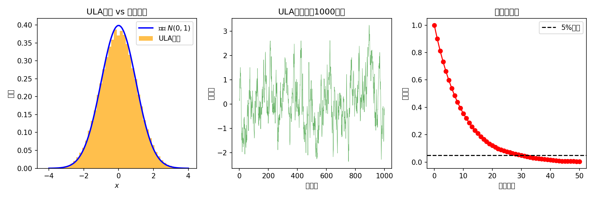
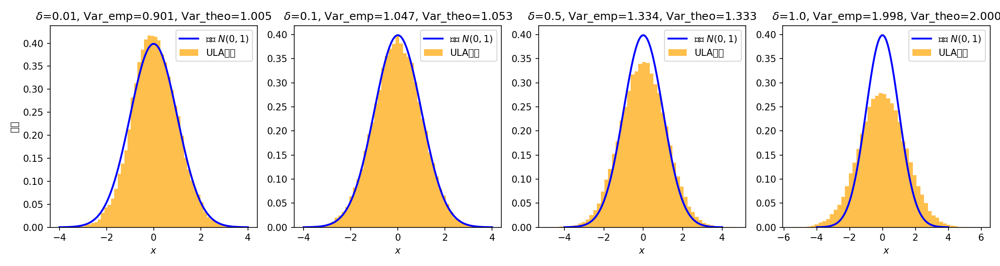

# 5.1 从 MCMC 到 Langevin SDE

> **先讲个场景**：第4章我们拿到了一台好用的采样机器 ULA，它能一步步往后验分布里"跳"，跳够了就抽出了样本。可你有没有想过——如果让这台机器每步走得越来越小、越来越小，小到几乎连续，它到底会变成一个什么东西？这一节我们就要把这个"连续化的极限"找出来：它叫 **Langevin 随机微分方程**（Langevin SDE）。正是它，成了第7章扩散模型的直接前身。

**本节目标**：

- 看清 ULA 是怎么从"一跳一跳"连续化成 Langevin SDE 的；
- 理解 SDE 的两种等价讲法（势能视角 vs 得分视角），以及为什么本书主用得分视角；
- 用 Fokker-Planck 方程（描述概率密度随时间演化的偏微分方程）严格证明：这个 SDE 的平稳分布（跑得够久后分布不再变）恰好就是目标后验；
- 知道离散化的代价，以及步长 $\delta$ 这个"偏差 vs 效率"旋钮怎么拧。

---

## 1. 从 ULA 递推到连续 SDE：把"跳步"变成"流动"

先回想第4章的 ULA（无调整朗之万算法），它是个高效的后验采样方法，核心递推式长这样：

$$X_{m+1} = X_m + \delta\,\nabla\log p(X_m|y) + \sqrt{2\delta}\,Z_{m+1}, \quad Z_{m+1} \sim \mathcal{N}(0, I_n)$$

这个式子可以拆成两股力在拉扯：一股是**确定性漂移** $\delta\,\nabla\log p(X_m|y)$（顺着后验密度往上走），一股是**随机扩散** $\sqrt{2\delta}\,Z_{m+1}$（随机抖一抖）。**因为**我们有了"离散迭代"，一个很自然的念头就冒出来：如果步长 $\delta$ 越来越小、越来越小，这个小碎步迭代到底会逼近什么连续过程？

### 时间参数化与连续极限

我们做个"重贴标签"：让 $\Delta t = \delta$ 当时间步长，$t_m = m\delta$ 是第 $m$ 步对应的时刻，$X(t_m) = X_m$ 是那个时刻的状态。**于是** ULA 可以写成：

$$X(t_{m+1}) = X(t_m) + \nabla\log p(X(t_m)|y)\,\Delta t + \sqrt{2\Delta t}\,Z_{m+1}$$

移项看"单位时间内的变化率"：

$$\frac{X(t_{m+1}) - X(t_m)}{\Delta t} = \nabla\log p(X(t_m)|y) + \frac{\sqrt{2\Delta t}}{\Delta t}\,Z_{m+1}$$

注意 $\sqrt{2\Delta t}\,Z_{m+1}$ 这玩意儿，方差正好是 $2\Delta t\,I_n$，它恰好就是标准布朗运动（Brownian motion，不停地随机抖动的粒子轨迹）在 $\Delta t$ 时间里的增量 $\Delta W_m = W_{t_{m+1}} - W_{t_m}$（因为布朗运动增量方差是 $\Delta t\cdot I_n$，乘 $\sqrt{2}$ 就是 $2\Delta t$）。**所以**：

$$X(t_{m+1}) - X(t_m) = \nabla\log p(X(t_m)|y)\,\Delta t + \sqrt{2}\,\Delta W_m$$

当 $\Delta t \to 0$，只要那个漂移系数 $\nabla\log p(\cdot|y)$ 满足"全局 Lipschitz"（变化不会太剧烈）的条件，这个欧拉格式就（以路径意义）收敛到下面的连续时间方程：

$$\boxed{dX_t = \nabla\log p(X_t|y)\,dt + \sqrt{2}\,dW_t, \quad X_0 = x_0}$$

这就是 **Langevin 随机微分方程**（以物理学家 Paul Langevin 命名，他最初用来描述布朗运动里粒子的受力）。$W_t$ 是 $\mathbb{R}^n$ 上的标准布朗运动。看到没有——"离散的一跳一跳"变成了"连续的漂+随机游走"。

### 两个等价视角：势能 vs 得分

同一个方程，换个记号就是两个故事，特别值得你记牢：

**势能视角**：令 $U(x) = -\log p(x|y)$ 为后验的"势能函数"（负对数后验，形状像碗）。那么：

$$dX_t = -\nabla U(X_t)\,dt + \sqrt{2}\,dW_t$$

这把 Langevin SDE 看成"在一个碗状势能面上、带噪声的梯度下降"——漂移项 $-\nabla U$ 把你推向碗底（后验众数 / MAP），噪声项 $\sqrt{2}\,dW_t$ 又不让你停在碗底，逼你探索整个碗。这个视角直接连着第3章的优化方法。

**得分视角**：令 $s(x|y) = \nabla\log p(x|y)$ 为后验的得分函数。那么：

$$dX_t = s(X_t|y)\,dt + \sqrt{2}\,dW_t$$

这把 Langevin SDE 看成"由得分函数驱动的随机过程"——漂移项沿得分方向"爬坡"（推向高概率区域），噪声项负责随机探索。这个视角是理解第7章扩散模型的关键，因为扩散模型的核心就是"学出得分函数"。

两种写法完全等价（$s = -\nabla U$），只是讲故事的角度不同：势能视角连接优化，得分视角连接生成模型。本书后面主要用得分视角，因为它直通第6章的得分匹配和第7章的扩散模型。历史上势能视角先出现（统计物理），得分视角后出现（机器学习），但数学上就是同一个方程。

---

## 2. Langevin SDE 的平稳分布：Fokker-Planck 方程

### 一个根本性问题

Langevin SDE 定义了一个随机过程 $\{X_t\}$——可凭什么说，这个过程的"长时间行为"恰好就是目标后验 $p(x|y)$？换句话说，怎么证明 $p(x|y)$ 是 Langevin SDE 的**平稳分布**（stationary distribution，跑得足够久后概率分布不再变）？

**因为**我们要回答这个问题，得先搞懂 SDE 是怎么"驱动"概率密度随时间演化的。**于是** **Fokker-Planck 方程**（也叫前向 Kolmogorov 方程）就出场了——它就是连接 SDE 与概率密度演化的那座桥。

### Fokker-Planck 方程的直觉

设 $\rho_t(x)$ 是 $X_t$ 的概率密度（即 $P(X_t \in A) = \int_A \rho_t(x)\,dx$）。对 Langevin SDE $dX_t = s(X_t)\,dt + \sqrt{2}\,dW_t$（简写 $s(x)=\nabla\log p(x|y)$），$\rho_t$ 满足：

$$\frac{\partial \rho_t}{\partial t} = -\nabla\cdot[s(x)\,\rho_t] + \Delta\rho_t$$

右边第一项叫**漂移项**（advection，平流），描述得分力怎么推着密度走；第二项叫**扩散项**（diffusion），描述布朗运动怎么把密度摊开。它背后的核心思想其实很朴素：对任意光滑测试函数 $\phi$，用 Itô 公式（随机版本的链式法则）得到 Kolmogorov 后向方程的弱形式，再分部积分，就得到上面这个偏微分方程。（严格推导见附录5A。）

### 验证后验分布是平稳分布

平稳分布的定义就是"不随时间变"：$\partial\rho_t/\partial t = 0$。我们直接验证 $\rho^*(x) = p(x|y)$ 满足：

把 $\rho^* = p(x|y)$ 代入右边：

$$-\nabla\cdot[s(x)\,p(x|y)] + \Delta p(x|y)$$

关键的一步观察：$s(x)\,p(x|y) = \nabla\log p(x|y) \cdot p(x|y) = \nabla p(x|y)$。**于是**：

$$-\nabla\cdot[\nabla p(x|y)] + \Delta p(x|y) = -\Delta p(x|y) + \Delta p(x|y) = 0 \quad \checkmark$$

**漂亮——后验分布 $p(x|y)$ 确实就是 Langevin SDE 的平稳分布。**

### 物理直觉：聚拢 vs 分散的平衡

Fokker-Planck 方程其实在描述两股"力"的拉锯：

- **漂移力** $-\nabla\cdot[s(x)\,\rho_t]$：得分函数把粒子往高密度区推——这是"聚拢"；
- **扩散力** $\Delta\rho_t$：布朗运动把粒子从高密度区往外赶——这是"分散"。

到了平稳态，聚拢和分散刚好抵消——粒子既不会全坍缩到众数（因为有扩散力），也不会均匀散开（因为有漂移力）。这正是 $p(x|y)$ 描述的概率分布。

这个画面完美呼应了第4章的核心洞见：**优化算法 + 噪声 = 采样算法**。漂移力对应优化（推向众数），扩散力对应噪声（防止坍缩），两者平衡就冒出了"分布"。

---

## 3. Langevin 扩散的指数收敛：为什么它真的会"到"目标分布

证明了 $p(x|y)$ 是平稳分布，下一个问题自然来：从任意初始分布 $\rho_0$ 出发，$\rho_t$ 到底会不会收敛到 $p(x|y)$？多快？

### 强对数凹条件下的指数收敛

**什么时候好用**：如果势能 $U(x) = -\log p(x|y)$ 满足两个"好脾气"条件——碗够陡（强凸）且梯度变化别太野（光滑），收敛就很快。具体说：

- **$m$-强凸**（strongly convex）：$\nabla^2 U(x) \succeq m\,I$（碗够"陡"）；
- **$L$-光滑**（smooth）：$\nabla^2 U(x) \preceq L\,I$（梯度变化别太野）。

那么 Langevin 扩散在 Wasserstein-2 距离（衡量两个分布"差距"的一种度量）下**指数收敛**：

$$W_2(\rho_t, p) \leq C\,e^{-mt}\,W_2(\rho_0, p)$$

收敛速率 $m$ 由势能的强凸性决定——**碗越陡（$m$ 越大），收得越快**。

> 多说一句 $L$-光滑的作用：速率 $e^{-mt}$ 其实只看 $m$，但 $L$-光滑在证明里不可或缺——它保证漂移系数 $\nabla\log p$ 是全局 Lipschitz 的，从而确保 SDE 解存在且唯一。而且 $L$ 和 $m$ 一起定义条件数 $\kappa = L/m$，它决定了离散后 ULA 的步长上界 $\delta \le 1/L$，以及达到 $\varepsilon$ 精度要迭代多少次（量级 $O(\kappa/\varepsilon)$）。

### 几何解释：碗里的粒子

强凸性意味着势能面是个"碗"——梯度永远指向碗底（众数），而且离得越远拉力越线性地强。在这个碗里：

- 漂移力把粒子强力拉向碗底；
- 布朗运动让粒子在碗底附近游走；
- 平衡后，粒子的空间分布恰好是 $\exp(-U(x))$（吉布斯分布，Gibbs distribution）。

### 一般条件下呢？

当后验不满足全局强对数凹（比如图像逆问题里常见的多峰后验），Langevin 扩散照样收敛，只是速率可能不是指数的。可以用这些办法分析：

- **局部强凸 + 远端衰减**：势能在一个球外强凸、球内可以非凸——Durmus & Moulines (2019) 给出多项式速率；
- **噪声扰动保覆盖**：第4章 4.4 节的 Moreau-Yoshida 光滑化能保证 $\nabla\log p_\lambda$ 的 Lipschitz 性，从而保证 ULA 收敛。

---

## 4. 从 Langevin 到 ULA：离散化的代价

Langevin SDE 是连续时间的"理想模型"，可真算起来必须回到离散迭代——ULA 正是它的欧拉离散化。**于是**离散化会引入偏差，这是理论和实践的裂痕。

### 两种离散化策略

**ULA（无校正）**：

$$X_{m+1} = X_m + \delta\,\nabla\log p(X_m|y) + \sqrt{2\delta}\,Z_{m+1}$$

- 偏差：$O(\delta)$——步长越大偏差越大；
- 优点：每步算起来简单，不用接受/拒绝判断；
- 非渐近误差界（强对数凹情形）：$\|p_m - p\|_{\text{TV}} \le C_1 e^{-cm\delta} + C_2\delta$（Durmus & Moulines, 2019），第一项是收敛项（随迭代指数衰减），第二项是偏差项（只跟步长 $\delta$ 有关）。迭代足够多后，ULA 的渐近偏差上界约 $\|\rho_m - p\|_{\text{TV}} \lesssim C_2\delta$。

**MALA（Metropolis 调整后的朗之万算法）**：ULA 再加一个 MH 接受/拒绝步：

1. 提议：$X^* = X_m + \delta\,\nabla\log p(X_m|y) + \sqrt{2\delta}\,Z_{m+1}$
2. 以概率 $\alpha = \min\{1, p(X^*|y)/p(X_m|y) \cdot q(X_m|X^*)/q(X^*|X_m)\}$ 接受

- 偏差：0（满足细致平衡，收敛到精确的 $p(x|y)$）；
- 代价：每步多算接受概率，还可能被拒绝（浪费时间）；在高维图像逆问题里接受率可能很低。

### 步长选择的权衡

**when/why/how 骨架**：

- **什么时候用**：ULA 是日常默认采样器；MALA 在对精度要求极高、且接受率还撑得住时用。
- **为什么难**：步长 $\delta$ 是 ULA 的核心实践难题，本质是"偏差 vs 效率"的取舍。
- **怎么做**：在偏差与效率之间取一个折中。

| 步长 | 偏差 | 收敛速度 | 总效果 |
|---|---|---|---|
| $\delta$ 很小 | 小 | 慢（每步挪得少） | 精确但低效 |
| $\delta$ 很大 | 大 | 快（每步挪得多） | 高效但不精确 |
| $\delta = 1/L$ | 中等 | 适中 | 实践推荐 |

其中 $L$ 是 $\nabla\log p(x|y)$ 的 Lipschitz 常数。$\delta \le 1/L$ 是保证 ULA 不发散的必要条件（和第3章 3.2 节梯度下降的步长条件完全一致）。

> **实验 5.1-1**：ULA 采样与步长敏感性分析
>
> 实验 `5.1-1.py` 用最简单的目标分布——1D 标准高斯 $N(0,1)$——演示 ULA 和 Langevin SDE 的关系，以及步长对收敛的影响。势能 $U(x)=x^2/2$，梯度 $\nabla U(x)=x$，ULA 变成线性递推 $X_{m+1} = (1-\delta)X_m + \sqrt{2\delta}\,Z_{m+1}$。解析可得 ULA 平稳分布的理论方差公式：
> $$\sigma^2 = \frac{2\delta}{1-(1-\delta)^2} = \frac{1}{1-\delta/2}$$
> $\delta<2$ 时方差有限；$\delta\ge 2$ 时递推不收缩、采样发散。
>
> **步骤1（ULA 采样验证）**：$\delta=0.1$ 跑 ULA，对比采样直方图和真实密度，采样方差 ≈ 理论方差 $1.0526$，自相关前 10 步就衰减到 0.05 以下（链已混合）。
>
> **步骤2（步长敏感性）**：比较 $\delta=0.01,0.1,0.5,1.0$ 的采样方差——分别是 1.005、1.053、1.333、2.000，和理论公式严丝合缝。$\delta=0.01$ 偏差极小但慢，$\delta=1.0$ 偏差翻倍（方差=2）但快。这就直观验证了"小步长偏差小收敛慢、大步长偏差大收敛快"。
>
> 
> 
>
> **核心洞察**：本实验直观验证了 5.1 节的核心命题——**ULA 是 Langevin SDE 的离散化，离散化引入偏差**。步长 $\delta$ 是偏差与效率的权衡旋钮：$\delta=1$ 时偏差让方差翻倍。这也为第7章扩散模型的"多时间步噪声调度"埋下动机——扩散模型靠在不同噪声水平用不同步长，巧妙绕开单步朗之万的这个步长困境。

---

### 与第7章的预告

单步 Langevin 卡在步长困境里：大步长偏差大，小步长收敛慢。扩散模型用**多时间步噪声调度**巧妙破解——早期用大噪声水平（允许大步长），后期用小噪声水平（保证精度）。第7章细讲。

### Langevin SDE 与梯度流的联系（补充阅读，主线非必需）

Langevin SDE 和概率测度空间上的"梯度流"有深刻联系，它揭示了"优化 → 采样"转化的数学本质。

**势能的 Wasserstein 梯度流**是最小化期望势能 $\int U\,d\rho$ 的梯度流。粒子沿 $-\nabla U$ 走（梯度下降），质量流 $J = -\rho\nabla U$，由连续性方程得：

$$\frac{\partial \rho_t}{\partial t} = \nabla\cdot(\rho_t\,\nabla U) = \nabla\cdot(\rho_t\,\nabla(-\log p))$$

注意这只有漂移、没有扩散项——这是**纯漂移**过程，质量在势能极小值处汇聚，最终所有质量坍缩到众数（MAP）。

**KL 散度的 Wasserstein 梯度流**则同时有漂移和扩散：

$$\frac{\partial \rho_t}{\partial t} = \underbrace{\nabla\cdot(\rho_t\,\nabla U)}_{\text{漂移（聚拢）}} + \underbrace{\Delta\rho_t}_{\text{扩散（分散）}}$$

这恰好就是 Langevin SDE 的 Fokker-Planck 方程。扩散项来自 KL 散度里熵项的梯度，是 Langevin 相对纯梯度流的关键补充——它把收敛目标从"众数"变成了"分布"。这再次呼应第4章：**优化算法 + 噪声 = 采样算法**。

**来源**：Pereyra L1 P40-50; Pock L2 P14; LectureNotes2020_v2 Sec 8.2; Risken (1996); Durmus & Moulines (2019)

---

## 5. 收尾：为什么这件事重要

至此，Langevin SDE 的框架立起来了：它以得分函数 $\nabla\log p(x|y)$ 为漂移力，以布朗运动为随机探索，平稳分布恰好是目标后验。**把整节塌缩成一句话**：离散的 ULA 只是连续朗之万动力学的一帧快照，而那个驱动一切的"力"，就是下一节要彻底看清的得分函数。可这个框架把"得分函数"当成了已知量——它究竟是什么、长什么样？下一节我们打开这个黑箱。

> **→ 下一步：5.2 节 得分函数**。Langevin 的驱动力就是这个"得分函数"，下节我们把它从几何上彻底看清。
