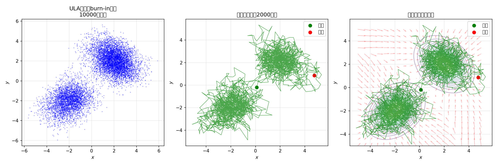

# 5.2 得分函数：对数概率的梯度

> **核心观点**：得分函数 $s(x) = \nabla_x \log p(x)$ 是概率分布的"方向场"——在每一点指向密度增长最快的方向，其模长表示增长的剧烈程度。Langevin动力学以得分函数为漂移力，使得粒子系统收敛到目标分布。对于逆问题的后验分布，得分函数可分解为似然得分与先验得分——先验得分是获取的瓶颈，也是驱动后续章节方法演化的核心困难。

## 为什么叫"得分"？

中文将"score function"翻译为"得分函数"——这个名字对初学者来说极具误导性。"得分"在日常语境中让人联想到"分数、评分"，但这里的"score"完全不是这个意思。

"Score"一词在统计学中有一个经典用法：对一个数据点"标记"（to score）其在某个分布下的密度变化方向和程度。Harold Hotelling 在1947年的工作中系统地使用"score"指代 $\nabla_\theta \log p(x;\theta)$——对数似然关于参数的梯度，因为它"标记"了使数据更可能出现的参数方向。1951年，Charles Stein 将这一概念推广到对数据 $x$ 求导的情形，定义了 $\nabla_x \log p(x)$，后来被称为**Stein's score function**（Stein 得分函数）。

我们讨论的正是 Stein 得分函数：它在空间中"标记"出每个点处密度增长的方向和剧烈程度，形成一个向量场——这就是得分函数的几何本质。英文中的"score"保留了"标记、刻画"的动作含义；中文翻译成"得分"则是历史遗留的翻译选择，容易引发误解。读者可以将其理解为**"密度标记函数"或"密度梯度场"**。

> **注意**：统计学中还有一个**ordinary score function**（通常得分函数），定义为 $\nabla_\theta \log p_\theta(x)$，即对参数 $\theta$ 求导——它用于最大似然估计（MLE）。而我们使用的 Stein 得分函数是对数据 $x$ 求导 $\nabla_x \log p(x)$——它用于 Langevin 动力学和扩散模型。两者数学形式相似但对象不同：一个标记参数的最优方向，一个标记空间中的密度梯度。由于扩散文献习惯将 Stein 得分函数简称为"score function"，本书沿用这一惯例。

## 得分函数的定义

给定 $\mathbb{R}^n$ 上的概率密度函数 $p(x)$，其**得分函数**定义为：

$$s(x) = \nabla_x \log p(x) = \frac{\nabla_x p(x)}{p(x)}$$

（下文如无特别声明，$\nabla$ 与 $\nabla_x$ 混用，梯度均对 $x$ 求导。）

得分函数是对数概率密度的梯度。它有两个等价的表达方式：

- **对数形式**：$s(x) = \nabla_x \log p(x)$——对数概率的梯度
- **比例形式**：$s(x) = \nabla_x p(x) / p(x)$——概率梯度的归一化

### 得分函数不需要归一化常数

这是得分函数的核心优势。设 $p(x) = \tilde{p}(x)/Z$，其中 $\tilde{p}(x)$ 是未归一化密度，$Z = \int \tilde{p}(x)\,dx$ 是归一化常数，则：

$$s(x) = \nabla_x \log p(x) = \nabla_x \log \frac{\tilde{p}(x)}{Z} = \nabla_x[\log\tilde{p}(x) - \log Z] = \nabla_x\log\tilde{p}(x)$$

归一化常数 $Z$ 在求梯度时被消去了——**得分函数只依赖于未归一化密度**。

这对于贝叶斯推断至关重要：后验 $p(x|y) = p(y|x)p(x)/p(y)$ 的得分函数为：

$$s(x|y) = \nabla\log p(x|y) = \nabla\log p(y|x) + \nabla\log p(x)$$

两项都不需要计算 $p(y)$——$p(y)$ 是贝叶斯推断中最难计算的量，而得分函数天然绕过了它。

> **本节核心公式**
> 
> **1. 未归一化密度（无需 $Z$）**：$s(x) = \nabla_x\log\tilde{p}(x)$——求梯度天然消去归一化常数
> 
> **2. 后验分解**：$s(x|y) = \nabla\log p(y|x) + \nabla\log p(x)$——似然得分 + 先验得分，无需 $p(y)$

## 得分函数的几何含义

得分函数 $s(x)$ 在空间中形成一个向量场，其几何含义可以通过方向、模长和零点来理解。

### 方向：密度增长最快的方向

在点 $x$ 处，$s(x) = \nabla\log p(x)$ 指向 $p(x)$ 增长最快的方向。这是因为：

- $\nabla\log p(x) = \nabla p(x)/p(x)$ 与 $\nabla p(x)$ 同方向
- $\nabla p(x)$ 是密度函数的梯度，指向密度增长最快的方向
- 两者方向相同，但得分函数除以 $p(x)$ 后做了归一化

考虑一个直观的例子：高斯分布 $\mathcal{N}(\mu, \Sigma)$ 的对数概率为：

$$\log p(x) = -\frac{1}{2}(x-\mu)^T\Sigma^{-1}(x-\mu) + \text{const}$$

由于协方差矩阵 $\Sigma$ 对称，$\Sigma^{-1}$ 亦对称，因此梯度为：

$$s(x) = \nabla_x\log p(x) = -\Sigma^{-1}(x - \mu)$$

这是一个指向均值 $\mu$ 的向量场——离 $\mu$ 越远，得分向量的模长越大，"拉力"越强。Langevin动力学利用这个"拉力"，将粒子拉向高密度区域。

### 模长：密度变化的剧烈程度

$\|s(x)\|$ 表示在点 $x$ 处密度变化的剧烈程度：

- **密度平坦区域**（$p$ 几乎不变）：$\|s(x)\| \approx 0$——没有方向偏好，粒子自由游走
- **密度陡峭边界**（$p$ 急剧变化）：$\|s(x)\|$ 很大——强方向偏好，粒子被强力推走
- **密度低但均匀的区域**：$\|s(x)\| \approx 0$——虽然概率低，但没有明显的"逃离方向"

这个性质解释了为什么Langevin采样在高密度区域附近高效（得分方向明确），而在低密度平坦区域可能缓慢——当然，采样慢的真正原因与分布的几何形状和混合时间（mixing time）有关，此处仅为定性描述得分方向引导的直觉。

### 零点：概率密度的驻点

$s(x) = 0$ 的点是 $\log p(x)$ 的驻点，即 $\nabla p(x) = 0$ 的点。这些点包括：

- **全局众数**（MAP估计）：$\log p(x)$ 的全局最大值点
- **局部众数**：$\log p(x)$ 的局部最大值点
- **鞍点**：既非最大也非最小

在多峰分布中，得分函数在众数处为零——Langevin动力学在众数附近"减速"，但噪声项防止其完全停滞。这正是Langevin能够探索多峰分布的原因：漂移力将粒子吸引到最近的峰，噪声力使其有机会跳出局部峰，探索其他峰。但当峰间距离远大于噪声尺度时，跳出概率指数级下降——这是 MCMC 中著名的"模式混合"难题，也是 Langevin 采样的已知局限。

## 得分函数与Langevin动力学的直觉

Langevin SDE $dX_t = s(X_t)\,dt + \sqrt{2}\,dW_t$ 的运行机制可以用一个物理类比来理解。

### 漂移项：沿得分"爬坡"

$s(X_t)\,dt$ 是一个确定性力——在每一点 $X_t$，沿得分方向（密度增长方向）移动一小步。这就像一个滚球在山丘上，总是沿着上坡方向滚动——但这里的"山丘"是概率密度的地形，球被推向高密度的"山峰"。

### 扩散项：随机"游走"

$\sqrt{2}\,dW_t$ 是一个随机力——布朗运动使粒子在每一步都随机偏移。这就像球受到热扰动——即使在"山峰"处，热运动也使球不断偏离。

### 两者的平衡

如果只有漂移项（$dX_t = s(X_t)\,dt$），所有粒子都会收敛到最近的一个众数——这就是梯度下降。

如果只有扩散项（$dX_t = \sqrt{2}\,dW_t$），粒子会均匀散布在整个空间——这就是纯布朗运动。

两者结合，在适当正则性条件下（如 $\log p$ 满足 Poincaré 不等式），漂移力将粒子聚集在高密度区域，扩散力防止所有粒子坍缩到众数——**两者的平衡产生目标分布** $p(x)$。这正是5.1节Fokker-Planck方程的物理含义：漂移产生的"聚拢流量"与扩散产生的"分散流量"在 $p(x)$ 处恰好平衡。

### 得分函数与梯度下降的对比

得分函数与梯度下降的驱动力方向完全相同——$s = -\nabla U$，区别仅在于是否有噪声：

| 方法 | 迭代公式 | 驱动力 | 收敛目标 |
|---|---|---|---|
| 梯度下降 | $x_{k+1} = x_k - \tau\nabla U(x_k)$ | $-\nabla U = s$（同一方向！） | 众数（MAP） |
| Langevin采样 | $X_{m+1} = X_m + \delta s(X_m) + \sqrt{2\delta}\,Z$ | $s + \text{噪声}$ | 分布 $p(x)$ |

上表中 Langevin 迭代的 $Z \sim \mathcal{N}(0, I)$，该更新公式是 Langevin SDE 的 Euler–Maruyama 离散化近似，并非精确更新。

这是第4章"优化算法 + 噪声 = 采样算法"洞见的数学表达。

---

> **实验5.2-1**：得分函数可视化与ULA采样轨迹
> 
> 实验 `5.2-1.py` 演示**得分函数的几何含义及其在Langevin采样中的作用**，通过2D高斯混合分布的得分函数可视化和ULA采样轨迹，直观理解得分函数的方向场特性。
> 
> ### 实验场景
> 
> 实验使用2D高斯混合分布作为目标分布：
> 
> $$p(x) = \frac{1}{2}\mathcal{N}(x; \mu_1, \Sigma_1) + \frac{1}{2}\mathcal{N}(x; \mu_2, \Sigma_2)$$
> 
> 其中 $\mu_1 = (-2, 0)$，$\mu_2 = (2, 0)$，$\Sigma_1 = \Sigma_2 = I$（两个标准高斯分量，均值间距为4）。
> 
> 得分函数 $s(x) = \nabla_x \log p(x)$ 可以解析计算。对于高斯混合分布：
> 
> $$s(x) = \frac{w_1(x)}{w_1(x)+w_2(x)}(-\Sigma_1^{-1}(x-\mu_1)) + \frac{w_2(x)}{w_1(x)+w_2(x)}(-\Sigma_2^{-1}(x-\mu_2))$$
> 
> 其中 $w_i(x) = \exp(-\frac{1}{2}(x-\mu_i)^T\Sigma_i^{-1}(x-\mu_i))$ 是未归一化的分量权重。
> 
> 实验分三步：
> 1. **得分函数可视化**：绘制得分向量场（方向和模长），展示得分函数的几何特性
> 2. **得分函数特性分析**：计算得分函数的模长分布、零点位置，验证理论预测
> 3. **ULA采样轨迹**：从初始点运行ULA，展示采样轨迹如何被得分函数引导
> 
> ### 实验目的
> 
> 1. **理解得分函数的几何含义**：得分函数指向概率密度增加最快的方向，模长反映概率变化的剧烈程度
> 2. **验证得分函数的方向场特性**：得分向量指向高概率区域，远离低概率区域
> 3. **理解得分函数的零点**：得分函数在概率分布的众数（mode）处为零——这是MAP估计与采样的关键区别
> 4. **验证得分函数与Langevin动力学的关系**：ULA迭代 $X_{m+1} = X_m + \delta s(X_m) + \sqrt{2\delta}Z$ 展示漂移项（得分）与扩散项（噪声）的平衡
> 
> ### 实验输入
> 
> | 参数 | 设置 |
> |------|------|
> | 目标分布 | 2D高斯混合，$\mu_1=(-2,0)$，$\mu_2=(2,0)$，$\Sigma_1=\Sigma_2=I$ |
> | 分量权重 | $w_1 = w_2 = 0.5$ |
> | 可视化网格 | $x \in [-5, 5]$，$y \in [-3, 3]$，网格密度25×15 |
> | ULA步长 | $\delta = 0.1$ |
> | ULA迭代次数 | 500 |
> | ULA初始点 | $x_0 = (0, 2)$（远离两个众数） |
> | 随机种子 | 42（numpy） |
> 
> ### 预期结果
> 
> - **得分函数方向场**：得分向量指向两个众数 $\mu_1=(-2,0)$ 和 $\mu_2=(2,0)$，在两个众数之间形成"鞍点"区域
> - **得分函数模长**：远离众数时模长较大（概率变化剧烈），接近众数时模长较小（概率变化平缓），在众数处模长为零
> - **得分函数零点**：得分函数在两个众数 $\mu_1$ 和 $\mu_2$ 处为零（$\nabla\log p = 0$），这是MAP估计的目标点
> - **ULA采样轨迹**：轨迹从初始点 $(0,2)$ 被得分函数引导向高概率区域移动，最终在两个众数附近游走（采样而非收敛到单一众数）
> 
> ### 实验结果
> 
> 运行 `5.2-1.py` 后，生成三张输出图。实验结果如下：
> 
> 
> 
> 
> 
> 
> 
> **步骤1：得分函数可视化**：
> 
> 得分向量场清晰展示了得分函数的几何特性：
> - **方向特性**：得分向量指向两个众数 $\mu_1=(-2,0)$ 和 $\mu_2=(2,0)$，在两个众数之间形成"鞍点"区域（得分向量指向两个众数的"拉扯"状态）
> - **模长特性**：远离众数时得分向量较长（红色），接近众数时得分向量较短（蓝色），在众数处得分向量消失（零点）
> - **概率密度背景**：背景颜色表示概率密度 $p(x)$，高概率区域（两个众数附近）为暖色，低概率区域为冷色
> 
> **步骤2：得分函数特性分析**：
> 
> | 特性 | 理论预测 | 实验观察 |
> |------|----------|----------|
> | 得分模长分布 | 远离众数时大，接近众数时小 | 模长在众数附近接近0，远离众数时增大 |
> | 得分零点位置 | $\mu_1=(-2,0)$，$\mu_2=(2,0)$ | 零点位于两个众数处（模长图中的深色区域） |
> | 零点数量 | 2个（两个众数） | 2个（与理论一致） |
> 
> **步骤3：ULA采样轨迹**：
> 
> ULA采样轨迹展示了得分函数与Langevin动力学的关系：
> - **漂移项的作用**：得分函数 $s(x)$ 引导轨迹向高概率区域移动（从初始点 $(0,2)$ 向两个众数附近移动）
> - **扩散项的作用**：噪声 $\sqrt{2\delta}Z$ 使轨迹在众数附近游走而非收敛到单一众数
> - **采样 vs 优化**：梯度下降会收敛到单一众数（MAP估计），ULA在两个众数附近游走（采样整个分布）
> 
> **结果分析**：
> 
> - **得分函数的几何含义验证**：得分向量场直观展示了"得分函数指向概率密度增加最快的方向"。远离众数时，得分向量指向众数（概率增加方向）；接近众数时，得分向量变小（概率变化平缓）；在众数处，得分向量消失（概率达到局部最大）。
> - **得分函数零点的理解**：得分函数在众数处为零（$\nabla\log p = 0$），这是MAP估计的目标点。ULA采样不会收敛到零点，而是在众数附近游走——这是"采样 vs 优化"的核心区别。
> - **得分函数与Langevin动力学的关系验证**：ULA迭代 $X_{m+1} = X_m + \delta s(X_m) + \sqrt{2\delta}Z$ 展示了漂移项（得分）与扩散项（噪声）的平衡。漂移项引导轨迹向高概率区域移动，扩散项使轨迹在众数附近游走。这验证了"得分函数与Langevin动力学的直觉"小节的理论讨论。
> - **鞍点区域的观察**：在两个众数之间的鞍点区域，得分向量指向两个众数的"拉扯"状态，模长较小。ULA轨迹经过鞍点区域时，会被得分函数引导向其中一个众数移动（随机选择）。
> 
> **核心结论**：
> 
> | 结论 | 说明 |
> |------|------|
> | 得分函数的几何含义 | 得分函数指向概率密度增加最快的方向，模长反映概率变化的剧烈程度 |
> | 得分函数的方向场特性 | 得分向量指向高概率区域（众数），远离低概率区域 |
> | 得分函数的零点 | 得分函数在众数处为零（$\nabla\log p = 0$），这是MAP估计的目标点 |
> | 得分函数与Langevin动力学 | ULA迭代展示漂移项（得分）与扩散项（噪声）的平衡——采样 vs 优化 |
> 
> > **核心洞察**：本实验直观验证了5.2节的核心命题——**得分函数是概率分布的"方向场"，指向概率密度增加最快的方向**。得分函数的几何特性（方向、模长、零点）决定了Langevin采样的行为：漂移项引导轨迹向高概率区域移动，扩散项使轨迹在众数附近游走。这为理解"得分函数与Langevin动力学的直觉"提供了可视化支撑，也为后续"后验得分函数的分解"和"噪声扰动分布的得分函数"奠定了基础。

---

## 后验得分函数的分解

得分函数天然消去归一化常数，这一性质在后验分布的得分分解中得到充分体现。

### 分解公式

由贝叶斯公式 $p(x|y) = p(y|x)\,p(x)/p(y)$，取对数求梯度：

$$s(x|y) = \nabla\log p(x|y) = \underbrace{\nabla\log p(y|x)}_{\text{似然得分}} + \underbrace{\nabla\log p(x)}_{\text{先验得分}}$$

这个分解的意义在于：**后验得分 = 似然得分 + 先验得分**，两项来源不同、性质不同、获取难度也不同。

### 似然得分：通常可计算

似然得分由正向模型和噪声模型决定。对于常见的噪声模型：

- **高斯噪声** $p(y|x) = \mathcal{N}(Ax, \sigma^2 I)$：
  $$\nabla\log p(y|x) = -\frac{1}{\sigma^2}A^T(Ax - y)$$
  这是Tikhonov正则化中数据项的梯度（第3章3.3节）。

- **Poisson噪声** $p(y|x) = \text{Poisson}(Ax)$：
  $$\nabla\log p(y|x) = A^T\left(\frac{y}{Ax} - 1\right)$$
  其中除法是逐元素操作。此公式要求 $Ax > 0$（逐元素），这是泊松分布对数概率有定义的前提——在图像重建中，$Ax$ 代表预测的像素计数值，通常自然满足此条件。

似然得分是"已知"的——它完全由正向模型 $A$ 和噪声模型决定，不需要从数据中学习。

### 先验得分：问题的瓶颈

先验得分 $\nabla\log p(x)$ 是获取后验采样的瓶颈。原因有二：

**1. 归一化常数问题**：先验通常写成Gibbs形式 $p(x) = \frac{1}{Z}\exp(-R(x))$，其中 $R(x)$ 是正则项（如TV范数），$Z = \int \exp(-R(x))\,dx$ 是归一化常数。虽然 $\nabla\log p(x) = -\nabla R(x)$（$Z$ 被消去），但对于**复杂先验**，$R(x)$ 本身就没有解析形式——"看起来像自然图像"这个先验无法用任何已知的 $R(x)$ 表达。

**2. 表达能力的天花板**：第2章2.4节已经讨论过，显式先验（高斯、Laplace、TV等）的表达能力有限——它们无法捕捉自然图像的复杂统计规律。真实图像分布的得分函数远比 $-\nabla R(x)$ 复杂。

### 归一化常数的困境（隐式先验）

前面已经说明，得分函数天然消去归一化常数，因此对**显式先验**（能写出 $R(x)$ 解析式的先验），先验得分 $\nabla\log p(x) = -\nabla R(x)$ 是可计算的。

但**隐式先验**（如"自然图像的分布"）是另一回事——我们无法写出 $p(x)$ 或 $R(x)$ 的任何解析形式，$p(x)$ 只能通过样本隐式定义。此时 $\nabla\log p(x)$ 不可直接计算，必须从数据中学习。

这正是得分匹配（第6章）和扩散模型（第7章）的根本动机——**从数据中学习得分函数**。

## 噪声扰动分布的得分函数

### 一个关键观察

与其直接估计原始分布的得分 $s(x) = \nabla\log p(x)$，不如估计噪声扰动后的得分 $s_\varepsilon(x) = \nabla\log p_\varepsilon(x)$。这个看似简单的转变，是得分匹配（第6章）和扩散模型（第7章）的理论出发点。

### 定义

对分布 $p(x)$ 施加高斯噪声扰动：

$$p_\varepsilon(x) = \int p(x')\,\mathcal{N}(x|x', \varepsilon I)\,dx' = (p * \mathcal{N}(0, \varepsilon I))(x)$$

其中 $\varepsilon > 0$ 是噪声方差。$p_\varepsilon$ 是 $p$ 与高斯密度的卷积，可以理解为"模糊化"后的分布。

### 噪声扰动的三大好处

**1. 光滑化**：即使 $p(x)$ 不光滑（如包含Dirac delta、不连续点），$p_\varepsilon(x)$ 也是无穷可微的（$p_\varepsilon \in C^\infty$）。这是因为高斯卷积是一个光滑化算子。光滑性是 Langevin 采样收敛定理的标准假设之一。

**2. 覆盖低密度区域**：$p_\varepsilon(x) > 0$ 对所有 $x \in \mathbb{R}^n$ 成立。原始分布 $p(x)$ 在低密度区域可能为零，导致得分函数 $s(x)$ 无定义或数值不稳定。噪声扰动"填平"了低密度区域，使得分函数处处有定义且数值稳定。

**3. 与去噪器的天然联系**：$p_\varepsilon$ 恰好是高斯去噪问题的边际分布——观测 $y = x + \sqrt{\varepsilon}\,z$（$z \sim \mathcal{N}(0, I)$）的边际分布就是 $p_\varepsilon$。因此，$s_\varepsilon(x) = \nabla\log p_\varepsilon(x)$ 可以通过去噪器来估计（→5.3节Tweedie等式）。

### 从单尺度到多尺度

单一噪声水平 $\varepsilon$ 的扰动只能捕捉分布的"粗粒度"结构。对于复杂分布（如自然图像），不同尺度的结构需要不同噪声水平的得分函数来捕捉：

- 大 $\varepsilon$：捕捉全局结构（低频信息）
- 小 $\varepsilon$：捕捉局部细节（高频信息）
- 多尺度：$\varepsilon_1 > \varepsilon_2 > \cdots > \varepsilon_T$——逐步细化

这个多尺度思想是扩散模型（第7章）的核心：通过逐步减小噪声水平，从粗到细地生成图像。而在本章，我们先处理单尺度情形，建立理论基础。

**参考文献**：Pereyra, Lecture Notes Level 1, pp. 58–60; Hyvärinen, A. (2005). "Estimation of Non-Normalized Statistical Models by Score Matching"; Song, J. & Ermon, S. (2019). "Generative Modeling by Estimating Gradients of the Data Distribution"

> **→ 下一步：5.3节 Tweedie等式**
>
> 先验得分 $\nabla\log p(x)$ 通常不可直接计算，但上面第三条好处暗示了一条绕行路径：噪声扰动后的得分 $\nabla\log p_\varepsilon(x)$ 可以从去噪器中提取。Tweedie等式将这一暗示变成了严格的数学定理——它也是连接去噪与采样的核心桥梁。
