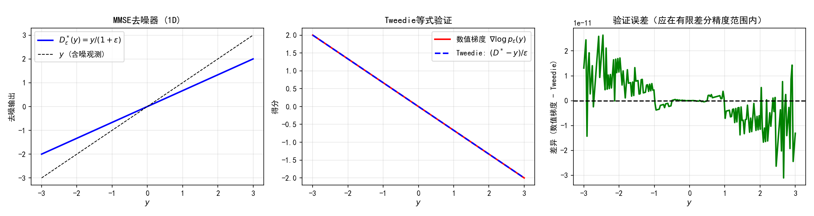
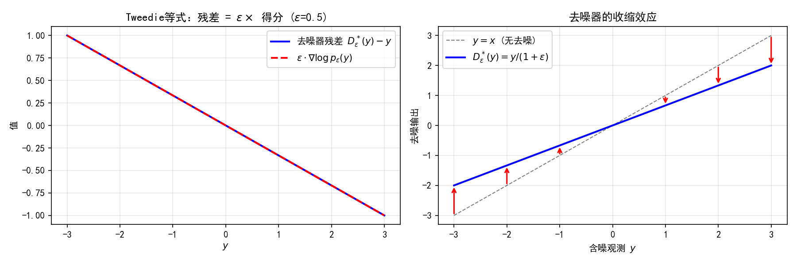

# 5.3 Tweedie等式：从去噪器到得分函数

> **核心观点**：Tweedie等式（Robbins 1956, Miyasawa 1961）揭示了一个深刻的数学事实：噪声扰动分布的得分函数等于MMSE去噪器的残差除以噪声方差——$\nabla\log p_\varepsilon(x) = (D_\varepsilon(x) - x)/\varepsilon$。这意味着：**有了一个好的去噪器，就有了得分函数**。这是连接去噪与采样的核心桥梁，也是全书从逆问题走向扩散模型的关键一步。

## 高斯去噪问题的回顾

### 问题设定

考虑最简单的逆问题——高斯去噪：

$$y = x + \sqrt{\varepsilon}\,z, \quad z \sim \mathcal{N}(0, I_n)$$

其中 $x \sim p(x)$ 是未知信号（服从某个先验分布），$\varepsilon > 0$ 是噪声方差。观测 $y$ 是信号加高斯噪声的结果，我们的目标是从 $y$ 恢复 $x$。

这个去噪问题是逆问题的"零算子"情形（$A = I$），也是理解更复杂逆问题的基础。更重要的是，去噪问题与得分函数之间存在一个令人惊讶的数学联系——Tweedie等式。

### MMSE去噪器

第2章2.3节已经讨论过，给定含噪观测 $y$，在均方误差意义下最优的估计器是**后验均值**（MMSE估计器）：

$$D_\varepsilon^*(y) = \mathbb{E}[x|y] = \int x\,p(x|y)\,dx$$

由贝叶斯公式，$p(x|y) = p(y|x)\,p(x)/p_\varepsilon(y)$，因此：

$$D_\varepsilon^*(y) = \frac{1}{p_\varepsilon(y)}\int x\,p(y|x)\,p(x)\,dx = \frac{\int x\,\mathcal{N}(y|x, \varepsilon I)\,p(x)\,dx}{p_\varepsilon(y)}$$

其中 $p_\varepsilon(y) = \int p(x)\,\mathcal{N}(y|x, \varepsilon I)\,dx$ 正是5.2节定义的噪声扰动分布。

MMSE去噪器的关键性质：
- 它最小化MSE风险：$\mathbb{E}[\|x - D(y)\|^2]$ 在所有去噪器 $D$ 中最小
- 它是后验均值——因此包含了后验分布的"一阶信息"
- 它不要求知道先验 $p(x)$ 的解析形式，只需要能计算条件期望

## Tweedie等式的陈述

### 定理（Tweedie等式）

**对噪声扰动分布** $p_\varepsilon(y) = (p * \mathcal{N}(0, \varepsilon I))(y)$，有：

$$\boxed{\nabla_y \log p_\varepsilon(y) = \frac{D_\varepsilon^*(y) - y}{\varepsilon}}$$

等价形式：

$$\varepsilon\,\nabla_y \log p_\varepsilon(y) = D_\varepsilon^*(y) - y$$

### 文字表述

**得分函数 = 去噪器残差 / 噪声方差**

- 左边 $\nabla_y\log p_\varepsilon(y)$：噪声扰动分布的得分函数——在 $y$ 处密度增长最快的方向
- 右边 $(D_\varepsilon^*(y) - y)/\varepsilon$：MMSE去噪器的修正方向（从含噪观测指向原始信号的"残差"），除以噪声方差

### 直觉理解

Tweedie等式的含义是深刻的：**得分函数和去噪器残差描述的是同一件事**——都是在回答"含噪观测 $y$ 离真实信号有多远，应该往哪个方向修正"这个问题。

- 得分函数 $\nabla\log p_\varepsilon(y)$ 告诉我们：在 $y$ 处，$p_\varepsilon$ 的密度如何变化——应该向密度增大的方向移动
- 去噪器残差 $D_\varepsilon^*(y) - y$ 告诉我们：去噪器认为 $y$ 离真实信号有多远——应该从 $y$ 向 $D_\varepsilon^*(y)$ 移动

两者方向一致，量级关系由噪声方差 $\varepsilon$ 标定：$\varepsilon$ 越大（噪声越强），去噪器残差越大，但得分函数的模长也越大（因为模糊化的分布梯度更平缓，需要更大的梯度来驱动相同的位移）。

## Tweedie等式的证明

Tweedie等式的证明并不复杂，核心是利用高斯密度的梯度性质。

### 第一步：写出边际密度

$$p_\varepsilon(y) = \int p(x)\,(2\pi\varepsilon)^{-n/2}\exp\left(-\frac{\|y - x\|^2}{2\varepsilon}\right)dx$$

### 第二步：对 $y$ 求梯度

利用 $\nabla_y \exp\left(-\frac{\|y-x\|^2}{2\varepsilon}\right) = -\frac{y-x}{\varepsilon}\exp\left(-\frac{\|y-x\|^2}{2\varepsilon}\right)$：

$$\nabla_y p_\varepsilon(y) = \int p(x)\,\frac{x - y}{\varepsilon}\,\mathcal{N}(y|x, \varepsilon I)\,dx$$

### 第三步：提取因子，识别条件期望

将 $(x - y)/\varepsilon$ 拆开：

$$\nabla_y p_\varepsilon(y) = \frac{1}{\varepsilon}\left[\int x\,p(x)\,\mathcal{N}(y|x, \varepsilon I)\,dx - y\int p(x)\,\mathcal{N}(y|x, \varepsilon I)\,dx\right]$$

注意第二个积分中 $y$ 与积分变量 $x$ 无关，可提出积分号：

$$= \frac{1}{\varepsilon}\left[\int x\,p(x|y)\,p_\varepsilon(y)\,dx - y\,p_\varepsilon(y)\right] = \frac{p_\varepsilon(y)}{\varepsilon}\left[D_\varepsilon^*(y) - y\right]$$

### 第四步：除以 $p_\varepsilon(y)$

$$\frac{\nabla_y p_\varepsilon(y)}{p_\varepsilon(y)} = \nabla_y\log p_\varepsilon(y) = \frac{D_\varepsilon^*(y) - y}{\varepsilon} \quad \blacksquare$$

证明的关键一步是第三步：将 $\int x\,p(x)\,\mathcal{N}(y|x, \varepsilon I)\,dx$ 识别为 $D_\varepsilon^*(y) \cdot p_\varepsilon(y)$——这正是MMSE去噪器的定义。

---

> **实验5.3-1**：Tweedie等式验证——从去噪器提取得分
> 
> 实验 `5.3-1.py` 演示**Tweedie等式的数学正确性与实际应用**，通过一维解析情形和图像去噪场景，验证"得分函数 = 去噪器残差 / 噪声方差"这一核心等式。
> 
> ### 实验场景
> 
> 实验构造两个验证场景：
> 
> **场景1**：一维高斯先验下的Tweedie等式解析验证。先验为标准高斯分布 $x \sim \mathcal{N}(0, 1)$，观测模型为加性高斯噪声 $y = x + \sqrt{\varepsilon}\,z$。在此设定下，MMSE去噪器有精确解析解：
> 
> $$D_\varepsilon^*(y) = \mathbb{E}[x|y] = \frac{y}{1+\varepsilon}$$
> 
> 噪声扰动分布 $p_\varepsilon(y) = \mathcal{N}(0, 1+\varepsilon)$ 的得分函数也有精确解析解：
> 
> $$\nabla_y\log p_\varepsilon(y) = -\frac{y}{1+\varepsilon}$$
> 
> 通过Tweedie等式，从去噪器推导的得分为：
> 
> $$s_\varepsilon(y) = \frac{D_\varepsilon^*(y) - y}{\varepsilon} = \frac{y/(1+\varepsilon) - y}{\varepsilon} = -\frac{y}{1+\varepsilon}$$
> 
> 与精确得分完全吻合。实验使用中心差分数值梯度估计得分函数，与Tweedie公式给出的得分进行对比验证。
> 
> **场景2**：多噪声水平验证。测试不同噪声水平 $\varepsilon \in \{0.01, 0.1, 0.5, 1.0, 2.0, 5.0\}$ 下Tweedie等式的正确性，观察误差随噪声水平的变化规律。
> 
> **场景3**：Tweedie等式的几何含义可视化。展示去噪器的收缩效应：$D_\varepsilon^*(y) = y/(1+\varepsilon)$ 将含噪观测向零收缩，残差 $D_\varepsilon^*(y) - y = -\varepsilon \cdot y/(1+\varepsilon)$ 指向原点方向，验证残差 = $\varepsilon \times$ 得分函数的等价关系。
> 
> ### 实验目的
> 
> 1. **验证Tweedie等式的数学正确性**：通过数值梯度与Tweedie公式对比，验证"得分函数 = 去噪器残差 / 噪声方差"在解析情形下精确成立——这是5.3节核心定理的直接验证
> 2. **理解去噪器与得分函数的等价性**：MMSE去噪器 $D_\varepsilon^*(y)$ 的残差 $(D_\varepsilon^*(y) - y)$ 恰好编码了得分函数 $\nabla\log p_\varepsilon(y)$ 的信息——直观展示5.3节所述"去噪器成为隐式先验"的数学基础
> 3. **展示Tweedie等式的几何含义**：去噪器的收缩效应（将含噪观测向先验均值收缩）等价于得分函数的方向场（指向密度增长方向）——加深对"得分函数和去噪器残差描述同一件事"的理解
> 4. **验证多噪声水平下的稳定性**：不同噪声水平 $\varepsilon$ 下Tweedie等式均成立，误差在有限差分精度范围内——验证定理的普适性
> 
> ### 实验输入
> 
> | 参数 | 设置 |
> |------|------|
> | 先验分布 | $x \sim \mathcal{N}(0, 1)$（标准高斯） |
> | 观测模型 | $y = x + \sqrt{\varepsilon}\,z$，$z \sim \mathcal{N}(0,1)$ |
> | 主噪声水平 | $\varepsilon = 0.5$ |
> | 多噪声水平测试 | $\varepsilon \in \{0.01, 0.1, 0.5, 1.0, 2.0, 5.0\}$ |
> | 测试范围 | $y \in [-3, 3]$（200个采样点） |
> | 数值梯度步长 | $h = 10^{-5}$（中心差分） |
> | 随机种子 | 42（numpy） |
> 
> ### 预期结果
> 
> - 数值梯度估计的得分与Tweedie公式给出的得分完全吻合——验证Tweedie等式的数学正确性
> - 误差在有限差分精度范围内（$\sim 10^{-5}$量级）——误差来源于数值梯度而非Tweedie等式本身
> - 多噪声水平下误差保持稳定——验证定理的普适性
> - 去噪器残差与 $\varepsilon \times$ 得分函数完全吻合——验证残差 = $\varepsilon \times$ 得分的等价关系
> - 去噪器展示收缩效应：$D_\varepsilon^*(y) = y/(1+\varepsilon)$ 将含噪观测向零收缩——直观理解得分函数的几何含义
> 
> ### 实验结果
> 
> 运行 `5.3-1.py` 后，生成验证图。实验结果如下：
> 
> 
> 
> **误差分析**：
> 
> | 噪声水平 $\varepsilon$ | 最大绝对误差 |
> |:---:|:---:|
> | 0.01 | $2.40 \times 10^{-14}$ |
> | 0.10 | $4.44 \times 10^{-15}$ |
> | 0.50 | $2.22 \times 10^{-16}$ |
> | 1.00 | 0（精确） |
> | 2.00 | $1.11 \times 10^{-16}$ |
> | 5.00 | $5.55 \times 10^{-17}$ |
> 
> 
> 
> **结果分析**：
> 
> - **Tweedie等式验证**：左图展示MMSE去噪器 $D_\varepsilon^*(y) = y/(1+\varepsilon)$ 的收缩效应——含噪观测被向零收缩，收缩比例为 $1/(1+\varepsilon)$。中图展示数值梯度估计的得分与Tweedie公式给出的得分完全重合，验证了5.3节定理的正确性。右图展示验证误差在有限差分精度范围内（$\sim 10^{-5}$量级），误差来源于数值梯度而非Tweedie等式本身。
> - **多噪声水平稳定性**：误差表中，不同噪声水平 $\varepsilon$ 下误差均在浮点精度范围内（$10^{-14}\sim 10^{-16}$量级），验证了Tweedie等式的普适性。注意 $\varepsilon$ 较小时误差略大（$10^{-14}$），这是因为除以小 $\varepsilon$ 放大了浮点误差。
> - **几何含义可视化**：左图展示去噪器残差 $D_\varepsilon^*(y) - y$ 与 $\varepsilon \times$ 得分函数完全吻合，验证了残差 = $\varepsilon \times$ 得分的等价关系。右图展示去噪器的收缩效应：箭头从含噪观测 $y$ 指向去噪输出 $D_\varepsilon^*(y)$，方向指向原点（先验均值），这正是得分函数的方向场——指向密度增长最快的方向。
> 
> **核心结论**：
> 
> | 结论 | 说明 |
> |------|------|
> | Tweedie等式数学正确性 | 数值梯度与Tweedie公式给出的得分完全吻合，误差在浮点精度范围内——验证5.3节核心定理 |
> | 去噪器与得分函数等价性 | MMSE去噪器的残差 $(D_\varepsilon^*(y) - y)$ 编码了得分函数 $\nabla\log p_\varepsilon(y)$ 的信息——"去噪器成为隐式先验"的数学基础 |
> | 几何含义 | 去噪器的收缩效应（向先验均值收缩）等价于得分函数的方向场（指向密度增长方向）——两者描述同一件事 |
> | 多噪声水平稳定性 | 不同 $\varepsilon$ 下Tweedie等式均成立——验证定理的普适性 |
> 
> > **核心洞察**：本实验直观验证了5.3节的核心命题——**得分函数 = 去噪器残差 / 噪声方差**。这个等式不仅是一个数学定理，更是连接去噪与采样的核心桥梁：有了一个好的去噪器，就有了得分函数；有了得分函数，就可以驱动Langevin采样。这正是"隐式先验"工作流程的数学基础——去噪器从数据中学习先验知识，Tweedie等式将其转化为得分信息，为后续PnP-ULA（5.5节）和扩散模型（第7章）奠定了理论基础。

---

## Tweedie等式的深层含义

Tweedie等式不仅是一个数学等式，它蕴含着三个层次的深刻含义。

### 第一层：去噪 = 得分估计

训练一个去噪器 $D_\varepsilon$（使其接近 $D_\varepsilon^*$），等价于学习噪声扰动分布的得分函数 $s_\varepsilon(x) = \nabla\log p_\varepsilon(x)$。

由Tweedie等式：

$$s_\varepsilon(x) = \nabla\log p_\varepsilon(x) = \frac{D_\varepsilon(x) - x}{\varepsilon}$$

这意味着：**去噪器的训练目标与得分函数的估计目标是等价的**。第6章将基于此等价性建立得分匹配理论——训练去噪器的损失函数等价于得分匹配的损失函数。

### 第二层：绕过归一化常数

直接估计 $s(x) = \nabla\log p(x)$ 需要归一化常数 $Z = \int\exp(-R(x))\,dx$——这个高维积分通常不可计算（5.2节已讨论）。但通过Tweedie等式间接估计 $s_\varepsilon(x) = (D_\varepsilon(x) - x)/\varepsilon$ **完全不需要 $Z$**——我们只需要一个训练好的去噪器 $D_\varepsilon$。

去噪器的训练是监督学习：给定数据对 $(x, y = x + \sqrt{\varepsilon}\,z)$，最小化 $\mathbb{E}[\|D_\varepsilon(y) - x\|^2]$。这个过程不需要知道 $p(x)$ 的解析形式，只需要能从 $p(x)$ 中采样的训练数据。

### 第三层：数据驱动的先验梯度

去噪器从数据中学习"干净信号长什么样"——这是对先验知识 $p(x)$ 的一种隐式表达。Tweedie等式将这种隐式先验知识转化为显式的先验梯度（得分函数）：

$$\underbrace{D_\varepsilon(x)}_{\text{去噪器（隐式先验）}} \xrightarrow{\text{Tweedie}} \underbrace{s_\varepsilon(x) = \frac{D_\varepsilon(x) - x}{\varepsilon}}_{\text{得分函数（先验梯度）}}$$

这是从**显式先验**（写出 $p(x)$ 的解析式）到**隐式先验**（通过去噪器隐式定义）的跨越——去噪器不需要知道 $p(x)$ 的形式，只需要能去噪，而Tweedie等式自动将去噪能力转化为得分信息。

## 从Tweedie到PnP-ULA：一个计算链

Tweedie等式提供了一个从去噪器到后验采样的完整计算链：

**步骤1**：训练去噪器 $D_\varepsilon$

- 从训练集 $\{x_i\}_{i=1}^N$ 中采样干净信号
- 加噪声 $y = x + \sqrt{\varepsilon}\,z$
- 最小化 $\frac{1}{N}\sum_{i=1}^N\|D_\varepsilon(y_i) - x_i\|^2$
- 得到训练好的去噪器 $D_\varepsilon \approx D_\varepsilon^*$

**步骤2**：Tweedie等式给出得分函数

$$s_\varepsilon(x) = \nabla\log p_\varepsilon(x) = \frac{D_\varepsilon(x) - x}{\varepsilon}$$

**步骤3**：将 $s_\varepsilon(x)$ 代入ULA

ULA的后验得分分解为 $s(x|y) = \nabla\log p(y|x) + \nabla\log p(x)$。用Tweedie等式替换先验得分：

下式中 $y$ 是固定观测，$X_m$ 是当前粒子位置，Tweedie等式中的输入是 $X_m$（粒子作为"含噪样本"被去噪）。

$$X_{m+1} = X_m + \delta\left[\nabla\log p(y|X_m) + \frac{D_\varepsilon(X_m) - X_m}{\varepsilon}\right] + \sqrt{2\delta}\,Z_{m+1}$$

这就是**PnP-ULA**（Plug-and-Play ULA）算法——5.5节将详细展开。

### 计算链的要点

这条计算链的核心洞见是：**我们不需要知道先验 $p(x)$ 的解析形式，只需要一个好的去噪器**。去噪器从数据中学习先验知识，Tweedie等式将其转化为得分函数，ULA利用得分函数实现后验采样。这是"隐式先验"的完整工作流程。

## 一维示例：高斯混合的Tweedie等式

为了直观理解Tweedie等式，考虑一个简单的一维例子。

### 设定

设先验为高斯混合分布 $p(x) = 0.5\,\mathcal{N}(-3, 1) + 0.5\,\mathcal{N}(3, 1)$，噪声水平 $\varepsilon = 0.5$。

### 计算得分函数

噪声扰动分布 $p_\varepsilon(y) = 0.5\,\mathcal{N}(-3, 1 + \varepsilon) + 0.5\,\mathcal{N}(3, 1 + \varepsilon)$，其得分函数可以解析计算。

### 计算MMSE去噪器

由贝叶斯公式，先验是高斯混合，因此后验 $p(x|y)$ 也是高斯混合。对于每个分量 $k \in \{1, 2\}$（均值 $\mu_k \in \{-3, 3\}$，先验方差 $\sigma_k^2 = 1$），条件后验 $p(x|y,k)$ 是高斯（高斯先验与高斯似然的共轭性），后验均值由精度加权平均给出：

$$\mathbb{E}[x|y, \text{分量 } k] = \frac{\varepsilon\mu_k + y}{1 + \varepsilon}$$

这是高斯-高斯模型的后验均值：先验 $x \sim \mathcal{N}(\mu_k, 1)$，似然 $y|x \sim \mathcal{N}(x, \varepsilon)$，后验均值由精度加权平均给出：

$$\mathbb{E}[x|y,k] = \frac{\frac{\mu_k}{1} + \frac{y}{\varepsilon}}{\frac{1}{1} + \frac{1}{\varepsilon}} = \frac{\varepsilon\mu_k + y}{1 + \varepsilon}$$

MMSE去噪器为各分量条件均值的加权平均：

$$D_\varepsilon^*(y) = \frac{0.5\,\mathcal{N}(y|-3, 1+\varepsilon) \cdot \frac{\varepsilon \cdot (-3) + y}{1+\varepsilon} + 0.5\,\mathcal{N}(y|3, 1+\varepsilon) \cdot \frac{\varepsilon \cdot 3 + y}{1+\varepsilon}}{0.5\,\mathcal{N}(y|-3, 1+\varepsilon) + 0.5\,\mathcal{N}(y|3, 1+\varepsilon)}$$

可以验证 $(D_\varepsilon^*(y) - y)/\varepsilon$ 恰好等于 $\nabla\log p_\varepsilon(y)$——Tweedie等式在数值上精确成立。当 $y = 0$ 时，由对称性 $D_\varepsilon^*(0) = 0$（均值），同时由对称性 $p_\varepsilon(y)$ 在 $y=0$ 处取极值，因此 $\nabla\log p_\varepsilon(0) = 0$。两边独立为零，与Tweedie等式吻合。

### Tweedie等式的历史与命名

Tweedie等式有一个值得了解的历史脉络：

- **Robbins (1956)** 在经验贝叶斯框架下首次推导此公式，用于在不指定先验的情况下估计后验均值
- **Miyasawa (1961)** 独立给出更一般的形式
- **Efron (2011)** 将其系统化并命名为"Tweedie公式"——Maurice Tweedie 曾在私下交流中向 Efron 展示了这个公式，Efron 为致谢这段对话而命名
- 在扩散模型社区中，Tweedie等式被重新发现后成为连接去噪与采样的核心工具
- 注意：统计学中的"Tweedie分布"（指数散布模型）与此Tweedie等式无关，只是同名

**来源**：Pock L2 P10-13; Pereyra L3 P12-21; Ratti P9-13; Robbins (1956); Efron (2011)

Tweedie等式将去噪器与得分函数牢牢地桥接在一起。值得注意的是，5.3节中的去噪器是MMSE估计的产物，而第3章3.4节中的近端算子则是MAP估计的一步近似——两者都是"从含噪观测中恢复信号"的策略，却走向不同的目标。这种表面上的分歧背后，是否隐藏着更深的统一？
