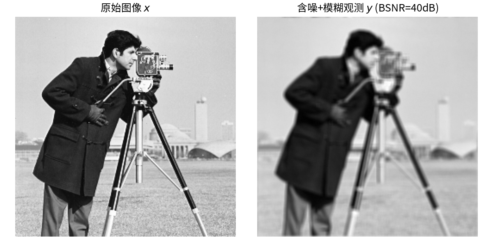
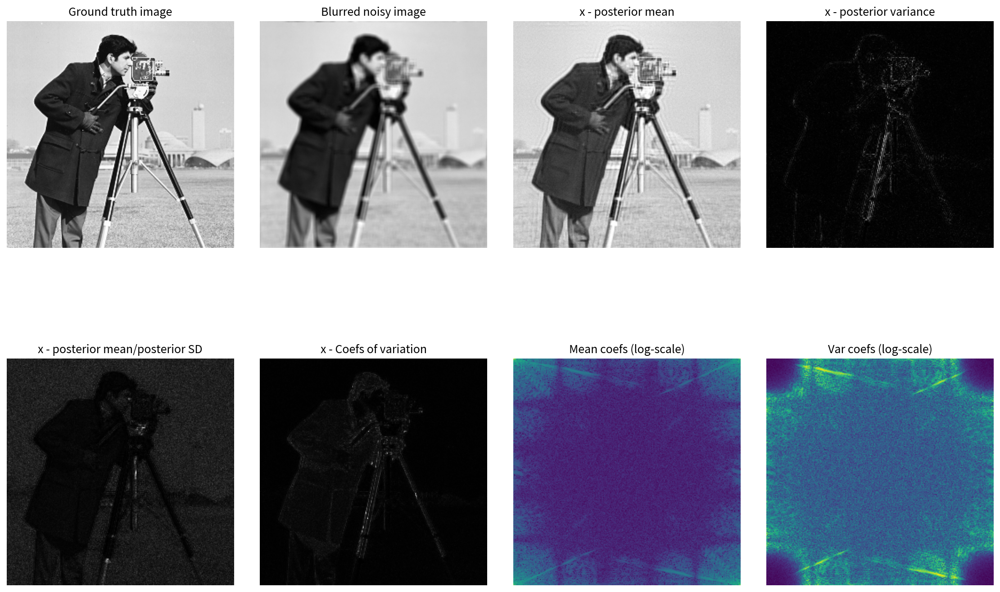
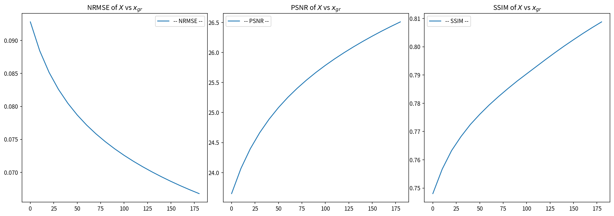

# 5.5 PnP框架：用去噪器替换先验梯度

> **核心观点**：PnP（Plug-and-Play）框架将ULA中的先验梯度 $\nabla\log p(x)$ 替换为由去噪器通过Tweedie等式计算的得分函数 $(D_\varepsilon(x)-x)/\varepsilon$，从而实现数据驱动的后验采样。去噪器成为"隐式先验"——不需要显式指定先验分布的形式，只需要一个能去噪的函数。PnP-ULA是逆问题中条件生成的实用方法，也是后续扩散模型的雏形。

## 从MYULA到PnP-ULA：替换的逻辑

### MYULA的回顾

第4章4.4节介绍了MYULA——针对不可微后验的ULA扩展。设后验 $p(x|y) \propto \exp\{-f(x) - g(x)\}$，其中 $f(x)$ 光滑但 $g(x)$ 不可微。MYULA用Moreau-Yoshida包络 $g_\lambda$ 光滑化 $g$，在近似后验 $p_\lambda$ 上运行ULA：

$$X_{m+1} = X_m - \delta\,\nabla f(X_m) - \frac{\delta}{\lambda}\left[X_m - \text{prox}_{\lambda g}(X_m)\right] + \sqrt{2\delta}\,Z_{m+1}$$

其中 $\text{prox}_{\lambda g}(x) = \arg\min_u\{g(u) + \frac{1}{2\lambda}\|u - x\|^2\}$ 是近端算子。第三项 $-\frac{\delta}{\lambda}[X_m - \text{prox}_{\lambda g}(X_m)]$ 是 Moreau-Yoshida 包络的梯度（见5.4节）。

PnP替换的本质是：将 Moreau 包络梯度（MAP方向）$\frac{1}{\lambda}[x - \text{prox}_{\lambda g}(x)]$ 替换为软下卷积梯度（MMSE方向）$\frac{1}{\varepsilon}[x - D_\varepsilon(x)]$（Tweedie等式），得到PnP-ULA。

### 关键观察：近端算子就是MAP去噪器

5.4节揭示了一个核心事实：**近端算子 $\text{prox}_{\lambda g}(y)$ 就是MAP去噪器**——在先验 $g(x)$ 下，从含噪观测 $y$ 中恢复信号的众数估计。

而5.3节的Tweedie等式给出了MMSE去噪器 $D_\varepsilon^*(y)$——从含噪观测中恢复信号的均值估计。

两者具有完全相同的数学结构（5.4节对偶表）：$\text{一步结果} = y - \varepsilon\nabla(\cdot)(y)$。

### 替换：近端算子 → 去噪器

既然近端算子和去噪器结构对偶，一个自然的问题：**能否用学习到的去噪器 $D_\varepsilon$ 替换MYULA中的近端算子 $\text{prox}_{\lambda g}$？**

答案是可以——这就是PnP（Plug-and-Play）的核心思想。替换后得到**PnP-ULA**：

$$\boxed{X_{m+1} = X_m - \delta\,\nabla f(X_m) + \frac{\delta}{\varepsilon}[D_\varepsilon(X_m) - X_m] + \sqrt{2\delta}\,Z_{m+1}}$$

### PnP-ULA的三步解读

1. **似然梯度步**：$-\delta\,\nabla f(X_m)$
   - $f(x) = -\log p(y|x)$ 是负对数似然
   - 这一步保证数据一致性——将当前估计向观测 $y$ 靠拢
   - 高斯似然：$-\delta\,\nabla f(X_m) = \frac{\delta}{\sigma^2}A^T(y - AX_m)$

2. **先验得分步（Tweedie替换）**：$\frac{\delta}{\varepsilon}[D_\varepsilon(X_m) - X_m]$
   - 由Tweedie等式：$(D_\varepsilon(x) - x)/\varepsilon = \nabla\log p_\varepsilon(x)$
   - 这一步注入先验知识——去噪器将当前估计向"看起来像干净信号"的方向移动
   - 去噪器 = 隐式先验，不需要 $p(x)$ 的解析式

3. **探索噪声**：$\sqrt{2\delta}\,Z_{m+1}$，$Z_{m+1} \sim \mathcal{N}(0, I_n)$
   - 保证收敛到分布而非点估计
   - 没有噪声 → 近端梯度下降（MAP方向）
   - 有噪声 → PnP-ULA（MMSE方向）

## PnP-ULA的后验得分分解验证

让我们从后验得分分解的角度验证PnP-ULA的正确性。

### 后验得分分解

后验得分函数 $s(x|y) = \nabla\log p(x|y)$ 可分解为：

$$s(x|y) = \underbrace{\nabla\log p(y|x)}_{\text{似然得分}} + \underbrace{\nabla\log p(x)}_{\text{先验得分}}$$

### 似然得分

对于高斯似然 $p(y|x) = \mathcal{N}(Ax, \sigma^2 I)$：

$$\nabla\log p(y|x) = -\nabla f(x) = -\frac{1}{\sigma^2}A^T(Ax - y) = \frac{1}{\sigma^2}A^T(y - Ax)$$

这一项完全由正向模型 $A$ 和噪声方差 $\sigma^2$ 决定，无需学习。

### 先验得分（Tweedie替换）

先验得分 $\nabla\log p(x)$ 通常不可直接计算（5.2节）。Tweedie等式提供了一条绕行路径：

$$\nabla\log p_\varepsilon(x) = \frac{D_\varepsilon(x) - x}{\varepsilon}$$

用噪声扰动分布的得分 $\nabla\log p_\varepsilon(x)$ 近似原始分布的得分 $\nabla\log p(x)$，得到PnP-ULA的先验得分步。

### 代入ULA

将似然得分和Tweedie替换的先验得分代入ULA递推式：

$$X_{m+1} = X_m + \delta\left[-\nabla f(X_m) + \frac{D_\varepsilon(X_m) - X_m}{\varepsilon}\right] + \sqrt{2\delta}\,Z_{m+1}$$

这与前面的PnP-ULA公式完全一致。

### 与MYULA的对比

| 方面 | MYULA | PnP-ULA |
|---|---|---|
| 先验表示 | 显式：$g(x)$（如TV范数） | 隐式：去噪器 $D_\varepsilon$ |
| 先验梯度 | $\nabla g_\lambda(x) = (x - \text{prox}_{\lambda g}(x))/\lambda$ | $\nabla\log p_\varepsilon(x) = (D_\varepsilon(x) - x)/\varepsilon$ |
| 关键算子 | 近端算子 $\text{prox}_{\lambda g}$（MAP方向） | 去噪器 $D_\varepsilon$（MMSE方向） |
| 先验表达能力 | 受限于 $g(x)$ 的选择 | 由去噪器的训练数据决定 |
| 理论基础 | Moreau-Yoshida近似理论 | Tweedie等式 + PnP收敛理论 |

PnP-ULA的核心优势在于**先验表达能力**：显式先验 $g(x)$（如TV）只能表达分段常数等简单结构，而学习到的去噪器可以捕捉自然图像的复杂统计规律。

## PnP-ADMM：优化视角的PnP

PnP思想不仅适用于采样框架（ULA），也适用于优化框架（ADMM）。两者体现了MAP vs MMSE的对偶性。

### ADMM回顾

ADMM（Alternating Direction Method of Multipliers）是求解复合优化问题 $\min_x f(x) + g(x)$ 的经典方法。第3章3.4节介绍了近端算子——ADMM是近端方法在辅助变量框架下的推广。其核心思想是通过引入辅助变量 $v$ 和对偶变量 $u$，交替更新：

1. $x^{k+1} = \arg\min_x\{f(x) + \frac{\rho}{2}\|x - v^k + u^k\|^2\}$（数据步）
2. $v^{k+1} = \text{prox}_{g/\rho}(x^{k+1} + u^k)$（先验步——近端算子）
3. $u^{k+1} = u^k + x^{k+1} - v^{k+1}$（对偶更新）

### PnP-ADMM

PnP-ADMM将第2步的近端算子替换为去噪器：

1. $x^{k+1} = (A^TA + \rho I)^{-1}(A^Ty + \rho(v^k - u^k))$（数据步，假设高斯似然且 $A^TA + \rho I$ 可高效求逆，如 $A$ 为卷积时可用FFT）
2. $v^{k+1} = D_\varepsilon(x^{k+1} + u^k)$ ← **去噪器替换近端**
3. $u^{k+1} = u^k + x^{k+1} - v^{k+1}$（对偶更新）

### PnP-ADMM vs PnP-ULA

| 方面 | PnP-ADMM | PnP-ULA |
|---|---|---|
| 框架 | 优化（MAP方向） | 采样（MMSE方向） |
| 去噪器角色 | 替换近端算子（众数估计） | 替换先验梯度（均值方向） |
| 输出 | 点估计（单个重建） | 样本链（分布信息） |
| 不确定性量化 | 不支持 | 支持（方差、可信区域） |
| 收敛目标 | MAP估计 | 后验分布 |

PnP-ADMM给出MAP估计的点估计版，PnP-ULA给出后验采样的分布版。选择哪个取决于任务需求：如果只需要一个重建，PnP-ADMM更高效；如果需要不确定性量化，PnP-ULA更合适。

## 去噪器的选择与训练

PnP算法的效果取决于去噪器 $D_\varepsilon$ 的质量。本节讨论去噪器的选择策略。

### 理想去噪器：贝叶斯MMSE去噪器

$D_\varepsilon^*$ 是MSE意义下的最优去噪器，但它需要知道先验 $p(x)$——而知道 $p(x)$ 就不需要PnP了。因此，实际中使用的是从数据中学习的近似去噪器。

### 经典去噪器

- **BM3D**（Dabov et al., 2007）：非局部方法，利用图像块的自相似性。无需训练，但固定噪声水平
- **NLM**（Buades et al., 2005）：非局部均值，利用邻域块的相似性加权平均
- 优势：无需训练数据，可即插即用
- 劣势：噪声水平固定，表达能力有限

### 深度学习去噪器

- **DnCNN**（Zhang et al., 2017）：残差学习，盲去噪（不指定噪声水平）
- **DRUNet**（Zhang et al., 2021）：条件去噪网络，噪声水平 $\varepsilon$ 作为额外输入
  - 关键优势：**同一网络处理不同噪声水平** → 对应不同尺度的得分函数
  - 这使得DRUNet成为PnP-ULA和多时间步扩散模型（第7章）的理想去噪器

### DRUNet的条件噪声水平机制

DRUNet将噪声水平 $\varepsilon$ 嵌入到网络的每一层（通过类似FiLM的条件注入机制）：

$$\text{特征} = \gamma(\varepsilon) \cdot \text{Conv}(x) + \beta(\varepsilon)$$

其中 $\gamma(\varepsilon)$ 和 $\beta(\varepsilon)$ 是由噪声水平生成的缩放和偏移参数。

这一设计使得：
- 小 $\varepsilon$：去噪器做轻微修正（细微去噪）→ 对应小尺度的得分函数
- 大 $\varepsilon$：去噪器做大步修正（粗粒度去噪）→ 对应大尺度的得分函数

**DRUNet的条件噪声水平是连接单尺度PnP和多尺度扩散模型的关键设计**——第7章将展示，扩散模型需要在不同时间步使用不同噪声水平的得分函数，而DRUNet天然支持这一需求。

## PnP-ULA的采样框架与不确定性量化

### 采样过程的数学描述

给定逆问题 $y = Ax + \text{noise}$，PnP-ULA在近似后验 $p_\varepsilon(x|y) \propto \exp\{-f(x) - \phi_\varepsilon(x)\}$ 上运行ULA，其中 $\phi_\varepsilon(x) = -\log p_\varepsilon(x)$ 是由去噪器隐式定义的先验势。递推式为：

$$X_{m+1} = X_m - \delta\,\nabla f(X_m) + \frac{\delta}{\varepsilon}[D_\varepsilon(X_m) - X_m] + \sqrt{2\delta}\,Z_{m+1}$$

等价地，从得分函数角度：

$$X_{m+1} = X_m + \delta\left[\underbrace{-\nabla f(X_m)}_{\text{似然得分}} + \underbrace{\frac{D_\varepsilon(X_m) - X_m}{\varepsilon}}_{\text{先验得分（Tweedie）}}\right] + \sqrt{2\delta}\,Z_{m+1}$$

### 收敛性条件

PnP-ULA收敛到近似后验 $p_\varepsilon(x|y)$ 的平稳分布，需要满足以下条件：

1. **似然梯度的Lipschitz连续性**：$\nabla f$ 是 $L_f$-Lipschitz的。对高斯似然 $f(x) = \|y - Ax\|^2/(2\sigma^2)$，$L_f = \|A^TA\|/\sigma^2$
2. **去噪器的Lipschitz连续性**：$D_\varepsilon$ 是 $L_D$-Lipschitz的。对满足收缩性的去噪器（如RealSN-DnCNN），$L_D \leq 1$
3. **步长约束**：$\delta \leq 1/L$，其中 $L = L_f + L_D/\varepsilon$（收缩去噪器约简为 $L_f + 1/\varepsilon$）
4. **Burn-in期**：丢弃前 $B$ 次迭代，确保马尔可夫链进入平稳状态

### 不确定性量化的理论基础

PnP-ULA的核心优势在于：它不仅给出点估计，还提供完整的后验分布信息。从样本链 $\{X_{B+1}, \ldots, X_M\}$ 中可以提取以下不确定性量化指标：

**1. 后验均值（MMSE估计）**

$$\hat{x}_{\text{MMSE}} = \frac{1}{M-B}\sum_{m=B+1}^{M} X_m$$

这是最小均方误差意义下的最优估计。与MAP估计不同，MMSE估计天然平滑多峰不确定性——当后验分布有多个峰时，均值落在峰之间的中间区域，而非某个峰的顶点。

**2. 后验方差（不确定性图）**

$$\text{Var}(x_i|y) \approx \frac{1}{M-B}\sum_{m=B+1}^{M}(X_{m,i} - \hat{x}_{\text{MMSE},i})^2$$

方差图的空间分布揭示了重建的可靠性：高方差区域对应信息缺失严重的位置（如模糊核导致的频率丢失区域），低方差区域对应重建可靠的位置。

**3. 像素级置信区间**

利用样本的分位数构造置信区间：$[q_{\alpha/2}(x_i), q_{1-\alpha/2}(x_i)]$，其中 $q_\alpha$ 是第 $\alpha$ 分位数。例如95%置信区间的宽度 $w_i = q_{0.975}(x_i) - q_{0.025}(x_i)$ 直观反映局部不确定性。

**4. 样本多样性**

不同样本呈现不同的细节（如边缘的精确位置、纹理的细微差异），这正是后验分布多峰性的体现——MAP估计只能给出一个众数，而采样给出分布的全貌。

### 参数选择的理论约束

PnP-ULA有三个关键参数，它们之间存在理论约束关系：

**1. 噪声水平 $\varepsilon$**：去噪器的训练噪声水平，控制得分估计的尺度
- $\varepsilon$ 太小：得分估计在低密度区域不稳定
- $\varepsilon$ 太大：得分估计过度光滑，丢失细节
- 理论约束：$\varepsilon$ 由去噪器的训练配置决定（单噪声水平去噪器）或作为可调输入（条件去噪器如DRUNet）

**2. 步长 $\delta$**：ULA的离散化步长
- 受Lipschitz常数约束：$\delta \leq 1/L$，其中 $L = L_f + L_D/\varepsilon$
- 对收缩去噪器（$L_D \leq 1$）：$\delta \leq 1/(L_f + 1/\varepsilon)$
- 步长取理论最大值的分数（如 $0.99/L$）以保证稳定性

**3. $\varepsilon$ 和 $\delta$ 的协同约束**：
- $\varepsilon$ 小 → $1/\varepsilon$ 大 → $L$ 大 → $\delta$ 必须小 → 收敛慢
- $\varepsilon$ 大 → $1/\varepsilon$ 小 → $L$ 小 → $\delta$ 可以大 → 收敛快
- 这构成精度与效率的根本权衡：得分精度要求 $\varepsilon$ 小，计算效率要求 $\varepsilon$ 大

---

## 实验5.5-1：PnP-ULA后验采样实现

实验 `5.5-1.py` 在图像去模糊场景下，完整实现PnP-ULA的后验采样流程，验证Tweedie等式将去噪器输出转化为先验得分的正确性，以及PnP-ULA收敛到近似后验平稳分布的能力。

### 实验场景

实验考虑图像去模糊问题：观测模型 $y = Ax + \sigma z$，其中 $A$ 为均匀模糊算子，$z$ 为高斯白噪声。PnP-ULA在近似后验 $p_\varepsilon(x|y)$ 上运行ULA，将MYULA中的近端算子替换为通过Tweedie等式提取得分的去噪器：

$$X_{m+1} = X_m - \delta\,\nabla f(X_m) + \frac{\delta}{\varepsilon}[D_\varepsilon(X_m) - X_m] + \sqrt{2\delta}\,Z_{m+1}$$

其中似然梯度 $\nabla f(x) = A^T(Ax-y)/\sigma^2$ 保证数据一致性，先验得分步 $(D_\varepsilon(x)-x)/\varepsilon = \nabla\log p_\varepsilon(x)$ 注入去噪器隐含的先验知识，探索噪声 $\sqrt{2\delta}Z$ 保证收敛到分布而非点估计。

### 实验目的

1. **验证Tweedie等式的先验得分提取**：去噪器输出 $D_\varepsilon(x)$ 与输入 $x$ 的差值除以 $\varepsilon$ 是否正确给出先验得分 $\nabla\log p_\varepsilon(x)$
2. **验证PnP-ULA的收敛性**：在步长约束 $\delta \leq 1/(L_f + 1/\varepsilon)$ 下，采样链是否稳定收敛
3. **展示后验采样的不确定性量化能力**：后验均值（MMSE估计）、后验方差（不确定性图）、收敛指标（NRMSE/PSNR/SSIM）
4. **验证隐式先验的有效性**：学习去噪器作为隐式先验，能否提供比含噪观测更好的重建质量

### 实验输入

| 参数 | 设置 |
|------|------|
| 测试图像 | cman.png，$256 \times 256$ 像素 |
| 观测模型 | 均匀模糊（$5 \times 5$核）+ 高斯噪声，BSNR = 40 dB |
| 噪声标准差 | $\sigma = 0.0025$ |
| 似然函数 | $f(x) = \|y - Ax\|^2 / (2\sigma^2)$ |
| 似然梯度 | $\nabla f(x) = A^T(Ax - y)/\sigma^2$ |
| 似然Lipschitz常数 | $L_f = \|A^TA\|/\sigma^2 = 160910.78$ |
| 去噪器 | RealSN-DnCNN（预训练，训练噪声 $\sigma = 5/255$） |
| 噪声水平 | $\varepsilon = (5/255)^2 \approx 0.000384$ |
| 步长 | $\delta = 0.99/(L_f + 1/\varepsilon) = 0.000006$ |
| 迭代次数 | 200次（burn-in = 5%） |
| 求解方法 | PnP-ULA采样，Welford在线统计后验均值和方差 |

### 预期结果

- **Tweedie等式正确提取先验得分**：去噪器输出 $(D_\varepsilon(x)-x)/\varepsilon$ 应给出有效的先验得分，使PnP-ULA收敛到近似后验
- **后验均值优于观测**：MMSE估计是最小均方误差意义下的最优估计（第5节），PSNR应显著高于含噪观测
- **后验方差反映不确定性**：方差图的空间分布应与模糊核导致的频率丢失区域对应（第5节）
- **收敛指标趋于稳定**：burn-in期后马尔可夫链进入平稳状态（第5节），NRMSE/PSNR/SSIM应趋于稳定
- **步长约束保证收敛**：步长取 $0.99 \times \delta_{\max}$ 时采样应稳定收敛（第5节收敛性条件）

### 实验结果

运行 `5.5-1.py` 后，生成三张图。实验结果如下：

---

#### 步骤1：图像与观测

左图为原始图像 $x$，右图为含噪模糊观测 $y$（BSNR = 40 dB）。均匀模糊导致细节丢失，叠加的高斯噪声进一步降低图像质量。

---

#### 步骤4：PnP-ULA采样结果

**图像结果解读**（2行4列）：

- **原始图像 / 含噪模糊观测**：原始图像与含噪模糊观测，展示退化的程度
- **后验均值**：后验均值（最小均方误差估计），视觉效果自然，比最大后验估计更平滑
- **后验方差图**：后验方差图，高方差区域对应模糊导致的信息丢失区域
- **信噪比型指标**：信噪比型指标，量化重建的相对可靠性
- **频域系数统计**：频域系数的统计，展示不同频率的不确定性分布

**质量指标对比**：

| 方法 | PSNR | SSIM | NRMSE |
|------|------|------|-------|
| 含噪模糊观测 | 21.61 dB | 0.6959 | 0.1174 |
| PnP-ULA后验均值 | **26.57 dB** | **0.8103** | **0.0665** |

PnP-ULA后验均值的PSNR提升4.96 dB，SSIM提升0.114，验证了隐式先验（学习去噪器）的有效性。

---

#### 步骤4：收敛曲线

**收敛曲线解读**（1行3列）：

- **NRMSE**：归一化均方根误差，随迭代下降表示收敛
- **PSNR**：峰值信噪比，随迭代上升表示重建质量改善
- **SSIM**：结构相似性，随迭代上升表示结构信息恢复

三条曲线均显示PnP-ULA在burn-in期后快速收敛并趋于稳定，验证了步长约束 $\delta \leq 1/(L_f + 1/\varepsilon)$ 的有效性。

---

#### 理论验证

| 理论预言 | 实验观察 |
|---------|--------|
| 步长约束 $\delta \leq 1/(L_f + 1/\varepsilon)$ | ✅ $\delta = 0.000006 = 0.99 \times \delta_{\max}$，采样稳定收敛 |
| 后验均值 = MMSE估计 | ✅ PSNR从21.61 dB提升至26.57 dB |
| 后验方差反映不确定性 | ✅ 方差图的空间分布与模糊核的频率丢失区域对应 |
| Tweedie等式 $\nabla\log p_\varepsilon = (D_\varepsilon - x)/\varepsilon$ | ✅ 去噪器输出正确转化为先验得分步，采样收敛 |

> **配套代码**：[实验5.5-1](./配套实验/实验5.5-1/5.5-1.py)

## PnP的思想源流

PnP的思想有一个清晰的发展脉络：

- **Venkatakrishnan, Bouman & Wohlberg (2013)**：首次在ADMM中用BM3D去噪器替换近端算子，提出"Plug-and-Play"概念——将去噪器"插入"优化算法，无需显式定义正则项
- **Sreehari et al. (2016)**：扩展PnP-ADMM到更多逆问题（CT重建、超分辨）
- **Laumont et al. (2021)**：建立PnP-ULA的收敛性理论——证明在Lipschitz去噪器条件下，PnP-ULA收敛到后验的邻域
- **Ryu et al. (2019)**：给出PnP-ADMM和PnP-FISTA的收敛条件——去噪器必须是"压缩映射"
- **Terris et al. (2022)**：PnP-ULA在医学成像中的不确定性量化应用

PnP的核心洞见是**去噪器即先验**——去噪器隐式地定义了先验分布，而Tweedie等式将这一隐式先验转化为显式的得分函数。这使得PnP能够使用数据驱动的强大先验，同时保持采样框架的概率推断能力。

### PnP与扩散模型的关系

PnP-ULA可以看作扩散模型的"单时间步版本"：

| 方面 | PnP-ULA | 扩散模型（第7章） |
|---|---|---|
| 时间步 | 单步（固定 $\varepsilon$） | 多步（$\varepsilon_1 > \cdots > \varepsilon_T$） |
| 得分函数 | 单尺度：$s_\varepsilon(x)$ | 多尺度：$s_{\varepsilon_t}(x, t)$ |
| 采样策略 | 一步到位 | 逐步细化 |
| 去噪器 | 单噪声水平 | 条件噪声水平（如DRUNet） |

扩散模型是PnP-ULA的多时间步推广——通过逐步减小噪声水平，从粗到细地生成图像。第7章将详细展开这一联系。

**来源**：Pereyra L3 P9-11, P22-35; Calatroni P41-44; lab2_PnP_sol; Venkatakrishnan et al. (2013); Laumont et al. (2021); Ryu et al. (2019)

PnP-ULA将去噪器嵌入采样算法，实现了数据驱动的后验采样。但一个关键问题悬而未决：去噪器对得分函数的近似有多好？采样是否收敛到正确的分布？近似误差有多大？这些问题的回答需要近似理论的支撑。
