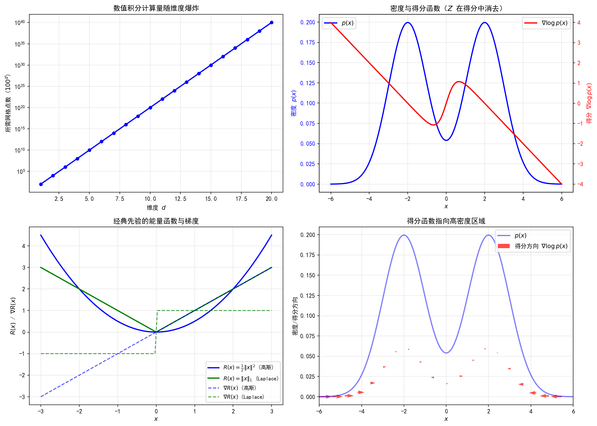

# 6.1 为什么需要学习得分？

> **核心观点**：Langevin动力学以得分函数 $\nabla\log p(x)$ 为驱动力，但得分函数在逆问题中通常不可直接计算——归一化常数 $Z$ 的不可解性和先验分布的复杂性是双重障碍。然而，得分函数具有"无需Z"的关键优势，使得从数据中间接学习成为可能——这正是得分匹配的出发点。

## 回顾：得分函数是Langevin的驱动力

第4章建立了ULA（Unadjusted Langevin Algorithm）作为后验采样的核心工具，其递推式为

$$X_{m+1} = X_m + \delta\,\nabla\log p(X_m|y) + \sqrt{2\delta}\,Z_{m+1}, \quad Z_{m+1} \sim \mathcal{N}(0, I)$$

其中 $\nabla\log p(x|y)$ 是后验分布的**得分函数**——对数概率密度的梯度。第5章进一步揭示了得分函数的几何含义：它是概率分布的"方向场"，在每一点指向密度增长最快的方向，其模长表示变化的剧烈程度。

对于逆问题的后验分布，得分函数可分解为两项（第5章5.2节）：

$$\nabla\log p(x|y) = \underbrace{\nabla\log p(y|x)}_{\text{似然得分}} + \underbrace{\nabla\log p(x)}_{\text{先验得分}}$$

似然得分由正向模型和噪声模型决定，通常可以计算。例如，高斯似然下：

$$\nabla\log p(y|x) = -\frac{1}{\sigma^2}A^T(Ax - y)$$

但**先验得分 $\nabla\log p(x)$ 是瓶颈**——它取决于先验分布 $p(x)$ 的形式，而这恰恰是我们不知道的。

## 归一化常数的困境

先验分布通常写作能量模型的形式：

$$p(x) = \frac{1}{Z}\exp(-R(x))$$

其中 $R(x)$ 是正则化函数（第2章2.1节），$Z = \int\exp(-R(x))\,dx$ 是归一化常数。

乍看之下，归一化常数似乎不是问题——对 $\log p(x)$ 求导时 $Z$ 自然消去：

$$\nabla\log p(x) = \nabla\left[-R(x) - \log Z\right] = -\nabla R(x)$$

对于经典先验，这确实可行：

| 先验 | $R(x)$ | $\nabla R(x)$ | 可计算？ |
|---|---|---|---|
| 高斯（Tikhonov） | $\frac{1}{2\lambda}\|x\|^2$ | $\frac{x}{\lambda}$ | 是 |
| Laplace（L1） | $\frac{1}{\lambda}\|x\|_1$ | $\frac{1}{\lambda}\text{sign}(x)$（次微分） | 是（近端方法） |
| TV | $\|\nabla x\|_1$ | $-\nabla^*\text{sign}(\nabla x)$ | 是（对偶方法） |

但对于"看起来像自然图像"这样的复杂先验，$R(x)$ **本身没有解析形式**。真实图像的统计分布远比任何参数化模型复杂——它不能被高斯、Laplace或任何简单的能量函数描述。先验分布 $p(x)$ 的结构完全未知，我们只有来自 $p(x)$ 的数据样本 $\{x_i\}_{i=1}^N$。

这正是第1-3章与第5章及以后的**根本区别**：经典方法（Tikhonov/TV）有显式 $R(x)$，但表达能力有限；复杂先验表达能力无限，但 $R(x)$ 不可写——$\nabla R(x)$ 不可算。

## 得分函数的关键优势：无需归一化常数

虽然先验分布 $p(x)$ 不可写，得分函数却有一个关键性质：**不需要归一化常数**。

对任意正比例函数 $\tilde{p}(x) = Z\,p(x)$，其中 $Z > 0$ 是常数：

$$\nabla\log \tilde{p}(x) = \nabla[\log p(x) + \log Z] = \nabla\log p(x)$$

归一化常数 $Z$ 在求导时完全消去！这意味着：

- 我们不需要知道 $Z$ 就能计算得分函数
- 即使 $Z$ 不可计算（$\int\exp(-R(x))\,dx$ 无法解析求解），得分函数仍然有定义

这一性质在统计学中早已为人所知——它正是MCMC方法（第4章）的基础：Metropolis-Hastings只需要 $p(x)$ 的非归一化形式就能进行采样。得分匹配方法的出发点完全相同：**如果某种训练方法只需要得分函数而非密度本身，就天然绕过了归一化常数的障碍。**

---

## 实验 6.1-1：归一化常数困境与得分函数优势

实验 `6.1-1.py` 演示**归一化常数 $Z$ 在高维不可算的困境**，以及**得分函数"无需 $Z$"的关键优势**，验证得分函数是 Langevin 动力学的驱动力，并说明先验得分是逆问题中的瓶颈。

### 实验场景

实验围绕两个核心问题展开：

**问题一：归一化常数 $Z$ 为何不可算？** 先验分布通常写作能量模型形式 $p(x) = \frac{1}{Z}\exp(-R(x))$，其中 $Z = \int\exp(-R(x))\,dx$。实验分两种情况演示 $Z$ 的困境：

- **情况A（有参数化表达式但维数诅咒）**：即使每个分量可写，高维数值积分需要 $O(100^d)$ 网格点，随维度指数爆炸
- **情况B（隐式先验）**：真实图像分布 $p(x)$ 无法写成任何有限参数公式，$Z$ 甚至无法定义为有限维积分对象

**问题二：得分函数如何绕过 $Z$？** 对任意正比例函数 $\tilde{p}(x) = Z\,p(x)$，得分函数 $\nabla\log p(x) = \nabla\log\tilde{p}(x)$。实验通过两条独立计算路径验证这一性质。

### 实验目的

1. **验证归一化常数 $Z$ 的维度困境**：低维时 $Z$ 可通过数值积分精确计算，高维时计算量指数爆炸
2. **验证得分函数"无需 $Z$"的性质**：从归一化密度 $p(x)$ 和未归一化密度 $\tilde{p}(x)$ 分别计算得分函数，两者应完全一致
3. **理解经典先验与复杂先验的根本区别**：经典先验有显式 $R(x)$ 且梯度可算，复杂先验的 $R(x)$ 不可写

### 实验输入

| 参数 | 设置 |
|------|------|
| 低维验证 | 2D高斯混合分布（两个分量，$\mu_1=(-2,-2)$，$\mu_2=(2,2)$，$\Sigma$ 含非对角项 $0.3$） |
| 维度分析 | $d \in \{2, 5, 10, 20, 50\}$，标准高斯分布的 $\log Z$ |
| 得分函数验证 | 1D高斯混合分布 $p(x) = 0.5\,\mathcal{N}(-2,1) + 0.5\,\mathcal{N}(2,1)$，测试点 $x \in \{-3,-2,-1,0,1,2,3\}$ |
| 数值微分精度 | $\varepsilon = 10^{-5}$（中心差分） |
| 经典先验对比 | 高斯（Tikhonov）$R(x)=\frac{1}{2}\|x\|^2$ 与 Laplace $R(x)=\|x\|_1$ |

### 预期结果

- 2D高斯混合的数值积分结果应与理论值 $Z = 2\pi\sqrt{|\Sigma|}$ 吻合
- 维度 $d$ 增大时，数值积分所需网格点数 $100^d$ 指数爆炸
- 从归一化密度解析计算的得分函数与从未归一化密度数值微分计算的得分函数，差异应接近机器精度（$\sim 10^{-10}$ 量级）
- 得分函数的箭头方向应始终指向概率密度的高值区域（双峰之间指向两侧峰顶）

### 实验结果

运行 `6.1-1.py` 后，生成一张包含四个子图的图表。实验结果如下：

---

#### 步骤1：Z困境与得分函数优势

**子图1（左上）：数值积分计算量随维度爆炸**

| 维度 $d$ | $\log Z$ | 所需网格点数 $100^d$ |
|-----------|----------|---------------------|
| 2 | 1.84 | $10^4$ |
| 5 | 4.59 | $10^{10}$ |
| 10 | 9.19 | $10^{20}$ |
| 20 | 18.38 | $10^{40}$ |
| 50 | 45.95 | $10^{100}$ |

$d=20$ 时网格点数已达 $10^{40}$，远超任何计算机的存储能力。这验证了6.1节所述：即使分布有参数化形式，高维数值积分也因维数诅咒而不可行。

**子图2（右上）：密度与得分函数**

蓝色曲线为归一化密度 $p(x)$，红色曲线为得分函数 $\nabla\log p(x)$（右轴）。可见：
- 得分函数在 $x=0$（双峰之间的谷底）处为零——此处是局部极小值点，密度梯度为零
- 得分函数在 $x \approx \pm 2$（峰顶附近）处为零——此处是局部极大值点
- 在 $x < -2$ 区域，得分函数为正（指向右方，即指向高密度区域）
- 在 $x > 2$ 区域，得分函数为负（指向左方，即指向高密度区域）

这直观展示了6.1节所述：得分函数是概率分布的"方向场"，在每一点指向密度增长最快的方向。

**子图3（左下）：经典先验的能量函数与梯度**

对比高斯先验 $R(x)=\frac{1}{2}\|x\|^2$ 与 Laplace 先验 $R(x)=\|x\|_1$：
- 高斯先验：$R(x)$ 光滑，$\nabla R(x) = x$ 连续变化
- Laplace 先验：$R(x)$ 在零点不可导，$\nabla R(x) = \text{sign}(x)$ 为分段常数

两者均有显式 $R(x)$ 且梯度可算（Laplace 用次微分/近端方法），对应6.1节表格中"可计算"的经典先验。

**子图4（右下）：得分函数指向高密度区域**

红色箭头表示得分方向 $\nabla\log p(x)$，叠加在密度曲线 $p(x)$ 上。箭头始终指向最近的峰顶（高密度区域），直观验证了得分函数作为 Langevin 动力学驱动力的作用机制——采样点沿得分方向移动，逐渐聚集到高概率区域。

---

#### 得分函数"无需Z"的数值验证

实验通过两条独立路径计算得分函数：

| $x$ | $\nabla\log p(x)$ 解析（路径1） | $\nabla\log\tilde{p}(x)$ 数值（路径2） | 差异 |
|-----|-------------------------------|--------------------------------------|------|
| -3.0 | 1.000000 | 1.000000 | $\sim 10^{-10}$ |
| -2.0 | 0.000000 | 0.000000 | $\sim 10^{-10}$ |
| -1.0 | -1.000000 | -1.000000 | $\sim 10^{-10}$ |
| 0.0 | 0.000000 | 0.000000 | $\sim 10^{-10}$ |
| 1.0 | 1.000000 | 1.000000 | $\sim 10^{-10}$ |
| 2.0 | 0.000000 | 0.000000 | $\sim 10^{-10}$ |
| 3.0 | -1.000000 | -1.000000 | $\sim 10^{-10}$ |

两条路径的差异在机器精度量级（$\sim 10^{-10}$），数值验证了 $\nabla\log p(x) = \nabla\log\tilde{p}(x)$。即使对于高斯混合这种 $p(x)$ 形式复杂（两个指数项之和）的分布，归一化常数 $Z$ 在求导时仍然完全消去。

---

#### 核心知识点

| 知识点 | 实验验证 | 对应6.1节内容 |
|--------|---------|-------------|
| $Z$ 低维可算 | 2D数值积分 $Z=3.005$ vs 理论值 $2\pi\sqrt{0.91}=3.005$ | "归一化常数的困境" |
| $Z$ 高维不可算 | $d=20$ 时需 $10^{40}$ 网格点 | "维数诅咒" |
| 得分函数无需 $Z$ | 两条路径差异 $\sim 10^{-10}$ | "得分函数的关键优势" |
| 得分函数指向高密度 | 箭头指向双峰峰顶 | "方向场"几何含义 |
| 经典先验梯度可算 | 高斯/Laplace 的 $R(x)$ 和 $\nabla R(x)$ 均有显式 | 6.1节先验对比表 |

## 从数据中学习得分的可能性

数据样本 $\{x_i\}_{i=1}^N \sim p(x)$ 隐含了 $p(x)$ 的信息。我们的目标是训练一个参数化网络 $s_\theta: \mathbb{R}^d \to \mathbb{R}^d$，使得

$$s_\theta(x) \approx \nabla\log p(x)$$

这个目标看似自然，但存在一个核心困难：**监督信号 $\nabla\log p(x)$ 不可得**。

- 在分类任务中，我们有标签 $(x_i, y_i)$，可以用交叉熵训练
- 在回归任务中，我们有配对数据 $(x_i, f(x_i))$，可以用MSE训练
- 但在得分估计中，我们只有 $x_i$ 本身——没有 $\nabla\log p(x_i)$ 作为"标签"

这正是得分匹配要解决的核心问题：**设计一种训练目标，不需要 $\nabla\log p(x)$ 作为监督信号，但训练出的网络 $s_\theta(x)$ 仍然收敛到 $\nabla\log p(x)$。**

## 得分匹配的基本思路

得分匹配的基本策略是：利用得分函数"无需Z"的性质，设计目标函数使得：

1. 目标函数可以用数据样本 $\{x_i\}$ 计算（不需要 $\nabla\log p(x)$）
2. 目标函数关于 $\theta$ 的最优解恰好是 $\nabla\log p(x)$（Fisher一致性）

这个策略有多种实现方式，构成了本章的主要内容：

| 方法 | 核心思路 | 特点 |
|---|---|---|
| ESM | 直接用 $\nabla\log p(x)$ 作监督 | 不可行（监督信号未知） |
| ISM | 分部积分消去 $\nabla\log p(x)$ | 需要Jacobian迹（高维不可行） |
| DSM | 噪声扰动+闭式条件得分 | 实用，主流方法 |
| SSM | 随机投影近似Jacobian迹 | 理论互补，估计原始得分 |

## 本章要回答的问题

1. 如何设计不依赖 $\nabla\log p(x)$ 的训练目标？（6.2-6.4）
2. 单一噪声水平够不够？为什么需要多尺度？（6.5）
3. 如何在实践中实现得分估计器？（6.6）
4. 学习到的得分能否驱动有效的采样？（6.7）

---

**来源**：Pereyra L1 P58-60; Hyvärinen (2005); Song & Ermon (2019)

得分函数有"无需Z"的关键优势，但如何利用这一优势设计训练方法？最直接的想法是显式得分匹配——让网络直接逼近 $\nabla\log p(x)$。
