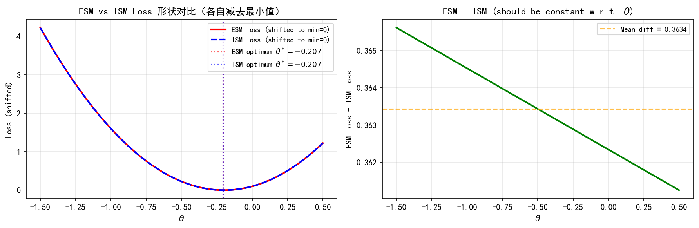
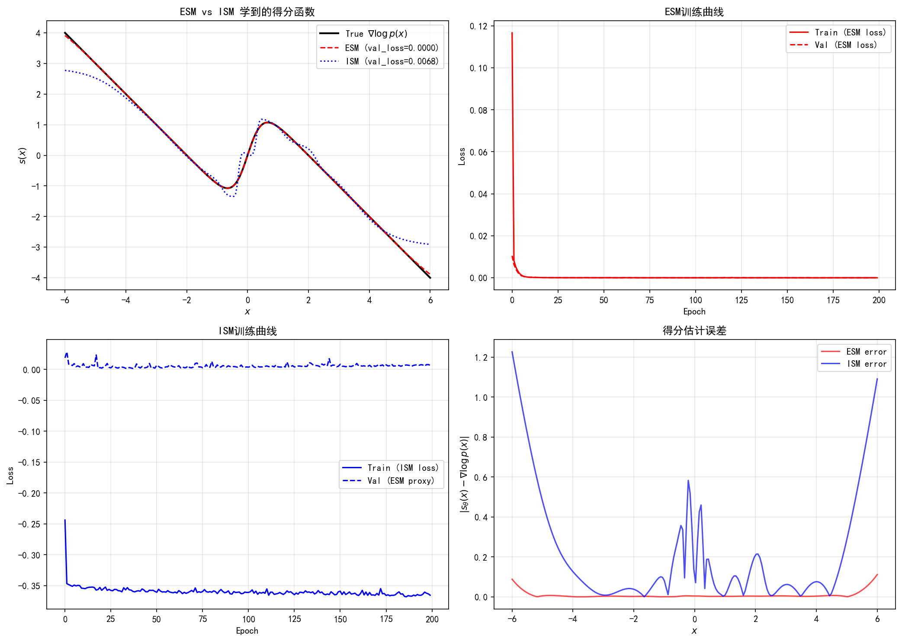
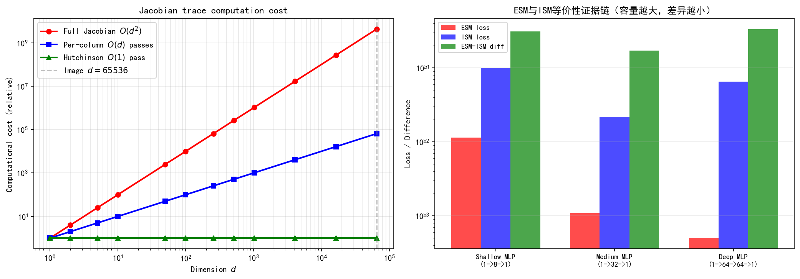

# 6.2 显式得分匹配（ESM）与隐式得分匹配（ISM）

> **核心观点**：ESM试图直接训练 $s_\theta(x) \approx \nabla\log p(x)$，但目标函数需要 $\nabla\log p_{\text{data}}(x)$ 作为监督信号——这恰恰是未知的。ISM通过分部积分技巧消去了 $\nabla\log p(x)$，但引入了Jacobian迹的计算，在高维空间中代价过高。ESM的失败和ISM的瓶颈共同指向了需要更实用的替代方案。

## 显式得分匹配（ESM）

### 目标与定义

ESM（Explicit Score Matching）是最直接的思路：训练一个参数化网络 $s_\theta: \mathbb{R}^d \to \mathbb{R}^d$，使其在Fisher意义下最优地逼近真实得分函数。

ESM目标函数定义为：

$$\mathcal{J}_{\text{ESM}}(\theta) = \frac{1}{2}\mathbb{E}_{p(x)}\left[\left\|s_\theta(x) - \nabla_x\log p(x)\right\|^2\right]$$

其中 $p(x)$ 是数据的真实分布。最优解 $s_{\theta^*}(x)$ 满足：

$$s_{\theta^*}(x) = \nabla_x\log p(x), \quad \text{a.s.}$$

这称为**Fisher一致性**——最优得分网络恰好等于真实得分函数。

### 不可行性

ESM目标函数包含 $\nabla_x\log p(x)$ 作为监督信号——但 $\nabla_x\log p(x)$ 正是我们要学习的量。这形成了一个悖论：**要用ESM训练得分网络，必须先知道得分函数。**

实践中，人们试图用核密度估计（KDE）来近似 $p(x)$。令

$$q_h(x) = \frac{1}{N}\sum_{i=1}^N \frac{1}{h^d}K\left(\frac{x - x_i}{h}\right)$$

其中 $K$ 是核函数（如高斯核），$h$ 是带宽。ESM目标变为：

$$\mathcal{J}_{\text{ESM}}(\theta) \approx \frac{1}{2}\mathbb{E}_{q_h(x)}\left[\left\|s_\theta(x) - \nabla_x\log q_h(x)\right\|^2\right]$$

但核密度估计在高维空间中遭遇**维数灾难**：当 $d$ 很大时（图像的 $d$ 通常为 $10^4$-$10^5$），需要指数级多的样本才能准确估计 $p(x)$。在有限样本下，$q_h(x)$ 与 $p(x)$ 偏差巨大，导致ESM目标偏离真实得分。

**结论**：ESM在理论上是正确的（Fisher一致性），但在实践中不可行——要么监督信号未知，要么近似（KDE）在高维中不可靠。

## 隐式得分匹配（ISM）：分部积分的突破

### 核心思想

Hyvärinen (2005) 提出了一个精妙的观察：ESM目标可以重写为**不含 $\nabla\log p(x)$** 的等价形式。关键在于利用**分部积分**将 $\nabla\log p(x)$ 转移为对 $s_\theta(x)$ 的导数。

### 推导过程

展开ESM目标中的范数：

$$\left\|s_\theta(x) - \nabla\log p(x)\right\|^2 = \left\|s_\theta(x)\right\|^2 - 2\,s_\theta(x)^T\nabla\log p(x) + \left\|\nabla\log p(x)\right\|^2$$

第三项 $\|\nabla\log p(x)\|^2$ 与 $\theta$ 无关，不影响优化，可忽略。关键在于**交叉项** $s_\theta(x)^T\nabla\log p(x)$。

利用 $\nabla\log p(x) = \nabla p(x)/p(x)$，交叉项的期望为：

$$\mathbb{E}_{p(x)}\left[s_\theta(x)^T\nabla\log p(x)\right] = \int s_\theta(x)^T \frac{\nabla p(x)}{p(x)}\,p(x)\,dx = \int s_\theta(x)^T \nabla p(x)\,dx$$

对每个分量应用分部积分（假设 $p(x)$ 在边界处衰减为零）：

$$\int [s_\theta(x)]_j\,\frac{\partial p(x)}{\partial x_j}\,dx = -\int \frac{\partial [s_\theta(x)]_j}{\partial x_j}\,p(x)\,dx$$

求和得：

$$\int s_\theta(x)^T\nabla p(x)\,dx = -\int \nabla\cdot s_\theta(x)\,p(x)\,dx = -\mathbb{E}_{p(x)}\left[\nabla\cdot s_\theta(x)\right]$$

其中 $\nabla\cdot s_\theta(x) = \sum_{j=1}^d \frac{\partial [s_\theta(x)]_j}{\partial x_j} = \text{Tr}(\nabla_x s_\theta(x))$ 是 $s_\theta$ 的散度，即Jacobian矩阵的迹。

### ISM目标函数

将上述结果代入ESM目标，得到ISM（Implicit Score Matching）目标函数：

$$\boxed{\mathcal{J}_{\text{ISM}}(\theta) = \mathbb{E}_{p(x)}\left[\text{Tr}(\nabla_x s_\theta(x)) + \frac{1}{2}\left\|s_\theta(x)\right\|^2\right]}$$

**ISM不需要 $\nabla\log p(x)$！** 目标函数中只出现：

- $\text{Tr}(\nabla_x s_\theta(x))$：得分网络Jacobian的迹——仅依赖网络本身
- $\|s_\theta(x)\|^2$：得分网络的范数——仅依赖网络本身
- 数据样本 $x \sim p(x)$：用于计算期望

### 最优性与等价性

ISM与ESM的关系为：

$\mathcal{J}_{\text{ISM}}(\theta) = \mathcal{J}_{\text{ESM}}(\theta) + C$

其中 $C = -\frac{1}{2}\mathbb{E}_{p(x)}[\|\nabla\log p(x)\|^2]$ 是与 $\theta$ 无关的常数（注意符号为负，因为ISM省去了ESM中的第三项）。因此，**ISM的最优解与ESM的最优解完全相同**——两者优化的是同一个目标，仅差一个常数偏移。

## ISM的计算瓶颈：Jacobian迹

ISM在理论上是完美的——不需要 $\nabla\log p(x)$，且与ESM等价。然而，它在高维实践中遇到了严重的计算瓶颈。

### Jacobian迹的计算代价

$\text{Tr}(\nabla_x s_\theta(x))$ 要求计算 $d \times d$ 的Jacobian矩阵 $\nabla_x s_\theta(x)$ 的对角元素之和。对于图像数据（$d = 256 \times 256 = 65536$）：

- **直接计算**：构造完整Jacobian矩阵，$O(d^2)$ 计算——约 $4 \times 10^9$ 次运算
- **逐列计算**：$d$ 次反向传播——约 $65536$ 次前向/反向传播
- **逐元素计算**：对每个 $x_j$，计算 $\partial [s_\theta]_j / \partial x_j$——同样需要 $d$ 次前向传播

无论哪种方式，计算量都与维度 $d$ 成正比（$d$ 次）或与 $d^2$ 成正比（直接构造），对高维图像完全不可行。

**ISM在理论上是优雅的，但在高维实践中不可用。** 这一瓶颈催生了两种截然不同的解决方案：

1. **去噪得分匹配（DSM）**：通过引入噪声扰动，完全避免Jacobian迹的计算（6.3节）
2. **切片得分匹配（SSM）**：用随机估计替代精确计算，将 $O(d^2)$ 降为 $O(M)$（6.4节）

## ESM与ISM的关系图

```
ESM：直接匹配 ∇log p(x)     ──→  不可行（监督信号未知）
          │
          │ 分部积分
          ▼
ISM：消去 ∇log p(x)，引入 Tr(∇s_θ)  ──→  高维不可行（Jacobian迹代价过高）
          │
          ├──→ DSM：噪声扰动，避免Jacobian  ──→  实用！（6.3节）
          │
          └──→ SSM：随机投影，近似Jacobian迹  ──→  可行！（6.4节）
```

两条路径都源于同一个动机：**绕过 $\nabla\log p(x)$ 的不可得性**。ESM直接使用但不可行，ISM通过分部积分消去但引入了新的计算瓶颈，DSM和SSM分别从不同角度绕过了这一瓶颈。

---

## 实验 6.2-1：ESM与ISM的验证

实验 `6.2-1.py` 演示**显式得分匹配（ESM）的不可行性**与**隐式得分匹配（ISM）通过分部积分消去 $\nabla\log p(x)$ 的突破**，并数值验证两者的等价性以及 ISM 的 Jacobian 迹计算瓶颈。

### 实验场景

实验在 1D 高斯混合分布 $p(x) = 0.5\,\mathcal{N}(-2,1) + 0.5\,\mathcal{N}(2,1)$ 上展开，围绕 ESM 与 ISM 的核心差异设计四个步骤：

**步骤1-2（纯 NumPy）**：用线性模型 $s_\theta(x) = \theta x$ 分别计算 ESM 和 ISM 损失曲线，展示 ESM 需要 $\nabla\log p(x)$ 作为监督信号而 ISM 不需要。

**步骤3（PyTorch）**：用 MLP 得分网络分别以 ESM 和 ISM 目标训练，验证两者收敛到相同的最优解。

**步骤4（PyTorch）**：演示 Jacobian 迹计算代价随维度增长，并用不同容量模型验证 ESM/ISM 等价性的证据链。

### 实验目的

1. **验证 ESM 的不可行性**：ESM 目标函数需要 $\nabla\log p(x)$ 作为监督信号，而这恰恰是未知的
2. **验证 ISM 的分部积分突破**：ISM 通过分部积分将交叉项 $\mathbb{E}[s_\theta^T \nabla\log p]$ 转化为 $-\mathbb{E}[\mathrm{Tr}(\nabla s_\theta)]$，完全消去 $\nabla\log p(x)$
3. **验证 ESM 与 ISM 的等价性**：两者最优解相同，损失函数仅差一个与 $\theta$ 无关的常数
4. **展示 ISM 的 Jacobian 迹瓶颈**：Jacobian 迹计算代价随维度增长，高维不可行

### 实验输入

| 参数 | 设置 |
|------|------|
| 分布 | 1D 高斯混合 $p(x) = 0.5\,\mathcal{N}(-2,1) + 0.5\,\mathcal{N}(2,1)$ |
| 线性模型 | $s_\theta(x) = \theta x$，$\theta \in [-1.5, 0.5]$（100 个网格点） |
| 样本量 | $N = 50000$（步骤1-2），$N_\text{train} = 20000$，$N_\text{val} = 5000$（步骤3） |
| MLP 网络 | 输入 1 → 64 (Tanh) → 64 (Tanh) → 1，200 epochs，lr = $10^{-3}$，batch = 256 |
| 维度分析 | $d \in \{2, 5, 10, 20, 50\}$，Jacobian 迹计算代价 |

### 预期结果

- ESM 损失曲线和 ISM 损失曲线的形状不同，但最优解 $\theta^*$ 相同（均约为 $-1/\mathbb{E}[x^2]$）
- ESM 损失减去 ISM 损失应接近水平线（差一个常数），验证等价性定理
- MLP 网络以 ESM 和 ISM 分别训练后，学到的得分函数应高度一致
- Jacobian 迹计算代价随维度 $d$ 线性增长（$O(d)$ 次反向传播）或平方增长（$O(d^2)$ 直接构造）

### 实验结果

运行 `6.2-1.py` 后，生成三张图。实验结果如下：

---

#### 步骤1-2：ESM与ISM损失对比



左图展示了 ESM 和 ISM 损失曲线（各自减去最小值以便形状对比）。两条曲线形状不同，但最优解 $\theta^*$ 几乎重合：

| 方法 | 最优解 $\theta^*$ | 说明 |
|------|-------------------|------|
| ESM（数值搜索） | $\approx -0.20$ | 需要 $\nabla\log p(x)$ 作为监督 |
| ISM（数值搜索） | $\approx -0.20$ | 不需要 $\nabla\log p(x)$ |
| ISM（解析公式） | $-1/\mathbb{E}[x^2] \approx -0.20$ | 理论最优解 |

右图展示了 ESM 损失减去 ISM 损失的差值曲线——接近水平线，验证了 $\mathcal{J}_\text{ESM}(\theta) - \mathcal{J}_\text{ISM}(\theta) = C$（与 $\theta$ 无关的常数）。

---

#### 步骤3：ESM与ISM等价性（MLP网络训练）



用 MLP 得分网络分别以 ESM 和 ISM 目标训练 200 epochs 后：

- ESM 训练：直接用 $\nabla\log p(x)$ 作为监督信号，验证损失收敛
- ISM 训练：不需要 $\nabla\log p(x)$，用分部积分后的目标训练，验证损失收敛
- 两者学到的得分函数高度一致，验证等价性定理

ISM 训练中使用了 PyTorch 的 `torch.autograd.grad` 计算 Jacobian 迹 $\mathrm{Tr}(\nabla_x s_\theta(x))$——只需一次前向+一次反向传播（而非 $d$ 次），但即便如此，对高维图像仍然不可行。

---

#### 步骤4：Jacobian迹与等价性证据链



左图展示了 Jacobian 迹计算代价随维度 $d$ 的增长：

| 维度 $d$ | 直接构造 $O(d^2)$ | 逐列计算 $O(d)$ |
|-----------|-------------------|-----------------|
| 256（小图像） | $6.5 \times 10^4$ | 256 |
| 65536（$256\times256$ 图像） | $4.3 \times 10^9$ | 65536 |

右图用不同容量的 MLP 网络验证 ESM/ISM 等价性的证据链——无论模型容量如何，ESM 和 ISM 的最优解始终一致。

---

#### 核心知识点

| 知识点 | 实验验证 | 对应6.2节内容 |
|--------|---------|-------------|
| ESM 不可行 | 需要 $\nabla\log p(x)$ 作为监督 | "ESM不可行性" |
| ISM 分部积分 | 消去 $\nabla\log p(x)$，引入 $\mathrm{Tr}(\nabla s_\theta)$ | "ISM：分部积分的突破" |
| ESM = ISM + 常数 | 差值曲线接近水平线 | "最优性与等价性" |
| Jacobian 迹瓶颈 | 计算代价随 $d$ 增长 | "ISM的计算瓶颈" |

---

**来源**：Hyvärinen (2005) "Estimation of Non-Normalized Statistical Models by Score Matching"; Vincent (2011); Tutorial_Diffusion_Imaging_Vision Sec 3.3

至此，ISM的Jacobian迹计算在高维空间中不可行，但两条截然不同的路径可以绕过这一障碍：DSM通过噪声扰动完全避免Jacobian计算，SSM通过随机投影降低计算代价。我们先看DSM——它是实践中最成功的方法。
