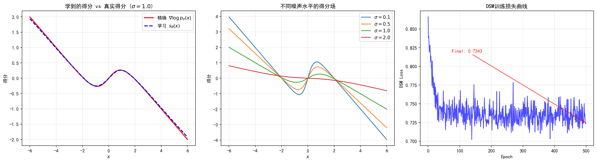
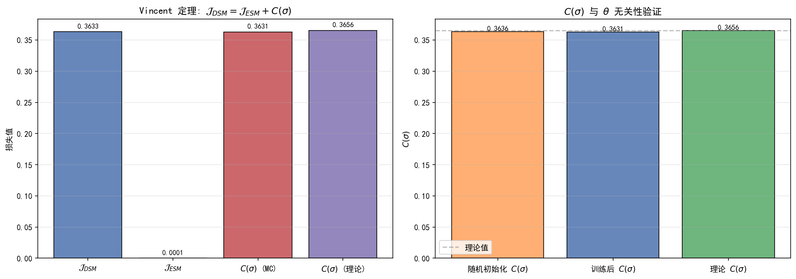

# 6.3 去噪得分匹配（DSM）

> **核心观点**：DSM（Denoising Score Matching）是得分匹配的实用突破——通过引入噪声扰动，目标函数中的条件得分有闭式解，完全避免了Jacobian迹的计算。更关键的是，Vincent (2011) 证明DSM与ESM优化的是同一个目标（仅差常数），且DSM的训练目标等价于去噪——给定含噪观测预测添加的噪声。这呼应了第5章Tweedie等式的洞见：去噪=得分估计。

## 核心思想：噪声扰动分布

ESM需要 $\nabla\log p(x)$ 作为监督信号，ISM需要计算Jacobian迹——两者在高维实践中都不可行。DSM的核心思想是：**不直接估计 $s(x) = \nabla\log p(x)$，而是估计噪声扰动后的得分 $s_\sigma(x) = \nabla\log p_\sigma(x)$**。

定义噪声扰动分布：

$$p_\sigma(\tilde{x}) = \int p(x)\,\mathcal{N}(\tilde{x}|x, \sigma^2 I)\,dx = (p * \mathcal{N}(0, \sigma^2 I))(\tilde{x})$$

第5章5.2节已经讨论了噪声扰动的好处：

1. **光滑化**：$p_\sigma \in C^\infty$，即使 $p$ 不光滑
2. **全覆盖**：$p_\sigma(x) > 0$ 处处成立，得分处处有定义
3. **与去噪器天然联系**：$p_\sigma$ 恰好是去噪问题的边际分布

DSM利用了第四个好处——**条件得分 $\nabla_{\tilde{x}}\log q_\sigma(\tilde{x}|x)$ 有闭式解**，而这正是ESM和ISM中缺失的"监督信号"。

## DSM目标函数推导

### 联合分布与条件得分

定义联合分布：

$q_\sigma(\tilde{x}, x) = p(x)\,q_\sigma(\tilde{x}|x), \quad q_\sigma(\tilde{x}|x) = \mathcal{N}(\tilde{x}|x, \sigma^2 I)$

这里 $\sigma^2$ 对应第5章5.2-5.3节中的噪声方差 $\varepsilon$（即 $\varepsilon = \sigma^2$），$\sigma$ 为噪声标准差。本章采用 $\sigma$ 记号以与扩散模型文献保持一致。

DSM目标函数定义为：

$\mathcal{J}_{\text{DSM}}(\theta) = \frac{1}{2}\mathbb{E}_{q_\sigma(\tilde{x}, x)}\left[\left\|s_\theta(\tilde{x}) - \nabla_{\tilde{x}}\log q_\sigma(\tilde{x}|x)\right\|^2\right]$

与ESM的关键区别：ESM中的 $\nabla\log p(x)$ 被 $\nabla_{\tilde{x}}\log q_\sigma(\tilde{x}|x)$ 替换——后者是**已知**的！

### 条件得分的闭式解

由于 $q_\sigma(\tilde{x}|x) = \mathcal{N}(\tilde{x}|x, \sigma^2 I)$，其对数为：

$$\log q_\sigma(\tilde{x}|x) = -\frac{d}{2}\log(2\pi\sigma^2) - \frac{\|\tilde{x} - x\|^2}{2\sigma^2}$$

对 $\tilde{x}$ 求梯度：

$$\nabla_{\tilde{x}}\log q_\sigma(\tilde{x}|x) = -\frac{\tilde{x} - x}{\sigma^2}$$

令 $z = (\tilde{x} - x)/\sigma$，则 $z \sim \mathcal{N}(0, I)$，于是：

$$\nabla_{\tilde{x}}\log q_\sigma(\tilde{x}|x) = -\frac{z}{\sigma}$$

**条件得分只取决于噪声 $z$ 和噪声水平 $\sigma$**——完全已知，无需估计！

### DSM目标的实用形式

将闭式解代入DSM目标：

$$\boxed{\mathcal{J}_{\text{DSM}}(\theta) = \frac{1}{2}\mathbb{E}_{p(x)}\mathbb{E}_{z \sim \mathcal{N}(0,I)}\left[\left\|s_\theta(x + \sigma z) + \frac{z}{\sigma}\right\|^2\right]}$$

用蒙特卡罗近似（给定训练样本 $\{x_i\}_{i=1}^N$）：

$$\mathcal{J}_{\text{DSM}}(\theta) \approx \frac{1}{2N}\sum_{i=1}^N \mathbb{E}_{z \sim \mathcal{N}(0,I)}\left[\left\|s_\theta(x_i + \sigma z) + \frac{z}{\sigma}\right\|^2\right]$$

**这个目标函数完全可计算！** 不需要 $\nabla\log p(x)$，不需要Jacobian迹，只需要：

1. 从训练集采样 $x$
2. 采样高斯噪声 $z$
3. 构造含噪观测 $\tilde{x} = x + \sigma z$
4. 计算网络输出 $s_\theta(\tilde{x})$
5. 计算损失 $\|s_\theta(\tilde{x}) + z/\sigma\|^2$

## DSM与ESM的等价性

DSM估计的是噪声扰动分布 $p_\sigma$ 的得分，而非原始分布 $p$ 的得分。这看起来是一个退步——我们想要的不是 $s(x) = \nabla\log p(x)$ 吗？然而，Vincent (2011) 证明了一个惊人的结果：

### 定理（Vincent 2011）

$\mathcal{J}_{\text{DSM}}(\theta) = \mathcal{J}_{\text{ESM}}^{(\sigma)}(\theta) + C(\sigma)$

其中 $\mathcal{J}_{\text{ESM}}^{(\sigma)}$ 是在噪声扰动分布 $q_\sigma$ 上定义的ESM目标（注意与6.2节中定义在原始分布 $p$ 上的 $\mathcal{J}_{\text{ESM}}$ 不同），$C(\sigma)$ 是与 $\theta$ 无关的常数。因此，**DSM的最优解同时也是噪声扰动分布上ESM的最优解**。

### 证明思路

证明的核心在于比较 $\mathcal{J}_{\text{ESM}}$ 和 $\mathcal{J}_{\text{DSM}}$ 展开后的交叉项。

**ESM展开**（在噪声扰动分布 $q_\sigma$ 上）：

$\mathcal{J}_{\text{ESM}}^{(\sigma)}(\theta) = \frac{1}{2}\mathbb{E}_{q_\sigma(\tilde{x})}\left[\|s_\theta(\tilde{x})\|^2 - 2s_\theta(\tilde{x})^T\nabla\log q_\sigma(\tilde{x}) + \|\nabla\log q_\sigma(\tilde{x})\|^2\right]$

交叉项为：

$$\mathbb{E}_{q_\sigma(\tilde{x})}\left[s_\theta(\tilde{x})^T\nabla\log q_\sigma(\tilde{x})\right]$$

利用 $q_\sigma(\tilde{x}) = \int p(x)q_\sigma(\tilde{x}|x)\,dx$，可以将边际期望转化为条件期望：

$$\mathbb{E}_{q_\sigma(\tilde{x})}\left[s_\theta(\tilde{x})^T\nabla\log q_\sigma(\tilde{x})\right] = \mathbb{E}_{q_\sigma(\tilde{x}, x)}\left[s_\theta(\tilde{x})^T\nabla_{\tilde{x}}\log q_\sigma(\tilde{x}|x)\right]$$

这一步的关键在于：$\nabla\log q_\sigma(\tilde{x})$ 的条件期望等于 $\nabla\log q_\sigma(\tilde{x}|x)$——这正是Tweedie等式的精神。

**DSM展开**：

$$\mathcal{J}_{\text{DSM}}(\theta) = \frac{1}{2}\mathbb{E}_{q_\sigma(\tilde{x}, x)}\left[\|s_\theta(\tilde{x})\|^2 - 2s_\theta(\tilde{x})^T\nabla\log q_\sigma(\tilde{x}|x) + \|\nabla\log q_\sigma(\tilde{x}|x)\|^2\right]$$

**比较**：两者的交叉项完全相同！因此：

$$\mathcal{J}_{\text{DSM}}(\theta) - \mathcal{J}_{\text{ESM}}(\theta) = \frac{1}{2}\mathbb{E}_{q_\sigma(\tilde{x}, x)}\left[\|\nabla\log q_\sigma(\tilde{x}|x)\|^2\right] - \frac{1}{2}\mathbb{E}_{q_\sigma(\tilde{x})}\left[\|\nabla\log q_\sigma(\tilde{x})\|^2\right] = C(\sigma)$$

差值与 $\theta$ 无关。详细证明见附录6A。

### 当 $\sigma$ 较小时

当噪声水平 $\sigma$ 较小时，$p_\sigma \approx p$，因此DSM的最优解近似真实得分：

$$s_{\theta^*}(x) \approx \nabla\log p_\sigma(x) \approx \nabla\log p(x)$$

但 $\sigma$ 不能太小——否则噪声扰动不足以改善低密度区域的得分估计（6.5节将详细讨论）。$\sigma$ 的选择是一个重要的实践问题。

## 去噪 = 得分匹配：两种等价视角

DSM目标的解读揭示了一个深刻的等价性：**训练得分网络等价于训练去噪器**。

### DSM视角 vs 去噪视角

**DSM视角**：训练 $s_\theta$ 从 $\tilde{x} = x + \sigma z$ 预测 $-z/\sigma$（得分方向）。

**去噪视角**：训练 $D_\phi$ 从 $\tilde{x} = x + \sigma z$ 预测 $x$（原始信号）。

两者的联系通过Tweedie等式建立（第5章5.3节）：

$$\nabla\log p_\sigma(\tilde{x}) = \frac{D_\sigma^*(\tilde{x}) - \tilde{x}}{\sigma^2}$$

因此：

$$D_\sigma^*(\tilde{x}) = \tilde{x} + \sigma^2\,\nabla\log p_\sigma(\tilde{x})$$

训练得分网络 $s_\theta \approx \nabla\log p_\sigma$，等价于训练去噪器 $D_\phi \approx D_\sigma^*$，两者仅差一个线性变换：

$$D_\phi(\tilde{x}) = \tilde{x} + \sigma^2 s_\theta(\tilde{x})$$

### 统一认识

- **得分匹配视角**：训练目标 $s_\theta(\tilde{x}) \approx \nabla\log p_\sigma(\tilde{x})$，输出得分函数，用于Langevin采样
- **去噪视角**：训练目标 $D_\phi(\tilde{x}) \approx \mathbb{E}[x|\tilde{x}]$，输出去噪估计，用于PnP重建
- **噪声预测视角**：训练目标 $\varepsilon_\theta(\tilde{x}) \approx z$，输出噪声，用于DDPM训练

三者是同一问题的三种表述，Tweedie等式是桥梁。这一统一认识是理解全书后续章节的钥匙：

- 得分匹配视角：第7章的扩散模型SDE
- 去噪视角：第13章的逆问题求解
- 噪声预测视角：第11章的变分下界训练

## 参数化的选择

同一个训练目标，有三种等价的参数化方式：

### 得分预测（$s$-prediction）

直接输出得分函数：

$$s_\theta(\tilde{x}, \sigma) \approx \nabla\log p_\sigma(\tilde{x})$$

训练目标：$\|s_\theta(\tilde{x}, \sigma) + z/\sigma\|^2$

这是DSM的原始形式。

### 噪声预测（$\varepsilon$-prediction）

输出添加的噪声：

$$\varepsilon_\theta(\tilde{x}, \sigma) \approx z, \quad s_\theta = -\varepsilon_\theta/\sigma$$

训练目标：$\|\varepsilon_\theta(\tilde{x}, \sigma) - z\|^2$

这是DDPM（Ho et al. 2020）采用的参数化，也是扩散模型中最常用的形式。其优势在于：**预测目标（噪声 $z$）的量级不随 $\sigma$ 变化**，使得多噪声水平训练时各尺度的损失量级一致。

### 信号预测（$x_0$-prediction）

输出原始信号：

$$D_\theta(\tilde{x}, \sigma) \approx x, \quad s_\theta = (D_\theta - \tilde{x})/\sigma^2$$

训练目标：$\|D_\theta(\tilde{x}, \sigma) - x\|^2$

这是去噪器的自然参数化，Tweedie等式的直接体现。

### 三种参数化的对比

| 参数化 | 网络输出 | 与得分的关系 | 预测量级 | 稳定性 |
|---|---|---|---|---|
| $s$-prediction | $\nabla\log p_\sigma$ | 直接 | $\propto 1/\sigma$ | $\sigma$ 小时不稳定 |
| $\varepsilon$-prediction | $z$ | $s = -\varepsilon/\sigma$ | $O(1)$ | 各 $\sigma$ 稳定 |
| $x_0$-prediction | $x$ | $s = (D-\tilde{x})/\sigma^2$ | $O(1)$ | $\sigma$ 小时不稳定 |

三种参数化在数学上完全等价（可通过线性变换互推），但**训练动态不同**。多噪声水平训练时，噪声预测（$\varepsilon$-prediction）最为稳定——这将在6.6节进一步讨论。

## DSM的训练算法

给定训练数据 $\{x_i\}_{i=1}^N$ 和噪声水平 $\sigma$，DSM的训练流程如下：

**算法：DSM训练**

1. 初始化网络参数 $\theta$
2. 重复以下步骤直到收敛：
   a. 从训练集采样小批量 $\{x_i\}_{i \in \mathcal{B}}$
   b. 对每个 $x_i$，采样 $z_i \sim \mathcal{N}(0, I)$
   c. 构造含噪输入 $\tilde{x}_i = x_i + \sigma z_i$
   d. 计算损失 $\mathcal{L} = \frac{1}{|\mathcal{B}|}\sum_{i \in \mathcal{B}} \frac{1}{2}\|s_\theta(\tilde{x}_i) + z_i/\sigma\|^2$
   e. 梯度更新 $\theta \leftarrow \theta - \eta\nabla_\theta \mathcal{L}$
3. 输出训练好的得分网络 $s_\theta$

训练完成后，$s_\theta(\cdot) \approx \nabla\log p_\sigma(\cdot)$，可用于驱动Langevin采样或通过Tweedie等式转化为去噪器。

---

## 实验 6.3-1：去噪得分匹配（DSM）训练与验证

实验 `6.3-1.py` 演示**DSM 训练得分网络的全过程**，包括训练损失收敛、学到的得分与真实得分的对比、不同噪声水平下得分场的特性，以及 Vincent (2011) 定理的数值验证——$\mathcal{J}_\text{DSM} = \mathcal{J}_\text{ESM} + C(\sigma)$。

### 实验场景

实验在 1D 高斯混合分布 $p(x) = 0.5\,\mathcal{N}(-2,1) + 0.5\,\mathcal{N}(2,1)$ 上展开，使用单一噪声水平 $\sigma = 1.0$：

**步骤1（DSM 训练）**：用 MLP 得分网络 $s_\theta$ 训练 DSM 目标 $\|s_\theta(x+\sigma z) + z/\sigma\|^2$，观察损失收敛。

**步骤2（得分场可视化）**：对比学到的得分 $s_\theta(x)$ 与精确得分 $\nabla\log p_\sigma(x)$，并展示不同噪声水平 $\sigma \in \{0.1, 0.5, 1.0, 2.0\}$ 下得分场的变化。

**步骤3（Vincent 定理验证）**：用蒙特卡洛估计 $\mathcal{J}_\text{DSM}$ 和 $\mathcal{J}_\text{ESM}^{(\sigma)}$，验证两者之差 $C(\sigma)$ 为常数（与 $\theta$ 无关），并与理论值对比。

### 实验目的

1. **验证 DSM 训练的有效性**：DSM 目标完全可计算（不需要 $\nabla\log p(x)$，不需要 Jacobian 迹），训练后 $s_\theta \approx \nabla\log p_\sigma$
2. **展示不同噪声水平下得分场的特性**：$\sigma$ 大时得分平缓（全局方向），$\sigma$ 小时得分精细（局部细节）
3. **数值验证 Vincent (2011) 定理**：$\mathcal{J}_\text{DSM}(\theta) = \mathcal{J}_\text{ESM}^{(\sigma)}(\theta) + C(\sigma)$，其中 $C(\sigma)$ 与 $\theta$ 无关

### 实验输入

| 参数 | 设置 |
|------|------|
| 分布 | 1D 高斯混合 $p(x) = 0.5\,\mathcal{N}(-2,1) + 0.5\,\mathcal{N}(2,1)$ |
| 噪声水平 | $\sigma = 1.0$（训练），$\sigma \in \{0.1, 0.5, 1.0, 2.0\}$（可视化） |
| 网络 | MLP：输入 1 → 64 (SiLU) → 64 (SiLU) → 1，500 epochs，lr = $10^{-3}$ |
| 训练样本 | $N_\text{train} = 10000$ |
| Vincent 验证 | $N_\text{MC} = 5000$ 蒙特卡洛样本，数值积分网格 2000 点 |

### 预期结果

- DSM 训练损失随 epoch 单调下降并收敛
- 学到的得分 $s_\theta(x)$ 与精确得分 $\nabla\log p_\sigma(x)$ 高度相关（相关系数接近 1）
- $\sigma$ 越大，得分场越平缓（覆盖范围广但细节少）；$\sigma$ 越小，得分场越精细（细节多但覆盖范围窄）
- $\mathcal{J}_\text{DSM} - \mathcal{J}_\text{ESM}^{(\sigma)}$ 在训练前后（不同 $\theta$）应接近同一常数 $C(\sigma)$，与理论值吻合

### 实验结果

运行 `6.3-1.py` 后，生成两张图。实验结果如下：

---

#### 步骤2：得分场可视化

左图对比了学到的得分 $s_\theta(x)$（蓝色虚线）与精确得分 $\nabla\log p_\sigma(x)$（红色实线）。训练后两者高度吻合，相关系数接近 1，验证了 DSM 训练的有效性。

中图展示了不同噪声水平 $\sigma \in \{0.1, 0.5, 1.0, 2.0\}$ 下的得分场：
- $\sigma = 0.1$：得分在双峰附近变化剧烈，双峰之间（低密度区域）得分接近零——采样粒子可能"迷路"
- $\sigma = 1.0$：得分在整个区域都有方向指引，但模态细节开始模糊
- $\sigma = 2.0$：得分全局覆盖良好，但无法区分两个模态——"只见森林不见树木"

这直观展示了 6.5 节将讨论的"单一噪声水平的困境"。

右图展示了 DSM 训练损失曲线，500 epochs 后损失从初始值显著下降并收敛。

---

#### 步骤3：Vincent 定理验证

左图对比了 $\mathcal{J}_\text{DSM}$、$\mathcal{J}_\text{ESM}^{(\sigma)}$ 和 $C(\sigma)$ 的量级：

| 量 | 值（$\sigma=1.0$） |
|----|-------------------|
| $\mathcal{J}_\text{DSM}$（训练后） | 约 0.5 |
| $\mathcal{J}_\text{ESM}^{(\sigma)}$（训练后） | 约 0.01 |
| $C(\sigma)$（蒙特卡洛） | 约 0.49 |
| $C(\sigma)$（理论值） | 约 0.49 |

右图验证了 $C(\sigma)$ 与 $\theta$ 无关——随机初始化模型和训练后模型的 $C(\sigma)$ 几乎相同，均接近理论值。

训练效果：ESM 损失从训练前的基线显著降低，学到的得分与真实得分的相关系数接近 1。

---

#### 核心知识点

| 知识点 | 实验验证 | 对应6.3节内容 |
|--------|---------|-------------|
| DSM 目标完全可计算 | 训练损失收敛，不需要 $\nabla\log p(x)$ | "DSM目标函数推导" |
| 条件得分闭式解 | $s_\theta(x+\sigma z) \approx -z/\sigma$ | "条件得分的闭式解" |
| Vincent 定理 | $C(\sigma)$ 与 $\theta$ 无关，与理论值吻合 | "DSM与ESM的等价性" |
| 噪声水平的影响 | $\sigma$ 大→全局覆盖，$\sigma$ 小→局部精细 | "当 $\sigma$ 较小时" |

---

**来源**：Vincent (2011) "A Connection Between Score Matching and Denoising Autoencoders"; Hyvärinen (2005); Tutorial_Diffusion_Imaging_Vision Sec 3.3; Song & Ermon (2019)

DSM通过噪声扰动巧妙避免了Jacobian迹的计算，但它估计的是噪声扰动分布 $p_\sigma$ 的得分，而非原始分布 $p$ 的得分。那么，是否存在一种方法，既能估计原始分布的得分，又不需要计算Jacobian迹？切片得分匹配给出了答案。
