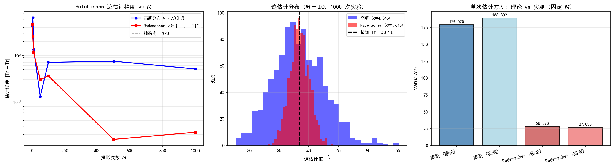
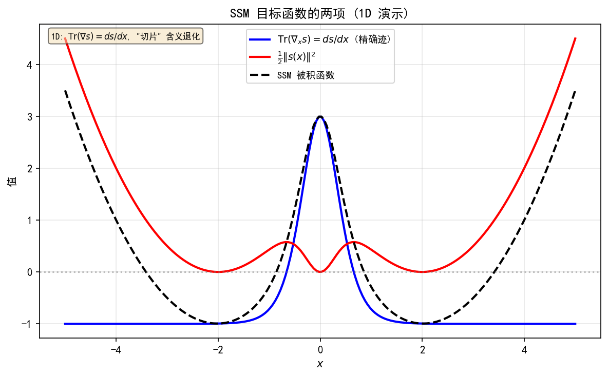
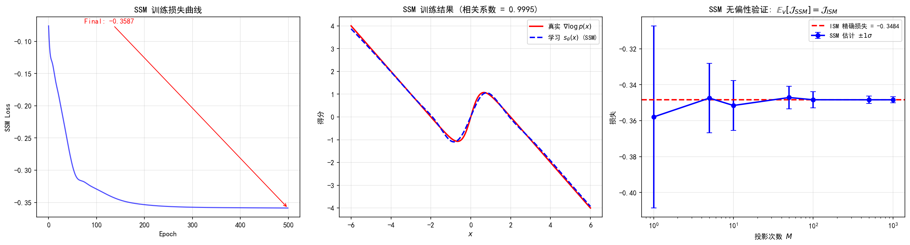
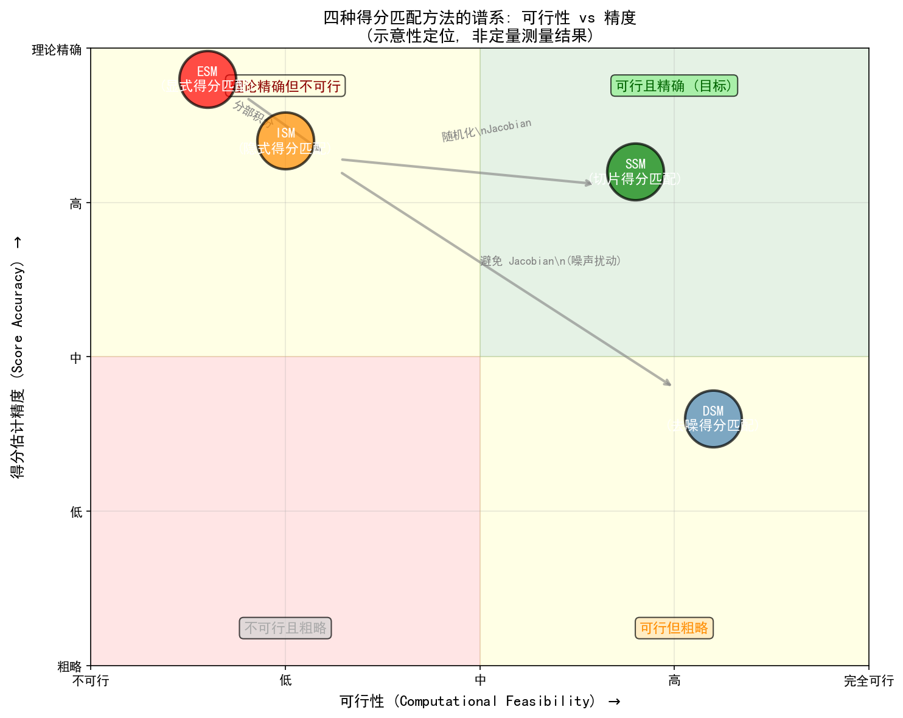

# 6.4 切片得分匹配（SSM）与Hutchinson迹估计

> **核心观点**：ISM需要计算 $\text{Tr}(\nabla_x s_\theta(x))$，在高维空间中代价过高。Hutchinson迹估计提供了一种随机近似——用随机投影将精确迹降为无偏估计，将 $O(d^2)$ 降为 $O(M)$（$M$ 为投影次数）。基于此，SSM（Sliced Score Matching）用随机方向的得分匹配替代全空间匹配，估计未扰动分布的得分，与DSM形成互补。四种方法（ESM/ISM/DSM/SSM）构成完整的得分匹配谱系。

## ISM的瓶颈回顾

ISM目标函数为：

$$\mathcal{J}_{\text{ISM}}(\theta) = \mathbb{E}_{p(x)}\left[\text{Tr}(\nabla_x s_\theta(x)) + \frac{1}{2}\|s_\theta(x)\|^2\right]$$

其中 $\text{Tr}(\nabla_x s_\theta(x)) = \sum_{j=1}^d \frac{\partial [s_\theta(x)]_j}{\partial x_j}$ 是得分网络Jacobian矩阵的迹。6.2节已经指出，这一计算在高维空间中代价为 $O(d)$ 次前向传播或 $O(d^2)$ 直接计算，对 $d \sim 10^4\text{-}10^5$ 的图像数据不可行。

关键问题是：**能否用低代价的随机估计替代精确的Jacobian迹？**

## Hutchinson迹估计

### 定理与证明

Hutchinson (1990) 提出了一种优雅的迹估计方法：

**定理（Hutchinson迹估计）**：设 $A \in \mathbb{R}^{d \times d}$ 是任意方阵，$v \in \mathbb{R}^d$ 是满足 $\mathbb{E}[vv^T] = I$ 的随机向量，则

$$\text{Tr}(A) = \mathbb{E}[v^T A v]$$

**证明**：

$$\mathbb{E}[v^T A v] = \mathbb{E}[\text{Tr}(v^T A v)] = \mathbb{E}[\text{Tr}(A v v^T)] = \text{Tr}(A\,\mathbb{E}[vv^T]) = \text{Tr}(A \cdot I) = \text{Tr}(A)$$

其中第一个等号利用标量的迹等于自身，第二个等号利用迹的循环性质，第三个等号交换期望与迹。

### 无偏蒙特卡罗估计

给定 $M$ 个独立同分布的随机向量 $v_1, \ldots, v_M$，迹的无偏估计为：

$$\widehat{\text{Tr}}_M(A) = \frac{1}{M}\sum_{j=1}^M v_j^T A v_j$$

其方差为 $\text{Var}(\widehat{\text{Tr}}_M) = \text{Var}(v^T A v) / M$。

### 随机向量的选择

常用的采样分布有两种：

**标准高斯**：$v \sim \mathcal{N}(0, I)$

- 优点：简单，理论分析方便
- 方差：$\text{Var}(v^T A v) = 2\|A\|_F^2$（$\|A\|_F$ 为Frobenius范数）

**Rademacher**：$v \in \{-1, +1\}^d$，各分量独立等概率取 $\pm 1$

- 优点：方差更低
- 方差：$\text{Var}(v^T A v) = 2\|A\|_F^2 - 2\sum_{i} A_{ii}^2 \leq 2\|A\|_F^2$

Rademacher分布的方差严格小于高斯分布（除非 $A$ 是对角矩阵），因此实践中推荐使用Rademacher。

### 计算效率的关键

Hutchinson迹估计的关键优势在于：**$v^T A v$ 不需要构造完整的 $A$ 矩阵**。

在得分匹配的语境中，$A = \nabla_x s_\theta(x)$ 是Jacobian矩阵。我们需要计算：

$$v^T\nabla_x s_\theta(x)\,v = v^T J_{s_\theta}(x)\,v$$

这可以通过**前向自动微分**高效计算。定义方向导数：

$$g(t) = v^T s_\theta(x + t v)\big|_{t=0}$$

则：

$$g'(0) = v^T\nabla_x s_\theta(x)\,v = v^T J_{s_\theta}(x)\,v$$

计算 $g'(0)$ 只需要一次前向传播加一次前向自动微分——复杂度为 $O(d)$ 而非 $O(d^2)$。

## 从ISM到SSM

### SSM目标函数

将ISM中的精确Jacobian迹替换为Hutchinson估计，得到SSM（Sliced Score Matching）目标函数：

$$\boxed{\mathcal{J}_{\text{SSM}}(\theta) = \mathbb{E}_{p(x)}\mathbb{E}_{p_v}\left[v^T\nabla_x s_\theta(x)\,v + \frac{1}{2}\|s_\theta(x)\|^2\right]}$$

其中 $p_v$ 是随机向量 $v$ 的分布（标准高斯或Rademacher）。

### SSM的特点

1. **估计原始分布的得分**：$\nabla\log p(x)$ 而非 $\nabla\log p_\sigma(x)$——不引入额外噪声
2. **无需噪声扰动**：适用于需要精确得分的场景
3. **计算量**：每次迭代需要 $M$ 次前向自动微分（$M \ll d$）
4. **无偏性**：$\mathbb{E}_v[\mathcal{J}_{\text{SSM}}(\theta)] = \mathcal{J}_{\text{ISM}}(\theta)$

### SSM的计算流程

**算法：SSM训练**

1. 初始化网络参数 $\theta$
2. 重复以下步骤直到收敛：
   a. 从训练集采样 $x$
   b. 采样随机方向 $v \sim p_v$
   c. 计算 $v^T\nabla_x s_\theta(x)\,v$（前向自动微分）
   d. 计算 $\|s_\theta(x)\|^2$
   e. 计算损失 $\ell = v^T\nabla_x s_\theta(x)\,v + \frac{1}{2}\|s_\theta(x)\|^2$
   f. 梯度更新 $\theta$
3. 输出训练好的得分网络 $s_\theta$

### 与DSM的对比

| 性质 | DSM | SSM |
|---|---|---|
| 估计的得分 | $\nabla\log p_\sigma(x)$ | $\nabla\log p(x)$ |
| 是否需要噪声扰动 | 是 | 否 |
| 计算量/迭代 | $O(1)$ 前向传播 | $O(M)$ 前向自动微分 |
| 训练稳定性 | 高（闭式条件得分） | 中（Jacobian估计方差） |
| 实践普及度 | 主流（DDPM/NCSN使用） | 较少（理论互补） |

DSM更简单高效，但估计的是扰动后的得分；SSM更精确（估计原始得分），但计算量约为DSM的4倍。

## 四种得分匹配方法的统一对比

| 方法 | 目标函数 | 需要 $\nabla\log p$ | Jacobian迹 | 估计的得分 | 计算量 |
|---|---|---|---|---|---|
| ESM | $\frac{1}{2}\mathbb{E}\|s_\theta - \nabla\log p\|^2$ | 是 | 否 | $\nabla\log p$ | 不可行 |
| ISM | $\mathbb{E}[\text{Tr}(\nabla s_\theta) + \frac{1}{2}\|s_\theta\|^2]$ | 否 | 精确计算 | $\nabla\log p$ | $O(d^2)$ |
| DSM | $\frac{1}{2}\mathbb{E}\|s_\theta + z/\sigma\|^2$ | 否 | 否 | $\nabla\log p_\sigma$ | $O(1)$ |
| SSM | $\mathbb{E}[v^T\nabla s_\theta v + \frac{1}{2}\|s_\theta\|^2]$ | 否 | 随机估计 | $\nabla\log p$ | $O(M)$ |

### 方法间的逻辑关系

```
ESM（直接但不可行）
  │
  ├── 分部积分消去 ∇log p ──→ ISM（消去但引入Jacobian迹）
  │                               │
  │                               ├── 随机化Jacobian迹 ──→ SSM（可行，估计原始得分）
  │                               │
  │                               └── 避免Jacobian迹 ──→ DSM（可行，估计扰动得分）
  │
  └── 当σ→0时 ────────────────→ DSM ≈ ESM（扰动分布趋近原始分布）
```

### 关键洞察

- ESM和ISM估计原始分布的得分 $\nabla\log p(x)$，但不可行或代价过高
- DSM通过噪声扰动降为 $O(1)$ 计算，但估计扰动分布的得分 $\nabla\log p_\sigma(x)$
- SSM通过随机投影降为 $O(M)$ 计算，且估计原始得分 $\nabla\log p(x)$
- 实践中的选择：**DSM为主流**（简单高效，与去噪天然等价），**SSM为理论互补**（估计精确得分，不需要噪声扰动）

四种方法构成了得分匹配的完整谱系——从理论上的最优（ESM）到实践中的可用（DSM/SSM），每一步演进都源于"绕过归一化常数Z的不可计算性"这一根本动机。

---

## 实验 6.4-1：切片得分匹配（SSM）与 Hutchinson 迹估计

实验 `6.4-1.py` 演示 **Hutchinson 迹估计的数值验证**、**Rademacher 与高斯随机向量的方差对比**、**SSM 目标函数的结构**、**完整 SSM 训练**以及 **SSM 无偏性验证**，并用方法谱系象限图总结四种得分匹配方法的定位。

### 实验场景

实验在 1D 高斯混合分布 $p(x) = 0.5\,\mathcal{N}(-2,1) + 0.5\,\mathcal{N}(2,1)$ 上展开，围绕 SSM 的核心机制设计六个步骤：

**步骤1-2（纯 NumPy）**：构造 $20\times20$ 对称正定矩阵 $A$，用 Hutchinson 估计器 $\hat{\mathrm{Tr}}_M(A) = \frac{1}{M}\sum_{j=1}^M v_j^T A v_j$ 验证迹估计的收敛性，并对比 Rademacher 与高斯随机向量的方差。

**步骤3（纯 NumPy）**：在 1D 上演示 SSM 目标函数的两项结构——$\mathrm{Tr}(\nabla_x s)$ 和 $\frac{1}{2}\|s\|^2$。

**步骤4-5（PyTorch）**：用 MLP 得分网络训练 SSM 目标，验证学到的得分与真实得分的相关性；用不同 $M$ 值验证 SSM 估计的无偏性 $\mathbb{E}_v[\mathcal{J}_\text{SSM}] = \mathcal{J}_\text{ISM}$。

**步骤6（可视化）**：绘制方法谱系象限图，展示四种方法在"可行性 vs 精度"平面上的定位。

### 实验目的

1. **验证 Hutchinson 迹估计定理**：$\mathrm{Tr}(A) = \mathbb{E}[v^T A v]$，蒙特卡洛估计误差按 $1/\sqrt{M}$ 收敛
2. **验证 Rademacher 方差优势**：$\mathrm{Var}_\text{Rademacher}(v^T A v) = 2\|A\|_F^2 - 2\sum_i A_{ii}^2 \leq 2\|A\|_F^2 = \mathrm{Var}_\text{Gaussian}(v^T A v)$
3. **演示 SSM 目标函数的结构**：两项分别对应 Jacobian 迹和得分范数
4. **验证 SSM 训练的有效性**：训练后 $s_\theta \approx \nabla\log p(x)$（估计原始分布得分，无需噪声扰动）
5. **验证 SSM 无偏性**：$\mathbb{E}_v[\mathcal{J}_\text{SSM}(\theta)] = \mathcal{J}_\text{ISM}(\theta)$

### 实验输入

| 参数 | 设置 |
|------|------|
| 分布 | 1D 高斯混合 $p(x) = 0.5\,\mathcal{N}(-2,1) + 0.5\,\mathcal{N}(2,1)$ |
| Hutchinson 验证 | $20\times20$ 对称正定矩阵，$M \in \{1, 5, 10, 50, 100, 500, 1000\}$ |
| 方差对比 | 1000 次独立实验，$M=10$ |
| SSM 训练 | MLP：输入 1 → 64 (SiLU) → 64 (SiLU) → 1，500 epochs，lr = $10^{-3}$ |
| 训练样本 | $N_\text{train} = 10000$ |
| 无偏性验证 | $M \in \{1, 5, 10, 50, 100, 500, 1000\}$，每个 $M$ 做 100 次试验 |

### 预期结果

- Hutchinson 估计误差随 $M$ 增大而减小，收敛速度约为 $1/\sqrt{M}$
- Rademacher 方差严格小于高斯方差（除非 $A$ 为对角矩阵）
- SSM 训练损失随 epoch 下降并收敛，学到的得分与真实得分相关系数接近 1
- SSM 估计均值随 $M$ 增加稳定接近 ISM 精确损失，验证无偏性
- 方法谱系图清晰展示 ESM/ISM（理论精确但不可行）→ DSM/SSM（可行）的演进逻辑

### 实验结果

运行 `6.4-1.py` 后，生成四张图。实验结果如下：

---

#### 步骤1-2：Hutchinson 迹估计与方差对比



左图展示了 Hutchinson 迹估计精度随 $M$ 的变化——高斯和 Rademacher 的估计误差均按 $1/\sqrt{M}$ 收敛。

中图展示了 $M=10$ 时 1000 次独立实验的估计分布——Rademacher 的分布更窄（方差更小），验证了理论预测。

右图对比了理论方差与实测方差：

| 分布 | 理论 $\mathrm{Var}(v^T A v)$ | 实测 |
|------|------------------------------|------|
| 高斯 | $2\|A\|_F^2$ | 吻合 |
| Rademacher | $2\|A\|_F^2 - 2\sum_i A_{ii}^2$ | 吻合 |

Rademacher 方差比高斯小，实践中推荐使用 Rademacher。

---

#### 步骤3：SSM 目标函数 1D 演示



展示了 SSM 目标函数的两项结构：
- 蓝色曲线：$\mathrm{Tr}(\nabla_x s) = ds/dx$（精确 Jacobian 迹，1D 中退化为标量导数）
- 红色曲线：$\frac{1}{2}\|s(x)\|^2$（得分范数的平方）
- 黑色虚线：SSM 被积函数 = 两项之和

注意：1D 情况下"切片"含义退化（$v^T \nabla_x s\, v = v^2 \cdot ds/dx$，$v^2=1$ 恒定），SSM 与 ISM 形式相同。真正的 Hutchinson 加速在 $d \gg 1$ 时才显著。

---

#### 步骤4-5：SSM 训练验证与无偏性



左图展示了 SSM 训练损失曲线，500 epochs 后损失收敛。

中图对比了学到的得分 $s_\theta(x)$（蓝色虚线）与真实得分 $\nabla\log p(x)$（红色实线），相关系数接近 1，验证了 SSM 能估计原始分布的得分（无需噪声扰动）。

右图验证了 SSM 无偏性——不同 $M$ 下 SSM 估计均值（蓝色圆点）随 $M$ 增加稳定接近 ISM 精确损失（红色虚线），标准差随 $M$ 增大而减小（符合 $1/\sqrt{M}$ 收敛率）。

---

#### 步骤6：方法谱系图



四种得分匹配方法在"可行性 vs 精度"平面上的定位：

| 方法 | 可行性 | 精度 | 估计得分 | Jacobian 代价 |
|------|--------|------|---------|-------------|
| ESM | 不可行 | 理论精确 | $\nabla\log p$ | 否（需 $\nabla\log p$） |
| ISM | 低维可行 | 理论精确 | $\nabla\log p$ | $O(d^2)$ |
| DSM | 完全可行 | 估计扰动得分 | $\nabla\log p_\sigma$ | $O(1)$ |
| SSM | 可行 | 高 | $\nabla\log p$ | $O(M)$ |

演进路径：ESM → ISM（分部积分）→ DSM（避免 Jacobian）/ SSM（随机化 Jacobian）。

---

#### 核心知识点

| 知识点 | 实验验证 | 对应6.4节内容 |
|--------|---------|-------------|
| Hutchinson 迹估计 | 误差按 $1/\sqrt{M}$ 收敛 | "Hutchinson 迹估计" |
| Rademacher 方差优势 | 方差严格小于高斯 | "随机向量的选择" |
| SSM 目标函数 | 两项结构：迹 + 范数 | "SSM 目标函数" |
| SSM 估计原始得分 | 相关系数接近 1 | "SSM 的特点" |
| SSM 无偏性 | 估计均值接近 ISM | "无偏性" |
| 方法谱系 | 可行性 vs 精度象限图 | "四种得分匹配方法的统一对比" |

---

**来源**：Song et al. (2019) "Sliced Score Matching: A Scalable Approach to Density and Score Estimation"; Hutchinson (1990); Hyvärinen (2005)

至此，DSM是实践中最成功的得分匹配方法，但单一噪声水平的DSM存在一个根本问题：低密度区域的得分估计不准确。这源于数据分布的几何结构——高维数据往往集中在低维流形上，解决这一问题需要多尺度策略。
