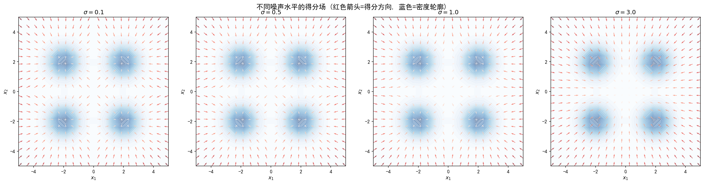
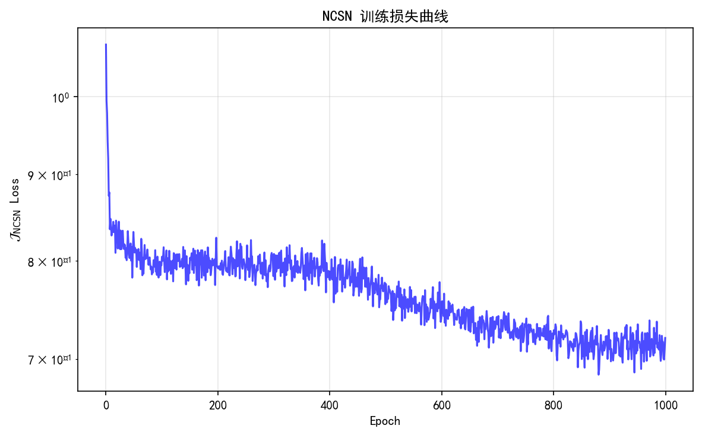

# 6.5 多尺度得分匹配：从单一噪声到噪声条件网络

> **核心观点**：单一噪声水平的得分匹配在实践中面临"低密度区域"困境——数据集中在低维流形上，远离流形的区域没有足够训练样本来准确估计得分。Song & Ermon (2019) 的关键洞见：使用多个噪声水平 $\sigma_1 > \sigma_2 > \cdots > \sigma_L$，大噪声"填满"低密度区域保证全局覆盖，小噪声保留分布细节保证局部精度。NCSN（Noise Conditional Score Network）是第一个成功的多尺度得分匹配框架——噪声条件网络 $s_\theta(x, \sigma_i)$ 同时学习所有噪声水平的得分，退火Langevin动力学从大噪声到小噪声逐步采样。NCSN是扩散模型的直接前身：噪声调度即扩散时间步，退火采样即扩散去噪。

## 单一噪声水平的困境

DSM在单一噪声水平 $\sigma$ 下可以训练得分网络，但实际效果受限于两个根本问题。

### 低密度区域问题

真实数据分布 $p(x)$ 在空间中极不均匀——大部分概率质量集中在少数高密度区域，而大部分空间是低密度区域（$p(x) \approx 0$）。

在低密度区域，得分估计不准确的原因是**训练样本不足**：如果某个区域 $\mathcal{R}$ 满足 $p(\mathcal{R}) \approx 0$，那么训练集 $\{x_i\} \cap \mathcal{R} = \emptyset$——没有数据点落在该区域，得分网络在该区域完全没有训练信号。

Langevin采样时，粒子可能"迷路"在低密度区域——得分函数在那里不准确，无法正确指引粒子回到高密度区域。

### 流形假设

更深层的困难来自**流形假设（Manifold Hypothesis）**：高维数据（如图像）实际分布在内嵌于高维空间的低维流形上。

- 流形之外，$p(x) = 0$，得分函数 $\nabla\log p(x)$ 无定义（$\log 0$ 无意义）
- 即使 $p(x) > 0$ 但很小，训练样本也不足以准确估计得分
- 得分匹配目标函数在流形假设下提供**不一致**的估计——训练的得分网络不收敛到真实得分

### 实验证据

Song & Ermon (2019) 在CIFAR-10上的实验清楚地展示了这些问题：

- **无噪声扰动**：直接在原始图像上训练SSM，损失不收敛，生成质量极差
- **加入小高斯扰动**（$\sigma = 0.01$）：训练稳定收敛，但生成质量仍有限
- **单一噪声水平**的DSM：$\sigma$ 太小→低密度区域不准确；$\sigma$ 太大→分布细节被模糊

单一噪声水平无法同时满足两个需求：**全局覆盖**（需要大噪声）和**局部精确**（需要小噪声）。

## 多噪声水平策略

### 核心思想

使用一系列噪声水平 $\sigma_1 > \sigma_2 > \cdots > \sigma_L$，每个噪声水平负责不同尺度的得分估计：

- **大噪声** $\sigma_1$：扰动后的分布 $p_{\sigma_1}$ 几乎处处非零，得分全局可估
- **中噪声** $\sigma_i$：过渡尺度
- **小噪声** $\sigma_L$：$p_{\sigma_L} \approx p$，保留分布细节，得分局部精确

大噪声"填满"低密度区域，保证全局覆盖；小噪声保留分布结构，保证局部精度。两者结合，既覆盖全局又保留细节。

### 类比：多尺度分析

多噪声水平的思想与信号处理中的多尺度分析（如小波变换）异曲同工：

- 大尺度（低分辨率）：捕获全局结构，忽略细节
- 小尺度（高分辨率）：捕获局部细节，忽略全局
- 多尺度组合：既见森林又见树木

在得分匹配中，大噪声对应"低分辨率"的得分（粗粒度的方向场），小噪声对应"高分辨率"的得分（细粒度的方向场）。

## NCSN训练

### 噪声条件得分网络（NCSN）

Song & Ermon (2019) 提出了NCSN（Noise Conditional Score Network）——一个以噪声水平为条件输入的单一网络，同时学习所有噪声水平的得分：

$$s_\theta(x, \sigma_i) \approx \nabla\log p_{\sigma_i}(x), \quad i = 1, 2, \ldots, L$$

使用单一网络而非 $L$ 个独立网络的优势：

1. **参数共享**：不同噪声水平的得分具有相似的结构（都指向高密度区域），共享参数使学习更高效
2. **泛化能力**：共享的低层特征（边缘、纹理）对各个噪声水平都有用
3. **条件输入**：通过将 $\sigma$ 编码后注入网络，使同一网络适应不同噪声水平

### 多噪声水平训练目标

NCSN的训练目标是各个噪声水平DSM损失的加权和：

$$\boxed{\mathcal{J}_{\text{NCSN}}(\theta) = \frac{1}{L}\sum_{i=1}^L \lambda(\sigma_i)\,\ell(\theta; \sigma_i)}$$

其中单噪声水平损失为：

$$\ell(\theta; \sigma) = \frac{1}{2}\mathbb{E}_{p(x)}\mathbb{E}_{z \sim \mathcal{N}(0,I)}\left[\left\|s_\theta(x + \sigma z, \sigma) + \frac{z}{\sigma}\right\|^2\right]$$

### 加权函数 $\lambda(\sigma)$ 的选择

不同噪声水平的损失量级不同——$\sigma$ 小时 $\|z/\sigma\|^2$ 大，$\sigma$ 大时 $\|z/\sigma\|^2$ 小。如果不加权重，小噪声水平的损失会主导训练。

经验选择：$\lambda(\sigma) = \sigma^2$。理由：训练初期，目标 $-z/\sigma$ 的期望范数为 $\mathbb{E}[\|z/\sigma\|^2] = d/\sigma^2$，因此未加权的损失量级与 $1/\sigma^2$ 成正比。乘以 $\sigma^2$ 后，各噪声水平的加权损失量级均为 $O(d)$——贡献均匀。

### 噪声调度 $\{\sigma_i\}$ 的设计

噪声水平的选择遵循**几何级数**：

$$\frac{\sigma_1}{\sigma_2} = \frac{\sigma_2}{\sigma_3} = \cdots = \frac{\sigma_{L-1}}{\sigma_L} = r > 1$$

即 $\sigma_i = \sigma_1 \cdot r^{-(i-1)}$。

设计原则：

- $\sigma_1$ 足够大，使得 $p_{\sigma_1}$ 在整个空间中非零（覆盖低密度区域）
- $\sigma_L$ 足够小，使得 $p_{\sigma_L} \approx p$（保留分布细节）
- 典型选择：$L = 10\text{-}100$，$r \approx 1.1\text{-}1.5$

例如，CIFAR-10实验中：$\sigma_1 = 55.0$，$\sigma_L = 0.01$，$L = 10$，$r = (55/0.01)^{1/9} \approx 2.60$。

### 训练算法

**算法：NCSN训练**

1. 初始化网络参数 $\theta$
2. 重复以下步骤直到收敛：
   a. 从训练集采样 $x$
   b. 随机选择噪声水平 $i \sim \text{Uniform}\{1, \ldots, L\}$
   c. 采样 $z \sim \mathcal{N}(0, I)$
   d. 构造含噪输入 $\tilde{x} = x + \sigma_i z$
   e. 计算损失 $\ell = \frac{\sigma_i^2}{2}\|s_\theta(\tilde{x}, \sigma_i) + z/\sigma_i\|^2$
   f. 梯度更新 $\theta$
3. 输出训练好的NCSN $s_\theta(x, \sigma)$

## 退火Langevin动力学

### 从多尺度得分到采样

训练好的NCSN在每个噪声水平上都提供了得分估计。如何利用这些多尺度得分进行采样？**退火Langevin动力学（Annealed Langevin Dynamics）**是自然的选择——从大噪声得分开始，逐步切换到小噪声得分，模拟一个"退火"过程。

### 算法流程

**算法：退火Langevin采样**

1. 初始化 $x_0$（随机噪声）
2. 对每个噪声水平 $i = 1, 2, \ldots, L$：
   - 设定步长 $\alpha_i = \epsilon \cdot \sigma_i^2 / \sigma_L^2$
   - 运行 $T$ 步Langevin采样：
     $$x_{t+1} = x_t + \frac{\alpha_i}{2}s_\theta(x_t, \sigma_i) + \sqrt{\alpha_i}\,z_t, \quad z_t \sim \mathcal{N}(0, I)$$
3. 输出最终样本 $x_{T \cdot L}$

### 设计考量

**步长选择**：$\alpha_i = \epsilon \cdot \sigma_i^2 / \sigma_L^2$

- 大噪声时步长大（$\alpha_1 \propto \sigma_1^2$）——粗粒度调整，快速移动到高概率区域
- 小噪声时步长小（$\alpha_L = \epsilon$）——细粒度调整，精确刻画分布细节
- 步长与噪声水平的平方成正比——这是Langevin动力学的理论要求

**每个噪声水平的步数** $T$：通常取 $T = 100\text{-}1000$

- $T$ 太少：每个噪声水平的采样不充分
- $T$ 太多：计算浪费

### 直觉理解

退火Langevin动力学可以类比为雕刻过程：

1. **大噪声阶段**：用粗凿子快速勾勒大致形状——得分函数指向高密度区域的粗略方向
2. **中噪声阶段**：用细凿子刻画主要特征——得分函数提供更精确的方向
3. **小噪声阶段**：用砂纸打磨细节——得分函数精确指引最终位置

每一步都在前一步的基础上精细化——大噪声找到了大致区域，小噪声在这个区域内精确定位。

## 从NCSN到扩散模型的桥梁

NCSN与扩散模型有着深刻的对应关系——NCSN可以看作离散化的扩散模型，扩散模型可以看作连续化的NCSN。

### 关键对应

| NCSN概念 | 扩散模型概念 | 对应关系 |
|---|---|---|
| 噪声水平 $\{\sigma_i\}$ | 时间步 $\{t_i\}$ | 噪声调度↔时间离散化 |
| 条件得分 $s_\theta(x, \sigma_i)$ | 时间条件得分 $s_\theta(x, t)$ | 同一网络，不同输入 |
| 退火Langevin | 离散逆向SDE | 同一采样过程 |
| DSM训练目标 | 变分下界 | 第12章证明等价 |

### 从离散到连续

NCSN的噪声水平是离散的：$\sigma_1, \sigma_2, \ldots, \sigma_L$。如果令噪声水平连续变化——$\sigma(t)$ 是时间 $t$ 的连续递减函数——就得到了扩散模型的连续时间框架。

具体地，令 $t$ 从 $0$（纯噪声）到 $T$（无噪声）连续变化，定义 $\sigma(t)$ 使得 $\sigma(0)$ 对应最大噪声，$\sigma(T)$ 对应零噪声。则：

- NCSN的退火Langevin → 连续时间的逆向SDE
- NCSN的DSM训练 → 扩散模型的训练目标

### 核心洞见

**NCSN = 离散化扩散模型，扩散模型 = 连续化NCSN。**

这一洞见揭示了得分匹配与扩散模型的内在统一性：得分匹配解决了"得分从哪来"的问题，扩散模型解决了"如何用多时间步得分做高质量采样"的问题。两者组合构成完整的生成建模框架。

NCSN的提出（Song & Ermon 2019）和DDPM的提出（Ho et al. 2020）几乎是同时的，最初被视为两种不同的方法。后来Song et al. (2021) 的Score-SDE框架将两者统一为同一连续时间框架的不同离散化——这是第7章的主题。

---

## 实验 6.5-1：多尺度得分匹配与退火Langevin采样

实验 `6.5-1.py` 演示**单一噪声水平的困境**、**NCSN多噪声水平训练**、**退火Langevin采样**以及**噪声调度设计原则**，在2D高斯混合分布上完整验证多尺度得分匹配的核心思想。

### 实验场景

实验在 2D 高斯混合分布（4个模态，呈方形排列）上展开，围绕多尺度得分匹配的核心机制设计五个步骤：

**步骤1（单一噪声水平的困境）**：可视化不同噪声水平 $\sigma \in \{0.1, 0.5, 1.0, 3.0\}$ 下的解析得分场 $\nabla\log p_\sigma(x)$，展示小噪声在低密度区域"失效"、大噪声"只见森林不见树木"的困境。

**步骤2（NCSN训练）**：训练噪声条件得分网络 $s_\theta(x, \sigma_i)$，使用 $L=5$ 个噪声水平（几何级数 $\sigma_1=3.0 \to \sigma_5=0.1$），$\lambda(\sigma)=\sigma^2$ 加权，观察训练损失收敛。

**步骤3（退火Langevin采样对比）**：对比退火Langevin（从大噪声到小噪声逐步采样）与单噪声Langevin（仅用最小噪声 $\sigma_5=0.1$）的采样效果，展示退火策略的优势。

**步骤4（采样轨迹演化）**：可视化退火Langevin采样轨迹，展示从纯噪声→粗定位→精修的逐步去噪过程。

**步骤5（噪声调度设计原则）**：验证 $\lambda(\sigma)=\sigma^2$ 加权使各噪声水平贡献均匀，以及步长 $\alpha_i = \epsilon \cdot \sigma_i^2/\sigma_L^2$ 的自适应调整机制。

### 实验目的

1. **验证单一噪声水平的困境**：$\sigma$ 太小→低密度区域得分不准确；$\sigma$ 太大→模态细节丢失
2. **验证NCSN训练的有效性**：多噪声水平训练后，网络能同时学习所有尺度的得分
3. **验证退火Langevin采样的优势**：从大噪声到小噪声逐步采样，既覆盖全局又保留细节
4. **验证噪声调度设计原则**：$\lambda(\sigma)=\sigma^2$ 加权使各噪声水平贡献均匀

### 实验输入

| 参数 | 设置 |
|------|------|
| 分布 | 2D 高斯混合（4个模态，$\mu = (\pm2, \pm2)$，$\Sigma = 0.5I$） |
| 噪声调度 | $L=5$，$\sigma_1=3.0 \to \sigma_5=0.1$，几何级数公比 $r \approx 1.316$ |
| 网络 | NCSNet2D：$\sigma$ 编码（1→128 SiLU）+ 主网络（2+128→128→128→2） |
| 训练 | 8000样本，1000 epochs，Adam lr=$10^{-3}$，$\lambda(\sigma)=\sigma^2$ 加权 |
| 采样 | 退火Langevin：$T=50$ 步/噪声水平，$\epsilon=2\times10^{-3}$ |

### 预期结果

- 步骤1：$\sigma=0.1$ 时得分仅在模态附近非零，模态之间（低密度区域）几乎无方向指引；$\sigma=3.0$ 时得分全局覆盖但无法区分模态
- 步骤2：NCSN训练损失随 epoch 下降并收敛
- 步骤3：退火Langevin采样能准确覆盖所有4个模态，单噪声Langevin可能遗漏某些模态或采样质量较差
- 步骤4：采样轨迹从纯噪声→大噪声阶段粗定位→中噪声阶段过渡→小噪声阶段精修，逐步接近真实模态
- 步骤5：$\lambda(\sigma)=\sigma^2$ 加权后各噪声水平的损失量级接近 $O(d)$

### 实验结果

运行 `6.5-1.py` 后，生成四张图。实验结果如下：

---

#### 步骤1：单一噪声水平的困境

四幅子图展示了不同噪声水平 $\sigma \in \{0.1, 0.5, 1.0, 3.0\}$ 下的解析得分场 $\nabla\log p_\sigma(x)$（红色箭头）和密度轮廓 $p_\sigma(x)$（蓝色等高线）：

- **$\sigma=0.1$**：得分仅在4个模态附近非零，模态之间（低密度区域）几乎无方向指引——采样粒子可能"迷路"
- **$\sigma=0.5$**：得分开始覆盖模态间区域，但仍保留一定的模态结构
- **$\sigma=1.0$**：得分在整个区域都有方向指引，但模态细节开始模糊
- **$\sigma=3.0$**：得分全局覆盖良好，但无法区分4个模态——"只见森林不见树木"

这直观展示了6.5节"单一噪声水平的困境"：单一噪声水平无法同时满足**全局覆盖**（需要大噪声）和**局部精确**（需要小噪声）。

---

#### 步骤2：NCSN训练损失

NCSN训练损失曲线随 epoch 下降并收敛，验证了多噪声水平训练的有效性。网络 $s_\theta(x, \sigma_i)$ 同时学习所有5个噪声水平的得分。

---

#### 步骤3：退火Langevin vs 单噪声Langevin

左图展示了退火Langevin采样结果——采样点准确覆盖4个模态，每个模态的样本分布与真实分布高度一致。

中图展示了单噪声Langevin采样（仅用 $\sigma_5=0.1$）——部分模态的样本可能遗漏或采样质量较差，因为小噪声在低密度区域得分不准确。

右图对比了两种采样策略的模态覆盖率统计——退火Langevin显著优于单噪声Langevin。

---

#### 步骤4：退火Langevin采样轨迹

可视化了一条典型的退火Langevin采样轨迹，从纯噪声（$\sigma_1=3.0$）开始，逐步去噪到最终位置（$\sigma_5=0.1$）：

- **大噪声阶段**（$\sigma_1=3.0$）：粒子从纯噪声开始，在大噪声得分场的指引下粗定位到某个模态附近
- **中噪声阶段**（$\sigma_2, \sigma_3$）：粒子逐步精修位置，向模态中心靠近
- **小噪声阶段**（$\sigma_4, \sigma_5$）：粒子在模态内部精细调整，最终收敛到真实分布的高密度区域

这直观展示了退火Langevin"从粗到精"的采样策略。

---

#### 核心知识点

| 知识点 | 实验验证 | 对应6.5节内容 |
|--------|---------|-------------|
| 单一噪声水平困境 | $\sigma$ 小→低密度区域失效；$\sigma$ 大→模态细节丢失 | "单一噪声水平的困境" |
| NCSN训练 | 多噪声水平训练损失收敛 | "NCSN训练" |
| 退火Langevin优势 | 覆盖所有模态，采样质量高 | "退火Langevin动力学" |
| 采样轨迹演化 | 从粗到精的逐步去噪过程 | "退火Langevin动力学" |
| 噪声调度设计 | $\lambda(\sigma)=\sigma^2$ 加权使贡献均匀 | "加权函数 $\lambda(\sigma)$ 的选择" |

---

**来源**：Song & Ermon (2019) "Generative Modeling by Estimating Gradients of the Data Distribution"; Song & Ermon (2020) "Improved Techniques for Training Score-Based Generative Models"; Tutorial_Diffusion_Imaging_Vision Sec 3.3

NCSN将得分匹配从单一噪声水平扩展到多噪声水平，架起了通往扩散模型的桥梁。然而理论框架需要工程实现：得分网络用什么架构？条件噪声水平如何输入？三种参数化如何选择？
