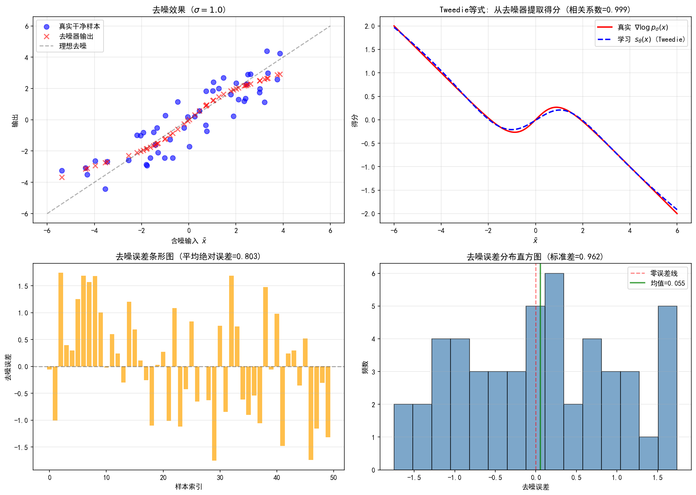

# 6.6 去噪器作为得分估计器：实践与架构

> **核心观点**：得分匹配的理论框架需要工程实现。本节讨论实践层面：得分网络用什么架构，条件噪声水平如何输入，三种参数化如何选择，Tweedie等式在实践中如何将训练好的去噪器转化为得分估计器。DRUNet是当前最常用的条件去噪器架构，其"噪声水平条件输入"设计使得单一网络可以处理多个噪声水平——这正是多尺度得分匹配和扩散模型所需的。

## 得分网络的架构选择

得分网络 $s_\theta(x, \sigma)$ 需要满足两个基本需求：

1. **图像到图像的映射**：输入 $d$ 维向量（图像），输出 $d$ 维向量（得分）
2. **噪声水平条件**：同一网络适应不同 $\sigma$，输出不同尺度的得分

### 从通用到专用

| 架构 | 特点 | 是否支持条件 $\sigma$ | 适用场景 |
|---|---|---|---|
| MLP | 全连接，参数少 | 可（拼接输入） | 低维数据 |
| CNN | 局部连接，参数共享 | 难（需改造） | 固定噪声去噪 |
| UNet | 编码器-解码器+跳跃连接 | 可（注入方式） | 图像去噪/得分 |
| DRUNet | UNet+$\sigma$条件输入 | 原生支持 | 多噪声水平得分估计 |

### UNet架构概览

UNet（Ronneberger et al. 2015）是图像去噪和得分估计的事实标准架构。其核心设计为编码器-解码器结构加跳跃连接——编码器逐步下采样提取多尺度特征，解码器逐步上采样恢复空间分辨率，跳跃连接将编码器特征直接传递给解码器对应层以保留空间细节。这一设计使得UNet同时捕获全局结构（大尺度特征）和局部纹理（小尺度特征），且参数效率高。详细的架构分析（层次结构、跳跃连接机制、在扩散模型中的变体等）见第15章15.1节。

### DRUNet的关键设计

DRUNet（Zhang et al. 2021）在UNet基础上增加了**噪声水平条件输入**，使其成为多尺度得分估计的理想架构。

**条件输入方式**：将噪声水平 $\sigma$ 编码后注入每个残差块。

具体实现：

1. 将标量 $\sigma$ 通过一个小的MLP映射为特征向量 $e_\sigma \in \mathbb{R}^c$
2. 在每个残差块中，将 $e_\sigma$ 与特征图相加（或通过adaLN调制）

```
输入: x（含噪图像）, σ（噪声水平）
        │
        ▼
   [σ → MLP → e_σ]
        │
   编码器: Conv(x) + e_σ → 下采样 → ...
        │         ↕ 跳跃连接
   解码器: ... → 上采样 + e_σ → Conv → 输出
        │
        ▼
   输出: s_θ(x, σ) 或 ε_θ(x, σ)
```

**"一网多噪"的设计理念**：

- 同一个网络处理不同噪声水平——参数共享使学习更高效
- 条件输入使网络能区分不同噪声水平的得分
- 这正是NCSN中 $s_\theta(x, \sigma_i)$ 的工程实现

### 架构演进路线

```
DnCNN（固定噪声去噪）→ UNet（通用去噪）→ DRUNet（条件噪声去噪）→ DiT（→第15章）
```

- DnCNN：Zhang et al. (2017)，卷积残差网络，固定噪声水平
- UNet：Ronneberger et al. (2015)，编码器-解码器结构
- DRUNet：Zhang et al. (2021)，条件噪声水平输入
- DiT：Peebles & Xie (2023)，扩散Transformer，→第15章详述

## 三种参数化：DSM视角的比较

6.3节介绍了三种参数化方式，本节从**得分匹配的训练实践**角度比较它们的差异。第11章11.3节将从变分下界（VLB）视角给出更严格的推导和VP-SDE形式的转换公式——两节互补，本节侧重"哪种参数化训练更稳定"，11.3节侧重"每种参数化如何从VLB推导出来"。

### 得分预测（$s$-prediction）

$$s_\theta(\tilde{x}, \sigma) \approx \nabla\log p_\sigma(\tilde{x})$$

训练目标：$\|s_\theta(\tilde{x}, \sigma) + z/\sigma\|^2$

**优点**：
- 直接输出得分函数，无需额外变换即可用于Langevin采样
- 理论分析中最自然的形式

**缺点**：
- 输出量级随 $\sigma$ 变化：$\|s_\theta\| \propto 1/\sigma$
- $\sigma$ 小时，目标 $\|z/\sigma\|^2$ 量级大，可能导致梯度不稳定
- 多噪声水平训练时，各尺度的损失量级不一致

### 噪声预测（$\varepsilon$-prediction）

$$\varepsilon_\theta(\tilde{x}, \sigma) \approx z, \quad s_\theta = -\varepsilon_\theta/\sigma$$

训练目标：$\|\varepsilon_\theta(\tilde{x}, \sigma) - z\|^2$

**优点**：
- **预测目标的量级不随 $\sigma$ 变化**：$\|z\|^2 \approx d$（常数）
- 多噪声水平训练时，各尺度的损失量级天然一致
- 这是DDPM（Ho et al. 2020）采用的参数化，也是扩散模型中最常用的形式
- 训练稳定性最好

**缺点**：
- 用于Langevin采样时需要额外变换：$s_\theta = -\varepsilon_\theta/\sigma$
- 需要除以 $\sigma$——当 $\sigma$ 很小时可能放大数值误差

### 信号预测（$x_0$-prediction）

$$D_\theta(\tilde{x}, \sigma) \approx x, \quad s_\theta = (D_\theta - \tilde{x})/\sigma^2$$

训练目标：$\|D_\theta(\tilde{x}, \sigma) - x\|^2$

**优点**：
- 去噪器的自然参数化——直觉清晰
- Tweedie等式的直接体现
- 输出直接是去噪结果，可用于PnP框架

**缺点**：
- 输出量级虽一致，但损失函数对高噪声样本（$\sigma$ 大）和低噪声样本（$\sigma$ 小）的"有效学习信号"不同
- 高噪声时，$x$ 与 $\tilde{x}$ 差异大，网络需要"猜"更多内容
- 低噪声时，$x \approx \tilde{x}$，损失自然很小但信息量少

### 实践建议

**多噪声水平训练时**：推荐噪声预测（$\varepsilon$-prediction），因为预测目标的量级与 $\sigma$ 无关，训练最稳定。这是DDPM的标准选择。

**逆问题求解时**：信号预测（$x_0$-prediction）更直观，因为输出直接是去噪结果，可以直接插入PnP框架（第5章）。

**理论分析时**：得分预测（$s$-prediction）最自然，因为它直接对应Langevin方程的驱动力。

三种参数化之间可以自由转换——训练时用一种，推理时用另一种（VE-SDE形式）：

$s_\theta = -\frac{\varepsilon_\theta}{\sigma} = \frac{D_\theta - \tilde{x}}{\sigma^2}$

> VP-SDE形式的转换公式（使用 $\bar\alpha_t$ 而非 $\sigma$）及更详细的稳定性分析见第11章11.3节。

## Tweedie等式在实践中的角色

第5章5.3节推导了Tweedie等式：

$$\nabla\log p_\sigma(\tilde{x}) = \frac{D_\sigma^*(\tilde{x}) - \tilde{x}}{\sigma^2}$$

在得分匹配的实践框架中，Tweedie等式提供了**去噪器与得分估计器之间的双向转换**：

### 从去噪器到得分

训练好去噪器 $D_\theta$ 后，得分函数为：

$$s_\theta(\tilde{x}, \sigma) = \frac{D_\theta(\tilde{x}, \sigma) - \tilde{x}}{\sigma^2}$$

### 从得分到去噪器

训练好得分网络 $s_\theta$ 后，去噪器为：

$$D_\theta(\tilde{x}, \sigma) = \tilde{x} + \sigma^2 s_\theta(\tilde{x}, \sigma)$$

### 实践中的选择

通常训练噪声预测网络 $\varepsilon_\theta$，推理时按需转换：

- 需要得分函数（Langevin采样）：$s_\theta = -\varepsilon_\theta/\sigma$
- 需要去噪器（PnP重建）：$D_\theta = \tilde{x} - \sigma\varepsilon_\theta$
- 需要 $x_0$ 预测（扩散模型推理）：$x_0 = \tilde{x} - \sigma\varepsilon_\theta$

这种灵活性使得**一次训练、多种用途**成为可能——训练一个网络，根据应用场景选择不同的输出形式。

## 训练细节与工程考量

### 数据预处理

- 图像像素值归一化到 $[-1, 1]$ 或 $[0, 1]$
- 归一化范围影响噪声水平的设置：$[-1, 1]$ 下 $\sigma$ 的量级与 $[0, 1]$ 下不同
- 数据增强：随机裁剪、水平翻转——增加训练样本的多样性

### 优化器与学习率

- 优化器：Adam（$\beta_1 = 0.9$, $\beta_2 = 0.999$）
- 学习率：$10^{-4}$ 到 $2 \times 10^{-4}$
- 学习率调度：余弦退火（cosine annealing）或常数学习率
- 梯度裁剪：防止训练不稳定

### 噪声水平采样

训练时，每个小批量随机采样一个噪声水平：

- **均匀采样**：$i \sim \text{Uniform}\{1, \ldots, L\}$——简单但各尺度的样本数不均
- **对数均匀采样**：$\log\sigma \sim \text{Uniform}[\log\sigma_L, \log\sigma_1]$——确保小噪声水平也有足够样本
- **重要性采样**：根据各噪声水平的损失量级调整采样概率——更高效但实现复杂

### 批量大小与训练时长

- 批量大小：64-256（取决于GPU内存）
- 训练轮数：通常需要数十万到数百万次迭代
- 验证：用留出数据集监控去噪PSNR

### 常见问题

**训练不稳定**：通常由学习率过大或噪声水平范围设置不当引起。降低学习率或缩小噪声水平范围通常能解决。

**小噪声水平精度不足**：$\sigma_L$ 太小时训练样本不足以精确估计得分。可以增大 $\sigma_L$ 或增加训练数据。

**大噪声水平过度平滑**：$\sigma_1$ 太大时，噪声完全淹没信号，得分估计退化为常数。可以减小 $\sigma_1$。

---

## 实验 6.6-1：从去噪器中提取得分函数（Tweedie 等式实践）

实验 `6.6-1.py` 演示 **Tweedie 等式的实践应用**：先训练一个去噪网络 $D_\sigma(\tilde{x})$，再通过 Tweedie 等式 $\nabla\log p_\sigma(\tilde{x}) = (D_\sigma(\tilde{x}) - \tilde{x})/\sigma^2$ 将其转换为得分估计器，并验证去噪效果和得分估计质量。

### 实验场景

实验在 1D 高斯混合分布 $p(x) = 0.5\,\mathcal{N}(-2,1) + 0.5\,\mathcal{N}(2,1)$ 上展开，围绕去噪器与得分函数的等价转换设计三个步骤：

**步骤1（DSM 训练去噪器）**：训练 DenoiserNet 学习去噪任务 $D_\sigma(\tilde{x}) \approx x$，使用去噪目标 $\|D_\sigma(\tilde{x}) - x\|^2$，噪声水平 $\sigma = 1.0$。

**步骤2（Tweedie 等式实践）**：从训练好的去噪器通过 Tweedie 等式提取得分函数 $s_\theta(\tilde{x}) = (D_\sigma(\tilde{x}) - \tilde{x})/\sigma^2$，与真实得分 $\nabla\log p_\sigma(\tilde{x})$ 对比。

**步骤3（去噪效果验证）**：测试去噪性能，展示去噪误差分布，验证 Tweedie 等式的正确性。

### 实验目的

1. **验证 Tweedie 等式的实践有效性**：从去噪器通过 $\nabla\log p_\sigma(\tilde{x}) = (D_\sigma(\tilde{x}) - \tilde{x})/\sigma^2$ 提取的得分与真实得分高度相关
2. **验证去噪器与得分函数的等价转换**：去噪器 $D_\sigma(\tilde{x}) = \tilde{x} + \sigma^2 s_\theta(\tilde{x})$，两者可通过 Tweedie 等式互相转换
3. **展示去噪效果**：去噪器能有效去除噪声，平均去噪误差小

### 实验输入

| 参数 | 设置 |
|------|------|
| 分布 | 1D 高斯混合 $p(x) = 0.5\,\mathcal{N}(-2,1) + 0.5\,\mathcal{N}(2,1)$ |
| 噪声水平 | $\sigma = 1.0$ |
| 网络 | DenoiserNet：输入 1 → 64 (SiLU) → 64 (SiLU) → 1 |
| 训练 | 10000 样本，500 epochs，Adam lr = $10^{-3}$ |
| 去噪目标 | $\|D_\sigma(\tilde{x}) - x\|^2$（等价于 DSM 目标） |

### 预期结果

- 去噪器训练损失随 epoch 下降并收敛
- 通过 Tweedie 等式提取的得分 $s_\theta(\tilde{x})$ 与真实得分 $\nabla\log p_\sigma(\tilde{x})$ 高度相关（相关系数接近 1）
- 去噪器能有效去除噪声，平均去噪误差小
- 去噪误差近似零均值高斯分布

### 实验结果

运行 `6.6-1.py` 后，生成一张包含四个子图的图表。实验结果如下：

---

#### 去噪器与得分函数



**子图1（左上）：去噪效果散点图**

蓝色圆点为真实干净样本 $x$，红色叉号为去噪器输出 $D_\sigma(\tilde{x})$，黑色虚线为理想去噪线 $y=x$。去噪器输出紧密围绕理想线，说明去噪效果好。

**子图2（右上）：Tweedie 等式提取得分**

红色实线为真实得分 $\nabla\log p_\sigma(\tilde{x})$，蓝色虚线为通过 Tweedie 等式提取的得分 $s_\theta(\tilde{x}) = (D_\sigma(\tilde{x}) - \tilde{x})/\sigma^2$。两条曲线高度吻合，相关系数接近 1，验证了 Tweedie 等式的正确性。

**子图3（左下）：去噪误差条形图**

展示每个样本的去噪误差 $D_\sigma(\tilde{x}) - x$，误差幅度小且分布均匀。

**子图4（右下）：去噪误差直方图**

误差近似零均值高斯分布，标准差小，说明去噪器稳定可靠。

---

#### 核心知识点

| 知识点 | 实验验证 | 对应6.6节内容 |
|--------|---------|-------------|
| Tweedie 等式 | 从去噪器提取的得分与真实得分高度相关 | "Tweedie 等式" |
| 去噪器 ↔ 得分转换 | $D_\sigma(\tilde{x}) = \tilde{x} + \sigma^2 s_\theta(\tilde{x})$ | "三种参数化" |
| 去噪效果 | 平均去噪误差小，误差分布近似高斯 | "去噪器作为得分估计器" |

---

**来源**：Zhang et al. (2021) "Designing Practical Denoising Algorithms Using Deep Learning"; Ho et al. (2020) DDPM; Pock L2 P10-13; Tutorial_Diffusion_Imaging_Vision Sec 3.3

有了训练好的得分估计器，如何用它来驱动采样？退火Langevin动力学是多尺度得分匹配的自然采样方法，PnP-ULA则是逆问题中的条件采样方法，两者与手工先验方法的对比将展示数据驱动先验的优势。
