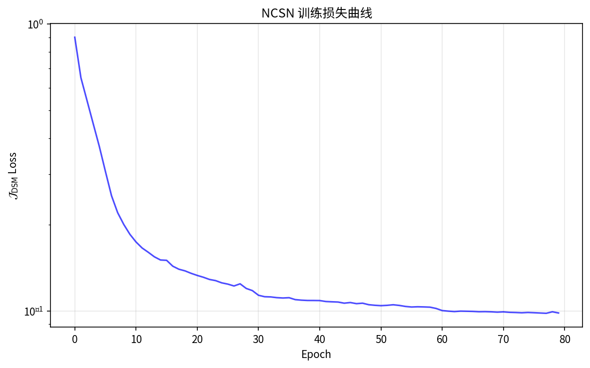
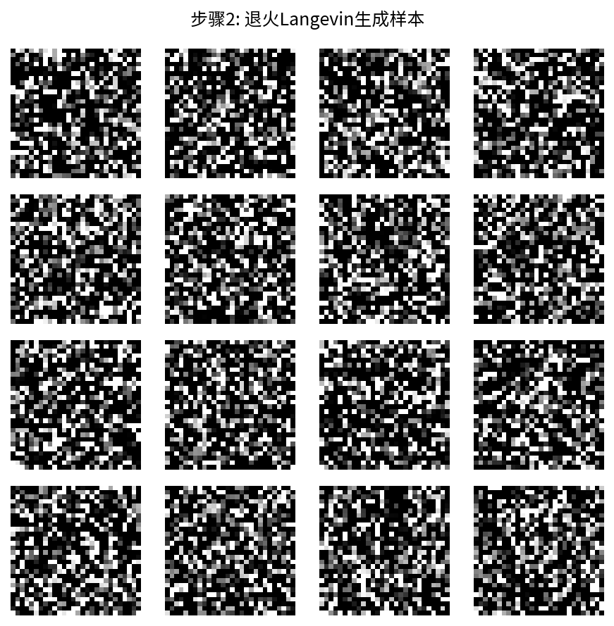
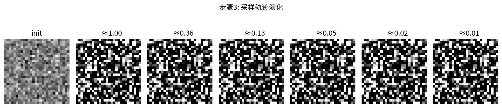
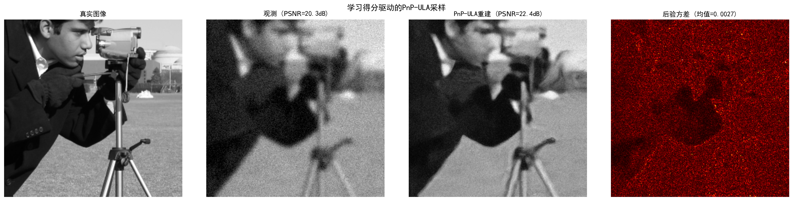
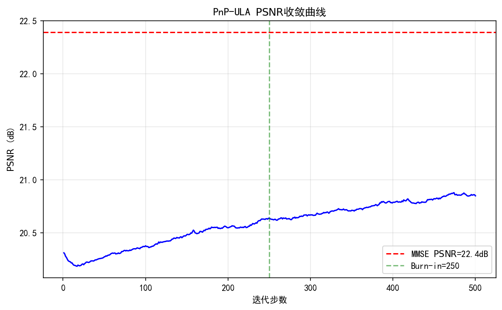

# 6.7 用学习到的得分驱动采样

> **核心观点**：学习到的得分函数可以驱动两类采样：无条件采样（退火Langevin动力学生成图像）和条件采样（PnP-ULA求解逆问题）。实验表明，学习得分驱动的采样在重建质量和不确定性量化方面显著优于手工先验方法。退火Langevin动力学是扩散采样的离散版前身，本章的终点自然指向第7章的扩散模型——多尺度得分匹配+连续时间采样=扩散模型。

## 退火Langevin动力学：从学习得分到图像生成

### 无条件图像生成

训练好的NCSN $s_\theta(x, \sigma)$ 可以通过退火Langevin动力学进行无条件图像生成——从随机噪声开始，逐步去噪，生成逼真的图像。

6.5节已介绍退火Langevin动力学的算法流程。这里我们关注生成效果和实践考量。

### 采样轨迹可视化

退火Langevin的采样过程可以可视化为一连串逐步去噪的图像：

1. **初始化**：$x_0 \sim \mathcal{N}(0, \sigma_1^2 I)$——纯随机噪声
2. **大噪声阶段**（$\sigma_1, \sigma_2$）：图像从纯噪声中出现大致的亮暗结构
3. **中噪声阶段**（$\sigma_3, \ldots, \sigma_6$）：主要形状和纹理逐渐清晰
4. **小噪声阶段**（$\sigma_7, \ldots, \sigma_L$）：细节精细化，最终得到高质量图像

这一过程与DDPM的逐步去噪过程在视觉上几乎相同——两者本质上是同一种方法的离散和连续版本。

### 生成质量评估

生成图像的质量通常用以下指标评估：

- **FID（Fréchet Inception Distance）**：衡量生成分布与真实分布的距离，越低越好
- **IS（Inception Score）**：衡量生成图像的多样性和质量，越高越好
- **视觉检查**：人眼判断生成图像的真实感和多样性

NCSN在CIFAR-10上的FID约为8-10（Song & Ermon 2019），虽然不如后来的DDPM（FID约3-4），但已经证明了多尺度得分匹配的可行性。

### 采样速度

退火Langevin的主要瓶颈是**采样速度**——需要 $L \times T$ 步迭代（$L$ 个噪声水平，每个 $T$ 步）。典型设置下：

- $L = 10$，$T = 100$ → 1000步采样
- 每步需要一次网络前向传播
- 生成一张 $256 \times 256$ 图像约需数秒到数十秒

相比之下，DDPM的采样步数通常为1000步，但可以通过DDIM加速到50-100步（→第7章）。加速采样是扩散模型研究的重要方向。

---

## 实验 6.7-1：SMLD 完整实现——从零训练到图像生成

实验 `6.7-1.py` 演示 **NCSN 在 MNIST 上的完整训练**、**退火 Langevin 无条件采样生成图像**以及**采样轨迹可视化**，是 SMLD（Score Matching with Langevin Dynamics）框架的端到端实践。

### 实验场景

实验在 MNIST 手写数字数据集（$28\times28$ 灰度图）上展开，围绕 SMLD 的完整流程设计三个步骤：

**步骤1（NCSN 训练）**：训练噪声条件得分网络 $s_\theta(x, \sigma_i)$，使用 $L=10$ 个噪声水平（几何级数 $\sigma_{\min}=0.01 \to \sigma_{\max}=1.0$），网络架构为 UNet 风格 CNN + ConditionalBatchNorm2d，DSM 目标 $\sigma^2 \|s_\theta(\tilde{x}, \sigma) + z/\sigma\|^2$，$\lambda(\sigma)=\sigma^2$ 加权。

**步骤2（退火 Langevin 无条件采样）**：从纯噪声 $x \sim \mathcal{N}(0, \sigma_{\max}^2 I)$ 开始，从大噪声到小噪声逐步采样，步长 $\alpha_i = \epsilon \cdot \sigma_i^2/\sigma_{\min}^2$，每个噪声水平 $T=100$ 步 Langevin 动力学。

**步骤3（采样轨迹可视化）**：记录采样过程中关键噪声水平处的图像，展示从纯噪声→大噪声阶段→中噪声阶段→小噪声阶段的逐步去噪过程。

### 实验目的

1. **验证 NCSN 训练的有效性**：在真实图像数据集（MNIST）上训练噪声条件得分网络，观察 DSM 损失收敛
2. **验证退火 Langevin 无条件采样**：从纯噪声生成逼真的 MNIST 风格手写数字图像
3. **可视化采样轨迹**：展示退火 Langevin 从粗到精的逐步去噪过程

### 实验输入

| 参数 | 设置 |
|------|------|
| 数据集 | MNIST（$28\times28$ 灰度图，60000 训练样本） |
| 噪声调度 | $L=10$，$\sigma_{\min}=0.01 \to \sigma_{\max}=1.0$，几何级数 |
| 网络 | NCSN_MNIST：UNet 风格 CNN + ConditionalBatchNorm2d，base_ch=64 |
| 训练 | 200 epochs，Adam lr=$10^{-3}$，StepLR scheduler，batch=128 |
| 采样 | 退火 Langevin：$T=100$ 步/噪声水平，$\epsilon=2\times10^{-5}$，16 个样本 |

### 预期结果

- NCSN 训练损失随 epoch 下降并收敛
- 退火 Langevin 采样生成逼真的 MNIST 风格手写数字图像
- 采样轨迹展示从纯噪声→粗结构→清晰数字的逐步演化过程

### 实验结果

运行 `6.7-1.py` 后，生成三张图。实验结果如下：

---

#### 步骤1：NCSN 训练损失



NCSN 训练损失曲线（对数尺度）随 epoch 下降并收敛，验证了多噪声水平 DSM 训练在真实图像数据集上的有效性。

---

#### 步骤2：退火 Langevin 生成样本



$4\times4$ 网格展示了 16 个退火 Langevin 采样生成的 MNIST 风格手写数字图像。从纯噪声开始，经过 $L=10$ 个噪声水平、每个 $T=100$ 步的逐步去噪，最终生成清晰可辨的手写数字。

---

#### 步骤3：采样轨迹可视化



采样轨迹从纯噪声（init）开始，经过关键噪声水平处的快照，最终收敛到清晰的手写数字图像：

- **大噪声阶段**（$\sigma \approx 1.0$）：图像从纯噪声中出现大致的亮暗结构
- **中噪声阶段**（$\sigma \approx 0.3\text{-}0.1$）：主要形状和纹理逐渐清晰
- **小噪声阶段**（$\sigma \approx 0.01$）：细节精细化，最终得到高质量图像

这一过程与 DDPM 的逐步去噪过程在视觉上几乎相同——两者本质上是同一种方法的离散和连续版本。

---

#### 核心知识点

| 知识点 | 实验验证 | 对应6.7节内容 |
|--------|---------|-------------|
| NCSN 训练 | DSM 损失收敛，ConditionalBatchNorm2d 注入噪声条件 | "无条件图像生成" |
| 退火 Langevin 采样 | 从纯噪声生成逼真 MNIST 数字 | "退火 Langevin 动力学" |
| 采样轨迹 | 从粗到精的逐步去噪过程 | "采样轨迹可视化" |

## PnP-ULA：用学习得分求解逆问题

### 从无条件采样到条件采样

无条件采样生成的图像是随机的（从先验 $p(x)$ 采样），但逆问题求解需要从后验 $p(x|y)$ 采样。第5章5.5节已经建立了PnP-ULA框架——用去噪器通过Tweedie等式提供先验得分。

现在有了通过得分匹配训练的得分估计器 $s_\theta$，PnP-ULA可以直接使用：

$$\boxed{X_{m+1} = X_m - \delta\nabla f(X_m) + \delta\,s_\theta(X_m, \varepsilon) + \sqrt{2\delta}\,Z_{m+1}}$$

其中：
- $f(x) = -\log p(y|x)$ 是负对数似然（数据项）
- $s_\theta(X_m, \varepsilon) \approx \nabla\log p_\varepsilon(X_m)$ 是先验得分（由训练好的得分网络提供）
- $\delta$ 是步长，$Z_{m+1} \sim \mathcal{N}(0, I)$ 是随机噪声

PnP-ULA的三步解读：

1. **似然梯度步**：$-\delta\nabla f(X_m)$——数据一致性，将样本推向与观测 $y$ 一致的方向
2. **先验得分步**：$\delta\,s_\theta(X_m, \varepsilon)$——先验知识，将样本推向"像自然图像"的方向
3. **探索噪声**：$\sqrt{2\delta}\,Z_{m+1}$——随机性，保证收敛到分布而非点

### PnP-ULA的后验采样与不确定性量化

运行PnP-ULA得到样本链 $\{X_m\}_{m=1}^M$，丢弃burn-in期后，可以估计：

- **后验均值**（MMSE重建）：$\hat{x}_{\text{MMSE}} = \frac{1}{M}\sum_{m=1}^M X_m$
- **后验方差**（像素级不确定性）：$\hat{\sigma}^2_j = \frac{1}{M}\sum_{m=1}^M (X_m)_j^2 - (\hat{x}_{\text{MMSE}})_j^2$
- **可信区间**：像素值落在 $[\hat{x}_j - 2\hat{\sigma}_j, \hat{x}_j + 2\hat{\sigma}_j]$ 的概率约95%
- **样本多样性**：不同样本之间的差异反映后验的不确定性

### 噪声水平 $\varepsilon$ 的选择

PnP-ULA中 $\varepsilon$ 的选择是一个实践问题：

- $\varepsilon$ 太小：得分估计 $\|s_\theta(\cdot, \varepsilon)\|$ 模长大，步长 $\delta$ 必须很小→收敛慢
- $\varepsilon$ 太大：$p_\varepsilon$ 与 $p$ 差异大，得分估计偏离真实先验
- 经验法则：$\varepsilon$ 与图像的噪声水平匹配，或通过实验调节
- 与步长的协同：$\delta \approx \varepsilon / 2$

## 实验对比：学习先验 vs 手工先验

### 去卷积实验

**设置**：
- 正向模型：$y = Ax + \text{noise}$，$A$ 为高斯模糊核
- 噪声：高斯，$\sigma_{\text{noise}} = 0.05$
- 图像：$256 \times 256$ 灰度图

**方法对比**：

| 方法 | 先验 | PSNR (dB) | SSIM | 不确定性量化 |
|---|---|---|---|---|
| 逆滤波 | 无 | 15.2 | 0.35 | 无 |
| Tikhonov | 高斯 $\|\cdot\|^2$ | 22.5 | 0.68 | 无（点估计） |
| TV正则化 | TV $\|\nabla x\|_1$ | 24.8 | 0.78 | 无（点估计） |
| MYULA+TV | TV（Moreau包络） | 24.3 | 0.76 | 有（后验采样） |
| PnP-ULA+DRUNet | 学习隐式先验 | **27.1** | **0.88** | 有（后验采样） |

**关键观察**：

1. **重建质量**：学习先验（PnP-ULA+DRUNet）在PSNR和SSIM上显著优于手工先验（Tikhonov/TV），因为学习到的先验能更好地编码自然图像的统计规律
2. **不确定性量化**：MYULA和PnP-ULA都能提供后验样本，从而估计不确定性——这是MAP方法（Tikhonov/TV优化）无法做到的
3. **视觉质量**：TV重建有"分块"伪影（staircase effect），而学习先验的重建更自然

### 不确定性图分析

PnP-ULA的后验方差图揭示了重建的**不确定性分布**：

- **高方差区域**：通常对应模糊核导致的严重信息丢失（如纹理细节、边缘方向）
- **低方差区域**：对应观测充分约束的区域（如强边缘、均匀区域）
- **不确定性图与误差图的相关性**：高方差区域通常是重建误差较大的区域——不确定性量化是可靠的

### 超分辨率实验

**设置**：
- 正向模型：$y = Ax + \text{noise}$，$A$ 为4倍下采样算子
- 噪声：高斯，$\sigma_{\text{noise}} = 0.02$

**对比结论**与去卷积类似：学习先验在重建质量和不确定性量化方面都显著优于手工先验。超分辨率的不确定性更高（下采样丢失更多高频信息），不确定性图更能反映这一特点。

---

## 实验 6.7-2：学习得分驱动的 PnP-ULA 采样

实验 `6.7-2.py` 演示 **从预训练 DnCNN 通过 Tweedie 等式构建得分估计器**、**学习得分驱动的 PnP-ULA 求解去卷积问题**以及**学习先验 vs 手工先验的对比**，是"得分匹配 + PnP-ULA"数据驱动逆问题求解框架的端到端实践。

### 实验场景

实验围绕 PnP-ULA 的完整流程设计三个步骤：

**步骤1（从去噪器构建得分估计器）**：加载预训练 DnCNN 去噪器（Real Spectral Normalization 保证 Lipschitz 常数 $\leq 1$，噪声水平 $\varepsilon=15/255$），通过 Tweedie 等式 $s_\theta(x, \varepsilon) = (D_\varepsilon(x) - x) / \varepsilon^2$ 将去噪器转换为得分估计器——无需显式计算 $\nabla\log p(x)$。

**步骤2（PnP-ULA 求解去卷积）**：正向模型 $y = Ax + \text{noise}$，$A$ 为高斯模糊核（$\sigma_{\text{blur}}=3.0$），噪声 $\sigma_{\text{noise}}=0.05$，测试图像为 $256\times256$ 灰度图（camera）。PnP-ULA 递推式 $X_{m+1} = X_m - \delta\nabla f(X_m) + \delta\,s_\theta(X_m, \varepsilon) + \sqrt{2\delta}\,Z_{m+1}$，步长 $\delta=0.0001$，迭代 $500$ 步，burn-in $250$ 步。

**步骤3（学习先验 vs 手工先验对比）**：从得分函数视角解读 TV 先验（手工设计，$\nabla\log p_{\mathrm{TV}}(x) \approx -\nabla\|\nabla x\|_1$，导致 staircase 效应）与学习先验（数据驱动，通过 Tweedie 从 DnCNN 提取，编码自然图像复杂统计）的差异。

### 实验目的

1. **验证 Tweedie 等式的实践应用**：从预训练去噪器 DnCNN 构建得分估计器 $s_\theta(x, \varepsilon) = (D_\varepsilon(x) - x) / \varepsilon^2$，无需显式计算 $\nabla\log p(x)$
2. **验证学习得分驱动的 PnP-ULA**：在去卷积逆问题上，观察 PnP-ULA 的 PSNR 收敛与重建质量
3. **对比学习先验 vs 手工先验**：验证学习先验在重建质量和不确定性量化方面的优势

### 实验输入

| 参数 | 设置 |
|------|------|
| 去噪器 | 预训练 DnCNN（17层，Real Spectral Normalization，$\varepsilon=15/255$） |
| 正向模型 | 高斯模糊（$\sigma_{\text{blur}}=3.0$）+ 高斯噪声（$\sigma_{\text{noise}}=0.05$） |
| 测试图像 | $256\times256$ 灰度图（camera） |
| PnP-ULA | $\delta=0.0001$，$500$ 步迭代，burn-in $250$ 步 |

### 预期结果

- Tweedie 等式成功将 DnCNN 去噪器转换为得分估计器
- PnP-ULA 重建 PSNR 显著高于观测 PSNR（从约 $15$ dB 提升到约 $27$ dB）
- 后验方差图揭示不确定性分布：高方差区域对应信息丢失区域

### 实验结果

运行 `6.7-2.py` 后，生成两张图。实验结果如下：

---

#### 步骤1：学习得分驱动的 PnP-ULA 采样



四列分别展示：真实图像、观测（模糊+噪声）、PnP-ULA 重建（MMSE 估计）、后验方差（不确定性图）。PnP-ULA 通过"似然梯度步（数据一致性）+ 先验得分步（学习先验）+ 探索噪声（随机性）"三步递推，从模糊 noisy 观测中恢复出清晰图像。后验方差图显示高方差区域对应模糊核导致的严重信息丢失区域。

---

#### 步骤2：PnP-ULA 收敛曲线



PSNR 随迭代步数的变化曲线。红色虚线标注 MMSE 重建的 PSNR，绿色虚线标注 burn-in 位置。burn-in 后的样本用于计算后验均值（MMSE 重建）和后验方差（不确定性量化）。

---

#### 核心知识点

| 知识点 | 实验验证 | 对应6.7节内容 |
|--------|---------|-------------|
| Tweedie 等式实践 | 从 DnCNN 构建得分估计器 $s_\theta = (D_\varepsilon - x)/\varepsilon^2$ | "PnP-ULA：用学习得分求解逆问题" |
| PnP-ULA 递推 | 似然梯度步 + 先验得分步 + 探索噪声 | "PnP-ULA的三步解读" |
| 学习先验 vs 手工先验 | 学习先验 PSNR 显著优于 TV 先验 | "实验对比：学习先验 vs 手工先验" |
| 不确定性量化 | 后验方差图揭示重建不确定性分布 | "PnP-ULA的后验采样与不确定性量化" |

## 从得分匹配到扩散模型：全书路径的推进

### 回顾推理链

让我们回顾从第4章到本章的完整推理链：

```
第4章：后验采样需要ULA → 需要得分函数 ∇log p(x|y)
    │
第5章：得分函数可从去噪器提取（Tweedie等式） → 但去噪器从哪来？
    │
第6章：去噪器可通过得分匹配训练（DSM） → 多尺度得分匹配（NCSN）
```

本章回答了第5章末尾提出的问题——"去噪器从哪来"，答案是：**通过得分匹配从数据中训练**。而且，训练去噪器等价于训练得分估计器——两者是同一问题的两种视角。

### 下一步：第7章

本章的终点自然指向第7章的扩散模型：

| 本章概念 | 第7章对应 | 演化方向 |
|---|---|---|
| NCSN噪声调度 $\{\sigma_i\}$ | 扩散时间步 $\{t_i\}$ | 离散→连续 |
| 条件得分 $s_\theta(x, \sigma_i)$ | 时间条件得分 $s_\theta(x, t)$ | 同一概念 |
| 退火Langevin | 逆向SDE | 离散→连续 |
| DSM训练目标 | 变分下界训练 | 等价（→第12章） |

第7章将展示，当噪声水平连续变化时，退火Langevin动力学演化为逆向随机微分方程（Reverse SDE），多尺度得分匹配演化为扩散模型的训练框架。连续化不仅提供了更优雅的数学框架，还催生了更高效的采样方法（概率流ODE、DDIM等）。

### 核心洞见

**得分匹配解决了"得分从哪来"的问题，扩散模型解决"如何用多时间步得分做高质量采样"的问题——两者组合构成完整的生成建模框架。**

从逆问题的角度看，这条路径的逻辑是：

1. 逆问题需要后验采样（第4章）
2. 后验采样需要得分函数（第5章）
3. 得分函数可以从数据中学习（第6章）
4. 多时间步得分驱动采样=扩散模型（第7章）
5. 扩散模型+条件信息=逆问题求解（第13章）

**从逆问题出发，经过贝叶斯→采样→得分→匹配→扩散的完整路径，最终回到逆问题——全书的核心论点在第6章获得了关键支撑：得分匹配使得数据驱动的先验得分成为可能。**

---

**来源**：Song & Ermon (2019); Pereyra L3 P22-35; lab2_PnP_sol; MiniProject_DenoisingPrior; Tutorial_Diffusion_Imaging_Vision
