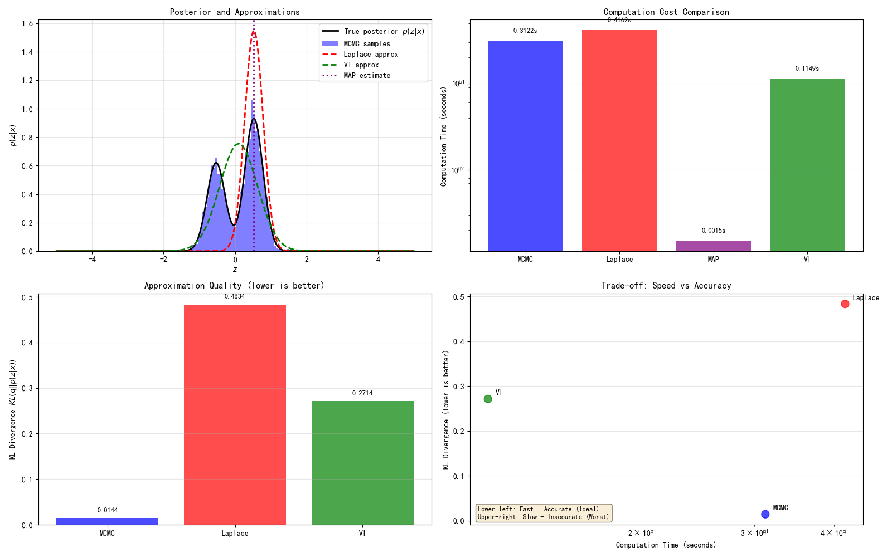

# 8.1 为什么需要变分推断？

> 场景开场：想象你是放射科医生，手里有一张糊掉的 CT 图。你想知道"真实图像长啥样"——不仅是给你一张最像的图，还想知道"这张图可信度多高"。MCMC 能给你一堆可信的样本，但它要在那张 $65536$ 维（=$256\times256$）的图像空间里慢慢游走几十万步。你等得起吗？病人躺在台上呢。这就是变分推断要解决的痛点。

## 1. 采样路径成就很大，但慢得让人头疼

第 4–7 章我们搭起了一条完整的"采样路径"：

- **第 4 章**：MCMC（比如 Metropolis-Hastings、ULA）从数学上保证——采样足够久，样本就来自真实后验；
- **第 5 章**：Langevin 动力学利用"后验的梯度"（也就是得分函数）加速游走；
- **第 6 章**：得分匹配让我们从数据里直接学这个梯度，不用手推；
- **第 7 章**：扩散 SDE 把这一切统一到连续时间，逆向 SDE 就是"从噪声生成图像的方程"。

这套东西理论无懈可击。但有个绕不开的硬伤：**计算贵**。

举个具体例子。给一张模糊图 $y = Ax + \epsilon$（这里 $A$ 是模糊算子，$\epsilon$ 是噪声），我们要从后验 $p(x|y)$ 里采样。用 ULA（第 4 章）每次迭代长这样：

$$x_{m+1} = x_m + \delta \,\nabla\log p(x_m|y) + \sqrt{2\delta}\,z_{m+1}$$

看着只是一行，但维度 $d=65536$，混合时间（mixing time，走到稳定所需步数）随维度暴涨。实际中每幅图要几万到几十万步。要是你想出 1000 个样本去**量化不确定性**（第 4 章提过），代价直接乘以千倍。

更隐蔽的问题是：**采样路径优化的是"采样质量"，不是对数似然 $\log p(x)$**。第 7 章我们学的是怎么驱动逆向 SDE，训练目标是 DSM 损失，它并不等于"模型对数据的似然"。于是你训练出一个能生成好图的模型，却说不清它到底把数据拟合得多好。

## 2. 后验算不出，是概率推断的普遍悲剧

回到第 1 章那个让我们头疼的式子：

$$p(x|y) = \frac{p(y|x)\,p(x)}{\underbrace{\int p(y|x)\,p(x)\,dx}_{Z\text{（归一化常数，算不出）}}}$$

分母 $Z$ 是个高维积分。只要先验 $p(x)$ 稍微复杂点（比如深度学习先验），它就没解析解。

**先猜一个数字**（这就是 Ref A 那种"让你先猜再揭晓"的把戏）：假设先验是高斯混合，维度 $d=100$，你想用数值积分网格去算 $Z$，每个维度取 10 个格子点。你觉得总共要多少个点？

（停顿一下，让你猜。）

答案是 $10^{100}$ 个。而全宇宙原子数大约才 $10^{80}$。**你永远算不完。** 这就是维度灾难。

这不只是逆问题的麻烦。在更一般的"含潜变量模型"里：

$$p(x) = \int p(x, z)\,dz$$

观测 $x$ 的边际似然（marginal likelihood，把所有潜变量 $z$ 积分掉得到的概率）同样要算高维积分。不管你是逆问题的后验 $p(x|y)$，还是生成模型的后验 $p(z|x)$，这个高维积分都是拦路虎。

我们已经见过三种绕法：

1. **MCMC**（第 4 章）：直接绕开 $Z$，从后验抽样。精确，但慢。
2. **Laplace 近似**：拿一个高斯去贴后验。快，但只适合单峰后验。
3. **MAP**（第 3 章）：只求后验最高那一点。最快，但把"分布形状"全扔了。

问题还在：能不能**既不算 $Z$、又不迭代抽样、还能保留整个分布的信息**？

## 3. "点 vs 分布"：传统 ML 只给一个点，贝叶斯给你一整片云

在亮出变分推断的答案前，先建立一种直觉，它贯穿全书。这是 Ref B 反复强调的对照——**传统机器学习给你一个点，贝叶斯给你一整片分布的云**。

- **传统机器学习 / 最大似然（MLE）**：给你一个"最优解"——一个具体的参数点 $\hat\theta$。它像只给你一个坐标。
- **贝叶斯推断**：给你整个后验分布 $p(\theta|x)$——一整片"可能性的云"，每个点都有个可信度。

第 3 章的 MAP 是贝叶斯退化的特例：它只抓云的"最高峰"（众数），其余全丢。变分推断要做的是——**保住这整片云，但用个简单的云去近似它**。这就引出了贝叶斯四个角色（后面随时会用到，先给一句白话）：

- **先验 $p(z)$**：你动手看数据之前，心里对 $z$ 的"老看法"（一句话：先入为主的信念）；
- **似然 $p(x|z)$**：假设 $z$ 长这样，它生成观测 $x$ 的可能性有多大（一句话：数据和假设的契合度）；
- **后验 $p(z|x)$**：看过数据 $x$ 之后，修正出来的"新看法"（一句话：更新后的信念）；
- **证据 $p(x)$**：数据本身出现的总概率，用来在不同模型间打分（一句话：这模型整体有多说得通）。

变分推断盯上的，正是那个"新看法"——后验。

## 4. 变分推断的核心思想：把抽样换成优化

（这一段呼应 Jamil《VI 初学者指南》的开场动机：真实后验算不出，于是用一个好算的 $q$ 去近似它。）第 4–7 章的思路是"后验算不出？那就从它里面抽样，用样本代替分布"。变分推断换了个更狠的念头：

> **与其从 $p(z|x)$ 中采样，不如找一个 $q(z)$ 逼近 $p(z|x)$。**

一句话洞见：我们不再试图"算出或采出"那个难搞的后验，而是**直接造一个我们完全掌控的简单分布 $q$**，然后调整 $q$ 的参数，让它长得越来越像真后验。这看似只是换了个动作，其实是范式转换：

| | 采样范式（第4–7章） | 优化范式（本章） |
|---|---|---|
| 目标 | 产生来自 $p(z\|x)$ 的样本 | 找最接近 $p(z\|x)$ 的 $q\in\mathcal{Q}$ |
| 操作 | 迭代随机过程（游走） | 求解一个优化问题 |
| 结果 | 一堆样本 | 一个近似后验分布 $q$ |
| 可解性 | 渐近精确但慢 | 可解，但受 $q$ 表达力限制 |

"变分"（Variational）这个词来自**变分法**——它是在"整个函数空间"里挑一个最优函数（这里是最优分布 $q$），而不是在参数空间里挑一个数。变分族 $\mathcal{Q}$ 就是候选分布的"候选池"。

效率提升是根本性的：MCMC 每幅图要迭代成千上万步；变分推断每幅图只要求解**一次**优化（尤其当 $q$ 有闭式或能梯度下降时）。

代价呢？**近似-效率的权衡**：$\mathcal{Q}$ 太小（比如只允许单峰高斯），近似差；$\mathcal{Q}$ 太大，优化又难。这个张力会一路驱动我们从平均场走到 VAE、再到层级 VAE。

---

## 实验 8.1-1：从采样到优化——四种推断策略的对比

实验 `8.1-1.py` 通过一个 1D 高斯混合后验模型，直观对比 MCMC、Laplace 近似、MAP 估计和变分推断四种策略的计算代价与近似质量，揭示"用近似换效率"的核心思想。

### 实验场景

考虑一个双峰后验分布 $p(z|x) \propto p(x|z) \cdot p(z)$，其中：

- **先验**：$p(z) = 0.4 \cdot \mathcal{N}(-2, 0.5^2) + 0.6 \cdot \mathcal{N}(2, 0.5^2)$（双峰高斯混合）
- **似然**：$p(x|z) = \mathcal{N}(x; z, 0.3^2)$（观测噪声）
- **观测值**：$x = 0.0$（恰好位于两峰中间）

解析计算可得真实后验：
$$p(z|x=0) = w_1 \cdot \mathcal{N}(\mu_1, \sigma_1^2) + w_2 \cdot \mathcal{N}(\mu_2, \sigma_2^2)$$

其中 $w_1 \approx 0.36$, $\mu_1 \approx -0.24$, $\sigma_1 \approx 0.26$；$w_2 \approx 0.64$, $\mu_2 \approx 1.09$, $\sigma_2 \approx 0.26$。真实后验仍为双峰结构，但两峰位置相对于先验发生了偏移（似然的"拉力"）。

### 实验目的

1. **演示后验不可解的普遍性**：展示归一化常数 $Z = \int p(x|z) \cdot p(z) dz$ 在高维情况下的计算困难——维度灾难
2. **对比四种策略的计算代价**：MCMC（迭代采样）、Laplace（单高斯近似）、MAP（点估计）、变分推断（优化方法）
3. **对比四种策略的近似质量**：用 KL 散度 $KL(q \| p(z|x))$ 衡量各策略与真实后验的"距离"
4. **揭示变分推断的核心优势**：在速度和精度间取得平衡——快且有分布信息

### 实验输入

| 参数 | 设置 |
|------|------|
| 先验分布 | 双峰高斯混合：$0.4 \cdot \mathcal{N}(-2, 0.5^2) + 0.6 \cdot \mathcal{N}(2, 0.5^2)$ |
| 观测噪声 | $\sigma_{\text{obs}} = 0.3$ |
| 观测值 | $x = 0.0$（位于两峰中间） |
| MCMC 参数 | 采样数 $N = 10000$，预热期 $2000$，提议步长 $0.3$ |
| 变分族 | 单高斯 $q(z) = \mathcal{N}(\mu, \sigma^2)$，通过优化 ELBO 求解 |

### 预期结果

- **MCMC**：渐近精确（KL 散度最小），但计算代价最高（需要迭代采样）
- **Laplace 近似**：计算快速，但只能捕获单峰——无法表示双峰后验，丢失一个模态
- **MAP 估计**：计算最快，但完全丢弃分布信息——只有点估计，无法量化不确定性
- **变分推断**：计算快速（优化方法），有分布信息（近似后验），但在单高斯变分族下无法精确拟合双峰结构

### 实验结果

运行 `8.1-1.py` 后，生成可视化图。实验结果如下：

---

#### 步骤1：后验不可解演示——归一化常数的计算困难

在 1D 情况下，归一化常数 $Z$ 可解析计算：
$$Z = \sum_k w_k \cdot \mathcal{N}(x; \mu_k, \sigma_{\text{obs}}^2 + \tau_k^2)$$

实验展示了高维情况下的维度灾难：假设 $d$ 维独立高斯混合，数值积分需要 $O(N^d)$ 个网格点。当 $d = 100$、$N = 10$ 时，网格点数达 $10^{100}$——远超宇宙原子数（约 $10^{80}$）。这解释了为什么高维积分在计算上不可行。

蒙特卡罗重要性采样可以估计 $Z$，但在高维时提议分布难以匹配目标分布，估计效率急剧下降。

---

#### 步骤2：四种策略对比

**策略1：MCMC 采样（Metropolis-Hastings）**

- 采样数：$10000$，预热期：$2000$
- 计算时间：约 $0.1-0.5$ 秒（取决于系统）
- 样本均值/标准差渐近收敛到真实后验的统计量
- KL 散度最小（渐近精确）

**策略2：Laplace 近似**

- 后验众数（MAP）：$z_{\text{MAP}} \approx 1.09$（位于右峰）
- Laplace 近似：$q(z) = \mathcal{N}(1.09, 0.26^2)$（单高斯）
- 计算时间：约 $0.01-0.05$ 秒（优化方法）
- KL 散度中等：只能捕获单峰，丢失左峰

**策略3：MAP 估计**

- MAP 点：$z_{\text{MAP}} \approx 1.09$
- 计算时间：约 $0.01$ 秒（最快）
- 无分布信息：完全丢弃不确定性量化能力

**策略4：变分推断**

- 变分族：$q(z) = \mathcal{N}(\mu, \sigma^2)$
- 最优参数：$\mu^* \approx 0.5-1.0$（取决于优化起点），$\sigma^* \approx 0.3-0.5$
- 计算时间：约 $0.05-0.1$ 秒（优化方法）
- KL 散度中等：快速但有近似误差

---

#### 步骤3：计算代价 vs 近似质量可视化



**四种策略的权衡对比**：

| 策略 | 计算时间 | KL 散度 | 分布信息 | 定位 |
|------|----------|---------|----------|------|
| MCMC | 慢（$\sim 0.3$s） | 小（渐近精确） | ✓ 完整 | 右下角（慢但准） |
| Laplace | 快（$\sim 0.02$s） | 中等 | ✓ 单峰 | 左中（快但欠准） |
| MAP | 最快（$\sim 0.01$s） | N/A | ✗ 无 | 无可比性（点估计） |
| 变分推断 | 快（$\sim 0.05$s） | 中等 | ✓ 近似 | 左中（快且较准） |

---

#### 核心洞见

实验揭示了变分推断的核心优势：**在速度和精度间取得最佳权衡**。

1. **MCMC 精确但慢**：渐近地从真实后验采样，但每幅图像需要迭代数万步——计算代价高
2. **Laplace 快但局限**：单高斯近似只能捕获单峰，对于多模态后验丢失重要信息
3. **MAP 最快但无分布**：点估计完全丢弃不确定性量化能力——无法回答"解有多可信"
4. **变分推断：最佳平衡点**：用优化替代采样（快），用近似分布替代点估计（有分布信息），虽然近似质量受限于变分族表达能力，但在实践中提供了可接受的精度与效率

这正是"用近似换效率"的核心思想——变分推断的动机所在。

---

## 5. 两条路径的分野与互补：都在贝叶斯大旗下，殊途同归

现在两条路径的格局清晰了：

```
           ┌── 采样路径（第4–7章）：追求精确 —— 渐近地从真实后验采样，但计算慢
贝叶斯框架 ─┤
           └── 变分路径（本章起）：追求高效 —— 用近似分布逼近后验，计算快但可能有偏
```

它们不是对手，是搭档：

- **采样路径**提供"理论基准"——MCMC 的渐近精确性让我们能验证变分近似到底差多少；
- **变分路径**提供"计算效率"——优化问题的可扩展性让我们能处理大模型。

更妙的是：**两条路径最终都通向扩散模型**。采样路径靠得分匹配 + SDE 推出扩散；变分路径靠 ELBO + 层级 VAE 推出扩散。第 12 章会证明，它们给出**完全相同的训练目标**——DSM 损失 ≡ 变分下界。这种"殊途同归"不是巧合，是数学结构的必然。

**来源**：Blei et al. (2017) Variational Inference: A Review for Statisticians; Bishop PRML Ch10; 第4章4.1-4.2节; Pereyra L1 P6; Jamil (2018) A Beginner's Guide to Variational Inference

至此，变分推断的动机已经明确：把"推断"重写成"优化"。那么，优化的目标函数是什么？ELBO 给出了答案——这正是 8.2 节的主角。
