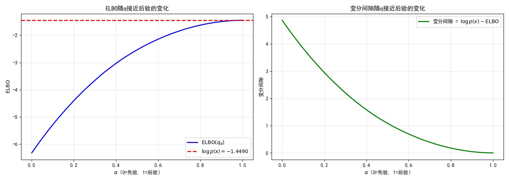

# 8.2 ELBO推导：证据下界

> **核心观点**：ELBO（Evidence Lower Bound）是对数似然 $\log p(x)$ 的一个下界，最大化ELBO等价于最小化近似分布与真实后验的KL散度。ELBO有两种等价形式："联合-熵"分解 $\mathbb{E}_q[\log p(x,z)] - \mathbb{E}_q[\log q(z)]$ 和"重建+正则"分解 $\mathbb{E}_q[\log p(x|z)] - \text{KL}(q(z)\|p(z))$。后者揭示了ELBO的结构——最大化ELBO需要同时最大化重建质量（数据拟合）和最小化与先验的偏离（正则化）。

## 从对数似然出发：为什么要关心 $\log p(x)$

对数似然 $\log p(x)$ 是概率模型的核心度量——它衡量模型对观测数据 $x$ 的"解释力"。在统计学中，最大化对数似然（MLE）是最经典的参数估计方法；在贝叶斯框架中，对数似然是后验推断的起点。

然而，在含有潜变量 $z$ 的模型中，$\log p(x)$ 的计算涉及高维积分：

$$\log p(x) = \log \int p(x, z)\,dz$$

对于连续潜变量，这个积分通常没有闭式解。直接数值积分在高维情况下更是不可行的——维度灾难使得网格积分的代价随维度指数增长。

变分推断的思路是：**不直接计算 $\log p(x)$，而是找到它的一个可计算的下界**。如果这个下界足够紧（接近 $\log p(x)$），那么最大化下界就近似于最大化 $\log p(x)$。ELBO正是这样的下界。

## 推导方法一：Jensen不等式

ELBO最直接的推导来自Jensen不等式。关键步骤是引入一个任意分布 $q(z)$：

$$\log p(x) = \log \int p(x, z)\,dz = \log \int \frac{p(x,z)}{q(z)} \cdot q(z)\,dz$$

这里 $q(z)$ 是一个任意的概率分布（稍后我们会讨论如何选择 $q$）。上式可以写为期望形式：

$$\log p(x) = \log \mathbb{E}_{q(z)}\left[\frac{p(x,z)}{q(z)}\right]$$

由于 $\log$ 是凹函数，由Jensen不等式：

$$\log \mathbb{E}_{q(z)}\left[\frac{p(x,z)}{q(z)}\right] \geq \mathbb{E}_{q(z)}\left[\log \frac{p(x,z)}{q(z)}\right]$$

定义右边的量为ELBO：

$$\boxed{\text{ELBO}(q) = \mathbb{E}_{q(z)}\left[\log \frac{p(x,z)}{q(z)}\right]}$$

核心结论：**$\log p(x) \geq \text{ELBO}(q)$**——ELBO是对数似然的下界，这就是"证据下界"（Evidence Lower Bound）名称的由来。$\log p(x)$ 是"证据"（evidence），ELBO是它的下界。

**Jensen不等式取等条件**：当且仅当 $\frac{p(x,z)}{q(z)} = c$（常数，与 $z$ 无关）时等号成立。这意味着 $q(z) \propto p(x,z)$，即 $q(z) = p(x,z)/p(x) = p(z|x)$。换言之，**当 $q$ 恰好等于真实后验时，ELBO等于 $\log p(x)$**——下界最紧。

这个取等条件揭示了一个深刻的事实：ELBO的"松紧"程度取决于 $q$ 与真实后验 $p(z|x)$ 的接近程度。我们越准确地近似后验，ELBO就越接近 $\log p(x)$。

## 推导方法二：KL散度分解

Jensen不等式给出了ELBO的存在性证明，但KL散度分解能给出更精确的结构。从 $\log p(x)$ 出发，引入真实后验 $p(z|x)$：

$$\log p(x) = \mathbb{E}_{q(z)}[\log p(x)]$$

注意 $\log p(x)$ 与 $z$ 无关，所以 $\mathbb{E}_{q(z)}[\log p(x)] = \log p(x)$。接下来利用 $p(x,z) = p(z|x) \cdot p(x)$：

$$\log p(x) = \mathbb{E}_{q(z)}\left[\log \frac{p(x,z)}{p(z|x)}\right]$$

在分子分母同乘 $q(z)$：

$$= \mathbb{E}_{q(z)}\left[\log \frac{p(x,z)}{q(z)} \cdot \frac{q(z)}{p(z|x)}\right]$$

利用 $\log(ab) = \log a + \log b$：

$$= \underbrace{\mathbb{E}_{q(z)}\left[\log \frac{p(x,z)}{q(z)}\right]}_{\text{ELBO}(q)} + \underbrace{\mathbb{E}_{q(z)}\left[\log \frac{q(z)}{p(z|x)}\right]}_{\text{KL}(q(z)\|p(z|x))}$$

得到核心分解：

$$\boxed{\log p(x) = \text{ELBO}(q) + \text{KL}(q(z) \| p(z|x))}$$

这个分解的物理含义极为清晰：

- $\log p(x)$ 是固定值——与 $q$ 无关
- ELBO 是 $q$ 的函数——随 $q$ 变化
- KL散度 $\text{KL}(q\|p(z|x))$ 衡量 $q$ 与真实后验的"距离"——也随 $q$ 变化
- 两者之和恒等于 $\log p(x)$

因为 KL散度非负（$\text{KL}(q\|p) \geq 0$），所以 $\log p(x) \geq \text{ELBO}(q)$ ✓——与Jensen不等式的结论一致。但KL分解给出了更多信息：**ELBO与 $\log p(x)$ 之间的差距恰好等于 $\text{KL}(q\|p(z|x))$**。这个差距被称为**变分间隙**（variational gap）。

**ELBO最大化 = KL最小化**：因为 $\log p(x)$ 与 $q$ 无关，所以

$$\arg\max_q \text{ELBO}(q) = \arg\min_q \text{KL}(q\|p(z|x))$$

最大化ELBO等价于最小化近似分布与真实后验的KL散度。这是变分推断的**核心等价关系**——它将"逼近后验"（概率论问题）转化为"最大化ELBO"（优化问题）。

## ELBO的两种等价分解

ELBO有两种等价但视角不同的分解形式，它们分别强调了ELBO的不同侧面。

### 分解一：联合-熵形式

从ELBO的定义出发：

$$\text{ELBO}(q) = \mathbb{E}_{q(z)}\left[\log \frac{p(x,z)}{q(z)}\right] = \mathbb{E}_{q(z)}[\log p(x,z)] - \mathbb{E}_{q(z)}[\log q(z)]$$

记 $H(q) = -\mathbb{E}_{q(z)}[\log q(z)]$ 为 $q$ 的微分熵，则：

$$\boxed{\text{ELBO} = \mathbb{E}_{q(z)}[\log p(x,z)] + H(q)}$$

- **第一项** $\mathbb{E}_q[\log p(x,z)]$：在近似分布下，模型对数据-潜变量联合分布的解释力。越大表示模型越"认可" $q$ 采样的 $(x, z)$ 对。
- **第二项** $H(q)$：近似分布的熵。越大表示 $q$ 越"不确定"——越分散、越不集中。

直觉：最大化ELBO = 最大化模型对联合分布的解释力 + 最大化近似分布的不确定性。第二项的作用是防止 $q$ 退化为一个 $\delta$ 函数——如果 $q$ 集中在一点（熵为零），虽然可能在那点上有很高的联合似然，但ELBO不会最大，因为丧失了熵的贡献。

### 分解二：重建+正则形式

利用 $p(x,z) = p(x|z) \cdot p(z)$，将联合-熵分解中的 $\log p(x,z)$ 拆开：

$$\text{ELBO} = \mathbb{E}_{q(z)}[\log p(x|z)] + \mathbb{E}_{q(z)}[\log p(z)] - \mathbb{E}_{q(z)}[\log q(z)]$$

后两项合并为KL散度：

$$\mathbb{E}_{q(z)}[\log p(z)] - \mathbb{E}_{q(z)}[\log q(z)] = -\text{KL}(q(z) \| p(z))$$

因此：

$$\boxed{\text{ELBO} = \mathbb{E}_{q(z)}[\log p(x|z)] - \text{KL}(q(z) \| p(z))}$$

- **第一项** $\mathbb{E}_q[\log p(x|z)]$：**重建项**——给定潜变量 $z$（从 $q$ 中采样），模型重建数据 $x$ 的对数似然。越大表示 $z$ 携带的关于 $x$ 的信息越充分。
- **第二项** $-\text{KL}(q\|p)$：**KL正则项**——近似后验 $q$ 与先验 $p(z)$ 的偏离程度。越小表示 $q$ 越接近先验。

直觉：最大化ELBO = **最大化重建质量** + **最小化与先验的偏离**。这两个目标之间存在张力：

- 重建太强（忽略KL）：$q$ 可以任意复杂以完美重建 $x$，但可能严重偏离先验——过拟合
- 正则太强（忽略重建）：$q$ 完全等于先验 $p(z)$，但无法有效编码 $x$ 的信息——欠拟合

这种"重建 vs 正则"的张力，与第3章MAP估计中"数据项 vs 正则项"的张力完全对应——这将在8.4节深入讨论。

### 两种分解的对比

| 分解 | 第一项 | 第二项 | 直觉 |
|---|---|---|---|
| 联合-熵 | $\mathbb{E}_q[\log p(x,z)]$ | $H(q)$ | 解释力 + 不确定性 |
| 重建-正则 | $\mathbb{E}_q[\log p(x\|z)]$ | $-\text{KL}(q\|p)$ | 数据拟合 + 先验约束 |

两种分解各有用途：

- **联合-熵形式**：适合理论分析，强调ELBO与信息熵的关系
- **重建-正则形式**：适合实践，明确显示重建与正则化的权衡

在后续章节中，**重建-正则形式**更为常用——VAE的训练目标直接对应这种分解（第9章）。

## ELBO的几何直觉

在概率分布空间中，$\log p(x)$ 是一个固定值——它不依赖于 $q$ 的选择。ELBO则是 $q$ 的函数——随着 $q$ 变化而变化。

可以这样理解：$\log p(x)$ 是"天花板"，ELBO是 $q$ 在这个天花板下的"投影"。$q$ 越接近真实后验 $p(z|x)$，ELBO就越接近天花板。当 $q = p(z|x)$ 时，ELBO触达天花板——变分间隙为零。

```
log p(x) ──────────────────────────── 天花板
    │                    ╱
    │                  ╱  ELBO(q)
    │                ╱
    │              ╱
    │            ╱
    │──────────╱──────────────────── q = p(z|x) 时 ELBO = log p(x)
    │
    └──────────────────────────── q 的变化方向
```

变分间隙 $\text{KL}(q\|p(z|x))$ 衡量了ELBO与天花板之间的距离。在最优 $q^* = p(z|x)$ 处，距离为零。

---

## 实验 8.2-1：ELBO的数值验证——Jensen不等式与两种分解

实验 `8.2-1.py` 通过一个 1D 高斯混合模型，数值验证 ELBO 的核心性质：Jensen 不等式 $\text{ELBO}(q) \leq \log p(x)$、两种分解的等价性、以及变分间隙随 $q$ 接近后验的变化。

### 实验场景

考虑一个潜变量模型：

- **先验**：$p(z) = 0.3 \cdot \mathcal{N}(-2, 1) + 0.7 \cdot \mathcal{N}(1, 1)$（双峰高斯混合）
- **似然**：$p(x|z) = \mathcal{N}(x; z, 0.5^2)$（观测噪声）
- **观测值**：$x = 0.5$

解析计算可得：
- **真实后验**：$p(z|x=0.5) = w_1 \cdot \mathcal{N}(\mu_1, \sigma_1^2) + w_2 \cdot \mathcal{N}(\mu_2, \sigma_2^2)$，其中 $w_1 \approx 0.037$, $\mu_1 \approx 0.00$, $w_2 \approx 0.963$, $\mu_2 \approx 0.60$, $\sigma_1 = \sigma_2 \approx 0.45$
- **证据**：$\log p(x=0.5) \approx -1.45$

由于似然偏向右峰（$x=0.5$ 离 $\mu_2=1$ 更近），真实后验的主要概率质量集中在右峰分量（$w_2 \approx 0.96$）。

### 实验目的

1. **验证 Jensen 不等式**：对不同变分分布 $q$，验证 $\text{ELBO}(q) \leq \log p(x)$——ELBO 确实是下界
2. **验证取等条件**：当 $q = p(z|x)$ 时，验证 $\text{ELBO} = \log p(x)$——变分间隙为零
3. **验证两种 ELBO 分解的等价性**：联合-熵分解与重建-正则分解给出相同数值
4. **可视化变分间隙变化**：参数化 $q$ 从先验到后验的过渡，展示 ELBO 如何逼近 $\log p(x)$

### 实验输入

| 参数 | 设置 |
|------|------|
| 先验分布 | 双峰高斯混合：$0.3 \cdot \mathcal{N}(-2, 1) + 0.7 \cdot \mathcal{N}(1, 1)$ |
| 观测噪声 | $\sigma_{\text{obs}} = 0.5$ |
| 观测值 | $x = 0.5$ |
| 测试变分分布 | 5 种：标准正态、接近后验、真实后验、双峰远离、远离后验 |
| 蒙特卡罗样本数 | $N = 100000$（用于 ELBO 数值估计） |

### 预期结果

- **Jensen 不等式验证**：所有测试的 $q$ 都满足 $\text{ELBO}(q) \leq \log p(x)$
- **取等条件验证**：当 $q = p(z|x)$ 时，$\text{ELBO} \approx \log p(x)$，变分间隙接近零
- **两种分解等价**：联合-熵分解和重建-正则分解给出相同的 ELBO 数值（误差在机器精度级别）
- **变分间隙变化**：参数化 $q_\alpha = (1-\alpha) \cdot p(z) + \alpha \cdot p(z|x)$，当 $\alpha \to 1$ 时，ELBO $\to \log p(x)$

### 实验结果

运行 `8.2-1.py` 后，生成可视化图。实验结果如下：

---

#### 步骤1：Jensen 不等式验证——ELBO $\leq$ $\log p(x)$

测试 5 种变分分布 $q$，计算 ELBO 并与 $\log p(x) \approx -1.45$ 对比：

| 变分分布 $q$ | ELBO | $\log p(x)$ | 变分间隙 | ELBO $\leq$ $\log p(x)$ |
|-------------|------|-------------|---------|------------------------|
| $\mathcal{N}(0, 1)$（标准正态） | $\approx -3.06$ | $-1.45$ | $\approx 1.61$ | ✓ |
| $\mathcal{N}(0.5, 0.5^2)$（接近后验） | $\approx -1.47$ | $-1.45$ | $\approx 0.02$ | ✓ |
| $p(z|x)$（真实后验） | $\approx -1.45$ | $-1.45$ | $\approx 0.00$ | ✓ |
| $0.5\cdot\mathcal{N}(-1,0.5^2)+0.5\cdot\mathcal{N}(1,0.5^2)$（双峰远离） | $\approx -3.62$ | $-1.45$ | $\approx 2.17$ | ✓ |
| $\mathcal{N}(5, 0.1^2)$（远离后验） | $\approx -50.9$ | $-1.45$ | $\approx 49.5$ | ✓ |

**核心观察**：

1. **所有 $q$ 的 ELBO $\leq \log p(x)$**——Jensen 不等式验证成功 ✓
2. **当 $q = p(z|x)$ 时，ELBO $\approx \log p(x)$**——变分间隙接近零，取等条件成立 ✓
3. **$q$ 偏离后验越远，ELBO 越小**：$\mathcal{N}(5, 0.1^2)$ 的间隙达 49.5，说明远离后验的 $q$ 给出的下界极松

---

#### 步骤2：两种 ELBO 分解的数值验证

对三种 $q$ 验证 ELBO 分解的等价性：

**联合-熵分解**：
$$\text{ELBO} = \mathbb{E}_q[\log p(x,z)] + H(q)$$

**重建-正则分解**：
$$\text{ELBO} = \mathbb{E}_q[\log p(x|z)] - \text{KL}(q \| p(z))$$

| 变分分布 $q$ | 联合-熵分解 | 重建-正则分解 | 直接计算 | 三者一致 |
|-------------|------------|-------------|---------|---------|
| $\mathcal{N}(0, 1)$ | $\mathbb{E}[\log p(x,z)] \approx -4.48$<br>$+ H(q) \approx 1.42$<br>$= -3.06$ | $\mathbb{E}[\log p(x\|z)] \approx -2.73$<br>$- \text{KL}(q\|p) \approx 0.33$<br>$= -3.06$ | $-3.06$ | ✓ |
| $\mathcal{N}(0.5, 0.5^2)$ | $\mathbb{E}[\log p(x,z)] \approx -2.20$<br>$+ H(q) \approx 0.73$<br>$= -1.47$ | $\mathbb{E}[\log p(x\|z)] \approx -0.73$<br>$- \text{KL}(q\|p) \approx 0.74$<br>$= -1.47$ | $-1.47$ | ✓ |
| $p(z|x)$ | $\mathbb{E}[\log p(x,z)] \approx -2.09$<br>$+ H(q) \approx 0.65$<br>$= -1.45$ | $\mathbb{E}[\log p(x\|z)] \approx -0.66$<br>$- \text{KL}(q\|p) \approx 0.79$<br>$= -1.45$ | $-1.45$ | ✓ |

**核心观察**：

1. **三种计算方式给出完全一致的 ELBO 值**——验证了两种分解的数学等价性 ✓
2. **物理含义的差异**：
   - 联合-熵分解中，$q$ 接近后验 → $\mathbb{E}[\log p(x,z)]$ 变大（拟合更好），$H(q)$ 变小（分布更集中）
   - 重建-正则分解中，$q$ 接近后验 → 重建项变大，KL 正则项也变大（$q$ 更偏离先验）

---

#### 步骤3：变分间隙随 $q$ 接近后验的变化



参数化 $q$ 从先验到后验的过渡：
$$q_\alpha = (1-\alpha) \cdot p(z) + \alpha \cdot p(z|x)$$

当 $\alpha = 0$ 时，$q = p(z)$（先验）；当 $\alpha = 1$ 时，$q = p(z|x)$（后验）。

**核心观察**：

1. **左图：ELBO 随 $\alpha$ 的变化**
   - $\alpha = 0$：$\text{ELBO} \approx -2.5$（远离天花板）
   - $\alpha = 1$：$\text{ELBO} \approx -1.45$（触达天花板）
   - ELBO 曲线单调递增——$q$ 越接近后验，ELBO 越大

2. **右图：变分间隙随 $\alpha$ 的变化**
   - $\alpha = 0$：间隙 $\approx 1.0$
   - $\alpha = 1$：间隙 $\to 0$
   - 变分间隙单调递减——$q$ 越接近后验，间隙越小

3. **验证核心等价关系**：最大化 ELBO 等价于最小化 $\text{KL}(q \| p(z|x))$ ✓

---

#### 核心知识点验证

实验验证了 8.2 节的全部核心结论：

| 理论结论 | 实验验证 |
|---------|---------|
| $\log p(x) \geq \text{ELBO}(q)$（Jensen 不等式） | ✓ 所有 $q$ 的 ELBO $\leq \log p(x)$ |
| 当 $q = p(z|x)$ 时 ELBO $= \log p(x)$ | ✓ $q = p(z|x)$ 时间隙接近零 |
| 联合-熵分解 $\equiv$ 重建-正则分解 | ✓ 三种计算给出相同数值 |
| 变分间隙 $= \text{KL}(q \| p(z|x))$ | ✓ 间隙随 $q$ 接近后验单调递减至零 |
| 最大化 ELBO $= 最小化 \text{KL}(q \| p(z|x))$ | ✓ ELBO 曲线与间隙曲线反向变化 |

---

**来源**：Bishop PRML Ch10; Blei et al. (2017); Tutorial_Diffusion_Imaging_Vision Sec 1.2 (Definition 1.3, Theorem 1.1, Theorem 1.2); Kingma & Welling (2014)

ELBO是对数似然的可计算下界，最大化ELBO等价于最小化与真实后验的KL散度。那么，如何最大化ELBO？这需要将变分推断形式化为一个优化问题。
