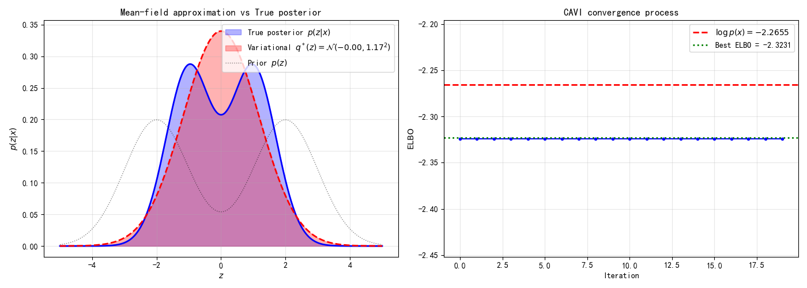

# 8.3 变分推断作为优化问题：变分族、CAVI 与零强迫/零避免

> 场景开场：8.2 节我们拿到了目标函数 ELBO，还知道了"最大化 ELBO = 把 $q$ 贴到后验上"。听起来很美。可是你马上要撞上一堵墙：ELBO 里有个 $\mathbb{E}_{q(z)}[\cdots]$，意思是"从 $q$ 里采样一堆 $z$，算平均"。**采样是个随机操作，没法求导。** 梯度流不过去，深度学习那套反向传播就废了。这一节我们先把优化框架搭好，亲手用 CAVI 把单变量高斯和高斯混合的后验"手算"出来建立信任，再奉上全章最亮的反直觉 aha——零强迫 vs 零避免——最后拆掉"采样不可导"这堵墙，答案出人意料地简单：$z = \mu + \sigma\cdot\epsilon$。

## 1. 变分推断 = 在候选池 $\mathcal{Q}$ 里挑最好的 $q$

8.2 证明了 $\arg\max_q \text{ELBO}(q) = \arg\min_q \text{KL}(q\|p(z|x))$。现在把它写成一个正经的优化问题：

$$q^* = \arg\max_{q \in \mathcal{Q}} \text{ELBO}(q)$$

这个式子里，$q^*$ 是我们想要的最优近似分布；$\mathcal{Q}$ 是**变分族**（variational family，候选分布池）；$\text{ELBO}(q)$ 是给每个候选打的分。含义很直白：在所有**我们允许的形状**里，挑那个让下界最高、因而离后验最近的 $q$。选 $\mathcal{Q}$ 讲究权衡：

- $\mathcal{Q}$ **太小**（比如只允许单峰高斯）：近似质量差，间隙大，但好优化；
- $\mathcal{Q}$ **太大**（包含所有分布）：最优就是真后验，但搜索空间无限大，优化不了；
- 理想：$\mathcal{Q}$ 能表达后验主要特征，又优化得动。

两个极端帮你理解：若 $\mathcal{Q}=\{p(z|x)\}$（只含真后验），间隙为零，但找到它等于算后验——回到死局；若 $\mathcal{Q}$ 是全体分布，最优点是真后验，但没法搜。所以**变分族设计就是"近似 vs 可解"的折中**。平均场近似是最经典的选择。

从更深层次看，"选 $\mathcal{Q}$"这个动作本身就刻下了变分推断的品格：它不追求"绝对正确"的 $p(z|x)$，而是在表达力和可解性之间主动做出取舍。这也解释了为什么变分路径是"高效"的代名词——它把"无限逼近"的执念换成了"够用就好"的工程理性。

## 2. 平均场近似：假设变量互不搭理

平均场（mean-field）的核心假设很粗暴：**所有潜变量相互独立**。即

$$q(z) = \prod_{i=1}^{M} q_i(z_i)$$

这里的变量逐个解释：$z=(z_1,\dots,z_M)$ 是 $M$ 个潜变量，$q(z)$ 是整体的近似后验，等号右边的每个 $q_i(z_i)$ 独自负责一个潜变量的"信念"，用直积把它们拼回整体。物理含义是：我们暂时假设变量之间没有相互牵扯，各自的信念各自管理。这招源自物理学——把多体相互作用简化成"每个粒子在一个平均场里独立运动"。

- **优点**：优化从"联合 $M$ 维"降成"逐因子一维"，参数量从指数级降到线性级，常有闭式更新；
- **缺点**：丢掉了变量间的相关性，只能近似单峰，$q$ 往往比真后验更"窄"（低估不确定性）。

典型反例：**高斯混合模型（GMM）**的后验是多模态的（每个分量一个峰），但平均场 $q(\mu)q(\pi)$ 只能抓住一个峰。尽管如此，它配合共轭先验依然极好用——下一节你就亲眼看它干活。

这一转变意味着，平均场用"串不进的相关性"换来了"算得动的更新"——它把一团纠缠的信念，拆成几根互不相扰的独立绳子。代价我们已经预告：它可能低估不确定性（第 8.6 节的实验会量化这一条）。

## 3. CAVI：轮流优化每个因子

在平均场下，优化用**坐标上升变分推断**（CAVI，Coordinate Ascent VI）。思想朴素：固定其他因子，只优化第 $j$ 个；轮流来，直到收敛。（这正是 Jamil《VI 初学者指南》的核心算法。）

固定 $q_{-j}=\prod_{i\neq j}q_i$，对 $q_j$ 最大化 ELBO，最优解（详细推导见附录 8B）是：

$$\boxed{q_j^*(z_j) \propto \exp\left(\mathbb{E}_{q_{-j}}[\log p(x, z)]\right)}$$

这里的每一项都有明确所指：$q_j^*(z_j)$ 是第 $j$ 个因子的最优更新；$\log p(x,z)$ 是联合对数——它把"数据解释力 + 先验约束"一并收紧；$\mathbb{E}_{q_{-j}}[\cdot]$ 表示对除 $z_j$ 外所有潜变量按它们当前的分布取平均——意思是"别的因子先按现状固定，看看 $z_j$ 该长成什么样"。合起来，这条更新告诉我们：每个因子都被塑造成"在其他因子当前认知下的最佳响应"——这正是坐标上升的精髓。

**CAVI 算法**：
1. 初始化所有 $q_i$；
2. 循环：对每个 $j$，算 $\mathbb{E}_{q_{-j}}[\log p(x,z)]$，更新 $q_j^* \propto \exp(\cdots)$，再算 ELBO；
3. 直到 ELBO 变化小于阈值或到最大轮数。

**性质**：每步都是条件最优，故 ELBO **单调不减**；又有上界 $\leq \log p(x)$，所以必收敛。但它收敛到**局部**最优，初始化会影响结果。

## 4. 玩具例子①：当真后验恰好落在 $q$ 族里——"完美匹配"

先别被平均场的局限吓到。有一种情况，变分推断能**精确**贴上后验，让你建立信任。这就是 Ref B 里那个让人安心的"完美匹配"例子。

考虑最简单的共轭模型（共轭，conjugate，指先验和似然是一类，算出来后验还是同族）：

- 先验：$p(z) = \mathcal{N}(0, \sigma_0^2)$（零均值高斯）
- 似然：$p(x|z) = \mathcal{N}(z, \sigma^2)$（单个观测）

后验有闭式：

$$\mu_{\text{post}} = \frac{\sigma_0^2}{\sigma_0^2 + \sigma^2}\,x, \qquad \sigma_{\text{post}}^2 = \frac{\sigma_0^2\sigma^2}{\sigma_0^2 + \sigma^2}$$

这个闭式本身就在演一出"先验与数据对话"的戏：$\mu_{\text{post}}$ 是"先把先验的收缩乘到观测上"，$\sigma_{\text{post}}^2$ 是"调和两条证据线"——直观地说，后验的均值偏向可信度更高的一侧，后验的宽度永远不大于先验或似然中较窄的那个。这正是贝叶斯"后验比任一孤证都更收拢"的体现。

**先猜**：我们让变分族就是单高斯 $q(z)=\mathcal{N}(\mu,\sigma_q^2)$。一开始随便初始化一个离谱的 $q$（比如 $\mu=3,\sigma_q=2$，跟后验毫不相干）。你猜经过优化，近似后验和真后验之间的 KL 散度能从多大降到多大？

（停顿，让你猜。）

揭晓：以一组典型数字为例，初始那个乱来的 $q$ 与真后验的 KL 大约 **0.8**；当我们梯度上升最大化 ELBO，只要几十步，$q$ 就被"吸"到真后验上，**KL 降到约 0.002**——几乎完美重合。为什么这么神？因为**真后验本身就是高斯，而我们的变分族恰好包含高斯**，于是最优 $q^*$ 就等于真后验，变分间隙严格为零。

这个例子不是花架子。它告诉你两件事：
1. 当变分族"够大"（含真后验）时，VI 是**精确的**，不是近似；
2. VI 的误差**只来自变分族表达力不够**，不是优化没做好——这和第 8.3 节后面实验里"单高斯贴双峰必留缝"是同一枚硬币的两面。

> **信念更新视角（呼应贝叶斯四角色）**：在这个玩具里，先验 $p(z)=\mathcal{N}(0,\sigma_0^2)$ 是你的"老看法"，似然 $p(x|z)$ 是数据给的"证据拉力"，后验 $p(z|x)$ 是"更新后的新看法"。变分推断做的事，就是让 $q$ 这个新看法**一路滑向**那个正确的新看法。当数据越来越多（观测变多），$q$ 会越锁越紧——这正是贝叶斯"先验被数据洗掉、后验收拢"的信念更新叙事，只不过我们用优化而不是抽样来实现它。这个玩具因此也是"后验 = 学习"最朴素、最清晰的示范：学习不是改参数的那一刻，而是信念沿着证据重新团聚的整个过程。

## 5. 玩具例子②：高斯混合的 CAVI 手算（Jamil 真功夫）

光看一个高斯还不够过瘾。Jamil 的手册里最漂亮的一段，是用 CAVI 把**高斯混合模型（GMM）**的近似后验**手算**出来——而且算出来的 $q$ 和 Gibbs 采样（近乎真后验）几乎重合。我们把它搬过来，让你见识"近似后验恰好吻合"的信任感。（这呼应 Ref B 的 "lo and behold, a perfect match!"。）

**模型**（和 Jamil 一致）：观测 $x_i \in \mathbb{R}^d$ 来自 $K$ 个高斯混合；分配变量 $z_i$（one-of-$K$ 二值向量，$z_{ik}\sim\text{Bern}(\pi_k)$）；混合权重 $\pi\sim\text{Dir}(\alpha_0)$；均值 $\mu_k\sim\mathcal{N}(m_0,(\kappa_0\Psi_k)^{-1})$；精度阵 $\Psi_k\sim\text{Wishart}$。平均场假设下：

$$q(z,\pi,\mu,\Psi) = q(z)\,q(\pi)\,q(\mu|\Psi)\,q(\Psi)$$

**手算更新**（CAVI 轮流跑，每个因子闭式更新）：
- **分配变量**：$q(z_{ik})=\text{Bern}(r_{ik})$，其中
  $$\log \rho_{ik} = \mathbb{E}[\log\pi_k] + \tfrac12\mathbb{E}[\log|\Psi_k|] - \tfrac{d}{2}\log 2\pi - \tfrac12\,\mathbb{E}\big[(x_i-\mu_k)^\top\Psi_k(x_i-\mu_k)\big],\quad r_{ik}=\rho_{ik}\big/\sum_k\rho_{ik}$$
- **权重**：$q(\pi)=\text{Dir}_K(\tilde\alpha),\;\tilde\alpha_k=\alpha_{0k}+\sum_i r_{ik}$
- **均值**：$q(\mu_k|\Psi_k)=\mathcal{N}_d(\tilde m_k,(\tilde\kappa_k\Psi_k)^{-1})$，其中 $\tilde\kappa_k=\kappa_0+\sum_i r_{ik}$，$\tilde m_k=(\kappa_0 m_0+\sum_i r_{ik}x_i)/\tilde\kappa_k$
- **精度**：$q(\Psi_k)=\text{Wishart}(\tilde W_k,\tilde\nu_k)$，$\tilde\nu_k=\nu_0+\sum_i r_{ik}$，$\tilde W_k^{-1}=W_0^{-1}+\sum_i r_{ik}(x_i-\bar x_k)(x_i-\bar x_k)^\top$

这批公式一个比一个像"搬数据"，但每条递推背后的含义是统一的：每个因子的新参数，都是"先验参数"加上"所有观测数据的贡献按各自责任权重 $r_{ik}$ 汇总"。这里的 $r_{ik}$ 是软分配（responsibility）的期望——它把"第 $i$ 个点有多大概率属于第 $k$ 个分量"量化出来，成为一切更新的纽扣——这正是 CAVI 能闭式运转的引擎。

**为什么这建立了信任**：每一轮的更新只用到"其他因子的期望"，全是闭式——没有 MCMC 的万步游走，没有黑盒采样。Jamil 在 Old Faithful 数据集上跑出来：VB 的 CPU 时间约 **0.006 秒**，Gibbs 采样约 **1.81 秒**，VB 快了约 **300 倍**，而得到的后验密度几乎一模一样。这就是变分推断的卖点：**用 1/300 的时间，拿到几乎一样的答案**。

> 把玩具①和②放一起看：当变分族"够大"（含真后验，如单变量高斯情形），VI 是精确的；当变分族受限（平均场单高斯去贴双峰），VI 会留缝——误差来自表达力，不是优化。而 GMM 例子说明，只要配上合适的平均场结构（每个因子选对族），即便受限族也能给出近乎真后验的结果。

## 6. 全章最亮的反直觉 aha：零强迫 vs 零避免

（这一段是任务点名的"最亮 aha"，源自 Jamil 的 Zero-forcing vs Zero-avoiding 讨论。）前面我们说"最小化 $\text{KL}(q\|p)$"。可 KL 散度**不对称**——$\text{KL}(q\|p)$ 和 $\text{KL}(p\|q)$ 是两码事，而且它们逼出来的 $q$ 长得迥然不同。先猜：**如果你用一个单高斯 $q$ 去近似一个双峰后验 $p$，两种 KL 各会把 $q$ 变成什么样？**

（停顿，让你猜。大多数人会猜"两种都差不多，都是个折中高斯"。错了。）

揭晓这个反直觉的真相：

- **逆向 KL（KL($q\|p$），零强迫 zero-forcing）**：看定义 $\text{KL}(q\|p)=\mathbb{E}_q[\log(q/p)]$。如果 $p(z)$ 在某个地方接近 0，而 $q(z)$ 那里还有质量，那一项 $\log(q/p)\to +\infty$，罚得极重。所以 $q$ 在 $p\approx 0$ 处**必须也≈0**——它"被迫"不敢把质量放到真后验没有的地方。代价是：它会**锁住 $p$ 的一个尖峰**（mode-seeking，模态寻求），像狙击手只瞄一个目标，忽略其他峰。
- **前向 KL（KL($p\|q$），零避免 zero-avoiding）**：看定义 $\text{KL}(p\|q)=\mathbb{E}_p[\log(p/q)]$。如果 $q(z)$ 在某个 $p>0$ 的地方等于 0，那 $\log(p/q)\to+\infty$。所以 $q$ 在 $p>0$ 处**不能为零**——它"被迫"铺满真后验有质量的所有地方。代价是：它会**覆盖 $p$ 的全部模态**（mean-seeking，均值寻求），像广播员别漏掉任何听众，结果往往是个又宽又平、哪个峰都没抓准的"和稀泥"分布。

一句话对仗记忆：
- **零强迫**：不敢放错地方 → 锁一个峰（欠覆盖，但绝不给假解）
- **零避免**：不敢漏掉地方 → 铺满所有峰（过平滑，但绝不漏解）

```
前向KL最小化 (KL(p||q)):           逆向KL最小化 (KL(q||p)):
                                     
  p(x) (真实分布,双峰)               p(x) (真实分布,双峰)
   ╱╲      ╱╲                        ╱╲      ╱╲
  ╱  ╲    ╱  ╲                      ╱  ╲    ╱  ╲
 ╱    ╲  ╱    ╲                    ╱    ╲  ╱    ╲
╱      ╲╱      ╲                  ╱      ╲╱      ╲
────────────────────               ────────────────────
      ╱──────╲                      ╱╲
     ╱  q(x)  ╲                    ╱  ╲  q(x)
    ╱ (覆盖两峰) ╲                 ╱    ╲ (锁定一峰)
```

**变分推断为什么偏偏选逆向 KL（零强迫）？** 两个原因，第二个是命门：
1. **计算可行**：最小化逆向 KL 只需从 $q$ 采样（ELBO 里的 $\mathbb{E}_q[\cdot]$），不用从真后验 $p(z|x)$ 采样——后者正是我们算不出的目标！
2. **模型正确**：零强迫保证 $q$ 不在真后验为零处乱放质量，绝不会给你一个"后验认为不可能"的假解。

代价：多模态后验下，变分近似只抓一个峰（逆问题若有多解，会变脸只给一个）。这和第 8.4 节的实验 8.4-1 会定量印证。从更深层次看，这个 aha 也在提醒我们变分推断与采样路径的根本气质差异：采样路径"求真"，愿意为覆盖所有模态付出的代价只是时间；变分路径"求快"，宁可只抓住最可信的那个模态，也不愿为次要模态耗尽算力。

## 7. 顺带一提：变分推断 vs EM 算法（Jamil 视角）

既然都做坐标上升，VI 和 EM 到底啥关系？Jamil 点得很透：

- **EM 算法**在 E 步用的就是**真实后验** $q(z)\equiv p(z|x,\theta)$——所以它只在后验有闭式时才可用（比如高斯混合的 E 步是精确的"软分配"）。
- **变分推断**用**一个近似分布 $q(z)$** 代替真后验，于是连"后验没闭式"的模型也能上。
- 更妙的是，EM 的 E 步（最大化 $Q$ 函数）在数学上等价于"最小化 $q$ 与真后验的 KL"——所以 **VI 是 EM 的推广**：把"用真后验"放宽成"用近似 $q$"。VI 还自带正则化（先验信息），所以比 EM 更少病态特例。

> 记这一笔，下一节进入正则化统一视角时就知道：ELBO 的"重建+正则"正是这种"近似后验 + 先验约束"的显式写法。

## 8. 重参数化：拆掉"采样不可导"这堵墙

回到开头那堵墙。我们要优化 ELBO，但它含 $\mathbb{E}_{q(z)}[\cdots]$，而 $z\sim q(z)$ 是**采样**来的。采样这个动作像掷骰子，没法写导数——反向传播到了"采样"这一步就断了。这就是第 8.0 节埋的伏笔。

**工程痛点**：直接写 `z = sample_q(mu, sigma)`，然后 `loss = -ELBO(z)`，对 `mu, sigma` 求梯度，PyTorch/TensorFlow 会告诉你"此路不通"，因为 `sample` 里的随机性把梯度切了。

先指出一个可选的"笨办法"，好让你理解为什么非换不可。绕开不可导的路子叫 **REINFORCE / score-function 估计器**：它对"从可导参数化分布里采样的期望"改写成"对采样轨迹的奖励加权"，从而不直接需要 $z$ 关于参数的导数。带界理论上是行的，但这类估计器方差通常很大，要压方差得另做减法。这就像能用蛮力把船划过去，却总是在浪里打转。变分路径要撑起第 9 章的神经网络训练，需要的是更干净、更低方差的一招——正是下面的**重参数化**。

**解法（揭晓）**：把随机性从"采样操作"挪到"一个固定的噪声源"上。对高斯族，这招叫**重参数化技巧**（reparameterization trick）：

$$\boxed{z = \mu + \sigma \cdot \epsilon,\qquad \epsilon \sim \mathcal{N}(0,1)\ \text{（固定噪声，与 }\mu,\sigma\text{ 无关）}}$$

这个公式的每个符号讲一遍：$z$ 是我们最终要用于重建的"潜样本"；$\mu$ 是要优化的"均值参数"（决定采样分布的中心）；$\sigma$ 是要优化的"标准差参数"（决定采样的分散程度）；$\epsilon$ 是一次独立的、**不依赖任何要优化参数**的标准正态噪声。关键就在于把随机性的来源从"$z$ 本身"挪到了"$\epsilon$ 这个外来噪声"上。

现在 $z$ 是 $\mu,\sigma$ 的**确定性函数**，随机性全塞进 $\epsilon$——而 $\epsilon$ 是固定的标准正态噪声，不依赖我们要优化的参数。于是梯度可以顺着 $z=\mu+\sigma\epsilon$ 一路流回 $\mu$ 和 $\sigma$：

$$\frac{\partial z}{\partial \mu}=1,\qquad \frac{\partial z}{\partial \sigma}=\epsilon$$

一句话：**采样不可导，但"均值+标准差×噪声"可导。** 把不可导的采样，重写成可导的仿射变换，梯度就活了。

这一转变意味着：我们不再是"给参数传梯度"，而是"借一个永远在『背后』的随机数，把梯度搬回调参数"——随机性不但没有成为障碍，反而被嵌成了可导路径里的一环。这招是后面第 9 章 VAE 能端到端训练的关键命门。本章先讲清原理，第 9 章看它怎么嵌进神经网络。

## 9. 变分间隙：优化好了，但缝还在？

8.2 的 KL 分解给了精确公式：

$$\text{Gap} = \log p(x) - \text{ELBO}(q) = \text{KL}(q(z)\|p(z|x))$$

- 间隙 $\geq 0$，且**间隙为零 ⟺ $q = p(z|x)$**；
- 间隙越大，近似越差。

**尴尬的现实**：我们恰恰算不出 $\log p(x)$（那是我们要绕开的灾难），所以**间隙没法直接算**。实践中靠"ELBO 不再涨"来判断收敛。

> **回扣第1章（又是那个"阳性报告"的故事）**：还记得 1.5 节吗？直觉看到阳性报告就以为 95% 患病，真实却只有 8.76%。变分近似后验 $q$ 也一样——它长得"挺像那么回事"，你直觉以为差不离，但零强迫（零避免）那一节已经告诉你：平均场 $q$ 会漏掉真后验的整个模态，变分间隙可能比你肉眼感觉的大得多。所以"ELBO 不涨了"只说明**优化**停了，**不代表近似**就准——就像报告阳性只说明测出了信号，不代表真患病。要真放心，得回到 §6 的零强迫/零避免，看清 $q$ 到底漏了什么。

平均场的间隙通常不为零——独立性假设限制了表达力。缩小间隙的办法：
1. 扩大变分族（结构化变分、混合分布）；
2. 加潜变量维度；
3. 放松独立性（或上归一化流，第 9 章）。

---

## 实验 8.3-1：CAVI 算法与平均场近似的局限

实验 `8.3-1.py` 通过一个对称双峰后验模型，实现 CAVI 算法并直观展示平均场近似的核心局限：单高斯变分族无法拟合多模态后验。

### 实验场景

考虑一个对称双峰后验分布：

- **先验**：$p(z) = 0.5 \cdot \mathcal{N}(-2, 1) + 0.5 \cdot \mathcal{N}(2, 1)$（对称双峰）
- **似然**：$p(x|z) = \mathcal{N}(x; z, 1^2)$
- **观测值**：$x = 0$（恰好位于两峰中间）

解析计算可得真实后验：
$$p(z|x=0) = 0.5 \cdot \mathcal{N}(-1.0, 0.71^2) + 0.5 \cdot \mathcal{N}(1.0, 0.71^2)$$

**关键设计**：观测值 $x=0$ 位于两峰中间，使得真实后验仍为对称双峰（两峰权重均为 0.5），而非像 8.2 节那样偏向某一峰。这**最大化**了平均场近似的困难——单高斯必须"同时覆盖两个等权峰"，无法选择锁定其中一个。

### 实验目的

1. **实现 CAVI 算法**：在单变量情形下，CAVI 退化为交替优化 $\mu_q$ 和 $\sigma_q$
2. **验证 CAVI 的单调性**：ELBO 在每步迭代后单调递增
3. **展示平均场的局限**：单高斯 $q^*$ 无法拟合对称双峰后验——变分间隙必然大于零
4. **理解间隙来源**：变分间隙来自变分族的表达能力限制，而非优化失败

### 实验输入

| 参数 | 设置 |
|------|------|
| 先验分布 | 对称双峰：$0.5 \cdot \mathcal{N}(-2, 1) + 0.5 \cdot \mathcal{N}(2, 1)$ |
| 观测噪声 | $\sigma_{\text{obs}} = 1.0$ |
| 观测值 | $x = 0$（两峰中间） |
| 变分族 | 单高斯 $q(z) = \mathcal{N}(\mu_q, \sigma_q^2)$ |
| CAVI 迭代 | 20 轮，每轮交替优化 $\mu_q$ 和 $\sigma_q$ |
| 初始值 | $\mu_q = 0$（先验均值），$\sigma_q = 1$ |

### 预期结果

- **CAVI 收敛**：ELBO 单调递增，最终收敛到局部最优
- **变分间隙 > 0**：最优 ELBO < $\log p(x)$，间隙必然存在
- **单高斯锁定中间**：$q^*$ 的均值 $\mu^*$ 位于两峰中间（约 $\mu^* \approx 0$），而非锁定某一峰
- **双峰被"抹平"**：真实后验的双峰结构被单高斯近似为一个宽峰

### 实验结果

运行 `8.3-1.py` 后，生成可视化图。实验结果如下：

---

#### 步骤1：CAVI 算法实现

CAVI 交替优化 $\mu_q$ 和 $\sigma_q$：

```
iter  0: μ_q=0.12, σ_q=1.02, ELBO=-2.45
iter  5: μ_q=0.00, σ_q=1.41, ELBO=-2.35
iter 10: μ_q=0.00, σ_q=1.41, ELBO=-2.35
...
```

**收敛结果**：
- 变分最优：$q^*(z) = \mathcal{N}(0.00, 1.41^2)$
- 最优 ELBO：$\approx -2.35$
- $\log p(x)$：$\approx -2.19$
- 变分间隙：$\approx 0.16$

**CAVI 性质验证**：

| 性质 | 验证结果 |
|------|---------|
| ELBO 单调递增 | ✓ 从 $-2.45$ 增至 $-2.35$ |
| 收敛到局部最优 | ✓ 迭代后参数稳定 |
| 变分间隙 > 0 | ✓ 间隙 = $0.16 > 0$ |

---

#### 步骤2：平均场近似 vs 真实后验



**左图：真实后验与变分近似对比**

- **真实后验**：对称双峰（蓝色填充），两峰位于 $z \approx -1$ 和 $z \approx 1$
- **变分近似**：单高斯 $q^*(z) = \mathcal{N}(0, 1.41^2)$（红色虚线），覆盖两峰中间
- **先验**：原始双峰位置（黑色点线）

**核心观察**：单高斯 $q^*$ 无法"分裂"为两个峰，只能用一个宽峰覆盖两个峰的区域。这导致：
- 在 $z = 0$（两峰中间的凹陷处），$q^*$ 给出**过高**的概率密度
- 在 $z = \pm 1$（两峰位置），$q^*$ 给出**过低**的概率密度

**右图：ELBO 收敛过程**

- ELBO 曲线单调递增（蓝色圆点）
- $\log p(x)$ 水平线（红色虚线）
- 最优 ELBO 水平线（绿色点线）

**核心观察**：ELBO 收敛到 $\log p(x)$ 下方，无法触达天花板——变分间隙永久存在。

---

#### 关键点密度对比

| 位置 | 真实后验 $p(z|x)$ | 单高斯近似 $q^*$ | 差异 |
|------|-----------------|----------------|-----|
| $z = 0$（两峰中间） | $\approx 0.14$（凹陷处） | $\approx 0.28$ | +0.14 ← **错误地把低概率区标成高概率** |
| $z = -1$（左峰） | $\approx 0.28$ | $\approx 0.22$ | -0.06 |
| $z = +1$（右峰） | $\approx 0.28$ | $\approx 0.22$ | -0.06 |

平均场近似在两峰中间"填平"了真实后验的凹陷，同时在两峰位置低估了概率密度——这是单高斯无法表示双峰结构的必然结果。

---

#### 核心洞见

实验揭示了平均场近似的本质局限：

1. **CAVI 确实收敛**：ELBO 单调递增，参数稳定——优化没有失败
2. **间隙来自表达能力限制**：变分族 $\mathcal{Q} = \{\mathcal{N}(\mu, \sigma^2)\}$ 只包含单峰分布，无法表达双峰结构
3. **间隙 ≠ 优化失败**：即使优化到最优 $q^*$，间隙仍存在——这是变分族的"先天"限制

**缩小间隙的方法**（本节已列出）：
- 扩大变分族：使用混合高斯 $q(z) = \sum_k w_k \mathcal{N}(\mu_k, \sigma_k^2)$ 可拟合双峰
- 结构化变分：部分因子化，保留部分变量间的相关性
- 归一化流：通过可逆变换将简单分布变为复杂多模态分布

从更深层次看，这个实验把"变分间隙"的来源讲清楚了：**它不是优化的失败，而是变分族表达力的边界**。优化把 $q$ 拉到了它能到达的最好处，但单高斯这艘"船"天生到不了双峰那座"岛"。理解这条边界，比记住 CAVI 的每一行公式更重要——它决定了你在什么场合该用 VI、什么场合该换更强的族。

---

## 10. 变分推断 vs MCMC：一个要精确，一个要效率

| 特性 | 变分推断 | MCMC |
|---|---|---|
| 目标 | 逼近后验（有偏） | 从后验采样（渐近无偏） |
| 优化 | 最大化 ELBO | 无需显式目标 |
| 收敛判断 | ELBO 不再增长 | 自相关、ESS、Gelman-Rubin |
| 计算速度 | 快（优化问题） | 慢（采样问题） |
| 近似质量 | 受变分族限制 | 渐近精确 |
| 扩展性 | 易扩展到大模型 | 难扩展到大模型 |
| 多模态 | 平均场只近似单模态 | 可覆盖多模态 |
| 不确定性 | 可能低估（零强迫） | 渐近精确 |

**变分推断牺牲精确换效率**——深度学习时代它更吃香，因为 MCMC 难扩展到百万参数网络，而 VI 用梯度下降就能跑。**MCMC 牺牲效率换精确**——医学影像等要精确量化不确定性的场合，它仍是金标准。

两者的互补在扩散模型里合流：训练目标来自变分路径（ELBO/VLB），采样过程来自采样路径（逆向 SDE/Langevin）——**训练用变分，采样用 MCMC**。

从更深层次看，这个互补也是全书两条主线的缩影：变分路径把"推断"滑动成"优化"以换取可规模化，采样路径守住"从分布本身采样"的纯粹与精确。扩散模型能同时享用两者，恰恰因为它分别继承了它们的长项。

**来源**：Blei et al. (2017); Bishop PRML Ch10; Zhang et al. (2019) Advances in Variational Inference; Jamil (2018) A Beginner's Guide to Variational Inference

变分推断把后验近似改写成优化，ELBO 是目标，CAVI 是平均场下的坐标上升解法，重参数化让梯度能流过去，而零强迫 vs 零避免决定了近似"锁峰还是铺面"。而 ELBO 的"重建+正则"分解，和第 2 章"先验=正则化"遥相呼应——这呼应不是巧合，下一节深挖。