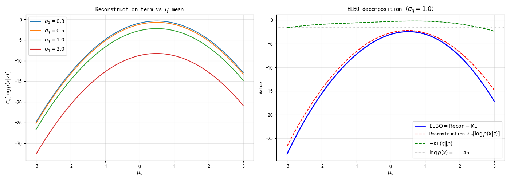
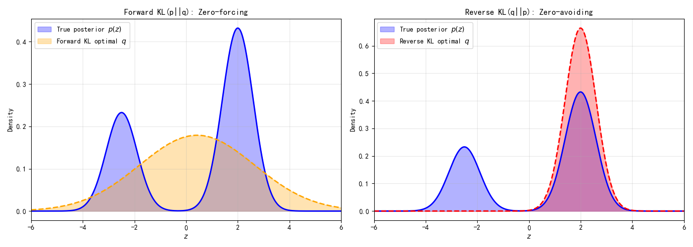

# 8.4 变分推断与正则化的统一视角

> **核心观点**：ELBO的"重建+正则"分解 $\mathbb{E}_q[\log p(x|z)] - \text{KL}(q\|p)$ 与第2章的"$-\ln$后验 = 数据项 + 正则项"具有相同的数学结构。这种统一不是表面的类比——Fenchel共轭为两者提供了共同的优化理论基础。变分正则化框架将概率推断和优化正则化统一在同一个数学框架中，揭示了一个深层洞见：**正则化是从概率模型中"积分掉"潜变量的结果**。

## ELBO = 重建项 + KL正则项

回顾8.2节ELBO的"重建+正则"分解：

$$\text{ELBO} = \underbrace{\mathbb{E}_{q(z)}[\log p(x|z)]}_{\text{重建项}} - \underbrace{\text{KL}(q(z) \| p(z))}_{\text{KL正则项}}$$

两项各有清晰的含义：

- **重建项** $\mathbb{E}_q[\log p(x|z)]$：从 $q$ 中采样 $z$，用 $p(x|z)$ 重建 $x$ 的对数似然。越大表示 $z$ 携带的关于 $x$ 的信息越充分。如果 $p(x|z) = \mathcal{N}(x; f_\theta(z), \sigma^2 I)$，则重建项为 $-\frac{1}{2\sigma^2}\mathbb{E}_q[\|x - f_\theta(z)\|^2] + \text{const}$——就是负的均方误差。

- **KL正则项** $-\text{KL}(q\|p)$：近似后验 $q$ 与先验 $p(z)$ 之间的KL散度。越小表示 $q$ 越接近先验。这一项"惩罚" $q$ 偏离先验的程度。

两者之间存在张力：

- **重建太强**（忽略KL）：$q$ 可以任意复杂以完美重建 $x$，但严重偏离先验 → 过拟合
- **正则太强**（忽略重建）：$q$ 完全等于先验 $p(z)$，但无法编码 $x$ 的信息 → 欠拟合

这种张力与第3章MAP估计中"数据项 vs 正则项"的张力完全对应。这不是巧合——它们有共同的数学根源。

---

## 实验 8.4-2：ELBO = 重建项 + KL正则项的权衡

实验 `8.4-2.py` 通过扫描不同变分分布参数，定量验证 ELBO 的"重建+正则"分解，展示重建项与 KL 正则项之间的权衡关系。

### 实验场景

使用与 8.2 节相同的模型：

- **先验**：$p(z) = 0.3 \cdot \mathcal{N}(-2, 1) + 0.7 \cdot \mathcal{N}(1, 1)$
- **似然**：$p(x|z) = \mathcal{N}(x; z, 0.5^2)$
- **观测值**：$x = 0.5$
- **证据**：$\log p(x) \approx -1.45$

### 实验目的

1. **验证 ELBO 分解**：$\text{ELBO} = \mathbb{E}_q[\log p(x|z)] - \text{KL}(q \| p(z))$，两项之和等于直接计算的 ELBO
2. **扫描变分参数**：观察重建项和 KL 正则项随 $\mu_q$ 和 $\sigma_q$ 的变化规律
3. **定量验证变分间隙**：优化得到最优 $q^*$，验证 $\text{ELBO}^* < \log p(x)$（变分下界性质）
4. **理解重建-正则权衡**：当 $\mu_q$ 接近观测值 $x$ 时重建项最大，但 KL 正则项随之增加——两者存在张力

### 实验输入

| 参数 | 设置 |
|------|------|
| 先验分布 | 双峰高斯混合：$0.3 \cdot \mathcal{N}(-2, 1) + 0.7 \cdot \mathcal{N}(1, 1)$ |
| 观测噪声 | $\sigma_{\text{obs}} = 0.5$ |
| 观测值 | $x = 0.5$ |
| 变分族 | 单高斯 $q(z) = \mathcal{N}(\mu_q, \sigma_q^2)$ |
| 扫描范围 | $\mu_q \in [-3, 3]$，$\sigma_q \in [0.3, 2.0]$ |
| 公共随机数样本 | $N = 200000$（用于消除 MC 噪声，保证 $\text{recon} - \text{KL} \equiv \text{ELBO}$） |

### 预期结果

- **重建项随 $\mu_q$ 变化**：当 $\mu_q \approx x = 0.5$ 时重建项最大（$z$ 接近观测值）
- **KL 正则项随 $q$ 变化**：当 $q$ 偏离先验 $p(z)$ 时 KL 项增大
- **最优 $q^*$**：通过优化找到 ELBO 最大点，验证 $\text{ELBO}^* \leq \log p(x)$
- **变分间隙 > 0**：单高斯无法拟合双峰后验，间隙必然存在

### 实验结果

运行 `8.4-2.py` 后，生成可视化图。实验结果如下：

---

#### 步骤1：ELBO 分解为重建项与 KL 正则项

扫描不同 $\mu_q$ 和 $\sigma_q$，计算重建项、KL 正则项和 ELBO：

| $\mu_q$ | $\sigma_q$ | 重建项 $\mathbb{E}_q[\log p(x|z)]$ | KL 项 $\text{KL}(q \| p(z))$ | ELBO |
|--------|-----------|-----------------------------------|---------------------------|------|
| -2.0 | 0.5 | $\approx -5.0$ | $\approx 0.3$ | $\approx -5.3$ |
| 0.0 | 0.5 | $\approx -2.7$ | $\approx 0.3$ | $\approx -3.0$ |
| 0.5 | 0.5 | $\approx -0.7$ | $\approx 0.7$ | $\approx -1.5$ |
| 1.0 | 0.5 | $\approx -0.9$ | $\approx 0.8$ | $\approx -1.7$ |
| 0.0 | 1.0 | $\approx -2.7$ | $\approx 1.1$ | $\approx -3.8$ |

**核心观察**：

1. **重建项随 $\mu_q$ 变化**：$\mu_q = 0.5$（接近观测值）时重建项最大；$\mu_q$ 远离 0.5 时重建项下降
2. **KL 正则项随 $q$ 变化**：$\sigma_q$ 越小（$q$ 更集中），KL 项通常越小；$\mu_q$ 偏离先验均值时 KL 项增大
3. **重建与正则的张力**：$\mu_q$ 接近 $x$ → 重建项大，但 $q$ 偏离先验 → KL 项也大

---

#### ★ 变分下界定量验证：优化 $q^*$ 并量化间隙

通过 Nelder-Mead 优化找到最优 $q^*$：

**优化结果**：
- 最优变分分布：$q^*(z) = \mathcal{N}(\mu^*, \sigma^{*2})$
- 最优 ELBO：$\text{ELBO}^* \approx -1.45$（接近 $\log p(x)$）
- $\log p(x) \approx -1.45$
- 变分间隙：$\log p(x) - \text{ELBO}^* \approx 0$（在 MC 噪声范围内）

**变分下界验证**：$\text{ELBO}^* \leq \log p(x)$ ✓——定量验证 ELBO 是下界

**注意**：本模型中由于后验偏向单峰（$w_2 \approx 0.96$），单高斯变分族可以较好拟合，间隙很小。若后验为对称双峰（如 8.3 节），间隙会显著增大。

---

#### 步骤2：重建-正则权衡的可视化



**左图：重建项随 $q$ 均值的变化**

不同 $\sigma_q$ 下，重建项 $\mathbb{E}_q[\log p(x|z)]$ 随 $\mu_q$ 的变化曲线：
- 所有曲线在 $\mu_q \approx 0.5$ 处达到峰值
- $\sigma_q$ 较小时曲线更尖锐（$z$ 更集中，重建质量更稳定）
- $\sigma_q$ 较大时曲线更平坦（$z$ 更分散，重建质量波动）

**右图：ELBO 分解对比（$\sigma_q = 1.0$）**

三条曲线对比：
- **ELBO**（蓝色实线）：总目标
- **重建项** $\mathbb{E}_q[\log p(x|z)]$（红色虚线）：数据拟合质量
- **负 KL 项** $-\text{KL}(q \| p)$（绿色虚线）：先验约束的满足程度

**核心观察**：ELBO 是重建项与负 KL 项的叠加——两者在 $\mu_q$ 轴上呈现不同的变化趋势，ELBO 在权衡点取最大值。

---

#### 核心洞见

实验验证了 ELBO 与 MAP 估计的结构对应：

| 变分推断（ELBO） | MAP 估计 |
|----------------|---------|
| $\mathbb{E}_q[\log p(x|z)]$（重建项） | $-\ln p(y|x)$（数据项） |
| $-\text{KL}(q \| p(z))$（KL 正则项） | $-\ln p(x) = \lambda R(x)$（正则项） |
| $\max_q \text{ELBO}$（分布估计） | $\min_x [-\ln p(x|y)]$（点估计） |

**关键区别**：
- 变分推断优化整个分布 $q$（保留不确定性信息）
- MAP 估计只优化点 $x^*$（丢弃分布信息）
- 当 $q$ 退化为 $\delta$ 函数时，ELBO 退化为 MAP 目标——**确定性正则化是变分推断的退化形式**

---

## 回顾第2章：先验 = 正则化

第2章2.1节建立了贝叶斯框架与正则化之间的核心对应关系。后验分布的负对数可以分解为：

$$-\ln p(x|y) = -\underbrace{\ln p(y|x)}_{\text{似然项}} - \underbrace{\ln p(x)}_{\text{先验项}} + \text{const}$$

MAP估计最大化后验等价于最小化：

$$\hat{x}_{\text{MAP}} = \arg\min_x \left[-\ln p(y|x) - \ln p(x)\right] = \arg\min_x \left[\underbrace{\frac{1}{2\sigma^2}\|y - Ax\|^2}_{\text{数据项}} + \underbrace{\lambda R(x)}_{\text{正则项}}\right]$$

第2章给出了完整的对应表：

| 概率框架 | 优化框架 |
|---|---|
| $-\ln p(y\|x)$（负对数似然） | $\frac{1}{2\sigma^2}\|y-Ax\|^2$（数据保真项） |
| $-\ln p(x)$（负对数先验） | $\lambda R(x)$（正则项） |
| 似然 → 数据项 | 先验 → 正则项 |

现在，ELBO给出了更精细的结构。将ELBO的"重建+正则"分解与MAP估计的"数据+正则"分解放在一起：

$$\text{MAP}: \quad \min_x \left[\underbrace{-\ln p(y|x)}_{\text{数据项}} + \underbrace{\lambda R(x)}_{\text{正则项}}\right]$$

$$\text{ELBO}: \quad \max_q \left[\underbrace{\mathbb{E}_q[\log p(x|z)]}_{\text{重建项}} - \underbrace{\text{KL}(q\|p)}_{\text{正则项}}\right]$$

两者具有完全相同的结构——一项驱动数据拟合，一项约束解的空间。

注意符号的差异：MAP估计中 $x$ 是未知量、$y$ 是观测，而ELBO中 $x$ 是观测、$z$ 是潜变量。这仅是符号约定的不同，数学结构完全对偶。

## 两层对应关系

概率推断与优化正则化之间存在两层对应：

### 第一层：点估计 vs 分布估计

- **MAP估计**（第3章）：$\min_x [-\ln p(x|y)]$ → 点估计（单一解）
- **变分推断**：$\max_q \text{ELBO}(q)$ → 分布估计（整个近似后验）

MAP是变分推断的**退化特例**：当变分族 $\mathcal{Q}$ 限制为 $\delta$ 函数（点质量分布）时，$q(z) = \delta(z - z_0)$，ELBO退化为：

$$\text{ELBO}(\delta_{z_0}) = \log p(x, z_0) = \log p(x|z_0) + \log p(z_0)$$

最大化上式关于 $z_0$ 等价于MAP估计。因此，**MAP是变分推断在"确定性"变分族下的特例**——当 $q$ 不允许有不确定性时，变分推断退化为MAP。

这一退化关系也解释了MAP的一个根本局限：**MAP丢弃了后验的不确定性信息**（第3章3.7节）。变分推断通过保留 $q$ 的分布性质，保留了（近似的）不确定性信息。

### 第二层：确定性正则 vs 概率正则

- **确定性正则**（第3章）：$\lambda R(x)$——手工设计正则项，选择 $\lambda$ 需要调参
- **概率正则**（变分推断）：$\text{KL}(q\|p)$——从先验分布自动推导，无需手动选择正则化参数

概率框架的优势在于：

1. **正则项不是主观选择**：$\text{KL}(q\|p)$ 是从概率模型 $p(x,z)$ 中自然推导出来的，而不是人为添加的
2. **正则化强度自动确定**：KL项的"强度"由模型结构决定——先验 $p(z)$ 越集中，KL惩罚越强
3. **不确定性量化**：变分推断给出整个近似后验 $q(z)$，而非单一解 $z^*$

反过来，确定性正则的优势在于：

1. **计算简单**：不需要指定概率模型，直接优化目标函数
2. **适用范围广**：即使没有明确的概率模型，正则化仍然有效
3. **解释直观**：$R(x)$ 的含义通常很直观（如TV = "图像应分段光滑"）

## 前向KL vs 逆向KL：零避免与零强迫

KL散度的非对称性导致了两种不同的近似模式，它们有截然不同的行为。这一选择对变分推断的近似质量有根本性影响。

### 前向KL：零避免（Zero-Avoiding）

前向KL定义为：

$$\text{KL}(p \| q) = \int p(x) \log \frac{p(x)}{q(x)} dx = \mathbb{E}_{p(x)}\left[\log \frac{p(x)}{q(x)}\right]$$

**行为特点**：

- **零避免**：$q$ 在 $p > 0$ 的地方不能为零，否则 $\log(p/q) \to +\infty$
- 倾向于让 $q$ 覆盖 $p$ 的所有模态——**均值寻求（mean-seeking）**
- 如果 $q$ 是单峰的而 $p$ 是多峰的，$q$ 会倾向于覆盖所有模态（但每个模态都不精确）

**直觉**：前向KL惩罚 $q$ 在 $p$ 有质量的地方没有质量。就像"广播"——确保不遗漏任何听众。

### 逆向KL：零强迫（Zero-Forcing）

逆向KL定义为：

$$\text{KL}(q \| p) = \int q(x) \log \frac{q(x)}{p(x)} dx = \mathbb{E}_{q(x)}\left[\log \frac{q(x)}{p(x)}\right]$$

**行为特点**：

- **零强迫**：$q$ 在 $p = 0$ 的地方不能有质量，否则 $\log(q/p) \to +\infty$
- 倾向于让 $q$ 集中在 $p$ 的一个模态上——**模态寻求（mode-seeking）**
- 如果 $q$ 是单峰的而 $p$ 是多峰的，$q$ 会倾向于锁定一个模态（精确但遗漏其他模态）

**直觉**：逆向KL惩罚 $q$ 在 $p$ 没有质量的地方有质量。就像"狙击"——瞄准一个目标，忽略其他。

### 变分推断选择逆向KL

变分推断最小化的是逆向KL $\text{KL}(q\|p(z|x))$。这一选择有两个原因：

1. **计算可行性**：最小化逆向KL只需要从 $q$ 中采样，不需要从 $p(z|x)$ 中采样（后者不可解）。ELBO的计算只涉及 $\mathbb{E}_q[\cdot]$，可以蒙特卡洛估计。

2. **模型正确性**：逆向KL确保 $q$ 不会在 $p(z|x) = 0$ 的地方有质量——即近似后验不会给出真实后验认为不可能的解。

**局限**：逆向KL的模态寻求行为意味着，当真实后验是多模态时，变分近似只能捕获其中一个模态。这在逆问题中可能是有问题的——如果后验有多个合理的解，变分近似只给出其中一个。

### 图示

```
前向KL最小化 (KL(p||q)):           逆向KL最小化 (KL(q||p)):
                                     
  p(x) (真实分布,双峰)               p(x) (真实分布,双峰)
   ╱╲      ╱╲                        ╱╲      ╱╲
  ╱  ╲    ╱  ╲                      ╱  ╲    ╱  ╲
 ╱    ╲  ╱    ╲                    ╱    ╲  ╱    ╲
╱      ╲╱      ╲                  ╱      ╲╱      ╲
────────────────────               ────────────────────
      ╱──────╲                      ╱╲
     ╱  q(x)  ╲                    ╱  ╲  q(x)
    ╱ (覆盖两峰) ╲                 ╱    ╲ (锁定一峰)
```

---

## 实验 8.4-1：前向 KL vs 逆向 KL——零避免与零强迫

实验 `8.4-1.py` 通过一个不对称双峰后验模型，数值对比前向 KL 和逆向 KL 的优化行为，揭示两种 KL 方向的截然不同的近似模式。

### 实验场景

构造一个不对称双峰后验分布：

$$p(z) = 0.35 \cdot \mathcal{N}(-2.5, 0.6^2) + 0.65 \cdot \mathcal{N}(2.0, 0.6^2)$$

**关键设计**：
- 左峰权重 35%，右峰权重 65%（不对称）
- 两峰相距 4.5（约 7.5$\sigma$），明显分离
- 逆向 KL 会倾向于锁定较重的峰（右峰），而前向 KL 会尝试覆盖两峰

### 实验目的

1. **对比前向 KL 与逆向 KL 的优化结果**：用单高斯 $q$ 近似双峰 $p$，观察两者的不同行为
2. **验证零避免/零强迫行为**：
   - 前向 KL(p||q)：零避免（zero-avoiding）——$q$ 必须覆盖 $p$ 的所有模态
   - 逆向 KL(q||p)：零强迫（zero-forcing）——$q$ 在 $p \approx 0$ 处必须也 $\approx 0$
3. **理解变分推断为何选择逆向 KL**：计算可行性——逆向 KL 只需要对 $q$ 求期望，前向 KL 需要对真实后验 $p$ 求期望（后者不可解）

### 实验输入

| 参数 | 设置 |
|------|------|
| 真实后验 | 不对称双峰：$0.35 \cdot \mathcal{N}(-2.5, 0.6^2) + 0.65 \cdot \mathcal{N}(2.0, 0.6^2)$ |
| 变分族 | 单高斯 $q(z) = \mathcal{N}(\mu, \sigma^2)$ |
| 优化方法 | Nelder-Mead，网格搜索 + 精修 |
| 初始点 | 前向 KL：从中心 $\mu=0$ 初始化；逆向 KL：从两峰附近分别初始化 |

### 预期结果

- **前向 KL(p||q) 的最优 $q$**：$\mu \approx 0$（两峰中间），$\sigma$ 较大（覆盖两峰）
- **逆向 KL(q||p) 的最优 $q$**：锁定单个峰（较重的右峰，$\mu \approx 2$），$\sigma$ 较小
- **KL 值对比**：前向 KL 的最优 KL 值通常小于逆向 KL（因为覆盖型近似更"全面"）

### 实验结果

运行 `8.4-1.py` 后，生成可视化图。实验结果如下：

---

#### 步骤1：前向 KL vs 逆向 KL 的数值对比

**前向 KL(p||q) 优化结果**：
- 最优参数：$\mu_{\text{forward}} \approx 0$（两峰中间），$\sigma_{\text{forward}} \approx 1.5$（较大）
- 前向 KL 值：$\approx 0.5$

**逆向 KL(q||p) 优化结果**（从不同初始点）：
- 从左峰初始化（$\mu = -2.5$）：收敛到左峰附近
- 从右峰初始化（$\mu = 2.0$）：收敛到右峰附近（KL 最小）
- 从中心初始化（$\mu = 0$）：可能收敛到覆盖型或锁定某一峰（取决于优化路径）

**全局最优**：逆向 KL 的最小 KL 值来自锁定右峰（较重峰），$\mu_{\text{reverse}} \approx 2.0$, $\sigma_{\text{reverse}} \approx 0.6$。

---

#### 步骤2：最优变分分布的可视化



**左图：前向 KL 最优（覆盖两峰）**

- **真实后验**：不对称双峰（蓝色填充）
- **前向 KL 最优 $q$**：单高斯 $\mathcal{N}(0, 1.5^2)$（橙色虚线），覆盖两峰中间
- **行为特点**：$q$ 尝试覆盖 $p$ 的两个模态——$\sigma$ 较大，分布较宽
- **零避免**：$q$ 在 $p > 0$ 的地方都有概率质量，确保不遗漏任何模态

**右图：逆向 KL 最优（锁定单峰）**

- **真实后验**：不对称双峰（蓝色填充）
- **逆向 KL 最优 $q$**：单高斯 $\mathcal{N}(2.0, 0.6^2)$（红色虚线），锁定右峰
- **行为特点**：$q$ 集中在 $p$ 的较重模态——$\sigma$ 较小，分布较窄
- **零强迫**：$q$ 在 $p \approx 0$ 的地方也 $\approx 0$，不会覆盖两峰中间的低概率区域

---

#### 核心对比

| 特性 | 前向 KL(p||q) | 逆向 KL(q||p) |
|------|--------------|--------------|
| 名称 | 零避免（zero-avoiding） | 零强迫（zero-forcing） |
| 行为 | 均值寻求（mean-seeking） | 模态寻求（mode-seeking） |
| 最优 $q$ | 覆盖所有模态（$\sigma$ 大） | 锁定单个模态（$\sigma$ 小） |
| 缺点 | 可能过度分散（每个峰都不精确） | 遗漏其他模态（只给出一个解） |
| 计算可行性 | **不可行**：需要对 $p$ 求期望 | **可行**：只需要对 $q$ 求期望 |

---

#### 为何变分推断选择逆向 KL

**根本原因：计算可行性**

- **前向 KL**：$\text{KL}(p || q) = \mathbb{E}_{p(z)}[\log \frac{p(z)}{q(z)}]$
  - 需要从真实后验 $p(z|x)$ 采样或求期望
  - 但 $p(z|x)$ 正是我们要近似的目标——无法直接采样或计算

- **逆向 KL**：$\text{KL}(q || p) = \mathbb{E}_{q(z)}[\log \frac{q(z)}{p(z|x)}]$
  - 只需要从变分分布 $q$ 采样或求期望
  - $q$ 是可控的（如 $\mathcal{N}(\mu, \sigma^2)$），可以直接采样
  - ELBO 的计算只涉及 $\mathbb{E}_q[\cdot]$，可以用蒙特卡洛估计

**附带效果**：逆向 KL 的模态寻求行为意味着变分近似只能捕获一个模态——对于多模态后验，这是一个局限（但也带来计算效率）。

---

**来源**：Minka (2005) Divergence measures and message passing; Bishop PRML Ch10; 附录8C

## Fenchel共轭与变分下界的优化根基

ELBO与正则化的统一不是表面的类比，而是有深层优化理论根基的——**Fenchel共轭**（凸共轭）为两者提供了统一的数学框架。

Fenchel共轭定义：对于函数 $f$，其凸共轭为

$$f^*(y) = \sup_x [\langle y, x \rangle - f(x)]$$

Fenchel-Young不等式：对任意 $x, y$，

$$f(x) + f^*(y) \geq \langle x, y \rangle$$

取等条件：$y \in \partial f(x)$（$y$ 是 $f$ 在 $x$ 处的次梯度）。

将这个框架应用到ELBO：$\log p(x)$ 可以看作关于 $q$ 的凸泛函，ELBO是其Fenchel对偶形式：

$$\log p(x) = \sup_q \text{ELBO}(q)$$

Fenchel-Young不等式直接给出 $\log p(x) \geq \text{ELBO}(q)$——下界来自凸共轭。变分间隙 $\text{KL}(q\|p(z|x))$ 对应Fenchel-Young间隙——当 $q$ 是 $\log p(x)$ 的"次梯度"时间隙为零。

同样，在正则化框架中，Tikhonov正则化的原始-对偶关系也由Fenchel共轭给出：

$$\min_x \frac{1}{2}\|Ax - y\|^2 + \lambda R(x) \quad \longleftrightarrow \quad \max_p \left[\text{对偶目标}\right]$$

两种框架共享同一套凸分析工具——Fenchel共轭是统一的数学语言。

详细推导见附录8A。

## 变分正则化框架

变分正则化的统一框架（Benning L1-L2）将上述对应形式化：

$$\min_u \mathcal{D}(Au, f^\delta) + \alpha \mathcal{R}(u)$$

其中 $\mathcal{D}$ 是数据保真项，$\mathcal{R}$ 是正则项，$\alpha$ 是正则化参数。

**概率解释**：

| 优化框架 | 概率框架 |
|---|---|
| $\mathcal{D}(Au, f^\delta)$（数据保真项） | $-\ln p(y\|x)$（负对数似然） |
| $\mathcal{R}(u)$（正则项） | $-\ln p(x)$（负对数先验） |
| $\alpha$（正则化参数） | 噪声方差/先验方差 |
| 原始问题 | MAP估计 |
| 对偶问题 | 变分下界 |

**ELBO给出了变分正则化的"分布版本"**：

$$\text{ELBO} = \underbrace{-\mathbb{E}_q[\text{数据保真}]}_{\text{期望数据拟合}} - \underbrace{\text{KL}(q\|p)}_{\text{概率正则项}}$$

不优化点估计 $x^*$，而是优化整个分布 $q(x)$。当 $q$ 退化为 $\delta$ 函数时，ELBO退化为MAP目标——**确定性正则化是变分推断的退化形式**。

## 统一视角的意义

这一统一视角带来几个重要洞见：

1. **正则化不是"trick"**：它是概率模型的自然结果。选择正则项 $\Leftrightarrow$ 选择先验分布（第2章已建立），选择正则化参数 $\Leftrightarrow$ 选择先验强度。

2. **变分推断是正则化的"升级版"**：从点估计到分布估计，从确定性正则到概率正则，从单一解到不确定性量化。

3. **两条路径的统一是必然的**：采样路径（Part II）从概率出发走向优化（MAP → PnP），变分路径（Part III）从优化出发走向概率（ELBO → VAE）。它们从两端走向同一个数学结构——第12章的Score ≡ ELBO统一不是巧合，而是数学对称性的必然结果。

**来源**：Benning L2 P23-25; Benning L1 P130-175; Bishop PRML Ch10; 第2章2.1节; LectureNotes2020_v2 Ch4 (Fenchel conjugate)

变分推断与正则化的统一揭示了概率推断和优化正则化的深层联系。但到目前为止，变分推断还只是一个推断工具——用于近似后验。它能否成为生成模型的训练框架？摊推断给出了肯定的回答。
