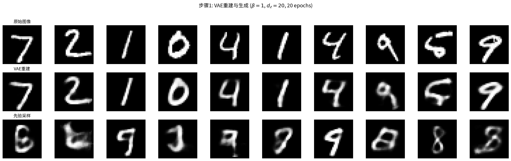
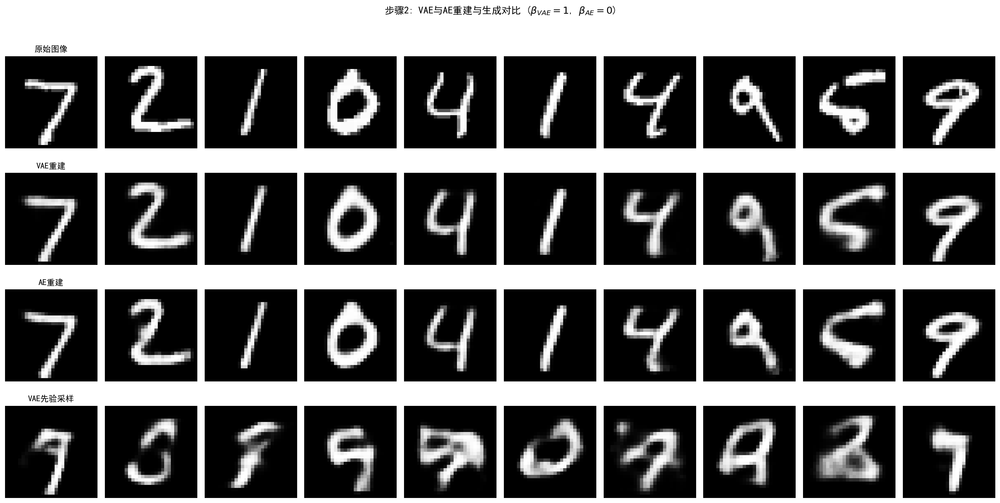
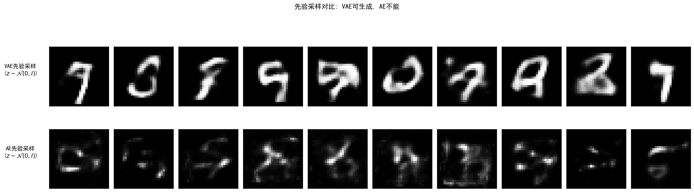

# 9.1 VAE 的直觉：既要压缩又要生成

> **本节路标**：上一节我们埋下了一个钩子——"让神经网络来当变分分布 $q_\phi$"。这一节就把它落到实处：编码器负责"从图推出隐变量的分布"，解码器负责"从隐变量画出图"。两者合起来，就是变分推断第一次穿上了神经网络的外衣。

## 先抛一个痛点：你既想压缩，又想生成

想象你在做一个"图像压缩器"。最朴素的需求是：把一张 $28\times28$ 的图（784 个数字）压进一个很短的"编码"，比如 20 个数字；之后光凭这 20 个数字，还能把图大致还原回来。这件事普通自编码器（AE）就能干。

但真正让人心动的是另一件事：**能不能不用任何原图，只凭那个"短编码"，凭空造出一张全新的、看起来合理的图？**

矛盾就在这里——

- 如果你只追求"压缩 + 还原"（像普通 AE），编码器会把每张图随便扔到隐空间的某个角落，根本不关心这些角落之间有没有"空隙"。结果：给你一个角落里的点能还原，可如果你在隐空间里随便指一个空位（比如两个训练簇之间的洞），解码器从没见过那里，还原出来就是一团乱码。**能压缩，不能生成。**
- 相反，如果你想要"能生成"，就必须让所有编码点规规矩矩地待在一片连续、有秩序的区域里，这样从任何位置取样都能解码出像样的图。

> **日常类比**：普通 AE 像一台"打包-拆包"机器，只关心"能不能把东西原样还原"，至于打包后的箱子该怎么摆放，它根本不管——所以箱子可能东一个西一个，中间全是空隙。VAE 则额外加了一条规矩：所有箱子必须码放在一个整齐的网格（标准正态）附近。代价是还原时略微失真，但好处是你随便在网格里指一个空位，都能拆出一个像样的物件——这就叫"能生成"。

所以 VAE 的灵魂问题不是"怎么压缩"，而是"怎么让编码既装得下信息、又规规矩矩能被采样生成"。这，就是下面整套架构要解决的。

**本节目标**：
- 理解为什么手工设计的变分族不够用，必须交给神经网络；
- 看清编码器"输出分布而非点"和 AE 的本质区别；
- 看懂 VAE 的概率图模型（生成 + 推断双向结构）以及先验为何偏偏选标准正态。

---

## 手工设计的变分族，够用吗？

回忆第 8 章。给定一个观测 $x$，我们想推断隐变量 $z$ 的后验 $p(z|x)$。算不出来，于是我们引入一个"替身"分布 $q_\phi(z|x)$，逼它尽量贴近真实后验，手段是最大化下面这个 ELBO（证据下界）：

$$\max_\phi \text{ELBO}(\phi) = \max_\phi \mathbb{E}_{q_\phi(z|x)}\left[\log \frac{p(x,z)}{q_\phi(z|x)}\right]$$

第 8 章为了能算，用了"平均场近似"——强行假设 $q_\phi(z|x) = \prod_j q_\phi(z_j|x)$，也就是隐变量的每个分量相互独立。这就像为了画图方便，硬说一幅画里"天空"和"房子"毫无关系。

**问题来了**：真实后验里，隐变量常常是"缠"在一起的。比如一张人脸，$z_1$ 管朝向、$z_2$ 管表情，可朝向一变，光照阴影也跟着变，$z_1$ 和 $z_3$ 就关联上了。平均场假装它们独立，等于主动丢掉了信息。我们能不能不手工规定 $q_\phi$ 长啥样，而是让它**自己学**？

VAE 的核心回答就是：**不手工设计变分族，用神经网络自动学**。具体来说，摆两个网络：

- 编码器网络（encoder）$q_\phi(z|x)$：吃进 $x$，吐出 $z$ 的分布参数；
- 解码器网络（decoder）$p_\theta(x|z)$：吃进 $z$，吐出 $x$ 的分布参数。

这样一来，变分族不再是一个被你事先框死的简化假设，而是一个由神经网络参数化的、灵活到能拟合复杂后验的大家族。网络参数 $(\phi,\theta)$ 通过最大化 ELBO 一起学出来。

**命名小解糖**：
- *Variational*（变分）——因为它的训练目标就是 ELBO，本质是变分推断；
- *Autoencoder*（自编码）——因为它有"编码器把 $x$ 压成 $z$、解码器把 $z$ 还原成 $x$"的结构；
- 但它**不是**普通自编码器——它是概率性的、可生成的、带正则化的。

---

## 从最简具体情形起步：2 维数据、2 维潜变量

别一上来就被 MNIST 的 784 维吓到。我们先想象一个**最朴素**的场景：你的数据 $x$ 只有 2 个实数（比如平面上的一堆点），你想把它压进一个 **2 维的隐空间** $z\in\mathbb{R}^2$。

直觉上，如果这堆点其实是沿着某条弯曲的"细线"分布的（流形假设，详见 9.4），那 2 维隐变量就该把这条线的"位置"记下来。传统自编码器会直接给你一个固定的点 $z=g_\phi(x)$；但 VAE 不这么干——它说：*"我不确定 $x$ 到底对应隐空间的哪个精确位置，我给你一个**分布**"*。

于是编码器输出两样东西：一个"中心" $\mu_\phi(x)$，一个"不确定范围" $\sigma_\phi(x)$。真要采样时，就在以 $\mu$ 为中心、以 $\sigma$ 为半径的范围内随机取一个 $z$。这就是"建模分布而非确定性映射"的最直白版本。

> **点 vs 分布**：普通 AE 给你一个**确定的点**（一张图 → 一个编码向量）；VAE 给你一个**分布**（一张图 → 一团以 $\mu$ 为中心、$\sigma$ 为半径的"可能位置"云）。正因为这团云彼此重叠、连续，你才能从中间任意采样生成新图——这是 VAE 和 AE 的分水岭。

---

## 识别模型（编码器）：它输出的是"分布参数"，不是"点"

编码器（也叫识别模型，recognition model）定义了近似后验 $q_\phi(z|x)$。为什么我们需要它输出分布参数而不是一个确定的点？因为第 8 章告诉我们，要逼近真实后验 $p(z|x)$，替身 $q_\phi$ 必须是一个**分布**；而前面的矛盾分析也说明，只有让编码"成团、连续"，才能生成。

所以编码器看到 $x$，吐出均值和方差，再认定隐变量服从对应高斯：

$$(\mu_\phi(x), \log \sigma_\phi^2(x)) = \text{Encoder}_\phi(x)$$

$$q_\phi(z|x) = \mathcal{N}(z | \mu_\phi(x), \text{diag}(\sigma_\phi^2(x)))$$

白话翻译：编码器看到 $x$，吐出均值向量 $\mu_\phi(x)\in\mathbb{R}^{d_z}$ 和方差向量 $\sigma_\phi^2(x)\in\mathbb{R}^{d_z}$；然后我们认定"隐变量 $z$ 服从以 $\mu$ 为均值、以 $\sigma^2$ 为对角方差的高斯分布"。这里 $d_z$ 是隐空间维度，通常远小于数据维度 $d_x$。

> **小细节，大有讲究**：代码里编码器输出的是 $\log\sigma_\phi^2$ 而不是 $\sigma_\phi^2$。原因有三：(1) 取指数 $\exp(\cdot)$ 自动保证方差为正；(2) 数值上更稳定；(3) 允许输出负值，从而能表达 $\sigma^2<1$（编码器很"自信"、分布很窄）的情况。

**对角协方差假设**说的是：给定 $x$ 时，$z$ 的各个分量条件独立（协方差矩阵只有对角线上有值）。这是个简化，但实战中够用，而且——关键好处——它让 KL 散度能一个维度一个维度分别算（9.3 节会用到）。想要更灵活也行，用满秩协方差（9.2 节的 Cholesky 写法），但代价是参数量从 $O(d_z)$ 暴涨到 $O(d_z^2)$。

**摊推断（Amortized Inference）**是个值得记住的词。传统变分推断要对每个数据点 $x_i$ 单独优化一套变分参数，慢得要命；VAE 的编码器用**同一套共享参数 $\phi$**，一次前向传播就给出任意 $x_i$ 的 $q_\phi(z|x_i)$。相当于把"推断"这件事"摊销"到了一个网络里，效率飞升，尤其是数据量大时。

---

## 生成模型（解码器）：从隐变量"画"回观测

解码器（也叫生成模型，generative model）定义了似然分布 $p_\theta(x|z)$。既然编码器吐的是分布参数，解码器这边也得对称地吐出"给定 $z$ 时 $x$ 的分布参数"——这保证了整个 VAE 是一个完整的概率生成模型。

$$f_\theta(z) = \text{Decoder}_\theta(z)$$

根据数据类型不同，我们选不同的输出分布：

**连续数据**（比如自然图像的像素值）：

$$p_\theta(x|z) = \mathcal{N}(x | f_\theta(z), \sigma_{\text{dec}}^2 I)$$

这时 $\log p_\theta(x|z) = -\frac{\|x - f_\theta(z)\|^2}{2\sigma_{\text{dec}}^2} + \text{const}$，重建项等价于我们熟悉的 MSE（均方误差）损失。

**二值数据**（比如二值化后的 MNIST）：

$$p_\theta(x|z) = \text{Bernoulli}(x | f_\theta(z))$$

这时 $\log p_\theta(x|z) = \sum_j [x_j \log f_\theta(z)_j + (1-x_j)\log(1-f_\theta(z)_j)]$，重建项等价于交叉熵损失。

$\sigma_{\text{dec}}^2$ 可以当超参数固定（比如设为 1），也可以让它跟着学。实践里两种都常见。

---

## 实验 9.1-1：VAE重建与生成能力验证（含AE对比）

实验 `9.1-1.py` 演示**VAE与传统自编码器（AE）的核心差异**：VAE建模的是分布而非确定性映射，这使得VAE不仅能重建，还能从先验采样生成新样本——这是AE无法做到的。

### 实验场景

实验在MNIST手写数字数据集上训练两个模型：
- **VAE**：$\beta = 1$（标准VAE），编码器输出分布参数 $(\mu, \log\sigma^2)$，训练目标为ELBO（重建项 + KL正则化项）
- **AE**：$\beta = 0$（KL项为零），编码器仍输出 $(\mu, \log\sigma^2)$，但仅优化重建项

对比两种模型的：
1. **重建能力**：从测试图像 $x$ 编码后解码重建 $\hat{x}$
2. **生成能力**：从先验 $\mathcal{N}(0, I)$ 随机采样 $z$，经解码器生成图像

### 实验目的

1. **验证VAE建模分布而非确定性映射**：编码器输出分布参数 $(\mu, \log\sigma^2)$，而非单点 $z$
2. **验证VAE能重建**：重建图像保留原始数字的主要特征（虽略有模糊）
3. **验证VAE能生成**：从先验采样的 $z$ 经解码器生成可识别的数字图像
4. **对比AE无法生成**：AE的隐空间无KL约束，从 $\mathcal{N}(0,I)$ 采样解码无意义

### 实验输入

| 参数 | 设置 |
|------|------|
| 数据集 | MNIST，$28 \times 28$ 灰度图像（$d_x = 784$） |
| 隐空间维度 | $d_z = 20$ |
| 编码器架构 | FC 784 → 400 → $(\mu, \log\sigma^2)$ 各20维 |
| 解码器架构 | FC 20 → 400 → 784（sigmoid激活） |
| VAE参数 | $\beta = 1$（标准VAE） |
| AE参数 | $\beta = 0$（仅重建项） |
| 训练轮数 | 20 epochs，batch size 128 |
| 优化器 | Adam，lr = 1e-3 |

### 预期结果

- **VAE重建**：略模糊（KL正则化的代价，信息瓶颈），但保留数字特征
- **VAE生成**：从 $\mathcal{N}(0,I)$ 采样经解码器生成可识别的数字
- **AE重建**：更清晰（无KL约束，编码自由度高）
- **AE生成**：从 $\mathcal{N}(0,I)$ 采样解码为无意义图像（隐空间存在空洞）

### 实验结果

运行 `9.1-1.py` 后，生成三张图。实验结果如下：

---

#### 步骤1：VAE重建与先验采样



第一行展示原始测试图像，第二行展示VAE重建结果（使用后验均值 $\mu$ 作为隐表示），第三行展示从先验 $\mathcal{N}(0,I)$ 随机采样经解码器生成的图像。

**观察要点**：
- VAE重建保留了数字的主要特征，但略有模糊——这是KL正则化约束编码分布的代价
- VAE先验采样生成的图像是可识别的数字，证明隐空间经KL正则化后变得连续有规律

---

#### 步骤2：VAE与AE重建对比



对比VAE（$\beta=1$）与AE（$\beta=0$）的重建质量：
- **VAE重建**（第二行）：略模糊，但数字可识别
- **AE重建**（第三行）：更清晰锐利，边缘细节保留更好
- **VAE先验采样**（第四行）：生成可识别的数字

**原因分析**：AE无KL约束，编码器可以自由地将每个图像映射到隐空间的任意位置，重建误差最小化是其唯一目标。VAE的KL项约束编码分布接近 $\mathcal{N}(0,I)$，牺牲了部分重建精度，换取隐空间的规律性。

---

#### 步骤3：AE无法生成对比



直观展示VAE与AE生成能力的本质差异：
- **VAE先验采样**（第一行）：生成可识别的数字，隐空间有规律
- **AE先验采样**（第二行）：生成有结构但无语义的图像，隐空间存在空洞

**关键结论**：AE的隐空间未经KL正则化，编码器输出的编码可能分布在隐空间的某些特定区域，而从 $\mathcal{N}(0,I)$ 随机采样的 $z$ 可能落入这些区域之外的"空洞"——解码器在这些空洞区域没有学到有效的映射，输出无意义的图像。

> **实现说明**：本实验的AE采用 $\beta=0$ 的VAE退化形式（编码器仍输出 $(\mu, \log\sigma^2)$），而非架构上移除方差分支的纯确定性编码器。训练时 $\log\sigma^2$ 会趋向很负值，效果上逼近确定性编码。因此AE先验采样图像呈现"有结构但无语义"的特征，而非完全随机噪声。此实现便于复用同一套代码框架，不影响VAE/AE核心差异的展示。

---

#### 核心知识点验证

| 知识点（9.1节理论） | 实验验证 |
|---------------------|----------|
| VAE编码器输出分布参数 $(\mu, \log\sigma^2)$ | 代码中 `Encoder.forward()` 返回 `(mu, logvar)` |
| VAE解码器输出似然参数 | 使用sigmoid激活输出伯努利概率 |
| VAE重建略模糊（KL代价） | 步骤2对比图直观展示 |
| VAE能从先验生成 | 步骤1、3的VAE先验采样生成可识别数字 |
| AE隐空间无规律 → 无法生成 | 步骤3的AE先验采样为无意义图像 |

---

## VAE的概率图模型：一个"生成 + 推断"的双向结构

既然编码器输出分布、解码器也输出分布，整个 VAE 就定义了一个简单的潜变量模型（Latent Variable Model，就是"数据由少数隐变量生成"的模型）。我们得把它画清楚，因为它正是第 8 章变分框架的"神经网络实例化"。

$$z \sim p(z) = \mathcal{N}(0, I_{d_z}), \quad x \sim p_\theta(x|z)$$

生成图模型是 $z \to x$：先从先验采样隐变量 $z$，再由解码器 $p_\theta(x|z)$ 生成观测 $x$。VAE 完整的概率图模型其实有两个方向：

- **生成方向**（实线）：$z \to x$，由先验 $p(z)$ 和似然 $p_\theta(x|z)$ 定义；
- **推断方向**（虚线）：$x \to z$，由编码器 $q_\phi(z|x)$ 近似真实后验 $p(z|x)$。

> **[图示位置]**：VAE的概率图模型——左侧为生成模型（实线箭头 $z \to x$，方框标注 $p(z)$ 和 $p_\theta(x|z)$），右侧为推断模型（虚线箭头 $x \to z$，方框标注 $q_\phi(z|x)$），中间用双向箭头或并列展示两个方向。外围用plate记号方框标注 $N$（数据点个数）。

这种"生成+推断"的双向结构，是 VAE 的灵魂——**生成模型规定了数据的概率规律，推断模型高效地近似了后验**。两者被同一个 ELBO 训练目标绑在了一起。

**为什么先验偏偏选 $p(z)=\mathcal{N}(0,I)$？** 看似随意，实则有四个硬理由：

1. **计算便利**：标准正态的 KL 散度有闭式解（9.3、附录9B）；
2. **重参数化友好**：标准正态采样 $z=\mu+\sigma\odot\epsilon$（$\epsilon\sim\mathcal{N}(0,I)$）天然支持重参数化（9.2）；
3. **隐空间结构**：KL 正则把编码分布推向 $\mathcal{N}(0,I)$，让隐空间连续、有规律，支持插值和采样生成；
4. **表达能力**：先验虽简单，但配上一个足够灵活的解码器 $f_\theta$，复杂的数据分布 $p_\theta(x)$ 也能由"简单先验 + 非线性映射"变出来。

边际分布 $p_\theta(x)=\int p_\theta(x|z)p(z)dz$ 在 $p_\theta(x|z)$ 为高斯时是个"无穷混合高斯"，理论上表达力足够——通用近似定理（附录9C）保证 VAE 能逼近任意连续分布。

**VAE 的完整数据流**（把上面的网络画成一条流水线）：

```
输入 x
   │
   ▼
┌─────────────────┐
│  编码器 Encoder_φ │
│  输入: x          │
│  输出: μ_φ(x),    │
│        logσ²_φ(x) │
└────────┬────────┘
         │
         ▼
   采样: z = μ_φ(x) + σ_φ(x) ⊙ ε,  ε ~ N(0,I)
         │
         ▼
┌─────────────────┐
│  解码器 Decoder_θ │
│  输入: z          │
│  输出: f_θ(z)     │
└────────┬────────┘
         │
         ▼
   重建: x̂ ≈ x
```

> **[图示位置]**：VAE架构示意图——左端为输入 $x$，经编码器输出 $\mu_\phi(x)$ 和 $\sigma_\phi^2(x)$，重参数化采样 $z$，经解码器输出 $\hat{x} = f_\theta(z)$。图中应标注ELBO的两个组成部分：重建项比较 $x$ 与 $\hat{x}$，KL项比较 $q_\phi(z|x)$ 与 $p(z)$。

---

## 与传统自编码器（AE）的区别：一句话点破

普通自编码器（AE）和 VAE 都有"编码器-解码器"，但骨子里是两回事。先看一张对照表，再讲直觉：

| 特征 | 传统自编码器 (AE) | 变分自编码器 (VAE) |
|---|---|---|
| 编码器输出 | 确定性隐表示 $z = g_\phi(x)$ | 隐变量的分布参数 $\mu_\phi(x), \sigma_\phi^2(x)$ |
| 隐变量 | 确定性向量 | 随机变量 $z \sim q_\phi(z\mid x)$ |
| 解码器输出 | 确定性重建 $\hat{x} = f_\theta(z)$ | 重建分布参数 $p_\theta(x\mid z)$ |
| 训练目标 | 重建误差 $\|x - f_\theta(g_\phi(x))\|^2$ | ELBO（重建 + KL正则化） |
| 正则化 | 无（或需额外添加） | 内置KL正则化 |
| 隐空间结构 | 无保证，可能不连续 | 趋于连续、有规律 |
| 生成能力 | 无（隐空间无先验） | 有（$z \sim \mathcal{N}(0,I)$ → 解码器） |
| 概率解释 | 无 | 完整的概率生成模型 |

> **[图示位置]**：对比图——左侧为传统AE的隐空间，可能呈现不规则的簇状分布，区域间有"空洞"（解码器在这些区域输出无意义图像）；右侧为VAE的隐空间，编码分布相互重叠，形成连续的、有规律的空间结构。

---

**来源**：Kingma & Welling (2014) "Auto-Encoding Variational Bayes"; Tutorial_Diffusion_Imaging_Vision Sec 1.1; 01-vae.ipynb; Rezende et al. (2014)

## 收尾：为什么这件事重要

VAE 把第 8 章那个抽象、手工的变分框架，第一次变成了"一对能自己学后验形状的神经网络"。编码器输出**分布而不是点**，是整件事能既"压缩"又"生成"的命根子——因为分布成团、连续，你才敢在隐空间里随便取样去造新图。但架构搭好了，还有一个致命障碍没解决：采样操作不可微，梯度无法穿过随机节点 $z \sim q_\phi(z|x)$。这就是下一节重参数化技巧要解决的——而且它会是一个让你拍大腿的"反直觉"巧思。
