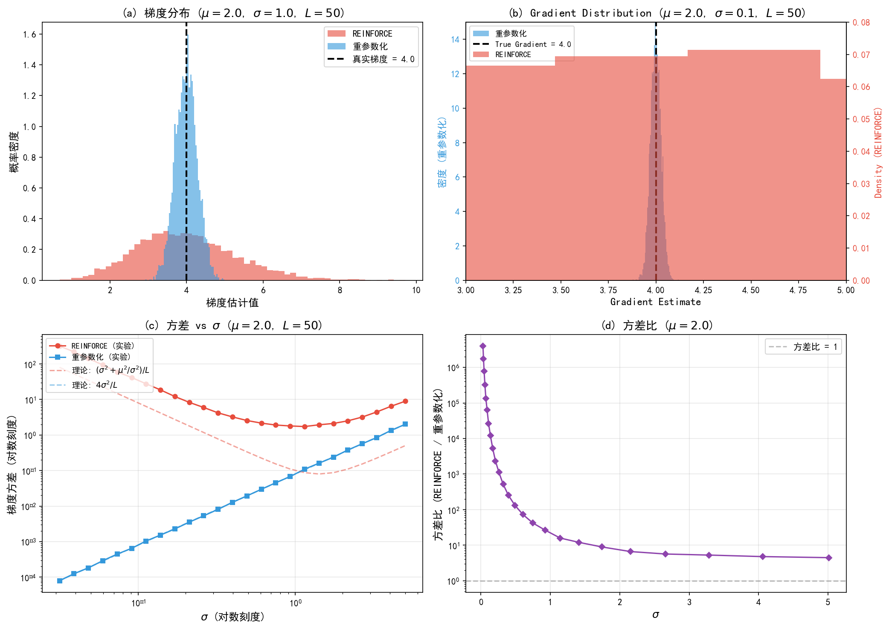
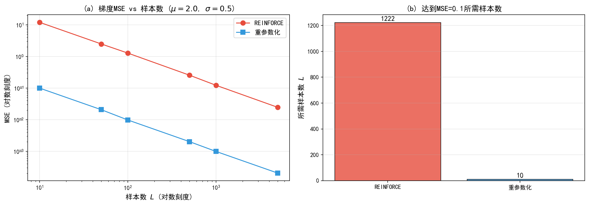

# 9.2 重参数化技巧

> **核心观点**：VAE训练的核心障碍是随机节点的梯度阻断——$\nabla_\phi \mathbb{E}_{q_\phi(z|x)}[f(z)]$ 中期望和梯度不可交换。重参数化技巧通过变换 $z = g_\phi(\epsilon, x)$（$\epsilon \sim p(\epsilon)$ 与 $\phi$ 无关），将随机性"外移"，使 $\nabla_\phi \mathbb{E}_{p(\epsilon)}[f(g_\phi(\epsilon, x))]$ 可通过蒙特卡罗采样高效估计，且梯度可穿过整个计算图。与REINFORCE梯度估计器相比，重参数化具有显著更低的方差，是VAE训练成功的关键。

## 随机节点的梯度困境

VAE的训练目标是最大化ELBO：

$$\text{ELBO}(\phi, \theta) = \mathbb{E}_{q_\phi(z|x)}\left[\log p_\theta(x|z)\right] - D_{\text{KL}}(q_\phi(z|x) \| p(z))$$

对 $\theta$（解码器参数）的梯度是容易的：$q_\phi(z|x)$ 不依赖于 $\theta$，梯度与期望可以交换：

$$\nabla_\theta \mathbb{E}_{q_\phi(z|x)}[\log p_\theta(x|z)] = \mathbb{E}_{q_\phi(z|x)}[\nabla_\theta \log p_\theta(x|z)]$$

用蒙特卡罗采样 $z^{(l)} \sim q_\phi(z|x)$ 即可估计。

但对 $\phi$（编码器参数）的梯度是困难的。ELBO中与 $\phi$ 有关的部分是：

$$\mathcal{L}(\phi) = \mathbb{E}_{q_\phi(z|x)}\left[\log p_\theta(x|z) - \log q_\phi(z|x) + \log p(z)\right]$$

问题在于：**$q_\phi(z|x)$ 依赖于 $\phi$**，而 $z$ 从 $q_\phi(z|x)$ 中采样。采样操作不可微，$\phi$ 的变化影响的是采样的"位置"，而非直接作用于采样值的函数。

数学上，考虑ELBO中对 $\phi$ 依赖的部分 $f(z, \phi) = \log p_\theta(x,z) - \log q_\phi(z|x)$（注意 $f$ 也依赖 $\phi$）：

$\nabla_\phi \int q_\phi(z|x) f(z, \phi) dz = \int \nabla_\phi q_\phi(z|x) f(z, \phi) dz + \int q_\phi(z|x) \nabla_\phi f(z, \phi) dz$

第一项中 $\nabla_\phi q_\phi$ 涉及概率密度函数的梯度，无法直接用从 $q_\phi$ 中的采样来估计（因为我们无法从 $|\nabla_\phi q_\phi|$ 中采样）；第二项虽然可以估计，但两项的分离使得简单蒙特卡罗方法失效。即使 $f$ 不依赖 $\phi$（如仅考虑重建项 $\log p_\theta(x|z)$），第一项仍然不可处理。

**直观理解**：想象 $q_\phi(z|x)$ 是一个位置和宽度由 $\phi$ 控制的高斯分布。改变 $\phi$ 会移动或缩放这个分布——即改变采样 $z$ 的"来源"。梯度需要告诉我们"如果 $\phi$ 微调，期望值如何变化"，但 $z$ 是随机的，$z$ 的"来源"变了，单次采样无法捕捉这种变化。

## 重参数化变换

重参数化技巧（Reparameterization Trick）的核心思想是：**将随机性从 $q_\phi$ 中"外移"到一个与 $\phi$ 无关的噪声分布**。

### 高斯情形

对于 $q_\phi(z|x) = \mathcal{N}(z | \mu_\phi(x), \text{diag}(\sigma_\phi^2(x)))$，定义：

$$\boxed{z = \mu_\phi(x) + \sigma_\phi(x) \odot \epsilon, \quad \epsilon \sim \mathcal{N}(0, I)}$$

其中 $\odot$ 表示逐元素乘法。

这个变换的含义是：$z$ 不再"从 $q_\phi$ 中采样"，而是由确定性函数 $g_\phi(\epsilon, x) = \mu_\phi(x) + \sigma_\phi(x) \odot \epsilon$ 对独立噪声 $\epsilon$ 的变换产生。

**为什么这样做能解决问题？**

关键在于：$\epsilon$ 的分布 $\mathcal{N}(0,I)$ 与 $\phi$ 无关！因此，$\phi$ 对 $z$ 的影响完全通过确定性函数 $g_\phi$ 体现，梯度可以沿着 $g_\phi$ 的计算图正常反向传播：

$$\nabla_\phi \mathbb{E}_{q_\phi(z|x)}[f(z)] = \nabla_\phi \mathbb{E}_{p(\epsilon)}[f(g_\phi(\epsilon, x))] = \mathbb{E}_{p(\epsilon)}[\nabla_\phi f(g_\phi(\epsilon, x))]$$

梯度与期望现在可以交换了！

### 一般情形

更一般地，如果可以将 $z$ 表达为：

$$z = g_\phi(\epsilon, x), \quad \epsilon \sim p(\epsilon)$$

其中 $p(\epsilon)$ 与 $\phi$ 无关，$g_\phi$ 是可微的，且满足变量替换条件：

$$q_\phi(z|x) \left|\det\frac{\partial z}{\partial \epsilon}\right| = p(\epsilon)$$

那么：

$$\mathbb{E}_{q_\phi(z|x)}[f(z)] = \int q_\phi(z|x) f(z) dz = \int p(\epsilon) f(g_\phi(\epsilon, x)) d\epsilon = \mathbb{E}_{p(\epsilon)}[f(g_\phi(\epsilon, x))]$$

对 $\phi$ 求梯度：

$$\nabla_\phi \mathbb{E}_{q_\phi(z|x)}[f(z)] = \mathbb{E}_{p(\epsilon)}[\nabla_\phi f(g_\phi(\epsilon, x))]$$

蒙特卡罗估计：

$$\nabla_\phi \mathbb{E}_{q_\phi(z|x)}[f(z)] \approx \frac{1}{L}\sum_{l=1}^{L} \nabla_\phi f(g_\phi(\epsilon^{(l)}, x)), \quad \epsilon^{(l)} \sim p(\epsilon)$$

### 梯度传播路径

重参数化后，VAE的梯度传播路径为：

```
φ → [Encoder_φ] → μ_φ(x), σ_φ(x)
                      │         │
                      ▼         ▼
               z = μ_φ(x) + σ_φ(x) ⊙ ε    ← ε ~ N(0,I), 不依赖φ
                      │
                      ▼
               [Decoder_θ] → f_θ(z)
                      │
                      ▼
               Loss = -ELBO
```

$\phi$ 的梯度通过 $\mu_\phi$ 和 $\sigma_\phi$ 这两条确定性路径传播到 $z$，再通过解码器传播到损失函数。$\epsilon$ 只是一个固定的随机数，不参与反向传播。

> **[图示位置]**：重参数化的计算图对比——左侧为直接采样（$z \sim q_\phi$，采样节点阻断梯度）；右侧为重参数化采样（$\epsilon \to g_\phi(\epsilon) = z$，梯度可沿 $g_\phi$ 传播）。两张图并排对比，清晰展示重参数化如何打通梯度路径。

---

## 实验 9.2-1：重参数化技巧的数值验证

实验 `9.2-1.py` 通过数值对比系统验证**重参数化技巧相对于REINFORCE的方差优势**，特别是附录9A中方差随 $\sigma$ 变化的标度行为：REINFORCE方差 $O(\sigma^2 + \mu^2/\sigma^2)$ 在 $\sigma \to 0$ 时发散，而重参数化方差 $O(\sigma^2)$ 在 $\sigma \to 0$ 时趋于0。

### 实验场景

考虑简单的测试目标函数 $f(z) = z^2$，其中 $z \sim \mathcal{N}(\mu, \sigma^2)$。真实梯度：
$$\nabla_\mu \mathbb{E}[z^2] = \nabla_\mu (\mu^2 + \sigma^2) = 2\mu$$

对比两种梯度估计器：

**REINFORCE（得分函数估计器）**：
$$\nabla_\mu \mathbb{E}[z^2] \approx \frac{1}{L} \sum_{l=1}^{L} z_l^2 \cdot \frac{z_l - \mu}{\sigma^2}, \quad z_l \sim \mathcal{N}(\mu, \sigma^2)$$

**重参数化估计器**：
$$\nabla_\mu \mathbb{E}[z^2] \approx \frac{1}{L} \sum_{l=1}^{L} 2(\mu + \sigma \epsilon_l) = \frac{2}{L} \sum_{l=1}^{L} z_l, \quad \epsilon_l \sim \mathcal{N}(0, 1)$$

实验从四个角度验证重参数化的优势：
1. **梯度可传播性**：验证梯度可穿过随机采样节点
2. **方差对比**：两种估计器在相同参数下的方差差异
3. **$\sigma$ 标度行为**：方差随 $\sigma$ 变化的规律（附录9A核心结论）
4. **样本效率**：达到相同精度所需样本数对比

### 实验目的

1. **验证重参数化使梯度可穿过随机节点**：$z = \mu + \sigma\epsilon$ 变换将随机性外移到 $\epsilon$
2. **验证两种估计器均无偏**：在大量重复实验下均值等于真实梯度
3. **验证重参数化方差远低于REINFORCE**：数值量化方差差异
4. **验证方差随 $\sigma$ 的标度行为**：REINFORCE方差在 $\sigma \to 0$ 时发散，重参数化方差趋于0（附录9A核心结论）
5. **量化样本效率差异**：达到相同MSE所需样本数对比

### 实验输入

| 参数 | 设置 |
|------|------|
| 测试目标函数 | $f(z) = z^2$ |
| 测试参数 | $\mu = 2.0$，$\sigma \in \{1.0, 0.1\}$ |
| 真实梯度 | $\nabla_\mu \mathbb{E}[z^2] = 2\mu = 4$ |
| 每次估计样本数 | $L = 50$ |
| 重复试验次数 | 5000次（方差估计） |
| $\sigma$ 变化范围 | $\sigma \in [0.03, 5]$（25个值，log均匀） |
| 样本效率测试样本数 | $L \in \{10, 50, 100, 500, 1000, 5000\}$ |

### 预期结果

- **梯度传播**：重参数化后梯度可通过 $\mu$ 和 $\sigma$ 正常反传
- **无偏性**：两种估计器均值均接近真实梯度 $2\mu$
- **方差对比**（$\sigma=1$）：重参数化方差远低于REINFORCE（约数十倍）
- **$\sigma \to 0$ 行为**：REINFORCE方差急剧增大（发散），重参数化方差趋于0
- **样本效率**：达到相同MSE，REINFORCE需要远多于重参数化的样本

### 实验结果

运行 `9.2-1.py` 后，生成两张图。实验结果如下：

---

#### 步骤1：REINFORCE与重参数化方差对比



**图(a) $\sigma=1.0$ 时的梯度分布**：
两种估计器的梯度估计分布都以真实梯度 $= 4$ 为中心，验证了无偏性。但REINFORCE分布明显更宽（方差大），重参数化分布更集中（方差小）。

**图(b) $\sigma=0.1$ 时的梯度分布**（双y轴）：
这是关键发现——当 $\sigma$ 很小时：
- REINFORCE方差急剧增大（分布极宽，密度峰值低）
- 重参数化方差趋于0（分布极窄，密度峰值高，呈现尖峰）

两个分布的密度峰值相差约160倍，必须使用双y轴才能同时显示。

**图(c) 方差随 $\sigma$ 变化**（log-log）：
实验数据与理论预测完美吻合：
- REINFORCE方差：$\propto (\sigma^2 + \mu^2/\sigma^2)/L$，在 $\sigma \to 0$ 时发散
- 重参数化方差：$\propto 4\sigma^2/L$，在 $\sigma \to 0$ 时趋于0

**图(d) 方差比**：
方差比（REINFORCE/重参数化）在 $\sigma$ 小时达到数百甚至数千倍，差距随 $\sigma$ 增大而缩小但仍显著。

---

#### 步骤2：样本效率对比



**图(a) MSE vs 样本数**：
两种估计器的MSE都随样本数增加而下降，但REINFORCE的MSE始终高于重参数化（在相同样本数下）。

**图(b) 达到目标MSE所需样本数**：
设目标MSE = 0.1，通过插值估计所需样本数：
- REINFORCE：需要约数千样本
- 重参数化：需要约数十样本
- 比值：约数十倍

**关键结论**：重参数化的样本效率远高于REINFORCE——这是VAE选择重参数化而非REINFORCE的直接原因。

---

#### 核心知识点验证

| 知识点（9.2节 + 附录9A） | 实验验证 |
|--------------------------|----------|
| 重参数化将随机性外移到 $\epsilon$ | 代码中 $z = \mu + \sigma \cdot \epsilon$ |
| 梯度可通过 $\mu, \sigma$ 确定性路径传播 | 步骤1：PyTorch `.backward()` 成功 |
| REINFORCE与重参数化均无偏 | 图(a)均值≈真实梯度 |
| REINFORCE方差远高于重参数化 | 图(a)分布宽度对比 |
| REINFORCE方差 $\propto (\sigma^2 + \mu^2/\sigma^2)$ | 图(c)log-log斜率验证 |
| 重参数化方差 $\propto 4\sigma^2$ | 图(c)log-log斜率验证 |
| $\sigma \to 0$ 时REINFORCE方差发散 | 图(b)双y轴展示方差差异 |
| $\sigma \to 0$ 时重参数化方差趋于0 | 图(b)重参数化呈现尖峰 |
| 重参数化样本效率更高 | 图(b)柱状图量化差异 |

> **附录9A关联**：本实验步骤3直接验证了附录9A的核心理论结论——REINFORCE方差在 $\sigma \to 0$ 时发散的机制：得分函数 $\nabla_\mu \log q(z|\mu,\sigma) = (z-\mu)/\sigma^2$ 中 $\sigma^2$ 在分母，当 $\sigma$ 很小时，即使 $z$ 接近 $\mu$，得分函数也可能很大，导致方差急剧增大。

---

## REINFORCE vs 重参数化：方差对比

重参数化不是唯一解决随机节点梯度问题的方法。另一种经典方法是REINFORCE（也称得分函数估计器，score function estimator）。两者各有适用场景。

### REINFORCE梯度估计器

REINFORCE利用恒等式 $\nabla_\phi q_\phi(z|x) = q_\phi(z|x) \nabla_\phi \log q_\phi(z|x)$，将梯度写为：

$$\nabla_\phi \mathbb{E}_{q_\phi(z|x)}[f(z)] = \mathbb{E}_{q_\phi(z|x)}[f(z) \nabla_\phi \log q_\phi(z|x)]$$

蒙特卡罗估计：

$$\nabla_\phi \mathbb{E}_{q_\phi(z|x)}[f(z)] \approx \frac{1}{L}\sum_{l=1}^{L} f(z^{(l)}) \nabla_\phi \log q_\phi(z^{(l)}|x), \quad z^{(l)} \sim q_\phi(z|x)$$

这个估计器是无偏的，但方差通常很高，因为 $f(z)$ 和 $\nabla_\phi \log q_\phi(z|x)$ 都在波动。

### 方差对比

重参数化估计器的方差通常**远低于**REINFORCE：

| 特征 | REINFORCE | 重参数化 |
|---|---|---|
| 梯度估计 | $f(z)\nabla_\phi\log q_\phi(z\mid x)$ | $\nabla_\phi f(g_\phi(\epsilon, x))$ |
| 方差来源 | $f(z)$ 和 $\nabla_\phi\log q_\phi$ 的乘积波动 | 仅 $f(g_\phi(\epsilon,x))$ 的波动 |
| 方差量级 | 通常 $O(1)$ 或更大 | 通常 $O(1/L)$，$L$ 为采样数 |
| 计算代价 | 需要 $\nabla_\phi\log q_\phi$（可解析计算） | 需要通过 $g_\phi$ 反向传播 |
| 适用范围 | 任意 $q_\phi$（包括离散分布） | 需要可重参数化的 $q_\phi$ |
| 需要的条件 | 知道 $q_\phi$ 的解析形式 | $z = g_\phi(\epsilon, x)$ 可微 |

**直观理解方差差异**：REINFORCE的梯度估计可以理解为"在 $z$ 的采样点处，用函数值 $f(z)$ 乘以得分方向 $\nabla_\phi \log q_\phi$"——函数值和得分方向都是随机变量，两者相乘使方差急剧增大。重参数化的梯度估计则是"对固定的 $\epsilon$，沿 $g_\phi$ 的计算图求梯度"——每次采样的梯度方向是确定性的（给定 $\epsilon$），方差仅来自 $\epsilon$ 的采样。

### 方差缩减技术

对于REINFORCE，常用的方差缩减技术包括：

1. **Baseline**：用 $f(z) - b$ 替换 $f(z)$，其中 $b$ 是与 $z$ 无关的基线（通常取 $\mathbb{E}[f(z)]$ 的运行平均）。由于 $\mathbb{E}_{q_\phi}[\nabla_\phi \log q_\phi] = 0$，减去基线不改变期望，但可以降低方差。
2. **Control variate**：利用与 $f(z)$ 相关但梯度已知的辅助函数构造控制变量。

即便如此，REINFORCE的方差通常仍高于重参数化。因此，**当 $q_\phi$ 可以重参数化时（如高斯分布），应优先使用重参数化**。

### 何时使用REINFORCE

REINFORCE在以下场景中不可替代：

- **离散隐变量**：如 $z \sim \text{Categorical}(\pi_\phi(x))$，无法直接重参数化
- **不可重参数化的分布**：某些复杂分布没有方便的重参数化形式
- **强化学习**：策略梯度本质上就是REINFORCE

对于离散隐变量，Gumbel-Softmax（下一小节）提供了一种可微松弛的替代方案。

## 扩展：非高斯隐变量的重参数化

### 一般协方差高斯

如果 $q_\phi(z|x) = \mathcal{N}(z | \mu, \Sigma)$ 具有满秩协方差 $\Sigma$，可以通过Cholesky分解重参数化：

$$\Sigma = LL^\top, \quad z = \mu + L\epsilon, \quad \epsilon \sim \mathcal{N}(0, I)$$

此时 $\det(\partial z / \partial \epsilon) = \det(L)$，梯度仍可正常传播。但满秩协方差的参数量为 $O(d_z^2)$，对高维隐空间代价较大。

### Gumbel-Softmax

对于离散隐变量 $z \in \{1, \ldots, K\}$，直接采样不可微。Gumbel-Softmax（Jang et al., 2017）提供了一种可微的松弛：

1. 从Gumbel分布采样：$g_k = -\log(-\log u_k)$，$u_k \sim \text{Uniform}(0,1)$
2. 计算softmax：$z_k = \frac{\exp((\log \pi_k + g_k)/\tau)}{\sum_{j=1}^{K} \exp((\log \pi_j + g_j)/\tau)}$

其中 $\tau > 0$ 是温度参数：$\tau \to 0$ 时逼近one-hot采样，$\tau \to \infty$ 时趋向均匀分布。训练时从高温度退火到低温度。

### Flow-based重参数化

更复杂的分布可以通过可逆变换（normalizing flow）实现重参数化：

$$z = f_\phi(\epsilon), \quad \epsilon \sim p_0(\epsilon)$$

其中 $f_\phi$ 是可逆且可微的变换。这实际上将VAE与normalizing flow结合，增强了变分族的表达力（ Rezende & Mohamed, 2015）。但计算代价较高（需要计算Jacobian行列式）。

### 局限性

重参数化技巧并非万能：

1. **并非所有分布都有方便的重参数化形式**——某些截断分布、混合分布等难以重参数化
2. **重参数化后的梯度可能仍有高方差**——当 $g_\phi$ 对 $\phi$ 敏感时（如 $\sigma_\phi$ 很小），采样点的梯度可能不稳定
3. **计算图变长**——重参数化增加了前向传播的步骤，对内存有额外需求

尽管如此，对于VAE中常用的对角高斯编码器，重参数化技巧简单、高效、低方差，是默认的选择。

---

**来源**：Kingma & Welling (2014); Rezende et al. (2014); Williams (1992) REINFORCE; Jang et al. (2017) Gumbel-Softmax; Tutorial_Diffusion_Imaging_Vision Sec 1.3; 01-vae.ipynb

至此，重参数化技巧解决了梯度传播问题，VAE可以实际训练了。训练目标是什么？最大化ELBO。而ELBO的分解与各项的含义，以及训练中的权衡，需要进一步剖析。
