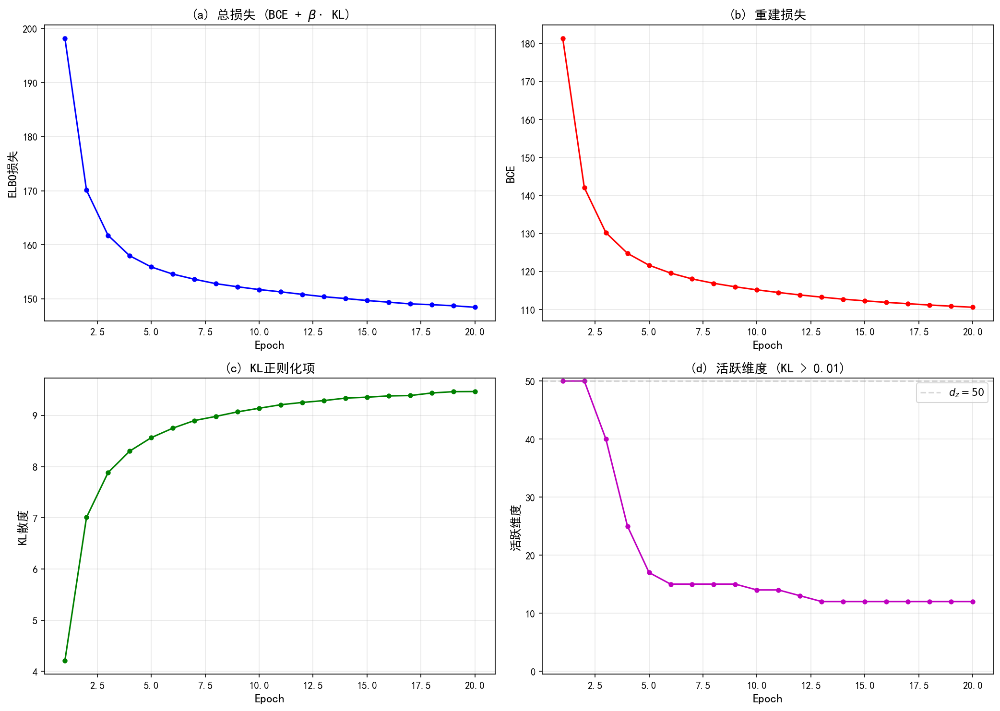

# 9.3 ELBO训练与KL正则化

> **核心观点**：VAE的训练目标 $\max_{\phi,\theta} \text{ELBO}(\phi,\theta)$ 分解为重建项（驱动解码器精确还原输入）和KL正则化项（约束编码器输出接近先验）。两者的权衡塑造了隐空间的结构：KL项过强导致后验坍缩，过弱则隐空间缺乏规律性。$\beta$-VAE通过引入超参数 $\beta$ 显式控制这一权衡，在连续性和重建质量之间取得平衡，并促进解纠缠表示。

## VAE训练目标

回顾第8章的ELBO分解：

$$\log p_\theta(x) = \text{ELBO}(\phi,\theta) + D_{\text{KL}}(q_\phi(z|x) \| p(z|x))$$

由于 $D_{\text{KL}} \geq 0$，有 $\log p_\theta(x) \geq \text{ELBO}(\phi,\theta)$。VAE的训练目标就是最大化ELBO：

$$\max_{\phi, \theta} \text{ELBO}(\phi, \theta) = \max_{\phi, \theta} \left\{ \mathbb{E}_{q_\phi(z|x)}[\log p_\theta(x|z)] - D_{\text{KL}}(q_\phi(z|x) \| p(z)) \right\}$$

两项各有其角色：

- **重建项** $\mathbb{E}_{q_\phi(z|x)}[\log p_\theta(x|z)]$：让解码器从 $z$ 还原 $x$，驱动信息保真
- **KL正则化项** $D_{\text{KL}}(q_\phi(z|x) \| p(z))$：让编码器输出接近标准正态，驱动隐空间规律化

对整个数据集，训练目标为：

$$\max_{\phi, \theta} \sum_{i=1}^{N} \text{ELBO}(\phi, \theta; x_i)$$

实践中用随机梯度下降，每个小批量估计：

$$\mathcal{L}(\phi, \theta) = \frac{1}{|\mathcal{B}|} \sum_{i \in \mathcal{B}} \left[ -\mathbb{E}_{q_\phi(z|x_i)}[\log p_\theta(x_i|z)] + D_{\text{KL}}(q_\phi(z|x_i) \| p(z)) \right]$$

最小化 $\mathcal{L}$ 等价于最大化ELBO。

## 重建项

### 高斯解码器情形

当 $p_\theta(x|z) = \mathcal{N}(x | f_\theta(z), \sigma_{\text{dec}}^2 I)$ 时：

$$\log p_\theta(x|z) = -\frac{\|x - f_\theta(z)\|^2}{2\sigma_{\text{dec}}^2} - \frac{d_x}{2}\log(2\pi\sigma_{\text{dec}}^2)$$

因此重建项为：

$$\mathbb{E}_{q_\phi(z|x)}[\log p_\theta(x|z)] = -\frac{1}{2\sigma_{\text{dec}}^2}\mathbb{E}_{q_\phi(z|x)}[\|x - f_\theta(z)\|^2] + \text{const}$$

即：**最大化重建项等价于最小化MSE损失**（乘以因子 $1/(2\sigma_{\text{dec}}^2)$）。

### 伯努利解码器情形

当 $p_\theta(x|z) = \text{Bernoulli}(x | f_\theta(z))$ 时：

$$\log p_\theta(x|z) = \sum_{j=1}^{d_x} [x_j \log f_\theta(z)_j + (1-x_j)\log(1-f_\theta(z)_j)]$$

即：**最大化重建项等价于最小化交叉熵损失**。

### 蒙特卡罗估计

利用9.2节的重参数化技巧，重建项用单样本估计（$L=1$）：

$$\mathbb{E}_{q_\phi(z|x)}[\log p_\theta(x|z)] \approx \log p_\theta(x | z^{(1)})$$

其中 $z^{(1)} = \mu_\phi(x) + \sigma_\phi(x) \odot \epsilon^{(1)}$，$\epsilon^{(1)} \sim \mathcal{N}(0, I)$。

在实践中，$L=1$ 通常足够——小批量中已有多个数据点提供平均效果。当编码器方差较小时，$q_\phi(z|x)$ 高度集中在 $\mu_\phi(x)$ 附近，单样本估计已经相当准确。

## KL正则化项

### 高斯情形的闭式解

当 $q_\phi(z|x) = \mathcal{N}(\mu_\phi(x), \text{diag}(\sigma_\phi^2(x)))$ 且 $p(z) = \mathcal{N}(0, I)$ 时，KL散度有闭式解（推导见附录9B）：

$$\boxed{D_{\text{KL}}(q_\phi(z|x) \| p(z)) = \frac{1}{2}\sum_{j=1}^{d_z}\left(\mu_j^2 + \sigma_j^2 - \log \sigma_j^2 - 1\right)}$$

其中 $\mu_j = [\mu_\phi(x)]_j$，$\sigma_j^2 = [\sigma_\phi^2(x)]_j$。

这个闭式解的每一项都有明确的含义：

- $\mu_j^2$：惩罚均值偏离0——"编码不要太偏"
- $\sigma_j^2$：惩罚方差偏离1——"编码不要太宽"
- $-\log\sigma_j^2$：惩罚方差太小——"编码不要太窄"
- $-1$：常数项，使得当 $\mu_j = 0, \sigma_j^2 = 1$ 时 $D_{\text{KL}} = 0$

### KL项的几何含义

KL正则化项推动每个 $q_\phi(z_j|x) = \mathcal{N}(\mu_j, \sigma_j^2)$ 向标准正态 $\mathcal{N}(0, 1)$ 靠拢。这意味着：

1. **各编码分布的中心 $\mu_j$ 趋于0**：不同数据点的编码聚集在原点附近
2. **各编码分布的方差 $\sigma_j^2$ 趋于1**：编码分布有适度的扩散
3. **不同数据点的编码分布相互重叠**：形成连续的隐空间

> **[图示位置]**：KL正则化效果示意图——左上角为无KL正则化时不同类别数据的编码分布（各簇分散，互不重叠）；右上角为有KL正则化时（各簇聚集在原点附近，分布重叠）。下方展示从隐空间不同位置采样的生成结果，对比有无KL正则化的隐空间连续性。

---

## 实验 9.3-1：KL训练动态观察

实验 `9.3-1.py` 演示**VAE训练过程中KL散度、重建损失和活跃维度的动态变化**，验证9.3节的核心观点：KL从接近0逐步上升，表明编码器逐渐使用隐空间；重建与KL的权衡塑造隐空间结构；活跃维度检测后验坍缩。

### 实验场景

实验在MNIST数据集上训练VAE，使用较强KL正则化（$\beta = 4$）和较大隐空间维度（$d_z = 50$），刻意制造冗余隐空间以展示后验坍缩现象。训练过程中监控：
- **总损失**：ELBO = BCE + $\beta \cdot$ KL
- **重建损失（BCE）**：衡量解码器重建能力
- **KL散度**：衡量编码分布与先验的偏离
- **活跃维度**：$D_{\text{KL}}(q(z_j|x) \| p(z_j)) > 0.01$ 的维度数

### 实验目的

1. **验证KL从接近0逐步上升**：训练初期编码器优先降低重建损失，KL接近0；随后KL逐步上升，编码器开始使用隐空间
2. **验证重建损失持续下降**：解码器逐渐学会从隐表示重建输入
3. **观察活跃维度动态变化**：验证后验坍缩检测方法
4. **展示重建-KL权衡**：KL上升的同时BCE下降，两者达到平衡

### 实验输入

| 参数 | 设置 |
|------|------|
| 数据集 | MNIST，$28 \times 28$ 灰度图像 |
| 隐空间维度 | $d_z = 50$（刻意制造冗余） |
| KL正则化系数 | $\beta = 4.0$（强KL正则化） |
| 编码器架构 | FC 784 → 400 → $(\mu, \log\sigma^2)$ 各50维 |
| 解码器架构 | FC 50 → 400 → 784（sigmoid激活） |
| 训练轮数 | 20 epochs，batch size 128 |
| 活跃维度阈值 | KL > 0.01 |

> **设计意图**：$\beta = 4$ 配合 $d_z = 50$ 制造信息瓶颈压力——50维隐空间对于MNIST的10个类别存在冗余，强KL正则化会迫使部分维度"坍缩"（KL接近0），展示活跃维度的动态变化。

### 预期结果

- **KL动态**：从接近0逐步上升（训练初期编码器未使用隐空间）
- **BCE动态**：持续下降（解码器学习重建）
- **活跃维度**：动态变化，可能少于50（部分维度坍缩）
- **总损失**：持续下降（ELBO上升）

### 实验结果

运行 `9.3-1.py` 后，生成一张训练曲线图。实验结果如下：

---

#### 步骤1：训练曲线可视化

**图(a) 总损失（ELBO）**：
损失持续下降，表明ELBO持续上升——训练有效。

**图(b) 重建损失（BCE）**：
BCE从初始值逐步下降，解码器逐渐学会从隐表示重建输入。下降趋势在训练后期放缓，趋于稳定——信息瓶颈效应。

**图(c) KL散度**：
这是关键观察——KL散度从接近0逐步上升。训练初期编码器优先降低重建损失（对编码分布施加较强约束以最小化KL），随后KL逐步上升，编码器开始"使用"隐空间携带更多信息。

**图(d) 活跃维度**：
活跃维度（KL > 0.01的维度数）动态变化。由于 $\beta = 4$ 的强KL正则化，部分隐维度被"压制"（KL接近0），活跃维度可能少于50——这是后验坍缩的温和表现。

> **活跃维度解读**：每个隐维度 $z_j$ 的 KL 贡献 $D_{\text{KL}}(q(z_j|x) \| p(z_j)) = \frac{1}{2}(\mu_j^2 + \sigma_j^2 - \log\sigma_j^2 - 1)$。当某维度被"忽略"时，编码器输出 $\mu_j \approx 0, \sigma_j^2 \approx 1$，KL贡献接近0。活跃维度统计直观展示哪些维度真正参与了信息编码。

---

#### 核心知识点验证

| 知识点（9.3节理论） | 实验验证 |
|---------------------|----------|
| KL从接近0逐步上升 | 图(c) KL曲线展示上升趋势 |
| 重建损失持续下降 | 图(b) BCE曲线展示下降趋势 |
| KL上升 = 编码器使用隐空间 | KL上升表明编码分布偏离先验 |
| 活跃维度检测后验坍缩 | 图(d) 活跃维度 < 50时检测到坍缩 |
| 重建-KL权衡 | BCE下降的同时KL上升 |
| $\beta > 1$ 促进坍缩 | $\beta = 4$ 导致部分维度坍缩 |

> **与后验坍缩的关联**：本实验使用 $\beta = 4$ 刻意制造后验坍缩现象，为下一小节"后验坍缩"的讨论提供直观验证。活跃维度曲线展示了坍缩的程度——当活跃维度远少于 $d_z$ 时，说明部分隐维度未参与信息编码。

---

## 重建-KL权衡

重建项和KL项之间存在根本性的张力：

- **重建项要求隐变量携带足够信息区分不同输入**：如果所有数据点的 $q_\phi(z|x)$ 相同，解码器无法区分，重建质量必然差
- **KL项要求所有数据点的 $q_\phi(z|x)$ 接近 $p(z) = \mathcal{N}(0,I)$**：如果所有数据点的编码都是 $\mathcal{N}(0,I)$，解码器接收到的 $z$ 不包含关于 $x$ 的信息

这种张力决定了隐空间的结构：

| KL强度 | 编码行为 | 隐空间 | 重建质量 | 生成质量 |
|---|---|---|---|---|
| 太弱 | 各数据点编码差异大 | 离散、不连续 | 好 | 差（空洞区域） |
| 适中 | 编码有区分但不分散 | 连续、有规律 | 较好 | 好 |
| 太强 | 所有编码趋于 $\mathcal{N}(0,I)$ | 过于重叠 | 差（后验坍缩） | 差 |

## $\beta$-VAE：显式控制权衡

Higgins et al. (2017) 提出$\beta$-VAE，引入超参数 $\beta$ 显式控制重建与KL的权衡：

$$\mathcal{L}_\beta(\phi, \theta) = \mathbb{E}_{q_\phi(z|x)}[\log p_\theta(x|z)] - \beta \cdot D_{\text{KL}}(q_\phi(z|x) \| p(z))$$

- $\beta = 0$：退化为传统自编码器，无KL正则化
- $\beta = 1$：标准VAE
- $\beta > 1$：更强的KL正则化，隐空间更规律、更解纠缠，但重建质量下降

### 解纠缠（Disentanglement）

**解纠缠**是指隐变量的各维度 $z_j$ 对应语义上独立的生成因素。例如，对于人脸图像，可能 $z_1$ 控制朝向，$z_2$ 控制表情，$z_3$ 控制光照——改变 $z_1$ 只影响朝向，不影响其他属性。

$\beta$-VAE通过增大 $\beta$ 促进解纠缠：

- 更强的KL正则化限制了每个 $z_j$ 携带的信息量
- 为了在有限信息预算下最大化重建质量，网络倾向于让每个 $z_j$ 编码独立的因素
- 直觉：如果 $z_1$ 和 $z_2$ 编码了相关的信息，KL项会"惩罚"这种冗余；解纠缠是一种信息高效利用的方式

> **[图示位置]**：解纠缠示意图——展示在 $\beta$-VAE的2D隐空间中，沿不同维度遍历时的生成结果变化。例如，沿 $z_1$ 方向移动改变数字的倾斜角度，沿 $z_2$ 方向移动改变数字的粗细。对比标准VAE（$\beta=1$）和 $\beta$-VAE（$\beta=4$）的解纠缠程度。

### 解纠缠的代价

更强的解纠缠（更大的 $\beta$）以重建质量为代价：

- 信息瓶颈更紧：每个 $z_j$ 携带的信息更少
- 重建模糊：解码器可用的信息不足以精确还原输入
- 这是**信息瓶颈理论**的体现：$\beta$-VAE的训练目标等价于信息瓶颈目标

### 解纠缠的度量

常用的解纠缠度量包括：

- **Beta-VAE度量**（Higgins et al., 2017）：在受控生成数据集上，检查隐变量与生成因素的线性可分性
- **Factor-VAE度量**（Kim & Mnih, 2018）：用分类器评估隐变量维度与生成因素的对应关系
- **SAP分数**（Kumar et al., 2018）：基于平均可分性分数

这些度量主要用于学术研究，实践中通常通过可视化定性评估。

## 后验坍缩（Posterior Collapse）

### 现象

后验坍缩是VAE训练中的常见病态，指编码器学到的 $q_\phi(z|x) \approx p(z) = \mathcal{N}(0, I)$，隐变量不携带关于 $x$ 的信息。

具体表现：
- 编码器输出的 $\mu_\phi(x) \approx 0$，$\sigma_\phi^2(x) \approx 1$，对所有 $x$ 都一样
- KL项接近0，ELBO主要由重建项贡献
- 隐变量被"忽略"——解码器不依赖 $z$ 就能重建 $x$

### 成因

后验坍缩的根本原因是**KL项与重建项的竞争**：

1. **KL项过强**：$\beta$ 过大或KL权重过高
2. **解码器过于强大**：特别是自回归解码器（如PixelRNN/PixelCNN），即使不用 $z$ 也能准确建模 $p(x)$，此时 $z$ 变成多余
3. **训练初期KL项收敛过快**：在训练早期，编码器还未学到有用的表示，KL项已经将 $q_\phi$ 压向 $p(z)$；一旦 $q_\phi \approx p(z)$，梯度信号微弱，编码器难以"逃出"坍缩状态

### 对策

**KL退火（KL Annealing）**：在训练过程中逐步增加KL项的权重：

$$\beta(t) = \min(1, t / T_{\text{warmup}})$$

其中 $t$ 是训练步数，$T_{\text{warmup}}$ 是预热步数。训练初期 $\beta \approx 0$，编码器自由学习有用表示；然后逐步增加 $\beta$，施加正则化。

**自由比特（Free Bits）**：为每个隐变量维度设定最低KL预算 $\lambda$：

$$D_{\text{KL},j}^{\text{eff}} = \max(\lambda, D_{\text{KL}}(q_\phi(z_j|x) \| p(z_j)))$$

当某维度的KL低于 $\lambda$ 时，不对其施加梯度——保留该维度已编码的信息。

**弱化解码器**：使用较弱的解码器（如不使用自回归），迫使解码器依赖 $z$ 中的信息来重建 $x$。

### 后验坍缩的检测

实践中，可以通过监控以下指标检测后验坍缩：

- **KL散度的均值**：如果接近0，说明编码分布接近先验
- **活跃维度比例**：计算 $D_{\text{KL}}(q_\phi(z_j|x) \| p(z_j))$ 大于某阈值（如0.01）的维度比例
- **平均KL散度** $\mathbb{E}_{p_{\text{data}}}[D_{\text{KL}}(q_\phi(z|x) \| p(z))]$：衡量编码分布整体与先验的偏离程度（注意：当 $p(z) \neq q_\phi(z) = \int q_\phi(z|x)p_{\text{data}}(x)dx$ 时，此量不是严格的互信息，而是互信息的上界）

---

**来源**：Kingma & Welling (2014); Higgins et al. (2017) $\beta$-VAE; Bowman et al. (2016) KL annealing; Tutorial_Diffusion_Imaging_Vision Sec 1.2-1.3; 01-vae.ipynb

理解了VAE的训练机制后，一个自然的问题是：训练好的VAE如何服务于逆问题求解？这正是本书主线的交汇点——VAE作为逆问题的学习先验。
